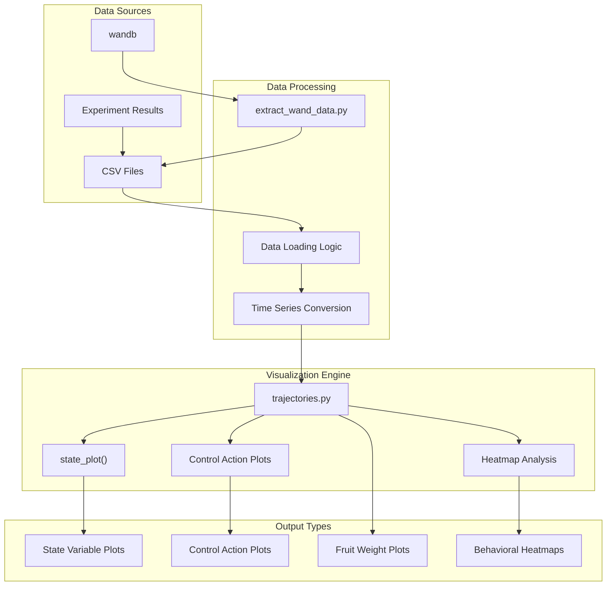
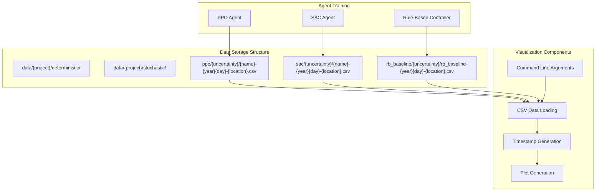
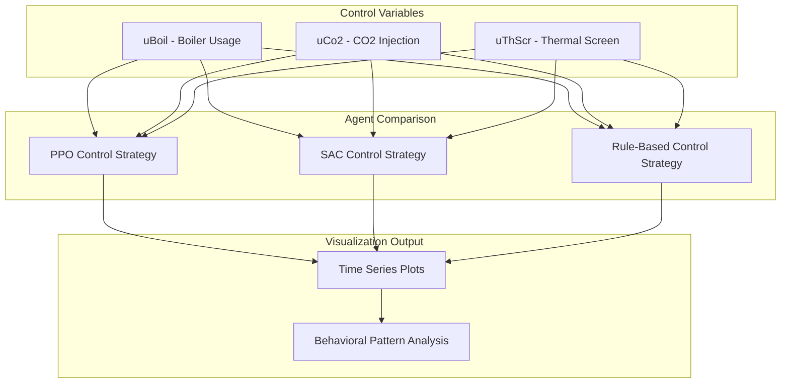

# 轨迹可视化

> **相关源文件**
> * [processing/extract_wand_data.py](https://github.com/BartvLaatum/GreenLight-Gym2/blob/f4a2727d/processing/extract_wand_data.py)
> * [visualisations/trajectories.py](https://github.com/BartvLaatum/GreenLight-Gym2/blob/f4a2727d/visualisations/trajectories.py)

本页面介绍用于分析和比较温室控制环境中不同强化学习智能体性能的轨迹可视化系统。该可视化工具能够对状态演变、控制动作以及智能体行为模式随时间的变化进行详细分析。

关于性能指标和成本分析的信息，请参见 [Performance Metrics](/BartvLaatum/GreenLight-Gym2/5.2-performance-metrics)。关于不确定性分析和鲁棒性测试的详细内容，请参见 [Uncertainty Analysis](/BartvLaatum/GreenLight-Gym2/5.3-uncertainty-analysis)。

## 系统概述

轨迹可视化系统提供了全面的绘图功能，用于分析温室控制智能体的性能。它支持在不同环境条件和时间段下，对不同类型智能体（PPO、SAC、基于规则）进行对比分析。



**来源**: [visualisations/trajectories.py L1-L191](https://github.com/BartvLaatum/GreenLight-Gym2/blob/f4a2727d/visualisations/trajectories.py#L1-L191)

 [processing/extract_wand_data.py L1-L61](https://github.com/BartvLaatum/GreenLight-Gym2/blob/f4a2727d/processing/extract_wand_data.py#L1-L61)

## 数据流架构

轨迹可视化系统遵循从实验追踪到可视化输出生成的结构化数据管道。



**来源**: [visualisations/trajectories.py L91-L118](https://github.com/BartvLaatum/GreenLight-Gym2/blob/f4a2727d/visualisations/trajectories.py#L91-L118)

## 可视化类型

### 状态变量绘制

`state_plot` 函数用于在不同时间段内对温室关键状态变量进行对比可视化。

| 变量 | 描述 | 约束范围 | 单位 |
| --- | --- | --- | --- |
| `temp_air` | 室内空气温度 | 15-34°C | °C |
| `rh_air` | 相对湿度 | 50-85% | % |
| `co2_air` | CO2 浓度 | 400-1600 ppm | ppm |

可视化系统会为三种智能体类型绘制上述变量，并以灰色虚线显示约束边界。

**来源**: [visualisations/trajectories.py L38-L76](https://github.com/BartvLaatum/GreenLight-Gym2/blob/f4a2727d/visualisations/trajectories.py#L38-L76)

### 控制动作分析

控制动作可视化展示了执行器指令随时间的变化，便于对不同智能体的控制策略进行对比分析。



**来源**: [visualisations/trajectories.py L121-L148](https://github.com/BartvLaatum/GreenLight-Gym2/blob/f4a2727d/visualisations/trajectories.py#L121-L148)

### 热力图分析

系统生成二维热力图，用于可视化状态变量与控制动作之间的关系，从而揭示不同智能体类型的行为模式。

**来源**: [visualisations/trajectories.py L163-L190](https://github.com/BartvLaatum/GreenLight-Gym2/blob/f4a2727d/visualisations/trajectories.py#L163-L190)

## 配置与使用

### 命令行接口

轨迹可视化脚本支持多种参数，用于指定数据源和可视化选项：

| 参数 | 类型 | 说明 |
| --- | --- | --- |
| `--project` | str | Weights & Biases 项目名称 |
| `--mode` | str | 仿真模式（deterministic/stochastic） |
| `--ppo_name` | str | PPO 模型标识符 |
| `--sac_name` | str | SAC 模型标识符 |
| `--growth_year` | str | 生长季年份 |
| `--start_day` | str | 年内起始天数 |
| `--location` | str | 天气地点标识符 |
| `--uncertainty_value` | str | 参数不确定性尺度 |
| `--n_days2plot` | int | 可视化天数 |

**来源**: [visualisations/trajectories.py L77-L88](https://github.com/BartvLaatum/GreenLight-Gym2/blob/f4a2727d/visualisations/trajectories.py#L77-L88)

### 数据文件组织

系统要求 CSV 轨迹数据按照分层目录结构进行组织：

```
data/
├── {project}/
│   ├── deterministic/
│   │   ├── ppo/{uncertainty}/{name}-{year}{day}-{location}.csv
│   │   ├── sac/{uncertainty}/{name}-{year}{day}-{location}.csv
│   │   └── rb_baseline/{uncertainty}/rb_baseline-{year}{day}-{location}.csv
│   └── stochastic/
│       └── [same structure as deterministic]
```

**来源**: [visualisations/trajectories.py L91-L106](https://github.com/BartvLaatum/GreenLight-Gym2/blob/f4a2727d/visualisations/trajectories.py#L91-L106)

## 绘图样式与配置

可视化系统采用了全面的 matplotlib 配置，以实现出版级别的高质量图表：

* 字体族：Computer Modern Roman (CMR10)
* 字体大小：所有元素均为 20pt
* 线宽：4pt，增强可视性
* 配色方案：PPO（#003366）、SAC（#A60000）、Rule-Based（灰色）
* 网格：关闭，保证图表简洁
* 坐标轴脊线：隐藏顶部和右侧脊线

**来源**: [visualisations/trajectories.py L9-L36](https://github.com/BartvLaatum/GreenLight-Gym2/blob/f4a2727d/visualisations/trajectories.py#L9-L36)

## 时间序列处理

系统将仿真步长转换为 datetime 对象，以便正确进行时间可视化：

1. 基准日期由生长季年份和起始天数计算得到
2. 步长以 900 秒（15 分钟）为间隔进行转换
3. 坐标轴标签的日期格式以天为单位显示

**来源**: [visualisations/trajectories.py L113-L116](https://github.com/BartvLaatum/GreenLight-Gym2/blob/f4a2727d/visualisations/trajectories.py#L113-L116)