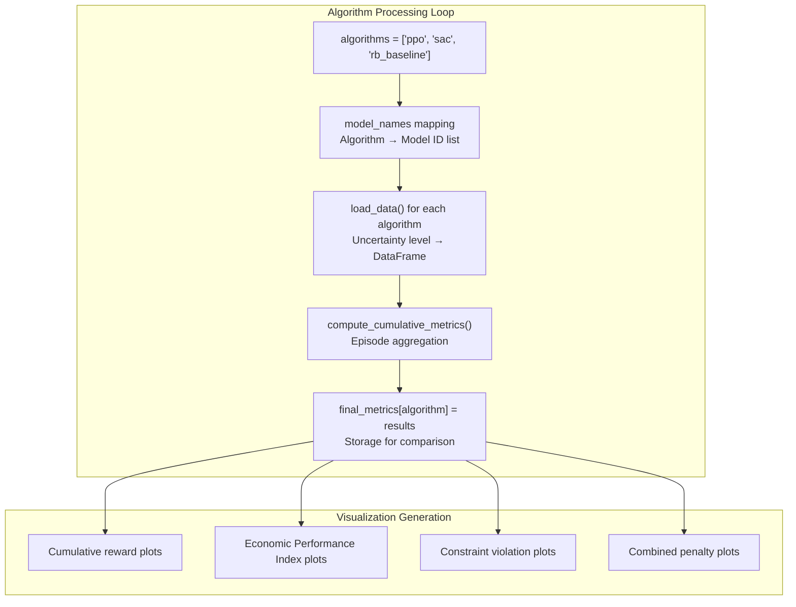

# 不确定性分析

> **相关源文件**
> * [visualisations/execution_times.py](https://github.com/BartvLaatum/GreenLight-Gym2/blob/f4a2727d/visualisations/execution_times.py)
> * [visualisations/learning_curve.py](https://github.com/BartvLaatum/GreenLight-Gym2/blob/f4a2727d/visualisations/learning_curve.py)
> * [visualisations/param_uncertainty.py](https://github.com/BartvLaatum/GreenLight-Gym2/blob/f4a2727d/visualisations/param_uncertainty.py)

## 目的与范围

本文档介绍了 GreenLight-Gym 中的不确定性分析功能，该功能支持对智能体鲁棒性和参数敏感性进行系统性测试。系统提供了参数不确定性注入、鲁棒性实验以及在不同模型不确定性水平下性能退化分析的工具。

关于不确定性下的轨迹可视化，请参见 [Trajectory Visualization](/BartvLaatum/GreenLight-Gym2/5.1-trajectory-visualization)。关于被分析的底层性能指标，请参见 [Performance Metrics](/BartvLaatum/GreenLight-Gym2/5.2-performance-metrics)。关于支持不确定性注入的参数管理系统细节，请参见 [Parameter Management](/BartvLaatum/GreenLight-Gym2/6.3-parameter-management)。

## 不确定性注入框架

系统通过分层实验结构实现参数不确定性，系统性地在不同噪声水平下变化模型参数。

```

```

来源: [visualisations/param_uncertainty.py L79-L102](https://github.com/BartvLaatum/GreenLight-Gym2/blob/f4a2727d/visualisations/param_uncertainty.py#L79-L102)

## 鲁棒性测试方法

不确定性分析系统通过标准化测试框架，在多种算法和不确定性水平下评估智能体性能。

### 算法对比

| 算法 | 目的 | 模型名称模式 |
| --- | --- | --- |
| PPO | Proximal Policy Optimization | `hopeful-wind-295`、`light-wave-296` 等 |
| SAC | Soft Actor-Critic | `distinctive-frost-299`、`stoic-moon-302` 等 |
| RB Baseline | 基于规则的基线 | `rb_baseline`（在所有噪声水平下保持一致） |

### 分析的指标

系统跟踪多个性能指标以评估鲁棒性：

```

```

来源: [visualisations/param_uncertainty.py L130-L155](https://github.com/BartvLaatum/GreenLight-Gym2/blob/f4a2727d/visualisations/param_uncertainty.py#L130-L155)

## 数据加载与组织

`load_data()` 函数实现了一个复杂的文件加载系统，用于处理不确定性实验的分层组织结构。

### 目录结构要求

系统要求特定的目录层级结构：

* `data/{project}/{mode}/{algorithm}/{noise_level}/`
* CSV 文件包含生长年份、起始天数和地点标识符
* 模型名称用于将特定训练模型与噪声水平进行匹配

### 文件筛选逻辑

数据加载过程会应用多重筛选条件，以选取合适的数据文件：

```

```

来源: [visualisations/param_uncertainty.py L43-L102](https://github.com/BartvLaatum/GreenLight-Gym2/blob/f4a2727d/visualisations/param_uncertainty.py#L43-L102)

## 累积指标计算

`compute_cumulative_metrics()` 函数处理每个 episode 的数据，在不确定性条件下生成最终性能统计。

### episode 级别处理

系统在 episode 层面处理数据，以反映随机性带来的变化：

1. **惩罚计算**：将所有约束违规合并为单一惩罚指标
2. **累积求和**：对每个 episode 内的数据使用 `groupby('episode')[col].cumsum()` 计算累计值
3. **提取最终值**：用 `groupby('episode')[col].last()` 获取每个 episode 的最后一个值
4. **统计聚合**：对所有 episode 计算均值和置信区间

### 置信区间计算

系统采用 3.291 作为置信区间倍数，以保证统计显著性：

```
final_rewards.loc[noise_level, f'std {col}'] = 3.291 * episode_finals.std() / np.sqrt(len(episode_finals))
```

这为不同不确定性水平下的性能对比提供了稳健的统计界限。

来源: [visualisations/param_uncertainty.py L129-L156](https://github.com/BartvLaatum/GreenLight-Gym2/blob/f4a2727d/visualisations/param_uncertainty.py#L129-L156)

## 可视化能力

不确定性分析系统通过 `plot_cumulative_reward()` 函数提供了全面的可视化功能。

### 绘图生成流程

```

```

### 支持的指标可视化

系统为关键性能指标生成可视化图表：

* **累计奖励**：整体经济表现
* **累计 EPI**：经济绩效指数（EU/m²）
* **温度违规**：温度约束违规频率
* **CO2 违规**：CO2 约束合规性
* **湿度违规**：相对湿度约束合规性
* **累计惩罚**：所有约束违规的综合惩罚成本

来源: [visualisations/param_uncertainty.py L104-L127](https://github.com/BartvLaatum/GreenLight-Gym2/blob/f4a2727d/visualisations/param_uncertainty.py#L104-L127)

 [visualisations/param_uncertainty.py L171-L176](https://github.com/BartvLaatum/GreenLight-Gym2/blob/f4a2727d/visualisations/param_uncertainty.py#L171-L176)

## 与实验管理的集成

不确定性分析通过命令行参数处理和标准化数据组织，与更广泛的实验框架集成。

### 命令行接口

系统支持多个关键参数，以实现灵活分析：

| 参数 | 作用 | 选项 |
| --- | --- | --- |
| `--project` | 指定项目目录 | 自定义项目名称 |
| `--mode` | 分析模式 | `deterministic` \| `stochastic` |
| `--growth_year` | 按生长年份筛选 | 年份标识字符串 |
| `--start_day` | 按起始天筛选 | 天数标识字符串 |
| `--location` | 按气象地点筛选 | 地点标识字符串 |

### 多算法分析

主分析循环会系统性地处理所有三种算法类型：



来源: [visualisations/param_uncertainty.py 第158-176行](https://github.com/BartvLaatum/GreenLight-Gym2/blob/f4a2727d/visualisations/param_uncertainty.py#L158-L176)

 [visualisations/param_uncertainty.py 第179-187行](https://github.com/BartvLaatum/GreenLight-Gym2/blob/f4a2727d/visualisations/param_uncertainty.py#L179-L187)