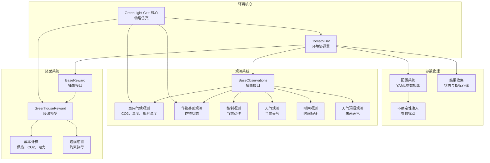
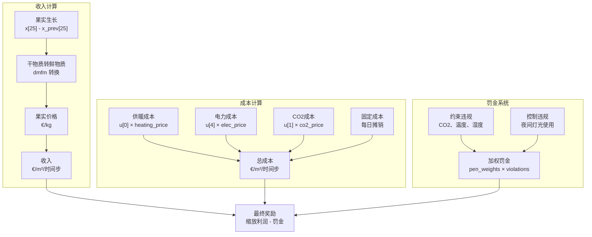
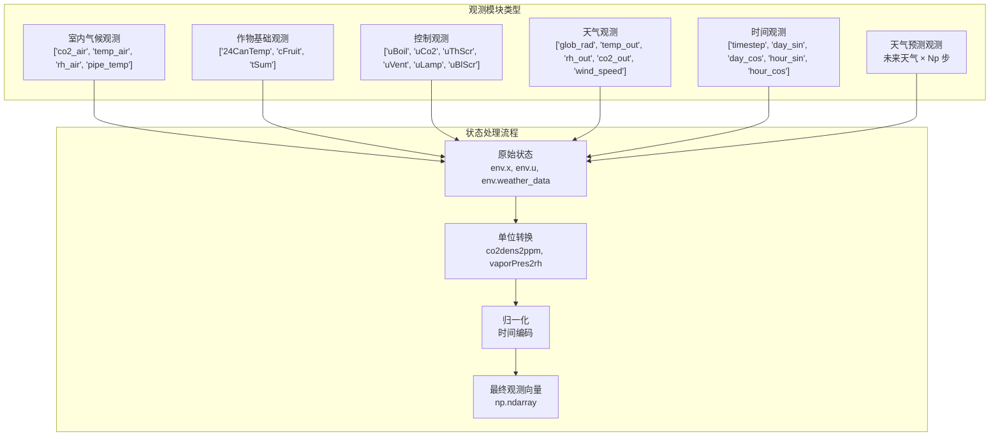
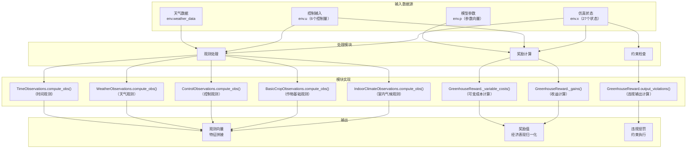

# 高级主题

> **相关源文件**
> * [gl_gym/environments/observations.py](https://github.com/BartvLaatum/GreenLight-Gym2/blob/f4a2727d/gl_gym/environments/observations.py)
> * [gl_gym/environments/rewards.py](https://github.com/BartvLaatum/GreenLight-Gym2/blob/f4a2727d/gl_gym/environments/rewards.py)

本节介绍构成 GreenLight-Gym 强化学习环境核心的复杂技术组件。这些高级系统负责处理实现温室控制仿真所需的复杂经济建模、多模态感知和参数管理。

本节内容侧重于实现细节和架构决策，适用于需要理解、修改或扩展核心系统的用户。关于智能体的基本用法和训练流程，请参见 [Reinforcement Learning](/BartvLaatum/GreenLight-Gym2/4-reinforcement-learning)。关于结果分析和性能指标，请参见 [Analysis and Visualization](/BartvLaatum/GreenLight-Gym2/5-analysis-and-visualization)。

## 系统集成架构

GreenLight-Gym 的高级组件采用模块化设计模式，专用子系统分别处理仿真环境的不同方面。核心集成通过 `TomatoEnv` 类实现，该类协调奖励计算、观测处理和参数管理等各个部分的交互。

**来源:** [gl_gym/environments/rewards.py L1-L232](https://github.com/BartvLaatum/GreenLight-Gym2/blob/f4a2727d/gl_gym/environments/rewards.py#L1-L232)

 [gl_gym/environments/observations.py L1-L182](https://github.com/BartvLaatum/GreenLight-Gym2/blob/f4a2727d/gl_gym/environments/observations.py#L1-L182)

## 经济建模框架

奖励系统实现了一个全面的经济模型，能够反映温室运营中的真实财务考量。`GreenhouseReward` 类是主要的实现方式，其通过作物收入与运营成本的差额来计算利润。

| 成本类别 | 组成部分 | 计算方法 |
| --- | --- | --- |
| 固定成本 | 温室、CO2系统、灯具、遮阳帘 | 年度成本按时间步长分摊 |
| 变动成本 | 供热、电力、CO2施用 | 能耗 × 单价 |
| 收入 | 果实产量 | 生长速率 × 单价（€/kg） |
| 罚金 | 约束违规、控制违规 | 加权罚金函数 |

**来源:** [gl_gym/environments/rewards.py L22-L232](https://github.com/BartvLaatum/GreenLight-Gym2/blob/f4a2727d/gl_gym/environments/rewards.py#L22-L232)

 [gl_gym/environments/rewards.py L172-L184](https://github.com/BartvLaatum/GreenLight-Gym2/blob/f4a2727d/gl_gym/environments/rewards.py#L172-L184)

 [gl_gym/environments/rewards.py L218-L231](https://github.com/BartvLaatum/GreenLight-Gym2/blob/f4a2727d/gl_gym/environments/rewards.py#L218-L231)

## 多模态观测架构

观测系统采用模块化设计，不同的观测模块负责捕捉温室环境的不同方面。每个模块都实现了 `BaseObservations` 接口，并且可以组合使用，以构建全面的状态表示。

**来源:** [gl_gym/environments/observations.py L59-L182](https://github.com/BartvLaatum/GreenLight-Gym2/blob/f4a2727d/gl_gym/environments/observations.py#L59-L182)

 [gl_gym/environments/observations.py L70-L77](https://github.com/BartvLaatum/GreenLight-Gym2/blob/f4a2727d/gl_gym/environments/observations.py#L70-L77)

 [gl_gym/environments/observations.py L149-L161](https://github.com/BartvLaatum/GreenLight-Gym2/blob/f4a2727d/gl_gym/environments/observations.py#L149-L161)

## 数据流与处理流程

高级系统通过结构化的流水线处理信息，将原始仿真数据转化为对强化学习智能体有意义的观测和奖励。

**来源：** [gl_gym/environments/observations.py L70-L112](https://github.com/BartvLaatum/GreenLight-Gym2/blob/f4a2727d/gl_gym/environments/observations.py#L70-L112)

 [gl_gym/environments/rewards.py L172-L231](https://github.com/BartvLaatum/GreenLight-Gym2/blob/f4a2727d/gl_gym/environments/rewards.py#L172-L231)

## 详细组件覆盖

以下小节为每个高级系统组件提供了全面的技术文档：

* **[奖励系统](/BartvLaatum/GreenLight-Gym2/6.1-reward-system)**：经济建模、成本计算、约束违规和利润优化
* **[观测系统](/BartvLaatum/GreenLight-Gym2/6.2-observation-system)**：多模态传感模块、状态处理和特征工程
* **[参数管理](/BartvLaatum/GreenLight-Gym2/6.3-parameter-management)**：配置处理、不确定性注入和模型参数控制
* **[工具与实用程序](/BartvLaatum/GreenLight-Gym2/6.4-utilities-and-tools)**：用于数据处理、状态初始化和系统工具的支持函数

每个小节都包含了详细的实现细节、配置选项，以及为使用 GreenLight-Gym 框架的研究人员和开发者提供的扩展指导。

**来源：** [gl_gym/environments/rewards.py L1-L232](https://github.com/BartvLaatum/GreenLight-Gym2/blob/f4a2727d/gl_gym/environments/rewards.py#L1-L232)

 [gl_gym/environments/observations.py L1-L182](https://github.com/BartvLaatum/GreenLight-Gym2/blob/f4a2727d/gl_gym/environments/observations.py#L1-L182)