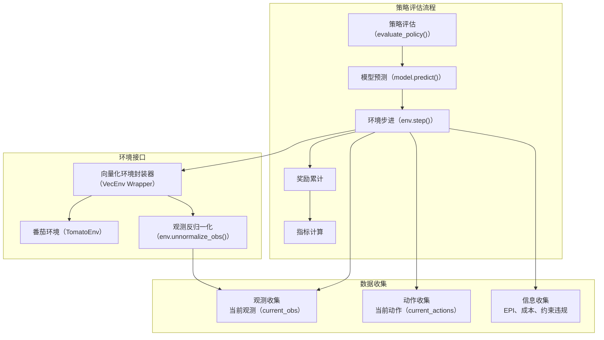
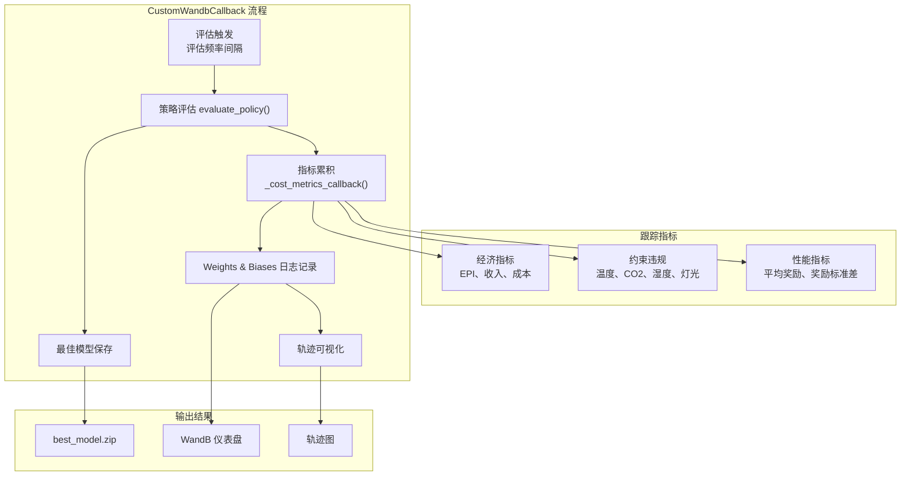
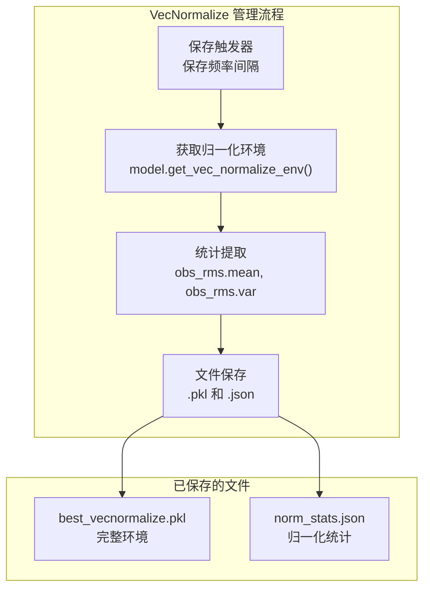
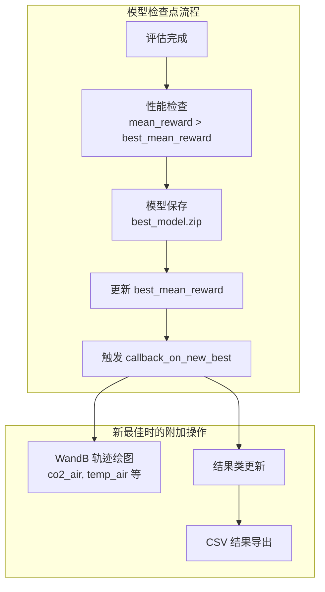

# 评估与回调

> **相关源文件**
> * [gl_gym/common/callbacks.py](https://github.com/BartvLaatum/GreenLight-Gym2/blob/f4a2727d/gl_gym/common/callbacks.py)
> * [gl_gym/common/evaluation.py](https://github.com/BartvLaatum/GreenLight-Gym2/blob/f4a2727d/gl_gym/common/evaluation.py)
> * [tests/env_test.py](https://github.com/BartvLaatum/GreenLight-Gym2/blob/f4a2727d/tests/env_test.py)
> * [visualisations/inspect_mat.py](https://github.com/BartvLaatum/GreenLight-Gym2/blob/f4a2727d/visualisations/inspect_mat.py)

本文档介绍了用于在训练过程中监控、跟踪和分析强化学习智能体表现的评估与回调系统。该系统提供了全面的评估指标、模型检查点保存、通过 Weights & Biases 进行实验追踪，以及用于特殊监控需求的自定义回调机制。

关于智能体配置和训练流程的详细信息，请参见 [Training Process](/BartvLaatum/GreenLight-Gym2/4.2-training-process)。关于训练后分析与可视化工具，请参见 [Analysis and Visualization](/BartvLaatum/GreenLight-Gym2/5-analysis-and-visualization)。

## 策略评估系统

核心评估功能由 `evaluate_policy` 函数实现，该函数为不同环境和智能体类型提供标准化的策略评估。此函数在 Stable Baselines3 的评估能力基础上，增加了环境特定的指标收集功能。

评估系统支持单环境和向量化环境，能够自动将评估回合分配到并行的环境实例中，以实现无偏的评估。

**主要特性：**

* **基于回合的评估**：运行完整回合以收集有意义的性能指标
* **向量化环境支持**：将评估回合分配到多个环境实例中并行执行
* **观测与动作追踪**：记录完整轨迹，便于评估后分析
* **自定义回调集成**：允许注入专门的监控逻辑

来源: [gl_gym/common/evaluation.py L10-L166](https://github.com/BartvLaatum/GreenLight-Gym2/blob/f4a2727d/gl_gym/common/evaluation.py#L10-L166)

## 自定义回调框架

该系统实现了两个主要的回调类，扩展了 Stable Baselines3 的回调功能，具备领域特定的监控与追踪能力。

### WandB 集成回调

`CustomWandbCallback` 类通过 Weights & Biases 集成，提供了全面的实验追踪，并在 `EvalCallback` 的基础上扩展了温室相关的指标与可视化功能。

**跟踪指标：**

| 指标类别 | 具体指标 | 目的 |
| --- | --- | --- |
| 经济表现 | `EPI`, `revenue`, `variable_costs`, `fixed_costs` | 跟踪盈利能力和运营效率 |
| 能源成本 | `co2_cost`, `heat_cost`, `elec_cost` | 监控资源消耗成本 |
| 约束违规 | `temp_violation`, `co2_violation`, `rh_violation`, `lamp_violation` | 确保环境参数合规 |
| 训练表现 | `mean_reward`, `std_reward` | 监控学习进展 |

来源: [gl_gym/common/callbacks.py L21-L256](https://github.com/BartvLaatum/GreenLight-Gym2/blob/f4a2727d/gl_gym/common/callbacks.py#L21-L256)

### VecNormalize 回调

`SaveVecNormalizeCallback` 负责自动保存观测归一化统计数据，这对于保持评估和部署条件的一致性至关重要。

该回调通过保存训练期间使用的精确归一化参数，确保评估过程的可复现性。

来源: [gl_gym/common/callbacks.py L258-L306](https://github.com/BartvLaatum/GreenLight-Gym2/blob/f4a2727d/gl_gym/common/callbacks.py#L258-L306)

## 评估指标收集

评估系统通过 `_cost_metrics_callback` 函数捕获详细的性能指标，该函数会累积每个回合的信息，以实现全面的性能评估。

**指标累积流程：**

1. **回合信息提取**：从 `env.step()` 的 info 字典中提取性能数据
2. **累计追踪**：在所有评估回合中维护累计总和
3. **统计计算**：计算均值和标准差用于报告
4. **日志集成**：将指标同时发送到 Tensorboard 和 WandB

**关键实现细节：**

* 指标按回合累积，并在所有评估回合中取平均
* 系统同时处理标量指标（奖励、成本）和约束违规计数
* 所有指标均以 `eval/` 前缀记录，便于在追踪面板中清晰识别

来源: [gl_gym/common/callbacks.py L65-L88](https://github.com/BartvLaatum/GreenLight-Gym2/blob/f4a2727d/gl_gym/common/callbacks.py#L65-L88)

 [gl_gym/common/callbacks.py L154-L175](https://github.com/BartvLaatum/GreenLight-Gym2/blob/f4a2727d/gl_gym/common/callbacks.py#L154-L175)

## 模型检查点与最佳模型选择

回调系统基于评估表现实现智能模型检查点，确保最佳表现的模型能够被自动保存。

**检查点逻辑：**

* **性能比较**：将当前评估表现与历史最佳进行比较
* **自动保存**：对取得新纪录的模型进行保存
* **路径管理**：以一致的命名规范组织保存的模型
* **回调链式触发**：当发现新最佳模型时，触发额外的回调操作

系统以 Stable Baselines3 的标准格式（`.zip` 文件）保存模型，并在训练过程中同时维护最新检查点和最佳表现模型。

Sources: [gl_gym/common/callbacks.py L186-L210](https://github.com/BartvLaatum/GreenLight-Gym2/blob/f4a2727d/gl_gym/common/callbacks.py#L186-L210)

## 与训练流程的集成

回调系统能够无缝集成到更广泛的训练基础设施中，为不同类型的智能体和实验配置提供一致的监控能力。

**集成点：**

* **实验管理器**：通过实验管理系统配置回调，并将其传递给训练算法
* **配置系统**：回调参数（如评估频率、保存路径）在 YAML 配置文件中指定
* **结果管理**：评估结果会自动集成到结果收集系统中，便于训练后分析

模块化设计便于扩展，可以根据温室控制的特定监控需求，轻松添加自定义回调。

Sources: [gl_gym/common/callbacks.py L27-L64](https://github.com/BartvLaatum/GreenLight-Gym2/blob/f4a2727d/gl_gym/common/callbacks.py#L27-L64)