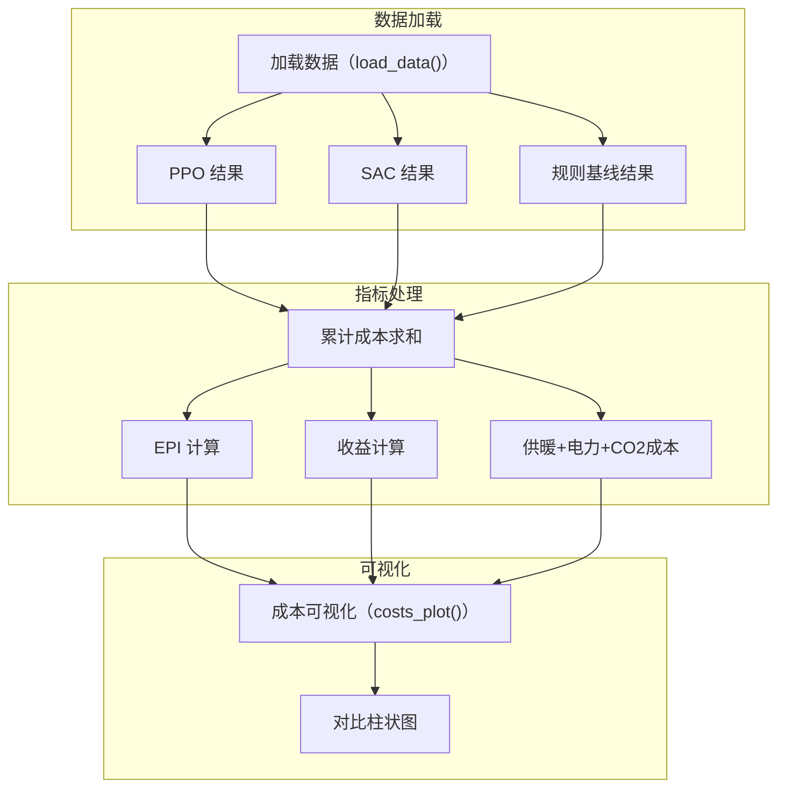
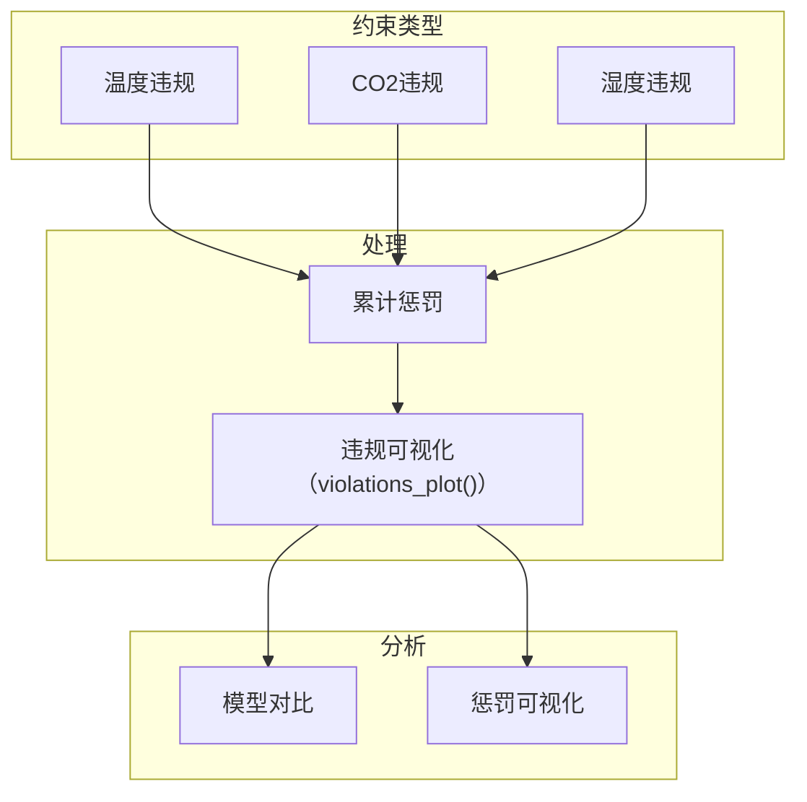
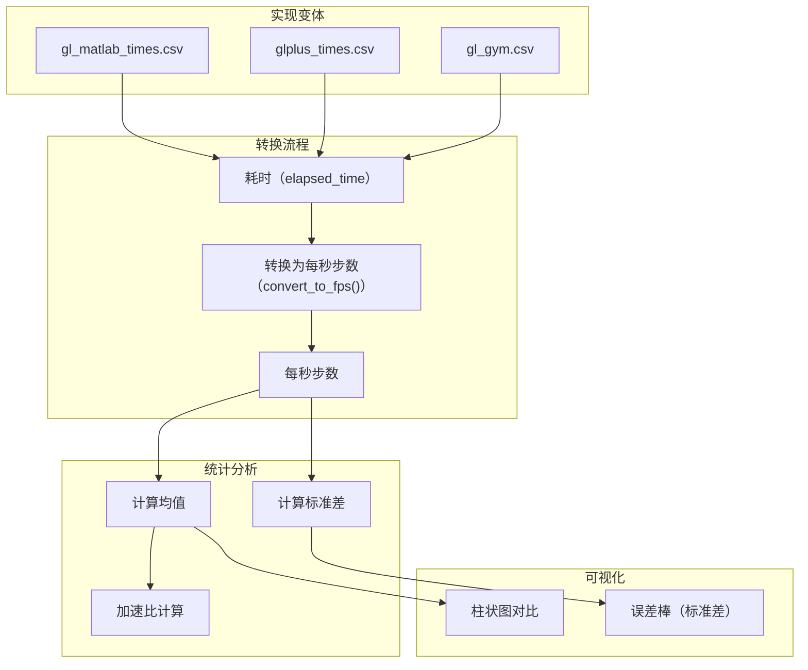
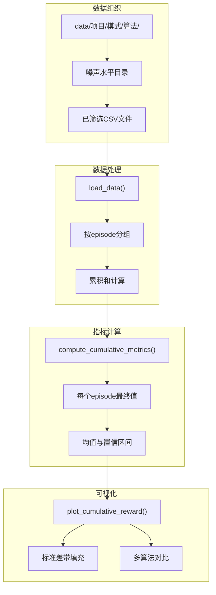

# 性能指标

> **相关源文件**
> * [visualisations/cost_metrics.py](https://github.com/BartvLaatum/GreenLight-Gym2/blob/f4a2727d/visualisations/cost_metrics.py)
> * [visualisations/execution_times.py](https://github.com/BartvLaatum/GreenLight-Gym2/blob/f4a2727d/visualisations/execution_times.py)
> * [visualisations/param_uncertainty.py](https://github.com/BartvLaatum/GreenLight-Gym2/blob/f4a2727d/visualisations/param_uncertainty.py)

本文档介绍了用于评估 GreenLight-Gym 环境中已训练强化学习智能体的性能分析与可视化工具。性能指标系统提供了全面的经济分析、约束违规追踪、执行时间对比，以及参数不确定性下的鲁棒性评估。

关于轨迹分析与状态可视化，请参见 [Trajectory Visualization](/BartvLaatum/GreenLight-Gym2/5.1-trajectory-visualization)。关于训练过程中的不确定性注入，请参见 [Uncertainty Analysis](/BartvLaatum/GreenLight-Gym2/5.3-uncertainty-analysis)。

## 经济性能分析

经济性能指标通过跟踪成本、收益和经济绩效指数（EPI），评估温室控制策略的经济可行性。主要指标包括：

| 指标 | 描述 | 单位 |
| --- | --- | --- |
| `EPI` | 经济绩效指数 | EU/m² |
| `Revenue` | 作物销售收入 | EU/m² |
| `Heat costs` | 供暖系统费用 | EU/m² |
| `Elec costs` | 电力消耗费用 | EU/m² |
| `CO2 costs` | 二氧化碳注入费用 | EU/m² |

### 成本指标计算



`costs_plot()`函数对不同模型的指标进行汇总，并生成对比可视化图表。每个模型的表现会在所有回合中进行累加，以提供累计成本分析。

来源: [visualisations/cost_metrics.py L67-L101](https://github.com/BartvLaatum/GreenLight-Gym2/blob/f4a2727d/visualisations/cost_metrics.py#L67-L101)

## 约束违规分析

系统会跟踪对作物健康和法规合规至关重要的环境约束违规情况。主要监控三类违规类型：

### 违规指标



违规情况以累计惩罚的形式计算，从而可以比较不同智能体类型在约束遵守方面的表现。`violations_plot()`函数会生成对比柱状图，展示温度、CO2和相对湿度违规的累计惩罚情况。

来源: [visualisations/cost_metrics.py L103-L137](https://github.com/BartvLaatum/GreenLight-Gym2/blob/f4a2727d/visualisations/cost_metrics.py#L103-L137)

## 执行性能对比

执行性能分析用于比较不同GreenLight实现的计算效率。系统通过测量每秒步数（steps per second）来量化其实时性能能力。

### 性能基准测试流程



`convert_to_fps()` 函数将执行时间转换为每秒步数，使用的公式为：`fps = 1 / (elapsed_time / n_steps)`，其中 `n_steps = 10 * 24 * 12` 表示仿真的总步数。

来源: [visualisations/execution_times.py L39-L86](https://github.com/BartvLaatum/GreenLight-Gym2/blob/f4a2727d/visualisations/execution_times.py#L39-L86)

## 不确定性与鲁棒性分析

参数不确定性分析评估了在模型参数扰动不同程度下，智能体的性能表现。这一评估对于理解在具有模型不确定性的真实场景中部署时的鲁棒性至关重要。

### 不确定性分析流程



### 累积指标计算

系统会在每个episode中计算累积指标，以实现全面的性能评估：

```
columns_to_sum = [
    'cFruit', 'Rewards', 'EPI', 'Revenue', 'Heat costs', 'CO2 costs',
    'Elec costs', 'temp_violation', 'co2_violation', 'rh_violation', 'Penalty'
]
```

`compute_cumulative_metrics()`函数会处理每个噪声水平下的数据，先在每个episode内计算累积和，然后聚合每个episode的最终值，并用如下公式计算置信区间：`confidence_interval = 3.291 * std / sqrt(n_episodes)`。

来源: [visualisations/param_uncertainty.py L129-L156](https://github.com/BartvLaatum/GreenLight-Gym2/blob/f4a2727d/visualisations/param_uncertainty.py#L129-L156)

 [visualisations/param_uncertainty.py L43-L102](https://github.com/BartvLaatum/GreenLight-Gym2/blob/f4a2727d/visualisations/param_uncertainty.py#L43-L102)

## 可视化配置

性能指标可视化系统采用标准化绘图配置，以确保输出达到发表级别。主要配置参数如下：

| 参数 | 值 | 作用 |
| --- | --- | --- |
| `svg.fonttype` | "path" | 将文本转为路径以保证兼容性 |
| `font.family` | "serif" | 适合期刊的字体选择 |
| `font.size` | 8 | 保持文本大小一致 |
| `axes.linewidth` | 1.5 | 增强坐标轴可见性 |
| `dpi` | 300 | 高分辨率输出 |

绘图系统支持SVG和PNG两种输出格式，并在所有指标可视化函数中保持一致的风格。

来源: [visualisations/cost_metrics.py L8-L40](https://github.com/BartvLaatum/GreenLight-Gym2/blob/f4a2727d/visualisations/cost_metrics.py#L8-L40)

 [visualisations/execution_times.py L6-L38](https://github.com/BartvLaatum/GreenLight-Gym2/blob/f4a2727d/visualisations/execution_times.py#L6-L38)

 [visualisations/param_uncertainty.py L8-L42](https://github.com/BartvLaatum/GreenLight-Gym2/blob/f4a2727d/visualisations/param_uncertainty.py#L8-L42)

## 数据加载与文件组织

性能指标系统要求数据采用分层结构组织：

```
data/
├── {project}/
│   ├── deterministic/
│   │   ├── ppo/
│   │   ├── sac/
│   │   └── rb_baseline/
│   └── stochastic/
│       ├── ppo/
│       │   ├── 0.0/
│       │   ├── 0.1/
│       │   └── ...
│       ├── sac/
│       └── rb_baseline/
```

数据加载函数会根据生长年份、起始日期和地点等参数筛选CSV文件，从而确保在不同实验条件下进行一致性比较。

来源: [visualisations/cost_metrics.py L41-L65](https://github.com/BartvLaatum/GreenLight-Gym2/blob/f4a2727d/visualisations/cost_metrics.py#L41-L65)

 [visualisations/param_uncertainty.py L43-L102](https://github.com/BartvLaatum/GreenLight-Gym2/blob/f4a2727d/visualisations/param_uncertainty.py#L43-L102)