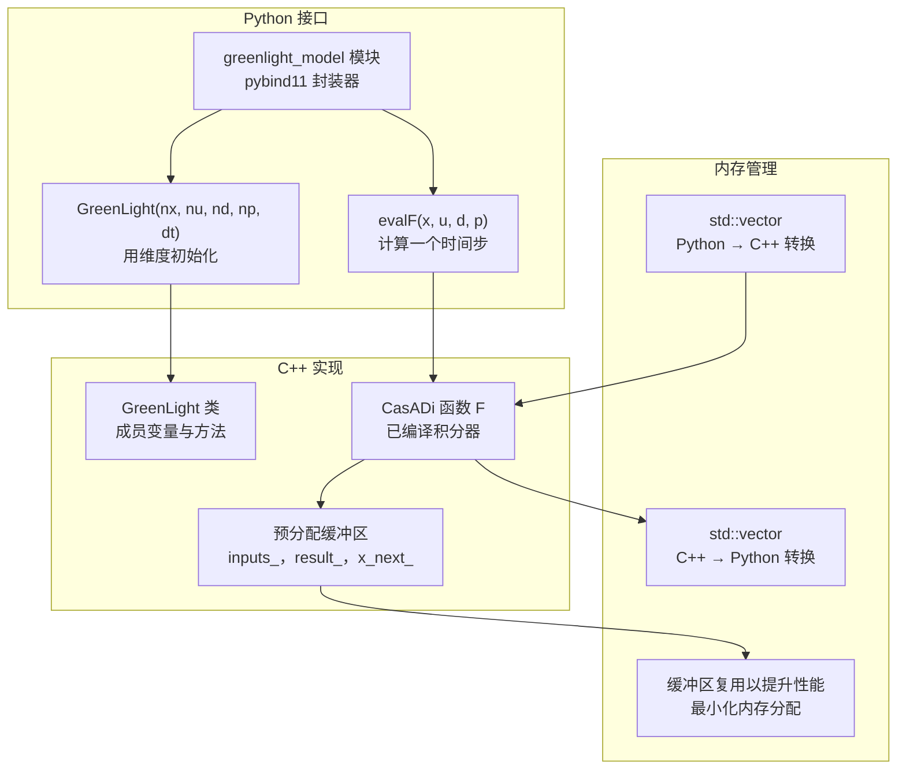

# 仿真核心

> **相关源文件**
> * [gl_gym/environments/models/aux_states.hpp](https://github.com/BartvLaatum/GreenLight-Gym2/blob/f4a2727d/gl_gym/environments/models/aux_states.hpp)
> * [gl_gym/environments/models/greenlight_model.cpp](https://github.com/BartvLaatum/GreenLight-Gym2/blob/f4a2727d/gl_gym/environments/models/greenlight_model.cpp)
> * [gl_gym/environments/models/ode.hpp](https://github.com/BartvLaatum/GreenLight-Gym2/blob/f4a2727d/gl_gym/environments/models/ode.hpp)
> * [gl_gym/environments/weather/Bleiswijk/GL2009.csv](https://github.com/BartvLaatum/GreenLight-Gym2/blob/f4a2727d/gl_gym/environments/weather/Bleiswijk/GL2009.csv)
> * [processing/merge_controls_pipe_temp.py](https://github.com/BartvLaatum/GreenLight-Gym2/blob/f4a2727d/processing/merge_controls_pipe_temp.py)

仿真核心是 GreenLight-Gym 的计算基础，采用 C++ 库结合 CasADi 符号计算实现物理温室模型。该模块负责温室动态的数值积分，包括气候控制、作物生长和能量平衡。关于封装此核心的 Python 环境接口，请参见 [环境接口](/BartvLaatum/GreenLight-Gym2/3.2-environment-interface)。关于参数配置的详细信息，请参见 [参数管理](/BartvLaatum/GreenLight-Gym2/6.3-parameter-management)。

## 架构概览

仿真核心基于 CasADi 的符号计算框架，求解描述温室动态的 28 个常微分方程系统。核心由三个主要部分组成：符号模型定义、数值积分和 Python 绑定。

```

```

**来源：** [gl_gym/environments/models/greenlight_model.cpp L13-L136](https://github.com/BartvLaatum/GreenLight-Gym2/blob/f4a2727d/gl_gym/environments/models/greenlight_model.cpp#L13-L136)

 [gl_gym/environments/models/ode.hpp L6-L125](https://github.com/BartvLaatum/GreenLight-Gym2/blob/f4a2727d/gl_gym/environments/models/ode.hpp#L6-L125)

 [gl_gym/environments/models/aux_states.hpp L96-L1700](https://github.com/BartvLaatum/GreenLight-Gym2/blob/f4a2727d/gl_gym/environments/models/aux_states.hpp#L96-L1700)

## CasADi 集成与符号计算

仿真利用 CasADi 的自动微分和即时编译（JIT）实现高效的数值计算。`GreenLight` 类的构造函数负责搭建符号框架并编译优化后的函数。

```

```

符号设置在构造函数中完成，并启用 JIT 编译以提升性能：

```
// JIT compilation options for optimized execution
opts["jit"] = true;
opts["compiler"] = "shell";
opts["abstol"] = 1e-6;
opts["reltol"] = 1e-6;
jit_options["flags"] = "-O3";
```

**来源：** [gl_gym/environments/models/greenlight_model.cpp L46-L63](https://github.com/BartvLaatum/GreenLight-Gym2/blob/f4a2727d/gl_gym/environments/models/greenlight_model.cpp#L46-L63)

 [gl_gym/environments/models/greenlight_model.cpp L96-L120](https://github.com/BartvLaatum/GreenLight-Gym2/blob/f4a2727d/gl_gym/environments/models/greenlight_model.cpp#L96-L120)

## 状态变量与系统动力学

温室模型跟踪28个状态变量，分别代表不同的物理量。`ode.hpp` 中的 `ODE` 函数定义了每个状态的时间导数。

| 状态索引 | 变量名 | 描述 | 单位 |
| --- | --- | --- | --- |
| 0-1 | `co2Air`, `co2Top` | CO2 浓度 | mg m⁻³ |
| 2-3 | `tAir`, `tTop` | 空气温度 | °C |
| 4-8 | `tCan`, `tCovIn`, `tCovE`, `tThScr`, `tFlr` | 各表面温度 | °C |
| 9 | `tPipe` | 管道温度 | °C |
| 10-14 | `tSo1`-`tSo5` | 土壤分层温度 | °C |
| 15-16 | `vpAir`, `vpTop` | 水汽压 | Pa |
| 17-20 | `tLamp`, `tIntLamp`, `tGroPipe`, `tBlScr` | 设备温度 | °C |
| 21 | `tCan24` | 24小时平均冠层温度 | °C |
| 22-25 | `cBuf`, `cLeaf`, `cStem`, `cFruit` | 碳水化合物库 | mg m⁻² |
| 26-27 | `tCanSum`, `time` | 发育阶段，仿真时间 | °C·天, 天 |

```

```

**来源：** [gl_gym/environments/models/ode.hpp L12-L123](https://github.com/BartvLaatum/GreenLight-Gym2/blob/f4a2727d/gl_gym/environments/models/ode.hpp#L12-L123)

## 辅助状态量计算

`aux_states.hpp` 中的 `update` 函数计算239个辅助变量，这些变量代表 ODE 计算所需的中间物理量，包括热通量、辐射计算和质量传递系数等。

```

```

主要辅助函数实现了具体的物理关系：

* `satVP(temp)`：饱和水汽压计算
* `fir(a1, eps1, eps2, f12, t1, t2, sigma)`：远红外辐射交换
* `sensible(hec, t1, t2)`：显热传递
* `airMv(f12, vp1, vp2, t1, t2)`：空气流动下的水汽通量

**来源：** [gl_gym/environments/models/aux_states.hpp L5-L94](https://github.com/BartvLaatum/GreenLight-Gym2/blob/f4a2727d/gl_gym/environments/models/aux_states.hpp#L5-L94)

 [gl_gym/environments/models/aux_states.hpp L96-L1700](https://github.com/BartvLaatum/GreenLight-Gym2/blob/f4a2727d/gl_gym/environments/models/aux_states.hpp#L96-L1700)

## 控制输入与扰动

仿真接受6个控制输入，以及多个代表气象条件的扰动信号。

```mermaid
flowchart TD

u0["u[0]: uBoil<br>锅炉阀门"]
u1["u[1]: uCo2<br>二氧化碳注入"]
u2["u[2]: uThScr<br>保温幕"]
u3["u[3]: uVent<br>屋顶通风"]
u4["u[4]: uLamp<br>灯光强度"]
u5["u[5]: uBlScr<br>遮光幕"]
d0["d[0]: iGlob<br>全球辐射"]
d1["d[1]: tOut<br>室外温度"]
d2["d[2]: vpOut<br>室外水汽压"]
d4["d[4]: wind<br>风速"]
d5["d[5]: tSky<br>天空温度"]
d6["d[6]: tSoOut<br>土壤温度"]
d10["d[10]: tPipe<br>管道设定温度"]
Physical["物理常数<br>材料属性、热容等"]
Geometric["几何参数<br>面积、尺寸"]
Crop["作物参数<br>生长系数"]
ODE_System["ODE系统<br>28个微分方程"]

u0 --> ODE_System
u1 --> ODE_System
u2 --> ODE_System
u3 --> ODE_System
u4 --> ODE_System
u5 --> ODE_System
d0 --> ODE_System
d1 --> ODE_System
d2 --> ODE_System
d4 --> ODE_System
d5 --> ODE_System
d6 --> ODE_System
d10 --> ODE_System
Physical --> ODE_System
Geometric --> ODE_System
Crop --> ODE_System

subgraph subGraph2 ["参数向量 p[]"]
    Physical
    Geometric
    Crop
end

subgraph subGraph1 ["扰动向量 d[]"]
    d0
    d1
    d2
    d4
    d5
    d6
    d10
end

subgraph subGraph0 ["控制向量 u[6]"]
    u0
    u1
    u2
    u3
    u4
    u5
end
```



**来源:** [gl_gym/environments/models/aux_states.hpp L98-L105](https://github.com/BartvLaatum/GreenLight-Gym2/blob/f4a2727d/gl_gym/environments/models/aux_states.hpp#L98-L105)

 [gl_gym/environments/weather/Bleiswijk/GL2009.csv L1-L2](https://github.com/BartvLaatum/GreenLight-Gym2/blob/f4a2727d/gl_gym/environments/weather/Bleiswijk/GL2009.csv#L1-L2)

## Python 绑定接口

C++仿真核心通过 pybind11 暴露给 Python，为强化学习环境提供了无缝接口。



绑定定义创建了一个可供 Python 访问的接口：

```yaml
PYBIND11_MODULE(greenlight_model, m) {
    m.doc() = "Pybind11 plugin for stiff ODE system with Boost Odeint and Eigen AutoDiff";
    
    py::class_<GreenLight>(m, "GreenLight")
        .def(py::init<uint8_t, uint8_t, uint8_t, uint16_t, float>())
        .def("evalF", &GreenLight::evalF);
}
```

`evalF` 方法通过预先分配的缓冲区，实现了高效的基于向量的计算，从而在仿真过程中最大限度地减少了内存分配的开销。

**来源：** [gl_gym/environments/models/greenlight_model.cpp L130-L136](https://github.com/BartvLaatum/GreenLight-Gym2/blob/f4a2727d/gl_gym/environments/models/greenlight_model.cpp#L130-L136)

 [gl_gym/environments/models/greenlight_model.cpp L21-L25](https://github.com/BartvLaatum/GreenLight-Gym2/blob/f4a2727d/gl_gym/environments/models/greenlight_model.cpp#L21-L25)

 [gl_gym/environments/models/greenlight_model.cpp L96-L120](https://github.com/BartvLaatum/GreenLight-Gym2/blob/f4a2727d/gl_gym/environments/models/greenlight_model.cpp#L96-L120)