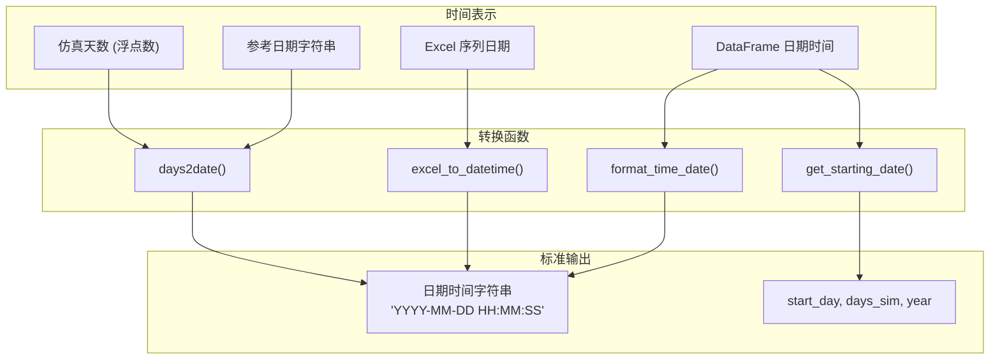
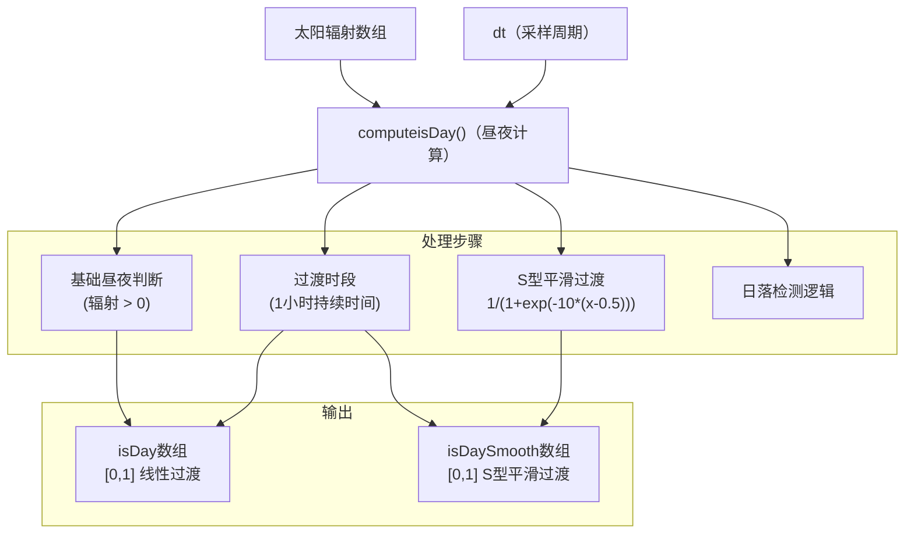
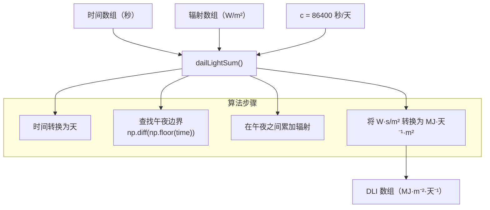

# 工具与实用程序

> **相关源文件**
> * [.gitignore](https://github.com/BartvLaatum/GreenLight-Gym2/blob/f4a2727d/.gitignore)
> * [gl_gym/common/utils.py](https://github.com/BartvLaatum/GreenLight-Gym2/blob/f4a2727d/gl_gym/common/utils.py)
> * [gl_gym/environments/utils.py](https://github.com/BartvLaatum/GreenLight-Gym2/blob/f4a2727d/gl_gym/environments/utils.py)

本页面记录了支持 GreenLight-Gym 核心功能的实用函数和辅助工具。这些工具涵盖了环境初始化、气象数据处理、大气物理计算以及配置管理。关于参数管理和模型常量的信息，请参见 [参数管理](/BartvLaatum/GreenLight-Gym2/6.3-parameter-management)。关于观测与奖励系统的实现细节，请参见 [观测系统](/BartvLaatum/GreenLight-Gym2/6.2-observation-system) 和 [奖励系统](/BartvLaatum/GreenLight-Gym2/6.1-reward-system)。

## 系统架构

实用工具层为 GreenLight-Gym 系统提供了关键的支持功能，连接原始数据输入与仿真环境之间的桥梁。

### 工具模块结构

```

```

**来源：** [gl_gym/environments/utils.py L1-L466](https://github.com/BartvLaatum/GreenLight-Gym2/blob/f4a2727d/gl_gym/environments/utils.py#L1-L466)

 [gl_gym/common/utils.py L1-L580](https://github.com/BartvLaatum/GreenLight-Gym2/blob/f4a2727d/gl_gym/common/utils.py#L1-L580)

## 状态初始化

状态初始化工具为温室仿真准备物理一致的初始条件。

### 初始状态设置

`init_state()` 函数会创建一个包含 28 个元素的状态向量，代表温室的所有舱室和变量：

| 状态索引 | 变量 | 描述 | 单位 |
| --- | --- | --- | --- |
| 0-1 | CO2（空气、顶部） | CO2 浓度 | mg m⁻³ |
| 2-6 | 温度区 | 空气、顶部、冠层、覆盖层 | °C |
| 7-14 | 热质量 | 屏幕、地板、管道、土壤层 | °C |
| 15-16 | 蒸汽压 | 空气、顶部舱室 | Pa |
| 17-20 | 设备温度 | 灯、管道、屏幕 | °C |
| 21-26 | 植物生物量 | 冠层温度、缓冲区、叶、茎、果实 | 多种 |
| 27 | 时间 | 仿真时间 | 天 |

```

```

**来源：** [gl_gym/environments/utils.py L13-L46](https://github.com/BartvLaatum/GreenLight-Gym2/blob/f4a2727d/gl_gym/environments/utils.py#L13-L46)

## 天气数据处理

天气数据处理将原始气象数据转换为 GreenLight 仿真核心所需的格式。

### 天气数据处理流程

```

```

**来源：** [gl_gym/environments/utils.py L48-L125](https://github.com/BartvLaatum/GreenLight-Gym2/blob/f4a2727d/gl_gym/environments/utils.py#L48-L125)

 [gl_gym/environments/utils.py L127-L154](https://github.com/BartvLaatum/GreenLight-Gym2/blob/f4a2727d/gl_gym/environments/utils.py#L127-L154)

### 数据扩展与插值

当仿真时长超过可用气象数据长度时，系统会自动加载并追加后续年份的数据：

```

```

**来源：** [gl_gym/environments/utils.py L127-L154](https://github.com/BartvLaatum/GreenLight-Gym2/blob/f4a2727d/gl_gym/environments/utils.py#L127-L154)

 [gl_gym/environments/utils.py L94-L100](https://github.com/BartvLaatum/GreenLight-Gym2/blob/f4a2727d/gl_gym/environments/utils.py#L94-L100)

## 大气物理计算

系统包含全面的大气物理计算，用于实现精确的温室建模。

### 物理量转换函数

| 函数 | 输入 | 输出 | 作用 |
| --- | --- | --- | --- |
| `satVp()` | 温度 (°C) | 饱和蒸汽压 (Pa) | 计算饱和蒸汽压 |
| `rh2vaporDens()` | 温度, 相对湿度 (%) | 水汽密度 (kg m⁻³) | 相对湿度转绝对湿度 |
| `vaporDens2rh()` | 温度, 水汽密度 | 相对湿度 (%) | 绝对湿度转相对湿度 |
| `vaporDens2pres()` | 温度, 水汽密度 | 蒸汽压 (Pa) | 密度转压力 |
| `co2ppm2dens()` | 温度, CO2 (ppm) | CO2 密度 (kg m⁻³) | CO2 浓度（摩尔）转质量 |
| `co2dens2ppm()` | 温度, CO2 密度 | CO2 (ppm) | CO2 质量转摩尔浓度 |
| `compute_sky_temp()` | 气温, 云量 | 天空温度 (°C) | 估算天空温度 |

```

```

**来源：** [gl_gym/environments/utils.py L311-L464](https://github.com/BartvLaatum/GreenLight-Gym2/blob/f4a2727d/gl_gym/environments/utils.py#L311-L464)

## 配置管理

配置工具用于加载和解析基于 YAML 的智能体与环境配置文件。

### 配置加载

```

```

配置系统支持分层参数继承，具体环境可从基础 `GreenLightEnv` 配置继承并覆盖部分参数。

**来源：** [gl_gym/common/utils.py L11-L36](https://github.com/BartvLaatum/GreenLight-Gym2/blob/f4a2727d/gl_gym/common/utils.py#L11-L36)

## 日期与时间工具

日期与时间处理工具用于系统内不同时间表示之间的转换。

### 时间转换函数

| 函数 | 作用 | 输入格式 | 输出格式 |
| --- | --- | --- | --- |
| `days2date()` | 仿真天数转日历日期 | 天数 (float), 参考日期 | 日期时间字符串 |
| `excel_to_datetime()` | Excel 序列日期转时间 | Excel 序列号 | Python datetime |
| `format_time_date()` | 标准化时间格式 | 含日期时间的 DataFrame | 格式化后的 DataFrame |
| `get_starting_date()` | 提取仿真起始参数 | DataFrame | start_day, days_sim, year |



**来源:** [gl_gym/environments/utils.py L156-L175](https://github.com/BartvLaatum/GreenLight-Gym2/blob/f4a2727d/gl_gym/environments/utils.py#L156-L175)

 [gl_gym/common/utils.py L78-L88](https://github.com/BartvLaatum/GreenLight-Gym2/blob/f4a2727d/gl_gym/common/utils.py#L78-L88)

 [gl_gym/common/utils.py L90-L99](https://github.com/BartvLaatum/GreenLight-Gym2/blob/f4a2727d/gl_gym/common/utils.py#L90-L99)

 [gl_gym/common/utils.py L39-L51](https://github.com/BartvLaatum/GreenLight-Gym2/blob/f4a2727d/gl_gym/common/utils.py#L39-L51)

## 昼夜检测

本系统基于太阳辐射模式实现了复杂的昼夜检测，并针对曙暮光时段进行了平滑过渡处理。

### 昼夜算法



该算法能够检测日出和日落的过渡，并对昼夜变化过程应用线性和平滑的S型函数（sigmoid）处理，从而生成更加真实的昼夜周期，充分考虑了曙暮光时段的平滑过渡。

**来源:** [gl_gym/environments/utils.py L177-L212](https://github.com/BartvLaatum/GreenLight-Gym2/blob/f4a2727d/gl_gym/environments/utils.py#L177-L212)

## 日光总量（DLI）计算

日光总量（DLI, Daily Light Integral）计算用于统计24小时内的累计太阳辐射，这对于植物生长建模至关重要。

### DLI 计算流程



**来源:** [gl_gym/environments/utils.py L214-L249](https://github.com/BartvLaatum/GreenLight-Gym2/blob/f4a2727d/gl_gym/environments/utils.py#L214-L249)

## 土壤温度建模

本系统包含了基于荷兰地区实证研究的土壤温度模型，用于实现更精确的土壤热力学建模。

### 土壤温度函数

`soilTempNl()` 函数基于 Jacobs 等人（2011）的研究，实现了一个正弦模型：

```
soilT = 10 + 5 * sin(2π * (time + 0.625 * SECS_IN_YEAR) / SECS_IN_YEAR)
```

该模型用于计算一年内任意时刻1米深度处的土壤温度，并通过相位偏移反映土壤加热和冷却过程中的热滞后效应。

**来源:** [gl_gym/environments/utils.py L260-L279](https://github.com/BartvLaatum/GreenLight-Gym2/blob/f4a2727d/gl_gym/environments/utils.py#L260-L279)