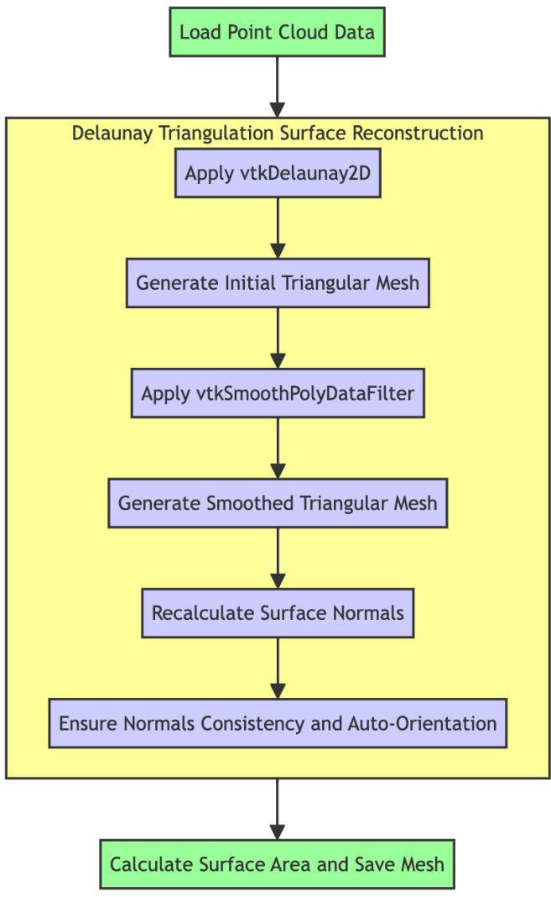

# A Comprehensive Approach for Low-Cost and Rapid Plant Leaf Phenotyping Using Multi-View Point Cloud Fusion, Deep Learning and SLAM

# 基于多视角点云融合、深度学习和SLAM的低成本快速植物叶片表型分析综合方法

Daidai Qiu 2024年5月

信息技术组研究实践报告 理学硕士

瓦赫宁根大学

导师：Ebo Bennin

# 摘要

# 1. 引言

1.1 植物表型分析中的图像分析   
1.2 植物表型分析中的点云分析   
1.3 点云分析中的关键技术   
1.4 研究问题和任务

# 2. 相关工作

2.1 表面重建算法   
2.2 点云配准算法   
2.3 点云补全模型   
2.4 SLAM技术的应用

# 3. 方法

3.1 硬件设置   
3.2 数据收集和预处理   
3.3 点云分割   
3.4 数据集构建   
3.5 点云配准   
3.6 点云补全模型   
3.7 表面重建   
3.8 使用SLAM获取位姿信息

# 4. 实验结果

4.1 叶片形态特征分析   
4.2 点云分割结果   
4.3 点云配准和SLAM技术结果   
4.4 叶片表面重建结果   
4.5 点云补全结果

# 5. 讨论

# 6. 结论和建议

6.1 结论   
6.2 建议

# 参考文献 

# 摘要

植物表型分析对于优化温室生产至关重要。然而，以快速且经济高效的方式获取植物叶片的完整点云并提取准确的表型信息仍然是一个挑战。因此，本研究旨在通过整合点云配准、表面重建、补全和基于SLAM的粗配准技术，开发一种低成本且高效的方法来获取完整的叶片点云并提取表型信息。

使用Realsense D435i相机收集了59个植物叶片的RGB图像和点云。采用YOLOv8和Segment Anything Model (SAM)进行实时点云分割。应用主成分分析(PCA)提取叶片长度和宽度。使用四种表面重建方法（高斯飞溅、泊松、德劳内三角剖分和球面旋转）获取叶片面积数据。还生成了具有不同重叠水平的不完整点云用于训练和评估目的。

使用RMSE、MAE、豪斯多夫距离和Chamfer距离测试和评估了几种点云配准算法。TEASER $^ { + + }$ 在几乎所有重叠场景中都表现良好。首先进行粗配准然后使用ICP进行精细配准的全局配准算法也显示出与TEASER $^ { + + }$ 相似的效果。泊松表面重建在恢复叶片表面细节方面取得了最佳性能。CRA-PCN模型在点云补全方面表现出良好的能力，特别是在预测不同遮挡水平下缺失的叶片形状方面。此外，探索了SLAM用于粗多视角点云配准，显示出提高配准精度的潜力。

本研究通过结合点云分割、配准、补全和表面重建中的各种算法，为低成本快速获取植物叶片表型信息提供了完整的解决方案。它可以从3D重建的点云中有效获取关键叶片表型特征，如曲率、形状和叶片面积。结果表明，这种方法在植物表型分析中具有潜力和可行性，尽管在实践中存在一些挑战，包括位姿估计的准确性、点云噪声去除和点云补全。

# 1. 引言

随着智能温室生产的发展，快速高效地获取植物表型信息变得越来越重要。这也是发展自主温室的基础。例如，获取叶片数量、曲率、形状和叶片面积等重要植物生长指标对于提高温室生产管理水平至关重要。目前，人工智能和农业机器人在农业领域被广泛使用，以实现水果采摘和修剪等自动化任务。所有这些都依赖于精确的植物检测，如确定水果成熟度和大小用于水果采摘 (Mukherjee et al., 2024)，分析玉米和高粱的叶片面积和叶片形状等表型信息 (Prat et al., 2019)，以及检测根系发育以评估灌溉需求 (Reina, 2024)。

# 1.1 植物表型分析中的图像分析

过去，植物表型数据分析通常使用二维图像进行。这种方法成本效益高、快速且方便，对于快速识别植物病虫害和一些基本生理信息很有用。然而，缺点也很明显。它通常无法捕获复杂的植物骨架结构，缺乏获取叶片纹理详细三维信息的能力。此外，它容易受到光照条件的影响，导致重要特征的不完整捕获。因此，它无法满足智能自主温室的需求。

# 1.2 植物表型分析中的点云分析

与图像分析相比，3D点云可以提供更多信息，点云数据可以从多个视角捕获和合并以解决叶片遮挡问题。它还可以用于3D重建以获得叶片曲率、叶片表面积、倾斜角度、纹理植物形态骨架 (Gu et al., 2024; Theiß et al., 2024; Yang et al., 2024)。

许多研究证明了点云分析在植物表型分析中的重要性。例如，分割茎、叶、花和果实等器官为植物生长监测和产量估算提供更详细的信息 (D. Li et al., 2022; Wang et al., 2023)，提取玉米作物的茎叶骨架 (Wu et al., 2019)，分离植物的不同部分如小麦植物的果实 (Wahabzada et al., 2015)，获取叶片角度、长度、形状等精确生长数据 (Atefi, Ge, Pitla, & Schnable, 2019)。总的来说，3D点云分析技术在植物表型分析中发挥着重要作用，可以提供更全面和准确的植物生长信息，对研究植物表型非常有帮助。

# 1.3 点云分析中的关键技术

点云数据分析包括点云的配准、分割、补全和表面重建。它可以提供更多植物表型信息 (Das Choudhury et al., 2020)。多视点点云融合可以解决遮挡导致的不完整点云问题，有助于更准确地分析植物生长 (Chebrolu et al., 2021; Huang et al., 2021)。

深度学习模型是分析中使用的另一种主要方法，主要用于点云的精确分割、识别和补全 (Han et al., 2023; He et al., 2022; Lu et al., 2020)。例如，PointNet和PointCNN模型可以执行点云的特征提取、分类和分割。在收集点云数据时，遮挡通常会导致不完整的点云，特别是在植物的成熟发育阶段。有两种方法可以解决这个问题。第一种是从不同视角收集多个点云，然后进行配准和融合。第二种方法是使用深度学习模型来补全缺失的点云部分 (Mok et al., 2022; Zhang, Z., Yu , & Da, 2022; Fei et al., 2022)。例如，PoinTr、PF-Net和ProxyFormer等模型可以直接预测被遮挡的部分。当遮挡严重且无法获得多视点点云时，不完整点云的预测非常有帮助 (Fei et al. , 2022; Li et al., 2023; Yu et al., 2023; Yu et al., 2021)。

点云配准后，表面重建是另一个重要步骤。目的是从点云创建连续表面以获得表面积等信息。表面重建有两种方法：几何方法和深度学习方法。几何方法是指直接使用几何或统计算法对点云进行操作。其优点是有许多成熟的算法和库可以直接使用，无需任何预训练。例如，泊松表面、Delaunay等算法，以及Open3d、VTK和OpenMVS等流行库 (Hou et al., 2022; Kazhdan et al., 2006; S. Li et al., 2020)。深度学习方法通常使用卷积神经网络直接从稀疏或不完整的点云重建表面，适用于处理具有复杂表面的目标点云 (Farshian et al., 2023; Wu et al., 2023)。

# 1.4 研究问题和任务

在实际生产中，收集完整点云存在许多挑战。其中一个重要问题是许多3D扫描设备昂贵且操作复杂。由于点云数据量大，处理速度相对较慢，无法满足快速点云分析的要求 (Chen et al., 2018; Tang et al., 2023)。另一个常见挑战是难以获得完整的点云 (Kim et al., 2021)。这通常是由于遮挡、不准确的位姿估计、光照和设备本身的噪声造成的 (Weijie et al., 2020; Wu et al., 2022)。

# 研究问题

因此，本研究的主要研究问题如下：

如何使用低成本设备快速获取植物叶片的完整点云并从中准确提取叶片表型信息？

为了系统性地解决这个问题，本研究提出以下四个子问题：

1. 如何使用深度学习模型高效分割目标植物叶片点云数据？

2. 如何通过多视角成像和SLAM技术解决叶片遮挡问题并提高点云配准精度？

3. 哪种表面重建算法适合植物叶片表面重建，以及如何优化其性能？

4. 深度学习模型在点云补全中的应用和性能评估。

# 主要任务

为了回答这些问题，本研究的主要任务包括：

1. 使用Realsense D435i相机收集RGB图像、深度图像，并结合最新的深度学习模型YOLOv8和Segment Anything Model实现实时点云分割。这种方法能够高效准确地从背景中提取叶片点云。

2. 在不同重叠水平（$10\%$、$30\%$、$50\%$、$70\%$和$90\%$）下，测试了不同点云配准算法（ICP、Global ICP、SVR、RANSAC、CPD、Teaser$^{++}$、FilterReg Rigid、FilterReg Feature）的性能。基于不同算法的特点，提出了一种结合粗配准和精细配准的配准策略：使用RANSAC等算法进行粗配准，构建位姿图，利用位姿信息进行粗略对齐；然后使用Teaser$^{++}$进行精细配准以提高精度。

3. 评估了不同表面重建算法的性能。针对实验中发现的额外水密表面问题，提出了一种优化方法：密度滤波去除叶片边缘的冗余部分；仅使用Delaunay三角剖分或Ball Pivoting重建算法处理额外的水密表面。这种方法有效提高了表面重建的质量和精度。

4. 其他工作包括使用CRA-PCN模型预测和补全点云遮挡区域，以及应用SLAM技术获得准确位姿以改善点云配准。

# 2. 相关工作

本节回顾了表面重建、点云配准和补全方面的当前主要研究成果，并讨论了它们的优缺点，为本研究的工作提供理论支持。此外，还介绍了SLAM技术，并讨论了其在点云粗配准中的应用，以及这些方法在实际植物表型分析中的潜力和局限性。

# 2.1 表面重建算法

点云由许多离散点组成，通常通过3D扫描设备收集。表面重建是指从这些离散点生成平滑连续的三维表面模型（Berger et al., 2014; Lim & Haron, 2014），它是点云分析的基础。点云重建可以使用多种算法实现。

# Ball Pivoting

Ball Pivoting算法假设一个虚拟球从选择点云中的三个点作为初始顶点开始，然后旋转直到接触到另外两个点，形成一个三角形表面，它从新三角形的边缘继续旋转，直到接触到另外两个点，重复上述过程直到点云的所有点都被处理或无法生成新的三角形面（Bernardini et al., 1999）。

Ball Pivoting算法能够快速生成表面，因此适用于大量点云数据。它可以通过改变球的半径来捕获更多细节和表面，因此可以应用于不同密度的点云。然而，它对噪声相当敏感，需要预先去噪和去除异常值，不合适的半径选择可能导致网格中的空洞，因为球的半径选择直接影响重建的表面（Bernardini et al., 1999）。

# Delaunay三角剖分

Delaunay三角剖分是指从一组离散点建立一组三角形，并确保任何三角形的外接圆中都不存在点。它最大化所有三角形的最小角度，避免长或扭曲的三角形，并均匀分布它们。它从随机选择几个点创建初始三角形开始。然后，连续向当前三角形添加点以创建均匀规则的三角形。每次插入新点时，更新外接圆包含新点的三角形，删除旧的三角形，并以新点为顶点形成新的三角形。重复此过程直到插入所有点（Cazals & Giesen, 2006; Lee & Schachter, 1980）。

主要优点是可以生成高质量三角网格的唯一表面，并且可以应用于具有不规则密度和点分布的点云。然而，它也有一些缺点，该方法对异常值高度敏感，通常无法准确重建具有尖锐特征的点云，可能会生成一些不现实的边界（Gopi et al., 2000）。

# 高斯飞溅

高斯飞溅假设点云中的每个点都是高斯分布核。它将空间划分为立方体或体素，其中每个体素都有一个标量值，对于每个体素，将体素内所有点的高斯分布值相加并作为标量值。这样，给定特定值可以提取等值面，从而重建表面（Chen et al., 2023; Lyu et al., 2024; Zwicker et al., 2023; Lyu et al., 2024; Zwicker et al., 2001）。

它对噪声具有鲁棒性，使重建更加稳定，生成的表面也更加平滑。然而，它倾向于丢失一些细节，无法细化表面，表面重建的效果也对参数设置敏感（Chen et al., 2023; Wolf et al., 2024; Zwicker et al., 2001）。

# 泊松重建

泊松算法估计每个点的法向量，并使用这些法向量构建泊松方程。与高斯飞溅类似，它求解泊松方程以在连续标量场中生成连续重建表面（Kazhdan et al., 2006; Kazhdan & Hoppe, 2013）。

它对异常值具有鲁棒性，能够处理各种密度的点云，并生成更平滑的表面（Kazhdan et al., 2006）。然而，与其他算法相比，该算法的计算过程更复杂且耗时。由于点的法向量对表面重建有显著影响，参数的选择将影响最终的表面重建效果，也可能生成一些冗余边界，因此需要进一步的后处理（Hoppe, 2008; Kazhdan et al., 2020）。

# 2.2 点云配准算法

点云配准是一种将不同点云对齐到同一坐标系的方法，计算不同点云之间的变换矩阵，用于配准和合并多视角点云形成新的点云（Huang et al., 2021; Pomerleau et al., 2015）。

# CPD

CPD（相干点漂移）算法假设源点云中的每个点都是高斯分布，通过计算两个点云之间的对应概率来找到关系，然后持续更新源点云中点的位置，直到误差不再显著变化（Myronenko et al., 2006）。

它对噪声和异常值具有鲁棒性，可以解决非刚性配准问题。它能够避免局部最优解并实现更高的精度。然而，它对初始参数设置敏感，这将直接影响配准效果（Myronenko & Song, 2010）。

# FilterReg

FilterReg算法使用概率模型来评估和优化两个点云之间的对齐。它使用向量场来描述点如何从原始位置移动到新位置，然后算法检查是否实现了最佳对齐。通过优化向量场可以获得最佳变换参数。它还使用滤波器来减少异常值的影响，从而提高配准的精度和鲁棒性（Gao & Tedrake, 2018）。

它对异常值具有鲁棒性，适用于非刚性配准，并且可以避免陷入局部最优解。然而，缺点包括对参数设置敏感、计算复杂以及处理速度相对较慢（Gao & Tedrake, 2018）。

# FilterReg $+$ Feature

带特征的FilterReg基于原始FilterReg；区别在于它添加了特征点提取和匹配。这些特征点指导配准过程，提高配准精度和鲁棒性。最大的优势是即使重叠区域很少或噪声很多，通常也能实现配准。然而，由于添加了特征点提取，过程也变得更为耗时（Rusu et al., 2009; Xu and Huang, 2021）。

# ICP

ICP算法重复寻找源点云和目标点云之间的最近点对。首先，使用初始变换矩阵进行粗略对齐。其次，对于源点云中的每个点，它在目标点云中找到最近的对应点，然后计算刚性变换矩阵以获得最优的平移和旋转来最小化距离。最后，计算最终的变换矩阵和变换后的配准源点云（Sharp et al., 2002）。

算法实现相当简单，适合解决刚性配准问题。其缺点是配准效果很大程度上受初始对齐影响，噪声和异常值极大地影响配准过程（Bouaziz et al., 2013; Sharp et al., 2013）。

# RANSAC

RANSAC（随机样本一致性）配准算法解决刚性变换问题。它从两个点云中提取特征点并找到匹配点对开始。其次，算法随机选择足够的点对来计算变换矩阵。第三，它将变换矩阵应用于源点云，计算变换后点云之间的距离，并将误差小于某个阈值的所有点标记为内点。第四，重复上述步骤，优化变换矩阵以每次增加内点数量。最后，选择包含最多内点的变换矩阵作为输出结果（Chen, 1999; Chen, Hung, & Cheng, 1999; Derpanis, 2010）。

其优点包括适合处理具有许多异常值的点云。然而，其缺点是阈值和迭代次数对最终配准效果有很大影响。同时，由于随机采样和多次迭代，运行速度相对较慢（Chen, 1999; Chen et al.1999; Derpanis, 2010; Li et al., 2021）。

# SVR

随机变分配准（SVR）算法可以解决刚性和非刚性配准问题。首先，它从源点云和目标点云中提取特征点以相互匹配。其次，它使用包含变换参数的概率模型，通过变分推理进行优化，获得变分分布。第三，从变分分布中采样变换参数并计算当前变换。第四，它标记并计算误差小于某个阈值的点以更新变分分布的参数。最后，重复该过程以最大化内点数量，直到不再有显著变化。

其优点是对噪声具有鲁棒性。缺点是由于计算复杂，阈值参数可能显著影响最终配准效果，处理速度相对较慢（Sun et al., 2011）。

# Global ICP

Global ICP算法结合了RANSAC和ICP。RANSAC用于全局配准进行粗略对齐，构建位姿图并执行位姿优化，然后使用ICP进行精细配准。它结合了两种算法的优点以实现更好的配准效果，但计算复杂度增加，因此处理速度会更慢（Han et al., 2015; Huang & Hu, 2015）。

# TEASER++

TEASER $^{++}$ 使用截断最小二乘（TLS）成本函数去除异常值，然后通过旋转和平移配准点云。它适用于刚性配准和具有大量异常值的点云，TEASER $^{++}$ 可以处理超过 $99\%$ 的异常值并高效运行，通常在毫秒级别（Yang et al., 2020）。

# 2.3 点云补全模型

编码器-解码器是许多点云补全模型的常见架构，编码器模块将不完整点云作为输入，解码器从向量生成完整点云（Yuan et al., 2018）。

1. PCN模型通过编码器提取全局特征，然后解码生成粗略点云，最后通过细节优化恢复完整点云（Yuan et al., 2018）。   
2. PF-Net模型通过编码器提取全局特征，通过解码器逐渐提高点云分辨率，并预测完整点云（Huang et al., 2020）。   
3. PoinTr模型将点云假设为一组点代理，通过自注意力机制在编码器中捕获全局和局部几何关系，然后解码器直接生成完整点云（Yu et al. al., 2021），SeedFormer模型也具有类似的工作模式（Li et al., 2023）。

# 2.4 SLAM应用

SLAM（同时定位与建图）是指移动设备通过配备IMU（惯性测量单元）、相机、激光雷达等传感器在环境中收集数据，实时构建环境地图并确定当前位置的技术。SLAM技术结合不同的传感器，如相机和IMU，以提高定位精度和鲁棒性（Bailey & Durrant-Whyte, 2006; Durrant-Whyte & Bailey, 2006; Grisetti et al., 2010）。

SLAM使用激光雷达或深度相机收集点云数据，对齐来自不同传感器的数据，然后从图像和点云中提取关键特征点。接下来，它使用惯性测量单元（IMU）获取的加速度和角速度数据。通过对加速度积分获得速度，然后通过对速度积分获得位移。对角速度积分提供设备的姿态变化，从而获得传感器的姿态估计。然而，IMU传感器本身通常具有噪声。直接积分会导致显著的误差累积，引起位置漂移问题。时间越长，误差越大，严重影响姿态精度（Bailey & Durrant-Whyte, 2006; Durrant-Whyte & Bailey, 2006; Fuentes-Pacheco et al., 2015）。

位置漂移问题可以通过滤波算法解决，它将IMU的数据与从图像中提取的关键特征点相结合，以达到更好的数据融合。已经证明，像扩展卡尔曼滤波器这样的滤波器可以正确处理非线性系统中的状态估计，有助于在实践中实现高精度定位（Fujii, 2013; Ribeiro, 2004）。Mahony和Madgwick滤波器被设计用于处理姿态估计中的噪声，可以在姿态上提供更稳定和准确的姿态输出，增加输出，提高姿态（Ludwig & Burnham, 2018; Madgwick, 2010; Mahony et al., 2008）。最后，回环检测将识别相同的初始和结束位置，以进一步减少由误差累积引起的位置漂移。

# 3. 方法

本研究设计了一个综合的点云数据研究流程，包括数据收集、叶片分割、点云配准、SLAM姿态获取、点云补全、表面重建和表型信息提取等关键步骤。如图1所示。

  
图1. 研究方法工作流程

# 3.1 硬件设置

如今许多消费级深度相机仅需100-200欧元，如Realsense系列，可以捕获误差精度高达0.001m的更准确数据。可以低成本获得叶片的3D数据，这些消费级深度相机通常体积小且便携，可以安装在机器人平台或手持设备上，适用于广泛的应用（Zhang, Xia, & Qiao, 2020）。

设备选择：使用Raspberry Pi 5和Intel Realsense D435i深度相机来收集和处理点云数据。RealSense D435i支持深度流和彩色流，分辨率分别为1280x720和1920x1080，帧率高达90 fps，其工作深度范围为0.2到10米。

系统安装：在Raspberry Pi 5上安装Ubuntu Server 22.04 LTS，以确保可以正常安装各种所需的库。

设备连接：通过USB 3.0将Realsense D435i相机连接到Raspberry Pi 5。

# 3.2 数据收集和预处理

# 深度相机安装

通过测试发现，Realsense D435i在25cm内收集的深度数据不完整且存在许多空白区域，如果距离太远，则无法很好地获得相对较小目标（如叶片）的准确表面信息。因此，将Realsense D435i固定在距离菠菜叶片约30cm处，通过移动叶片进行连续收集，或在约30cm范围内使用手持深度相机捕获目标叶片，以确保能够完全捕获叶片点云数据。

# 相机参数设置

为了达到快速处理速度和高分割精度，本研究通过分割RGB图像和深度图来分割叶片点云。因此，深度相机的彩色帧分辨率设置为最大值$\mathbf { 1 9 2 0 \times 1 0 8 0 }$，由于深度图像包含更多数据，考虑到处理速度，深度分辨率设置为相对较低的$6 4 0 \times 4 8 0$。帧率为30帧/秒。

# 收集过程

RealSense D435i深度相机使用结构光技术，使用红外激光投影仪发射一组红外光点。这些光点形成特定图案并投影到目标物体表面。如图2所示，相机左右两侧的两个红外相机接收这些反射的红外光点，然后比较左右相机捕获图像的差异，并使用相机的内部参数（如焦距）计算深度数据（Condotta et al., 2020）。

  
图2. RealSense D435i相机模块组件

在实际测试中，我们发现深度图像的质量受光照条件影响很大。如果光线太亮，会干扰结构光图案的识别。如果光线太暗，使用的红外光点的图案特征变得不明显，也会影响RGB图像收集。因此，根据结构光原理，为了提高采样精度，相机设置为高密度预设模式，这意味着相机投影更多的红外光点。经过测试，已验证通过这种方式可以显著减少深度图像中的噪声和空洞。

# 采样对象

在本研究中，选择菠菜（Spinacia oleracea）作为实验对象。主要原因包括：

菠菜是一种常见的绿叶蔬菜，叶片大且叶片的三维结构相对简单，具有合适的曲面，适合本研究的目标（Metzger & Zeevaart, 2019）。

菠菜叶片不具有高反射性，因此收集的深度图像出现空洞的机会较少。   
菠菜可以在温室中容易栽培，可以轻松获得不同生长阶段的叶片样本。

# 3.3 点云分割

考虑到当前设备的性能，为了快速收集和分割叶片点云，本研究设计了一个快速处理方案，可分为三个步骤：识别、对齐和转换，如图3所示。

# 识别

本研究使用YOLOv8模型进行语义识别，首先获取目标菠菜叶片所在的区域。YOLO是一个基于深度学习的目标检测模型。其原理是将输入图像划分为多个相等的网格，并使用卷积神经网络识别每个网格中目标边界框的位置和大小，并计算置信度分数和类别概率。神经网络主要包括三个部分：卷积层、全连接层和输出层（Jiang et al., 2022）。删除置信度低于阈值的边界框，并使用非极大值抑制来过滤掉低置信度和重叠的边界框，只保留高置信度的边界框（Neubeck and Van Gool, 2006）。最后输出每个目标的位置、大小和类别。由于YOLOv8只需要一次前向传播就能直接预测，检测速度特别快，适合本研究的叶片检测任务（Haritha et al., 2022）。SAM（Segment Anything Model）是目前最流行的零样本图像分割模型之一，SAM使用预训练的Vision Transformer（ViT）从输入图像中提取特征。它支持点、框和掩码作为提示，并将它们编码为向量，使用掩码解码器创建分割掩码（Kirillov et al., 2023）。由于SAM已启用零样本检测，可以在本研究中直接使用，无需任何微调。

在本研究中，对于每个检测到的菠菜叶片边界框，使用SAM模型分割检测到的叶片区域并生成相应的二值掩码。每个掩码在叶片区域的像素值为1，非叶片区域的像素值为0。

  
图3. 菠菜叶片快速点云分割：识别、对齐、提取和转换

# 对齐

此步骤创建一个与深度图像相同大小的掩码数组，并将生成的掩码应用于深度图像以提取目标叶片区域，它可以分割背景和其他不相关的部分，只保留叶片区域的深度数据。

# 转换

使用Realsense d435i的内部参数，包括相机的焦距、光心等，将叶片的深度图转换为点云数据（Pal et al., 2017）。生成的点云数据包含每个叶片表面的三维坐标和颜色信息。

当前方法包括使用YOLOv8模型识别叶片，使用SAM模型分割叶片区域，对齐RGB掩码和深度图像，提取叶片区域的深度数据，使用相机内部参数将深度图转换为点云，最后生成三维点云数据。实验表明，它能够高效准确地收集和获取目标叶片的点云。这是因为深度图像是二维的，与直接处理点云数据相比，数据量更小，因此计算速度更高。整个过程对设备性能要求较低。经过实际测试，平均处理速度在1-2秒之间，满足实际应用的要求。

  
图4. YOLOv8目标检测和深度图像

# 3.4 数据集构建

本研究构建了两个数据集，如图5所示。一个是用于测试不同点云配准算法的评估数据集，另一个是用于CRA-PCN点云补全模型训练的训练数据集。

  
图5. 点云配准和补全模型的评估和训练数据集构建

# 评估数据集

收集了59个完整点云，每个完整点云经过处理生成两个不完整点云，它们相互重叠，总共产生118个不完整点云。具体步骤如下：

1. 模拟叶片遮挡：首先，计算所有点的平均值作为点云的中心点，然后选择Z轴作为切片平面的法向量，即创建垂直xy平面的切割面。其次，通过从每个点减去中心点，然后与法向量进行点积，计算每个点到切片平面的距离。然后设置重叠级别并计算距离阈值的范围。这两个阈值决定哪些点将被分配给部分点云1或部分点云2。最后，使用距离阈值创建掩码，将点云分割成两个部分重叠的点云。

2. 模拟位置和方向差异：对其中一个不完整点云随机应用变换以模拟点云之间的差异。这些变换包括随机旋转和平移，其中旋转角度范围从$\mathbf{-10^{\circ}}$到$\mathbf{10^{\circ}}$，平移向量范围从$-5$ cm到$5$ cm。

通过这种方法生成的不完整点云具有一定程度的重叠。同时，通过随机旋转和平移变化，它们模拟了实际收集中从不同角度拍摄的点云差异。

# 训练数据集

创建过程与评估数据集类似，不同之处在于首先通过数据增强从原始完整点云生成完整点云，然后人工创建叶片遮挡。以下是详细步骤：

1. 数据增强：对每个原始完整点云应用随机旋转和缩放，生成一些新的完整点云。旋转角度在$\overline { { - 5 0 } } ^ { \circ }$到$5 0 ^ { \circ }$之间，缩放因子在0.5到1.2之间。此步骤从原始59个完整点云生成的2950个新完整点云开始。

2. 模拟叶片遮挡：处理增强的2950个完整点云以模拟叶片遮挡，并生成不同程度的非完整点云。为每个完整点云生成11个不同的非完整点云，总共产生32450个非完整点云。

3. 数据集划分：按8:1:1的比例划分所有生成的完整和非完整点云，生成训练、验证和测试数据集。具体划分如下：

训练数据集包含23,600个完整点云和26,080个非完整点云。   
验证数据集包含2950个完整点云和3240个非完整点云。   
测试数据集包含2950个完整点云和3240个非完整点云。

它为CRA-PCN模型训练提供了具有各种叶片遮挡程度的点云，有助于提高模型的鲁棒性和适应性。

# 3.5 点云配准

本研究使用当前常见的点云配准算法设计两种类型的配准方案并进行测试。这些算法包括ICP、Global ICP、SVR、RANSAC、CPD、TEASER $^ { + + }$、FilterReg和FilterReg Feature。不同算法通过progreg和open3d库实现。

# 一般步骤

对于每个算法的评估，首先加载源点云和目标点云，并去除异常值。为了提高配准算法的速度，对点云进行体素下采样，体素大小设置为0.001。然后应用不同的配准算法进行配准，算法参数采用默认参数。最后将变换矩阵应用于源点云，并将两个点云融合生成完整的点云。

# 3.5.1 直接配准

第一种是直接应用算法然后评估配准效果。这包括CPD、ICP、FilterReg、FilterReg Feature和SVR算法，如图6所示。

表1. 点云配准算法参数设置   

| 算法 | 参数1 | 参数2 |
|------|-------|-------|
| CPD | N/A | N/A |
| FilterReg | objective_type: pt2pt | update_sigma2: True |
| SVR | N/A | N/A |
| FilterReg with FPFH | objective_type: pt2pt | sigma2: 1000 |
| ICP | threshold: 0.8 | trans_init: identity matrix (np.eye(4)) |
| RANSAC Registration | distance_threshold: 1.5 * voxel_size | N/A |

  
图6. 直接点云配准工作流程

1. FilterReg：objective_type设置为"pt2pt"，这意味着最小化源点云中每个点与其在目标点云中对应点之间的距离。update_sigma2为true，表示在配准过程中自动更新误差估计。

2. FilterReg with FPFH：使用特征函数FPFH进行配准，objective_type为"pt2pt"，sigma2初始化为1000。sigma2表示点之间距离误差的估计。在本研究中，默认假设两个点云之间的误差较大，因此设置稍高。

3. ICP：trans_init用于设置初始变换矩阵。

4. RANSAC Registration：distance_threshold的作用与threshold类似，决定两个点云之间每个点的最大允许距离。

# 3.5.2. 全局配准方法

第二种配准方法是粗配准和精配准的组合，如图7所示。

# 表面重建实现步骤

1. 第一步是通过计算FPFH（快速点特征直方图）获得每个点的局部几何特征，然后使用特征找到两个点云之间的关系（Rusu等，2009）。然后在全局配准中结合RANSAC算法和FPFH特征。RANSAC算法可以通过随机采样有效去除异常值并获得鲁棒的初始配准结果（Derpanis，2010），获得初始变换矩阵。

2. 初始变换矩阵用于在开始时构建位姿图，然后使用全局优化算法迭代优化所有点云段的位姿图（Ge等，2019）。位姿图是指一种图结构，用于表示和优化多个点云之间的相对位姿关系，节点表示点云的位姿，边表示相对变换（Mendes等，2016）。

3. 可以使用ICP算法或Teaser $^ { + + }$算法进一步细化全局配准的结果。

  
图7. 全局点云配准工作流程

# 3.5.3. 点云配准效果评估

本研究使用四个指标来评估点云配准的结果；

对于每个指标，在配准后的点云和真实点云之间计算值和标准差。

RMSE、MAE、Hausdorff距离，它测量一个点组中每个点到另一个点组中最近点的最大距离（Huttenlocher等，1993）。Chamfer距离，它测量一个点组中每个点到另一个点组中最近点的平均距离，因此Chamfer距离越低，点云配准效果越好（Wu等，2021）。

# 3.6 点云补全模型

在许多情况下，由于叶片遮挡，仅通过配准获得完整点云是不够的。因此，可以通过预测非完整点云部分来补全点云。本研究使用最新的CRA-PCN模型（图8），它首先通过编码器提取输入的非完整点云特征，然后通过种子点生成器生成粗糙的种子点云，然后通过解码器中的多个上采样模块，逐步改进和优化粗糙点云，最终输出完整的高分辨率点云（Rong等，2024）。该模型的关键创新是跨分辨率变换器（CRT）模块，它利用局部自注意力机制来聚合特征并增强编码器和解码器中不同分辨率之间的上下文（Rong等，2024）。

  
图8. 点云补全模型：CRA-PCN架构

本研究根据PCN（点云补全网络）数据集标准（Yuan等，2018）创建了菠菜叶片数据集，并进行了400轮训练。超参数设置如下：

表2. 点云补全模型训练超参数设置

| 参数名称 | 数值 | 描述 |
|----------|------|------|
| BATCH_SIZE | 30 | 每批次的样本数量 |
| N_EPOCHS | 400 | 训练总轮数 |
| LEARNING_RATE | 0.001 | 初始学习率 |
| LR_MILESTONES | [50,100,150,200,250] | 学习率调整的轮数 |
| LR_DECAY_STEP | 50 | 学习率衰减步长 |
| WARMUP_STEPS | 200 | 训练前的预热步数 |
| WARMUP_EP0CHS | 20 | 训练前的预热轮数 |
| WEIGHT_DECAY | 0 | 权重衰减系数 |
| LR_DECAY | 150 | 学习率衰减的轮频率 |

训练后，使用模型推理生成了37个预测的完整点云，并通过与真实点云的视觉差异进行比较分析。

# 3.7 表面重建

本研究使用了四种常见的表面重建算法。表面重建是指将点云数据转换为连续表面的过程。其目的是恢复目标对象的原始表面形状并生成表面网格，以获得表面积等信息（Hoppe等，1992）。表面重建算法分为两种类型：显式或隐式（Berger等，2014；Bolle & Vemuri，1991）。例如，球旋转算法和Delaunay三角剖分是显式方法，因为它们直接在表面上的点进行操作来创建三角网格。隐式方法是首先定义标量场，然后从特定的等值面创建最终表面，如泊松算法和高斯飞溅算法。

# 3.7.1. Delaunay三角剖分算法

Delaunay三角剖分通过对点云进行三角剖分来生成由三角形面片组成的网格表面。目标是最大化具有最小角度的三角形数量，避免生成细长三角形，从而获得更高质量的表面。

# 表面重建实现步骤：

首先，使用PyVista库加载点云数据并调用vtkDelaunay2D函数实现表面重建，生成初步的三角网格。在此阶段，初步表面较为粗糙，因此使用vtkSmoothPolyDataFilter对三角网格进行平滑处理。此步骤通过迭代次数和松弛因子控制平滑效果。为了保留重建表面的更多细节，计算平滑后的表面法向量以确保法向量方向一致，进一步改善平滑度。最后，使用重建的表面计算表面积并将网格保存为文件，如图9所示。

表3. 实验设置参数

| 步骤 | 参数名称 | 数值 | 描述 |
|------|----------|------|------|
| 平滑处理 | 迭代次数 | 50 | 平滑处理的迭代次数 |
| 平滑处理 | 松弛因子 | 0.1 | 控制平滑程度的松弛因子 |
| 平滑处理 | 边界平滑 | 开启 | 是否平滑边界，设置为开启 |
| 法向量计算 | 一致性 | 开启 | 确保法向量方向一致性 |
| 法向量计算 | 自动定向法向量 | 开启 | 自动定向法向量 |

  
图9. Delaunay三角剖分表面重建工作流程

# 3.7.2 泊松算法

泊松算法使用法向量通过点云中的泊松方程获得连续标量场，然后从标量场中提取等值面以生成三角网格表面，因此它可以生成更平滑和连续的表面（Kazhdan等，2006；Kazhdan & Hoppe，2013）。

# 表面重建实现步骤：

与Delaunay表面重建类似，第一步包括体素下采样和法向量估计，在实验测试期间，在重建叶片表面的边缘发现了冗余表面，如图10所示。因此，为了解决这个水密性问题，本研究进行了以下处理，如图11所示。

1. 使用DBSCAN算法对点云进行聚类和分割。目的是去除噪声和离群点，找到最大的聚类，即主要叶片部分。   
2. 对重建网格进行密度过滤，去除叶片边缘外的低密度区域，这也是冗余区域，并去除无效的三角形和顶点。   
3. 计算叶片的凸包，它定义了点云数据的边界。然后在凸包点上使用Delaunay三角剖分生成三角网格。   
4. 利用Delaunay算法在处理边缘方面的优势，检查泊松重建表面的顶点是否在凸包内，从而去除非目标叶片的表面。

  
图10. 泊松算法表面重建：左图-去除冗余表面，右图-未去除冗余表面

图11. 泊松表面重建工作流程

表4. 实验设置参数

| 步骤 | 参数名称 | 数值 | 描述 |
|------|----------|------|------|
| 点云下采样 | 体素大小 | 0.001 | 用于下采样的体素大小。较小的值增加点云密度，较大的值减少密度。 |
| 法向量估计 | 一致切平面 | 100 | 确保法向量方向一致性。 |
| DBSCAN聚类 | 邻域半径(eps) | 0.02 | 两个点被视为邻居的最大距离。较大的值增加聚类大小，较小的值减少聚类大小。 |
| DBSCAN聚类 | 最小点数(min_points) | 50 | 形成聚类所需的最小点数。较大的值减少聚类数量，较小的值增加聚类数量。 |
| 泊松重建 | 深度 | 12 | 用于泊松重建的树的深度，控制细节层次。较大的值增加细节，较小的值减少细节。 |
| 泊松重建 | 缩放 | 1.5 | 重建过程中平滑细节的缩放因子。较大的值增加平滑度，较小的值减少平滑度。 |
| 密度过滤 | 密度阈值 | 20百分位 | 过滤低密度区域的阈值，保留高密度细节。较高的值保留高密度区域，较低的值保留更多细节。 |

# 3.7.3 球旋转算法

球旋转算法通过在目标点云上滚动虚拟球来生成三角网格，形成完整表面，适用于均匀采样（Bernardini等，1999）。

# 表面重建实现步骤：

与前面的过程类似，第一步是处理、聚类和分割。球旋转算法重建部分的区别在于：球的半径直接影响重建表面的细节程度。经过实验测试发现，较小的半径可以获得更精细的特征，但也会产生更多噪声。较大的半径可以产生更平滑的表面但会丢失一些细节。因此，本研究使用多个不同半径的球，对每个球执行球旋转算法。从种子三角形开始，在其三角形边界上连续滚动。每当球与新三个点接触时，就建立一个三角形。重复此过程直到覆盖所有点。最后，合并不同半径生成的网格以获得完整的重建表面，如图12所示。

  
图12. 球旋转表面重建工作流程

实验设置参数
表5. 实验设置参数

| 步骤 | 参数名称 | 数值 | 描述 |
|------|----------|------|------|
| 点云下采样 | 体素大小 | 0.001 | 用于下采样的体素大小。较小的值增加点云密度，较大的值减少密度。 |
| 法向量估计 | 一致切平面 | 100 | 确保法向量方向一致性。 |
| DBSCAN聚类 | 邻域半径(eps) | 0.02 | 两个点被视为邻居的最大距离。较大的值增加聚类大小，较小的值减少聚类大小。 |
| DBSCAN聚类 | 最小点数(min_points) | 50 | 形成聚类所需的最小点数。较大的值减少聚类数量，较小的值增加聚类数量。 |
| 球旋转重建 | 半径 | [0.005, 0.01, 0.02, 0.04] | 用于球旋转的半径列表。不同半径捕获不同特征大小。 |
| 平滑处理 | 迭代次数 | 50 | 平滑过程的迭代次数。更多迭代产生更平滑的表面。 |
| 平滑处理 | 松弛因子 | 0.1 | 控制平滑程度的因子。较高的值产生更多平滑效果。 |

# 3.7.4 高斯飞溅算法实现步骤

高斯飞溅算法将每个点表示为高斯核，将这些高斯核相加形成连续的体积数据，然后提取特定值的等值面来重建表面（Chen等，2023；Lyu等，2024；Zwicker等，2023；Zwicker等，2021；Lyu等，2024；Zwicker等，2001）。与显式方法相比，它对噪声和不均匀采样更加鲁棒。通过调整高斯核的值，很容易生成封闭、无孔的表面。由于每个点都是高斯核，等值面直接提取，计算速度比泊松算法更快（Chen等，2023；Wolf等，2024；Zwicker等，2001）。然而，在实际测试中，生成的表面通常不够平滑，因此重建后需要进行表面平滑处理。

# 表面重建实现步骤：

首先，使用vtkGaussianSplatter函数将点云转换为体积数据，然后从标量场中提取等值面。使用vtkCurvatures计算表面的平均曲率，这考虑了两个主要方向的曲率程度。有两种方法可以减少表面的粗糙度，一种是调整高斯核的大小，另一种是使用曲率对表面进行拉普拉斯平滑。最后，使用平滑后的表面获得表面积。

  
图13. 高斯飞溅表面重建工作流程

# 实验设置参数：

表6. 实验设置参数   

| 步骤 | 参数名称 | 数值 | 描述 |
|------|----------|------|------|
| 高斯飞溅 | 采样维度 | 300,300, 300 | 采样网格的维度。更高的数值产生更精细的体积数据。 |
| 高斯飞溅 | 半径 | 0.005 | 飞溅的半径。较小的半径产生较少的模糊和更集中的点。 |
| 高斯飞溅 | 指数因子 | -2 | 影响模糊衰减率的指数因子。 |
| 轮廓滤波器 | 标量值阈值 | 0.03 | 轮廓提取的标量值阈值。较低的值提取更多细节但可能增加噪声。 |
| 曲率计算 | 曲率类型 | 平均 | 要计算的曲率类型。 |
| 拉普拉斯平滑 | 迭代次数 | 100 | 平滑的迭代次数。更多迭代产生更平滑的表面。 |

# 3.8 使用SLAM获取位姿信息

在本研究中，应用SLAM技术来提高点云配准的精度。SLAM是指能够同时进行定位和地图构建的技术，它使用各种传感器如激光雷达、相机和IMU来收集数据，并通过传感器融合算法获得位姿估计（Bailey & Durrant-Whyte, 2006; Durrant-Whyte & Bailey, 2006; Grisetti等，2010）。与之前在全局配准中获取位姿估计的最大区别在于，SLAM使用IMU传感器收集真实数据，并将其与全局配准算法中的特征提取和匹配相结合，以获得更准确的位姿，然后这些位姿可用于粗配准。

本研究中使用的Realsense D435i深度相机配备了IMU传感器，可以同时收集深度图像、加速度、角速度和其他IMU数据。使用Spectacular AI库来实现SLAM，该库提供了一套完整的接口，可以轻松收集点云数据、处理IMU数据并获得处理后的位姿信息。

# 数据收集步骤：

1. 使用RealSense d435i深度相机尽可能从多个视角捕获目标植物。   
2. 使用Spectacular AI库中的Replay类加载视频序列数据，并使用定义的回调函数onMappingOutput获取每个关键帧对应的位姿和点云数据。   
3. 保存关键帧和相应的位姿信息。

# 4. 实验结果

# 4.1 叶片形态特征分析

菠菜叶片的形态特征，如长度和宽度（图15），在本研究中显示出相当大的多样性。叶片长度数据从最小值0.079 m到最大值$\mathbf{0.172\ m}$不等，而叶片宽度范围从0.054 m到0.107 m，如图14所示。数据集中的多样性可以帮助模型学习多样化的叶片形状，增强点云补全。

  
图14. 59片菠菜叶片长度和宽度的分布

  
图15. 随机选择的叶片长度和宽度图像

  
图16. 不同重叠水平下完整和不完整点云的可视化

# 4.2 点云分割结果

如图17所示，当前方法能够有效地分离叶片和背景。这解决了研究问题1（如何使用深度学习模型高效分割目标植物叶片点云数据？）。叶片的边缘轮廓被准确分割，叶片点云的叶脉和叶柄等局部细节也成功分割。

  
图17. 完整点云和分割叶片点云的对比

# 4.3 点云配准和SLAM技术结果

以下结果展示了不同算法在各种重叠水平下点云配准的表现。这回答了研究问题2（如何通过多视角成像和SLAM技术解决叶片遮挡问题并提高点云配准精度？）。

# 点云配准

如图18所示，当点云重叠率仅为$10\%$时，所有算法的配准效果普遍较差。随着点云重叠率逐渐增加，配准效果也有所改善。当点云重叠率达到$30\%$时，global ICP和TEASER$^{++}$两种算法显示出更好的配准结果。当点云重叠率达到$50\%$和$70\%$时，RANSAC、global ICP和TEASER$^{++}$的配准效果明显优于其他算法。SVR算法在各种重叠程度下的配准效果都较差。FilterReg Feature和FilterReg Rigid算法的配准效果在重叠率超过$50\%$后显著改善。

  
图18. 不同算法在各种点云重叠水平下的配准结果

| 算法 | 10% | 30% | 50% | 70% | 90% |
|------|-----|-----|-----|-----|-----|
| SVR | 0.049771 | 0.040219 | 0.040876 | 0.033615 | 0.025663 |
| TEASER++ | 0.018273 | 0.008569 | 0.000539 | 0.000428 | 0.000393 |
| CPD | 0.012119 | 0.008478 | 0.005905 | 0.003477 | 0.001098 |
| Filterreg Feature | 0.011884 | 0.009154 | 0.006390 | 0.003627 | 0.001330 |
| Filterreg Rigid | 0.011884 | 0.009154 | 0.006390 | 0.003627 | 0.001330 |
| Global ICP | 0.013610 | 0.007933 | 0.001750 | 0.000750 | 0.000606 |
| ICP | 0.011778 | 0.009016 | 0.006208 | 0.003954 | 0.002788 |
| RANSAC | 0.013741 | 0.007937 | 0.001612 | 0.000621 | 0.000558 |
| 最佳算法 | ICP | Global ICP | TEASER++ | TEASER++ | TEASER++ |
| 最差算法 | SVR | SVR | SVR | SVR | SVR |

表7. 不同算法在各种重叠水平下四个评估指标的平均结果

  
图19. 不同算法在各种点云重叠率下的评估指标

如表7和图19所示，四个评估指标的平均结果在不同算法间存在差异：

$\bullet$ $10\%$ 重叠：最佳算法是ICP，平均结果为0.011778。   
$\bullet$ $30\%$ 重叠：最佳算法是Global ICP，平均结果为0.007933。   
$\bullet$ $50\%$ 重叠：最佳算法是TEASER$^{++}$，平均结果为0.000539。$70\%$ 重叠：最佳算法是TEASER$^{++}$，平均结果为0.000428。   
$\bullet$ $90\%$ 重叠：最佳算法是TEASER$^{++}$，平均结果为0.000393。

考虑到所有重叠水平，$\mathrm{TEASER++}$在大多数重叠水平（$50\%$、$70\%$和$90\%$）下表现最佳且一致，显示出高精度。Global ICP和ICP在较低重叠水平（$10\%$和$30\%$）下也表现出高性能，使其成为根据特定重叠条件选择的良好选择。

# SLAM技术的应用结果

  
图20. SLAM技术在植物点云重建中的应用

图20显示了使用SLAM技术从多个角度收集点云数据的过程。橙色框表示关键帧的拍摄路径和相应的相机位姿。右图仅显示配准后目标植物的融合完整点云。点云中存在一些噪声，对植物叶片等细节的捕获较差，但整体点云融合效果准确。

# 4.4 叶片表面重建结果

  
图21. 不同算法对菠菜叶片的表面积分布

如图21和22所示，各种表面重建算法的表面重建结果为研究问题3（哪种表面重建算法适用于植物叶片表面重建，以及如何优化其性能？）提供了答案。表面积结果显示Ball Pivoting算法的平均值为$\phantom{-}0.00685\mathrm{m}^{2}$，标准差为$\mathbf{0.00149\ m^{2}}$。这表明平均值和标准差都相对较低。Delaunay算法的平均值为$\mathbf{0.00756m^{2}}$，标准差为$\mathbf{0.00178m^{2}}$，显示出相对较高的面积平均值和更大的标准差。高斯算法的面积测量平均值最高，为0.00920$\mathbf{m}^{2}$，标准差为0.00160$\mathbf{m}^{2}$。泊松算法的平均表面积为$\mathbf{0.00668\ m^{2}}$，标准差为0.00152$\mathbf{m}^{2}$，相对较低。

Ball Pivoting算法重建的叶片表面整体平滑并保持叶片形状。叶片轮廓相对平滑，但表面存在多个孔洞。虽然Delaunay算法重建的叶片表面平滑，但叶柄直接连接到叶片，导致叶片形态不准确。高斯算法重建的叶片表面看起来更平滑连续，叶片轮廓接近真实叶片形状，但缺少一些表面细节。泊松算法重建的叶片表面平滑，同时保持更多叶片表面细节，特别是叶脉和边缘，但个别叶片表面出现孔洞。

  
图22. 不同方法对菠菜叶片的表面重建结果

# 4.5 点云补全结果

  
图23. CRA-PCN模型在各种遮挡程度下的点云补全结果

CRA-PCN模型显示出相对良好的点云补全能力。这解决了研究问题4（深度学习模型在点云补全中的应用和性能评估）。如图23所示，CRA-PCN模型基本上可以预测不同遮挡程度下点云的缺失部分，形状也与原始点云基本一致，叶片点云表面的深度变化也预测得更加准确。但在细节方面仍存在不足。例如，对叶柄部分的预测失败，在所有预测的点云中都没有出现。与原始叶片相比，叶片轮廓仍存在一些偏差。

# 5. 讨论

使用消费级深度相机Realsense D435i收集植物叶片点云数据，该相机在许多其他研究中也得到广泛应用（Ma & Yang, 2020; Tsykunov et al., 2020; Zhang et al., 2020），并基于树莓派处理数据，形成低成本硬件组合。本研究集成了几种最先进的开发算法：目标检测（YOLOv8）、分割模型（SAM）、点云配准算法、点云补全模型（CRA-PCN）和表面重建。这是一个快速、廉价的叶片表面积获取工具：从原始数据收集到最终表面重建。另一方面，SLAM技术用于植物表型信息收集，其中关键帧的精确相机位姿将有助于通过点云的粗略配准进一步改善植物表型数据的准确性。

结果表明，由YOLOv8和SAM模型生成的掩码可用于分割深度图像，然后从背景中提取植物叶片的点云。在提取叶片轮廓和详细特征时获得了高性能。然而，这种方法没有在更复杂的背景下测试分割效果。由于YOLOv8用于检测叶片区域，SAM用于分割该区域内的任何内容，在复杂背景下准确识别单个叶片区域并改善更精细叶片边缘分割的性能是挑战。一个可能的解决方案是为特定类型的叶片创建数据集，以提高YOLOv8识别单个叶片的能力。此外，一些深度网络模型可用于直接分割点云，而不是首先分割RGB图像。例如，PSegNet和FF-Net可以同时分割植物的点云（Li et al., 2022; Guo et al., 2023）。

在点云配准方面，实验结果表明，在不同的叶片重叠水平下，TEASER++算法在大多数评估指标中优于其他算法，表明其具有强大的鲁棒性和适应性。特别是在低重叠率（如10%和30%）的情况下，TEASER++的Chamfer距离和Hausdorff距离明显低于其他算法，这也与先前研究的结果一致（Yang et al., 2020）。其他算法如FilterReg和SVR在配准方面表现较差，这是因为它们对阈值等参数敏感，这些参数决定了迭代过程中的内点。不合适的阈值会显著影响结果（Gao & Tedrake, 2018; Sun et al., 2011）。在实践中，建议使用不同算法的组合并自动选择合适的配准算法。Global ICP的结果也表明，首先进行粗略配准，然后将其与ICP算法结合进行精细配准可以获得更好的结果。这是因为ICP和其他算法严重依赖初始对齐；通过粗略配准和位姿图优化，点云在同一坐标系中实现了相对准确的位姿（Qi et al., 2023; Zeng et al., 2023）。另一个原因是TEASER++对噪声非常鲁棒，使其在精细配准中更准确（Yang et al., 2020）。

在叶片表面重建方面，泊松重建算法表现最佳，可以更好地恢复叶片的自然形状和详细特征。更复杂的研究也验证了泊松算法的有效性（Hou et al., 2022; Liu et al., 2022）。然而，该算法仍然存在孔洞和冗余表面问题。这可能是由于其对参数设置的敏感性（Kazhdan et al., 2006a, 2006b），需要根据实际点云进行调整。虽然Ball Pivoting和Delaunay三角剖分算法可以生成更平滑的网格表面，但在恢复叶片的精细结构方面略有不足（Akdim et al., 2022; Ismail et al., 2020）。高斯飞溅算法生成的表面具有分层外观，有效避免了叶片中的孔洞，但略显粗糙。因此，建议结合不同算法来改善表面重建效果。

CRA-PCN模型在本研究中显示出良好的点云补全能力。它可以预测具有不同遮挡水平的叶片点云中缺失部分的形状。然而，该模型在某些细节方面预测失败，如叶柄和叶尖。一个可能的原因是训练数据集相当小，没有涵盖叶片形态、拍摄角度和光照条件的所有变化。因此，收集更完整和准确的叶片点云以提高训练数据的质量很重要（Rong et al., 2024）。

使用SLAM方法的表面重建结果表明，重建表面中存在一些离散噪声点，局部细节较差。这是由于实时收集时点云的低分辨率。IMU传感器通常有自己的噪声，容易导致定位漂移问题（Chen et al., 2023; Huang et al., 2023; Tian et al., 2023; Wu et al., 2022）。然而，目前的实验结果表明，Spectacular AI库（SpectacularAI, 2024）可以很好地解决位姿定位问题，获得的位姿可用于粗略配准。为了提高位姿估计的准确性，还可以在背景中添加一些明显的特征点，以减少特征点提取的难度。

# 6. 结论和建议

# 6.1 结论

本研究探讨了如何快速收集和生成高质量点云并重建叶片表面。通过比较不同表面重建算法的性能，评估不同点云配准算法在不同重叠水平下的配准精度和鲁棒性，并使用深度学习模型进行点云补全和SLAM技术获得精确位姿来解决点云遮挡问题，回答了研究问题：

# 如何使用低成本设备快速获取植物叶片的完整点云并从中准确提取叶片表型信息？

基于结果，本研究提出以下综合工作流程，如图25所示：

1. 选择Realsense D435i深度相机并在树莓派5上安装Ubuntu Server 22.04 LTS。   
2. 从不同视角捕获叶片图像。   
3. 使用YOLOv8模型进行语义识别，检测叶片区域，使用SAM模型分割识别的叶片区域，将掩码应用于深度图像并转换为点云。   
4. 在粗略配准中使用从SLAM技术获得的位姿。   
5. 如果点云不完整，使用CRA-PCN模型完成点云。
6. 使用泊松重建算法重建叶片表面。 
7. 计算植物表型信息

  
图25. 快速低成本植物叶片表型分析工作流程

# 1. 如何使用深度学习模型高效分割目标植物叶片点云数据？

YOLOv8模型和Segment Anything Model（SAM）可用于快速准确地提取叶片点云。通过将分割的二进制掩码与深度图像对齐，然后使用相机内参将分割的深度图像转换为点云，可以快速分割叶片点云。结果表明，该方法可以有效去除背景，准确快速地分割叶片的边缘轮廓和详细特征，满足实际应用的要求。

# 2. 如何通过多视角成像和SLAM技术解决叶片遮挡问题并提高点云配准精度？

本研究发现，TEASER++、Global ICP和ICP在不同重叠水平下表现最佳。粗略配准和精细配准的结合可以显著提高配准精度。SLAM技术获得的位姿信息可用于粗略配准阶段并有助于提高配准精度，但其在更复杂场景中的性能需要进一步测试。

# 3. 深度学习模型在点云补全中的应用和性能评估。

CRA-PCN模型可用于完成具有不同遮挡程度的叶片点云。研究通过构建数据集进行训练和评估，证明该模型可以有效恢复叶片的形状并用于点云重建。然而，在完成叶柄和叶尖等细节方面仍有限制。还需要提高数据集质量以获得更好的性能。

# 4. 哪种表面重建算法适用于植物叶片表面重建，以及如何优化其性能？

结果表明，泊松算法在重建叶片表面和详细特征方面表现最佳，但可能导致冗余表面问题。高斯飞溅算法对噪声数据最鲁棒，但重建表面略显粗糙。Ball Pivoting和Delaunay三角剖分算法生成的网格表面更平滑，但可能丢失一些细节。因此，可以通过算法集成或优化来提高表面重建质量。通过结合Delaunay和高斯飞溅算法的叶片轮廓精确重建特性，可以去除泊松算法的冗余重建表面，最终生成高质量表面。

# 6.2 建议

在实践中仍然存在一些挑战，如估计更精确的位姿、解决定位漂移、准确分割叶片边缘的点云、去噪以及提高点云补全模型的预测精度。为了解决这些问题，提出以下建议：

光照条件显著影响深度图像质量，建议在收集数据时避免过亮或过暗的环境，并提高深度图像的分辨率。

为了提高分割叶片轮廓和在复杂背景下识别不同叶片的能力，建议使用专门创建的数据集来微调YOLOv8和SAM模型。

从不同生长阶段、品种和环境收集数据，以增加菠菜叶片点云数据集的规模和多样性。这将有助于提高模型在点云补全中的泛化能力和鲁棒性，特别是对于复杂叶片形状和严重遮挡，特别是朝向细节补全，如叶柄。

目前的实验结果表明，TEASER++和Global ICP在不同重叠程度下表现最佳，但每种配准方法都有其自身优势。建议在实际应用中，结合不同算法的优势来自动选择最合适的配准算法。

泊松算法在表面重建方面表现最佳，但可能存在冗余表面问题。可以通过结合其他算法来解决，因此建议研究更多组合方法并考虑基于深度学习的表面重建技术。

从SLAM获得的位姿有助于提高粗略配准的精度。建议校准IMU传感器并在背景中添加明显的标记以提高精度。

# 参考文献

Akdim, A., Mahdaoui, A., Roukhe, H., Marhraoui Hseini, A., Bouazi, A., & Roukhe, A. (2022). 基于质量标准的3D重建方法研究与比较. 国际软计算及其应用进展期刊, 14(3), 124–137. https://doi.org/10.15849/IJASCA.221128.09   
Bailey, T., & Durrant-Whyte, H. (2006). 同时定位与建图(SLAM): 第二部分. IEEE机器人与自动化杂志, 13(3), 108–117.   
Berger, M., Tagliasacchi, A., Seversky, L. M., Alliez, P., Levine, J. A., Sharf, A., & Silva, C. T. (2014a). 从点云进行表面重建的最新技术. 2014年欧洲计算机图形学协会第35届年会-最新技术报告.   
Berger, M., Tagliasacchi, A., Seversky, L. M., Alliez, P., Levine, J. A., Sharf, A., & Silva, C. T. (2014b). 从点云进行表面重建的最新技术. 2014年欧洲计算机图形学协会第35届年会-最新技术报告.   
Bernardini, F., Mittleman, J., Rushmeier, H., Silva, C., & Taubin, G. (1999). 用于表面重建的球体旋转算法. IEEE可视化与计算机图形学汇刊, 5(4), 349–359.   
Bolle, R. M., & Vemuri, B. C. (1991). 三维表面重建方法研究. IEEE模式分析与机器智能汇刊, 13(01), 1–13.   
Bouaziz, S., Tagliasacchi, A., & Pauly, M. (2013). 稀疏迭代最近点算法. 计算机图形学论坛, 32(5), 113–123.   
Cazals, F., & Giesen, J. (2006). 基于Delaunay三角剖分的表面重建. 曲线和曲面的有效计算几何学(pp. 231–276). Springer.   
Chebrolu, N., Magistri, F., Labe, T., & Stachniss, C. (2021). 植物表型分析中时空点云的配准. PLoS ONE, 16(2 February 2021). https://doi.org/10.1371/journal.pone.0247243   
Chen, C., Yang, B., Song, S., Tian, M., Li, J., Dai, W., & Fang, L. (2018). 校准多个消费级RGB-D相机用于低成本高效3D室内测绘. 遥感, 10(2). https://doi.org/10.3390/rs10020328   
Chen, C.-S., Hung, Y.-P., & Cheng, J.-B. (1999). 基于RANSAC的DARCES: 快速自动配准部分重叠范围图像的新方法. IEEE模式分析与机器智能汇刊, 21(11), 1229–1234.   
Chen, D., Xu, K., & Ma, W. (2023). 基于多传感器融合视觉SLAM系统的双目视觉定位. 2023年第4届计算机视觉图像与深度学习国际会议(CVIDL), 94–97.   
Chen, H., Li, C., & Lee, G. H. (2023). Neusg: 基于3D高斯飞溅引导的神经隐式表面重建. ArXiv预印本ArXiv:2312.0846.   
Condotta, I. C. F. S., Brown-Brandl, T. M., Pitla, S. K., Stinn, J. P., & Silva-Miranda, K. O. (2020). 低成本深度相机在农业应用中的评估. 农业计算机与电子学, 173, 105394.   
Das Choudhury, S., Maturu, S., Samal, A., Stoerger, V., & Awada, T. (2020). 利用图像分析计算基于体素网格植物重建的3D植物表型. 植物科学前沿, 11. https://doi.org/10.3389/fpls.2020.521431   
Derpanis, K. G. (2010). RANSAC算法概述. 图像罗切斯特纽约, 4(1), 2–3.   
Durrant-Whyte, H., & Bailey, T. (2006). 同时定位与建图: 第一部分. IEEE机器人与自动化杂志, 13(2), 99–110.   
Farshian, A., Gotz, M., Cavallaro, G., Debus, C., Niesner, M., Benediktsson, J. A., & Streit, A. (2023). 基于深度学习的3D表面重建-综述. IEEE会刊, 111(11), 1464–1501. https://doi.org/10.1109/JPROC.2023.3321433   
Fei, B., Yang, W., Chen, W., Li, Z., Li, Y., Ma, T., Hu, X., & Ma, L. (2022). 基于深度学习的3D点云补全处理与分析综合综述. https://doi.org/10.1109/TITS.2022.3195555   
Fuentes-Pacheco, J., Ruiz-Ascencio, J., & Rendón-Mancha, J. M. (2015). 视觉同时定位与建图: 综述. 人工智能评论, 43, 55–81.   
Fujii, K. (2013). 扩展卡尔曼滤波器. 参考手册, 14, 41.   
Gao, W., & Tedrake, R. (2018). FilterReg: 使用高斯滤波器和扭曲参数化的鲁棒高效概率点集配准. http://arxiv.org/abs/1811.10136   
Ge, X., Hu, H., & Wu, B. (2019). 城市场景中无序地面激光扫描点云的图像引导配准. IEEE地球科学与遥感汇刊, 57(11), 9264–9276.   
Gopi, M., Krishnan, S., & Silva, C. T. (2000). 基于低维局部Delaunay三角剖分的表面重建. 计算机图形学论坛, 19(3), 467–478.   
Grisetti, G., Kümmerle, R., Stachniss, C., & Burgard, W. (2010). 基于图的SLAM教程. IEEE智能交通系统杂志, 2(4), 31–43.   
Gu, W., Wen, W., Wu, S., Zheng, C., Lu, X., Chang, W., Xiao, P., & Guo, X. (2024). 通过集成点云数据和虚拟设计优化进行小麦植株3D重建. 农业(瑞士), 14(3). https://doi.org/10.3390/agriculture14030391   
Guo, X., Sun, Y., & Yang, H. (2023). FF-Net: 基于特征融合的3D植物点云语义分割网络. 植物, 12(9), 1867.   
Han, J., Wang, F., Guo, Y., Zhang, C., & He, Y. (2015). 基于区域协方差描述符的改进RANSAC配准算法. 2015年中国自动化大会(CAC), 746–751.   
Han, X., Chen, X., Deng, H., Wan, P., & Li, J. (2023). 基于局部域多级特征的点云深度学习网络. 应用科学(瑞士), 13(19). https://doi.org/10.3390/app131910804   
Haritha, I. V. S. L., Harshini, M., Patil, S., & Philip, J. (2022). 使用YOLO算法进行实时目标检测. 2022年第6届国际电子通信与航空航天技术会议, 1465–1468.   
He, P., Ma, Z., Fei, M., Liu, W., Guo, G., & Wang, M. (2022). 用于机载点云语义分割的多尺度多特征深度学习模型. 应用科学(瑞士), 12(22). https://doi.org/10.3390/app122211801   
Hoppe, H. (2008). 泊松表面重建及其应用. 2008年ACM实体与物理建模研讨会论文集, 10.   
Hoppe, H., DeRose, T., Duchamp, T., McDonald, J., & Stuetzle, W. (1992). 从无组织点进行表面重建. 第19届计算机图形学与交互技术年会论文集, 71–78.   
Hou, F., Wang, C., Wang, W., Qin, H., Qian, C., & He, Y. (2022a). 无向点的迭代泊松表面重建(iPSR). ACM图形学汇刊, 41(4). https://doi.org/10.1145/3528223.3530096   
Hou, F., Wang, C., Wang, W., Qin, H., Qian, C., & He, Y. (2022b). 无向点的迭代泊松表面重建(iPSR). ACM图形学汇刊, 41(4). https://doi.org/10.1145/3528223.3530096   
Huang, H., Wang, R., Yang, J., Ma, C., & Wang, T. (2023). 融合点云强度信息的激光雷达SLAM方法研究. 国际摄影测量遥感与空间信息科学档案-ISPRS档案, 48(1/W2-2023), 1191–1198. https://doi.org/10.5194/isprs-archives-XLVIII-1-W2-2023-1191-2023   
Huang, X., & Hu, M. (2015). 基于RANSAC-ICP算法模型配准的3D重建. 娱乐教育交易XI, 46–51.   
Huang, X., Mei, G., Zhang, J., & Abbas, R. (2021). 点云配准综合调查. ArXiv预印本ArXiv:2103.02690.   
Huang, Z., Yu, Y., Xu, J., Ni, F., & Le, X. (2020). Pf-net: 用于3D点云补全的点分形网络. IEEE/CVF计算机视觉与模式识别会议论文集, 7662–7670.   
Huttenlocher, D. P., Klanderman, G. A., & Rucklidge, W. J. (1993). 使用Hausdorff距离比较图像. IEEE模式分析与机器智能汇刊, 15(9), 850–863.   
Ismail, F. A., Shukor, S. A. A., Rahim, N. A., & Wong, R. (n.d.). 从非结构化点云数据进行表面重建以构建数字孪生. 国际高级计算机科学与应用期刊(Vol. 14, Issue 10). www.ijacsa.thesai.org   
Jiang, P., Ergu, D., Liu, F., Cai, Y., & Ma, B. (2022). YOLO算法发展综述. 计算机科学程序, 199, 1066–1073.   
Kazhdan, M., Bolitho, M., & Hoppe, H. (2006). 泊松表面重建. 欧洲图形学几何处理研讨会.   
Kazhdan, M., Chuang, M., Rusinkiewicz, S., & Hoppe, H. (2020). 具有包络约束的泊松表面重建. 计算机图形学论坛, 39(5), 173–182.   
Kazhdan, M., & Hoppe, H. (2013). 筛选泊松表面重建. ACM图形学汇刊(ToG), 32(3), 1–13.   
Kim, H., Yeo, C., Cha, M., & Mun, D. (2021). 从部分点云生成深度图像用于基于视图的3D CAD模型形状检索的方法. 多媒体工具与应用, 80, 10859–10880.   
Kirillov, A., Mintun, E., Ravi, N., Mao, H., Rolland, C., Gustafson, L., Xiao, T., Whitehead, S., Berg, A. C., & Lo, W.-Y. (2023). 分割任何事物. IEEE/CVF国际计算机视觉会议论文集, 4015–4026.   
Lee, D.-T., & Schachter, B. J. (1980). 构建Delaunay三角剖分的两种算法. 国际计算机与信息科学期刊, 9(3), 219–242.   
Li, D., Li, J., Xiang, S., & Pan, A. (2022). PSegNet: 植物点云的同时语义和实例分割. 植物表型组学.   
Li, J., Hu, Q., & Ai, M. (2021). 基于单点RANSAC和尺度退火双权重估计的点云配准. IEEE地球科学与遥感汇刊, 59(11), 9716–9729.   
Li, J., & Tang, L. (2017). 开发低成本3D植物形态特征表征系统. 农业计算机与电子学, 143, 1–13. https://doi.org/10.1016/j.compag.2017.09.025   
Li, S., Gao, P., Tan, X., & Wei, M. (2023). Proxyformer: 代理对齐辅助的点云补全与缺失部分敏感变换器. IEEE/CVF计算机视觉与模式识别会议论文集, 9466–9475.   
Li, S., Xiao, X., Guo, B., & Zhang, L. (2020). 基于完全自动平面分割的OpenMVS纹理重建新方法用于3D网格模型. 遥感, 12(23), 1–21. https://doi.org/10.3390/rs12233908   
Lim, S. P., & Haron, H. (2014). 表面重建技术综述. 人工智能评论, 42, 59–78.   
Liu, Z., Wang, L., Tahir, M., Huang, J., Cheng, T., Guo, X., Wang, Y., & Liu, C. (n.d.). 基于边界约束的改进泊松表面重建算法. 高级计算机科学与应用国际期刊(IJACSA), 14(1). www.ijacsa.thesai.org   
Lu, Q., Chen, C., Xie, W., & Luo, Y. (2020). PointNGCNN: 基于邻域图滤波器的3D点云深度卷积网络. 计算机与图形学, 86, 42–51. https://doi.org/10.1016/j.cag.2019.11.005   
Ludwig, S. A., & Burnham, K. D. (2018). 使用扩展卡尔曼滤波器、Madgwick和Mahony算法对四旋翼飞行数据的欧拉估计比较. 2018年无人飞行器系统国际会议(ICUAS), 1236–1241.   
Lyu, X., Sun, Y.-T., Huang, Y.-H., Wu, X., Yang, Z., Chen, Y., Pang, J., & Qi, X. (2024). 3DGSR: 基于3D高斯飞溅的隐式表面重建. ArXiv预印本ArXiv:2404.0409.   
Ma, W., & Yang, K. (2020). 基于RealSense D435的3D物体点云快速重建方法. 2020年第39届中国控制会议(CCC), 6650–6656.   
Madgwick, S. (2010). 用于惯性和惯性/磁传感器阵列的高效方向滤波器. 布里斯托大学报告X-IO, 25, 113–118.   
Mahony, R., Hamel, T., & Pflimlin, J.-M. (2008). 特殊正交群上的非线性互补滤波器. IEEE自动控制汇刊, 53(5), 1203–1218.   
Mendes, E., Koch, P., & Lacroix, S. (2016). 基于ICP的位姿图SLAM. 2016年IEEE安全、安保和救援机器人国际研讨会(SSRR), 195–200.   
Metzger, J. D., & Zeevaart, J. A. D. (2019). 菠菜. 开花手册(pp. 384–392). CRC出版社.   
Mok, Y., Kim, M., Kim, H., & Paik, J. (2022). 通过最小化2D和3D空间预测误差进行点云补全. 2022年IEEE图像处理国际会议(ICIP), 3171–3175.   
Mukherjee, K., Roy, S., & Narayan Roy, S. (2024). 第六届东部地区会议论文汇编-通过技术实现敏捷组织的可持续发展, 2023年版. https://www.researchgate.net/publication/377980278   
Myronenko, A., & Song, X. (2010). 点集配准: 相干点漂移. IEEE模式分析与机器智能汇刊, 32(12), 2262–2275.   
Myronenko, A., Song, X., & Carreira-Perpinan, M. (2006). 非刚性点集配准: 相干点漂移. 神经信息处理系统进展, 19.   
Neubeck, A., & Van Gool, L. (2006). 高效非极大值抑制. 第18届模式识别国际会议(ICPR'06), 3, 850–855.   
Pal, B., Khaiyum, S., & Kumaraswamy, Y. S. (2017). 使用连续三角剖分从2D深度相机图像生成3D点云. 2017年工业应用创新机制国际会议(ICIMIA), 129–133.   
Pomerleau, F., Colas, F., & Siegwart, R. (2015). 移动机器人点云配准算法综述. 机器人学基础与趋势, 4(1), 1–104.   
Prat, J. R., Delp, E. J., Reibman, A. R., Bouman, C. A., & Crawford, M. M. (2019). 使用机器学习的基于图像的植物表型分析. 论文声明.   
Qi, C., Qe, Z., Sun, H., Cai, Q., Wang, F., Zhao, M., & Tang, X. (2023). 基于点对特征和改进ICP的点云匹配算法研究. 电子材料与信息工程国际会议(EMIE2023), 12919, 385–393.   
Reina, G. (2024). 精准农业的机器人与人工智能. 机器人学, 13(4). 多学科数字出版研究所(MDPI). https://doi.org/10.3390/robotics13040064   
Ribeiro, M. I. (2004). 卡尔曼和扩展卡尔曼滤波器: 概念、推导和性质. 系统与机器人研究所, 43(46), 3736–3741.   
Rong, Y., Zhou, H., Yuan, L., Mei, C., Wang, J., & Lu, T. (2024a). CRA-PCN: 具有内部和跨级交叉分辨率变换器的点云补全. http://arxiv.org/abs/2401.01552   
Rong, Y., Zhou, H., Yuan, L., Mei, C., Wang, J., & Lu, T. (2024b). CRA-PCN: 具有内部和跨级交叉分辨率变换器的点云补全. http://arxiv.org/abs/2401.01552   
Rusu, R. B., Blodow, N., & Beetz, M. (2009). 用于3D配准的快速点特征直方图(FPFH). 2009年IEEE机器人与自动化国际会议, 3212–3217.   
Sharp, G. C., Lee, S. W., & Wehe, D. K. (2002). 使用不变特征的ICP配准. IEEE模式分析与机器智能汇刊, 24(1), 90–102.   
SpectacularAI. (2024). Spectacular AI SDK. GitHub. https://github.com/SpectacularAI/sdk   
Sun, J., Wang, J., Yang, X., & Li, Y. (2011). 基于SVR的点云重建. 先进材料研究, 403–408, 3267–3270. https://doi.org/10.4028/www.scientific.net/AMR.403-408.3267   
Tang, L., Liu, Y., Liu, W., & Feng, X. (2023). 基于激光扫描点云的改进快速3D重建算法. 第六届计算机信息科学与应用技术国际会议(CISAT2023), 1280, 281–287.   
Theiß, M., Steier, A., Rascher, U., & Müller-Linow, M. (2024). 完善大田种植谷类作物的图像：小麦详细叶面模型的新方法. 植物方法, 20(1). https://doi.org/10.1186/s13007-023-01130-x   
Tian, C., Liu, H., Liu, Z., Li, H., & Wang, Y. (2023). 基于改进gmapping的多传感器融合SLAM算法研究. IEEE访问, 1, 13690–13703.   
Tsykunov, E., Ilin, V., Perminov, S., Fedoseev, A., & Zainulina, E. (2020). 使用Intel RealSense T265和D435i相机进行定位和深度数据耦合用于建图. ArXiv预印本ArXiv:204.0269.   
Wahabzada, M., Paulus, S., Kersting, K., & Mahlein, A. K. (2015). 3D激光扫描点云的自动解释用于植物器官分割. BMC生物信息学, 16(1). https://doi.org/10.1186/s12859-015-0665-2   
Wang, D., Song, Z., Miao, T., Zhu, C., Yang, X., Yang, T., Zhou, Y., Den, H., & Xu, T. (2023). DFSP：基于距离场的快速自动茎叶分割管道用于玉米植株点云. 植物科学前沿, 14. https://doi.org/10.3389/fpls.2023.1109314   
Weijie, W., Hera, X., Yanqing, Z., & Tong, Y. (2020). 3D激光扫描点云数据中噪声的快速消除. 2020年第二届信息技术与计算机应用国际会议(ITCA), 303–306.   
Wolf, Y., Bracha, A., & Kimmel, R. (2024). 通过新颖立体视图从高斯飞溅进行表面重建. ArXiv预印本ArXiv:2404.01810.   
Wu, S., Wen, W., Xiao, B., Guo, X., Du, J., Wang, C., & Wang, Y. (2019). 从玉米植株3D点云中提取精确骨架的方法. 植物科学前沿, 10. https://doi.org/10.3389/fpls.2019.00248   
Wu, T., Pan, L., Zhang, J., Wang, T., Liu, Z., & Lin, D. (2021). 密度感知Chamfer距离作为点云补全的综合度量. ArXiv预印本ArXiv:211.12702.   
Wu, X., Li, P., Zhang, X., Chen, J., & Huang, F. (2023). 通过偏振成像和深度学习进行三维形状重建. 传感器, 23(10). https://doi.org/10.3390/s23104592   
Wu, Y., Kuang, J., Niu, X., Behley, J., Klingbeil, L., & Kuhlmann, H. (2022). Wheel-SLAM：使用一个轮载IMU进行同时定位和地形建图. IEEE机器人与自动化快报, 8(1), 280–287.   
Xu, G., & Huang, J. (2021). 基于二次误差的三维点云配准算法. 图像处理与智能控制国际会议(IPIC 2021), 1928, 33–40.   
Yang, H., Shi, J., & Carlone, L. (2020). Teaser：快速且可证明的点云配准. IEEE机器人学汇刊, 37(2), 314–333.   
Yang, X., Miao, T., Tian, X., Wang, D., Zhao, J., Lin, L., Zhu, C., Yang, T., & Xu, T. (2024). 基于可变形点云的玉米茎叶分割框架. ISPRS摄影测量与遥感期刊, 21, 49–66. https://doi.org/10.1016/j.isprsjprs.2024.03.025   
Yu, X., Rao, Y., Wang, Z., Liu, Z., Lu, J., & Zhou, J. (2021a). Pointr：具有几何感知变换器的多样化点云补全. IEEE/CVF国际计算机视觉会议论文集, 12498–12507.   
Yu, X., Rao, Y., Wang, Z., Liu, Z., Lu, J., & Zhou, J. (2021b). Pointr：具有几何感知变换器的多样化点云补全. IEEE/CVF国际计算机视觉会议论文集, 12498–12507.   
Yuan, W., Khot, T., Held, D., Mertz, C., & Hebert, M. (2018). Pcn：点补全网络. 2018年3D视觉国际会议(3DV), 728–737.   
Zeng, C., Chen, X., Zhang, Y., & Gao, K. (2023). 基于结构的迭代最近点使用Anderson加速用于低重叠点云. 传感器, 23(4). https://doi.org/10.3390/s23042049   
Zhang, L., Xia, H., & Qiao, Y. (2020). 面向对象的RGB图像分割的RealSense D435i深度图像纹理合成修复. 传感器(瑞士), 20(23), 1–15. https://doi.org/10.3390/s20236725   
Zhang, Z., Yu, Y., & Da, F. (2022). 用于点云补全的部分到部分点生成网络. IEEE机器人与自动化快报, 7(4), 11990–11997.   
Zwicker, M., Pfister, H., Van Baar, J., & Gross, M. (2001). 表面飞溅. 第28届计算机图形学与交互技术年会论文集, 371–378.

# References

Akdim, A., Mahdaoui, A., Roukhe, H., Marhraoui Hseini, A., Bouazi, A., & Roukhe, A. (2022). A Study and Comparison of Different 3D Reconstruction Methods Following Quality Criteria. Internationa Journa ofAdvancesinSoftComputingandItsAp lications, 14(3), 124–137. https://doi.org/10.15849/IJASCA.221128.09   
Bailey, T., & Durrant-Whyte, H. (2006). Simultaneous localization and mapping (SLAM): Part II. IE E Robotics&AutomationMagazine, 13(3), 108–117.   
Berger, M., Tagliasacchi, A., Seversky, L. M., Alliez, P., Levine, J. A., Sharf, A., & Silva, C. T. (2014a). State of the art in surface reconstruction from point clouds. 35thAn ua Conferenceofthe EuropeanAsociationforComputerGraphicsEurographics2014-StateoftheArtReports.   
Berger, M., Tagliasacchi, A., Seversky, L. M., Alliez, P., Levine, J. A., Sharf, A., & Silva, C. T. (2014b). State of the art in surface reconstruction from point clouds. 35thAn ua Conferenceofthe EuropeanAsociationforComputerGraphicsEurographics2014-StateoftheArtReports.   
Bernardini, F., Mittleman, J., Rushmeier, H., Silva, C., & Taubin, G. (1999). The ball-pivoting algorithm for surface reconstruction. IEETransactionsonVisualizationandComputerGraphics, 5(4), 349–359.   
Bolle, R. M., & Vemuri, B. C. (1991). On three-dimensional surface reconstruction methods. IE E TransactionsonPaternAnalysis&MachineInteligence, 13(01), 1–13.   
Bouaziz, S., Tagliasacchi, A., & Pauly, M. (2013). Sparse iterative closest point. ComputerGraphics Forum, 32(5), 113–123.   
Cazals, F., & Giesen, J. (2006). Delaunay triangulation based surface reconstruction. In Efective computationageometryforcurvesandsurfaces(pp. 231–276). Springer.   
Chebrolu, N., Magistri, F., Labe, T., & Stachniss, C. (2021). Registration of spatio-temporal point clouds of plants for phenotyping. PLoS ONE, 16(2 February 2021). https://doi.org/10.1371/journal.pone.0247243   
Chen, C., Yang, B., Song, S., Tian, M., Li, J., Dai, W., & Fang, L. (2018). Calibrate multiple consumer RGB-D cameras for low-cost and efficient 3D indoor mapping. Remote Sensing, 10(2). https://doi.org/10.3390/rs10020328   
Chen, C.-S., Hung, Y.-P., & Cheng, J.-B. (1999). RANSAC-based DARCES: A new approach to fast automatic registration of partially overlapping range images. IE ETransactionsonPatern AnalysisandMachineInteligence, 21(11), 1229–1234.   
Chen, D., Xu, K., & Ma, W. (2023). Binocular vision localization based on vision SLAM system with multi-sensor fusion. 20234thInternationaConferenceonComputerVision mageandDep Learning(CVIDL), 94–97.   
Chen, H., Li, C., & Lee, G. H. (2023). Neusg: Neural implicit surface reconstruction with 3d gaussian splatting guidance. ArXivPreprintArXiv:2312.0 846.   
Condotta, I. C. F. S., Brown-Brandl, T. M., Pitla, S. K., Stinn, J. P., & Silva-Miranda, K. O. (2020). Evaluation of low-cost depth cameras for agricultural applications. ComputersandElectronics inAgriculture, 173, 105394.   
Das Choudhury, S., Maturu, S., Samal, A., Stoerger, V., & Awada, T. (2020). Leveraging Image Analysis to Compute 3D Plant Phenotypes Based on Voxel-Grid Plant Reconstruction. FrontiersinPlantScience, 1 . https://doi.org/10.3389/fpls.2020.521431   
Derpanis, K. G. (2010). Overview of the RANSAC Algorithm. ImageRochesterNY, 4(1), 2–3.   
Durrant-Whyte, H., & Bailey, T. (2006). Simultaneous localization and mapping: part I. IE ERobotics &AutomationMagazine, 13(2), 99–110.   
Farshian, A., Gotz, M., Cavallaro, G., Debus, C., Niesner, M., Benediktsson, J. A., & Streit, A. (2023). Deep-Learning-Based 3-D Surface Reconstruction-A Survey. Proce dings of the IE E, 1 1(11), 1464–1501. https://doi.org/10.1109/JPROC.2023.3321433   
Fei, B., Yang, W., Chen, W., Li, Z., Li, Y., Ma, T., Hu, X., & Ma, L. (2022). ComprehensiveReviewof Dep Learning-Based 3D Point Cloud Completion Procesing and Analysis. https://doi.org/10.1109/TITS.2022.3195555   
Fuentes-Pacheco, J., Ruiz-Ascencio, J., & Rendón-Mancha, J. M. (2015). Visual simultaneous localization and mapping: a survey. Artificia nteligenceReview, 43, 55–81.   
Fujii, K. (2013). Extended kalman filter. RefernceManual, 14, 41.   
Gao, W., & Tedrake, R. (2018). FilterReg RobustandEficientProbabilisticPoint-SetRegistration usingGausianFilterandTwistParameterization. http://arxiv.org/abs/1811.10136   
Ge, X., Hu, H., & Wu, B. (2019). Image-guided registration of unordered terrestrial laser scanning point clouds for urban scenes. IEETransactionsonGeoscienceandRemoteSensing, 57(11), 9264–9276.   
Gopi, M., Krishnan, S., & Silva, C. T. (2000). Surface reconstruction based on lower dimensional localized Delaunay triangulation. ComputerGraphicsForum, 19(3), 467–478.   
Grisetti, G., Kümmerle, R., Stachniss, C., & Burgard, W. (2010). A tutorial on graph-based SLAM. IEEInteligentTransportationSystemsMagazine, 2(4), 31–43.   
Gu, W., Wen, W., Wu, S., Zheng, C., Lu, X., Chang, W., Xiao, P., & Guo, X. (2024). 3D Reconstruction of Wheat Plants by Integrating Point Cloud Data and Virtual Design Optimization. Agriculture (Switzerland), 14(3). https://doi.org/10.3390/agriculture14030391   
Guo, X., Sun, Y., & Yang, H. (2023). FF-Net: Feature-Fusion-Based Network for Semantic Segmentation of 3D Plant Point Cloud. Plants, 12(9), 1867.   
Han, J., Wang, F., Guo, Y., Zhang, C., & He, Y. (2015). An improved RANSAC registration algorithm based on region covariance descriptor. 2015ChineseAutomationCongres (CAC), 746–751.   
Han, X., Chen, X., Deng, H., Wan, P., & Li, J. (2023). Point Cloud Deep Learning Network Based on Local Domain Multi-Level Feature. Ap lied Sciences (Switzerland), 13(19). https://doi.org/10.3390/app131910804   
Haritha, I. V. S. L., Harshini, M., Patil, S., & Philip, J. (2022). Real time object detection using yolo algorithm. 202 6thInternationaConferenceonElectronicsCom unicationandAerospace Technology, 1465–1468.   
He, P., Ma, Z., Fei, M., Liu, W., Guo, G., & Wang, M. (2022). A Multiscale Multi-Feature Deep Learning Model for Airborne Point-Cloud Semantic Segmentation. Ap liedSciences(Switzerland), 12(22). https://doi.org/10.3390/app122211801   
Hoppe, H. (2008). Poisson surface reconstruction and its applications. Proce dingsofthe20 8 ACMSymposiumonSolidandPhysicaModeling, 10.   
Hoppe, H., DeRose, T., Duchamp, T., McDonald, J., & Stuetzle, W. (1992). Surface reconstruction from unorganized points. Procedingsofthe19thAn uaConferenceonComputerGraphics andInteractiveTechniques, 71–78.   
Hou, F., Wang, C., Wang, W., Qin, H., Qian, C., & He, Y. (2022a). Iterative poisson surface reconstruction (iPSR) for unoriented points. ACM Transactions on Graphics, 41(4). https://doi.org/10.1145/3528223.3530096   
Hou, F., Wang, C., Wang, W., Qin, H., Qian, C., & He, Y. (2022b). Iterative poisson surface reconstruction (iPSR) for unoriented points. ACM Transactions on Graphics, 41(4). https://doi.org/10.1145/3528223.3530096   
Huang, H., Wang, R., Yang, J., Ma, C., & Wang, T. (2023). RESEARCH ON LIDAR SLAM METHOD WITH FUSED POINT CLOUD INTENSITY INFORMATION. Internationa Archives of the Photogram etry Remote Sensing and Spatia Information Sciences - ISPRS Archives, 48(1/W2-2023), 1191–1198. https://doi.org/10.5194/isprs-archives-XLVIII-1-W2-2023- 1191-2023   
Huang, X., & Hu, M. (2015). 3D reconstruction based on model registration using RANSAC-ICP algorithm. TransactionsonEdutainmentXI, 46–51.   
Huang, X., Mei, G., Zhang, J., & Abbas, R. (2021). A comprehensive survey on point cloud registration. ArXivPreprintArXiv:2103.02690.   
Huang, Z., Yu, Y., Xu, J., Ni, F., & Le, X. (2020). Pf-net: Point fractal network for 3d point cloud completion. ProcedingsoftheIEE/CVFConferenceonComputerVisionandPatern Recognition, 7662–7670.   
Huttenlocher, D. P., Klanderman, G. A., & Rucklidge, W. J. (1993). Comparing images using the Hausdorff distance. IEETransactionsonPaternAnalysisandMachineInteligence, 15(9), 850–863.   
Ismail, F. A., Shukor, S. A. A., Rahim, N. A., & Wong, R. (n.d.). Surface Reconstruction from Unstructured Point Cloud Data for Building Digital Twin. In IJACSA)Internationa Journa of AdvancedComputerScienceandAp lications(Vol. 14, Issue 10). www.ijacsa.thesai.org   
Jiang, P., Ergu, D., Liu, F., Cai, Y., & Ma, B. (2022). A Review of Yolo algorithm developments. ProcediaComputerScience, 19 , 1066–1073.   
Kazhdan, M., Bolitho, M., & Hoppe, H. (2006). Poisson Surface Reconstruction. In Eurographics SymposiumonGeometryProcesing.   
Kazhdan, M., Chuang, M., Rusinkiewicz, S., & Hoppe, H. (2020). Poisson surface reconstruction with envelope constraints. ComputerGraphicsForum, 39(5), 173–182.   
Kazhdan, M., & Hoppe, H. (2013). Screened poisson surface reconstruction. ACMTransactionson Graphics(ToG), 32(3), 1–13.   
Kim, H., Yeo, C., Cha, M., & Mun, D. (2021). A method of generating depth images for view-based shape retrieval of 3D CAD models from partial point clouds. Multimedia To ls and Ap lications, 80, 10859–10880.   
Kirillov, A., Mintun, E., Ravi, N., Mao, H., Rolland, C., Gustafson, L., Xiao, T., Whitehead, S., Berg, A. C., & Lo, W.-Y. (2023). Segment anything. Proce dings of the IEE/CVF Internationa ConferenceonComputerVision, 4015–4026.   
Lee, D.-T., & Schachter, B. J. (1980). Two algorithms for constructing a Delaunay triangulation. InternationaJournaofComputer&InformationSciences, 9(3), 219–242.   
Li, D., Li, J., Xiang, S., & Pan, A. (2022). PSegNet: Simultaneous semantic and instance segmentation for point clouds of plants. PlantPhenomics.   
Li, J., Hu, Q., & Ai, M. (2021). Point cloud registration based on one-point ransac and scaleannealing biweight estimation. IEETransactionsonGeoscienceandRemoteSensing, 59(11), 9716–9729.   
Li, J., & Tang, L. (2017). Developing a low-cost 3D plant morphological traits characterization system. Computers and Electronics in Agriculture, 143, 1–13. https://doi.org/10.1016/j.compag.2017.09.025   
Li, S., Gao, P., Tan, X., & Wei, M. (2023). Proxyformer: Proxy alignment assisted point cloud completion with missing part sensitive transformer. Proce dingsoftheIE E/CVFConference onComputerVisionandPaternRecognition, 9466–9475.   
Li, S., Xiao, X., Guo, B., & Zhang, L. (2020). A novel openmvs-based texture reconstruction method based on the fully automatic plane segmentation for 3d mesh models. RemoteSensing, 12(23), 1–21. https://doi.org/10.3390/rs12233908   
Lim, S. P., & Haron, H. (2014). Surface reconstruction techniques: a review. Artificia nteligence Review, 42, 59–78.   
Liu, Z., Wang, L., Tahir, M., Huang, J., Cheng, T., Guo, X., Wang, Y., & Liu, C. (n.d.). An Improved Poisson Surface Reconstruction Algorithm based on the Boundary Constraints. In IJACSA) Internationa Journa ofAdvancedComputerScienceandAp lications (Vol. 14, Issue 1). www.ijacsa.thesai.org   
Lu, Q., Chen, C., Xie, W., & Luo, Y. (2020). PointNGCNN: Deep convolutional networks on 3D point clouds with neighborhood graph filters. ComputersandGraphics(Pergamon), 86, 42–51. https://doi.org/10.1016/j.cag.2019.11.005   
Ludwig, S. A., & Burnham, K. D. (2018). Comparison of Euler estimate using extended Kalman filter, Madgwick and Mahony on quadcopter flight data. 2018 Internationa Conference on Unman edAircraftSystems(ICUAS), 1236–1241.   
Lyu, X., Sun, Y.-T., Huang, Y.-H., Wu, X., Yang, Z., Chen, Y., Pang, J., & Qi, X. (2024). 3dgsr: Implicit surface reconstruction with 3d gaussian splatting. ArXivPreprintArXiv:2404.0 409.   
Ma, W., & Yang, K. (2020). A fast Reconstruction Method of 3D Object Point Cloud Based on Realsense D435. 202039thChineseControConference(C C), 6650–6656.   
Madgwick, S. (2010). An efficient orientation filter for inertial and inertial/magnetic sensor arrays. ReportX-IoandUniversityofBristo(UK), 25, 113–118.   
Mahony, R., Hamel, T., & Pflimlin, J.-M. (2008). Nonlinear complementary filters on the special orthogonal group. IEETransactionsonAutomaticControl, 53(5), 1203–1218.   
Mendes, E., Koch, P., & Lacroix, S. (2016). ICP-based pose-graph SLAM. 2016IE EInternationa SymposiumonSafetySecurityandRescueRobotics(SR ), 195–200.   
Metzger, J. D., & Zeevaart, J. A. D. (2019). Spinacia oleracea. In Handbo kofflowering(pp. 384– 392). CRC Press.   
Mok, Y., Kim, M., Kim, H., & Paik, J. (2022). Point cloud completion by minimizing prediction errors in both 2d and 3d spaces. 202 EEInternationa ConferenceonImageProcesing(ICIP), 3171–3175.   
Mukherjee, K., Roy, S., & Narayan Roy, S. (2024). ACompilationofISTD6thEasternRegiona ConferencePapers-LeveragingSustainabilitythroughTechnologyforAgileOrganizations, 2023Edition. https://www.researchgate.net/publication/377980278   
Myronenko, A., & Song, X. (2010). Point set registration: Coherent point drift. IE ETransactionson PaternAnalysisandMachineInteligence, 32(12), 2262–2275.   
Myronenko, A., Song, X., & Carreira-Perpinan, M. (2006). Non-rigid point set registration: Coherent point drift. AdvancesinNeura nformationProcesingSystems, 19.   
Neubeck, A., & Van Gool, L. (2006). Efficient non-maximum suppression. 18th Internationa ConferenceonPaternRecognition(ICPR’06), 3, 850–855.   
Pal, B., Khaiyum, S., & Kumaraswamy, Y. S. (2017). 3D point cloud generation from 2D depth camera images using successive triangulation. 2017 Internationa Conference on In ovative MechanismsforIndustryAp lications(ICIMIA), 129–133.   
Pomerleau, F., Colas, F., & Siegwart, R. (2015). A review of point cloud registration algorithms for mobile robotics. FoundationsandTrends®inRobotics, 4(1), 1–104.   
Prat, J. R., Delp, E. J., Reibman, A. R., Bouman, C. A., & Crawford, M. M. (2019). IMAGE-BASED PLANT PHENOTYPING USING MACHINE LEARNING A Disertation STATEMENT OF DISERTATIONAPROVAL.   
Qi, C., Qe, Z., Sun, H., Cai, Q., Wang, F., Zhao, M., & Tang, X. (2023). Research on point cloud matching algorithm based on point pair feature and improved ICP. Internationa Conference onElectronicMaterialsandInformationEnginering(EMIE2023), 12919, 385–393.   
Reina, G. (2024). Robotics and AI for Precision Agriculture. In Robotics (Vol. 13, Issue 4). Multidisciplinary Digital Publishing Institute (MDPI). https://doi.org/10.3390/robotics13040064   
Ribeiro, M. I. (2004). Kalman and extended kalman filters: Concept, derivation and properties. InstituteforSystemsandRobotics, 43(46), 3736–3741.   
Rong, Y., Zhou, H., Yuan, L., Mei, C., Wang, J., & Lu, T. (2024a). CRA-PCNPointCloudCompletion withIntra-andInter-leveCros-ResolutionTransformers. http://arxiv.org/abs/2401.01552   
Rong, Y., Zhou, H., Yuan, L., Mei, C., Wang, J., & Lu, T. (2024b). CRA-PCNPointCloudCompletion withIntra-andInter-leveCros-ResolutionTransformers. http://arxiv.org/abs/2401.01552   
Rusu, R. B., Blodow, N., & Beetz, M. (2009). Fast point feature histograms (FPFH) for 3D registration. 209IEEInternationaConferenceonRoboticsandAutomation, 3212–3217.   
Sharp, G. C., Lee, S. W., & Wehe, D. K. (2002). ICP registration using invariant features. IE E TransactionsonPaternAnalysisandMachineInteligence, 24(1), 90–102.   
SpectacularAI. (2024). Spectacular AI SDK. GitHub. https://github.com/SpectacularAI/sdk   
Sun, J., Wang, J., Yang, X., & Li, Y. (2011). Point Cloud Reconstruction Based on SVR. Advanced Materials Research, 403–408, 3267–3270. https://doi.org/10.4028/www.scientific.net/AMR.403-408.3267   
Tang, L., Liu, Y., Liu, W., & Feng, X. (2023). Improved fast 3D reconstruction algorithm based on laser scanning point cloud. SixthInternationaConferenceonComputerInformationScience andAplicationTechnology(CISAT2023), 1280 , 281–287.   
Theiß, M., Steier, A., Rascher, U., & Müller-Linow, M. (2024). Completing the picture of field-grown cereal crops: a new method for detailed leaf surface models in wheat. PlantMethods, 20(1). https://doi.org/10.1186/s13007-023-01130-x   
Tian, C., Liu, H., Liu, Z., Li, H., & Wang, Y. (2023). Research on multi-sensor fusion SLAM algorithm based on improved gmapping. IE EAces, 1 , 13690–13703.   
Tsykunov, E., Ilin, V., Perminov, S., Fedoseev, A., & Zainulina, E. (2020). Coupling of localization and depth data for mapping using Intel RealSense T265 and D435i cameras. ArXiv Preprint ArXiv:204.0269.   
Wahabzada, M., Paulus, S., Kersting, K., & Mahlein, A. K. (2015). Automated interpretation of 3D laserscanned point clouds for plant organ segmentation. BMC Bioinformatics, 16(1). https://doi.org/10.1186/s12859-015-0665-2   
Wang, D., Song, Z., Miao, T., Zhu, C., Yang, X., Yang, T., Zhou, Y., Den, H., & Xu, T. (2023). DFSP: A fast and automatic distance field-based stem-leaf segmentation pipeline for point cloud of maize shoot. FrontiersinPlantScience, 14. https://doi.org/10.3389/fpls.2023.1109314   
Weijie, W., Hera, X., Yanqing, Z., & Tong, Y. (2020). Rapid elimination of noise in 3D laser scanning point cloud data. 2020 2nd Internationa Conference on Information Technology and ComputerAp lication(ITCA), 303–306.   
Wolf, Y., Bracha, A., & Kimmel, R. (2024). Surface Reconstruction from Gaussian Splatting via Novel Stereo Views. ArXivPreprintArXiv:2404.01810.   
Wu, S., Wen, W., Xiao, B., Guo, X., Du, J., Wang, C., & Wang, Y. (2019). An accurate skeleton extraction approach from 3D point clouds of maize plants. FrontiersinPlantScience, 10. https://doi.org/10.3389/fpls.2019.00248   
Wu, T., Pan, L., Zhang, J., Wang, T., Liu, Z., & Lin, D. (2021). Density-aware chamfer distance as a comprehensive metric for point cloud completion. ArXivPreprintArXiv:21 1.12702.   
Wu, X., Li, P., Zhang, X., Chen, J., & Huang, F. (2023). Three Dimensional Shape Reconstruction via Polarization Imaging and Deep Learning. Sensors, 23(10). https://doi.org/10.3390/s23104592   
Wu, Y., Kuang, J., Niu, X., Behley, J., Klingbeil, L., & Kuhlmann, H. (2022). Wheel-SLAM: Simultaneous localization and terrain mapping using one wheel-mounted IMU. IE E Robotics and AutomationLeters, 8(1), 280–287.   
Xu, G., & Huang, J. (2021). Three-dimensional point cloud registration algorithm based on quadratic error. Internationa ConferenceonImageProcesingandInteligentContro (IPIC 2021), 1 928, 33–40.   
Yang, H., Shi, J., & Carlone, L. (2020). Teaser: Fast and certifiable point cloud registration. IE E TransactionsonRobotics, 37(2), 314–333.   
Yang, X., Miao, T., Tian, X., Wang, D., Zhao, J., Lin, L., Zhu, C., Yang, T., & Xu, T. (2024). Maize stem– leaf segmentation framework based on deformable point clouds. ISPRS Journa of Photogram etry and Remote Sensing, 21 , 49–66. https://doi.org/10.1016/j.isprsjprs.2024.03.025   
Yu, X., Rao, Y., Wang, Z., Liu, Z., Lu, J., & Zhou, J. (2021a). Pointr: Diverse point cloud completion with geometry-aware transformers. ProcedingsoftheIEE/CVFInternationaConferenceon ComputerVision, 12498–12507.   
Yu, X., Rao, Y., Wang, Z., Liu, Z., Lu, J., & Zhou, J. (2021b). Pointr: Diverse point cloud completion with geometry-aware transformers. ProcedingsoftheIEE/CVFInternationaConferenceon ComputerVision, 12498–12507.   
Yuan, W., Khot, T., Held, D., Mertz, C., & Hebert, M. (2018). Pcn: Point completion network. 2018 InternationaConferenceon3DVision(3DV), 728–737.   
Zeng, C., Chen, X., Zhang, Y., & Gao, K. (2023). A Structure-Based Iterative Closest Point Using Anderson Acceleration for Point Clouds with Low Overlap. Sensors, 23(4). https://doi.org/10.3390/s23042049   
Zhang, L., Xia, H., & Qiao, Y. (2020). Texture synthesis repair of realsense d435i depth images with object-oriented rgb image segmentation. Sensors (Switzerland), 20(23), 1–15. https://doi.org/10.3390/s20236725   
Zhang, Z., Yu, Y., & Da, F. (2022). Partial-to-partial point generation network for point cloud completion. IEERoboticsandAutomationLeters, 7(4), 11990–11997.   
Zwicker, M., Pfister, H., Van Baar, J., & Gross, M. (2001). Surface splatting. Proce dingsofthe28th AnuaConferenceonComputerGraphicsandInteractiveTechniques, 371–378.