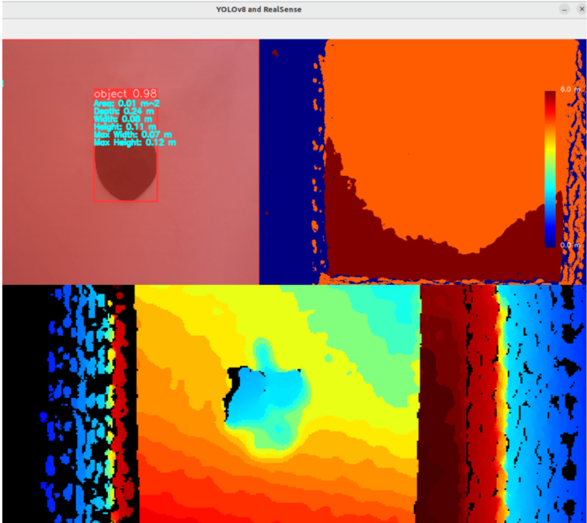
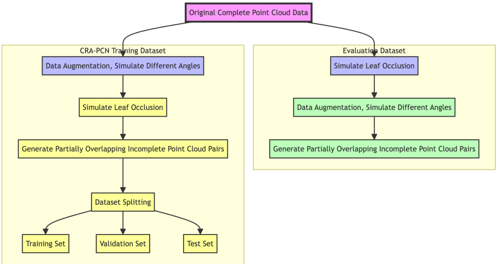
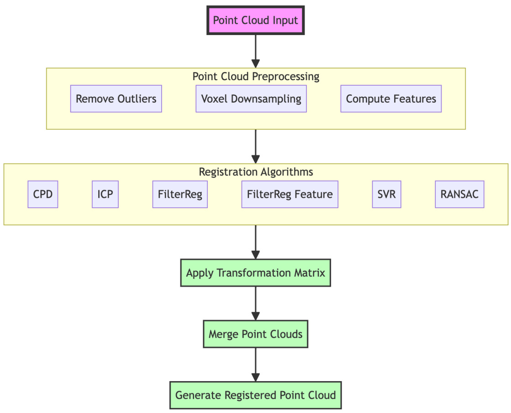
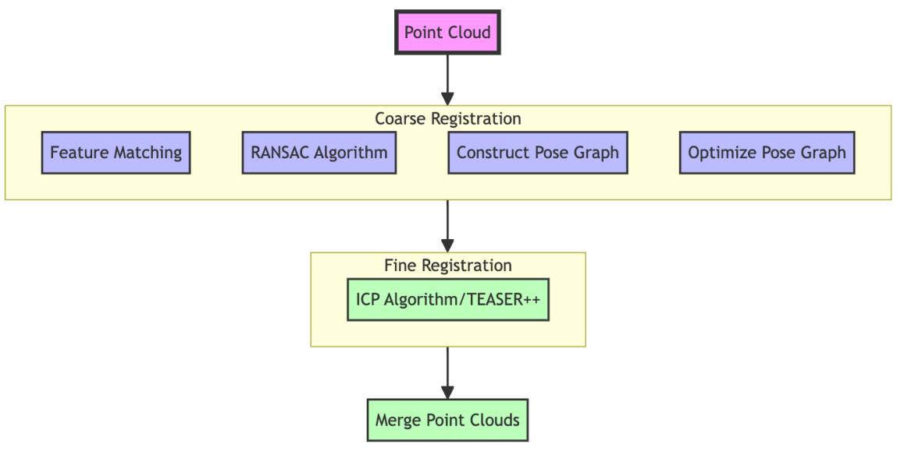
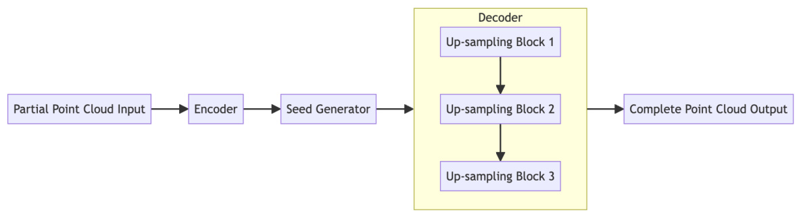
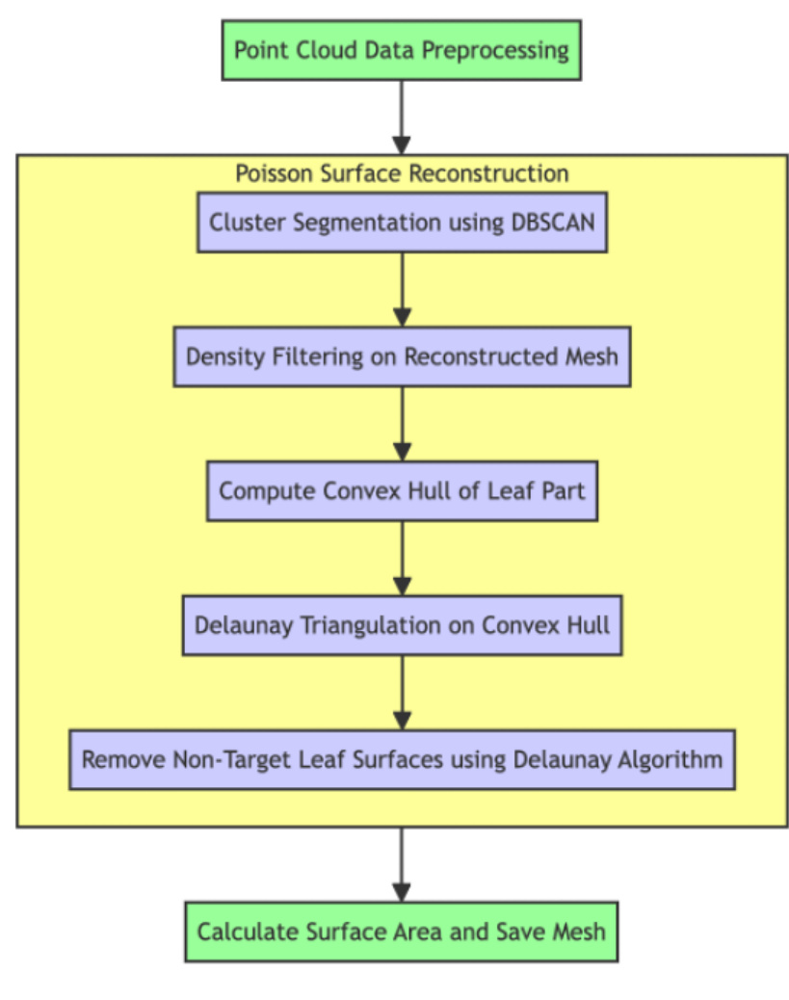
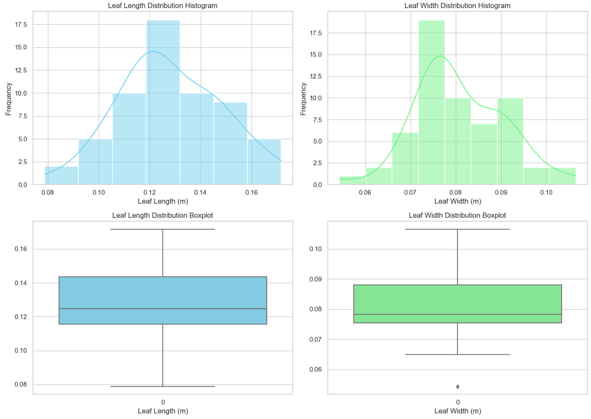
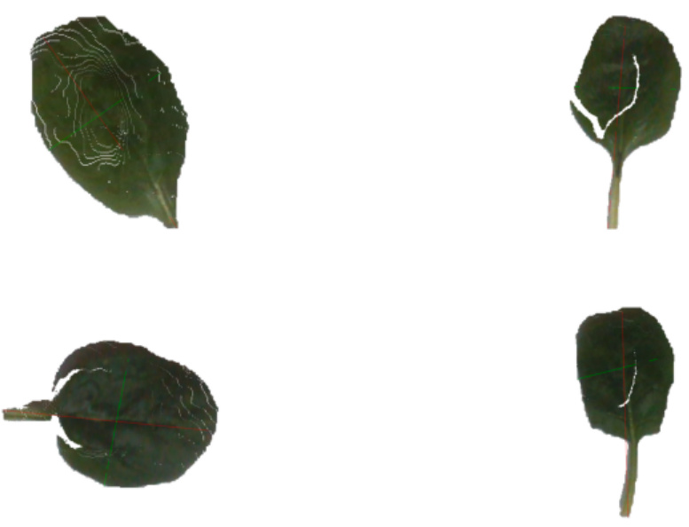
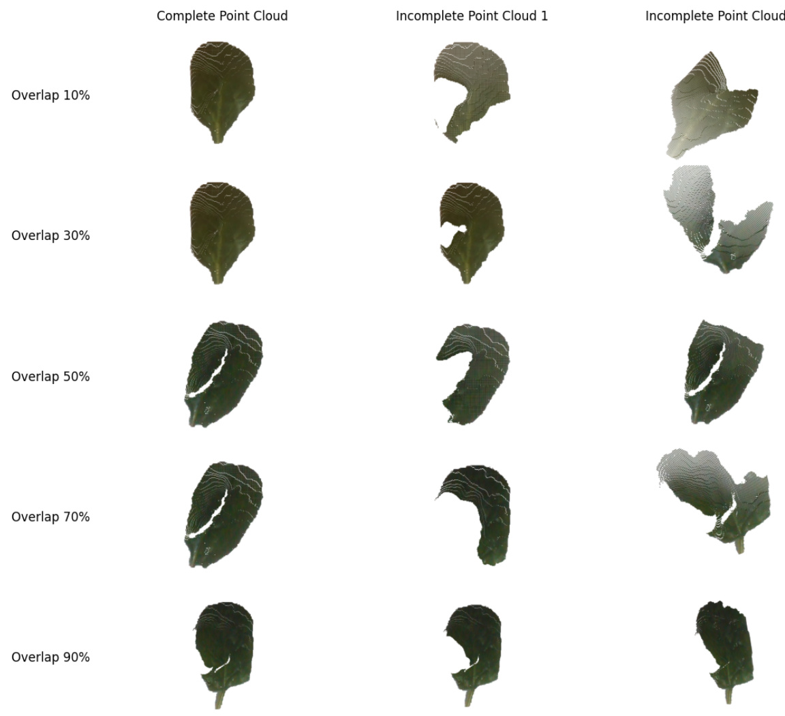
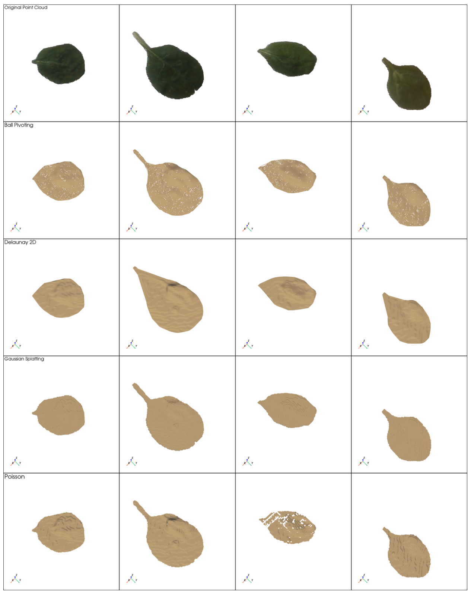

# A Comprehensive Approach for Low-Cost and Rapid Plant Leaf Phenotyping Using Multi-View Point Cloud Fusion, Deep Learning and SLAM

Daidai Qiu May 2024

M.Sc. Research Practice Report Information Technology Group

WAGENINGEN UNIVERSITY

Supervisor: Ebo Bennin

# Abstract

# 1. Introduction

1.1 Image Analysis in Plant Phenotype Analysis   
1.2 Point Cloud Analysis in Plant Phenotype Analysis   
1.3 Key Technologies in Point Cloud Analysis   
1.4 Research Questions and Tasks

# 2. Related Work

2.1 Surface Reconstruction Algorithms   
2.2 Point Cloud Registration Algorithms   
2.3 Point Cloud Completion Models   
2.4 Applications of SLAM Technology

# 3. Method

3.1 Hardware Setup   
3.2 Data Collection and Preprocessing   
3.3 Point Cloud Segmentation   
3.4 Dataset Construction   
3.5 Point Cloud Registration   
3.6 Point Cloud Completion Model   
3.7 Surface Reconstruction   
3.8 Obtaining Pose Information Using SLAM

# 4. Experimental Results

4.1 Leaf Morphological Feature Analysis   
4.2 Point Cloud Segmentation Results   
4.3 Results of Point Cloud Registration and SLAM technology   
4.4 Leaf Surface Reconstruction Results   
4.5 Point Cloud Completion Results

# 5. Discussions

# 6. Conclusions and Recommendations

6.1 Conclusions   
6.2 Recommendations

# References Abstract

Plant phenotyping is crucial for optimizing greenhouse production. However, acquiring complete point clouds of plant leaves and extracting accurate phenotypic information in a rapid and cost-effective way remains a challenge. Thus, this study aims to develop a low-cost and efficient approach for acquiring complete leaf point clouds and extracting phenotypic information by integrating point cloud registration, surface reconstruction, completion, and SLAM-based coarse registration techniques.

Using a Realsense D435i camera, the RGB images and point clouds of 59 plant leaves were collected. YOLOv8 and Segment Anything Model (SAM) were employed for real-time point cloud segmentation. Principal component analysis (PCA) was applied to extract leaf length and width. Four surface reconstruction methods (Gaussian Splatting, Poisson, Delaunay triangulation, and Ball pivoting) were used to obtain leaf area data. Incomplete point clouds with varying overlap levels were also generated for training and evaluation purposes.

Several point cloud registration algorithms were tested and evaluated using RMSE, MAE, Hausdorff distance and Chamfer distance. TEASER $^ { + + }$ performed well in almost all overlap scenarios. The global registration algorithm that first performs coarse registration and then uses ICP for fine registration also shows similar effects to TEASER $^ { + + }$ . The Poisson surface reconstruction achieved the best performance in recovering leaf surface details. The CRA-PCN model demonstrated good capabilities in point cloud completion, especially in predicting missing leaf shapes under varying occlusion levels. Moreover, SLAM was explored for coarse multi-view point cloud registration, showing potential for improving accuracy of the registration.

This study provides a complete solution for low-cost and rapid acquisition of plant leaf phenotypic information by combining various algorithms in point cloud segmentation, registration, completion, and surface reconstruction. It can effectively obtain key leaf phenotypic traits such as curvature, shape, and leaf area from 3D reconstructed point clouds. Results showed that this approach is potential and feasible in plant phenotyping, even with some challenges in practice, including accuracy in pose estimation, noise removal of point cloud and point cloud completion.

# 1. Introduction

With the development of intelligent greenhouse production, it is becoming increasingly important to obtain plant phenotypic information quickly and efficiently. This is also the basis for developing autonomous greenhouses. For example, obtaining important plant growth indicators such as the number of leaves, curvature, shape, and leaf area is crucial for improving greenhouse production management levels. Currently, artificial intelligence and agricultural robots are widely used in the agricultural sector to achieve automated tasks such as fruit picking and pruning. All of these rely on precise plant detection, such as determining fruit maturity and size for fruit picking (Mukherjee et al., 2024), analyzing phenotypic information like leaf area and leaf shapes of corn and sorghum (Prat et al., 2019), and detecting root development to assess irrigation needs (Reina, 2024).

# 1.1 Image Analysis for Plant Phenotyping

In the past, plant phenotypic data analysis was typically done using twodimensional images. This method is cost-effective, fast, and convenient, making it useful for quickly identifying plant pests, diseases, and some basic physiological information. However, the disadvantages are also obvious. It usually fails to capture complex plant skeletal structures and lacks the ability to obtain detailed three-dimensional information on leaf textures. Additionally, it is easily affected by lighting conditions, leading to incomplete capture of important features. As a result, it cannot satisfy the needs for intelligent autonomous greenhouses.

# 1.2 Point Cloud Analysis for Plant Phenotyping

Compared with image analysis, 3D point cloud can provide more information, point cloud data can be captured and merged from multiple views to solve the problem of leaf occlusion. It also can be used for 3d reconstruction to obtain leaf curvature, leaf surface area, inclination angle, texture plant morphological skeleton (Gu et al., 2024; Theiß et al., 2024; Yang et al., 2024).

Many studies have proven the importance of point cloud analysis in plant phenotyping. For example, segmenting organs such as stems, leaves, flowers, and fruits provides more detailed information for plant growth monitoring and yield estimation (D. Li et al., 2022; Wang et al., 2023), extracting the skeleton stems and leaves of corn crops (Wu et al., 2019), separating different parts of the plant such as fruits (Wahabzada et al., 2015) of wheat plants, obtaining precise growth data such as leaf angle, length, shape, etc (Atefi, Ge, Pitla, & Schnable, 2019). In general, 3D point cloud analysis technology plays an important role in plant phenotyping and can provide more comprehensive and accurate plant growth information. very helpful for studying plant phenotypes.

# 1.3 Key Techniques in Point Cloud Analysis

Point cloud data analysis includes registration, segmentation, completion, and surface reconstruction of point clouds.  It can provide more plant phenotypic information (Das Choudhury et al., 2020).  Multi-viewpoint point cloud fusion can solve incomplete point clouds problem caused by occlusion, and helps to analyze the growth of plants more accurately (Chebrolu et al., 2021; Huang et al., 2021).

Deep learning models are another major method used in analysis, mainly used for accurate segmentation, recognition, and completion of point clouds (Han et al., 2023; He et al., 2022; Lu et al., 2020).  For example, PointNet and PointCNN models can perform feature extraction, classification, and segmentation of point clouds.  When collecting point cloud data, occlusion usually causes incomplete point cloud, especially in the mature development stage of plants. There are two ways to solve it. The first is to collect multiple point clouds from different views and then register and fuse them. The second method is using deep learning models to complete the missing point cloud part (Mok et al., 2022; Zhang, Z., Yu , & Da, 2022; Fei et al., 2022).  For example, models such as PoinTr, PF-Net and ProxyFormer can directly predict occluded parts. Prediction of incomplete point clouds is very helpful when the occlusion is severe and multi-view point clouds cannot be obtained (Fei et al. , 2022; Li et al., 2023; Yu et al., 2023; Yu et al., 2021).

After point cloud registration, surface reconstruction is another important step. The purpose is to create a continuous surface from a point cloud to obtain information such as surface area. There are two methods of surface reconstruction: geometric methods, and deep learning methods. The geometric method refers to the direct use of geometric or statistical algorithms to operate on point clouds. Its advantage is that there are many mature algorithms and libraries that can be used directly without any pre training. For example,

Poisson surfaces, algorithms such as Delaunay, and popular libraries such as Open3d, VTK and OpenMVS (Hou et al., 2022; Kazhdan et al., 2006; S. Li et al., 2020). Deep learning method usually uses convolutional neural networks to reconstruct surfaces from sparse or incomplete point clouds directlyly, which are suitable for processing target point clouds with complex surfaces (Farshian et al., 2023; Wu et al., 2023).

# 1.4 Research Questions and Tasks

In actual production, there are many challenges in collecting a complete point cloud. One of the important problems is that many 3D scanning equipments are expensive and complex to operate. Due to the large volume of point cloud data, the processing speed is relatively slow and cannot meet the requirements for rapid point cloud analysis (Chen et al., 2018; Tang et al., 2023). Another common challenge is that it is difficult to obtain a complete point cloud (Kim et al., 2021). This is usually because of occlusion, inaccurate pose estimation, light, and noise from the device itself (Weijie et al., 2020; Wu et al., 2022).

# Research Questions

Thus, the major research question of this research is as follows:

How to rapidly acquire complete point clouds of plant leaves and accurately extract leaf phenotypic information from them using low-cost devices?

To solve this problem systematically, this study proposes the following four sub-questions:

1. How to efficiently segment target plant leaf point cloud data using deep learning models?

2. How to solve the leaf occlusion problem and improve point cloud registration accuracy through multi-view imaging and SLAM technology?

3. Which surface reconstruction algorithm is suitable for plant leaf surface reconstruction, and how to optimize its performance?

4. The application and performance evaluation of deep learning models in point cloud completion.

# Major Tasks

To answer the questions, the major tasks of this study include:

1. Use Realsense D435i camera to collect RGB images, depth images, and combine it with the latest deep learning model YOLOv8 and Segment Anything Model to achieve real-time point cloud segmentation. This method enables efficient and accurate extraction of leaf point clouds from the background.

2. Under different overlap levels ( $10 \%$ , $30 \%$ , $50 \%$ , $70 \%$ , and $90 \%$ , the performance of different point cloud registration algorithms (ICP, Global ICP, SVR, RANSAC, CPD, Teaser $^ { + + }$ , FilterReg Rigid, FilterReg Feature) was tested. Based on the characteristics of different algorithms, a registration strategy that combines coarse registration and fine registration is proposed: using algorithms such as RANSAC for coarse registration, constructing a pose graph, and using pose information for rough alignment; then using Teaser $^ { + + }$ for the fine registration to improve accuracy.

3. The performance of different surface reconstruction algorithms was evaluated. To address the extra watertight surfaces discovered in the experiment, an optimization method was proposed: density filtering to remove redundant parts of the leaf edges; Delaunay triangulation or Ball Pivoting reconstruction algorithms were used only to process the extra watertight surfaces. This method effectively improves the quality and accuracy of surface reconstruction.

4. Other works include using the CRA-PCN model to predict and complete point cloud occluded areas and applying SLAM technology to obtain accurate poses to improve point cloud registration.

# 2. Related Work

This section reviews the current main research results in surface reconstruction, point cloud registration and completion, and discusses their advantages and disadvantages to provide theoretical support for the work of this study. In addition, SLAM technology is introduced, and its application in point cloud rough registration is discussed, as well as the potential and limitations of these methods in actual plant phenotyping analysis.

# 2.1 Surface reconstruction algorithms

Point clouds are composed of many discrete points and are usually collected by 3D scanning equipment. Surface reconstruction refers to generating a smooth and continuous three-dimensional surface model from these discrete points

(Berger et al., 2014; Lim & Haron, 2014), it is the basis of point cloud analysis.   
Point cloud reconstruction can be achieved using a variety of algorithms.

# Ball Pivoting

Ball Pivoting algorithm assumes that a virtual ball starts with selecting three points in the point cloud as initial vertices, then pivoting until it touches two other points, which makes a triangular surface, it continues pivoting from the edges of the new triangle, until it touches another two points, the process above is repeated all points of the point cloud have been processed or no new triangular faces can be generated (Bernardini et al., 1999).

The Ball Pivoting algorithm generates surfaces rapidly, thus, it is suitable for large amounts of point cloud data. It can capture more details and surfaces by changing the radius of the ball, so it can be applied to different point cloud densities. However, it is quite sensitive to noise, requiring prior denoising and outlier removal, inappropriate radius selection can cause voids in the mesh since the radius selection of the ball has a direct impact on the reconstructed surface.  (Bernardini et al., 1999).

# Delaunay Triangulation

Delaunay triangulation refers to establishing a set of triangles from a group of discrete points and ensuring that no point exists in the circumcircle of any triangle. It maximizes the minimum angle of all the triangles, avoids long or distorted triangles, and uniformly spreads them. It starts with randomly selecting a few points to create the initial triangle. Then, continuously points are added to the current triangle to create uniform and regular triangles. Every insertion of a new point updates the triangle where the circumcircle contains the new point, deleting the old one and forming new triangles with the new point as a vertex. This process is repeated until all the points are inserted (Cazals & Giesen, 2006; Lee & Schachter, 1980).

The key benefits are that it can generate a unique surface of high-quality triangular mesh and can be applied to point clouds with irregular density and distribution of points. However, it also has some disadvantages, the method is also highly sensitive to outliers, and it usually fails to reconstruct the point clouds with sharp features accurately, some unrealistic boundaries may be generated. (Gopi et al., 2000).

# Gaussian Splatting

Gaussian Splatting assumes each point is a Gaussian distribution kernel in the point cloud. It divides the space into the cubes or voxels, where each voxel has a scalar value, for every voxel, the Gaussian distribution values of all the points within the voxel is summed up and taken as the scalar value. In this way, the isosurfaces can be extracted given a specific value, so the surface is also reconstructed (Chen et al., 2023; Lyu et al., 2024; Zwicker et al., 2023; Lyu et al., 2024; Zwicker et al., 2001).

It is robust to noise, making the reconstruction more stable, the generated surface is also smooth. However, it tends to lose some details, and fails to refine the surface, the effect of surface reconstruction is also sensitive to the parameter’s settings (Chen et al., 2023; Wolf et al., 2024; Zwicker et al., 2001).

# Poisson Reconstruction

Poisson algorithm estimates the normal vector of every point and uses these normal vectors to construct the Poisson equation. Like Gaussian Splatting, it solves the Poisson equation to generate a continuous reconstructed surface in a continuous scalar field (Kazhdan et al., 2006; Kazhdan & Hoppe, 2013).

It is robust to outliers, capable of handle point clouds of various densities, and generates smoother surfaces (Kazhdan et al., 2006). However, compared with other algorithms, the calculation process of this algorithm is more complicated and time-consuming. Since the normal of the points impact on the surface reconstruction significantly, the selection of parameters will affect the final surface reconstruction effect, and it may also generate some redundant boundaries, so the further post-processing is required (Hoppe, 2008; Kazhdan et al., 2020).

# 2.2 Point cloud registration algorithms

Point cloud registration is a method for aligning different point clouds to the same coordinate system, and calculate the transformation matrix between different point clouds, which is used to register and merge point clouds from multi-views into a new point cloud (Huang et al., 2021; Pomerleau et al., 2015).

# CPD

The CPD (Coherent Point Drift) algorithm assumes that every point of the source point cloud is a Gaussian distribution, it finds the relationship by calculating the corresponding probability between the two point clouds, then continuously updates the position of the point in the source point cloud until the error no longer changes significantly. (Myronenko et al., 2006).

It is robust to noise and outliers and solves the non-rigid regitration problems. It can avoid local optimal solutions and achieve higher accuracy. However, it is sensitive to the setting of initial parameters, which will directly affect the registration effect (Myronenko & Song, 2010).

# FilterReg

The FilterReg algorithm uses a probabilistic model to evaluate and optimize the alignment between two point clouds. It uses the vector field to describe how a point moves from the original position to the new position, and then the algorithm checks whether the best alignment are achieved. The best transformation parameter can be obtained by optimizing the vector field. It also uses filter to reduce the impact of outliers, which improves the accuracy and robustness of registration (Gao & Tedrake, 2018).

It is robust to outliers, suitable for non-rigid registration, and can avoid falling into local optimal solutions. However, the disadvantages include its sensitivity to parameter settings, complicated calculations, and relatively slow processing speed (Gao & Tedrake, 2018).

# FilterReg $+$ Feature

FilterReg with Feature is based on the original FilterReg; the difference is that it adds feature point extraction and matching. These feature points guide the registration process, improving registration accuracy and robustness. The biggest advantage is that registration can usually be achieved even if there are little overlapping areas or a lot of noise. However, since feature point extraction is added, the process also becomes more time-consuming. (Rusu et al., 2009; Xu and Huang, 2021).

# ICP

The ICP algorithm repeatedly looks for the nearest point pairs between the source and target point clouds. First, an initial transformation matrix is used for rough alignment. Second, for every point in the source point cloud, it finds the nearest counterpart in the target point cloud, then it calculates rigid transformation matrix for the optimal translation and rotation to minimize the distance. Finally, the final transformation matrix and the transformed registration source point cloud are calculated (Sharp et al., 2002).

The algorithm implementation is quite simple and appropriate for solving rigid registration problems. Its disadvantages are that the effect of registration is greatly influenced by the initial alignment, and the noise and outliers tremendously influence the process of registration (Bouaziz et al., 2013; Sharp et al., 2013).

# RANSAC

The RANSAC (Random Sample Consensus) registration algorithm solves the rigid transformation problem. It starts with extracting feature points from two point clouds and finds matching point pairs. Second, the algorithm randomly selects enough point pairs to calculate a transformation matrix. Third, it applies the transformation matrix to the source point cloud, calculates the distance between the transformed point clouds, and marks all points with an error less than a certain threshold as inliers. Fourth, the above steps are repeated, optimizing the transformation matrix to increase the number of inliers points each time. Finally, the transformation matrix containing the most inliers is selected as the output result (Chen, 1999; Chen, Hung, & Cheng, 1999; Derpanis, 2010).

Its advantages include suitability for processing point clouds with many outliers. However, its disadvantage is that the threshold and the number of iterations have great impacts on the final registration effect. At the same time, due to random sampling and many iterations, the running speed is relatively slow (Chen, 1999; Chen et al.1999; Derpanis, 2010; Li et al., 2021).

# SVR

The Stochastic Variational Registration (SVR) algorithm can solve rigid and non-rigid registration problem. First, it extracts the feature points from the source and the target point cloud to match each other. Second, it uses a probability model containing transformation parameters, which is optimized through variational inference, to obtain a variational distribution. Third, Sampling transformation parameters from a variational distribution and calculating the current transformation. Fourth, it marks and counts the points that error is less than a certain threshold to update the parameters of the variational distribution. Finally, the process is repeated to maximize the number of inliers, until there’s no longer significant changes.

Its advantage is that it is robust to noise. The disadvantage is that the threshold parameters could influence the final registration effect significantly, since the calculation is complicated, the processing speed is relatively slow (Sun et al., 2011).

# Global ICP

The Global ICP algorithm combines RANSAC and ICP. RANSAC is used for global registration for coarse alignment, a pose graph is constructed and pose optimization is performed, and then ICP is used for fine registration. It combines the advantages of both algorithms to achieve better registration effect, but the computational complexity increases, so the processing speed will be slower. (Han et al., 2015; Huang & Hu, 2015).

# TEASER++

TEASER $^ { + + }$ uses the truncated least squares (TLS) cost function to remove outliers and then registers the point cloud by rotation and translation. It is suitable for rigid registration and point clouds with lots of outliers, TEASER $^ { + + }$ can handle more than $9 9 \%$ of outliers and runs efficiently, often in milliseconds (Yang et al., 2020).

# 2.3 Point cloud completion model

Encoder-decoder in the common architecture many point cloud completion models, encoder module takes the incomplete point cloud as input and decoder produces the complete point cloud from vectors (Yuan et al., 2018).

1. PCN model extracts global features through the encoder, then decodes to generate a rough point cloud, and finally restores the complete point cloud through detail optimization (Yuan et al., 2018).   
2. PF-Net model extracts global features through the encoder, gradually improves the resolution of the point cloud through the decoder, and predicts the complete point cloud (Huang et al., 2020).   
3. PoinTr model assumes the point cloud as a group of point agents, captures global and local geometric relationships in the encoder through the selfattention mechanism, and then the decoder directly generates the complete point cloud (Yu et al. al., 2021), and SeedFormer model also has a similar working pattern (Li et al., 2023).

# 2.4 SLAM application

SLAM (simultaneous localization and mapping) refers to a technology in which mobile devices collect data in an environment by equipped with IMU (inertial measurement unit), cameras, lidar and other sensors, and build a map of the environment in real time and determine the current location. SLAM technology combines different sensors, such as cameras and IMUs, to improve positioning accuracy and robustness (Bailey & Durrant-Whyte, 2006; Durrant-Whyte & Bailey, 2006; Grisetti et al., 2010).

The SLAM uses lidar or depth cameras to collect point cloud data, aligning the data from different sensors, and then extracting key feature points from the images and point cloud. Next, it uses the acceleration and angular velocity data acquired by the inertial measurement unit (IMU). The velocity is obtained by integrating the acceleration, and then the displacement is obtained by integrating the velocity. Integrating the angular velocity provides the attitude change of the device, thereby obtaining an attitude estimate of the sensor. However, the IMU sensor itself usually has noise. Direct integration leads to significant error accumulation, causing position drift issues. The longer the time, the greater the error, which seriously affects the pose accuracy (Bailey & Durrant-Whyte, 2006; Durrant-Whyte & Bailey, 2006; Fuentes-Pacheco et al., 2015).

The position drifting problem can be solved by filtering algorithms it combines the data from the IMU and the extracted key feature points from the image to reach better data fusion. It has been proven that filters like the Extended Kalman Filter can correctly handle state estimation in nonlinear systems, It helps to high accurate localization in practice (Fujii, 2013; Ribeiro, 2004). The Mahony and Madgwick filters were designed to handle noise in attitude estimation, and such can give a more stable and accurate attitude output on attitude and increase the output, increasing the attitude (Ludwig & Burnham, 2018; Madgwick, 2010; Mahony et al., 2008). Finally, loop closure detection will identify the same initial and ending positions to further reduce the position drifting caused by error accumulation.

# 3. Method

This study designed a comprehensive point cloud data research process, including key steps such as data collection, leaf segmentation, point cloud registration, SLAM pose acquisition, point cloud completion, surface reconstruction, and phenotypic information extraction. As shown in Figure 1.

  
Figure 1. Workflow of Research Methodology

# 3.1 Hardware setup

Nowadays many consumer level depth cameras only cost around 100-200 euros, like the Realsense series, can capture more accurate data with error precision of up to 0.001m. It is possible to obtain the 3D data of leaves in a low cost, these consumer depth cameras are usually small and portable which can be mounted on the robotic platforms or handheld devices for applications across a wide range (Zhang, Xia, & Qiao, 2020)..

Equipment selection: Raspberry Pi 5 and an Intel Realsense D435i depth camera were used to collect, and process point cloud data. RealSense D435i supports depth streaming and color streaming with resolutions of 1280x720 and 1920x1080 respectively, frame rates up to 90 fps, and its operating depth range is 0.2 to 10 meters.

System installation: Ubuntu Server 22.04 LTS was installed on Raspberry Pi 5 to ensure that various required libraries can be installed normally.

Device Connection: Connect the Realsense D435i camera to the Raspberry Pi 5 via USB 3.0.

# 3.2 Data collection and preprocessing

# Depth camera installment

Through testing, it was found that the depth data collected by Realsense D435i within 25cm is incomplete and with many blank areas, if the distance is too far, the accurate surface information of relatively small targets such as leaves cannot be obtained well. Therefore, the Realsense D435i was fixed about 30cm away from the spinach leaves, and the leaves were continuously collected by moving the leaves, or the target leaves were captured with a handheld depth camera within a range of about 30cm to ensure that the leaf point cloud data could be completely captured.

# Camera parameter settings

To reach the fast-processing speed and high segmentation accuracy, this study segmented the leaf point cloud by segmenting RGB images and depth maps. Thus, the resolution of the color frame of the depth camera is set to a maximum of $\mathbf { 1 9 2 0 \times 1 0 8 0 }$ , and since the depth image contains more data, considering the processing speed, the depth resolution is set to a relatively low $6 4 0 \times 4 8 0$ . The frame rate is 30 frames/second.

# Collection process

The RealSense D435i depth camera uses structured light technology, which uses an infrared laser projector to emit a set of infrared light points. These light points form a specific pattern and are projected onto the surface of the target object. As the Figure 2 shows, the two infrared cameras on the left and right of the camera receive these reflected infrared light points, then compare the differences in the images captured by the left and right cameras and use the internal parameters of the camera such as focal length to calculate the depth data (Condotta et al., 2020).

  
Figure 2. RealSense D435i Camera Module Components

In actual tests, we found that the quality of depth images is greatly affected by light condition. If the light is too bright, it will disturb the recognition of structured light patterns. If the light is too dark, the pattern characteristics of the infrared light points used becomes not obvious, and it also affects the RGB Image collection. Therefore, according to the principle of structured light, to improve the accuracy of sampling, the camera is set to a high-density preset mode, whic means the camera projects more infrared light points. After testing, it has been verified that the noise and holes in the depth image can be significantly reduced in this way.

# Sampling object

In this study, Spinach (Spinacia oleracea) was selected as the experimental subject. The main reasons include:

Spinach is a common green leafy vegetable with large leaves and relatively simple three-dimensional structure of leaves with suitable curved surfaces, which is suitable for the goals of this research (Metzger & Zeevaart, 2019).

Spinach leaves are not highly reflective, so the collected depth images have less chance to appear holes.   
Spinach can be cultivated in greenhouse easily, and leaf samples under different growth stages can be easily obtained.

# 3.3 Segmentation of point cloud

Considering the current equipment’s performance, to quickly collect and segment leaf point clouds, this study designed a fast-processing solution, which can be divided into three steps: Identification, Alignment, and Conversion, as shown in Figure 3.

# Identification

This study uses the YOLOv8 model for semantic recognition, first, obtaining the area where the target spinach leaves are located. YOLO is a target detection model based on deep learning. Its principle is to divide the input image into multiple equal grids and use a convolutional neural network to identify the position and size of the target bounding box for each grid and calculate Confidence scores and class probabilities. The neural network mainly includes three parts: Conv Layers, Fully Connected Layers, and Output Layer (Jiang et al., 2022). The bounding boxes with confidence lower than the threshold are deleted, and Non-Maximum Suppression is used to filter out low-confidence and overlapping bounding boxes, leaving only high-confidence bounding boxes (Neubeck and Van Gool, 2006). Finally, the bounding box position, size and category of each target are output. Since YOLOv8 only needs one forward pass to predict directly, the detection speed is particularly fast and suitable for the leaf detection task of this study (Haritha et al., 2022). SAM (Segment Anything Model) is currently one of the most popular zero-shot image segmentation models, SAM uses a pre-trained Vision Transformer (ViT) to extract features from the input image. It supports point, box, and mask as prompts and encode them as vectors and uses the Mask Decoder to create the segmentation mask (Kirillov et al., 2023). Since the SAM has enabled the Zero-Shot Detection, it can be used in this study without any fine-tuning.

In this study, for each detected spinach leaf bounding box, the SAM model was used to segment the detected leaf area and generate the corresponding binary mask. Each mask has a pixel value of 1 for leaf areas and 0 for non-leaf areas.

  
Figure 3. Fast Point Cloud Segmentation of Spinach Leaves: Identification, Alignment, Extraction and Conversion

# Alignment

This step creates a mask array with the same size as the depth image and apply the generated mask to the depth image to extract of the target leaf area, it can segment the background and other irrelevant parts, retaining only the depth

data of the leaf area.

# Conversion

Using the internal parameters of Realsense d435i, which include the focal length of the camera, optical center, etc., the depth map of the leaves is converted into point cloud data (Pal et al., 2017). The generated point cloud data contains the three-dimensional coordinates and color information of each leaf surface.

Current methods include using the YOLOv8 model to identify leaves, using the SAM model to segment the leaf area, aligning the RGB mask and the depth image, extracting the depth data of the leaf area, using camera internal parameters to convert the depth map to a point cloud, and finally generating three-dimensional point cloud data. Experiments show that it can collect and obtain point clouds of target leaves efficiently and accurately. This is because the depth image is two-dimensional, compared to directly processing point cloud data, the data volume is smaller, so the calculation speed is higher. The entire process has low requirements on device performance. After actual testing, the average processing speed is between 1-2 seconds. meet the requirements of practical application.

  
Figure 4. YOLOv8 Object Detection and Depth Image

# 3.4 Dataset construction

This study built two datasets, as shown in Figure 5. One is an evaluation dataset for testing different point cloud registration algorithms, and the other is a training dataset for model training of CRA-PCN point cloud completion.

  
Figure 5. Construction of Evaluation and Training Datasets for Point Cloud Registration and Completion Model

# Evaluation dataset

The 59 complete point clouds were collected, each complete point cloud was processed to generate two incomplete point clouds, which overlapped each other, resulting in a total of 118 incomplete point clouds. The specific steps are as follows:

1. Simulate leaf occlusion: First, calculate the average of all points as the center point of the point cloud, and then select the Z axis as the normal vector of the slice plane, that is, create a vertical xy-plane cut surface. Second, calculate the distance of each point from the slice plane by subtracting the center point from each point and then taking the dot product with the normal vector. Then set an overlap level and calculate the range of the distance threshold. These two thresholds determine which points will be assigned to part point cloud 1 or part point cloud 2. Finally, a distance threshold is used to create a mask that segments the point cloud into two partially overlapping point clouds.

2. Simulate position and orientation differences: Randomly apply a transformation to one of the incomplete point clouds to simulate differences between point clouds. These transformations include random rotations and translations, where the rotation angle ranges from $\mathbf { - 1 0 ^ { \circ } }$ to $\bf { 1 0 ^ { \circ } }$ and the translation vector ranges from $^ { - 5 }$ cm to $5 \mathrm { c m }$ .

The incomplete point clouds generated by this method have a certain degree of overlap. At the same time, through random rotation and translation changes, they simulate the differences in point clouds shot from different angles in actual collecting.

# Training dataset

The creation process is similar with the evaluation dataset, the difference is that complete point clouds are first generated from the original complete point cloud through data enhancement, and then created leaf occlusion artificially. Here are the detailed steps:

1. Data enhancement: Apply random rotation and scaling to each original complete point cloud to generate some new complete point clouds. The rotation angle is between $\overline { { - 5 0 } } ^ { \circ }$ and $5 0 ^ { \circ }$ , and the scaling factor is between 0.5 and 1.2. This step starts from 2950 new complete point clouds that generated from the original 59 complete point clouds.

2. Simulate leaf occlusion: Process the enhanced 2950 complete point clouds to simulate leaf occlusion and generate incomplete point clouds of varying degrees. 11 different incomplete point clouds are generated for each complete point cloud, resulting in a total of 32450 incomplete point clouds.

3. Dataset division: Divide all generated complete and incomplete point clouds in a ratio of 8:1:1 to generate training, validation, and test dataset. The specific division is as follows:

Training dataset contains 23,600 complete point clouds and 26,080 incomplete point clouds.   
Validation dataset contains 2950 complete point clouds and 3240 incomplete point clouds.   
Test dataset contains 2950 complete point clouds and 3240 incomplete point clouds.

It provides point clouds with various degrees of leaf occlusion for CRA-PCN model training, helping to improve the robustness and adaptability of the

model.

# 3.5 Point cloud registration

This study uses currently common point cloud registration algorithms to design two types of registration schemes and conduct tests. These algorithms include ICP, Global ICP, SVR, RANSAC, CPD, TEASER $^ { + + }$ , FilterReg, and FilterReg Feature. The different algorithms were implemented through probreg and open3d library.

# The general steps

For the evaluation of every algorithm, the source and target point clouds are first loaded, and outliers are removed. To improve the speed of the registration algorithm, voxel down sampling is done on point clouds, and the voxel size is set to 0.001. Then different registration algorithms are applied for registration, and the algorithm parameters adopt the default parameters. Finally, the transformation matrix is applied to the source point cloud, and the two point clouds are fused to generate a complete point cloud.

# 3.5.1 Direct registration

The first type is to directly apply the algorithm and then evaluate the registration effect.  This includes CPD, ICP, FilterReg, FilterReg Feature, and SVR algorithms, as illustrated in Figure 6.

Table 1. Parameter Settings for Point Cloud Registration Algorithms   

<html><body><table><tr><td>Algorithm</td><td>Parameter1</td><td>Parameter2</td></tr><tr><td>CPD</td><td>N/A</td><td>N/A</td></tr><tr><td>FilterReg</td><td>objective_type: pt2pt</td><td>update_sigma2: True</td></tr><tr><td>SVR</td><td>N/A</td><td>N/A</td></tr><tr><td>FilterReg with FPFH</td><td>objective_type: pt2pt</td><td>sigma2: 1000</td></tr><tr><td>ICP</td><td>threshold: 0.8</td><td>trans_init: identity matrix (np.eye(4))</td></tr><tr><td>RANSAC Registration</td><td>distance_threshold: 1.5 * voxel_size</td><td>N/A</td></tr></table></body></html>

  
Figure 6. Direct Point Cloud Registration Workflow

1. FilterReg: objective_type is set to "pt2pt", which means minimizing the distance between every point in the source point cloud and its counterpart in the target point cloud. update_sigma2 is true, indicating that the error estimate is automatically updated during the registration process.

2. FilterReg with FPFH: The feature function FPFH is used for registration, the objective_type is "pt2pt", and sigma2 is initialized to 1000. sigma2 represents the estimate of the error in the distance between points. In this study, the error between the two point clouds is assumed as large by default, so the setting is slightly higher.

3. ICP: trans_init is used to set the initial transformation matrix.

4. RANSAC Registration: distance_threshold plays a similar role to threshold, determining the maximum allowable distance between each point between both point clouds.

# 3.5.2. Global registration method

The second registration method is the combination of coarse registration and fine registration, as illustrated in Figure 7.

# Surface Reconstruction Implementation Steps

1. The first step is to obtain the in the local geometric features of each point by calculating the FPFH (Fast Point Feature Histograms), then uses features to find the relationship between two point clouds (Rusu et al., 2009). Then the RANSAC algorithm and FPFH features are combined in global registration. The RANSAC algorithm can remove outliers effectively and obtain robust initial registration results by random sampling (Derpanis, 2010), an initial transformation matrix is obtained.

2. The initial transformation matrix is used to construct the pose graph in the beginning, then the global optimization algorithm is used to optimize the pose graph for all point cloud segments iteratively (Ge et al., 2019). Pose Graph refers to a graph structure, which is used to represent and optimize the relative pose relationships between multiple point clouds, the node represents the pose of the point cloud, the edges represent the relative transformation (Mendes et al., 2016).

3. The ICP algorithm or the Teaser $^ { + + }$ algorithm can be used to further refine the results of global registration.

  
Figure 7. Global Point Cloud Registration Workflow

# 3.5.3. Evaluation of point cloud registration effect

This study uses four indicators to evaluate the results of point cloud registration;

for each indicator, the value and standard deviation are calculated between the registered point cloud and the real point cloud.

RMSE, MAE, Hausdorff distance, it measures the maximum distance from each point in one point group to the closest point in another point group (Huttenlocher et al., 1993). Chamfer distance, it measures the average distance from every point in one point group to the nearest point in another point group, so the lower the Chamfer distance, the better the point cloud registration effect (Wu et al., 2021).

# 3.6 Point cloud completion model

In many cases, it is not enough to get a complete point cloud by registration due to leaf occlusion. Therefore, the point cloud can be completed by predicting the incomplete point cloud part. This study uses the latest CRA-PCN model (Figure 8), which first extracts the input incomplete point cloud features through the encoder, then generates a rough seed point cloud through the seed point generator, and then passes multiple up sampling modules in the decoder, gradually improve, and optimize the coarse point cloud, and finally output a complete high-resolution point cloud (Rong et al., 2024). The key innovation of this model is the cross-resolution transformer (CRT) module, which utilizes the local self-attention mechanism to aggregate the feature and enhance context between different resolutions in the encoder and decoder (Rong et al., 2024).

  
Figure 8. Point Cloud Completion Model: CRA-PCN Architecture

This study created a spinach leaf data set according to the PCN (Point Completion Network) dataset standard (Yuan et al., 2018), and conducted 400 epoch training. The hyperparameters were set as follows:

Table 2. Hyperparameter Settings for Point Cloud Completion Model Training   

<html><body><table><tr><td>Parameter Name</td><td>Value</td><td>Description</td></tr><tr><td>BATCH_SIZE</td><td>30</td><td>Number of samples in each batch.</td></tr><tr><td>N_EPOCHS</td><td>400</td><td>Total number of training epochs.</td></tr><tr><td>LEARNING_RATE</td><td>0.001</td><td>Initial learning rate.</td></tr><tr><td>LR_MILESTONES</td><td>[50,100,150,200,250]</td><td>Epochs where the learning rate is adjusted.</td></tr><tr><td>LR_DECAY_STEP</td><td>50</td><td>Step size for learning rate decay.</td></tr><tr><td>WARMUP_STEPS</td><td>200</td><td>Number of preliminary steps before training.</td></tr><tr><td>WARMUP_EP0CHS</td><td>20</td><td>Number of preliminary epochs before training.</td></tr><tr><td>WEIGHT_DECAY</td><td>0</td><td>Coefficient for weight decay.</td></tr><tr><td>LR_DECAY</td><td>150</td><td>Epoch frequency of learning rate decay.</td></tr></table></body></html>

After training, 37 predicted complete point clouds were generated using model inference and analyzed by comparing the visual differences with the Ground Truth point cloud.

# 3.7 Surface reconstruction

This study used four common surface reconstruction algorithms. Surface reconstruction refers to converting point cloud data into a continuous surface. The purpose is to restore the original surface shape of the target object and generate a surface mesh to obtain information such as surface area (Hoppe et al. ., 1992). There are two types of surface reconstruction algorithms: explicit or implicit (Berger et al., 2014; Bolle & Vemuri, 1991). For example, Ball Pivoting and Delaunay Triangulation are explicit methods, because they directly operating points on the surface to create Triangular mesh. The implicit method is to first define a scalar field, and create the final surface from a specific isosurface, such as the Poisson and Gaussian Splatting algorithms.

# 3.7.1. Delaunay Triangulation Algorithm

Delaunay Triangulation generates a mesh surface composed of triangular patches by triangulating the point cloud. The goal is to maximize the number of

the triangle which has a minimum angle and avoid the generation of slender triangles, thereby obtaining a higher quality surface.

# Steps for Surface Reconstruction Implementation:

First, use the PyVista library to load point cloud data and call the function of vtkDelaunay2D to realize surface reconstruction, and generate a preliminary triangular mesh. At this stage, the preliminary surface is rough, so vtkSmoothPolyDataFilter was used to smooth the triangular mesh. This step controls the smoothing effect by the number of iterations and relaxation factor. To retain the more details of the reconstructed surface, the smoothed surface normals were calculated to ensure that the normal directions are consistent to further improve the smoothness. Finally, use the reconstructed surface to calculate the surface area and to save the mesh as files, as depicted in Figure 9.

Table 3. Experimental Setting Parameters   

<html><body><table><tr><td>Step</td><td>Parameter Name</td><td>Value</td><td>Description</td></tr><tr><td>Smoothing Process</td><td>Number of Iterations</td><td>50</td><td>Number of iterations for smoothing process</td></tr><tr><td>Smoothing Process</td><td>Relaxation Factor</td><td>0.1</td><td>Relaxation factor controlling the degree of smoothing</td></tr><tr><td>Smoothing Process</td><td>Boundary Smoothing</td><td>On</td><td>Whether to smooth boundaries, set to on</td></tr><tr><td>Normal Calculation</td><td>Consistency</td><td>On</td><td>Ensure consistency of normal directions</td></tr><tr><td>Normal Calculation</td><td>Auto Orient Normals</td><td>On</td><td>Automatically orient normals</td></tr></table></body></html>

  
Figure 9. Delaunay Triangulation Surface Reconstruction Workflow

# 3.7.2 Poisson algorithm

The Poisson algorithm uses the normal vector to get a continuous scalar field through the Poisson equation in the point cloud, and then extracts isosurfaces from the scalar field to generate a triangular mesh surface, as a result, it can generate a smoother and continuous surface (Kazhdan et al. , 2006; Kazhdan & Hoppe, 2013).

# Steps for Surface Reconstruction Implementation:

Like the Delaunay surface reconstruction, the first step includes the voxel down-sampling and normal estimation, during the experimental testing, redundant surfaces were found on the edges of the reconstructed leaf surface, as can be seen in Figure 10. Therefore, to solve this watertight problem, this study conducted the following treatments, as demonstrated in Figure 11.

1. Use the DBSCAN algorithm to cluster and segment the point cloud. The purpose is to remove noise and outliers and find the largest cluster, that is, the main leaf part.   
2. Perform density filtering on the reconstructed mesh to remove low-density areas outside the edge of the leaf, which is also the redundant areas, and remove invalid triangles and vertices.   
3. Calculate the Convex Hull for the leaf, which defines the boundary of the point cloud data. Then the Delaunay triangulation is used on the convex hull points to generate a triangular mesh.   
4. Use the Delaunay algorithm's advantage in processing the edges to check whether the vertices of the Poisson reconstructed surface are within the Convex Hull, thereby removing the surfaces of non-target leaves.

  
Figure 10.  Surface Reconstruction with Poisson Algorithm: Left - With Redundant Surface Removal, Right - Without Redundant Surface Removal

  
Figure 11. Poisson Surface Reconstruction Workflow

Table 4. Experimental Setting Parameters   

<html><body><table><tr><td>Step</td><td>ParameterName</td><td>Value</td><td>Description</td></tr><tr><td>Point Cloud Downsampling</td><td>Voxel Size</td><td>0.001</td><td>Size of the voxel used for downsampling. Smaller values increase point cloud density,larger values decrease it.</td></tr><tr><td>Normal Estimation</td><td>Consistent Tangent Plane</td><td>100</td><td>Ensures normal direction consistency.</td></tr><tr><td>DBSCAN Clustering</td><td>Epsilon (eps)</td><td>0.02</td><td>Maximum distance between two points to be considered as neighbors.Larger values increase clustersize,smaller values decrease it.</td></tr><tr><td>DBSCAN Clustering</td><td>Minimum Points (min_points)</td><td>50</td><td>Minimum number of points required to form a cluster. Larger valuesreduce the number of clusters,smaller values increase it.</td></tr><tr><td>Poisson Reconstruction</td><td>Depth</td><td>12</td><td>Depth of the tree used for the Poisson reconstruction,controlling the level of detail.Larger values increase detail,smaller values decrease it.</td></tr><tr><td>Poisson Reconstruction</td><td>Scale</td><td>1.5</td><td>Scale factor for smoothing the details during reconstruction. Larger values increase smoothness,smaller values decrease it.</td></tr><tr><td>Density Filtering</td><td>Density Threshold</td><td>20th Percentile</td><td>Threshold for filtering low-density regions,retaining higher-density details.Higher values keep high-density regions,lower values keep more details.</td></tr></table></body></html>

# 3.7.3 Ball Pivoting algorithm

The Ball Pivoting algorithm generates triangular meshes by rolling a virtual ball on the target point cloud to form a complete surface, which is suitable for uniform sampling (Bernardini et al., 1999).

# Steps for Surface Reconstruction Implementation

Like the previous process, the first step is processing, clustering, and segmentation. The difference lies in the reconstruction part of the Ball Pivoting algorithm: the radius of the ball directly affects the degree of detail of the reconstructed surface. After experimental testing, it was found that a smaller radius can obtain finer features, but it will also produce more noise. A larger radius can produce a smoother surface but lose some detail. Therefore, this study used multiple balls with different radius, and performed the Ball Pivoting algorithm on each ball. Starting from a seed triangle, it continuously rolled on the boundary of its triangle. Whenever the ball contacts with new three points, a triangle was established. This process is repeated until all points are covered. Finally, the meshes generated with different radius are merged to obtain a complete reconstructed surface, as can be seen in Figure 12

  
Figure 12. Ball Pivoting Surface Reconstruction Workflow

Experimental Setup Parameters   
Table 5. Experimental Setting Parameters   

<html><body><table><tr><td>Step</td><td>Parameter Name</td><td>Value</td><td>Description</td></tr><tr><td>Point Cloud Downsampling</td><td>Voxel Size</td><td>0.001</td><td>Size of the voxel used for downsampling. Smaller values increase point cloud density,larger values decrease it.</td></tr><tr><td>Normal Estimation</td><td>Consistent Tangent Plane</td><td>100</td><td>Ensures normal direction consistency.</td></tr><tr><td>DBSCAN Clustering</td><td>Epsilon (eps)</td><td>0.02</td><td>Maximum distance between two points to be considered as neighbors. Larger values increase cluster size,smaller values decrease it.</td></tr><tr><td>DBSCAN Clustering</td><td>Minimum Points (min_points)</td><td>50</td><td>Minimum number of points required to form a cluster.Larger values reduce the number of clusters,smaller values increase it.</td></tr><tr><td>Ball Pivoting Reconstruction</td><td>Radii</td><td>[0.005, 0.01, 0.02,0.04]</td><td>List of radii used for ball pivoting.Different radii capture different feature sizes.</td></tr><tr><td>Smoothing</td><td>Number of Iterations</td><td>50</td><td>Number of iterations for the smoothing process.More iterations result in smoother surfaces.</td></tr><tr><td> Smoothing</td><td>Relaxation Factor</td><td>0.1</td><td>Factor controlling the degree of smoothing.Higher values result in more smoothing.</td></tr></table></body></html>

# 3.7.4 Gaussian Splatting algorithm implementation steps

The Gaussian Splatting algorithm represents each point as a Gaussian kernel, add these Gaussian kernels to form a continuous volume data, and then extracts isosurfaces of specific values to reconstruct the surface (Chen et al., 2023; Lyu et al., 2024; Zwicker et al., 2023; Zwicker et al., 2021; Lyu et al., 2024; Zwicker et al., 2001). Compared with the explicit method, it is more robust to noise and uneven sampling. By adjusting the value of the Gaussian kernel, it is easy to generate a closed, hole-free surface. Since each point is a Gaussian kernel, the isosurface is directly extracted, and the calculation speed is faster than the Poisson algorithm (Chen et al., 2023; Wolf et al., 2024; Zwicker et al., 2001). However, in actual tests, the generated surface is usually not smooth enough, so surface is needed to smooth after reconstruction.

# Steps for Surface Reconstruction Implementation:

First, the point cloud is converted into volume data using the vtkGaussianSplatter function, and then isosurfaces are extracted from the scalar field. Use vtkCurvatures to calculate the average curvature of the surface, which considers the degree of curvature in the two main directions. There are two ways to reduce the roughness of the surface, one is adjusting the size of the Gaussian kernel, another is using the curvature to perform Laplacian smoothing on the surface. Finally, use the smoothed surface to get the surface area.

  
Figure 13. Gaussian Splatting Surface Reconstruction Workflow

# Experimental Setup Parameters：

Table 6. Experimental Setting Parameters   

<html><body><table><tr><td>Step</td><td>Parameter Name</td><td>Value</td><td>Description</td></tr><tr><td>Gaussian Splatting</td><td>Sample Dimensions</td><td>300,300, 300</td><td>Dimensions of the sampling grid. Higher values result in finer volumetric data.</td></tr><tr><td>Gaussian Splatting</td><td>Radius</td><td>0.005</td><td>Radius for splatting. Smaller radius results in less blur and more concentrated points.</td></tr><tr><td>Gaussian Splatting</td><td>Exponent Factor</td><td>-2</td><td>Exponent factor affecting the decay rate of the blur.</td></tr><tr><td>Contour Filter</td><td>Scalar Value Threshold</td><td>0.03</td><td>Scalar value threshold for contour extraction.Lower values extract more detail but may increase noise.</td></tr><tr><td>Curvature Calculation</td><td>Curvature Type</td><td>Mean</td><td>Type of curvature to calculate.</td></tr><tr><td>Laplacian Smoothing</td><td>Number of Iterations</td><td>100</td><td>Number of iterations for smoothing.More iterations result in smoother surfaces.</td></tr></table></body></html>

# 3.8 Use SLAM to obtain pose information.

In this study, SLAM was applied to improve the accuracy of point cloud registration. SLAM refers to a technology that can perform positioning and map construction simultaneously, it uses various sensors such as lidar, cameras, and IMU to collect data, and through sensor fusion algorithms, pose estimation are obtained (Bailey & Durrant-Whyte, 2006; Durrant-Whyte & Bailey, 2006; Grisetti et al., 2010). The biggest difference from the previous acquisition of pose estimation in global registration is that SLAM uses the IMU sensor to collect real data and combines it with the feature extraction and matching in the global registration algorithm to get more accurate poses, then the poses can be used in coarse registration.

The Realsense D435i depth camera used in this study is equipped with an IMU sensor, which can simultaneously collect depth images, acceleration, angular velocity and other IMU data. The Spectacular AI library is used to implement the SLAM, which provides a complete set of interfaces that can easily collect point cloud data, process IMU data, and obtain processed pose information.

# Data collection steps:

1. Use the RealSense d435i depth camera to capture the target plants from multiple views as much as possible.   
2. Use the Replay class in the Spectacular AI library to load video sequence data and use the defined callback function onMappingOutput to obtain the pose and point cloud data corresponding to each key frame.   
3. Save key frames and corresponding pose information.

# 4. Experimental Results

# 4.1 Analysis of leaf morphological characteristics

The morphological characteristics of spinach leaves, such as length and width (Figure 15), show considerable diversity in this study. The leaf length data varies from a minimum of 0.079 m to a maximum of $\mathbf { 0 . 1 7 2 \ m }$ , while the leaf width ranges from 0.054 m to 0.107 m, as can be seen in Figure 14. The diversity in the dataset could help the model learn diverse leaf shapes, enhancing point cloud completion.

  
Figure 14. Distribution of Leaf Length and Leaf Width for 59 Spinach Leaves

  
Figure 15. Randomly Selected Leaf Length and Width Images

  
Figure 16. Visualization of Complete and Incomplete Point Clouds Across Different Overlap Levels

# 4.2 Point Cloud Segmentation Results

As can been in Figure 17, the current method can separate the leaves and the background effectively. This addresses Research Question 1 (How to efficiently segment target plant leaf point cloud data using deep learning models?). The edge contours of the leaves are accurately segmented, and local details such as the veins and petioles of the leaf point clouds are also successfully segmented.

  
Figure 17. Comparison of Full Point Cloud and Segmented Leaf Point Cloud.

# 4.3 Results of Point Cloud Registration and SLAM technology

The following results demonstrate how different algorithms perform in point cloud registration across various overlap levels. This answers Research Question 2 (How to solve the leaf occlusion problem and improve point cloud registration accuracy through multi-view imaging and SLAM technology?) .

# Point Cloud Registration

As presented in Figure 18, when there is only $10 \%$ point cloud overlap, the registration effect of all algorithms is generally poor. As the point cloud overlap gradually increases, the registration effect also improves. When the point cloud overlap reaches $30 \%$ , the two algorithms global ICP and TEASER $^ { + + }$ show better registration results. When the point cloud overlap reaches $50 \%$ and $70 \%$ , the registration effects of RANSAC, global ICP and TEASER $^ { + + }$ are significantly better than other algorithms. The registration effect of the SVR algorithm is poor at various degrees of overlap. The registration effect of the FilterReg Feature and FilterReg Rigid algorithms is significantly improved after the overlap exceeds $50 \%$ .

  
Figure 18. Registration Results of Different Algorithms under Various Point Cloud Overlap Levels

<html><body><table><tr><td>Algorithm</td><td>10%</td><td>30%</td><td>50%</td><td>70%</td><td>90%</td></tr><tr><td>SVR</td><td>0.049771</td><td>0.040219</td><td>0.040876</td><td>0.033615</td><td>0.025663</td></tr><tr><td>TEASER++</td><td>0.018273</td><td>0.008569</td><td>0.000539</td><td>0.000428</td><td>0.000393</td></tr><tr><td>CPD</td><td>0.012119</td><td>0.008478</td><td>0.005905</td><td>0.003477</td><td>0.001098</td></tr><tr><td>Filterreg Feature</td><td>0.011884</td><td>0.009154</td><td>0.006390</td><td>0.003627</td><td>0.001330</td></tr><tr><td>Filterreg Rigid</td><td>0.011884</td><td>0.009154</td><td>0.006390</td><td>0.003627</td><td>0.001330</td></tr><tr><td>Global ICP</td><td>0.013610</td><td>0.007933</td><td>0.001750</td><td>0.000750</td><td>0.000606</td></tr><tr><td>ICP</td><td>0.011778</td><td>0.009016</td><td>0.006208</td><td>0.003954</td><td>0.002788</td></tr><tr><td>RANSAC</td><td>0.013741</td><td>0.007937</td><td>0.001612</td><td>0.000621</td><td>0.000558</td></tr><tr><td>Best Algorithm</td><td>ICP</td><td>Global ICP</td><td>TEASER++</td><td>TEASER++</td><td>TEASER++</td></tr><tr><td>Worst Algorithm</td><td>SVR</td><td>SVR</td><td>SVR</td><td>SVR</td><td>SVR</td></tr></table></body></html>

Table 7. Average Results of Four Evaluation Metrics for Different Algorithms at Various Overlap Levels

  
Figure 19. Evaluation Metrics of Different Algorithms under Various Point Cloud Overlap Ratios

As depicted in Table 7 and Figure 19, the average results of four evaluation metrics vary across different algorithms:

$\bullet$ $10 \%$ Overlap: The best algorithm is ICP with an average result of 0.011778.   
$\bullet$ $30 \%$ Overlap: The best algorithm is Global ICP with an average result of 0.007933.   
$\bullet$ $50 \%$ Overlap: The best algorithm is TEASER $^ { + + }$ with an average result of 0.000539. $70 \%$ Overlap: The best algorithm is TEASER $^ { + + }$ with an average result of 0.000428.   
$\bullet$ $90 \%$ Overlap: The best algorithm is TEASER $^ { + + }$ with an average result of 0.000393.

Considering all overlap levels, $\mathrm { T E A S E R + + }$ performs the best at most overlap levels $( 5 0 \% , 7 0 \%$ , and $90 \%$ ) consistently, and it shows high accuracy. Global ICP and ICP also show high performance at lower overlap levels ( $10 \%$ and $30 \%$ ), making them good choices depending on specific overlap conditions.

# Application Results of SLAM Technology

  
Figure 20. Application of SLAM Technology in Plant Point Cloud Reconstruction

The Figure 20 shows the process of point cloud data collection using the SLAM technology from multiple angles. The orange box represents the shooting path of the key frame and the corresponding camera pose. The right picture shows only the fused complete point cloud of the target plant after registration. There is some noise in the clouds, and the capture of details such as plant leaves and leaves are poor, but the overall point cloud fusion effect is accurate.

# 4.4 Leaf Surface Reconstruction Results

  
Figure 21. Surface Area Distribution by Algorithm for Spinach Leaves

As illustrated in Figure 21 and 22, the surface reconstruction results of the various surface reconstruction algorithms provide an answer Research Question 3 (Which surface reconstruction algorithm is suitable for plant leaf surface reconstruction, and how to optimize its performance?).  The surface area results give an average value of the Ball Pivoting algorithm as $\phantom { - } 0 . 0 0 6 8 5 \mathrm { m } ^ { 2 }$ , and the standard deviation is $\mathbf { 0 . 0 0 1 4 9 \ m ^ { 2 } }$ . This shows that both the average value and the standard deviation are relatively low. The Delaunay algorithm is giving average value as $\mathbf { 0 . 0 0 7 5 6 m ^ { 2 } }$ and the standard deviation as $\mathbf { 0 . 0 o 1 7 8 m ^ { 2 } }$ , showing a relatively high area average with greater standard deviation. The area measurement average from the Gaussian algorithm is the highest at 0.00920 $\mathbf { m } ^ { 2 }$ , with a standard deviation of 0.00160 $\mathbf { m } ^ { 2 }$ . The Poisson algorithm results in an average surface area of $\mathbf { 0 . 0 0 6 6 8 \ m ^ { 2 } }$ with a standard deviation of 0.00152 $\mathbf { m } ^ { 2 }$ , which is relatively low.

The leaf surface reconstructed by the Ball Pivoting algorithm is overall smooth and maintains the shape of the leaf. The leaf contour is relatively smooth, but there are multiple holes on the surface. Although the surface of the leaves reconstructed by the Delaunay algorithm is smooth, the petioles are directly connected to the leaves, resulting in inaccurate leaf morphology. The surface of the leaf reconstructed by the Gaussian algorithm looks smoother and more continuous, and the leaf contour is close to the shape of the real leaf, but some surface details are missing. The surface of the leaf reconstructed by the Poisson algorithm is smooth while maintaining more details of the leaf surface, especially the veins and edges, but holes appear on the surface of individual leaves.

  
Figure 22. Surface Reconstruction Results of Different Methods on Spinach Leaves

# 4.5 Point Cloud Completion Results

  
Figure 23. Point Cloud Completion Results of CRA-PCN Model under Various Degrees of Occlusion

The CRA-PCN model shows relatively good point cloud completion capabilities. This addresses Research Question 4 (The application and performance evaluation of deep learning models in point cloud completion). As can be seen in Figure 23, the CRA-PCN model can basically predict the missing parts of the point cloud under different degrees of occlusion, and the shape is also almost the same as the original point. The clouds are basically consistent, and the depth changes on the surface of the leaf point cloud are also predicted more accurately. However, there are still deficiencies in details. For example, the prediction of the petiole part failed and did not appear in all predicted point clouds. There are still some deviations in the leaf outline compared with the original leaf.

# 5. Discussions

A consumer-level depth camera, Realsense D435i, is used for collecting plant leaf point cloud data, and it is widely used in many other research studies (Ma & Yang, 2020; Tsykunov et al., 2020; Zhang et al., 2020)., and processes data based on a Raspberry Pi, forming a low-cost hardware combination. This research integrated several state-of-the-art developed algorithms: target detection (YOLOv8), segmentation model (SAM), point cloud registration algorithms, point cloud completion model (CRA-PCN), and surface reconstruction. This is a fast, cheap tool for leaf surface area acquisition: from raw data collection to the final surface reconstruction. On the other hand, SLAM technology was used for plant phenotypic information collection, where accurate camera poses of key frames will help in further improving the accuracy of plant phenotypic data by the coarse registration of the point clouds.

The results demonstrate that the mask generated by YOLOv8 and SAM models can be used to segment depth images and then extract the point cloud of a plant leaf from the background. High performance was obtained while extracting the outline and detailed features of the leaf. However, this method was not tested for segmentation effectiveness in more complicated backgrounds. Since YOLOv8 is used to detect the leaf area and SAM is used to segment anything in that area, accurately identifying the single leaf area and improving the performance of finer leaf edge segmentation are challenges in a complex background. A possible solution is to create a dataset for specific types of leaves to improve YOLOv8’s capability to recognize single leaves. Moreover, some deep network models can be used for direct segmentation of point clouds in contrast to first segmenting RGB images. For instance, PSegNet and FF-Net can segment the point cloud of plants simultaneously (Li et al., 2022; Guo et al., 2023).

In terms of point cloud registration, experimental results show that under different leaf overlap levels, the TEASER $^ { + + }$ algorithm outperforms other algorithms in most evaluation indicators, indicating that it has strong robustness and adaptability. Especially in the case of low overlap rates (such as $10 \%$ and $30 \%$ ), the Chamfer distance and Hausdorff distance of TEASER $^ { + + }$ are significantly lower than those of other algorithms, which is also consistent with the results of previous research (Yang et al., 2020). The other algorithms like FilterReg and SVR have worse performance in registration, which is because they are sensitive to parameters like threshold, which determine the inliers during the iterations. An inappropriate threshold can significantly influence the results (Gao & Tedrake, 2018; Sun et al., 2011). In practice, it is suggested to use a combination of different algorithms and select the appropriate registration algorithm automatically. The results of Global ICP also show that performing a coarse registration first, then combining it with the ICP algorithm for fine registration can achieve better results. This is because the ICP and other algorithms heavily depend on the initial alignment; through coarse registration and pose graph optimization, the point cloud achieves a relatively accurate pose in the same coordinate system (Qi et al., 2023; Zeng et al., 2023). Another reason is that TEASER $^ { + + }$ is very robust to noise, making it more accurate in fine registration (Yang et al., 2020).

In terms of leaf surface reconstruction, the Poisson reconstruction algorithm performs best and can better restore the natural shape and detailed characteristics of the leaf. More complex studies have also verified the effectiveness of the Poisson algorithm (Hou et al., 2022; Liu et al., 2022). However, this algorithm still has issues with holes and redundant surfaces. This is possibly due to its sensitivity to parameter settings (Kazhdan et al., 2006a, 2006b), requiring adjustments based on the actual point cloud. Although the Ball Pivoting and Delaunay triangulation algorithms can generate smoother mesh surfaces, they are slightly deficient in restoring the fine structures of the leaves (Akdim et al., 2022; Ismail et al., 2020). The surface generated by the Gaussian Splatting algorithm has a layered appearance, effectively avoids holes in the leaves, but is slightly rough. Thus, it is suggested to combine different algorithms to improve the effect of surface reconstruction.

The CRA-PCN model shows the good point cloud completion capabilities in this study. It can predict the shape of missing parts in leaf point clouds with varying levels of occlusion. However, the model failed to predict in some details, such as the petiole and leaf tip. A possible reason is that the training dataset is quite small and does not cover all variations in leaf morphology, shooting angles, and lighting conditions. Thus, it is important to collect more complete and accurate leaf point clouds to improve the quality of the training data (Rong et al., 2024).

The result of surface reconstruction using the SLAM method shows that there are some discrete noise points in the reconstructed surface and the local details are poor.  This is due to the low resolution of the point cloud during real-time collection. IMU sensors usually have their own noise, which can easily cause positioning drift problems (Chen et al., 2023; Huang et al., 2023; Tian et al., 2023; Wu et al., 2022).  However, current experimental results show that the Spectacular AI library (SpectacularAI, 2024) can well solve the problem of pose positioning, the obtained pose can be used in rough registration.  To improve the accuracy of pose estimation, some obvious feature points can also be added to the background to reduce the difficulty of feature point extraction.

# 6.  Conclusions and Recommendations

# 6.1 Conclusions

This study explored how to quickly collect and generate high-quality point clouds and reconstruct the leaf surface. By comparing the performance of different surface reconstruction algorithms, evaluating the registration accuracy and robustness of different point cloud registration algorithms under different overlap levels, and using deep learning models for point cloud completion and SLAM technology for getting accurate pose to address point cloud occlusion problems, the research questions are answered:

# How to rapidly acquire complete point clouds of plant leaves and accurately extract leaf phenotypic information from them using low-cost devices?

Based on the results, this study proposes the following comprehensive workflow, as illustrated in Figure 25:

1. Choose the Realsense D435i depth camera and install Ubuntu Server 22.04 LTS on Raspberry Pi 5.   
2. Capture leaf images from different views.   
3. Use YOLOv8 model for semantic recognition, detect the leaf area, use SAM model to segment the identified leaf area, apply the mask to the depth image and covert it to point cloud.   
4. Use the pose obtained from SLAM technology in coarse registration.   
5. Complete the point cloud using the CRA-PCN model if the point cloud is incomplete.

# 6. Use the Poisson reconstruction algorithm to reconstruct leaf surface. 7. Calculation of Plant Phenotypic Information

  
Figure 25. Rapid and Low-Cost Plant Leaf Phenotyping Workflow

# 1. How to efficiently segment target plant leaf point cloud data using deep learning models?

The YOLOv8 model and Segment Anything Model (SAM) can be used to extract leaf point clouds quickly and accurately. By aligning the segmented binary mask with the depth image and then using camera intrinsic parameters to convert the segmented depth image into a point cloud, the leaf point cloud can be segmented rapidly. Results show that this method can effectively remove the background, segment the edge contours and detailed features of the leaf accurately and rapidly, meeting the requirements of practical applications.

# 2. How to solve the leaf occlusion problem and improve point cloud registration accuracy through multi-view imaging and SLAM technology?

This study found that $\mathrm { T E A S E R + + }$ , Global ICP and ICP have the best performance under different overlap levels. The combination of coarse registration and fine registration can significantly improve the accuracy of registration. The pose information obtained by SLAM technology can be used in the coarse registration stage and help improve the accuracy of registration, but its performance in more complex scenarios requires further testing.

# 3. The application and performance evaluation of deep learning models in point cloud completion.

The CRA-PCN model can be used to complete leaf point clouds with different degrees of occlusion. The study conducted training and evaluation by constructing a dataset, which proved that the model can effectively restore the shape of the leaves and be used for point cloud reconstruction. However, there are still limitations in completing details such as the petiole and leaf tip. It is also necessary to improve the quality of the dataset to achieve better performance.

# 4. Which surface reconstruction algorithm is suitable for plant leaf surface reconstruction, and how to optimize its performance?

Results show that the Poisson algorithm performs best in reconstructing surface and detailed features of leaves but may cause redundant surface problems. The Gaussian Splatting algorithm is the most robust to noisy data, but the reconstructed surface is slightly rough. The mesh surfaces generated by the Ball Pivoting and Delaunay triangulation algorithms are smoother, but some details may be lost. Therefore, the quality of surface reconstruction can be improved through algorithm integration or optimization. By combining the precise reconstruction characteristics of leaf contours from the Delaunay and Gaussian Splatting algorithms, it is possible to remove the redundant reconstructed surface of the Poisson algorithm and ultimately generate a highquality surface.

# 6.2 Recommendations

There are still some challenges in practice, such as estimating more precise poses, solving drift in localization, accurately segmenting point clouds for leaf edges, denoising, and improving the prediction accuracy of point cloud completion models. To address these issues, the following recommendations are proposed:

The lighting conditions influence the depth image quality significantly, it is suggested to avoid overly bright or dark environments when collecting data and increase the resolution of the depth image.

To improve its ability to segment the leaf contour and recognize different leaves in a complex background, it is recommended to use a specially created dataset to fine-tune the YOLOv8 and SAM models.

Collect data from different growth stages, varieties, and environments to increase the scale and diversity of the spinach leaf point cloud dataset. This will help improve the generalization ability and robustness of the model in point cloud completion, especially for complex leaf shapes and severe occlusions, particularly toward detail completions, like petioles.

The current experimental results show that TEASER $^ { + + }$ and Global ICP perform best under different degrees of overlap, but each registration method has its own advantages. It is recommended that in practical applications, the advantages of different algorithms be combined to automatically select the most suitable registration algorithm.

The Poisson algorithm has the best performance in surface reconstruction, but it may have redundant surfaces problems. It can be solved by combing other algorithms, so it is recommended to investigate more combination methods and consider deep learning-based surface reconstruction techniques.

Pose obtained from SLAM can help improve accracy in rough registration. It is recommended to calibrate the IMU sensor and add significant markers in the background to improve the accuracy.

# References

Akdim, A., Mahdaoui, A., Roukhe, H., Marhraoui Hseini, A., Bouazi, A., & Roukhe, A. (2022). A Study and Comparison of Different 3D Reconstruction Methods Following Quality Criteria. Internationa Journa ofAdvancesinSoftComputingandItsAp lications, 14(3), 124–137. https://doi.org/10.15849/IJASCA.221128.09   
Bailey, T., & Durrant-Whyte, H. (2006). Simultaneous localization and mapping (SLAM): Part II. IE E Robotics&AutomationMagazine, 13(3), 108–117.   
Berger, M., Tagliasacchi, A., Seversky, L. M., Alliez, P., Levine, J. A., Sharf, A., & Silva, C. T. (2014a). State of the art in surface reconstruction from point clouds. 35thAn ua Conferenceofthe EuropeanAsociationforComputerGraphicsEurographics2014-StateoftheArtReports.   
Berger, M., Tagliasacchi, A., Seversky, L. M., Alliez, P., Levine, J. A., Sharf, A., & Silva, C. T. (2014b). State of the art in surface reconstruction from point clouds. 35thAn ua Conferenceofthe EuropeanAsociationforComputerGraphicsEurographics2014-StateoftheArtReports.   
Bernardini, F., Mittleman, J., Rushmeier, H., Silva, C., & Taubin, G. (1999). The ball-pivoting algorithm for surface reconstruction. IEETransactionsonVisualizationandComputerGraphics, 5(4), 349–359.   
Bolle, R. M., & Vemuri, B. C. (1991). On three-dimensional surface reconstruction methods. IE E TransactionsonPaternAnalysis&MachineInteligence, 13(01), 1–13.   
Bouaziz, S., Tagliasacchi, A., & Pauly, M. (2013). Sparse iterative closest point. ComputerGraphics Forum, 32(5), 113–123.   
Cazals, F., & Giesen, J. (2006). Delaunay triangulation based surface reconstruction. In Efective computationageometryforcurvesandsurfaces(pp. 231–276). Springer.   
Chebrolu, N., Magistri, F., Labe, T., & Stachniss, C. (2021). Registration of spatio-temporal point clouds of plants for phenotyping. PLoS ONE, 16(2 February 2021). https://doi.org/10.1371/journal.pone.0247243   
Chen, C., Yang, B., Song, S., Tian, M., Li, J., Dai, W., & Fang, L. (2018). Calibrate multiple consumer RGB-D cameras for low-cost and efficient 3D indoor mapping. Remote Sensing, 10(2). https://doi.org/10.3390/rs10020328   
Chen, C.-S., Hung, Y.-P., & Cheng, J.-B. (1999). RANSAC-based DARCES: A new approach to fast automatic registration of partially overlapping range images. IE ETransactionsonPatern AnalysisandMachineInteligence, 21(11), 1229–1234.   
Chen, D., Xu, K., & Ma, W. (2023). Binocular vision localization based on vision SLAM system with multi-sensor fusion. 20234thInternationaConferenceonComputerVision mageandDep Learning(CVIDL), 94–97.   
Chen, H., Li, C., & Lee, G. H. (2023). Neusg: Neural implicit surface reconstruction with 3d gaussian splatting guidance. ArXivPreprintArXiv:2312.0 846.   
Condotta, I. C. F. S., Brown-Brandl, T. M., Pitla, S. K., Stinn, J. P., & Silva-Miranda, K. O. (2020). Evaluation of low-cost depth cameras for agricultural applications. ComputersandElectronics inAgriculture, 173, 105394.   
Das Choudhury, S., Maturu, S., Samal, A., Stoerger, V., & Awada, T. (2020). Leveraging Image Analysis to Compute 3D Plant Phenotypes Based on Voxel-Grid Plant Reconstruction. FrontiersinPlantScience, 1 . https://doi.org/10.3389/fpls.2020.521431   
Derpanis, K. G. (2010). Overview of the RANSAC Algorithm. ImageRochesterNY, 4(1), 2–3.   
Durrant-Whyte, H., & Bailey, T. (2006). Simultaneous localization and mapping: part I. IE ERobotics &AutomationMagazine, 13(2), 99–110.   
Farshian, A., Gotz, M., Cavallaro, G., Debus, C., Niesner, M., Benediktsson, J. A., & Streit, A. (2023). Deep-Learning-Based 3-D Surface Reconstruction-A Survey. Proce dings of the IE E, 1 1(11), 1464–1501. https://doi.org/10.1109/JPROC.2023.3321433   
Fei, B., Yang, W., Chen, W., Li, Z., Li, Y., Ma, T., Hu, X., & Ma, L. (2022). ComprehensiveReviewof Dep Learning-Based 3D Point Cloud Completion Procesing and Analysis. https://doi.org/10.1109/TITS.2022.3195555   
Fuentes-Pacheco, J., Ruiz-Ascencio, J., & Rendón-Mancha, J. M. (2015). Visual simultaneous localization and mapping: a survey. Artificia nteligenceReview, 43, 55–81.   
Fujii, K. (2013). Extended kalman filter. RefernceManual, 14, 41.   
Gao, W., & Tedrake, R. (2018). FilterReg RobustandEficientProbabilisticPoint-SetRegistration usingGausianFilterandTwistParameterization. http://arxiv.org/abs/1811.10136   
Ge, X., Hu, H., & Wu, B. (2019). Image-guided registration of unordered terrestrial laser scanning point clouds for urban scenes. IEETransactionsonGeoscienceandRemoteSensing, 57(11), 9264–9276.   
Gopi, M., Krishnan, S., & Silva, C. T. (2000). Surface reconstruction based on lower dimensional localized Delaunay triangulation. ComputerGraphicsForum, 19(3), 467–478.   
Grisetti, G., Kümmerle, R., Stachniss, C., & Burgard, W. (2010). A tutorial on graph-based SLAM. IEEInteligentTransportationSystemsMagazine, 2(4), 31–43.   
Gu, W., Wen, W., Wu, S., Zheng, C., Lu, X., Chang, W., Xiao, P., & Guo, X. (2024). 3D Reconstruction of Wheat Plants by Integrating Point Cloud Data and Virtual Design Optimization. Agriculture (Switzerland), 14(3). https://doi.org/10.3390/agriculture14030391   
Guo, X., Sun, Y., & Yang, H. (2023). FF-Net: Feature-Fusion-Based Network for Semantic Segmentation of 3D Plant Point Cloud. Plants, 12(9), 1867.   
Han, J., Wang, F., Guo, Y., Zhang, C., & He, Y. (2015). An improved RANSAC registration algorithm based on region covariance descriptor. 2015ChineseAutomationCongres (CAC), 746–751.   
Han, X., Chen, X., Deng, H., Wan, P., & Li, J. (2023). Point Cloud Deep Learning Network Based on Local Domain Multi-Level Feature. Ap lied Sciences (Switzerland), 13(19). https://doi.org/10.3390/app131910804   
Haritha, I. V. S. L., Harshini, M., Patil, S., & Philip, J. (2022). Real time object detection using yolo algorithm. 202 6thInternationaConferenceonElectronicsCom unicationandAerospace Technology, 1465–1468.   
He, P., Ma, Z., Fei, M., Liu, W., Guo, G., & Wang, M. (2022). A Multiscale Multi-Feature Deep Learning Model for Airborne Point-Cloud Semantic Segmentation. Ap liedSciences(Switzerland), 12(22). https://doi.org/10.3390/app122211801   
Hoppe, H. (2008). Poisson surface reconstruction and its applications. Proce dingsofthe20 8 ACMSymposiumonSolidandPhysicaModeling, 10.   
Hoppe, H., DeRose, T., Duchamp, T., McDonald, J., & Stuetzle, W. (1992). Surface reconstruction from unorganized points. Procedingsofthe19thAn uaConferenceonComputerGraphics andInteractiveTechniques, 71–78.   
Hou, F., Wang, C., Wang, W., Qin, H., Qian, C., & He, Y. (2022a). Iterative poisson surface reconstruction (iPSR) for unoriented points. ACM Transactions on Graphics, 41(4). https://doi.org/10.1145/3528223.3530096   
Hou, F., Wang, C., Wang, W., Qin, H., Qian, C., & He, Y. (2022b). Iterative poisson surface reconstruction (iPSR) for unoriented points. ACM Transactions on Graphics, 41(4). https://doi.org/10.1145/3528223.3530096   
Huang, H., Wang, R., Yang, J., Ma, C., & Wang, T. (2023). RESEARCH ON LIDAR SLAM METHOD WITH FUSED POINT CLOUD INTENSITY INFORMATION. Internationa Archives of the Photogram etry Remote Sensing and Spatia Information Sciences - ISPRS Archives, 48(1/W2-2023), 1191–1198. https://doi.org/10.5194/isprs-archives-XLVIII-1-W2-2023- 1191-2023   
Huang, X., & Hu, M. (2015). 3D reconstruction based on model registration using RANSAC-ICP algorithm. TransactionsonEdutainmentXI, 46–51.   
Huang, X., Mei, G., Zhang, J., & Abbas, R. (2021). A comprehensive survey on point cloud registration. ArXivPreprintArXiv:2103.02690.   
Huang, Z., Yu, Y., Xu, J., Ni, F., & Le, X. (2020). Pf-net: Point fractal network for 3d point cloud completion. ProcedingsoftheIEE/CVFConferenceonComputerVisionandPatern Recognition, 7662–7670.   
Huttenlocher, D. P., Klanderman, G. A., & Rucklidge, W. J. (1993). Comparing images using the Hausdorff distance. IEETransactionsonPaternAnalysisandMachineInteligence, 15(9), 850–863.   
Ismail, F. A., Shukor, S. A. A., Rahim, N. A., & Wong, R. (n.d.). Surface Reconstruction from Unstructured Point Cloud Data for Building Digital Twin. In IJACSA)Internationa Journa of AdvancedComputerScienceandAp lications(Vol. 14, Issue 10). www.ijacsa.thesai.org   
Jiang, P., Ergu, D., Liu, F., Cai, Y., & Ma, B. (2022). A Review of Yolo algorithm developments. ProcediaComputerScience, 19 , 1066–1073.   
Kazhdan, M., Bolitho, M., & Hoppe, H. (2006). Poisson Surface Reconstruction. In Eurographics SymposiumonGeometryProcesing.   
Kazhdan, M., Chuang, M., Rusinkiewicz, S., & Hoppe, H. (2020). Poisson surface reconstruction with envelope constraints. ComputerGraphicsForum, 39(5), 173–182.   
Kazhdan, M., & Hoppe, H. (2013). Screened poisson surface reconstruction. ACMTransactionson Graphics(ToG), 32(3), 1–13.   
Kim, H., Yeo, C., Cha, M., & Mun, D. (2021). A method of generating depth images for view-based shape retrieval of 3D CAD models from partial point clouds. Multimedia To ls and Ap lications, 80, 10859–10880.   
Kirillov, A., Mintun, E., Ravi, N., Mao, H., Rolland, C., Gustafson, L., Xiao, T., Whitehead, S., Berg, A. C., & Lo, W.-Y. (2023). Segment anything. Proce dings of the IEE/CVF Internationa ConferenceonComputerVision, 4015–4026.   
Lee, D.-T., & Schachter, B. J. (1980). Two algorithms for constructing a Delaunay triangulation. InternationaJournaofComputer&InformationSciences, 9(3), 219–242.   
Li, D., Li, J., Xiang, S., & Pan, A. (2022). PSegNet: Simultaneous semantic and instance segmentation for point clouds of plants. PlantPhenomics.   
Li, J., Hu, Q., & Ai, M. (2021). Point cloud registration based on one-point ransac and scaleannealing biweight estimation. IEETransactionsonGeoscienceandRemoteSensing, 59(11), 9716–9729.   
Li, J., & Tang, L. (2017). Developing a low-cost 3D plant morphological traits characterization system. Computers and Electronics in Agriculture, 143, 1–13. https://doi.org/10.1016/j.compag.2017.09.025   
Li, S., Gao, P., Tan, X., & Wei, M. (2023). Proxyformer: Proxy alignment assisted point cloud completion with missing part sensitive transformer. Proce dingsoftheIE E/CVFConference onComputerVisionandPaternRecognition, 9466–9475.   
Li, S., Xiao, X., Guo, B., & Zhang, L. (2020). A novel openmvs-based texture reconstruction method based on the fully automatic plane segmentation for 3d mesh models. RemoteSensing, 12(23), 1–21. https://doi.org/10.3390/rs12233908   
Lim, S. P., & Haron, H. (2014). Surface reconstruction techniques: a review. Artificia nteligence Review, 42, 59–78.   
Liu, Z., Wang, L., Tahir, M., Huang, J., Cheng, T., Guo, X., Wang, Y., & Liu, C. (n.d.). An Improved Poisson Surface Reconstruction Algorithm based on the Boundary Constraints. In IJACSA) Internationa Journa ofAdvancedComputerScienceandAp lications (Vol. 14, Issue 1). www.ijacsa.thesai.org   
Lu, Q., Chen, C., Xie, W., & Luo, Y. (2020). PointNGCNN: Deep convolutional networks on 3D point clouds with neighborhood graph filters. ComputersandGraphics(Pergamon), 86, 42–51. https://doi.org/10.1016/j.cag.2019.11.005   
Ludwig, S. A., & Burnham, K. D. (2018). Comparison of Euler estimate using extended Kalman filter, Madgwick and Mahony on quadcopter flight data. 2018 Internationa Conference on Unman edAircraftSystems(ICUAS), 1236–1241.   
Lyu, X., Sun, Y.-T., Huang, Y.-H., Wu, X., Yang, Z., Chen, Y., Pang, J., & Qi, X. (2024). 3dgsr: Implicit surface reconstruction with 3d gaussian splatting. ArXivPreprintArXiv:2404.0 409.   
Ma, W., & Yang, K. (2020). A fast Reconstruction Method of 3D Object Point Cloud Based on Realsense D435. 202039thChineseControConference(C C), 6650–6656.   
Madgwick, S. (2010). An efficient orientation filter for inertial and inertial/magnetic sensor arrays. ReportX-IoandUniversityofBristo(UK), 25, 113–118.   
Mahony, R., Hamel, T., & Pflimlin, J.-M. (2008). Nonlinear complementary filters on the special orthogonal group. IEETransactionsonAutomaticControl, 53(5), 1203–1218.   
Mendes, E., Koch, P., & Lacroix, S. (2016). ICP-based pose-graph SLAM. 2016IE EInternationa SymposiumonSafetySecurityandRescueRobotics(SR ), 195–200.   
Metzger, J. D., & Zeevaart, J. A. D. (2019). Spinacia oleracea. In Handbo kofflowering(pp. 384– 392). CRC Press.   
Mok, Y., Kim, M., Kim, H., & Paik, J. (2022). Point cloud completion by minimizing prediction errors in both 2d and 3d spaces. 202 EEInternationa ConferenceonImageProcesing(ICIP), 3171–3175.   
Mukherjee, K., Roy, S., & Narayan Roy, S. (2024). ACompilationofISTD6thEasternRegiona ConferencePapers-LeveragingSustainabilitythroughTechnologyforAgileOrganizations, 2023Edition. https://www.researchgate.net/publication/377980278   
Myronenko, A., & Song, X. (2010). Point set registration: Coherent point drift. IE ETransactionson PaternAnalysisandMachineInteligence, 32(12), 2262–2275.   
Myronenko, A., Song, X., & Carreira-Perpinan, M. (2006). Non-rigid point set registration: Coherent point drift. AdvancesinNeura nformationProcesingSystems, 19.   
Neubeck, A., & Van Gool, L. (2006). Efficient non-maximum suppression. 18th Internationa ConferenceonPaternRecognition(ICPR’06), 3, 850–855.   
Pal, B., Khaiyum, S., & Kumaraswamy, Y. S. (2017). 3D point cloud generation from 2D depth camera images using successive triangulation. 2017 Internationa Conference on In ovative MechanismsforIndustryAp lications(ICIMIA), 129–133.   
Pomerleau, F., Colas, F., & Siegwart, R. (2015). A review of point cloud registration algorithms for mobile robotics. FoundationsandTrends®inRobotics, 4(1), 1–104.   
Prat, J. R., Delp, E. J., Reibman, A. R., Bouman, C. A., & Crawford, M. M. (2019). IMAGE-BASED PLANT PHENOTYPING USING MACHINE LEARNING A Disertation STATEMENT OF DISERTATIONAPROVAL.   
Qi, C., Qe, Z., Sun, H., Cai, Q., Wang, F., Zhao, M., & Tang, X. (2023). Research on point cloud matching algorithm based on point pair feature and improved ICP. Internationa Conference onElectronicMaterialsandInformationEnginering(EMIE2023), 12919, 385–393.   
Reina, G. (2024). Robotics and AI for Precision Agriculture. In Robotics (Vol. 13, Issue 4). Multidisciplinary Digital Publishing Institute (MDPI). https://doi.org/10.3390/robotics13040064   
Ribeiro, M. I. (2004). Kalman and extended kalman filters: Concept, derivation and properties. InstituteforSystemsandRobotics, 43(46), 3736–3741.   
Rong, Y., Zhou, H., Yuan, L., Mei, C., Wang, J., & Lu, T. (2024a). CRA-PCNPointCloudCompletion withIntra-andInter-leveCros-ResolutionTransformers. http://arxiv.org/abs/2401.01552   
Rong, Y., Zhou, H., Yuan, L., Mei, C., Wang, J., & Lu, T. (2024b). CRA-PCNPointCloudCompletion withIntra-andInter-leveCros-ResolutionTransformers. http://arxiv.org/abs/2401.01552   
Rusu, R. B., Blodow, N., & Beetz, M. (2009). Fast point feature histograms (FPFH) for 3D registration. 209IEEInternationaConferenceonRoboticsandAutomation, 3212–3217.   
Sharp, G. C., Lee, S. W., & Wehe, D. K. (2002). ICP registration using invariant features. IE E TransactionsonPaternAnalysisandMachineInteligence, 24(1), 90–102.   
SpectacularAI. (2024). Spectacular AI SDK. GitHub. https://github.com/SpectacularAI/sdk   
Sun, J., Wang, J., Yang, X., & Li, Y. (2011). Point Cloud Reconstruction Based on SVR. Advanced Materials Research, 403–408, 3267–3270. https://doi.org/10.4028/www.scientific.net/AMR.403-408.3267   
Tang, L., Liu, Y., Liu, W., & Feng, X. (2023). Improved fast 3D reconstruction algorithm based on laser scanning point cloud. SixthInternationaConferenceonComputerInformationScience andAplicationTechnology(CISAT2023), 1280 , 281–287.   
Theiß, M., Steier, A., Rascher, U., & Müller-Linow, M. (2024). Completing the picture of field-grown cereal crops: a new method for detailed leaf surface models in wheat. PlantMethods, 20(1). https://doi.org/10.1186/s13007-023-01130-x   
Tian, C., Liu, H., Liu, Z., Li, H., & Wang, Y. (2023). Research on multi-sensor fusion SLAM algorithm based on improved gmapping. IE EAces, 1 , 13690–13703.   
Tsykunov, E., Ilin, V., Perminov, S., Fedoseev, A., & Zainulina, E. (2020). Coupling of localization and depth data for mapping using Intel RealSense T265 and D435i cameras. ArXiv Preprint ArXiv:204.0269.   
Wahabzada, M., Paulus, S., Kersting, K., & Mahlein, A. K. (2015). Automated interpretation of 3D laserscanned point clouds for plant organ segmentation. BMC Bioinformatics, 16(1). https://doi.org/10.1186/s12859-015-0665-2   
Wang, D., Song, Z., Miao, T., Zhu, C., Yang, X., Yang, T., Zhou, Y., Den, H., & Xu, T. (2023). DFSP: A fast and automatic distance field-based stem-leaf segmentation pipeline for point cloud of maize shoot. FrontiersinPlantScience, 14. https://doi.org/10.3389/fpls.2023.1109314   
Weijie, W., Hera, X., Yanqing, Z., & Tong, Y. (2020). Rapid elimination of noise in 3D laser scanning point cloud data. 2020 2nd Internationa Conference on Information Technology and ComputerAp lication(ITCA), 303–306.   
Wolf, Y., Bracha, A., & Kimmel, R. (2024). Surface Reconstruction from Gaussian Splatting via Novel Stereo Views. ArXivPreprintArXiv:2404.01810.   
Wu, S., Wen, W., Xiao, B., Guo, X., Du, J., Wang, C., & Wang, Y. (2019). An accurate skeleton extraction approach from 3D point clouds of maize plants. FrontiersinPlantScience, 10. https://doi.org/10.3389/fpls.2019.00248   
Wu, T., Pan, L., Zhang, J., Wang, T., Liu, Z., & Lin, D. (2021). Density-aware chamfer distance as a comprehensive metric for point cloud completion. ArXivPreprintArXiv:21 1.12702.   
Wu, X., Li, P., Zhang, X., Chen, J., & Huang, F. (2023). Three Dimensional Shape Reconstruction via Polarization Imaging and Deep Learning. Sensors, 23(10). https://doi.org/10.3390/s23104592   
Wu, Y., Kuang, J., Niu, X., Behley, J., Klingbeil, L., & Kuhlmann, H. (2022). Wheel-SLAM: Simultaneous localization and terrain mapping using one wheel-mounted IMU. IE E Robotics and AutomationLeters, 8(1), 280–287.   
Xu, G., & Huang, J. (2021). Three-dimensional point cloud registration algorithm based on quadratic error. Internationa ConferenceonImageProcesingandInteligentContro (IPIC 2021), 1 928, 33–40.   
Yang, H., Shi, J., & Carlone, L. (2020). Teaser: Fast and certifiable point cloud registration. IE E TransactionsonRobotics, 37(2), 314–333.   
Yang, X., Miao, T., Tian, X., Wang, D., Zhao, J., Lin, L., Zhu, C., Yang, T., & Xu, T. (2024). Maize stem– leaf segmentation framework based on deformable point clouds. ISPRS Journa of Photogram etry and Remote Sensing, 21 , 49–66. https://doi.org/10.1016/j.isprsjprs.2024.03.025   
Yu, X., Rao, Y., Wang, Z., Liu, Z., Lu, J., & Zhou, J. (2021a). Pointr: Diverse point cloud completion with geometry-aware transformers. ProcedingsoftheIEE/CVFInternationaConferenceon ComputerVision, 12498–12507.   
Yu, X., Rao, Y., Wang, Z., Liu, Z., Lu, J., & Zhou, J. (2021b). Pointr: Diverse point cloud completion with geometry-aware transformers. ProcedingsoftheIEE/CVFInternationaConferenceon ComputerVision, 12498–12507.   
Yuan, W., Khot, T., Held, D., Mertz, C., & Hebert, M. (2018). Pcn: Point completion network. 2018 InternationaConferenceon3DVision(3DV), 728–737.   
Zeng, C., Chen, X., Zhang, Y., & Gao, K. (2023). A Structure-Based Iterative Closest Point Using Anderson Acceleration for Point Clouds with Low Overlap. Sensors, 23(4). https://doi.org/10.3390/s23042049   
Zhang, L., Xia, H., & Qiao, Y. (2020). Texture synthesis repair of realsense d435i depth images with object-oriented rgb image segmentation. Sensors (Switzerland), 20(23), 1–15. https://doi.org/10.3390/s20236725   
Zhang, Z., Yu, Y., & Da, F. (2022). Partial-to-partial point generation network for point cloud completion. IEERoboticsandAutomationLeters, 7(4), 11990–11997.   
Zwicker, M., Pfister, H., Van Baar, J., & Gross, M. (2001). Surface splatting. Proce dingsofthe28th AnuaConferenceonComputerGraphicsandInteractiveTechniques, 371–378.