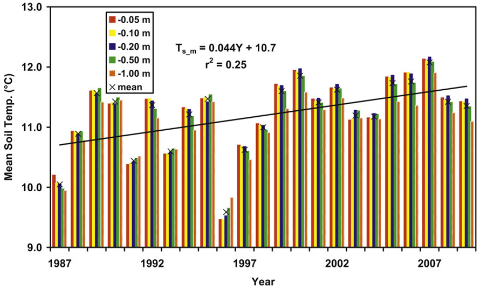
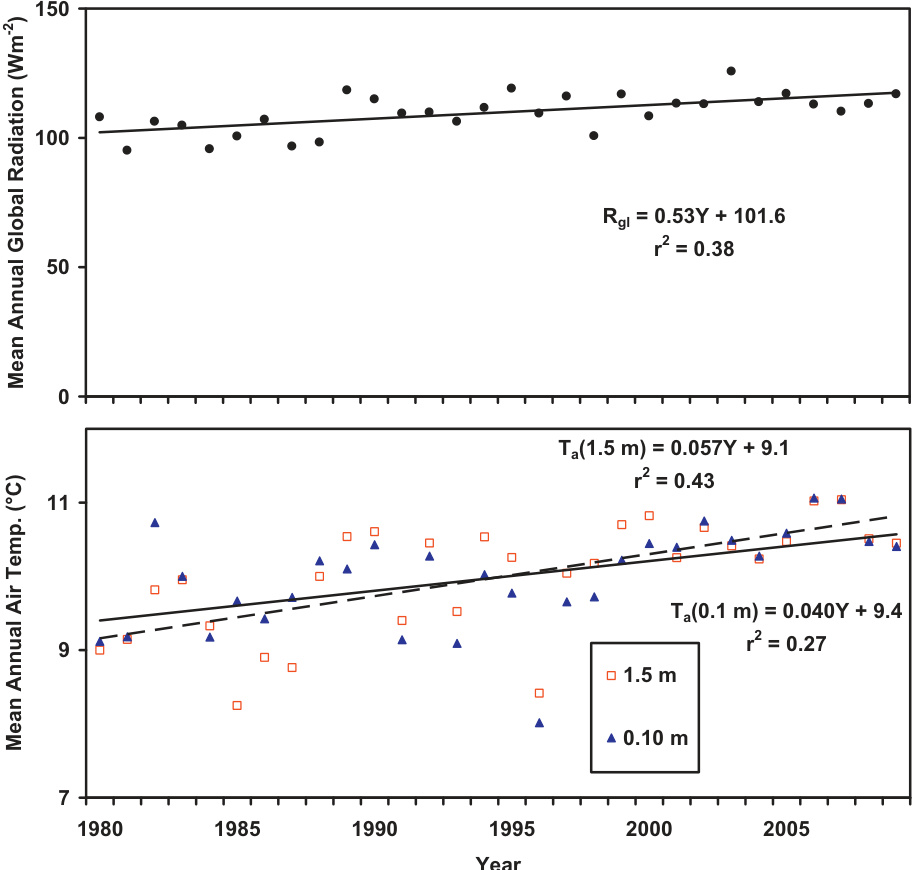
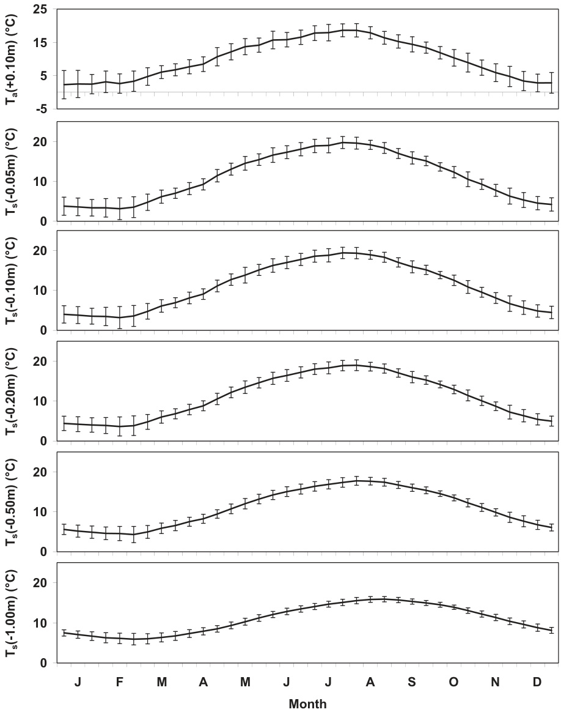
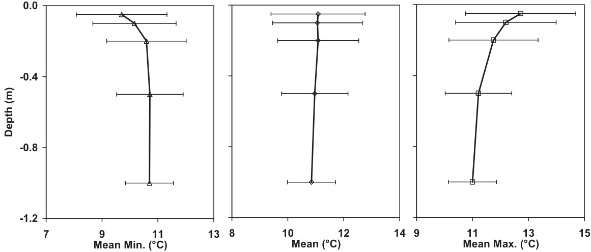
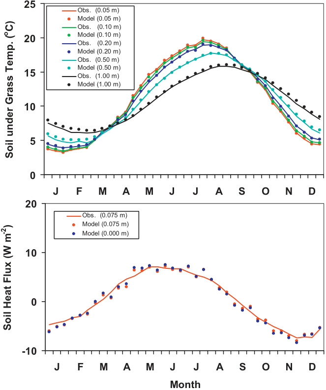
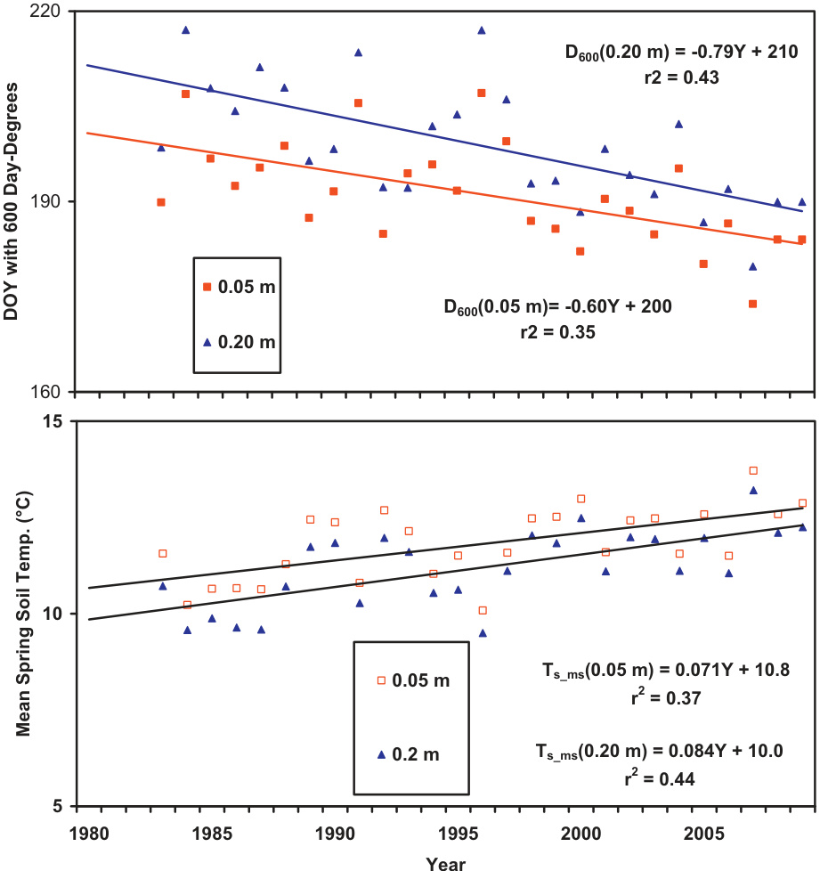

# Long-term record and analysis of soil temperatures and soil heat fluxes in a grassland area, The Netherlands

# 荷兰草地地区土壤温度和土壤热通量的长期记录与分析

Adrie F.G. Jacobs, Bert G. Heusinkveld ∗, Albert A.M. Holtslag

荷兰瓦赫宁根大学气象与空气质量研究组，邮政信箱47，6700 AA 瓦赫宁根

# 文章信息

# 摘要

文章历史：2009年12月7日收稿 2010年12月22日修订 2011年1月5日接受

关键词：土壤温度 土壤热通量 衰减深度 气温 太阳总辐射 根结线虫

本文分析了荷兰草地地区五个深度的27年土壤温度记录和一个深度的土壤热通量记录。过去23年无数据缺失的土壤测量显示，年平均土壤温度显著增加了约$1.0^{\circ}\mathsf{C}$，与同期观测到的气温增加约$1.3^{\circ}\mathsf{C}$一致。这一上升趋势与全球辐射增强（每十年$5.3\mathsf{W}\mathsf{m}^{-2}$）有良好相关性。10天平均土壤温度在一年中变化平缓，年际变率相对较小。测量深度越深，年循环越平滑，变率越小。2月和年底的变率似乎稍大。对测量数据应用快速傅里叶变换，显示年和日的衰减深度分别为$1.80\mathrm{m}$和$0.10\mathrm{m}$。本文提供了该数据在农业中的应用实例：攻击性根结线虫受到土壤平均温度升高的影响，600度日的生命周期阈值提前16天达到，可能导致农作物损害显著增加。

$\mathfrak{C}$ 2011 Elsevier B.V. 版权所有

# 1. 引言

土壤温度控制着土壤中的生物和生化过程，进而影响土壤有机质形成、肥料效率、种子萌发、植物发育、植物越冬存活以及病虫害发生(Smith等，1964)。土壤温度影响众多生态系统过程，包括土壤生物动态、植物根系生长、种子萌发、养分吸收和分解。此外，土壤温度行为在作物品种选择和农场管理实践中起着特别重要的作用(Ping，1987)。因此，深入了解土壤温度行为并将这些知识应用于土壤-植物-大气模型十分重要。

在全球变暖讨论的背景下，人们对不同生态系统的$\mathsf{CO}_{2}$收支越来越感兴趣。生态系统的$\mathsf{CO}_{2}$收支由两个主要部分组成：总初级生产或同化项(吸收项)和生态系统呼吸项(释放项)。在草地地区，释放项主要由异养微生物分解和植物根系呼吸引起(Norman等，1992)，且高度依赖土壤温度(Lloyd和Taylor，1994；Jacobs等，2007)。因此，土壤温度变化直接影响$\mathsf{CO}_{2}$释放项，最终影响$\mathsf{CO}_{2}$总收支。

在微气象学文献中，已全面讨论了土壤中热量和水传输的基本方程。相关经典教材包括Van Wijk(1963)、De Vries(1975)、Monteith和Unsworth(1990)、Campbell和Norman(1998)以及Hillel(1998)。关于热传输，已对不同土壤类型中各种深度的土壤温度日循环和土壤热通量进行了大量户外测量研究。然而，通常很少关注土壤温度和通量的年循环特征及其年际差异。这是一个严重缺陷，因为大多数生态和生物过程都受季节差异影响。此外，研究与变暖大气相关的年际差异和变化也很有意义。

文献中可用的长期土壤温度和土壤热通量测量数量有限。这些研究通常为土壤相关应用进行1-2年。例如，Wu和Nofziger(1999)研究了土壤温度对农药降解速率的影响。Changnon(1999)调查了一个非常长期的单点土壤温度记录(64年)，清楚显示了伊利诺伊州农村地区不断增强的热岛效应。Baker和Baker(2002)分析了35年土壤数据集以研究热岛效应对土壤能量收支的影响。Johnson-Maynard等(2004)在土壤发生研究中调查了不同林分下2年期间的土壤微气候。Li等(2009)研究了黄河上游地区连续两年的能量和水收支。

位于荷兰草地地区的瓦赫宁根"Haarweg"气象站点拥有27年连续记录的五个深度土壤温度和一个深度土壤热通量数据。出于生态和农业原因，分析该数据记录以发现这一特定土壤热环境的典型特征很有意义。这是本研究的主要目标。同时，检验过去几十年报告的太阳辐射"增亮效应"(Wild，2009；Jacobs等，2009)是否影响了土壤热行为也很有趣。本文还提供了该数据在农业中的应用。

# 2. 材料与方法

自1980年起，瓦赫宁根大学在荷兰中部运营Haarweg气象观测站(北纬$51^{\circ}58^{\prime}\mathsf{N}$，西经$5^{\circ}38^{\prime}\mathsf{W}$，海拔7米；www.met.wau.nl)，配备测量土壤热通量和温度的传感器。该地区为多年生草地，优势植物种类包括多年生黑麦草(Lolium perenne)和普通早熟禾(Poa trivialis)。草被每周修剪，平均高度$0.10\mathrm{m}$，平均叶面积指数(LAI)为2.9(Snel, 2004)。草被LAI使用数字植物冠层成像仪(CID Bio-Science, USA, 型号CI110, 版本1)估算。站点土壤主要为莱茵河回水沼泽形成的重盆地黏土。

Haarweg观测站是一个农业气象站，测量近地表所有能量通量分量。更多站点详情见其他文献(Jacobs等, 2008)。通风干湿表配备两个Pt-100温度传感元件，在史蒂文森箱内参考高度$z_r=1.5\mathrm{m}$处测量气温$T_a$和空气湿度$T_w$。另设有一个备用史蒂文森箱，包含类似但不通风的干湿表。在$0.10\mathrm{m}$高度，使用屏蔽式Pt-100温度计(自制)测量草温$T_a$。入射短波辐射$(R_{sh})$由通风式总辐射表(Kipp & Zonen, 型号CM11)测量。

土壤温度$T_s$使用Pt-100元件在0.05、0.10、0.20、0.50和$1.0\mathrm{m}$深度测量。温度计沿塑料板安装，板顶部与土壤表面齐平以便目视检查。土壤热通量由埋深$75\mathrm{mm}$的热板(TNO, WS 31-Cp, 精度$5\%$)测量。为确保正确安装，定期通过插入细金属杆测量深度进行检查。测量土壤热通量按Mogensen(1970)提出的仪器形状校正因子$\boldsymbol{\phi}$进行修正：

$$
\phi = \frac{1}{1-1.7tA^{-0.5}(1-\varepsilon^{-1})}
$$

其中$t$为板厚度，$A$为板面积，$\varepsilon$为板与土壤导热系数比。地表土壤热通量为深度$z_p$处测量值加上热存储项(Fritschen和Gay, 1979)：

$$
G(0) = G(z_p) - C_s \int_0^{z_p} \frac{\delta T}{\delta t} dz
$$

$C_s$为土壤体积热容。

对于均质土壤，可通过求解土壤热收支方程(Van Wijk, 1963)计算深度$z$处土壤温度的解析解：

$$
\frac{\partial T_s}{\partial t} = \kappa \frac{\partial^2 T_s}{\partial z^2}
$$

$T_s\left(^{\circ}\mathsf{C}\right)$为土壤温度，$\kappa(\mathrm{m}^2\mathrm{s}^{-1})$为土壤热扩散率。对解析解和土壤温度测量值应用快速傅里叶变换(FFT)分析。通过调整土壤热扩散率$\kappa$，可使模型与测量结果拟合。随后可计算土壤热通量$\mathsf{Q}_s(z)(\mathsf{W}\mathsf{m}^{-2})$(Van Wijk, 1963)：

$$
Q_s(z) = -\lambda \frac{\partial T_s}{\partial z}
$$

其中$\lambda(\mathsf{W}\mathsf{m}^{-1}\mathsf{K}^{-1})$为土壤导热系数。通过调整$\lambda$，可使$z=0.075\mathrm{m}$处的土壤热通量模型与测量结果拟合。此技术优势在于可估算地表热通量$(Q_s(0)=-\lambda(\partial T_s(0)/\partial z))$。该分析技术详见Heusinkveld等(2004)。

所有温度计均以NIST可溯源参考温度计(精度0.02K)校准。测量回路包含稳定参考电阻，用于独立检验数据记录质量。虽然温度传感器埋入土壤后未重新校准(以免中断测量)，但有多个理由认为传感器漂移小于0.1K。铂丝电阻温度计随时间极其稳定。已知影响铂丝电阻温度计校准的外部因素是震动，主要影响偏移量(对灵敏度影响小得多)，而温度计埋设后震动不成问题。此外，Pt100铂电阻丝比常用的Pt-1000更粗，虽降低灵敏度但提高稳定性。在精度要求${<}0.1\mathrm{K}$的低漂移测量中，灵敏度不成问题。相同温度计也用于两个干湿表，定期(约7年)重新校准，其漂移几乎不可检测$(\ll0.1\mathrm{K})$。值得注意的是，通风与非通风温度计的年平均值差异$<0.02\mathrm{K}$。

# 3. 结果与讨论

Haarweg气象站的土壤温度和热通量测量始于1980年，但前两年数据未纳入分析，因传感器需在土壤中稳定。由于1983、1984和1986年冬季温度数据存在较大缺失，年温度分析限定在1987-2009年期间。不过缺失月份不影响第4节温度总和分析，故仍包含这3年数据。总辐射测量无数据缺失，但1992年3月底气温数据有一周空缺，采用邻近气象站数据替代。为探究气候变化，我们分析了完整测量期(1987-2009)的土壤温度趋势。图1展示了五个深度的年均温及其剖面均值，线性趋势线为$T_{s.m} = 0.044Y + 10.7$(相关系数$r^2=0.25$，数据点23个)。ANOVA回归统计(趋势$0.044±0.017$，p值$=0.015$)表明该趋势显著，意味着完整测量期内地温上升$1.0^\circ\mathsf{C}$，即每十年$0.44^\circ\mathsf{C}$。Baker和Ruschy(1993)与Baker和Baker(2002)在明尼苏达东部也发现类似增温趋势。

将土壤温度每十年$0.44^\circ\mathsf{C}$的显著上升与其他变量关联分析很有意义。土壤温度通常受地表特征、湍流和辐射能量收支影响，其中太阳辐射、气温、风速等变量相关。图2展示了实验站点的总辐射和气温趋势(Jacobs等，2009)。图2上图为年均总辐射$(R_{gl.m})$及其趋势，线性拟合$R_{gl.m}=0.53Y+101.6\mathrm{W}\mathrm{m}^{-2}$($r^2=0.38$)，即每十年增加$5.3\mathsf{W}\mathsf{m}^{-2}$。ANOVA回归统计(趋势$0.53±0.27$，p值$2.6×10^{-4}$)显示趋势显著。图2下图为1.5m和0.10m高度的气温趋势，1.5m处$T_a(1.5\mathrm{m})=0.057Y+9.1^\circ\mathrm{C}$($r^2=0.43$)，0.10m处$T_a(0.10\mathrm{m})=0.040Y+9.4^\circ\mathsf{C}$($r^2=0.27$)。Wild(2009)关于全球变暗变亮对气温影响的研究也发现类似趋势。

  
图1. 五个深度的年均土壤温度及剖面均值线性趋势

图3展示了五个深度和0.10m高度气温的月均分布及标准差。值得注意的是，土壤温度测量深度越深，温度分布越平滑，这与高频谐波随深度衰减的理论一致。二月标准差显著大于一月和三月，这与荷兰二月可能出现极寒或暖冬有关，十一月/十二月也有类似现象。

  
图2. 上图：年均总辐射及其线性趋势；下图：1.5m和0.10m高度气温及其趋势

  
图3. 五个深度土壤温度和0.10m高度气温的年均分布及标准差

图4展示了年均土壤温度及其极值剖面。中部面板显示年均土壤温度剖面基本不随深度变化，但年际差异较大。最大温度剖面随深度递减，最小温度剖面随深度递增，这与土壤热特性相关。极值剖面的方差也随深度略有减小。

  
图4. 年均土壤温度及其极值剖面

对土壤热收支方程(式3)进行傅里叶分析，通过调整土壤热扩散率$\kappa$优化模型。图5上图显示优化后的土壤温度($\kappa=0.32×10^{-6}\mathrm{m}^2\mathrm{s}^{-1}$)与实测值对比。图5下图显示通过调整导热系数$\lambda$优化的土壤热通量($\lambda=1.1\mathrm{W}\mathrm{m}^{-1}\mathrm{K}^{-1}$)。模型计算显示春季地表热通量略大于0.075m深度，秋季则相反，这与土壤季节性热过程一致。

根据求得的土壤热扩散率$\kappa$，可计算年循环的年均阻尼深度$D_{y}=\sqrt{2\kappa/\omega_{y}}$，其中$\omega_{y}$为年角频率。此处计算得数值$D_{y}=1.80\mathrm{m}$，该值对于黏土具有典型性(De Vries, 1975; Monteith and Unsworth, 1990)。此外还可估算日均阻尼深度$D_{d}$，得到数值$\begin{array}{r}D_{d}=\frac{D_{y}}{\sqrt{365}}=0.10\mathrm{m}\end{array}$。

  
图5. 上图：观测与计算的土壤温度年均分布。优化计算采用土壤扩散率$\kappa=0.32×10^{-6}\mathrm{m}^{2}s^{-1}$。下图：观测与计算的土壤热通量年均分布。图中提供了地表计算热通量。优化计算采用土壤导热系数$\lambda=1.1\mathrm{W}\mathrm{m}^{-1}\mathrm{K}^{-1}$。

  
图6. 上图：两个深度(0.05和0.20m)600度日的年序日(DOY)及其线性趋势。下图：两个深度(0.05和0.20m)春季平均土壤温度。

假设土壤含水量恒定，但土壤热容和导热系数均与含水量相关。前者呈线性依赖，后者在干燥区(体积含水量0-0.2)最敏感。在半饱和至饱和区间，二者依赖关系相似，因此对热扩散率和阻尼深度计算影响有限。对导热系数及土壤热通量计算影响较大(估计20%)，但因干燥区极少出现而受限。该估计基于2005年引入的土壤含水量观测数据。采用时域反射仪(TDR)系统测量0.05、0.10、0.30和0.60m深度含水量，数据显示5cm表层土壤体积含水量极少低于0.2。

# 4. 生物学应用

评估土壤温度显著升高的生物学效应具有重要意义。土壤温度影响诸多生态过程，包括土壤生物动态、植物根系生长、种子萌发、养分吸收与分解。以下以农业为例说明。

当土壤温度超过特定阈值(基础温度)时，土壤线虫开始发育(Campbell and Norman, 1998)。对于嗜热但具侵袭性的拟禾本科根结线虫(Meloidogyne enterolobii)，其基础温度为$10^{\circ}\mathsf{C}$(Zijlstra等, 2004)。超过该温度后，线虫需累积约600度日完成生命周期(Zijlstra等, 2004)。度日总和(又称热时间)即日土壤温度超过基础温度的累计值(Monteith, 1977; Campbell and Norman, 1998)。

实验期间，绘制了两个深度(0.05和0.20m)达到600度日$(D_{600})$的年序日(图6上图)，并给出线性趋势与相关系数。0.05m深度相关式为$D_{600}=-0.60Y+1394$$\scriptstyle(r^{2}=0.35)$，0.20m深度为$D_{600}=-0.79Y+1782$$\scriptstyle(r^{2}=0.43)$。ANOVA回归统计(0.05m深度趋势$=-0.60±0.17$，$p$值$=1.2×10^{-3}$；0.20m深度$=-0.79±0.18$，$p$值$=2.0×10^{-4}$)表明趋势显著。1983-2009年间，0.05m和0.20m深度分别提前16天和21天达到600度日，意味着线虫危害可能更早更严重。

此外，生长季内线虫可完成更多生命周期，加剧农业损失。600度日累积时间缩短也意味着春季土壤温度应呈上升趋势，图6下图证实了这一点。

# 5. 结论

在Wageningen大学气象站草地连续27年观测五个深度(0.05、0.10、0.20、0.50和$1.00\mathrm{m}$)土壤温度及0.075m深度热通量，分析发现：

1. 五个深度均呈现显著趋势，年均温$T_{s.m}=0.044Y+10.7$($r^{2}=0.25$)。1987-2009年间升温约$1.0^{\circ}\mathsf{C}$，与气温上升及全球变亮($5.3\mathsf{W}\mathsf{m}^{-2}$/十年)良好相关。  
2. 土壤温度年均分布曲线平滑且方差较小，随深度增加更趋平缓。2月及11-12月方差较大，可能与极端天气有关。  
3. 年均温度剖面基本不随深度变化但年际差异大。极值温度剖面随深度分别递减/递增，方差随深度略减。  
4. FFT分析得土壤扩散率$\kappa=0.32×10^{-6}\mathrm{m}^{2}s^{-1}$和导热系数$\lambda=1.1\mathrm{W}\mathrm{m}^{-1}\mathrm{K}^{-1}$，对应年/日均阻尼深度$D_{y}=1.80\mathrm{m}$/$D_{d}=0.10\mathrm{m}$，符合黏土特征。  
5. 应用至拟禾本科根结线虫(基础温度$10^{\circ}\mathsf{C}$，生命周期600度日)分析显示，27年间0.05m和0.20m深度分别提前16天和21天达到阈值。

# 致谢

感谢团队所有现场观测人员：Jo van der Brink, Paul van Espelo, Dick Welgraven, Wim Vaags, Bart Verhaaf, Peter Jansen, Teun Jansen, Frits Antonysen和Willy Hillen。本研究部分受荷兰国家研究计划"气候变化与空间规划"(www.klimaatvooruimte.nl)支持，并获荷兰农业部共同资助。

# 参考文献

Baker, D.G., Ruschy, D.L., 1993. 明尼苏达州东部近期地温显示的变暖现象. Geophys. Res. Lett. 20, 371–374.   
Baker, J.M., Baker, D.G., 2002. 中纬度地区长期地热通量与热储存研究. Climatic Change 54, 295–303.   
Campbell, G.S., Norman, J.M., 1998. 环境生物物理学导论. Springer, New York, p. 286.   
Changnon, S.A., 1999. 深层土壤温度长期记录揭示的时间变化与城市热岛效应. Climatic Change 42, 531–538.   
De Vries, D.A., 1975. 土壤中的热传递. In: de Vries, D.A., Afgan (Eds.), 生物圈中的热质传递. Scripta Book Co., Washington, DC, pp. 5–28.   
Fritschen, L.J., Gay, L.W., 1979. 环境仪器测量. Springer Verlag, New York, p. 216.   
Heusinkveld, B.G., Jacobs, A.F.G., Holtslag, A.A.M., Berkowicz, S.M., 2004. 干旱地区地表能量平衡闭合：土壤与热通量的作用. Agric. Forest Meteorol. 122, 21–37.   
Hillel, D., 1998. 环境土壤物理学导论. Acad. Press, San Diego, p. 757.   
Jacobs, C.M.J., Jacobs, A.F.G., Bosveld, F.C., Hendriks, D.M.D., Hensen, A., Kroon, P., Moors, E.J., Nol, L., Schrier-Uijl, A., Veenendaal, E.M., 2007. 荷兰草地年际$\mathsf{CO}_2$交换的变异性. Biogeosciences 4, 803–816.   
Jacobs, A.F.G., Heusinkveld, B.G., Holtslag A.A.M., 2008. 中纬度草地地表能量收支闭合研究. Bound.-Layer Meteorol. 126, 125–136. doi:10 1007/s10546-007r-r9209-2.   
Jacobs, A.F.G., Heusinkveld, B.G., Holtslag, A.A.M., 2009. 荷兰瓦赫宁根80年气象观测：降水与蒸发. Int. J. Climatol. doi:10.1002/joc.1957.   
Johnson-Maynard, J.L., Shouse, P.J., Graham, R.C., Castiglione, P., Quideay, S.A., 2004. 50年灌丛-松树生物序列中的微气候与成土作用. Soil Sci. Soc. Am. J. 68, 876–884.   
Li, S., Lü, S., Ao, Y., Shang, L., 2009. 黄河上游地区地表辐射收支与土壤水热含量的年变化.   
Lloyd, J., Taylor, J.A., 1994. 土壤呼吸作用的温度依赖性. Funct. Ecol. 8, 315–323.   
Mogensen, V.O., 1970. 热通量计校准因子与周围介质导热系数的关系. Agric. Forest Meteorol. 7, 401–410.   
Monteith, J.L., 1977. 英国气候与作物生产效率. Phil. Trans. R. Soc. Lond. B281, 277–294.   
Monteith, J.L., Unsworth, M.H., 1990. 环境物理学原理. Edward Arnold, London, p. 291.   
Norman, J.M., Garcia, R., Verma, S.B., 1992. 草地土壤表面CO2通量与碳收支. J. Geophys. Res. 92, 18845–18853.   
Ohmura, A., 2006. 地球表面太阳辐照度的长期观测变化. Space Sci. Rev. 125, 111–128. doi:10.1007/s11214-006r-r9050-9.   
Ping, C.L., 1987. 阿拉斯加两种土壤的温度剖面. Soil Sci. Soc. Am. J. 51, 1010–1018.   
Smith, G.D., Newhall, F., Robinson, L.H., Swanson, D., 1964. 土壤温度状况：特征与可预测性. USDA-SCS-TP-144. U.S. Government Printing Office, Washinton, DC.   
Snel, S., 2004. 土壤-大气${ \mathsf{CO}_2 }$交换. M.Sc. Thesis, Wageningen University, Dept. Meteorology and Air Quality, p. 67.   
Van Wijk, W.R., 1963. 植物环境物理学. North-Holland Publishing Co., Amsterdam, p. 382.   
Wild, M., 2009. 全球变暗与变亮研究综述. J. Geophys. Res. 114. doi 10.1029/2008JD011470.   
Wu, J., Nofziger, D.L., 1999. 农药降解温度效应在管理模型中的整合. J. Environ. Qual. 28, 92–100.   
Zijlstra, C., Van Hoof, R., Donkers-Venne, D., 2004. 检测禾本科根结线虫Meloidogyne naasi的PCR方法. Eur. J. Plant Pathol. 110, 855–860.

# References

Baker, D.G., Ruschy, D.L., 1993. The recent warming in eastern Minnesota shown by ground temperatures. Geophys. Res. Lett. 20, 371–374.   
Baker, J.M., Baker, D.G., 2002. Long-term ground heat flux and heat storage at a mid-latitude site. Climatic Change 54, 295–303.   
Campbell, G.S., Norman, J.M., 1998. An Introduction to Environmental Biophysics. Springer, New York, p. 286.   
Changnon, S.A., 1999. A rare long record of deep soil temperatures defines temporal changes and an urban heat island. Climatic Change 42, 531–538.   
De Vries, D.A., 1975. Heat transfer in soils. In: de Vries, D.A., Afgan (Eds.), Heat and Mass Transfer in the Biosphere. Scripta Book Co., Washington, DC, pp. 5–28.   
Fritschen, L.J., Gay, L.W., 1979. Environmental Instrumentation. Springer Verlag, New York, p. 216.   
Heusinkveld, B.G., Jacobs, A.F.G., Holtslag, A.A.M., Berkowicz, S.M., 2004. Surface energy balance closure in an arid region: role of soil and heat flux. Agric. Forest Meteorol. 122, 21–37.   
Hillel, D., 1998. Introduction to Environmental Soil Physics. Acad. Press, San Diego, p. 757.   
Jacobs, C.M.J., Jacobs, A.F.G., Bosveld, F.C., Hendriks, D.M.D., Hensen, A., Kroon, P., Moors, E.J., Nol, L., Schrier-Uijl, A., Veenendaal, E.M., 2007. Variability of annual $\mathsf { C O } _ { 2 }$ exchange from Dutch grasslands. Biogeosciences 4, 803–816.   
Jacobs, A.F.G., Heusinkveld, B.G., Holtslag A.A.M., 2008. Towards closing the surface energy budget of a mid-latitude grassland. Bound.-Layer Meteorol. 126, 125–136. doi:10 1007/s10546-007r-r9209-2.   
Jacobs, A.F.G., Heusinkveld, B.G., Holtslag, A.A.M., 2009. Eighty years of meteorological observations at Wageningen, the Netherlands: precipitation and evaporation. Int. J. Climatol. doi:10.1002/joc.1957.   
Johnson-Maynard, J.L., Shouse, P.J., Graham, R.C., Castiglione, P., Quideay, S.A., 2004. Microclimate and pedogenic inplications in a 50-year-old chaparral and pine biosequence. Soil Sci. Soc. Am. J. 68, 876–884.   
Li, S., Lü, S., Ao, Y., Shang, L., 2009. Annual variations in the surface radiation budget and soil water and heat content in the upper yellow river area.   
Lloyd, J., Taylor, J.A., 1994. On the temperature dependence of soil respiration. Funct. Ecol. 8, 315–323.   
Mogensen, V.O., 1970. The calibration factor of heat flux meters in relation to the thermal conductivity of the surrounding medium. Agric. Forest Meteorol. 7, 401–410.   
Monteith, J.L., 1977. Climate and the efficiency of crop production in Britain. Phil. Trans. R. Soc. Lond. B281, 277–294.   
Monteith, J.L., Unsworth, M.H., 1990. Principles of Environmental Physics. Edward Arnold, London, p. 291.   
Norman, J.M., Garcia, R., Verma, S.B., 1992. Soil surface CO2 fluxes and carbon budget of a grassland. J. Geophys. Res. 92, 18845–18853.   
Ohmura, A., 2006. Observed long-term variations of solar irradiance at the earth’s surface. Space Sci. Rev. 125, 111–128. doi:10.1007/s11214-006r-r9050-9.   
Ping, C.L., 1987. Soil temperature profiles in two Alaskan soils. Soil Sci. Soc. Am. J. 51, 1010–1018.   
Smith, G.D., Newhall, F., Robinson, L.H., Swanson, D., 1964. Soil-temperature regimes – their characteristics and predictability. USDA-SCS-TP-144. U.S. Government Printing Office, Washinton, DC.   
Snel, S., 2004. Soil-Atmosphere exchange of ${ \mathsf { C O } } _ { 2 }$ . M.Sc. Thesis, Wageningen University, Dept. Meteorology and Air Quality, p. 67.   
Van Wijk, W.R., 1963. Physics of Plant Environment. North-Holland Publishing Co., Amsterdam, p. 382.   
Wild, M., 2009. Global dimming and brightening: a review. J. Geophys. Res. 114. doi 10.1029/2008JD011470.   
Wu, J., Nofziger, D.L., 1999. Incorporating temperature effects on pesticide degradation into a management model. J. Environ. Qual. 28, 92–100.   
Zijlstra, C., Van Hoof, R., Donkers-Venne, D., 2004. A PCR test to detect the cereal root-knot nematode Meloidogyne naasi. Eur. J. Plant Pathol. 110, 855–860.