Research Paper  

# 3D plant segmentation: Comparing a 2D-to-3D segmentation method with state-of-the-art 3D segmentation algorithms  

Bart M. van Marrewijk ${ \mathfrak { a } } , { \mathfrak { s } } _ { \oplus }$ , Tim van Daalen $a _ { \textcircled { \left( p \right) } }$ , Bolai Xin b, Eldert J. van Henten ${ \mathfrak { a } } _ { \oplus }$ Gerrit Polder ${ \mathbf b } _ { \oplus }$ , Gert Kootstra a  

a Wageningen University and Research, Wageningen, the Netherlands b College of Engineering, South China Agricultural University, Guangzhou, China  

# A R T I C L E  I N F O  

# A B S T R A C T  

Keywords:   
Segmentation   
Digital plant phenotyping   
3D point cloud   
Deep learning   
Horticulture   
Tomato plants  

Plant measurements are crucial to determine which plants grow optimal under certain conditions. These mea­ surements can be done by hand, or automated using cameras, also known as image-based plant phenotyping. These images can be used to create point clouds to measure plant traits in 3D. To extract plant traits, accurate segmentation is crucial. Most point cloud segmentation methods rely on 3D segmentation algorithms. These algorithms are not as advanced and developed as 2D algorithms. In addition, 2D neural networks are pre-trained on large diverse datasets. In our work, it was therefore hypothesised that segmentation of point clouds using projection-based methods can obtain a higher accuracy than voxel or point-based algorithms. To test this hy­ pothesis, a 2D-to-3D reprojection method was developed and compared with three state-of-the-art 3D segmen­ tation algorithms; Swin3D-s, Point Transformer v3 and MinkUNet34C. The 2D-to-3D method segmented images using Mask2Former, reprojected the predictions to the point cloud, and used a majority vote algorithm to merge multiple predictions. All algorithms were trained and tested to segment 3D point clouds into leaves, main stem, side stem, and pole. There was no significant difference between the 2D-to-3D, Swin3D-s and Point Transformer v3 algorithm, indicating that state-of-the-art voxel or point-based methods perform similar than our projectionbased method. However, the 2D-to-3D method had a higher performance by including virtual cameras and it had a higher training efficiency. With only five annotated plants, a similar performance was obtained than training Swin3D-s on 25 plants indicating the added value of the developed pipeline.  

# Nomenclature  

<html><body><table><tr><td colspan="2">Symbols</td></tr><tr><td>Cc</td><td>Camera position of camera c</td></tr><tr><td>Pi</td><td>Set of pixels qc.j that contain information about 3D point i</td></tr><tr><td>pi</td><td>3D point i in point cloud</td></tr><tr><td>predi</td><td>Class prediction for 3D point i</td></tr><tr><td>Qc</td><td>Set of 3D points pi project on pixel qcj</td></tr><tr><td>Qc.j'</td><td>Pixel qc.j with closest point to the camera</td></tr><tr><td>qc.j</td><td>Pixel j in camera c</td></tr><tr><td>Vi</td><td>List of class votes for 3D point i</td></tr><tr><td>Abbreviations</td><td></td></tr><tr><td>2D/3D</td><td>2/3-Dimensional</td></tr><tr><td>2D-to-3D</td><td>2D segmentation to 3D points</td></tr><tr><td>IoU</td><td>Intersection over union</td></tr><tr><td>Mask2Former</td><td>Masked-attention mask Former</td></tr><tr><td>MinkUNet34C</td><td>3Dalgorithm relying on Minkowski network and U-net architecture</td></tr><tr><td></td><td>(continued on next column)</td></tr></table></body></html>  

(continued )   

<html><body><table><tr><td>NPEC</td><td>Netherlands plant Eco-phenotyping centre</td></tr><tr><td>PTv3</td><td>Point transformer V3</td></tr><tr><td>Swin3D-s</td><td>3DSwin transformer algorithm with small backbone</td></tr><tr><td>TP,FP,TN</td><td>True positive, false positive, true negative</td></tr></table></body></html>  

# 1. Introduction  

Since the beginning of agriculture, improving crop yield has been at the core of human activities. By optimising irrigation, crop rotation, fertilisers, plant breeding, crop selection, and superior hybrids, pro­ duction has increased tremendously. This improvement in food avail­ ability has led to a significant rise in the global population (Erisman et al., 2008), thereby increasing food demand even further. To feed this growing population an increase in production is necessary. While one approach is to use more land and increase the use of resources, ongoing climate change and decreasing availability of land make it increasingly important to produce more with fewer resources. Breeders are conse­ quently focusing on the development of crops with a higher efficiency; reducing the amount of fertilisers, pesticides, and water, without a loss in production (Hawkesford & Riche, 2020; Ríos, 2015). To improve crop yield and efficiency, it is essential for breeders to understand the influ­ ence of genetics (G), environment (E), and management (M), as well as their interactions (Hawkesford & Riche, 2020). These interactions result in traits known as the phenotype $( \mathbf { P } \ = \textbf { G x E x M } )$ . Studying this expression requires measuring the phenotype (P), which remains a challenge in the breeding industry (Araus & Cairns, 2014; Araus et al., 2018), mostly, because it is currently mainly done by hand and thus costly, time-consuming (Akhtar et al., 2024; Li et al., 2014; Panguluri & Kumar, 2016) and potentially inconsistent and inaccurate. Image-based plant phenotyping can potentially replace multiple manual measure­ ments without physical interference with the plant and is therefore considered as a solution to bridge the increasing genotype-phenotype gap (Pound et al., 2017).  

Image-based plant phenotyping relies on extracting information from digital images. In the past, image-based plant phenotyping relied on hand-crafted features combined with traditional machine learning algorithms. These methods obtained a high success rate, however, in practical applications, these algorithms did not provide the desired ac­ curacy (Pound et al., 2017). Nowadays digital phenotyping heavily re­ lies on deep neural networks. These networks can learn complex features to recognise plant organs while dealing with all variations present in the agricultural environment (Harandi et al., 2023; Kamilaris & Pre­ nafeta-Boldú, 2018).  

Amongst others, a popular task in image-based phenotyping is the detection of fruits, such as tomatoes (Cardellicchio et al., 2023; Lawal, 2021), citrus (Apolo-Apolo et al., 2020), oranges (Liu et al., 2018) and avocado (Vasconez et al., 2020). Other image-based traits include esti­ mating internode length through cucumber node detection (Boogaard et al., 2020), or counting the number of leaves in Arabidopsis (Ubbens et al., 2018). These examples demonstrate the frequent use of automated image-based phenotyping for plant measurements.  

This automation has led to improvements in both consistency and accuracy. The study of Apolo-Apolo et al. (2020) demonstrated that yield prediction based on images achieved a higher accuracy compared to visual estimations performed by crop experts, emphasising the added value of image-based phenotyping. Further, image-based phenotyping improves consistency by removing bias and differences between ob­ servers (Pound et al., 2017).  

To date, image-based plant phenotyping is mostly done in 2D, i.e. feature detection/extraction is limited to a plane (Schunck et al., 2021). As a consequence, measurements focusing on the geometry of a plant rely on the assumption that the observable trait is flat in one direction, which is incorrect as plants are 3-dimensional entities that also grow and develop in three dimensions (3D)(Akhtar et al., 2024). In the paper of Boogaard et al. (2023), a comparison was made between 2D vs 3D phenotyping by estimating the internode length both in 2D images as well as in 3D point clouds. The 3D method showed a significant improvement, indicating the added value of phenotyping in 3D (Akhtar et al., 2024; Boogaard et al., 2023; Harandi et al., 2023).  

For 3D phenotyping accurate reconstruction of the plant is essential. For 3D object reconstruction using 2D cameras, a range of algorithms are available, including multi-view stereo (MVS) (Hartley & Zisserman, 2003), voxel-carving (Kutulakos & Seitz, 2000), Neural Radiance Fields (NeRF) (Mildenhall et al., 2021) and Gaussian Splatting (Kerbl et al., 2023). Non-image-based methods rely on LiDAR or Time of Flight (ToF) sensors that create a point cloud by measuring the distance between the sensor and object. By repeated measurements from various poses, indi­ vidual point clouds from a LiDAR can be merged to create an accurate complete reconstruction of the object. For 3D phenotyping, both image and non-image-based reconstruction methods can be used to produce high-quality point clouds.  

Once a 3D reconstruction of the plant is available, the next step is to get accurate segmentations in 3D to extract plant organs to assess their location, size, shape, and other properties for phenotyping purposes (Boogaard et al., 2023; Turgut, Dutagaci, Galopin, & Rousseau, 2022; Xin et al., 2024). Accurate segmentation is therefore crucial for precise plant measurements (Harandi et al., 2023). Algorithms to perform seg­ mentation directly on the point clouds in 3D do exist, like PointNet $^ { + + }$ (Qi et al., 2017), PVCNN (Liu et al., 2019), MinkoswkiNet (Choy et al., 2019) and more recent Swin3D (Yang et al., 2025) and Point Trans­ former v3 (PTv3) (Wu et al., 2024). Saeed et al. (2023) used PVCNN to segment 3D cotton plants. From the segmented point clouds, plant traits such as internode length, branching angle and stem diameter were estimated. Another frequently used algorithm by the plant phenotyping community is PointNet $^ { + + }$ . PointNet $^ { + + }$ has been used to segment cu­ cumber plants (Boogaard et al., 2023), rose bushes (Turgut, Dutagaci, & Rousseau, 2022) and tomato plants (Xin et al., 2024). Xin et al. (2024), used the segmented tomato point clouds to extract internode length, branching and phyllotactic angle by fitting cylinders through stem part of the plant. Boogaard et al. (2023) segmented cucumber point clouds to calculate the internode length. However, if any node was not segmented the internode length could not be estimated accurately. According to Boogaard et al. (2023) segmentation accuracy need to be improved to get a better estimation of the plant traits. While Swin3D and PTv3 do outperform PointNet $^ { + + }$ on the ScanNet dataset (Dai et al., 2017), they have not yet been applied in plant phenotyping. It is therefore inter­ esting to gain insight in the performance of state-of-the-art algorithms by evaluating them in the plant domain.  

Segmentation in 3D still proves to be challenging for three reasons: 1) Limited progress in the development of 3D segmentation algorithms compared to 2D methods. Progress has been made, however, 3D algo­ rithms like MinkoswkiNet (Choy et al., 2019), are designed to recognise 3D patterns and thus work well for distinctive shapes like chairs and tables, but might not work for the distinction between a wall and painting for example (Kundu et al., 2020). The distinction between the side and main stem in plant phenotyping is a similar challenging task since both are green, circular, and therefore difficult to distinguish. 2) Limited availability of pre-trained networks due to the limited avail­ ability of 3D training datasets (Akhtar et al., 2024; Harandi et al., 2023; Kundu et al., 2020). For 2D images, many large diverse datasets exist with more than a 14 million images like ImageNet (Deng et al., 2009) or Common Objects in Context (COCO) dataset (Lin et al., 2014). Whereas for 3D algorithms, one of the largest datasets is ScanNet (Dai et al., 2017) consisting of solely 1513 scenes. In addition, the dataset is limited to indoor scenes, while ImageNet has more than 22,000 categories. Consequently, a 3D segmentation network pre-trained with ScanNet might not result in significant performance improvement for agricultural-related tasks like plant organ segmentation. 3) Related to the 3D training dataset is the time and effort required to acquire and annotate data in 3D. Annotating in 3D is highly time-consuming, resulting in relatively small datasets, which limits the performance of 3D segmentation algorithms.  

This research aims to contribute to advancements in 3D segmenta­ tion by building on the efforts and progress made in 2D segmentation and segmenting images in 2D. Point clouds made with MVS, voxelcarving, NeRF or Gaussian splatting all rely on the use of many 2D im­ ages. Instead of applying deep learning on those point clouds with the described disadvantages, question arises whether it is possible to segment images in 2D and overlay the predicted classes onto the point cloud by projecting the 2D segmented pixels to 3D points (2D-to-3D). This reprojection method was inspired by the work of Boulch et al. (2018), Shi et al. (2019), and Kundu et al. (2020). A reprojection-based method has three major advantages. 1) Errors in 2D are not persistent for different viewpoints. Any error in the 2D segmentation can be partly compensated by a voting mechanism in 3D (Shi et al., 2019). 2) Advanced developed 2D architectures can be utilised, which are pre-trained on diverse datasets like COCO. 3) A reprojection-based method could reduce annotation time. In the work of Kundu et al. (2020), the training dataset was increased by rendering images from a point cloud. This could save annotation time since many images can be rendered. In addition, it might be possible to segment point clouds with rendered images only. This is especially interesting for non-image-based point cloud datasets in which real images are missing.  

In this paper, it was hypothesised that a higher segmentation accu­ racy can be obtained if a point cloud is segmented using 2D reprojection, rather than by direct 3D segmentation using the state-of-the-art algo­ rithms. The novel contributions of our work are: 1) a comparison be­ tween state-of-the-art 3D segmentation algorithms including a novel developed 2D-to-3D reprojection algorithm to segment tomato plants in 3D. 2) A comparison of segmentation performance of the 2D-to-3D reprojection algorithm with real and rendered images in order to use the developed method for non-image based reconstruction methods. 3) Evaluating the training efficiency by comparing a state-of-the-art 3D segmentation and the 2D-to-3D reprojection algorithm as a function of the number of plants used to train the model. 4) Improving the seg­ mentation performance of the 2D-to-3D reprojection algorithm by rendering additional images for 3D segmentation. The dataset has been made publicly available to facilitate further research and development in 3D plant phenotyping (Marrewijk et al., 2025). The associated code can be accessed via our GIT: https://github.com/WUR-ABE/2D-to-3D _segmentation.  

# 2. Material and methods  

In this section, the materials and methods are presented, starting with a description of the point cloud segmentation algorithms in section 2.1. The dataset is described in section 2.2. The evaluation of the seg­ mentation algorithm is explained in section 2.3. Lastly, in section 2.4, the four experiments are described in more detail.  

# 2.1. Point cloud segmentation  

In this research, a comparison is made between a 2D-to-3D repro­ jection and three state-of-the-art 3D segmentation method. Both the 2Dto-3D and 3D segmentation algorithms are schematic visualised in Fig. 1. The input is a point cloud, and the output of both methods is a segmented point cloud with every point belonging to a class. The 2D-to3D reprojection method is a project-based method. As visualised in Fig. 1, points of a 2D segmentation algorithm are projected to the point cloud. This method is explained in section 2.1.1. The state-of-the-art algorithms are subdivided into voxel and point-based algorithms. These algorithms either pre-process the point cloud into voxels or pro­ cess the point cloud directly, more details can be found in section 2.1.2.  

# 2.1.1. 2D-to-3D reprojection  

The 2D-to-3D reprojection algorithm segments the 3D point cloud using a 2D segmentation algorithm on a set of related 2D camera views, which results are back projected to the 3D point cloud. The methodology consists of four major steps schematically visualised in Fig. 1a and  

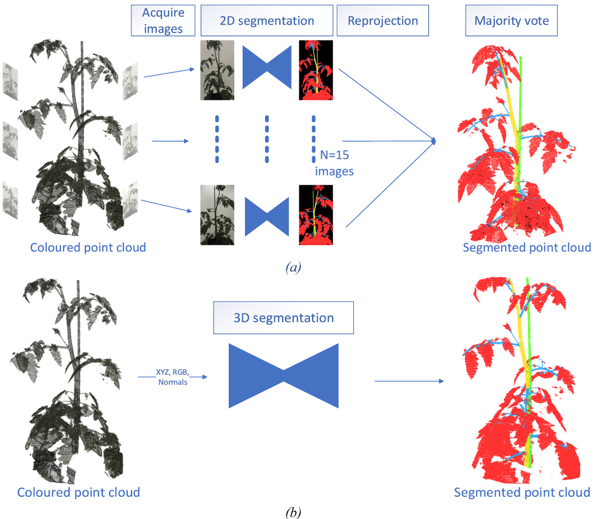  
Fig. 1. Schematic visualisation to segment plants in 3D using 2D-to-3D reprojection (a) or a 3D segmentation algorithm (b), input is a coloured point cloud and output is a segmented point cloud. The blue triangles represent a deep neural network. (For interpretation of the references to colour in this figure legend, the reader is referred to the Web version of this article.)  

explained in detail below.  

1. Acquiring camera images   
2. Segmenting images using a 2D segmentation algorithm   
3. Reproject 2D segmentations to point cloud   
4. Apply majority vote on reprojected points  

2.1.1.1. Acquiring camera images. There are two methods to acquire camera images. In the first method, images are captured directly using a camera. The second method involves rendering images from a point cloud, which is particularly interesting when corresponding camera images are unavailable, such as when data is collected using a Lidar scanner. To render images, the point cloud is converted to a mesh using the ball pivoting algorithm in MeshLab using the default settings (Cignoni et al., 2008). The images are subsequently rendered using known camera intrinsics and poses. In this study, these newly generated images are referred to as “rendered images”.  

2.1.1.2. Segmenting images using 2D segmentation. In this step, the 2D images are segmented into 5 classes: $0 =$ background (black), $1 =$ leaves (red), $2 =$ main stem (yellow), $3 =$ pole (green), and $4 =$ side stem (blue). The Mask2Former (Cheng et al., 2022) algorithm is used to segment the images. The algorithm consists of three parts, a backbone to extract features from an image, a pixel decoder to generate high-resolution embeddings, and a transformer decoder to process queries from the pixel decoder. More details can be found in the paper of Cheng et al. (2022).  

In this research, Mask2Former was trained with a Swin-tiny back­ bone (Liu et al., 2021), since a pilot-study showed an improved per­ formance with respect to a ResNet50 backbone (He et al., 2016). The Swin-tiny backbone has the advantage that training could be done on the native resolution of $1 0 8 0 \mathbf { x } 1 9 2 0$ (width x height). This is crucial for the segmentation of the side stems, which are small and tend to disap­ pear when reducing the resolution of the image. Training and hyper­ parameters details are described in the experiment section 2.4.1.  

2.1.1.3. Reproject predictions to point cloud. The objective of this step is to relate the points in the 3D point cloud to the pixels in all 2D camera images taking into account occlusions. For every 3D point in the point cloud, $p _ { i }$ , a set of all the corresponding pixels in the camera images is determined, $P _ { i }$ . The developed algorithm contains three substeps and is visualised in Fig. 2:  

- In the first substep, the camera intrinsics and extrinsics are used to project every 3D point to all camera planes. Per pixel, $q _ { c , j } .$ in camera c, this results in a set of 3D point indices that project on that pixel, $Q _ { c , j } = \{ p _ { i _ { 1 } } , . . . , p _ { i _ { n } } \}$ . Note that $Q _ { c , j }$ can be an empty set, in which case no part of the plant projects onto pixel $j$ in camera c. Substep 1, however, does not take into account occlusions.  

- The second substep deals with this problem: When $Q _ { c , j }$ is a set with more than one member $( n > 1 )$ , it means that multiple 3D points project to the same pixel. In that case, there are multiple objects on the same projection line. This is the case, for instance, when a leaf is in front of a stem and two points project to the same pixel, one from the leaf, one from the stem, see Fig. 2. If this is such cases, only the 3D point closest to the position of the camera, $c _ { c }$ , is kept in the set, mathematically defined as:  

$$
\begin{array} { r } { Q _ { c , j } ^ { ' } = \biggl \{ p _ { i } \biggl | p _ { i } = \underset { p _ { k } \in Q _ { c , j } } { \operatorname { a r g m i n } } \bigl | \bigl | p _ { k } - c _ { c } \bigr | \bigr | \biggr \} } \end{array}
$$  

A pilot study showed that this method works best if the camera im­ ages are lowered in resolution by a factor four. With a too high resolu­ tion, occlusions are not always correctly detected, because the projection of a point can “slip through” (see Fig. 3).  

- Finally, in the last substep, the results from substep 2 are used to create a set  

$P _ { i } = \left\{ q _ { c _ { 1 } , j _ { 1 } } , . . . , q _ { c _ { m } , j _ { m } } \right\}$ for every 3D point $p _ { i }$ listing all the pixels in the camera images that contain information about the 3D point. Note that it can happen that $P _ { i } = \emptyset$ , in which case no corresponding pixel was found.  

2.1.1.4. Majority vote on reprojected points. Using the 3D-2D corre­ spondences and the 2D segmentation, the list of corresponding pixels per 3D point, $P _ { i . }$ , can be changed to a list of class votes per 3D point, $V _ { i }$ . Majority vote is then applied to obtain a single class prediction for every point $p _ { i }$ using Eq (2):  

$$
p r e d _ { i } = \underset { 0 \leq k \leq C } { \operatorname { a r g m a x } } ( \operatorname { c o u n t } ( k , V _ { i } ) )
$$  

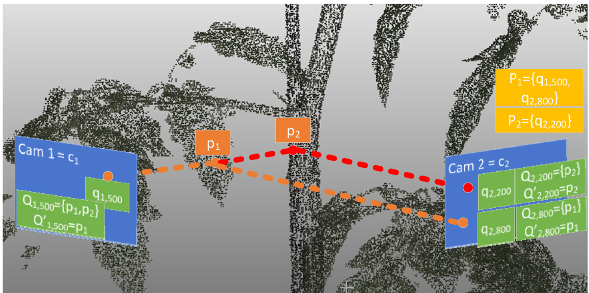  
Fig. 2. Visualisation of 2D-to-3D reprojection method. In blue cameras $( c _ { c } )$ , in green pixels $( q _ { c , j } )$ and corresponding list of projections $( Q _ { c , j } )$ . In orange points in 3D $( p _ { i } )$ and in yellow list of points with projected pixel coordinates $( P _ { i } )$ . (For interpretation of the refere to colour in this figure legend, the reader is referred to the Web version of this article.)  

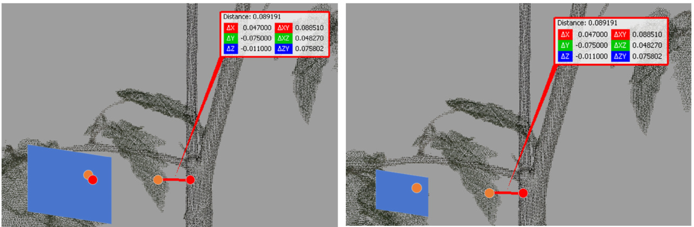  
Fig. 3. (a) Reprojection of foreground pixel (orange) and background pixel (red) on schematic image plane (blue). Both points are projected on a different pixel. By reducing the resolution of the image (b), both points are projected on the same pixel and by filtering on distance only the orange pixel remains. (For interpretation of the references to colour in this figure legend, the reader is referred to the Web version of this article.)  

If two or more classes have the same number of occurrences, then the lowest class index is selected, following the hierarchy: $0 =$ background, $1 =$ leaves, $2 =$ main stem, $3 = { \mathrm { p o l e } }$ , and $4 =$ side stem. It is possible that a number of points in the point cloud is not assigned to a class since not all points are matched with an image. If $P _ { i } = \emptyset$ , no class can be assigned to point $p _ { i }$ . To prevent any information loss, the point cloud is restored to its original density using an octree. The octree was initialised with a max depth of 7, subdividing the 3D space into smaller nodes, depending on the point cloud this resulted in approximate node size $\pm 5 . 2 \ \mathrm { m m }$ . For each node, all associated points in this node without a class were attributed to the majority class of the respective node. If the node did not have any predictions, then all those points were removed.  

# 2.1.2. 3D segmentation  

The second set of methods for segmenting plant organs involved the use of 3D deep learning-based segmentation algorithms. These end-toend neural networks require an input point cloud XYZ, and optional RGB and normal values to segment the plant as accurately as possible. Three types of 3D segmentation algorithms exist: projection-based, voxel-based, and point-based. The projection-based method is explained in the previous section and will be compared with a voxel and point-based method.  

Voxel-based algorithms convert point clouds into voxels to facilitate the use of 3D convolutions (Maturana & Scherer, 2015; Wu et al., 2024). In this research, two voxel-based algorithms will be tested; MinkU­ Net34C (Choy et al., 2019) and Swin3D-s (Yang et al., 2025). MinkU­ Net34C is a relative older algorithm relying on sparse convolutions and used as a reference algorithm to indicate the performance improvement of the latest state-of-the art 3D segmentation algorithms. The second voxel-based method is Swin3D-s. At the time of writing, it is a relatively new transformer-based algorithm and ranked fourth on the ScanNet segmentation challenge (Meta AI Research, 2024).  

As last, a point-based method is examined. Point-based algorithms directly process 3D coordinates without the need for voxelization. A frequent used point-based architecture in the plant phenotyping com­ munity is PointNet $^ { + + }$ (Qi et al., 2017). In this research, Point trans­ former V3 (PTv3) (Wu et al., 2024) is included in the comparison with the 2D-to-3D method. It is a transformer-based algorithm and currently the state-of-the-art algorithm with the highest mIoU on the ScanNet dataset (Meta AI Research, 2024). PTv3 is a combination of a point and serialisation-based network. As described by Wu et al. (2024), it struc­ tures the point cloud by using space-filing curves. These curves are paths that pass through every point in a higher-dimensional space. This paradigm makes the network efficient, enabling to focus on scale and create a network with a large receptive field resulting in a state-of-the-art performance on ScanNet. More details can be found in the paper of Wu et al. (2024). The training and hyperparameter settings of the described models are explained in experiment section 2.4.1.  

# 2.2. Dataset  

# 2.2.1. Point cloud dataset  

In this research, a dataset of 44 3D point clouds of tomato (Solanum lycopersicum L.) plants has been used (Marrewijk et al., 2025) (Fig. 4c). The point clouds were generated using the MaxiMarvin system at the Netherlands Plant Eco-phenotyping Centre (NPEC). This system creates a point cloud using a shape-from-silhouette methodology (Golbach et al., 2016). The methodology is faster than multi-view stereo and can reconstruct tiny branches, which is frequently a bottleneck in multi-view approaches. The voxel space was set to $4 0 0 { \bf x } 4 0 0 \times 7 0 0 \mathrm { m m }$ , with a voxel size of $1 \mathrm { m m } ^ { 3 }$ . RGB images were captured by fifteen cameras (Basler ace Classic, acA1920-25gc) placed around the plants at three height levels, with five cameras per level placed approximately $\pm 1 2 0 0 ~ \mathrm { { m m } }$ from the plant centre. Each camera had a resolution of $1 0 8 0 \mathbf { x } 1 9 2 0$ pixels (width $\mathbf { x }$ height). The lens had focal length of $8 \mathrm { m m }$ resulting in a horizontal and vertical FOV of 16 and $3 0 ^ { \circ }$ respectively. The setup is visualised in Fig. 4a. An example point cloud is shown in Fig. 4b. Surface normals were added to the point clouds using a KDTree with a radius of $1 0 ~ \mathrm { m m }$ and the maximum number of neighbours set to 30.  

# 2.2.2. Annotating dataset  

The dataset consisted of annotated point clouds and unannotated RGB images. The point clouds were manually annotated with Cloud­ Compare (Girardeau-Montaut, 2024) into 4 classes leaves (red), main stem (yellow), pole (green) and side stems (blue), which required approximately 1 h per point cloud. An example is visualised in Fig. 4c.  

To train a semantic segmentation algorithm on images 2D annota­ tions were needed. Small and overlapping plant organs are difficult to annotate in 2D, especially the leaves in the top, and points close to the pole and main stem. For example, an image similar to Fig. 5a required approximately two to $^ { 4 \mathrm { ~ h ~ } }$ to annotate. To avoid time-consuming anno­ tations $( 4 4 \mathrm { ~ x ~ } 1 5 \times 1 \mathrm { ~ h ~ } )$ , images were automatically annotated from the annotated point clouds by using the rendering pipeline presented in section 2.1.1. An example is visualised Fig. 5ab, with (a) an original RGB image and (b) a corresponding rendered ground truth image from the annotated point cloud.  

One weakness of this approach was that the voxel space was smaller than the actual size of the plant. Consequently, some points in 3D were missing, which caused a mismatch between the RGB and the rendered ground truth image. To address this, an RGB threshold was applied, creating a mask that separated the plant from the background $\mathrm { [ 0 < r e d > }$ 227, $0 < \mathrm { g r e e n } > 2 4 2$ and $0 { < } \mathrm { b l u e } { > } 1 2 2 ,$ ). All pixels from the rendered images as background (black) but not assigned as background by the generated mask in the original RGB image were coloured white. This adjustment is visualised in Fig. 5b, where the top, bottom, and sides of the plant in the rendered image are coloured white. Those white pixels were ignored during training.  

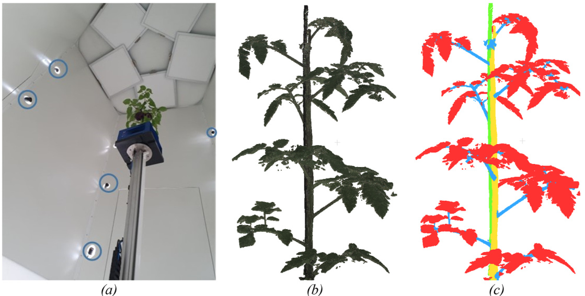  
Fig. 4. (a) Camera setup to create the point clouds using fifteen cameras on three height levels (only 5 shown). (b) input point cloud of tomato plant with six channels; RGB and surface normals (not visualised). (c) Annotated point cloud with leaves (red), main stem (yellow), pole (green), and side stems (blue). (For interpretation of the references to colour in this figure legend, the reader is referred to the Web version of this article.)  

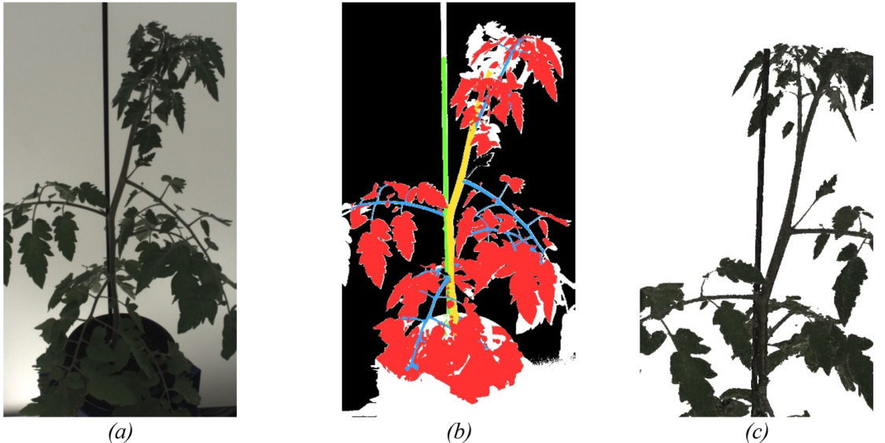  
Fig. 5. (a) Original RGB image. (b) Annotated image by rendering an image from the annotated point cloud. Background (black), leaves (red), main stem (yellow), pole (green), side stems (blue), and white pixels represent pixels that appear in the 2D image, but not in the 3D point cloud. (c) Rendered RGB image to increase the size of the dataset. (For interpretation of the references to colour in this figure legend, the reader is referred to the Web version of this article.)  

# 2.2.3. Training, validation, and test set  

The dataset consisted of 44 plants from three different cultivars: Brioso (19), Merlice (17), and Gardener Delight (8). The plants were in development phase and relatively small $\left( < 8 0 \ \mathrm { c m } \right)$ , with flowers still developing. The plants were randomly divided into a train, validation, and test set at individual plant level. This means that all data relating to a single plant, including the point cloud and RGB images were allocated to the same split. The dataset set was divided into a train set of 35 plants $( 8 0 \% )$ , a validation set of 4 plants $( 9 \% )$ , and a test set of 5 plants $( 1 1 \% )$ . The complete dataset is summarised in Table 1.  

# 2.3. Evaluation  

To evaluate the segmentation performance in 3D following criteria are used.  

Table 1 Summary of dataset.   

<html><body><table><tr><td>Split</td><td>Number of plants</td><td>Point clouds</td><td>RGB images</td></tr><tr><td>Train</td><td>35</td><td>35</td><td>525</td></tr><tr><td>Validation</td><td>4</td><td>4</td><td>60</td></tr><tr><td>Test</td><td>5</td><td>5</td><td>75</td></tr></table></body></html>  

- Intersection over Union for each class $\mathrm { ( I o U _ { c } ) }$ . This metric calculates the segmentation performance for each class, using the following equation:  

$$
I o U _ { c } = \frac { T P _ { c } } { T P _ { c } + F P _ { c } + F N _ { c } }
$$  

where $\mathrm { T P _ { c } }$ is the number of true positive points belonging to class c, $\mathrm { F P _ { c } }$ the number of false positives indicating the number of points incorrectly predicted as class c and $\mathrm { F N _ { c } , }$ the number of false negatives, representing the number of points not predicted as class c.  

- Macro Intersection of Union $( \mathrm { I o U } _ { \mathrm { m a c r o } } )$ , a single number representing the average of per-class IoU-values, with $C$ the number of classes. All classes have an equal weight on the metric independent of the number of points of that class.  

$$
\ I o U _ { m a c r o } = { \frac { \sum _ { c = 1 } ^ { C } I o U _ { c } } { C } }
$$  

- Micro Intersection of union $\mathrm { ( I o U _ { m i c r o } ) }$ , almost similar to $\mathrm { I o U } _ { \mathrm { m a c r o } }$ but instead calculates the performance of all true positives, independent of the class. The $\mathbf { I o U } _ { \mathrm { m i c r o } }$ weights each point equally, dominating classes will resultingly have a larger influence on the metric.  

$$
I o U _ { m i c r o } = \frac { \displaystyle \sum _ { c = 1 } ^ { C } T P _ { c } } { \displaystyle \sum _ { c = 1 } ^ { C } \left( T P _ { c } + F P _ { c } + F N _ { c } \right) }
$$  

The test set consisted of a relatively small sample size, comprising only five plants. Statistics are calculated using a paired t-test on boot­ strapped data with the number of subsamples set to 1000.  

# 2.4. Experiments  

This research was divided into four experiments. The first experi­ ment (2.4.1) aimed to identify the best 3D segmentation model and compare it to the default 2D-to-3D algorithm. The second experiment (2.4.2) tested the performance influence of using rendered images. The third experiment (2.4.3) assessed the training efficiency of the 2D-to-3D and 3D segmentation algorithm by gradually increasing the amount of training data. Finally, the last experiment (2.4.4) evaluated the perfor­ mance as a function of the number of cameras used.  

# 2.4.1. Experiment 1: a comparison between state-of-the-art segmentation algorithms  

In experiment 1 the objective is to compare the performance of the developed 2D-to-3D reprojection algorithm with three state-of-the-art 3D segmentation algorithms.  

2.4.1.1. 2D-to-3D reprojection algorithm. The 2D reprojection algorithm relied on Mask2Former pre-trained on Ade20k (Zhou et al., 2017) to segment the RGB images in background, leaves, pole, main and side stem. Training settings can be found on our GIT. These settings are based on the Mask2Former implementation of MMsegmentation library since these are already optimised (MMSegmentation, 2020). For the com­ parison with the 3D segmentation algorithm Mask2Former was trained on all 525 training images from Table 1. In the Results section, this model is referred to as the “2D-to-3D” model. Inference was done on the original resolution 1080x1920 (width $\mathbf { x }$ height) without any augmentations.  

2.4.1.2. 3D segmentation algorithms. Three 3D-segmentation algorithms were trained; MinkUNet34C (Choy et al., 2019), Swin3D-s (Yang et al., 2025) and PTv3 (Wu et al., 2024). From the results of the ScanNet dataset (Dai et al., 2017) it can be expected that the Swin3D-s and PTv3 will outperform Minkowskinet34; which still relies on the traditional encoder-decoder CNN-based architecture. Training settings are based on the paper of PTv3 (Wu et al., 2024) and can also be found on our GIT. All 3D algorithms had identical augmentation settings.  

To optimise performance, two additional sub-experiments were conducted. For the Swin3D-s and PTv3 algorithms, the impact of using pre-trained models was evaluated. Subsequently, the influence of the learning rate was determined. The learning rate is not consistent be­ tween datasets as shown by Wu et al. (2024). Therefore, the learning was optimised by increasing/decreasing the learning rate with a factor ten, resulting in a learning rate of $6 . 0 ^ { * } 1 0 ^ { - 4 }$ or $6 . 0 { ^ { * } } 1 0 ^ { - 2 }$ for all three 3D al­ gorithms. The model with the highest $\mathrm { I o U } _ { \mathrm { m a c r o } }$ is compared with the 2D-to-3D reprojection algorithm and used for the remaining experiments.  

# 2.4.2. Experiment 2: the performance influence of rendered images  

In the second experiment, a comparison was made by replacing the fifteen real images with “rendered” images. This experiment was con­ ducted to investigate if the use of rendered images rather than real im­ ages changes the performance, which is especially interesting for nonimage-based datasets. To create rendered images, the developed pipe­ line presented in section 2.1.1 “acquiring images” is re-used. Instead of rendering ground truth images from an annotated point cloud, images are now rendered from a coloured point cloud with intrinsic and extrinsic similar to the real RGB images. The new training dataset of 525 rendered images is used to train an additional Mask2Former model. In the result section, this model is referred to as “rendered 2D-to-3D”.  

# 2.4.3. Experiment 3: training efficiency as a function of the number of annotated plants  

The 3rd experiment aims to quantify which algorithm has a higher training efficiency, which is important to evaluate since a higher training efficiency indicates that fewer annotations are needed. The experiment evaluates the performance of the 2D-to-3D and Swin3D-s algorithms by training the model as a function of the number of anno­ tated plants in the training set. An algorithm has a higher training effi­ ciency if it obtains a higher performance with a similar number of annotated plants, $N \in \{ 1 , 5 , 1 0 , 1 5 , 2 0 , 2 5 , 3 0 , 3 5 \}$ . Both 2D-to-3D and Swin3D-s were trained on the same set of plants; however, 2D-to-3D was trained on corresponding RGB images of those plants, while Swin3D-s was trained on the corresponding point cloud. One single plant corre­ sponded with fifteen annotated RGB images.  

# 2.4.4. Experiment 4: effect of the number of cameras on performance  

In the fourth experiment, the aim is to quantify the performance of the 2D-to-3D reprojection algorithm as a function of the number of cameras. By gradually increasing the number of cameras, it is expected that performance will improve, as more parts of the plant are visible and as the majority vote is calculated on more points. Also, it is investigated whether performance can further increase by adding virtual cameras.  

The experiment is summarised in Table 2. In this table, the number of cameras is gradually increased from five up to 25 cameras. As explained in section 2.2.1, the setup contains three rings of five cameras: five at the bottom of the plant, five at the middle and five at the top of the plant. The experimented started with a minimum of five cameras in the middle ring (5m) and increased in increments of five, using different combinations. To assess the performance with more than fifteen cam­ eras, the setup was extended by adding ten virtual cameras; five posi­ tioned between the bottom and middle row, and five between the middle and top row. Those new cameras are visualised in grey in Fig. 6ab. An example rendered image is visualised in Fig. 5c.  

Table 2 Summary of experiment 4 with gradually increasing the number of cameras.   

<html><body><table><tr><td rowspan="2">Abbreviation</td><td colspan="2">Number of cameras</td><td rowspan="2">Explanation</td></tr><tr><td>real</td><td>virtual</td></tr><tr><td>5m</td><td>5</td><td></td><td>Only the 5 cameras in the middle ring are used to do the reprojection</td></tr><tr><td>5m5t</td><td>10</td><td></td><td>5 cameras in the middle and 5 top cameras are used</td></tr><tr><td>5m5b</td><td>10</td><td></td><td>5 cameras in the middle and 5 bottom cameras are used</td></tr><tr><td>15c</td><td>15</td><td></td><td>All 15 RGB cameras are used</td></tr><tr><td>15c5rt</td><td>15</td><td>5</td><td>All 15 RGB cameras and 5 additional images rendered (r) from layer between middle and top</td></tr><tr><td>15c5rb</td><td>15</td><td>5</td><td>layer. All 15 RGB cameras and 5 additional images rendered from layer between middle and bottom</td></tr><tr><td>15c5rt5rb</td><td>15</td><td>10</td><td>layer. All 15 RGB cameras and 10 additional rendered images.</td></tr></table></body></html>  

In this experiment, Mask2Former is trained on real and rendered images since the default “2D-to-3D” model was only trained on real images. The new model was trained on 875 images: 525 real and 350 rendered images (35 plants $\mathbf { x } 1 0$ virtual cameras). By incorporating these rendered images in the training pipeline, it was possible to perform all tests in Table 2 with the same Mask2Former model. Performance was evaluated using the described metrics.  

# 3. Results  

# 3.1. Experiment 1: a comparison between state-of-the-art segmentation algorithms  

Table 3, summarises the result of the multiple 3D segmentation models and the developed 2D-to-3D reprojection algorithm. The results are sorted on the $\mathrm { I o U } _ { \mathrm { m a c r o } }$ metric. MinkUNet34C consistently has the lowest $\mathbf { I o U _ { \mathrm { m a c r o } } }$ across all learning rates, indicating it is underperforming. The difference between the best PTv3 and Swin3D-s algo­ rithm is minimal (0.77 vs $0 . 7 9 \ \mathrm { I o U _ { m a c r o } } )$ . Additionally, both PTv3 and Swin3D-s have a higher performance when using a pre-trained network and the default learning rate $( 6 . 0 ^ { * } 1 0 ^ { - 3 } )$ . Especially for PTv3, pretraining gave a substantial IoUmacro improvement of 0.06 for $\lambda \ : =$ $6 . 0 ^ { * } 1 0 ^ { - 3 }$ . For each trained model, the leaves are segmented with the highest accuracy causing a relatively high $\mathbf { I o U } _ { \mathrm { m i c r o } }$ compared with the IoUmacro.  

From Table 3, the difference between the 2D-to-3D and Swin3D-s is minimal with an $\mathrm { I o U } _ { \mathrm { m a c r o } }$ of 0.78 and 0.79, respectively. A paired t-test on bootstrapped data showed no significant difference with $\mathtt { p } = 0 . 0 6$ . The IoU of the main stem and pole are also comparable, with an IoU difference smaller than $\leq 0 . 0 1$ . The 2D-to-3D method has a slightly lower accuracy to recognise the leaves (0.97 vs 0.95) and side stems correctly (0.67 vs 0.70). This is partly caused by points being predicted as background which occurs on average with $1 . 4 ~ \%$ . Comparing the $\mathrm { I o U } _ { \mathrm { m a c r o } }$ of 2D-to-3D with PTv3 was also not significant ${ \bf \langle p = 0 . 9 0 \rangle }$ .  

In Table 4, the segmentation results of a plant from the test set are visualised for each architecture trained with the optimal settings. The first row shows the predicted classes, and second row incorrectly pre­ dicted points $( \mathrm { F P } + \mathrm { F N } )$ in red. There is no clear difference between Swin3D-s, 2D-to-3D and PTv3. MinkUNet34C fails to recognise the side stems correctly. Almost all side points are coloured red. The 2D-to-3D method has several points with a black colour, indicating that these points of the plant were predicted as background. These black points are especially visible on the leaves, explaining the lower performance on the leaves class in Table 3. All methods have a relatively large error at the border between the pole and main stem. This is partly caused by the fact that annotating these points is error prone as well. This is discussed in more detail in section 4.1.  

In the remaining experiments, the results of the 2D-to-3D method are only compared with Swin3D-s algorithm (pre-trained with default learning rate) because this model had the highest performance of the 3D methods (Table 3). In Table 5 the results of both models on the remaining four plants in the test set are shown. The performance be­ tween both methods is comparable, except for plant “Harvest_02_­ PotNr_166". A closer inspection revealed that the top part of the plant is barely visible in the corresponding images due to occlusion by the pole. This resulted in a $\mathrm { I o U } _ { \mathrm { m a c r o } }$ of 0.71, 0.04 lower than the Swin3D-s approach.  

# 3.2. Experiment 2: the performance influence of rendered images  

Table 6 presents the performance metrics for the 2D-to-3D method on rendered images. Comparing these results with the performance of the “default” 2D-to-3D method reveals that training Mask2Former on rendered images (“rendered 2D-to-3D”) does not affect the $\mathrm { I o U } _ { \mathrm { m a c r o } }$ and $\mathrm { I o U } _ { \mathrm { m i c r o } }$ . Both the default and rendered 2D-to-3D methods achieve an identical $\mathrm { I o U } _ { \mathrm { m a c r o } }$ of 0.78, indicating that the use of rendered images does not significantly influence performance metrics.  

The input image, segmented image, and segmented point cloud for the default and rendered 2D-to-3D method are visualised in Fig. 7. The rendered imaged (d) shows a high overlap with the real image (a). Indicating that the meshing algorithm was accurate, tiny sides were still visible and it does not create any holes that disturb the rendered images. Fig. 7b shows that the top part of the pole is incorrectly predicted as a leaf. The performance of both methods is however identical (IoUmacro 0.78). This is caused by the voxel size being smaller than the plant, consequently, not all pixels of the real 2D image appear in the 3D rep­ resentation (see section 2.2.2). This is also visible from the segmented point cloud in Fig. 7c, which shows that the top part of the pole is missing. As a result, despite the incorrectly predicted pixels in Fig. 7b, the performance of both the 2D-to-3D with real and with rendered im­ ages is similar. Consequently, it does not matter whether real or rendered images are used to segment the plant in 3D.  

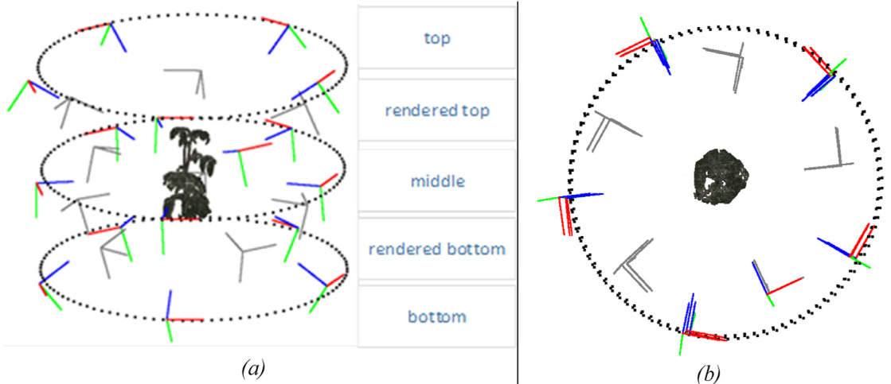  
Fig. 6. Schematic visualisation of camera poses in (a) side view and (b) top view. The coloured lines represent the pose of the “real” cameras within blue the di­ rection of the camera. The new poses of the rendered images are shown in grey. In black a dashed circle added for readability. (For interpretation of the references to colour in this figure legend, the reader is referred to the Web version of this article.)  

Table 3 Result of multiple 3D segmentation algorithms on test set. Trained with or without pre-training, and either dividing or multiplying the learning rate by ten. Values in green indicate higher IoU values per column and in bold the highest value per column.   
Table 4 Segmentation results of four different architecture on plant “Harvest_02_PotNr_27”. First row shows predicted classes with red $\mathbf { \Sigma } = \mathbf { \Sigma }$ leaves, yellow $\mathbf { \Sigma } = \mathbf { \Sigma }$ main stem, green $\mathbf { \Sigma } = \mathbf { \Sigma }$ pole, light blue $\mathbf { \Sigma } = \mathbf { \Sigma }$ side stem and in black points assigned as background. Second row visualisation of TP in blue and $\mathrm { F P } + \mathrm { F N }$ in red.   

<html><body><table><tr><td>Model</td><td>Pretrained</td><td>LR</td><td>IoUmacro</td><td>IoUmiero</td><td>IoULeave S</td><td>IoUMain stem</td><td>IoUPole</td><td>IoUside stem</td></tr><tr><td>Swin3D-s</td><td>√</td><td>6.0*10-3</td><td>0.79</td><td>0.93</td><td>0.97</td><td>0.75</td><td>0.76</td><td>0.70</td></tr><tr><td>Swin3D-s</td><td></td><td>6.0*10-3</td><td>0.78</td><td>0.92</td><td>0.96</td><td>0.75</td><td>0.76</td><td>0.66</td></tr><tr><td>2D-to-3D</td><td>√</td><td>1.0*10-4</td><td>0.78</td><td>0.91</td><td>0.95</td><td>0.74</td><td>0.76</td><td>0.67</td></tr><tr><td>PTv3</td><td>√</td><td>6.0*10-3</td><td>0.78</td><td>0.92</td><td>0.97</td><td>0.71</td><td>0.75</td><td>0.69</td></tr><tr><td>PTv3</td><td>√</td><td>6.0*10-4</td><td>0.77</td><td>0.91</td><td>0.96</td><td>0.7</td><td>0.75</td><td>0.66</td></tr><tr><td>Swin3D-s</td><td>√</td><td>6.0*10-4</td><td>0.76</td><td>0.91</td><td>0.96</td><td>0.71</td><td>0.75</td><td>0.63</td></tr><tr><td>PTv3</td><td></td><td>6.0*10-3</td><td>0.72</td><td>0.89</td><td>0.95</td><td>0.7</td><td>0.74</td><td>0.49</td></tr><tr><td>Swin3D-s</td><td>√</td><td>6.0*10-2</td><td>0.7</td><td>0.89</td><td>0.95</td><td>0.7</td><td>0.73</td><td>0.42</td></tr><tr><td>PTv3</td><td>√</td><td>6.0*10-2</td><td>0.64</td><td>0.86</td><td>0.94</td><td>0.55</td><td>0.59</td><td>0.48</td></tr><tr><td>MinkUNet34 C</td><td></td><td>6.0*10-2</td><td>0.61</td><td>0.85</td><td>0.93</td><td>0.57</td><td>0.61</td><td>0.31</td></tr><tr><td>MinkUNet34 C</td><td></td><td>6.0*10-3 6.0*10-4</td><td>0.58</td><td>0.85</td><td>0.93</td><td>0.57</td><td>0.55</td><td>0.25</td></tr><tr><td>MinkUNet34 C</td><td></td><td></td><td>0.54</td><td>0.83</td><td>0.92</td><td>0.47</td><td>0.58</td><td>0.19</td></tr></table></body></html>  

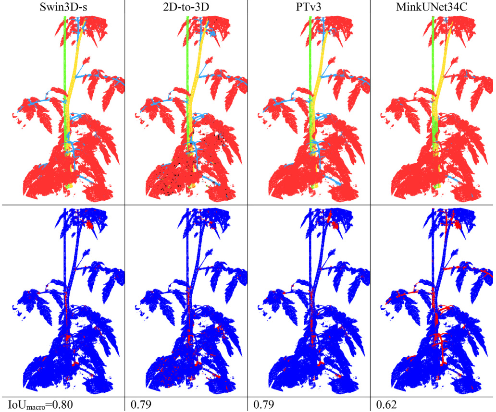  

# 3.3. Experiment 3: training efficiency as a function of the number of annotated plants  

In Fig. 8, the performance is shown as a function of the number of plants used to train the model. P-values were calculated using a paired bootstrapped t-test, resultingly the confidence intervals may overlap despite the present of significant differences. Compared to the Swin3D-s, the 2D-to-3D method has a better performance with fewer scenes, and with same number of training samples it has a significant difference for 1, 5, 10, 15 or 20 plants in the train set. Additionally, the performance of the 2D-to-3D algorithm is nearly constant between 5 and 25 scenes, suggesting that increasing the size of the training set beyond five plants does lead to only marginal improvements. As a result, the 2D-to-3D method with just five plants in the training set has a comparable per­ formance with the Swin3D-s algorithm trained on 25 plants. Combined with the significant difference $( \mathtt { p } < 0 . 0 5 )$ , it can be concluded that the  

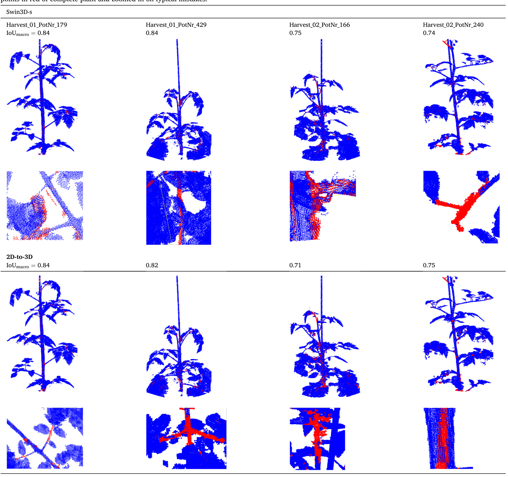  

Table 5 Results of remaining plants in test set. Only shown for Swin3D-s and the 2D-to-3D reprojection method. Correctly predicted points in blue and incorrectly predicted points in red of complete plant and zoomed in on typical mistakes.   
Table 6 Summary of performance influence of rendered images.   

<html><body><table><tr><td>Experiment name</td><td>IoUmacro</td><td>IoUmicro</td><td>Leaves</td><td>Main stem</td><td>Pole</td><td>Side stem</td></tr><tr><td>Swin3D-s</td><td>0.79</td><td>0.93</td><td>0.97</td><td>0.75</td><td>0.76</td><td>0.7</td></tr><tr><td>Rendered 2D-to-3D</td><td>0.78</td><td>0.91</td><td>0.95</td><td>0.75</td><td>0.77</td><td>0.67</td></tr><tr><td>2D-to-3D (default)</td><td>0.78</td><td>0.91</td><td>0.95</td><td>0.74</td><td>0.76</td><td>0.67</td></tr></table></body></html>  

2D-to-3D method has a higher training efficiency than the Swin3D-s method.  

# 3.4. Experiment 4: effect of the number of cameras on performance  

Fig. 9 shows the performance as a function of the number of used cameras. For 10 and 20 cameras, two $\mathrm { I o U } _ { \mathrm { m a c r o } }$ values are shown since it is possible to either use the bottom or top images. Using the bottom cameras showed a larger increase in performance than the top cameras. Increasing the number of cameras has a positive effect on the perfor­ mance. The performance with 25 cameras is even higher than the Swin3D-s model (dashed line), which was unexpected since the point cloud is made from only fifteen cameras. Despite, the higher perfor­ mance with 25 cameras, the result compared with Swin3D-s was not significant $( \mathtt { p } = 0 . 2 6 )$ .  

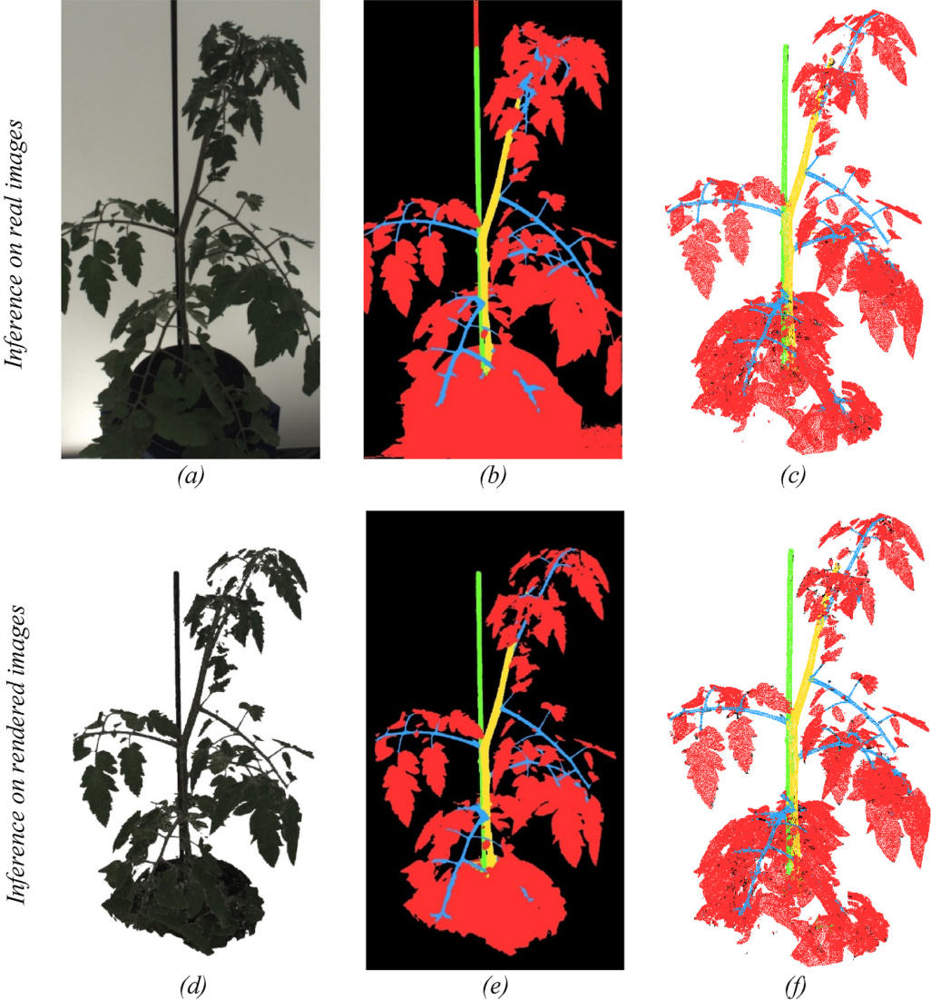  
Fig. 7. Visualisation of real and rendered RGB input images (a) and (d). The corresponding predicted segmentation in b and e. As last, the segmented point cloud of default (c) and rendered (f) 2D-to-3D approach.  

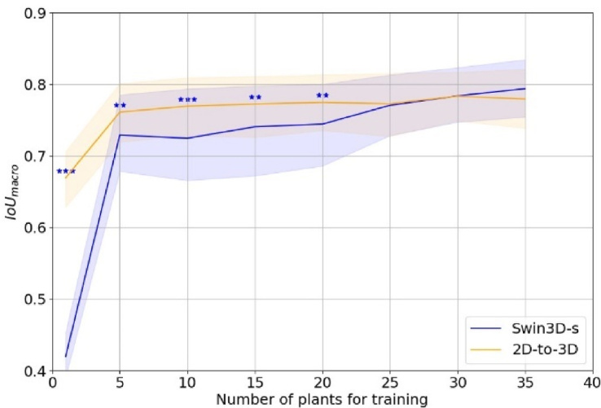  
Fig. 8. $\mathrm { I o U } _ { \mathrm { m a c r o } }$ as a function of the number of plants to train the models with corresponding confidence interval $( 9 5 ~ \% )$ . Results of paired bootstrapped t-test is indicated with a “\*”, if $\mathtt { p } < 0 . 0 5$ $( ^ { * } )$ , $\mathfrak { p } < 0 . 0 1$ $( { ^ { * * } } )$ and $\begin{array} { r } { \mathbf { p } < 0 . 0 0 1 } \end{array}$ $( ^ { * * * } )$ .  

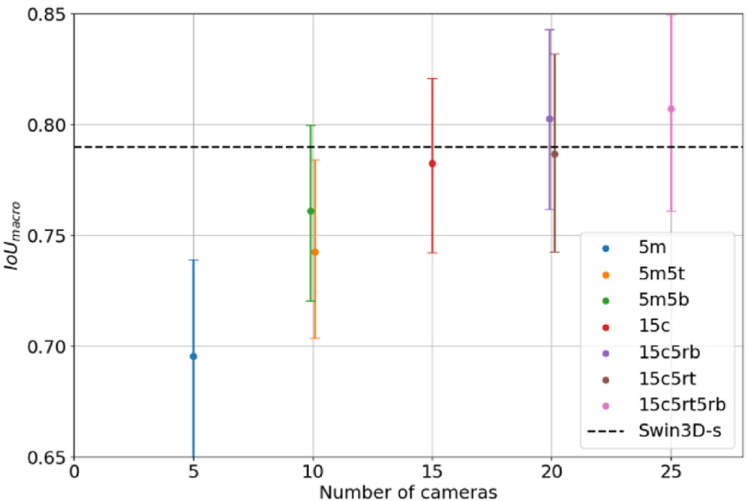  
Fig. 9. Performance in $\mathrm { I o U } _ { \mathrm { m a c r o } }$ as a function of the number of used cameras including $9 5 \ \%$ confidence interval. For readability, the number of cameras is slightly altered by $\pm 0 . 1$ at 10 and 20 cameras. The dashed line represents the performance of the Swin3D-s model. Note that Swin3D-s was trained on point clouds, so it is not influenced by the number of cameras.  

# 4. Discussion  

# 4.1. 2D-to-3D reprojection versus 3D segmentation algorithms  

In this research, a comparison is made between state-of-the-art 3D segmentation algorithms and a segmentation based on 2D-to-3D repro­ jection. The results indicated that there was no significant performance difference $( \mathbf { p } _ { \mathbf { \lambda } } = \mathbf { \lambda } 0 . 0 6 )$ between the best 3D segmentation algorithm, Swin3D-s, and our developed 2D-to-3D algorithm. This was in contra­ diction with our hypothesis that the 2D-to-3D algorithm would outperform the 3D algorithm. Major reason is the emerging develop­ ment in 3D segmentation algorithms using transformers. In 2023, many of these new 3D algorithms were published (Swin3D-s and PTv3). These transformer-based algorithms outperform traditional networks by uti­ lising self-attention mechanisms to improve global connections between points, while convolution neural network (CNN)-based methods start with low-level information and progressively incorporate global infor­ mation in deeper layers. These CNN-based approaches are underperforming. The $\mathrm { I o U } _ { \mathrm { m a c r o } }$ of MinkUNet34C was 0.18 lower than transformer-based (Swin3D-s and PTv3) methods. The recent advances made in 3D segmentation algorithms is resultingly one of the reasons for the non-significant differences between the Swin3D-s, PTv3 and our 2Dto-3D method.  

The results in Table 3 were obtained by using pre-trained networks and optimised learning rates. Other hyperparameters, like augmenta­ tions settings, were not optimised. This could raise the question of whether the comparison between the algorithms is technically correct. Current augmentation settings are based on the results of PTv3 on the ScanNet dataset, containing point clouds of many living rooms of various sizes. The point clouds in this study are all related to plants captured from a voxel space with a predefined size. Consequently, some augmentation settings like scaling might introduce noise. On the other hand, in the research of Swin3D (Yang et al., 2025), 3D architectures were also compared with similar data augmentation settings. In addi­ tion, in the work of Xin et al. (2023) nine different augmentation settings were compared with a default model without data augmentation. All nine augmentation settings resulted in a higher performance. It can be hypothesised that the augmentations settings used in this work contributed to a higher performance. By optimising the learning rate and using the default augmentation settings we believe that in this research, an attempt was made to maximise the performance of the presented models and obtain a fair comparison between the presented methods. Despite efforts to maximise performance, the results from experiment 1 did not differ significantly, indicating that there is no preference for a projection, voxel or point-based algorithm based on the results of experiment 1.  

In Table 4, all models showed many classification errors between the pole and main stem. This could be due to errors in the ground truth annotation since it is difficult to annotate small instances. Boogaard et al. (2021) determined the intra-observer variability of two annotators on a plant organ annotation task using the $\mathrm { I o U } _ { \mathrm { m a c r o } }$ metric, yielding a value of 0.77. This result indicates that the perfect annotated dataset does not exist. In addition, it shows that comparing the $\mathrm { I o U } _ { \mathrm { m a c r o } }$ with the maximum score of one is not fully correct. Therefore, in future research it is recommended to at least annotate the test set twice by independent annotators.  

The output of the 2D segmentation network showed incorrect segmented pixels (Fig. 7b). In this figure, the upper part of the pole, for example, was predicted as a leaf. These incorrect predictions had how­ ever a minimal influence on the performance since most of these points are not in the point cloud due to the voxel space being smaller than the plant. The limited voxel space caused white pixels in the annotated 2D dataset (Fig. 5), which were ignored in the loss function of Mask2­ Former. However, the model was therefore never penalised for pre­ dicting the upper part of the pole as a leaf. Consequently, the current segmentation model was sub-optimal since the annotated images contained unknown pixels. If the point clouds were complete, this would have resulted in a high-quality annotated 2D dataset, potentially enhancing the performance of the 2D-to-3D method. However, improving the completeness of the point cloud would require expanding the voxel space, which at the moment limited by the horizontal FOV of the camera. Besides shape-from-silhouette methods are memory inten­ sive since each voxel needs to be stored in memory. At the moment, other methods like 3D Gaussian Splatting are currently in development and show promising results in scene reconstruction (Kerbl et al., 2023). This technique could serve as an alternative for shape-from-silhouette-based methods in the near future.  

# 4.2. Training efficiency  

The performance of the 2D and 3D methods was not significant different when both models were trained on all 35 plants in the training dataset. However, the 2D-to-3D method showed a significant higher data efficiency. Fig. 8 shows that with five plants, the performance of the 2D-to-3D algorithm was similar to the Swin3D-s algorithm trained on 25 scenes. This result was in agreement with the research of Kundu et al. (2020) in which a reprojection method on the ScanNet dataset was compared with “SparseConv”, an algorithm comparable with MinkU­ Net34C. In their research, the 2D method always outperformed the 3D segmentation algorithm in terms of labelled scenes. The data efficiency of our method can potentially be further increased by including the additional rendered images from Experiment 4.  

In our experiment, the annotated data for the 2D-to-3D method was generated by rendering images from the annotated point cloud. The time required to create an annotated dataset is therefore similar for both the 2D-to-3D and 3D segmentation methods. This is an important aspect for comparing the training efficiency of two different methods since the amount of data directly correlates with the time required to create an annotated dataset. Annotating RGB images, as shown in Fig. 5a required two to $^ { 4 \mathrm { ~ h ~ } }$ , whereas the point cloud was annotated in $^ \textrm { \scriptsize 1 h }$ . As demon­ strated in this research, a single point cloud can be used to generate at least fifteen annotated RGB images, effectively reducing the annotation time to $4 \ \mathrm { m i n }$ per RGB image. Annotating the RGB images by hand would have resulted in much lower performance. The results clearly highlight the importance of annotations in 3D, annotation efficiency increases and by using the 2D-to-3D reprojection algorithm fewer an­ notated plants are needed to achieve a similar performance as 3D seg­ mentation models.  

# 4.3. Influence on the number of cameras  

The number of cameras was increased from five to 25 by including ten virtual cameras to investigate whether increasing the number of cameras improves the results. Fig. 9 showed an upward trend in per­ formance when the number of cameras was increased. Interestingly, the performance also increased when virtual camera images were added on top of the fifteen real camera images. This was unexpected since the point clouds were created from the original fifteen camera images. A possible explanation is that the additional images create a unique view in which plant parts that were previously occluded are now clearly visible. By adding those new predictions, points that were previously only seen by one or two cameras, are now classified based on the ma­ jority vote of maybe three, or more (less occluded) images. As a result, the performance of the segmentation method can be improved by adding more camera images. This is in line with the results of Shi et al. (2019), in which any error in the 2D segmentation was partly compensated by the voting mechanism in 3D. Of course, the disadvantage of adding more cameras is the linear increase of computation time. In this research, the speed to segment the point cloud was not considered as important, since processing was done offline. In a practical environment, it might be relevant to include inference time in the evaluation. On the other hand, if accurate segmentation is crucial then the presented work clearly showed that performance is improved by adding more cameras.  

# 4.4. Future recommendations  

In this research, the segmentation performance of a 2D-to-3D reprojection method was compared with state-of-the-art 3D segmenta­ tion algorithms. It might be interesting to include a combined approach in the comparison. Hu et al. (2021) presented a bidirectional projection network (BPnet). The bidirectional architecture enables the exchange of features between 2D and 3D data, which theoretically could improve performance. Their network relied on the Minkowski architecture which underperformed in this research (Table 3). However, it might be worthwhile to investigate if a Swin-transformer architecture can be in­ tegrated into the bidirectional structure. Another algorithm that might be interesting is Ponderv2 (Zhu et al., 2023). Ponderv2 aims to improve segmentation performance by focusing on pre-training the backbone (Zhu et al., 2023). Specifically in their paradigm, rendered images are compared with real 2D images. This information was used to supervise the 3D backbone and resulted in an improved performance.  

The methodology was evaluated on a tomato dataset of 44 plants, with a test set consisting of only five plants. Using bootstrapping, pvalues between different models were calculated, however, it is rec­ ommended to increase the test set in future experiments or apply k-fold cross validation. In addition, it could be interesting to evaluate our method on other datasets. In the second experiment, no significant dif­ ference was found when between real or rendered images (Table 6), indicating that the developed method could also work on datasets without real RGB images.  

Besides improving the segmentation accuracy, the post-processing steps are equally important. From segmented point clouds, the plant architecture can be reconstructed to determine height, internode length and branching angle. Those traits can be calculated using skeletonisa­ tion methods, however, these methods are sensitive to noise (Chebrolu et al., 2021). Accurate segmentation is therefore crucial. In this research, the focus was to segment the plant into organs as accurately as possible. While there is potential to improve segmentation accuracy, the required accuracy in the post-processing steps is not yet clear. Therefore, future research should prioritise the segmentation accuracy needed to recon­ struct the plant architecture including associated plant traits.  

# 5. Conclusion  

For plant phenotyping accurate segmentation is crucial to convert segmented point clouds to plant traits. In this research, a comparison was made between a 2D-to-3D reprojection and three 3D segmentation algorithms with either a point or voxel-based architecture. The repro­ jection method segments a point cloud through a majority vote algo­ rithm on all points that are segmented in 2D and reprojected to the point cloud. The results showed that there is no clear performance difference between state-of-the-art point or voxel-based 3D segmentation methods and our developed 2D-to-3D reprojection method. The $\mathrm { I o U } _ { \mathrm { m a c r o } }$ was almost identical between Point Transformer V3 (0.78), Swin3D-s (0.79), and our developed 2D-to-3D approach (0.78) when trained on all plants in the training set. The results, however, do indicate that the 2D-to-3D method has a higher data efficiency. By only annotating five scenes, the 2D-to-3D reprojection method obtained a similar performance as the Swin3D-s algorithm trained on 25 scenes. In addition, the 2D-to-3D method also works for datasets without (real) RGB images. Our exper­ iments showed that there was no significant difference by either running the model with real or rendered RGB images. Finally, this research showed that a higher performance than a state-of-the-art 3D segmen­ tation algorithm can be obtained by increasing the number of cameras from fifteen to 25.  

This research provided useful insights in the performance and training efficiency of state-of-the-art projection, point and voxel-based segmentation methods for plant phenotyping. In the future, it is recommended to focus on the post-processing steps, converting segmented point clouds to plant traits. Currently, it is unknown which segmentation performance is required to estimate plant traits with a certain accuracy. Breeders and researchers can segment point clouds with a reasonable accuracy as shown in this research. The segmentation does not have to be perfect; a small error is acceptable as long as plant traits can be determined with a sufficient accuracy for selecting the most promising genotypes. Therefore, future research should focus on the next step, converting segmented point clouds to plant traits.  

# CRediT authorship contribution statement  

Bart M. van Marrewijk: Writing – review & editing, Writing – original draft, Visualization, Validation, Software, Resources, Project administration, Methodology, Investigation, Funding acquisition, Formal analysis, Data curation, Conceptualization. Tim van Daalen: Software. Bolai Xin: Resources, Data curation. Eldert J. van Henten: Writing – review & editing, Supervision. Gerrit Polder: Writing – re­ view & editing, Supervision. Gert Kootstra: Writing – review & editing, Supervision.  

# Funding  

This work was supported by the European Union’s Digital Europe Programme [101100622.t] and by intern project named KB38-DDHTPhotonics for Phenotyping & Disease Detection.  

# Declaration of competing interest  

The authors declare that they have no known competing financial interests or personal relationships that could have appeared to influence the work reported in this paper.  

# References  

Akhtar, M. S., Zafar, Z., Nawaz, R., & Fraz, M. M. (2024). Unlocking plant secrets: A systematic review of 3D imaging in plant phenotyping techniques. Computers and Electronics in Agriculture, 222, Article 109033. https://doi.org/10.1016/j. compag.2024.109033   
Apolo-Apolo, O. E., Martínez-Guanter, J., Egea, G., Raja, P., & P´erez-Ruiz, M. (2020). Deep learning techniques for estimation of the yield and size of citrus fruits using a UAV. European Journal of Agronomy, 115, Article 126030. https://doi.org/10.1016/j. eja.2020.126030   
Araus, J. L., & Cairns, J. E. (2014). Field high-throughput phenotyping: The new crop breeding frontier. Trends in Plant Science, 19(1), 52–61. https://doi.org/10.1016/j. tplants.2013.09.008   
Araus, J. L., Kefauver, S. C., Zaman-Allah, M., Olsen, M. S., & Cairns, J. E. (2018). Translating high-throughput phenotyping into genetic gain. Trends in Plant Science, 23(5), 451–466. https://doi.org/10.1016/j.tplants.2018.02.001   
Boogaard, F. P., Rongen, K. S., & Kootstra, G. W. (2020). Robust node detection and tracking in fruit-vegetable crops using deep learning and multi-view imaging. Biosystems Engineering, 192, 117–132. https://doi.org/10.1016/j. biosystemseng.2020.01.023   
Boogaard, F. P., van Henten, E. J., & Kootstra, G. (2021). Boosting plant-part segmentation of cucumber plants by enriching incomplete 3D point clouds with spectral data. Biosystems Engineering, 211, 167–182. https://doi.org/10.1016/j. biosystemseng.2021.09.004   
Boogaard, F. P., van Henten, E. J., & Kootstra, G. (2023). The added value of 3D point clouds for digital plant phenotyping–A case study on internode length measurements in cucumber. Biosystems Engineering, 234, 1–12. https://doi.org/10.1016/j. biosystemseng.2023.08.010   
Boulch, A., Guerry, J., Le Saux, B., & Audebert, N. (2018). SnapNet: 3D point cloud semantic labeling with 2D deep segmentation networks. Computers & Graphics, 71, 189–198. https://doi.org/10.1016/j.cag.2017.11.010   
Cardellicchio, A., Solimani, F., Dimauro, G., Petrozza, A., Summerer, S., Cellini, F., & Ren\`o, V. (2023). Detection of tomato plant phenotyping traits using YOLOv5-based single stage detectors. Computers and Electronics in Agriculture, 207, Article 107757. https://doi.org/10.1016/j.compag.2023.107757   
Chebrolu, N., Magistri, F., L¨abe, T., & Stachniss, C. (2021). Registration of spatiotemporal point clouds of plants for phenotyping. PLoS One, 16(2), Article e0247243. https://doi.org/10.1371/journal.pone.0247243   
Cheng, B., Misra, I., Schwing, A. G., Kirillov, A., & Girdhar, R. (2022). Masked-attention mask transformer for universal image segmentation. In Proceedings of the IEEE/CVF conference on computer vision and pattern recognition. https://doi.org/10.48550/ arXiv.2112.01527   
Choy, C., Gwak, J., & Savarese, S. (2019). 4d spatio-temporal convnets: Minkowski convolutional neural networks. In Proceedings of the IEEE/CVF conference on computer vision and pattern recognition. https://doi.org/10.48550/arXiv.1904.08755   
Cignoni, P., Callieri, M., Corsini, M., Dellepiane, M., Ganovelli, F., & Ranzuglia, G. (2008). Meshlab: An open-source mesh processing tool. Sixth Eurographics Italian Chapter Conference, page 129-136.   
Dai, A., Chang, A. X., Savva, M., Halber, M., Funkhouser, T., & Nießner, M. (2017). Scannet: Richly-annotated 3d reconstructions of indoor scenes. In Proceedings of the IEEE conference on computer vision and pattern recognition. https://doi.org/10.48550/ arXiv.1702.04405   
Deng, J., Dong, W., Socher, R., Li, L.-J., Li, K., & Fei-Fei, L. (2009). Imagenet: A largescale hierarchical image database. In 2009 IEEE conference on computer vision and pattern recognition.   
Erisman, J. W., Sutton, M. A., Galloway, J., Klimont, Z., & Winiwarter, W. (2008). How a century of ammonia synthesis changed the world. Nature Geoscience, 1(10), 636–639. https://doi.org/10.1109/CVPR.2009.5206848   
Girardeau-Montaut, D. (2024). CloudCompare. https://cloudcompare-org.danielgm.net/ release/.   
Golbach, F., Kootstra, G., Damjanovic, S., Otten, G., & van de Zedde, R. (2016). Validation of plant part measurements using a 3D reconstruction method suitable for high-throughput seedling phenotyping. Machine Vision and Applications, 27, 663–680. https://doi.org/10.1007/s00138-015-0727-5   
Harandi, N., Vandenberghe, B., Vankerschaver, J., Depuydt, S., & Van Messem, A. (2023). How to make sense of 3D representations for plant phenotyping: A compendium of processing and analysis techniques. Plant Methods, 19(1), 60. https://doi.org/10.1186/s13007-023-01031-z   
Hartley, R., & Zisserman, A. (2003). Multiple view geometry in computer vision. Cambridge university press   
Hawkesford, M. J., & Riche, A. B. (2020). Impacts of G x E x M on Nitrogen use efficiency in wheat and future prospects. Frontiers in plant science, 11. https://doi.org/10.3389/ fpls.2020.01157 [Review].   
He, K., Zhang, X., Ren, S., & Sun, J. (2016). Deep residual learning for image recognition. In Proceedings of the IEEE conference on computer vision and pattern recognition.   
Hu, W., Zhao, H., Jiang, L., Jia, J., & Wong, T.-T. (2021). Bidirectional projection network for cross dimension scene understanding. In Proceedings of the IEEE/CVF conference on computer vision and pattern recognition.   
Kamilaris, A., & Prenafeta-Boldú, F. X. (2018). Deep learning in agriculture: A survey. Computers and Electronics in Agriculture, 147, 70–90. https://doi.org/10.1016/j. compag.2018.02.016   
Kerbl, B., Kopanas, G., Leimkühler, T., & Drettakis, G. (2023). 3d Gaussian splatting for real-time radiance field rendering. ACM Transactions on Graphics, 42(4), 1–14.   
Kundu, A., Yin, X., Fathi, A., Ross, D., Brewington, B., Funkhouser, T., & Pantofaru, C. (2020). Virtual multi-view fusion for 3d semantic segmentation. In Computer vision–ECCV 2020: 16th European conference, glasgow, UK, august 23–28, 2020, proceedings. https://doi.org/10.1007/978-3-030-58586-0_31. Part XXIV 16.   
Kutulakos, K. N., & Seitz, S. M. (2000). A theory of shape by space carving. International Journal of Computer Vision, 38, 199–218. https://doi.org/10.1023/A: 1008191222954   
Lawal, M. O. (2021). Tomato detection based on modified YOLOv3 framework. Scientific Reports, 11(1), 1–11. https://doi.org/10.1038/s41598-021-81216-5   
Li, L., Zhang, Q., & Huang, D. (2014). A review of imaging techniques for plant phenotyping. Sensors, 14(11), 20078–20111. https://doi.org/10.3390/s141120078   
Lin, T.-Y., Maire, M., Belongie, S., Hays, J., Perona, P., Ramanan, D., Doll´ar, P., & Zitnick, C. L. (2014). Microsoft coco: Common objects in context. In Computer vision–ECCV 2014: 13th European conference, Zurich, Switzerland, september 6-12, 2014, proceedings. https://doi.org/10.1007/978-3-319-10602-1_48. Part Vol. 13.   
Liu, X., Chen, S. W., Aditya, S., Sivakumar, N., Dcunha, S., Qu, C., Taylor, C. J., Das, J., & Kumar, V. (2018). Robust fruit counting: Combining deep learning, tracking, and structure from motion. In 2018 IEEE/RSJ international Conference on intelligent robots and systems (IROS). https://doi.org/10.1109/IROS.2018.8594239   
Liu, Z., Lin, Y., Cao, Y., Hu, H., Wei, Y., Zhang, Z., Lin, S., & Guo, B. (2021). Swin transformer: Hierarchical vision transformer using shifted windows. In Proceedings of the IEEE/CVF international conference on computer vision.   
Liu, Z., Tang, H., Lin, Y., & Han, S. (2019). Point-voxel cnn for efficient 3d deep learning. Advances in Neural Information Processing Systems, 32.   
Marrewijk, v., Bart, M., Xin, B., van Daalen, T., van Henten, E., Polder, G., & Kootstra, G. (2025). TomatoWUR: An annotated dataset of 3D tomato plants to quantitatively evaluate segmentation, skeletonisation, and plant trait extraction algorithms for 3D plant phenotyping. In 4TU.ResearchData. https://doi.org/10.4121/e2c59841-4653- 45de-a75e-4994b2766a2f.v1   
Maturana, D., & Scherer, S. (2015). Voxnet: A 3d convolutional neural network for realtime object recognition. In 2015 IEEE/RSJ international conference on intelligent robots and systems (IROS). https://doi.org/10.1109/IROS.2015.7353481   
Meta AI Research. (2024). Semantic segmentation on ScanNet. Retrieved 29-11-2024 from https://paperswithcode.com/sota/semantic-segmentation-on-scannet.   
Mildenhall, B., Srinivasan, P. P., Tancik, M., Barron, J. T., Ramamoorthi, R., & Ng, R. (2021). Nerf: Representing scenes as neural radiance fields for view synthesis. Communications of the ACM, 65(1), 99–106. https://doi.org/10.1145/3503250   
Mmsegmentation, C. (2020). MMSegmentation: OpenMMLab semantic segmentation toolbox and benchmark. https://github.com/open-mmlab/mmsegmentation.   
Panguluri, S. K., & Kumar, A. A. (2016). Phenotyping for plant breeding. Springer.   
Pound, M. P., Atkinson, J. A., Townsend, A. J., Wilson, M. H., Griffiths, M., Jackson, A. S., Bulat, A., Tzimiropoulos, G., Wells, D. M., & Murchie, E. H. (2017). Deep machine learning provides state-of-the-art performance in image-based plant phenotyping. GigaScience, 6(10), gix083. https://doi.org/10.1093/gigascience/ giy042   
Qi, C. R., Yi, L., Su, H., & Guibas, L. J. (2017). Pointnet : Deep hierarchical feature learning on point sets in a metric space. Advances in Neural Information Processing Systems, 30.   
Ríos, R. O. (2015). Plant breeding in the Omics era. Springer. https://doi.org/10.1007/ 978-3-319-20532-8   
Saeed, F., Sun, S., Rodriguez-Sanchez, J., Snider, J., Liu, T., & Li, C. (2023). Cotton plant part 3D segmentation and architectural trait extraction using point voxel convolutional neural networks. Plant Methods, 19(1), 1–23. https://doi.org/ 10.1186/s13007-023-00996-1   
Schunck, D., Magistri, F., Rosu, R. A., Cornelißen, A., Chebrolu, N., Paulus, S., L´eon, J., Behnke, S., Stachniss, C., & Kuhlmann, H. (2021). Pheno4D: A spatio-temporal dataset of maize and tomato plant point clouds for phenotyping and advanced plant analysis. PLoS One, 16(8), Article e0256340. https://doi.org/10.1371/journal. pone.0256340   
Shi, W., van de Zedde, R., Jiang, H., & Kootstra, G. (2019). Plant-part segmentation using deep learning and multi-view vision. Biosystems Engineering, 187, 81–95. https://doi. org/10.1016/j.biosystemseng.2019.08.014   
Turgut, K., Dutagaci, H., Galopin, G., & Rousseau, D. (2022). Segmentation of structural parts of rosebush plants with 3D point-based deep learning methods. Plant Methods, 18(1), 20. https://doi.org/10.1186/s13007-022-00857-3   
Ubbens, J., Cieslak, M., Prusinkiewicz, P., & Stavness, I. (2018). The use of plant models in deep learning: An application to leaf counting in rosette plants. Plant Methods, 14 (1), 6. https://doi.org/10.1186/s13007-018-0273-z   
Vasconez, J. P., Delpiano, J., Vougioukas, S., & Cheein, F. A. (2020). Comparison of convolutional neural networks in fruit detection and counting: A comprehensive evaluation. Computers and Electronics in Agriculture, 173, Article 105348. https://doi. org/10.1016/j.compag.2020.105348   
Wu, X., Jiang, L., Wang, P.-S., Liu, Z., Liu, X., Qiao, Y., Ouyang, W., He, T., & Zhao, H. (2024). Point transformer V3: Simpler faster stronger. In Proceedings of the IEEE/CVF conference on computer vision and pattern recognition.   
Xin, B., Smolenˇov´a, K., Bartholomeus, H., & Kootstra, G. (2024). An automatic 3D tomato plant stemwork phenotyping pipeline at internode level based on tree quantitative structural modelling algorithm. Computers and Electronics in Agriculture, 227, Article 109607. https://doi.org/10.1016/j.compag.2024.109607   
Xin, B., Sun, J., Bartholomeus, H., & Kootstra, G. (2023). 3D data-augmentation methods for semantic segmentation of tomato plant parts. Frontiers in plant science, 14, Article 1045545. https://doi.org/10.3389/fpls.2023.1045545   
Yang, Y. Q., Guo, Y. X., Xiong, J. Y., Liu, Y., Pan, H., Wang, P. S., … Guo, B. (2025). Swin3d: A pretrained transformer backbone for 3d indoor scene understanding. Computational Visual Media, 11(1), 83–101. https://doi.org/10.26599/ CVM.2025.9450383   
Zhou, B., Zhao, H., Puig, X., Fidler, S., Barriuso, A., & Torralba, A. (2017). Scene parsing through ade20k dataset. In Proceedings of the IEEE conference on computer vision and pattern recognition.   
Zhu, H., Yang, H., Wu, X., Huang, D., Zhang, S., He, X., He, T., Zhao, H., Shen, C., & Qiao, Y. (2023). Ponderv2: Pave the way for 3d foundataion model with a universal pre-training paradigm. arXiv preprint arXiv:2310.08586. https://doi.org/10.48550/ arXiv.2310.08586  