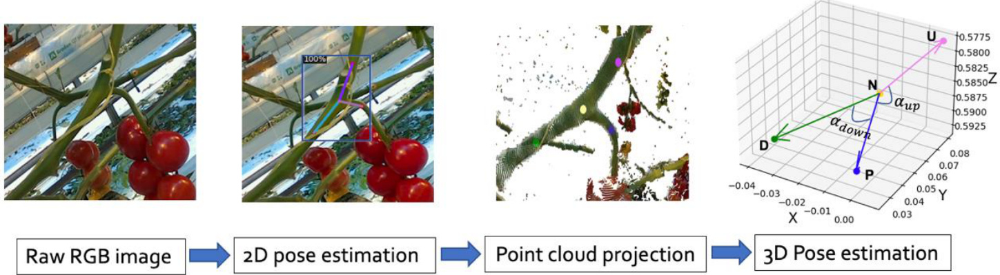
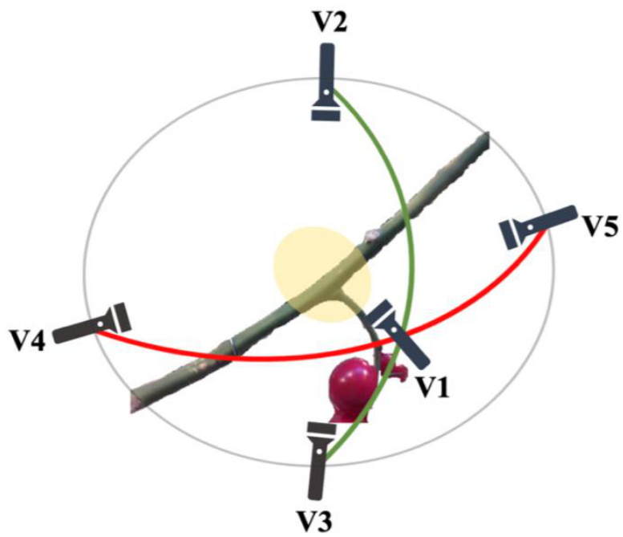
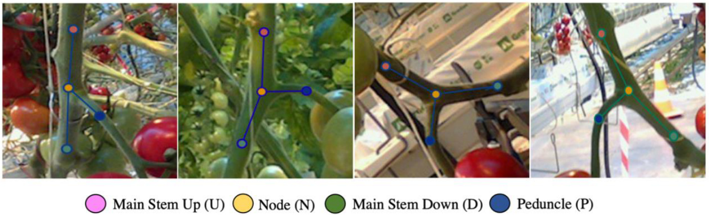
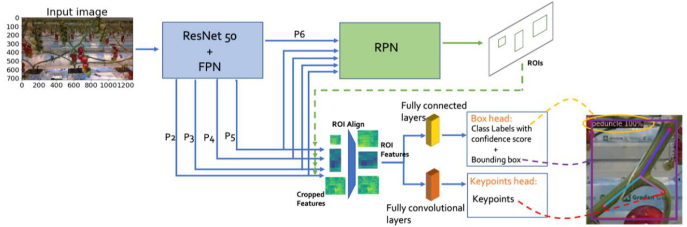
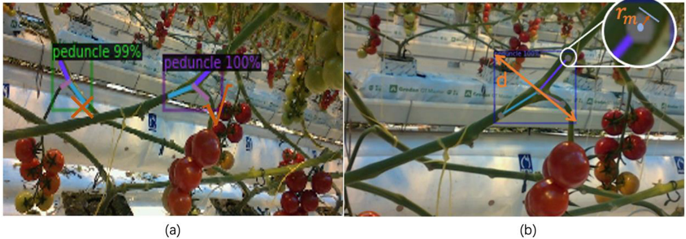
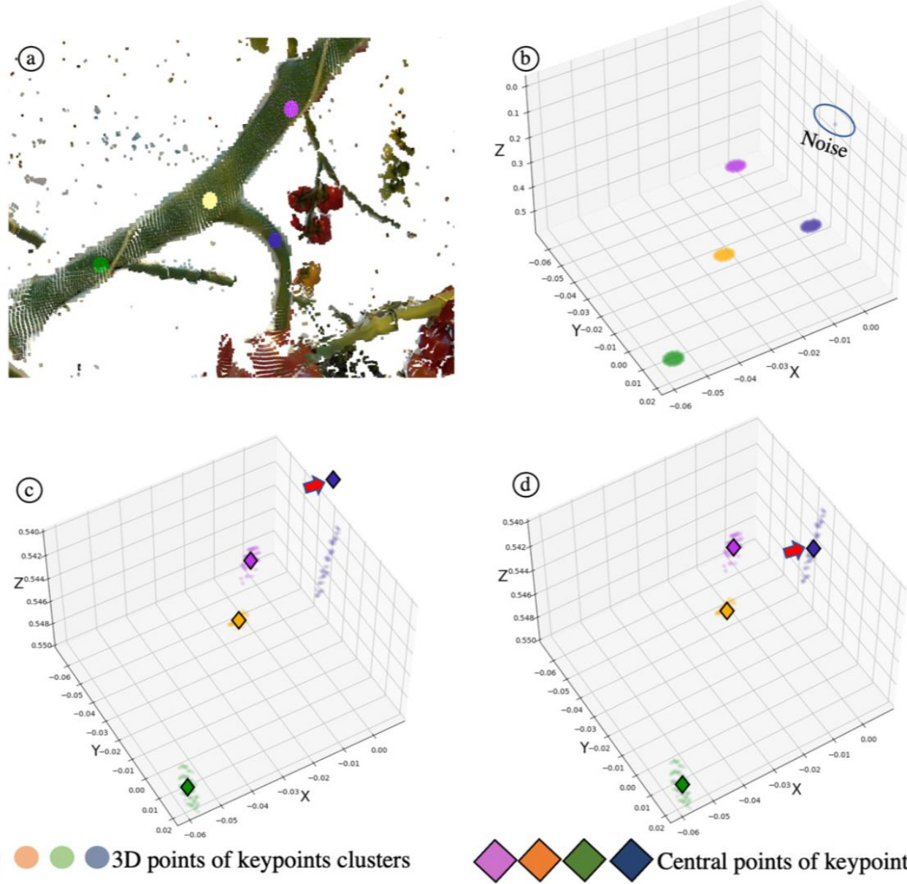
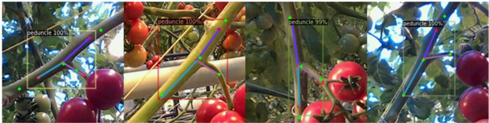
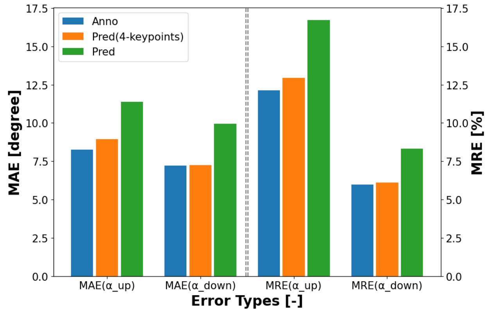

# 3D Pose Estimation of Tomato Peduncle Nodes using Deep Keypoint Detection and Point Cloud

# 基于深度关键点检测和点云的番茄花梗节点3D姿态估计

Jianchao ${ \mathsf { C i } } ^ { \mathsf { a } , \ast }$ , Xin Wanga, David Rapado-Rincóna, Akshay K. Burusaa, Gert Kootstraa  

a农业生物系统工程组，植物科学系，瓦赫宁根大学与研究中心，P.O. Box 16，瓦赫宁根，6700AA，荷兰

# 摘要

发达国家温室果蔬生产面临劳动力短缺和成本高昂的挑战。机器人为可持续和高效生产提供了良好解决方案。获取植物相关部位的准确空间信息对机器人成功操作至关重要。由于植物外观、视角和光照的变化，温室中的机器人感知具有挑战性。本文提出了一种基于关键点检测的方法，利用RGB-D相机数据估计花梗节点的3D姿态，为番茄串的采摘提供关键信息。

具体而言，本文提出了一种方法，在彩色图像中检测四个解剖标志点，然后整合3D点云信息确定3D姿态。在商业温室中进行了全面评估，以深入了解方法各部分的性能。结果显示：(1) 目标检测准确率高，平均精度(AP)达到$\mathsf { A P @ 0 . 5 = 0 . 9 6 }$；(2) 关键点的平均检测关节百分比(PDJ)为$\mathsf { P h D J @ 0 . 2 = 9 4 . 3 1 \% }$；(3) 3D姿态估计精度方面，花梗与主茎之间相对上下角的平均绝对误差(MAE)分别为$\yen 12389$和$9 . 9 3 ^ { \circ }$。此外，研究了方法处理视角变化的能力，证明该方法对视角变化具有鲁棒性。然而，正视图和较高视角相比其他视角略具优势。虽然以番茄为例，但该方法也适用于辣椒等其他温室作物。

关键词：深度学习，花梗，关键点检测，点云，Detectron2，姿态估计

# 1. 引言

温室种植蔬菜可以显著延长植物的生产周期，提高产量，为温室所有者带来经济效益。大多数温室作物，如番茄、黄瓜和甜椒，都需要选择性维护和采摘，使得生产活动劳动密集。由于劳动力成本高且稀缺，这对生产构成了巨大挑战(Benavides等，2020)。更高水平的自动化和机器人化被视为替代温室生产中人工劳动的良好解决方案，许多研究提出了更有效地将机器人应用于温室操作，如采摘(Bac等，2014；Ji等，2012；Yoshida等，2018)、监测(Halstead等，2018)和表型分析(Boogaard等，2020；Virlet等，2016；Vit等，2020)。

大多数温室操作要求机器人感知系统检测植物的相关部位(如果实、花梗和主茎)，并收集足够的信息以执行操作，如采摘、去叶和修剪。感知过程受到植物外观变化和遮挡的不利影响，这些在复杂的温室环境中显著存在(Afonso等，2019；Kootstra等，2021)。变化源于植物生长的自然差异，导致植物部位的形态和外观不同，以及环境因素，如光照变化。在杂乱的温室环境中，植物部位经常被其他部位完全或部分遮挡，遮挡频繁发生。

为了克服变化带来的挑战并提高感知性能，近年来，基于深度学习的视觉系统在农业场景中得到了广泛应用。与使用手工特征的传统方法相比，深度学习方法将特征提取作为端到端学习过程的一部分，在准确性和对变化的鲁棒性方面表现更好。Kamilaris和PrenafetaBoldú(2018)回顾了40项在农业应用中使用深度学习的研究，得出结论：深度神经网络优于其他方法。例如，Bargoti和Underwood(2017)使用深度神经网络对果园中的几种不同水果进行目标检测，包括芒果、苹果和杏仁，而Sa等(2016)在温室环境中使用类似方法成功检测了七种不同水果类型。Boogaard等(2020)使用深度目标检测来检测黄瓜植物的叶和果节点。Santos等(2020)在果园中使用深度神经网络进行葡萄串的实例分割。Shi等(2019)使用相同方法将番茄幼苗图像分割为茎、节点和单个叶片。Kang和Chen(2020)提出了一种新的苹果实例分割网络。这些检测算法能够在2D图像中定位不同的植物部位。然而，要执行机器人操作，需要关于物体位置和方向的3D信息，以便机器人将工具带到所需的位置和方向。

通常，物体的3D姿态由物体的3D位置和3D方向定义。例如，在(Eizentals & Oka, 2016; Lehnert等，2016)中用于表示甜椒的姿态。在这两项研究中，通过将3D模板拟合到获取的水果部分点云来估计水果的姿态。Li等(2018)通过找到对称轴来估计甜椒的姿态。Wagner等(2022)提出了一种深度神经网络，直接从彩色和深度(RGB-D)图像中估计草莓的3D姿态。Kang等(2020)提出了一种基于点的神经网络，直接从水果的点云中学习估计抓取姿态。

在动物领域，使用了不同的物体姿态定义。在那里，受人体姿态检测器启发的计算机视觉方法通过一组关键点来估计动物的姿态，这些关键点代表动物上的解剖标志(例如，(X. Li等，2019；Mathis等，2020；Pereira等，2019；Russello等，2022)。姿态提供了这些关键点的位置信息，以及关键点之间的关系。这种表示的优点是它可以用于铰接物体，并且对遮挡更鲁棒，因为未遮挡的关键点仍然可以被检测到以表示物体姿态。这使得它对植物部位的姿态估计很有吸引力，但迄今为止几乎没有被探索，除了Zhang等(2022)使用关键点检测结合堆叠沙漏和物体检测网络来获取番茄串的姿态。该方法在番茄、花梗和茎上定位了一组2D关键点，然后使用深度相机提供的空间信息将其转换为3D关键点。然而，3D姿态估计的准确性没有定量评估，因此尚不清楚该方法是否可以用于机器人操作。

本研究重点研究番茄植物花梗节点的3D姿态估计，为果实采摘提供信息。花梗连接果实与主茎。为了避免果实损伤并延长保质期，番茄串通常通过切割花梗从植物上分离。其他一些研究试图通过检测其他植物部位(如果实和枝条)来检测和定位花梗，然后根据它们之间的特定形态关系确定花梗(Sa等，2017；Yoshida等，2020)。这些方法的缺点是它们对花梗的姿态做出了假设。例如，一些应用假设花梗位于果实顶部，要求果簇向下且垂直(Liang等，2020；Luo等，2016)。这限制了应用，因为番茄花梗可以朝向任何方向。在(Boogaard等，2020)中，黄瓜植物的节点通过深度神经网络(DNN)直接在图像中检测，没有对与其他植物部位关系的假设，然而，他们的工作只检测了节点的位置，而不是机器人操作所需的完整姿态。在(Rong等，2022)中，使用DNN实例分割方法预测番茄花梗的图像掩码，然后使用手工算法确定3D切割位置。Kim等(2023)成功利用端到端方法检测番茄温室中拍摄的图像上的关键点，但他们的工作仅限于预测连接单个番茄与果梗的2D姿态。在我们的工作中，我们结合了端到端姿态检测网络的优点和包含3D信息的优点，估计花梗的完整3D姿态，实现机器人操作。

在本文中，我们提出了一种基于关键点检测的方法，利用RGB-D相机数据估计番茄植物花梗节点的3D姿态。3D姿态由四个点定义：节点、花梗上的一个点以及主茎上下各一个点。如图1所示，该方法基于三个步骤构建：(1) 使用深度关键点检测器在2D图像中鲁棒地检测花梗节点及其姿态，(2) 将检测到的关键点投影到对齐的3D点云上，(3) 估计3D姿态。该方法在三个方面进行了全面评估：节点检测、关键点检测以及与地面实况测量相比的3D姿态准确性。前两项分析在图像层面进行，而最后一项分析在世界坐标系中评估3D姿态估计与手动测量的对比。由于花梗节点检测的成功可能取决于视角，我们分析了不同相机姿态相对于目标物体的结果。

  

图1. 三个阶段：关键点检测、3D点云投影和3D姿态估计。

# 2. 材料与方法

# 2.1 材料

# 2.1.1 相机设置与数据集采集

数据采集于荷兰Beek en Donk的一个商业化番茄温室。该温室配备了全自动气候控制系统，包括温度、湿度和光照控制。番茄植株采用高线栽培模式，主茎沿导线垂直生长。本研究所用番茄品种为'Tasty Tom'，每个果穗约有8个果实，成熟时花梗直径约为7mm。采用了标准的管理操作，包括去除成熟果穗周围的低位叶片。

使用RealSense L515 LiDAR相机采集RGB图像和对齐的点云数据，分辨率均为$1280 \times 720$。相机连接至配备Intel i7 10750H CPU和Nvidia GeForce RTX-2070s GPU的Alienware M15 R3笔记本电脑，运行Windows 10系统，使用Pyrealsense2包进行图像采集。数据采集在环境光下进行，相机手持距离花梗节点50cm-80cm，通常将节点置于图像中心。除了目标节点外，每张图像的背景中还包含大量其他植株的花梗节点。数据采集时间为10月至12月，即种植后的第6、10和11周。

数据集包含648张RGB图像，其中503张用于模型训练，145张用于测试（表1）。训练集包含614个标注的花梗节点，每张图像有1-3个节点；测试集包含145个标注的花梗节点，每张图像有1个节点。除了花梗节点外，图像中还可见叶节点（叶柄节点），检测算法需要忽略这些节点，仅检测花梗节点。

表1. 数据集的组成

| 数据集 | RGB图像总数 | 节点总数 | 对齐点云 |
|--------|-------------|----------|----------|
| 训练集 | 503         | 614 (每张图像1-3个) | 否       |
| 测试集 | 145         | 145      | 是       |

测试集中包含95张图像的子集，来自19个节点的5个不同视角，用于分析花梗在图像中不同姿态的检测性能。这些视角命名为V1（标准视角）、V2（高视角）、V3（低视角）、V4（左视角）和V5（右视角），均指向花梗节点（见图2）。V2-V5的位置大致确定，与垂直方向的角度约为$60^{\circ} \pm 15^{\circ}$。

  
图2. 5个视角的分布：V1代表标准视角，V2代表较高视角，V3代表较低视角，V4代表左侧视角，V5代表右侧视角。所有视角都指向花梗节点。

# 2.1.2 二维真实标注

RGB图像使用COCO annotator进行标注，这是一个开源的基于web的图像标注工具，用于目标检测、分割和关键点检测(Brooks, 2019)。如图3所示，标注了四个关键点来表示花梗节点的姿态，其中三个点'U'、'N'和'D'分别设置在主茎的上部、节点和下部位置，一个点P设置在花梗开始弯曲的位置。只标注了可见的关键点。需要注意的是，由于缺乏可见特征，点U和D的位置是根据与点N的欧几里得距离80像素确定的。这个距离是任意确定的，没有考虑从相机镜头到物体的距离。

  
图3. 标注图像示例。标注了四个关键点来表示花梗节点的姿态。3个点'U'、'N'和'D'设置在主茎的上部、节点和下部位置，1个点P设置在花梗上。

# 2.1.3 三维真实测量

为了评估姿态估计方法，我们手动测量了花梗与主茎之间的真实角度。如图1所示，花梗与主茎之间的上角度定义为$\alpha_{up}$，计算公式为$\alpha_{up} = \angle(\overrightarrow{NP}, \overrightarrow{NU})$，而下角度定义为$\alpha_{down}$，计算公式为$\alpha_{down} = \angle(\overrightarrow{NP}, \overrightarrow{ND})$。三个人用量角器测量角度，并使用平均值。所有节点测量的观察者间标准差范围在$\alpha_{up}$为$1.73^\circ - 7.64^\circ$，$\alpha_{down}$为$0^\circ - 8.66^\circ$之间。

# 2.2 花梗节点姿态估计

# 2.2.1 概述

如图1所示，姿态估计系统设计为三个阶段：1) 2D姿态估计，2) 点云投影，和3) 3D姿态估计。系统以2D彩色图像和对齐的点云作为输入，估计花梗节点的3D姿态作为输出。第一阶段使用深度关键点检测器在彩色图像中定位4个预定义的关键点$(U, N, D, P)$。在第二阶段，将2D关键点投影到点云上，将其转换为3D笛卡尔空间。最后，在第三阶段估计3D姿态。下一小节将提供这三个阶段的更多细节。

# 2.2.2 二维姿态估计

# Keypoints R-CNN架构

本研究采用Keypoints R-CNN网络(He等，2017)，基于Detectron2实现(Wu等，2019)，在彩色图像上进行姿态估计。Keypoint R-CNN以相机图像作为输入，预测每个花梗节点的边界框，包括图像中四个关键点的位置。如图4所示，该网络由两个阶段组成。在第一阶段，使用ResNet50-FPN(50层残差网络(He等，2016)结合特征金字塔网络(Lin等，2017))作为骨干网络，从输入图像中提取和融合特征。这些特征图随后由区域建议网络(RPN)(Ren等，2015)处理，生成大量可能包含目标对象的感兴趣区域(ROI)。在第二阶段，使用ROI建议裁剪特征图，随后由两个独立的全连接(FC)网络处理：(1)目标检测网络预测对象的边界框，以及类别标签和置信度分数；(2)关键点检测网络预测检测对象的关键点位置。该模型原本还有一个用于实例分割的分支来预测对象掩码，但由于在本研究中未使用而被移除。

  
图4. Keypoints-RCNN算法的结构。使用ResNet50-FPN提取特征，RPN利用特征图生成ROI建议。裁剪后的ROI特征被送入两个分支，以预测类别标签、边界框和关键点。

# 网络训练

该模型在配备Nvidia-GPU RTX-3090和Intel-CPU i9-10920X的PC上训练，运行Linux Ubuntu 18.04系统，使用2.1.1节描述的503张图像训练集。为了加快训练过程，采用了迁移学习，使用在COCO数据集(Lin等，2014)上预训练的网络，并在我们的训练集上进行微调。训练过程包括30,000次迭代，批量大小为8，大约相当于477个epoch。使用随机梯度下降(SGD)优化器，学习率为0.005，衰减率为0.1，以优化网络权重和偏置，减少损失。在训练过程中，如果锚点具有最高的交并比(IoU)或IoU大于0.7，则被认为是正样本，而IoU小于0.3的锚点被认为是负样本。为了减少对同一真实标注的重复检测，非极大值抑制(NMS)设置为0.7。在训练过程中，采用了数据增强方法来提高模型的鲁棒性，包括亮度随机因子0.8-1.5、对比度随机因子0.6-1.3、饱和度随机因子0.8-1.4、通过添加颜色抖动进行光照增强，随机度从标准差为0.7的正态分布中采样，以及水平翻转概率为$50\%$。移除了默认的32和512锚点大小，因为我们图像中的花梗节点通常高度约为200像素，宽度约为140像素。

# 花梗节点检测

训练好的关键点检测器能够定位视野中的花梗节点及其相关关键点。然而，在实际应用中，采摘机器人一次只能采摘一个番茄串。因此，当检测到多个节点时，根据检测对应的置信度值确定最佳候选(图5a)。

  
图5. 在图(a)中，将置信度值最高的检测结果确定为最终目标。在图(b)中，将选定目标的预测关键点扩展为圆形掩码，以包含更多像素投影到点云中。

# 2.2.3 三维姿态估计

# 二维关键点扩展

在检测到花梗节点后，使用对齐点云的空间信息将其关键点投影到三维空间。然而，采集的点云通常比较稀疏，仅投影四个关键点可能会由于点云中缺少对应点而失败。为了解决这个问题，使用圆形掩码扩展二维关键点以包含更多像素，并将掩码内的所有像素投影到点云中（图6a-b）。为了避免从背景中分割出额外的像素，使用公式(1)确定圆形掩码的半径$r_{m}$，其中$d$是预测边界框的对角线长度，𝑤在我们的实验中设置为0.03。这确保了圆形掩码的比例始终相对于花梗节点的大小确定。

$$
r_{m} = w \cdot d \quad [像素]
$$

# 点云投影

相机捕获的彩色图像和深度图像已对齐。使用深度数据，为所有具有有效深度数据的像素$p_{i}$确定三维坐标$X_{i}, Y_{i}, Z_{i}$。因此，图像坐标$p_{i} = \{x_{i}, y_{i}\}$与三维坐标之间的关系是已知的。图6a展示了一个点云示例，其中彩色图像中关键点掩码内的像素被投影到点云中。然而，从图6b-c可以看出，原始点簇受到背景中离群点的影响。这导致一些簇的质心发生偏移，见图6c中的示例。离群点将在下一步中去除。

  
图6. 从二维关键点到三维姿态。a) 显示彩色图像中带掩码的关键点投影到三维点云中，每个关键点用不同颜色标记。b) 显示属于关键点簇的三维点，包含离群点。c) 是b)的放大图，每个噪声簇的质心用菱形标记。d) 显示去除离群点后四个簇的质心。

# 离群点去除

离群点是根据周围点的密度确定的。使用公式(2)判断一个点是否为离群点。对于每个点$i$，计算在半径$r_{f}$的三维球体内的邻居数量。如果邻居数量少于最小要求数量$n_{min}$，则该点被视为离群点并被去除。设$n_{p}$为总点数，$d_{ij}$为相邻点$j$到点$i$的距离。当$d_{ij} < r_{f}$时，函数$\rho$等于1，否则等于0。在实验中，我们使用半径$r_{f} = 0.005 [m]$和阈值$n_{min} = 10$。这些值是通过简单的预实验和手动检查去噪结果确定的。

$$
离群点_{i} = \left\{ \begin{array}{c} {1, \displaystyle \sum_{j=1}^{n_{p}} \rho \left(d_{ij} < r_{f}\right) < n_{min}} \\ {0, \displaystyle \qquad \mathrm{否则}} \end{array} \right.
$$

# 2.3 评估

使用包含145张RGB-D图像的测试集从三个角度评估算法性能：1) 目标检测，2) 关键点检测，和3) 姿态估计。在评估1)和2)中，仅使用RGB图像，在评估3)中，使用深度图像生成的对齐点云。测试阶段算法的大部分参数与训练阶段相同，除了每张图像最大检测数参数被修改为1，对应于置信度最高的检测。换句话说，评估是针对图像中最显著的花梗节点进行的。

# 2.3.1 目标检测评估

本实验的目的是评估算法检测花梗节点的性能。使用目标检测中常用的指标平均精度（AP）和F1分数来评估性能。为了判断检测是否正确，使用交并比（IoU）标准计算预测边界框$(B_{p})$与真实边界框$(B_{gt})$之间的相似度。它是通过将两个边界框的交集面积除以它们的并集面积来计算的：

$$
IoU(B_{P}, B_{gt}) = \frac{area \big(B_{p} \cap B_{gt}\big)}{area \big(B_{p} \cup B_{gt}\big)} \quad [-]
$$

IoU范围从0到1，值越高表示匹配越好。根据计算的IoU，确定检测是真阳性（TP）还是假阳性（FP），以及是否存在假阴性（FN）。具体来说，如果$IoU(B_{P}, B_{gt}) > \theta$，其中$\theta$是预定义的阈值，则预测为TP。如果$IoU(Bp, Bgt) \leq \theta$或标注对象已被另一个具有更高IoU值的预测检测到，则检测为FP。如果未检测到标注对象，即与所有预测的IoU都低于$\theta$，则为FN。根据TP、FP和FN的数量，可以计算$\theta$下的精度和召回率。精度值表示在所有检测中正确检测的比例，而召回率反映了正确检测的目标比例。

$$
精度^{\theta} = \frac{TP^{\theta}}{TP^{\theta} + FP^{\theta}} \quad [-]
$$

$$
召回率^{\theta} = \frac{TP^{\theta}}{TP^{\theta} + FN^{\theta}} \quad [-]
$$

根据精度和召回率的值，可以计算AP和F1分数。根据公式(6)，AP被确定为插值精度-召回率曲线下的面积，其中$R_{1}, R_{2}, ..., R_{n}$是召回率水平，插值精度$P_{interp}(R)$是在任何召回率水平$\geq R$下找到的最大精度。F1分数可以使用公式(7)计算，它计算精度和召回率的调和平均值，为性能提供更直观的评估。两项评估都使用了三个IoU阈值$\theta$：0.5、0.75和0.5:0.95。

$$
AP@\theta = \sum_{i=1}^{n} \bigl(R_{i}^{\theta} - R_{i-1}^{\theta}\bigr) P_{interp}^{\theta} \quad [-]
$$

$$
F1分数@\theta = 2 \cdot {\frac{精度^{\theta} \cdot 召回率^{\theta}}{精度^{\theta} + 召回率^{\theta}}} \quad [-]
$$

# 2.3.2 关键点检测评估

本实验旨在评估关键点检测器在检测花梗节点预定义关键点方面的性能。每个节点预期检测到四个关键点。使用检测关节百分比（PDJ）指标评估检测性能，该指标在一些研究中也称为正确关键点百分比（PCKh）（Andriluka等，2014；X. Li等，2019；Russello等，2022）。使用公式(8)计算PDJ。如果预测关键点与真实关键点之间的欧几里得距离$(d_{i})$小于预测边界框对角线$d$的某个分数$f$，则认为该关键点被正确检测到。考虑对象对角线允许该方法处理任意大小的节点。术语$n$表示节点上的关键点数量。当$x \leq 0$时，$\sigma(x) = 1$，否则$\scriptstyle = 0$。

$$
PDJ@f = \frac{1}{n} \sum_{i=1}^{n} \sigma(d_{i} - f * d) [\%]
$$

在本分析中，计算了三个分数$f \colon 0.05, \ 0.1,$和0.2的PDJ值。$f_{i}$值越小，预测点需要越接近真实关键点才能被认为是正确的。分析从两个角度进行：(1) 检测角度和(2) 关键点角度。检测角度评估计算了达到不同PDJ值的检测数量。如果所有4个关键点都被正确检测到，则检测的PDJ为1，如果没有任何关键点被正确检测到，则为0。关键点角度评估计算每种关键点类型的成功率，比率越高表示成功检测率越高。

# 2.3.3 姿态估计评估

使用第2.2.3节生成的3D关键点，估计了花梗节点的3D姿态。3D姿态被定义为包括节点位置、方向和相对角度。然而，测量完整的真实值具有挑战性，因此仅评估了相对角度$\alpha_{up}$和$\alpha_{down}$。角度使用公式(9)计算：

$$
\begin{array} { r } { \alpha = arccos \frac { \overrightarrow { A } \cdot \overrightarrow { B } } { \overrightarrow { | A | } \cdot \overrightarrow { | B | } } } \end{array}
$$

对于3D空间中的任意两个给定向量$\xrightarrow [ A ] { }$和$\xrightarrow [ { B } ] { }$，它们的夹角$\alpha$等于它们的点积除以它们的模长。对于4个关键点$\mathsf { U } ^ { \prime } , \mathsf { N } ^ { \prime } , \mathsf { \Omega } ^ { \prime } \mathsf { D } ^ { \prime } ,$和$\cdot _ { P ^ { \prime } }$，$\alpha_{up}$使用向量$\overrightarrow { N U }$和$\overrightarrow { N P }$计算，而$\alpha_{down}$则使用$\overrightarrow { N D }$和$\overrightarrow { N P }$计算。

我们考虑了估计角度的两个主要误差来源：(1) 2D姿态估计，由关键点定位错误引起，(2) 3D姿态估计，包括3D关键点投影、噪声过滤和姿态估计。我们没有考虑传感器能力限制导致的误差，例如深度测量不足导致生成的点云质量差，因为这些不会反映算法的性能。在去除3D信息未充分捕获的数据后，剩下134个测试样本用于分析。

为了更深入地了解误差来源，我们评估了三种预测角度的准确性：(1) ${ \hat { \alpha } } ^ { \mathbf { a n n o } }$是基于标注关键点的预测角度，假设关键点检测完美，反映3D计算引起的误差，(2) $\hat { \alpha } ^ { \mathrm { k p } }$是基于预测关键点的预测角度，包括关键点检测和3D计算的误差，以及(3) $\hat { \alpha } ^ { 4 \mathrm { k p } }$表示仅当所有4个关键点都被正确检测时的预测角度，反映我们方法能达到的最佳性能。作为对比，$\alpha$表示在温室中手动测量的真实角度。

使用两个评估指标，平均绝对误差（MAE）和平均相对误差（MRE）来评估估计角度的准确性。MAE计算为预测角度$\hat { \alpha } _ { t }$与真实角度$\alpha _ { t }$之间的绝对误差的平均值，如公式(10)所示。MRE计算为将绝对误差除以相应真实角度得到的相对误差的平均值，如公式(11)所示。其中，𝑇表示检测总数。

$$
\mathrm { M A E } = \frac { 1 } { T } \sum _ { i = 0 } ^ { t } \left| \hat { \alpha } _ { \mathrm { t } } - \alpha _ { \mathrm { t } } \right|
$$

$$
M R E = \frac { 1 } { T } \sum _ { i = 0 } ^ { t } \frac { | \hat { \alpha } _ { \mathrm { t } } - \alpha _ { \mathrm { t } } | } { \alpha _ { \mathrm { t } } } \quad [ \% ]
$$

# 3. 结果

目标检测、关键点检测和3D角度估计的评估结果分别在第3.1节、第3.2节和第3.3节中展示。

# 3.1. 节点检测

表2展示了不同IoU阈值（0.5、0.75和0.5:0.95）下的整体AP和F1分数。该方法在IoU0.5上取得了出色的结果，$\mathsf { A P @ 0 . 5 = 0 . 9 6 }$，F1分数$\scriptstyle { \ @ 0 . 5 = 0 . 9 8 }$，表明模型在相对宽松的交并比标准下能够成功检测到大多数花梗。然而，对于更严格的阈值（IoU0.75），这两个指标都显著下降，表明完整花梗的边界框预测不够准确，与真实边界框存在偏差。需要注意的是，我们定义的花梗节点很难用边界框很好地表示，因此边界框预测的准确性不高并不意外。我们不使用边界框预测进行后续操作，而是使用下一小节讨论的关键点检测。

表2. $A P$和F1分数的整体结果。

| 指标 | IoU0.5 | IoU0.75 | IoU0.5:0.95 |
|------|--------|---------|-------------|
| AP   | 0.96   | 0.37    | 0.45        |
| F1分数 | 0.98   | 0.53    | 0.54        |

根据表3，该算法从所有5个视角都准确检测到了节点，所有视角的$\mathsf { A P @ 0 . 5 }$均大于0.91，F1分数@0.5均大于0.95，其中三个视角达到了1.0。这表明该算法能够处理不同视角带来的变化。具体而言，视角1、2和3实现了完美的节点检测，而视角4和5的准确率较低。这可能是由于侧视图会引入更多的花梗节点形状变化，使得算法更难准确检测。当观察IoU0.75和IoU0.5:0.95阈值下的两个指标时，我们看到了更大的差异。视角2在所有指标中表现出最高值，表明顶视图是诸如采摘等任务的最佳视角。视角3表现出显著较低的值。一个可能的原因是光照对图像的影响，因为这个视角更容易受到光照变化的影响，从而影响了算法准确检测花梗节点边界框的能力。

表3. 不同视角下获得的AP和F1分数。

| 视角 | AP | | | F1分数 | | |
|------|--------|---------|-------------|--------|---------|-------------|
| | IoU0.5 | IoU0.75 | IoU0.5:0.95 | IoU0.5 | IoU0.75 | IoU0.5:0.95 |
| 视角1 | 1.0 | 0.33 | 0.48 | 1.00 | 0.47 | 0.54 |
| 视角2 | 1.0 | 0.86 | 0.67 | 1.00 | 0.89 | 0.71 |
| 视角3 | 1.0 | 0.08 | 0.30 | 1.00 | 0.16 | 0.37 |
| 视角4 | 0.94 | 0.47 | 0.46 | 0.95 | 0.58 | 0.52 |
| 视角5 | 0.91 | 0.17 | 0.35 | 0.95 | 0.21 | 0.38 |

# 3.2. 关键点检测

关键点检测的评估在三个分数$(f)$0.05、0.1和0.2下进行。表4展示了达到不同PDJ值的检测比例，PDJ值越高表示检测到的关键点越准确。$\mathsf{PDJ@0.2}$和$\mathsf{PDJ@0.1}$显示出相似的分布，大多数检测达到了$100\%$的PDJ值（$\mathsf{PDJ@0.2}$为$85.52\%$，$\mathsf{PDJ@0.1}$为$46.90\%$），而达到PDJ值小于$50\%$的检测比例最小（$\mathsf{PDJ@0.2}$为$2.07\%$，$\mathsf{PDJ@0.1}$为$6.12\%$）。相比之下，对于$\mathsf{PDJ@0.05}$，只有$13.10\%$的检测达到了$\mathsf{PDJ}=100\%$，而大量检测（$31.03\%$）的PDJ值小于$50\%$。当$f$从0.2减小到0.05时，比例的显著变化是因为较小的分数$f$要求检测到的关键点更接近真实值才能被认为是正确的，这导致在$f=0.2$下被认为是正确的大多数关键点，在更严格的标准下（$f=0.05$）被认为是失败的。

$\mathsf{PDJ@0.2}$和$\mathsf{PDJ@0.1}$的结果表明了模型的可行性，它基本上将关键点定位在了正确的位置。但一些检测在特定关键点或场景下不够准确，无法满足更严格的标准。为了调查误差来源，我们通过计算每个单独关键点的PDJ进行了进一步分析。

表4. 在三个分数0.05、0.1和0.02下分别统计达到不同PDJ值的图像数量。

| PDJs | <50% | 50% (2/4) | 75% (3/4) | 100% (4/4) |
|------|------|-----------|-----------|------------|
| PDJ@0.05 | 31.03%(45) | 37.35%(44) | 25.52%(37) | 13.10%(19) |
| PDJ@0.1 | 6.21%(9) | 23.45%(34) | 23.45%(34) | 46.90%(68) |
| PDJ@0.2 | 2.07%(3) | 2.07%(3) | 10.34%(15) | 85.52%(124) |

如表5所示，4个关键点$\because v ^ { \prime }$、$\mathcal { N } _ { \prime } ^ { \prime } \mathcal { D } ^ { \prime }$和$\cdot _ { P ^ { \prime } }$的$\mathsf { P D J @ 0 . 2 }$分别达到了$9 1 . 0 3 \%$、$9 7 . 9 3 \%$、$9 1 . 7 2 \%$和$9 6 . 5 5 \%$，表明该模型能够准确定位关键点，所有关键点的成功率均超过$9 0 \%$。当$f$从0.2降低到0.05时，相应的PDJ值分别下降了$60 \%$、$8 . 9 6 \%$、$5 7 . 9 3 \%$和$3 5 . 1 7 \%$。关键点$\because N ^ { \prime }$的轻微下降表明它能够始终接近真实值定位，因此即使在更严格的标准下，其结果也没有受到太大影响。相比之下，关键点$\because v ^ { \prime }$和$\therefore \mathsf { D } ^ { \prime }$在$\mathsf { P D J @ 0 . 0 5 }$下的显著下降表明这两个关键点通常与真实值偏差较大，因此当$f$降低到0.05时不再被认为是正确的。关键点$\because N ^ { \prime }$在所有三个分数中都达到了最高的PDJ，意味着检测最准确，而关键点$\because v ^ { \prime }$和$\therefore \mathsf { D } ^ { \prime }$的成功率明显较低，当$f$降低时，它们与关键点$\cdot _ { \mathsf { N } ^ { \prime } }$的差距变得更大。

如第2.1.2节所述，关键点$\because N ^ { \prime }$和$\cdot _ { P ^ { \prime } }$是基于独特的视觉特征确定的（$\because N ^ { \prime }$连接花梗和主茎；$\cdot _ { P ^ { \prime } }$通常弯曲），而关键点$\because v ^ { \prime }$和$\ " \mathsf { D } ^ { \prime }$是基于欧几里得距离标注的。根据结果，我们得出结论，与距离特征相比，视觉特征更有利于模型学习和识别。

表5. 在0.05、0.1和0.2三个分数下，145张测试集中不同关键点的PDJ。

| PDJs | U | N | D | P |
|------|---|---|---|---|
| PDJ@0.05 | 31.03% | 88.97% | 33.79% | 61.38% |
| PDJ@0.1 | 57.93% | 97.93% | 60.69% | 92.41% |
| PDJ@0.2 | 91.03% | 97.93% | 91.72% | 96.55% |

图7展示了一些关键点$\because v ^ { \prime }$或$\because \mathsf { D } ^ { \prime }$由于与真实值偏差较大而被认为定位错误的样本。然而，所有这些定位都被发现正确地分配到了相应的植物部位。基于此，我们认为如果系统被要求准确定位不同的地标，而不一定需要接近真实值，结果可以进一步改善。

  
图7. 一些检测由于与真实值偏差较大而未能准确定位关键点'U'和'D'。绿色方块代表真实值关键点。

表6展示了不同视角下的关键点检测结果，所有视角的平均PDJ$@0.2$均超过0.89，其中两个视角达到0.97以上。视角1和视角2优于其他视角，使其成为实际应用中关键点检测的理想选择。在所有视角中，关键点'N'和$" \mathsf { P } ^ { \prime }$的PDJ值始终显著高于'U'和'D'。值得注意的是，视角5中'P'的PDJ较低。这是因为在我们的温室环境中，花梗倾向于朝同一方向生长，大致是视角5的方向，导致显著的形状变化，增加了关键点检测的难度。$" \mathsf { P } ^ { \prime }$检测精度的降低会很大程度上影响角度估计，因为其精确的3D位置对于估计两个角度$a _ { u p }$和$a _ { d o w n }$至关重要。

表6. 算法在分数等于0.2时不同视角下获得的PDJ。

| 视角 | U | N D | P |  | 平均值 |
|------|----|------|----|----|--------|
| 视角1 | 1.00 | 1.00 | 0.95 | 1.00 | 0.99 |
| 视角2 | 0.95 | 1.00 | 0.95 | 1.00 | 0.97 |
| 视角3 | 0.74 | 1.00 | 0.95 | 1.00 | 0.92 |
| 视角4 | 0.89 | 0.95 | 0.79 | 0.95 | 0.89 |
| 视角5 | 0.95 | 0.95 | 0.89 | 0.89 | 0.92 |
| 平均值 | 0.91 | 0.98 | 0.91 | 0.97 |  |

# 3.3. 三维姿态估计

根据图8所示的结果，${ \hat { a } } ^ { a n n o }$ 在 $\alpha _ { u p }$ 和 $\alpha _ { d o w n }$ 上的平均绝对误差（MAE）分别为 $8 . 2 5 ^ { \circ }$ 和 $7 . 2 1 ^ { \circ }$，相对误差（MRE）分别为 $1 2 . 1 2 \%$ 和 $5 . 9 9 \%$。这些误差主要来自三维姿态估计，表明即使所有关键点都准确定位，仍然可能出现误差。这些误差代表了算法能达到的最小误差水平。$\hat { a } ^ { k p }$ 包含了二维和三维姿态估计的误差，其MAE分别为 $1 1 . 3 8 ^ { \circ }$ 和 $9 . 9 3 ^ { \circ }$，MRE分别为 $1 6 . 6 8 \%$ 和 $8 . 2 9 \%$。$\hat { a } ^ { k p }$ 的较大误差表明，相当一部分误差来自二维姿态估计。因此，在评估 $\hat { a } ^ { 4 k p }$ 时，误差降低到了与 ${ \hat { a } } ^ { a n n o }$ 相似的水平。$\hat { a } ^ { 4 k p }$ 的误差略大于 ${ \hat { a } } ^ { a n n o }$，这是因为预测的关键点与标注的关键点通常存在偏差，这些微小偏差可能导致误差。

与 $\alpha _ { d o w n }$ 相比，$\alpha _ { u p }$ 的MAE略大，但MRE明显更大。这是因为 $\alpha _ { u p }$ 的实际角度通常较小，因此当MAE与 $\alpha _ { d o w n }$ 相当时，MRE会被放大。

需要注意的是，在评估 $\hat { a } ^ { k p }$ 时，并非所有134个检测都被考虑，因为存在 $\alpha _ { u p }$ 或 $\alpha _ { d o w n }$ 无法计算的情况。例如，由于关键点检测错误而定位在背景上的关键点通常缺乏三维信息，这可能导致角度无法计算。在此评估中，仅有一个案例因此被排除，所以总共包含了133/134个案例。对于 $\hat { a } ^ { 4 k p }$，使用了115个检测。

  
图8. 三种角度在MAE和MRE上的评估结果。'Anno'表示 ${ \hat { a } } ^ { a n n o }$ 包含的误差，'Pred'表示 $\hat { a } ^ { k p }$ 包含的误差，而'Pred(4- keypoints)'表示仅当在 $f { = } 0 . 2$ 下正确检测到4个关键点时 $\hat { a } ^ { 4 k p }$ 包含的误差。

表7展示了不同视角下角度估计的结果。视角1的误差最低，其次是视角2和视角3，它们与视角1的垂直偏差小于视角4。然而，视角5的误差明显更高，这主要是由于在该视角下 $" \mathsf { P } ^ { \prime }$ 的检测精度较低（参见第3.2节），表明在实际应用中应避免使用该视角。

表7. $\hat { a } ^ { k p }$ 在不同视角下角度估计的误差。

| 视角 | MAE (上) | MAE (下) | MRE (上) | MRE (下) |
|------|----------|----------|----------|----------|
| 视角1 | 9.13° | 6.17° | 7.49% | 5.05% |
| 视角2 | 11.27° | 9.36° | 10.07% | 7.60% |
| 视角3 | 9.16° | 6.90° | 7.55% | 5.62% |
| 视角4 | 12.09° | 11.09° | 9.30% | 8.50% |
| 视角5 | 21.30° | 23.02° | 17.51% | 18.75% |

# 4. 讨论

# 4.1 方法总体评估

我们的方法在检测花梗节点方面表现出较高的成功率。尽管节点检测效果良好，但精确的边界框坐标往往与真实值不匹配。这主要是因为关键点'U'和'D'是基于距离而非清晰的图像特征进行标注的，这使得模型难以有效学习。这在关键点检测的评估中进一步得到证实。虽然该方法在所有类型的关键点上都显示出较高的准确性，但'U'和'D'的PDJ值明显低于'N'和'P'。由于我们的方法直接基于检测到的关键点进行3D姿态估计，因此3D姿态估计的准确性依赖于2D姿态检测的准确性。

我们的模型展示了处理由不同视角引起的变化的能力。节点检测结果显示AP值在0.94-1.00之间，F1分数在0.95-1.00之间，表明所有视角都具有较高的检测性能，其中视角1-3表现最佳。同样，关键点检测结果在不同视角间也表现出高度一致性，PDJ值在0.89到0.99之间，视角1和2表现最好，视角4表现最差。姿态估计的准确性在不同视角间表现出更大差异，视角1-4的误差在$5 ^ { \circ }$到$1 2 ^ { \circ }$之间，而视角5的误差在$\boldsymbol { 1 8 ^ { \circ } }$到$2 1 ^ { \circ }$之间。总体而言，视角1和2提供了最佳的节点观察视角。虽然视角5的节点和关键点检测总体良好，但节点点$\cdot _ { P ^ { \prime } }$的PDJ值较低。由于该点的3D位置对于估计两个姿态角度至关重要，这解释了该视角下姿态估计准确性较低的原因。视角5是向右的视角，与番茄穗比节点点$\mathsf { \Pi } ^ { \bullet } \mathsf { P } _ { \bullet } ^ { \prime }$更靠近摄像机的视角相关，可能部分遮挡了节点的良好视野。

# 4.2 未来改进

为了在现实场景中评估算法性能，所有测试数据都来自自然温室环境。然而，复杂的环境给目标标注和真实值测量带来了挑战，因为无法覆盖背景中的所有节点。为了解决这个问题，我们只考虑每张图像中的主要节点，匹配获得最大置信度值的预测。仅关注最自信的预测忽略了方法生成的其他预测。然而，对于机器人采摘应用来说，这是合理的，因为机器人无论如何都会逐个采摘果穗。偶尔，我们的方法会预测背景中的节点，这被评估为假阳性。Rong等人（2022）的实验中也出现了类似的问题，他们的模型被训练只检测前景中的番茄果实和花梗，但由于两者具有相当相似的特征，背景中的目标仍然可能被检测到。在未来的工作中，可以将深度信息整合到姿态估计方法中，以忽略背景中的节点。这将迫使模型只关注特定深度范围内的物体。

与商业生产中的常规操作一样，在果实成熟前会去除花梗节点周围的叶子。因此，没有考虑花梗节点被叶子遮挡的情况。深度关键点检测方法本质上可以处理一定程度的遮挡，并基于可见关键点的子集估计物体的姿态。然而，如果节点被显著遮挡，我们认为当前方法可能会遇到一些限制。在这种情况下，利用多视角信息是一个流行的解决方案，它使得从单一视角无法感知的信息变得可用，并减少了感知的不确定性（Hemming等，2014；Rapado-Rincón等，2023；Shi等，2019；van Henten等，2003）。为了提高效率，可以使用最佳下一视角（NBV）方法，提出相机姿态以最大化信息增益（Burusa等，2022；Mendoza等，2020；Zeng等，2020）。正如结果所示，某些视角比其他视角更有利于良好的花梗节点检测。在未来的工作中，我们建议将NBV规划方法与我们的基于关键点的姿态估计器集成，以提出最大化花梗视野的相机姿态。

由于缺乏视觉特征，关键点'U'和$" \mathsf { D } ^ { \prime }$是基于像素距离确定的，这原本期望模型能够学习。然而，如表5所示，这两个关键点的PDJ值明显低于关键点$\because N ^ { \prime }$和$\cdot _ { P ^ { \prime } }$。图7也表明，关键点$\because v ^ { \prime }$和$\because \mathsf { D } ^ { \prime }$可能由于与真实值的较大偏差而被认为不正确，尽管它们被定位在正确的植物部位，并且可以用来计算角度。因此，我们认为传统的PDJ指标可能不是评估这两个关键点的最合适方式。另一方面，关键点可能不是这些点的最佳表示。相反，DNN可以被调整为预测主茎向上的向量和主茎向下的向量，而不是两个关键点。

在第2.2.3节中，使用半径为$r _ { m }$（公式1）的圆形掩码来扩展关键点以包含更多像素。$r _ { m }$的值基于预测边界框的对角线$( d )$和常数权重因子$( w )$进行自我调整，以避免分割背景中的像素。与使用单个像素相比，这种方法显著减少了3D姿态估计的误差。然而，超过一定范围（0-0.05）后，增加𝑤的值会产生负面影响，因为会添加背景中的像素。模型对𝑤的敏感性会降低其鲁棒性。我们认为这个问题可以通过采用更好的关键点扩展策略来解决，包括3D距离信息，或者仅在节点掩码内进行扩展。

在图8中，即使所有关键点都准确定位（${ \hat { a } } ^ { a n n o }$和$\hat { a } ^ { 4 k p }$），估计角度的误差也没有降低到非常低的水平，这表明真实值测量可能存在误差。$a$的测量是主观的，因为三个测量者手动定位关键点并用量角器测量角度。$\alpha _ { u p }$和$\alpha _ { d o w n }$（第2.1.3节）的大标准差也突出了测量中的显著偏差。为了提高准确性并减少时间消耗，我们建议在未来的实验中直接使用${ \hat { a } } ^ { a n n o }$作为真实值。

对视角相对于节点影响的分析表明，某些视角比其他视角更好。特别是视角1（标准视角）和视角2（较高视角）导致了更高的检测和姿态估计性能。在未来的工作中，应该探索主动视觉方法，主动引导机器人到正确的视角以进行最准确的检测。

# 4.3 与相关研究的比较

Boogaard等人（2020）利用YOLO v3（Redmon & Farhadi，2018）通过多视角成像检测黄瓜节间。我们的研究在节点检测方面取得了可比的结果，尽管由于实验条件、任务和数据集的差异，无法进行直接比较。值得注意的是，他们的实验是在受控环境中进行的，而我们的实验是在商业温室中进行的，这给节点检测带来了更多挑战。他们研究了多视角在目标检测中的优势，这是我们在未来工作中可以探索的关键点检测方法。虽然他们的工作只检测了节点，但我们的方法还估计了花梗节点的姿态。

我们的关键点检测结果与Zhang等人（2022）一致，他们使用基于深度学习的关键点检测器检测番茄串。两项研究都发现关键点'U'和'D'的PDJ值明显低于'N'和'P'，这支持了我们的假设，即距离不是模型学习的有效特征。虽然我们的研究使用了基于节点加权大小的更严格的评估标准，但他们使用了整个番茄串的加权大小，允许预测关键点有更大的偏差仍被视为正确。尽管如此，我们的方法在'N'和'P'上展示了更高的PDJ值，证实了其在关键点检测中的有效性。

我们的3D姿态估计方法与Luo等人（2022）进行了比较，他们使用Mask RCNN在RGB图像中进行目标检测，并通过将检测结果映射到对齐的点云来估计花梗方向。由于评估指标和目标的不同，无法直接比较结果。他们的方法仅关注花梗方向，忽略了相对角度。此外，我们的方法通过仅处理点云中的关键点簇来估计姿态，使其比处理整个点云的方法更高效和简单。然而，他们的方法通过使用更完整的点云，可能对2D目标检测准确性和点云质量的敏感性较低。

这三项研究都没有调查不同视角对算法性能的影响，这为实际应用中选择视角提供了宝贵的见解。

我们的方法展示了优于类似研究的性能，使其适用于机器人采摘任务，并具有进一步提高准确性的潜力。然而，由于研究有限以及作物、采摘机制和其他因素的差异，定义机器人采摘的精确准确性要求具有挑战性。例如，机器人采摘器中夹持器和切割器的设计可以容忍一定程度的误差，从而显著降低视觉系统的准确性要求（Zhang等，2022）。

# 5 结论

在本研究中，我们提出了一种从RGB-D图像中估计番茄花梗节点3D姿态的创新方法。该方法提供了完整的3D姿态信息，包括位置、方向以及与主茎的相对角度，这些都是机器人操作所需的。同时，该方法有望通过输出全面的信息，使其他使用机器人的农业操作受益，如表型分析和监测。从(1)目标检测、(2)关键点检测和(3)姿态估计三个方面进行分析后，我们算法的可行性得到了验证。在每个评估中，都研究了视角角度的影响，表明该模型能够处理由视角变化引起的一定程度的变化。评估得出了以下结论：

(1) 在目标检测方面，我们的算法在AP@0.5和F1-score@0.5上都取得了出色的结果，表明其在节点检测方面具有良好的能力。然而，当IoU阈值为0.75时，这两个指标都显著下降，表明大多数边界框预测与真实值不准确匹配。
(2) 关键点检测在所有关键点的PDJ@0.2上都达到了90%以上，证明了模型准确定位关键点的能力。然而，'U'和'D'关键点的PDJ@0.05显著下降，表明这两个关键点的定位精度较低。尽管如此，如前所述，一些被认为不正确的预测关键点仍然可以定位在正确的植物部位。
(3) 在姿态估计方面，$\hat { a } ^ { 4 k p }$的误差与$\hat { a } ^ { k p }$相比显著降低，表明3D姿态估计中的大部分误差是由于2D关键点检测不正确造成的。然而，即使所有关键点都被准确检测到，仍然存在一定程度的误差，这表明$a$的测量可能不够准确。因此，在未来的实验中，可以直接使用${ \hat { a } } ^ { a n n o }$作为真实值，这可以节省实际角度测量的时间。(4) 该方法在所有视角下的目标检测中实现了高$\mathsf { A P @ 0 . 5 ~ ( > 0 . 9 1 ) }$，在关键点检测中实现了$\mathsf { P D J @ 0 . 2 _ { \tau } ( > 0 . 8 9 ) }$，表明其对视角变化引起的变异具有鲁棒性。视角1（标准视角）和视角2（较高视角）产生了最佳结果，建议在实际应用中使用。

虽然所提出的方法是在番茄花梗的3D姿态估计中进行测试的，但该方法可以应用于其他类似作物，如黄瓜、西葫芦和甜椒，以及其他植物部位，如花梗（例如用于去叶）和果簇（例如用于监测任务）。除了机器人应用外，该方法还可以为植物监测和植物表型分析提供有价值的信息。

# 作者贡献声明

Jianchao Ci：概念化，方法论，软件开发，调查，数据处理，撰写初稿；Xin Wang：概念化，数据处理，撰写审阅与编辑，监督；David Rapado-Rincón：概念化，软件开发，撰写审阅与编辑；Akshay K. Burusa：概念化，撰写审阅与编辑；Gert Kootstra：概念化，撰写审阅与编辑，监督，资金获取。

# 资金支持

本研究由荷兰科学研究组织（NWO）项目"认知机器人用于灵活农业食品技术（FlexCRAFT）"资助，资助号为P17-01。

# 利益冲突声明

我们声明，没有财务和个人关系对本报告的工作产生不当影响。

# 致谢

我们感谢FlexCRAFT项目的成员进行了富有成效的讨论，并为这项工作提供了宝贵的反馈。特别感谢Vereijken Kwekerijen欢迎我们进入他们的温室。

# 参考文献

Afonso, M. V., Barth, R., & Chauhan, A. (2019). 基于深度学习的温室环境中植物部位检测. 第12届EFITA国际会议：数字化农业, 48–53. https://research.wur.nl/en/publications/deep-learning-based-plant-part-detection-in  

greenhouse-settings   
Andriluka, M., Pishchulin, L., Gehler, P., & Schiele, B. (2014). 2D人体姿态估计：新基准和最先进分析. IEEE计算机视觉与模式识别会议论文集, 3686–3693.   
Bac, C. W., van Henten, E. J., Hemming, J., & Edan, Y. (2014). 高价值作物采摘机器人：现状回顾与未来挑战. 野外机器人学杂志, 31(6), 888–911.   
Bargoti, S., & Underwood, J. (2017). 果园中的深度水果检测. IEEE国际机器人与自动化会议论文集, 3626–3633. https://doi.org/10.1109/ICRA.2017.7989417   
Benavides, M., Cantón-Garbín, M., Sánchez-Molina, J. A., & Rodríguez, F. (2020). 基于计算机视觉的番茄和果梗自动定位系统用于机器人采摘. 应用科学(瑞士), 10(17). https://doi.org/10.3390/app10175887   
Boogaard, F. P., Rongen, K. S. A. H., & Kootstra, G. W. (2020). 使用深度学习和多视角成像的果蔬作物节点检测与跟踪. 生物系统工程, 192, 117–132. https://doi.org/10.1016/j.biosystemseng.2020.01.023   
Brooks, J. (2019). COCO标注工具. https://github.com/jsbroks/coco-annotator/   
Burusa, A. K., van Henten, E. J., & Kootstra, G. (2022). 注意力驱动的主动视觉用于植物和特定植物部位的高效重建. http://arxiv.org/abs/2206.10274   
Eizentals, P., & Oka, K. (2016). 青椒果实的3D姿态估计用于自动化采摘. 农业计算机与电子, 128, 127–140. https://doi.org/10.1016/j.compag.2016.08.024   
Halstead, M., McCool, C., Denman, S., Perez, T., & Fookes, C. (2018). 使用机器人视觉系统的水果数量与成熟度估计. IEEE机器人与自动化快报, 3(4), 2995–3002. https://doi.org/10.1109/LRA.2018.2849514   
He, K., Gkioxari, G., Dollár, P., & Girshick, R. (2017). Mask R-CNN. IEEE模式分析与机器智能汇刊, 42(2), 386–397. https://doi.org/10.1109/TPAMI.2018.2844175   
He, K., Zhang, X., Ren, S., & Sun, J. (2016). 用于图像识别的深度残差学习. IEEE计算机视觉与模式识别会议论文集, 770–778.   
Hemming, J., Ruizendaal, J., Hofstee, J. W., & van Henten, E. J. (2014). 不同相机位置下甜椒果实可检测性分析. 传感器, 14(4), 6032–6044.   
Ji, W., Zhao, D., Cheng, F., Xu, B., Zhang, Y., & Wang, J. (2012). 苹果采摘机器人引导的自动识别视觉系统. 计算机与电气工程, 38(5), 1186–1195. https://doi.org/10.1016/j.compeleceng.2011.11.005   
Kamilaris, A., & Prenafeta-Boldú, F. X. (2018). 农业中的深度学习：综述. 农业计算机与电子, 147, 70–90. https://doi.org/10.1016/J.COMPAG.2018.02.016   
Kang, H., & Chen, C. (2020). 苹果园环境中的水果检测、分割和3D可视化. 农业计算机与电子, 171, 105302. https://doi.org/10.1016/J.COMPAG.2020.105302   
Kang, H., Zhou, H., Wang, X., & Chen, C. (2020). 机器人苹果采摘的实时水果识别与抓取估计. 传感器(瑞士), 20(19), 1–15.  https://doi.org/10.3390/s20195670  

Kim, T., Lee, D.-H., Kim, K.-C., & Kim, Y.-J. (2023). 多番茄果实系统的2D姿态估计用于机器人采摘. 农业计算机与电子, 211, 108004. https://doi.org/10.1016/j.compag.2023.108004   
Kootstra, G., Wang, X., Blok, P. M., Hemming, J., & Van Henten, E. (2021). 选择性采摘机器人：当前研究、趋势和未来方向. Current Robotics Reports, 2, 95–104.   
Lehnert, C., Sa, I., McCool, C., Upcroft, B., & Perez, T. (2016). 甜椒姿态检测与抓取用于自动化作物采摘. 2016 IEEE国际机器人与自动化会议(ICRA), 2428–2434.   
Li, H., Zhu, Q., Huang, M., Guo, Y., & Qin, J. (2018). 通过对称轴检测进行甜椒姿态估计. Sensors, 18(9), 3083. https://doi.org/10.3390/s18093083   
Li, X., Cai, C., Zhang, R., Ju, L., & He, J. (2019). 用于牛姿态估计的深度级联卷积模型. Computers and Electronics in Agriculture, 164, 104885. https://doi.org/10.1016/j.compag.2019.104885   
Liang, C., Xiong, J., Zheng, Z., Zhong, Z., Li, Z., Chen, S., & Yang, Z. (2020). 夜间荔枝果实和果梗的视觉检测方法. Computers and Electronics in Agriculture, 169, 105192. https://doi.org/10.1016/j.compag.2019.105192   
Lin, T.-Y., Dollár, P., Girshick, R., He, K., Hariharan, B., & Belongie, S. (2017). 用于目标检测的特征金字塔网络. IEEE计算机视觉与模式识别会议论文集, 2117–2125. https://doi.org/10.1109/CVPR.2017.106   
Lin, T.-Y., Maire, M., Belongie, S., Hays, J., Perona, P., Ramanan, D., Dollár, P., & Zitnick, C. L. (2014). Microsoft COCO：上下文中的常见对象. 欧洲计算机视觉会议, 740–755. https://doi.org/10.1007/978-3-319-10602-1_48   
Luo, L., Tang, Y., Zou, X., Ye, M., Feng, W., & Li, G. (2016). 基于视觉的葡萄串空间信息提取用于采摘机器人. Biosystems Engineering, 151, 90–104. https://doi.org/10.1016/j.biosystemseng.2016.08.026   
Luo, L., Yin, W., Ning, Z., Wang, J., Wei, H., Chen, W., & Lu, Q. (2022). 结合点云分割和几何分析的葡萄串田间姿态估计. Computers and Electronics in Agriculture, 200, 107197. https://doi.org/10.1016/j.compag.2022.107197   
Mathis, A., Biasi, T., Mert, Y., Rogers, B., Bethge, M., & Mathis, M. W. (2020). ImageNet性能与姿态估计鲁棒性和域外数据泛化能力相关. 2020年国际机器学习会议深度学习不确定性和鲁棒性研讨会.   
Mendoza, M., Vasquez-Gomez, J. I., Taud, H., Sucar, L. E., & Reta, C. (2020). 用于3D物体重建的最佳视角监督学习. Pattern Recognition Letters, 133, 224–231. https://doi.org/10.1016/j.patrec.2020.02.024   
Pereira, T. D., Aldarondo, D. E., Willmore, L., Kislin, M., Wang, S. S. H., Murthy, M., & Shaevitz, J. W. (2019). 使用深度神经网络进行快速动物姿态估计. Nature Methods, 16(1), 117–125. https://doi.org/10.1038/s41592-018-0234-5   
Rapado-Rincón, D., van Henten, E. J., & Kootstra, G. (2023). 基于多视角感知和3D多目标跟踪的温室番茄植株所有果实的自动定位与重建的开发与评估. Biosystems Engineering, 231, 78–91. https://doi.org/10.1016/j.biosystemseng.2023.06.003   
Redmon, J., & Farhadi, A. (2018). YOLOv3：渐进式改进. ArXiv预印本ArXiv:1804.02767.   
Ren, S., He, K., Girshick, R., & Sun, J. (2015). Faster R-CNN：通过区域建议网络实现实时目标检测. 神经信息处理系统进展, 28.   
Rong, J., Dai, G., & Wang, P. (2022). 用于自主采摘的番茄果梗检测方法. Complex and Intelligent Systems, 8(4), 2955–2969. https://doi.org/10.1007/s40747-021-00522-7   
Russello, H., van der Tol, R., & Kootstra, G. (2022). T-LEAP：使用时间信息进行行走奶牛的姿态估计，具有遮挡鲁棒性. Computers and Electronics in Agriculture, 192, 106559. https://doi.org/10.1016/j.compag.2021.106559   
Sa, I., Ge, Z., Dayoub, F., Upcroft, B., Perez, T., & McCool, C. (2016). DeepFruits：使用深度神经网络的水果检测系统. Sensors (Switzerland), 16(8). https://doi.org/10.3390/s16081222   
Sa, I., Lehnert, C., English, A., McCool, C., Dayoub, F., Upcroft, B., & Perez, T. (2017). 用于自主作物采摘的甜椒果梗检测——结合颜色和3D信息. IEEE Robotics and Automation Letters, 2(2), 765–772.   
Santos, T. T., de Souza, L. L., dos Santos, A. A., & Avila, S. (2020). 使用深度神经网络和三维关联进行葡萄检测、分割和跟踪. Computers and Electronics in Agriculture, 170, 105247. https://doi.org/10.1016/J.COMPAG.2020.105247   
Shi, W., van de Zedde, R., Jiang, H., & Kootstra, G. (2019). 使用深度学习和多视角视觉进行植物部位分割. Biosystems Engineering, 187, 81–95. https://doi.org/10.1016/j.biosystemseng.2019.08.014   
van Henten, E. J., van Tuijl, B. A. J. van, Hemming, J., Kornet, J. G., Bontsema, J., & van Os, E. A. (2003). 自主黄瓜采摘机器人的田间测试. Biosystems Engineering, 86(3), 305–313. https://doi.org/10.1016/j.biosystemseng.2003.08.002   
Virlet, N., Sabermanesh, K., Sadeghi-Tehran, P., & Hawkesford, M. J. (2016). Field Scanalyzer：用于详细作物监测的自动化机器人田间表型平台. Functional Plant Biology, 44(1), 143–153. https://doi.org/10.1071/FP16163   
Vit, A., Shani, G., & Bar-Hillel, A. (2020). 使用兴趣点检测进行长度表型分析. Computers and Electronics in Agriculture, 176, 105629. https://doi.org/10.1016/j.compag.2020.105629   
Wagner, N., Kirk, R., Hanheide, M., & Cielniak, G. (2021). 用于水果采摘应用的草莓方向高效鲁棒估计. 2021 IEEE国际机器人与自动化会议(ICRA), 13857–13863.   
Wu, Y., Kirillov, A., Massa, F., Lo, W.-Y., & Girshick, R. (2019). Detectron2. https://github.com/facebookresearch/detectron2   
Yoshida, T., Fukao, T., & Hasegawa, T. (2018). 使用点云快速检测番茄果梗用于采摘机器人. Journal of Robotics and Mechatronics, 30(2), 180–186. https://doi.org/10.20965/jrm.2018.p0180   
Yoshida, T., Fukao, T., & Hasegawa, T. (2020). 使用点云机器人进行番茄采摘的切割点检测. Journal of Robotics and Mechatronics, 32(2), 437–444. https://doi.org/10.20965/jrm.2020.p0437   
Zeng, R., Zhao, W., & Liu, Y. J. (2020). PC-NBV：基于点云的高效最佳视角规划深度网络. IEEE智能机器人与系统国际会议, 7050–7057. https://doi.org/10.1109/IROS45743.2020.9340916   
Zhang, F., Gao, J., Zhou, H., Zhang, J., Zou, K., & Yuan, T. (2022). 基于关键点检测网络的番茄串三维姿态检测方法. 农业计算机与电子, 195, 106824. https://doi.org/10.1016/j.compag.2022.106824  

# References  

Afonso, M. V., Barth, R., & Chauhan, A. (2019). Deep learning based plant part detection in Greenhouse settings. 12th EFITA International Conference: Digitizing Agriculture, 48–53. https://research.wur.nl/en/publications/deep-learning-based-plant-part-detection-in  

greenhouse-settings   
Andriluka, M., Pishchulin, L., Gehler, P., & Schiele, B. (2014). 2d human pose estimation: New benchmark and state of the art analysis. Proceedings of the IEEE Conference on Computer Vision and Pattern Recognition, 3686–3693.   
Bac, C. W., van Henten, E. J., Hemming, J., & Edan, Y. (2014). Harvesting robots for high‐value crops: State‐of‐the‐art review and challenges ahead. Journal of Field Robotics, 31(6), 888– 911.   
Bargoti, S., & Underwood, J. (2017). Deep fruit detection in orchards. Proceedings - IEEE International Conference on Robotics and Automation, 3626–3633. https://doi.org/10.1109/ICRA.2017.7989417   
Benavides, M., Cantón-Garbín, M., Sánchez-Molina, J. A., & Rodríguez, F. (2020). Automatic tomato and peduncle location system based on computer vision for use in robotized harvesting. Applied Sciences (Switzerland), 10(17). https://doi.org/10.3390/app10175887   
Boogaard, F. P., Rongen, K. S. A. H., & Kootstra, G. W. (2020). Robust node detection and tracking in fruit-vegetable crops using deep learning and multi-view imaging. Biosystems Engineering, 192, 117–132. https://doi.org/10.1016/j.biosystemseng.2020.01.023   
Brooks, J. (2019). COCO Annotator. https://github.com/jsbroks/coco-annotator/   
Burusa, A. K., van Henten, E. J., & Kootstra, G. (2022). Attention-driven Active Vision for Efficient Reconstruction of Plants and Targeted Plant Parts. http://arxiv.org/abs/2206.10274   
Eizentals, P., & Oka, K. (2016). 3D pose estimation of green pepper fruit for automated harvesting. Computers and Electronics in Agriculture, 128, 127–140. https://doi.org/10.1016/j.compag.2016.08.024   
Halstead, M., McCool, C., Denman, S., Perez, T., & Fookes, C. (2018). Fruit Quantity and Ripeness Estimation Using a Robotic Vision System. IEEE Robotics and Automation Letters, 3(4), 2995–3002. https://doi.org/10.1109/LRA.2018.2849514   
He, K., Gkioxari, G., Dollár, P., & Girshick, R. (2017). Mask R-CNN. IEEE Transactions on Pattern Analysis and Machine Intelligence, 42(2), 386–397. https://doi.org/10.1109/TPAMI.2018.2844175   
He, K., Zhang, X., Ren, S., & Sun, J. (2016). Deep residual learning for image recognition. Proceedings of the IEEE Conference on Computer Vision and Pattern Recognition, 770–778.   
Hemming, J., Ruizendaal, J., Hofstee, J. W., & van Henten, E. J. (2014). Fruit detectability analysis for different camera positions in sweet-pepper. Sensors, 14(4), 6032–6044.   
Ji, W., Zhao, D., Cheng, F., Xu, B., Zhang, Y., & Wang, J. (2012). Automatic recognition vision system guided for apple harvesting robot. Computers & Electrical Engineering, 38(5), 1186– 1195. https://doi.org/10.1016/j.compeleceng.2011.11.005   
Kamilaris, A., & Prenafeta-Boldú, F. X. (2018). Deep learning in agriculture: A survey. Computers and Electronics in Agriculture, 147, 70–90. https://doi.org/10.1016/J.COMPAG.2018.02.016   
Kang, H., & Chen, C. (2020). Fruit detection, segmentation and 3D visualisation of environments in apple orchards. Computers and Electronics in Agriculture, 171, 105302. https://doi.org/10.1016/J.COMPAG.2020.105302   
Kang, H., Zhou, H., Wang, X., & Chen, C. (2020). Real-time fruit recognition and grasping estimation for robotic apple harvesting. Sensors (Switzerland), 20(19), 1–15.  

https://doi.org/10.3390/s20195670  

Kim, T., Lee, D.-H., Kim, K.-C., & Kim, Y.-J. (2023). 2D pose estimation of multiple tomato fruitbearing systems for robotic harvesting. Computers and Electronics in Agriculture, 211, 108004. https://doi.org/10.1016/j.compag.2023.108004   
Kootstra, G., Wang, X., Blok, P. M., Hemming, J., & Van Henten, E. (2021). Selective harvesting robotics: current research, trends, and future directions. Current Robotics Reports, 2, 95– 104.   
Lehnert, C., Sa, I., McCool, C., Upcroft, B., & Perez, T. (2016). Sweet pepper pose detection and grasping for automated crop harvesting. 2016 IEEE International Conference on Robotics and Automation (ICRA), 2428–2434.   
Li, H., Zhu, Q., Huang, M., Guo, Y., & Qin, J. (2018). Pose estimation of sweet pepper through symmetry axis detection. Sensors, 18(9), 3083. https://doi.org/10.3390/s18093083   
Li, X., Cai, C., Zhang, R., Ju, L., & He, J. (2019). Deep cascaded convolutional models for cattle pose estimation. Computers and Electronics in Agriculture, 164, 104885. https://doi.org/10.1016/j.compag.2019.104885   
Liang, C., Xiong, J., Zheng, Z., Zhong, Z., Li, Z., Chen, S., & Yang, Z. (2020). A visual detection method for nighttime litchi fruits and fruiting stems. Computers and Electronics in Agriculture, 169, 105192. https://doi.org/10.1016/j.compag.2019.105192   
Lin, T.-Y., Dollár, P., Girshick, R., He, K., Hariharan, B., & Belongie, S. (2017). Feature pyramid networks for object detection. Proceedings of the IEEE Conference on Computer Vision and Pattern Recognition, 2117–2125. https://doi.org/10.1109/CVPR.2017.106   
Lin, T.-Y., Maire, M., Belongie, S., Hays, J., Perona, P., Ramanan, D., Dollár, P., & Zitnick, C. L. (2014). Microsoft coco: Common objects in context. European Conference on Computer Vision, 740–755. https://doi.org/10.1007/978-3-319-10602-1_48   
Luo, L., Tang, Y., Zou, X., Ye, M., Feng, W., & Li, G. (2016). Vision-based extraction of spatial information in grape clusters for harvesting robots. Biosystems Engineering, 151, 90–104. https://doi.org/10.1016/j.biosystemseng.2016.08.026   
Luo, L., Yin, W., Ning, Z., Wang, J., Wei, H., Chen, W., & Lu, Q. (2022). In-field pose estimation of grape clusters with combined point cloud segmentation and geometric analysis. Computers and Electronics in Agriculture, 200, 107197. https://doi.org/10.1016/j.compag.2022.107197   
Mathis, A., Biasi, T., Mert, Y., Rogers, B., Bethge, M., & Mathis, M. W. (2020). Imagenet performance correlates with pose estimation robustness and generalization on out-ofdomain data. International Conference on Machine Learning 2020 Workshop on Uncertainty and Robustness in Deep Learning.   
Mendoza, M., Vasquez-Gomez, J. I., Taud, H., Sucar, L. E., & Reta, C. (2020). Supervised learning of the next-best-view for 3d object reconstruction. Pattern Recognition Letters, 133, 224– 231. https://doi.org/10.1016/j.patrec.2020.02.024   
Pereira, T. D., Aldarondo, D. E., Willmore, L., Kislin, M., Wang, S. S. H., Murthy, M., & Shaevitz, J. W. (2019). Fast animal pose estimation using deep neural networks. Nature Methods, 16(1), 117–125. https://doi.org/10.1038/s41592-018-0234-5   
Rapado-Rincón, D., van Henten, E. J., & Kootstra, G. (2023). Development and evaluation of automated localisation and reconstruction of all fruits on tomato plants in a greenhouse based on multi-view perception and 3D multi-object tracking. Biosystems Engineering, 231, 78–91. https://doi.org/10.1016/j.biosystemseng.2023.06.003   
Redmon, J., & Farhadi, A. (2018). Yolov3: An incremental improvement. ArXiv Preprint ArXiv:1804.02767.   
Ren, S., He, K., Girshick, R., & Sun, J. (2015). Faster r-cnn: Towards real-time object detection with region proposal networks. Advances in Neural Information Processing Systems, 28.   
Rong, J., Dai, G., & Wang, P. (2022). A peduncle detection method of tomato for autonomous harvesting. Complex and Intelligent Systems, 8(4), 2955–2969. https://doi.org/10.1007/s40747-021-00522-7   
Russello, H., van der Tol, R., & Kootstra, G. (2022). T-LEAP: Occlusion-robust pose estimation of walking cows using temporal information. Computers and Electronics in Agriculture, 192, 106559. https://doi.org/10.1016/j.compag.2021.106559   
Sa, I., Ge, Z., Dayoub, F., Upcroft, B., Perez, T., & McCool, C. (2016). Deepfruits: A fruit detection system using deep neural networks. Sensors (Switzerland), 16(8). https://doi.org/10.3390/s16081222   
Sa, I., Lehnert, C., English, A., McCool, C., Dayoub, F., Upcroft, B., & Perez, T. (2017). Peduncle detection of sweet pepper for autonomous crop harvesting—combined color and 3-D information. IEEE Robotics and Automation Letters, 2(2), 765–772.   
Santos, T. T., de Souza, L. L., dos Santos, A. A., & Avila, S. (2020). Grape detection, segmentation, and tracking using deep neural networks and three-dimensional association. Computers and Electronics in Agriculture, 170, 105247. https://doi.org/10.1016/J.COMPAG.2020.105247   
Shi, W., van de Zedde, R., Jiang, H., & Kootstra, G. (2019). Plant-part segmentation using deep learning and multi-view vision. Biosystems Engineering, 187, 81–95. https://doi.org/10.1016/j.biosystemseng.2019.08.014   
van Henten, E. J., van Tuijl, B. A. J. van, Hemming, J., Kornet, J. G., Bontsema, J., & van Os, E. A. (2003). Field test of an autonomous cucumber picking robot. Biosystems Engineering, 86(3), 305–313. https://doi.org/10.1016/j.biosystemseng.2003.08.002   
Virlet, N., Sabermanesh, K., Sadeghi-Tehran, P., & Hawkesford, M. J. (2016). Field Scanalyzer: An automated robotic field phenotyping platform for detailed crop monitoring. Functional Plant Biology, 44(1), 143–153. https://doi.org/10.1071/FP16163   
Vit, A., Shani, G., & Bar-Hillel, A. (2020). Length phenotyping with interest point detection. Computers and Electronics in Agriculture, 176, 105629. https://doi.org/10.1016/j.compag.2020.105629   
Wagner, N., Kirk, R., Hanheide, M., & Cielniak, G. (2021). Efficient and robust orientation estimation of strawberries for fruit picking applications. 2021 IEEE International Conference on Robotics and Automation (ICRA), 13857–13863.   
Wu, Y., Kirillov, A., Massa, F., Lo, W.-Y., & Girshick, R. (2019). Detectron2. https://github.com/facebookresearch/detectron2   
Yoshida, T., Fukao, T., & Hasegawa, T. (2018). Fast detection of tomato peduncle using point cloud with a harvesting robot. Journal of Robotics and Mechatronics, 30(2), 180–186. https://doi.org/10.20965/jrm.2018.p0180   
Yoshida, T., Fukao, T., & Hasegawa, T. (2020). Cutting point detection using a robot with point clouds for tomato harvesting. Journal of Robotics and Mechatronics, 32(2), 437–444. https://doi.org/10.20965/jrm.2020.p0437   
Zeng, R., Zhao, W., & Liu, Y. J. (2020). PC-NBV: A point cloud based deep network for efficient next best view planning. IEEE International Conference on Intelligent Robots and Systems, 7050–7057. https://doi.org/10.1109/IROS45743.2020.9340916   
Zhang, F., Gao, J., Zhou, H., Zhang, J., Zou, K., & Yuan, T. (2022). Three-dimensional pose detection method based on keypoints detection network for tomato bunch. Computers and Electronics in Agriculture, 195, 106824. https://doi.org/10.1016/j.compag.2022.106824  