# SSL-NBV: A self-supervised-learning-based next-best-view algorithm for efficient 3D plant reconstruction by a robot  

Jianchao Ci \*, Eldert J. van Henten , Xin Wang , Akshay K. Burusa , Gert Kootstra  

Agricultural Biosystems Engineering Group, Department of Plant Sciences, Wageningen University and Research, P.O. Box 16, Wageningen 6700AA, the Netherlands  

# A R T I C L E  I N F O  

Keywords:   
Next-best-view planning   
3D reconstruction   
Self-supervised learning   
Weakly-supervised learning   
Information gain   
Robotics   
Active perception  

# A B S T R A C T  

The 3D reconstruction of plants is challenging due to their complex shape causing many occlusions. Next-BestView (NBV) methods address this by iteratively selecting new viewpoints to maximize information gain (IG). Deep-learning-based NBV (DL-NBV) methods demonstrate higher computational efficiency over classic voxelbased NBV approaches but current methods require extensive training using ground-truth plant models, mak­ ing them impractical for real-world plants. These methods, moreover, rely on offline training with pre-collected data, limiting adaptability in changing agricultural environments. This paper proposes a self-supervised learningbased NBV method (SSL-NBV) that uses a deep neural network to predict the IG for candidate viewpoints. The method allows the robot to gather its own training data during task execution by comparing new 3D sensor data to the earlier gathered data and by employing weakly-supervised learning and experience replay for efficient online learning.  

Comprehensive evaluations were conducted in simulation and real-world environments using cross-validation. The results showed that SSL-NBV required fewer views for plant reconstruction than non-NBV methods. It achieved IG prediction in 0.0038s, making it over 800 times faster than a voxel-based NBV, and an online learning iteration in 0.099s. SSL-NBV reduced training annotations by over $9 0 \%$ compared to a baseline DL-NBV. Furthermore, SSL-NBV could adapt to novel scenarios through online fine-tuning. Also using real plants, the results showed that the proposed method can learn to effectively plan new viewpoints for 3D plant recon­ struction. Most importantly, SSL-NBV automated the entire network training and uses continuous online learning, allowing it to operate in changing agricultural environments.  

# 1. Introduction  

Greenhouse production is a widely used method for vegetable cultivation, offering substantial benefits such as an extended plant production period, improved quality, and quantity, and finally leading to increased profitability for growers. The selection of suitable cultivars, i.e. phenotyping, as well as the crop production process itself, including tasks like harvesting and de-leafing, require a significant amount of labor. This limits large-scale greenhouse production because experi­ enced labor is scarce and labor costs are high. Automating these laborintensive tasks using robotics can help reduce reliance on human labor and potentially increase greenhouse productivity and production efficiency.  

Robotic phenotyping and greenhouse operations like harvesting and leaf removal, are essentially based on the same key functionality, i.e. perception. However, accurate robotic perception in complex greenhouse environments is challenging due to the presence of occlusion and variation. Occlusion is mainly caused by leaves, preventing suffi­ cient information collection, thus increasing uncertainty in robotic op­ erations. Variations arise from dynamic growing environment (e.g., lighting) and inherent plant properties (e.g., shape, size, and texture), making systems that may work under certain conditions but lack robustness to variation. The objective of this study was to develop a robust robotic perception system to capture sufficient information of the plants under the presence of occlusion. The system was specifically developed and evaluated in plant phenotyping scenario for plant reconstruction tasks, but with the potential to be used for other tasks such as robotic harvesting after small modifications and fine-tuning  

Plant phenotyping is a set of methodologies to measure the plant traits, such as leaf angle, node length, and leaf area, and subsequently link these measurements to plant genotypes and growing environments, which is a key technology in plant breeding for efficient selection of target cultivars (Poland and Rife, 2012). Compared to traditional manual assessment of plant traits, robotic phenotyping methods have received significant interests by integrating machine vision techniques and robotics, showing potential of plant phenotyping in an automatic, accurate, non-destructive, and high-throughput manner (Atefi et al., 2019; Hartmann et al., 2011; Polder and Hofstee, 2014; van der Heijden et al., 2012). Two-dimensional (2D) robotic phenotyping methods have been widely studied (Jansen et al., 2009; Minervini et al., 2014; Tisn´e et al., 2013). However, a significant disadvantage of these methods is they cannot accurately measure plant traits that are expressed in three dimensions (3D) such as plant volume. Alternatively, three-dimensional (3D) methods perform measurement in 3D data, offering more comprehensive and accurate information of plant traits (Boogaard et al., 2023; Shi et al., 2019). An essential first step of 3D phenotyping methods is generating a 3D digital reconstruction of the plants, which can be represented as a point cloud (Boogaard et al., 2022, 2021), or a mesh (Thapa et al., 2018; Va´zquez-Arellano et al., 2018). However, accurate 3D plant reconstruction is extremely challenging due to significant plant occlusion. A common approach to solve this problem is using multiple viewpoints (Golbach et al., 2016; Lu et al., 2017; Shi et al., 2019), whereby the information that is occluded in a single view becomes available. However, as these methods employ a passive paradigm, where data collection is constrained to predefined views and trajectories, they suffer from missing data, redundant information collection, and the need for continuous fine-tuning for novel plants.  

Recently, Next-Best-View (NBV) methods in agricultural robotics have gained significant interest (Gibbs et al., 2020, 2018; Zaenker et al., 2021a; Zapotezny-Anderson and Lehnert, 2019). NBV adopts an active perception paradigm to actively reposition and reorient the camera. The selection of the next viewpoint relies on analyzing the observed data so far, considering the objective at hand, with the aim of maximizing the information gain (IG). IG is a metric that quantifies the increase in in­ formation achievable by choosing a new viewpoint. This approach en­ ables more efficient and flexible data collection compared to passive perception methods (Atefi et al., 2021). Accurate and efficient estima­ tion of IG is crucial for NBV methods. Traditional NBV methods require maintaining an occupancy grid representing space in voxels and corre­ sponding occupancy probabilities indicating whether a voxel is free or occupied, we call this Voxel-NBV. IG estimation of a candidate view­ point is performed by casting rays from the viewpoint into the occu­ pancy grid and counting the voxels (both free and occupied) that the rays traverse. This method has been employed in various agricultural applications (Burusa et al., 2022; Gibbs et al., 2020, 2018; Zaenker et al., 2021b). This method is useful as it estimates IG explicitly, making the planning process interpretable, and provides information about both occupied and unoccupied space. However, it can be computationally and memory-intensive due to casting millions of rays and examining the transitions of each ray at a voxel level.  

Deep-Learning-based Next-Best-View (DL-NBV) methods aim to address these downsides. These methods use neural networks to directly predict the IG based on the observed data so far, eliminating the need for computationally expensive ray-casting and voxel-wise operations. For example, Mendoza et al. (2020) proposed NBV-Net, which utilizes a 3D convolutional neural network to directly predict the IG of a set of predefined candidates using the accumulated occupancy grid as input. Similarly, Zeng et al. (2020) proposed a point-cloud-based neural network called PC-NBV, which predicts the IG values of all the candi­ dates by taking the accumulated point cloud as input. PC-NBV offers higher planning efficiency by eliminating the step of converting the point cloud to a volumetric map. While both methods display high reconstruction efficiency and robustness to man-made objects with simple geometries, their performance in reconstruction complex plant structure has not been evaluated. Moreover, both methods require separate training steps and complete object models for ground-truth IG estimation, posing challenges for use in dynamic agricultural environ­ ments. In this paper, we will develop a DL-NBV method based on the existing PC-NBV method but with the capability of online selfsupervised learning and evaluate its performance in an agricultural scenario focusing on plant phenotyping.  

Training DL-NBV networks for plant reconstruction poses a signifi­ cant challenge due to the difficulty of acquiring large amounts of IGlabeled training data. Manual calculation of ground-truth IG is imprac­ tical as it is subjective and difficult to accurately measure IG values. However, using a robot, this process can be automated by having the robot explore the environment. Thus, the robot can autonomously collect and annotate IG for data for training even during execution of the task, enabling to improve performance in a life-long and self-supervised manner. This learning approach is termed Self-Supervised Learning (SSL) (Deng et al., 2020). A challenge of SSL is the automatic annotation of IG. Mendoza et al. (2020), Wang et al. (2019), and Zeng et al. (2020) compute ground-truth IG of a candidate view by comparing to the complete model. However, these methods require prior knowledge of the object shape, making them infeasible for agricultural applications as plant models are not available in advance. To solve this problem, this research proposes an improved IG calculation metric based on the method of Zeng et al. (2020) but enables ground-truth IG calculation solely based on the data collected by the robot, thereby achieving selfsupervised learning.  

Another problem that prevents the application of current DL-NBV methods in agriculture is their reliance on offline training, i.e., initially collecting large amounts of training data, training the method and then execution in a separate step. This limits the method to continue to improve or to adapt to novel targets and environments (Kahn et al., 2020). Conversely, online learning algorithms integrate both processes into a continuous feedback loop, allowing the network to learn and optimize while executing the task, facilitating adaptation to new targets and environments. However, online learning methods often struggle with low sample-efficiency, as they focus on the most recent data and discard historical data (Zhang and Sutton, 2017). To address the chal­ lenges of online learning, Mnih et al. (2013a) employed an off-policy training method called ‘experience replay’ in the field of Reinforce­ ment Learning (RL), demonstrating improved sample-efficiency and generalization (refer to step 5 of section 2.1.1 for detailed explanation). This inspired our work. Additionally, existing DL-NBV methods typically undergo training with strongly-supervised data, wherein each training input requires IG-annotation for all candidates as ground-truth, leading to inefficient data collection. To address this issue, we employed a weakly-supervised learning technique to reduce the number of required IG annotations, facilitating efficient training data collection and online learning. Further discussion is provided in section 2.1.4.  

The objective of this paper is to propose and evaluate a novel SSLNBV method for 3D robotic plant reconstruction tasks. It utilizes a deep neural network for IG prediction, significantly improving view planning efficiency compared to voxel-based NBV methods. In com­ parison to state-of-the-art learning-based NBV methods, such as PCNBV, the proposed method offers several key contributions: (1) it in­ tegrates SSL to enable online network training, allowing the model to adapt to novel plants during task execution; (2) it introduces an IG metric to eliminate the need for complete plant models in ground-truth IG calculation; (3) it employs an experience replay technique to enhance sample efficiency; and (4) it adopts weakly-supervised learning to improve training data collection efficiency and reduce annotation de­ mands. The method was tested in both simulation and real-world sce­ narios, providing a comprehensive evaluation in comparison with various baseline planners. The real-world experiments demonstrated that the proposed method is also capable to learn view planning for the reconstruction of real plants. The study addressed the following questions:  

1. What reconstruction quality and efficiency can the proposed SSLNBV achieve in comparison with other NBV (PC-NBV and VoxelNBV) and non-NBV (Random and Pre-defined) methods?  

2. How does the proposed SSL-NBV, using online and weaklysupervised learning, compare to PC-NBV, using offline and strongly-supervised learning?   
3. Can SSL-NBV adapt to a new environment during online selfsupervised learning?   
4. Can the proposed SSL-NBV approach be applied in a noisy real-world scenario?  

# 2. Methods and materials  

This section describes the method and experimental setup. Section 2.1 describes the online self-supervised learning process for plant reconstruction. The experimental setup, including simulation and realworld scenarios, is detailed in section 2.2. Finally, section 2.3 presents the metrics used for evaluating the performance of the proposed method.  

# 2.1. Online self-supervised learning for plant reconstruction  

The entire learning process involves continuous iterations. At each iteration, the robot performs next-best-view planning using a deep neural network to select a new camera pose from a set of candidate viewpoints to collect new data for 3D plant reconstruction, which simultaneously generates new training data to update the network. This online learning process allows the network to be updated during task execution and without the need for a separate training phase. This al­ lows the robot to continuously improve and to adapt to a changing environment. The algorithm was first developed and validated in the simulation for rapid development and repeated experiment, then eval­ uated in the real-world application.  

The entire learning process consists of a maximum number of $T$ it­ erations. The candidates set $C = \{ c _ { 1 } , \cdots , c _ { M } \}$ is defined before the entire learning process, where $\boldsymbol { c } _ { i } \in \mathbb { R } ^ { 6 }$ is a camera pose consisting of position and orientation $\left\{ { x } _ { i } , { y } _ { i } , { z } _ { i } , { \alpha } _ { i } , { \beta } _ { i } , { \gamma } _ { i } \right\}$ , and $M$ is the total number of candidate views. Briefly, the learning process works by iteratively selecting views from $c$ as camera pose for plant reconstruction and collecting data to update the network. View change and data collection are conducted using a robot arm with a depth camera mounted as end effector. From each view, a partial point cloud is collected, and the point clouds collected from all views are fused as a digital plant reconstruction.  

Fig. 1 provides an overview of an iteration. An iteration $t$ consists of seven steps: (1) Using a DL-NBV network to predict the IG, $\widehat { G } _ { t }$ by taking as input the current accumulated point cloud $P _ { t } ^ { a }$ and a viêw-selection state $V _ { t }$ keeping track of previously visited viewpoints; (2) selecting the next view $\nu _ { t + 1 }$ based on ${ \widehat { G } } _ { t } ;$ (3) moving the camera to $\nu _ { t + 1 }$ and collecting a new partial point cloud $P _ { t + 1 } ^ { c }$ ; (4) calculating the actual IG $G _ { t }$ based on $P _ { t + 1 } ^ { c }$ and $P _ { t } ^ { a }$ ; (5) storing supervision pair with $P _ { t } ^ { a }$ and $V _ { t }$ as the input, and $G _ { t }$ as the ground-truth; (6) updating the accumulated point cloud $P _ { t + 1 } ^ { a }$ and view-selection state $V _ { t + 1 }$ ; and (7) training the network weights $\mathbb { W } _ { t + 1 }$ of the DL-NBV based on a batch from the training data. The steps are explained in detail in the next subsection.  

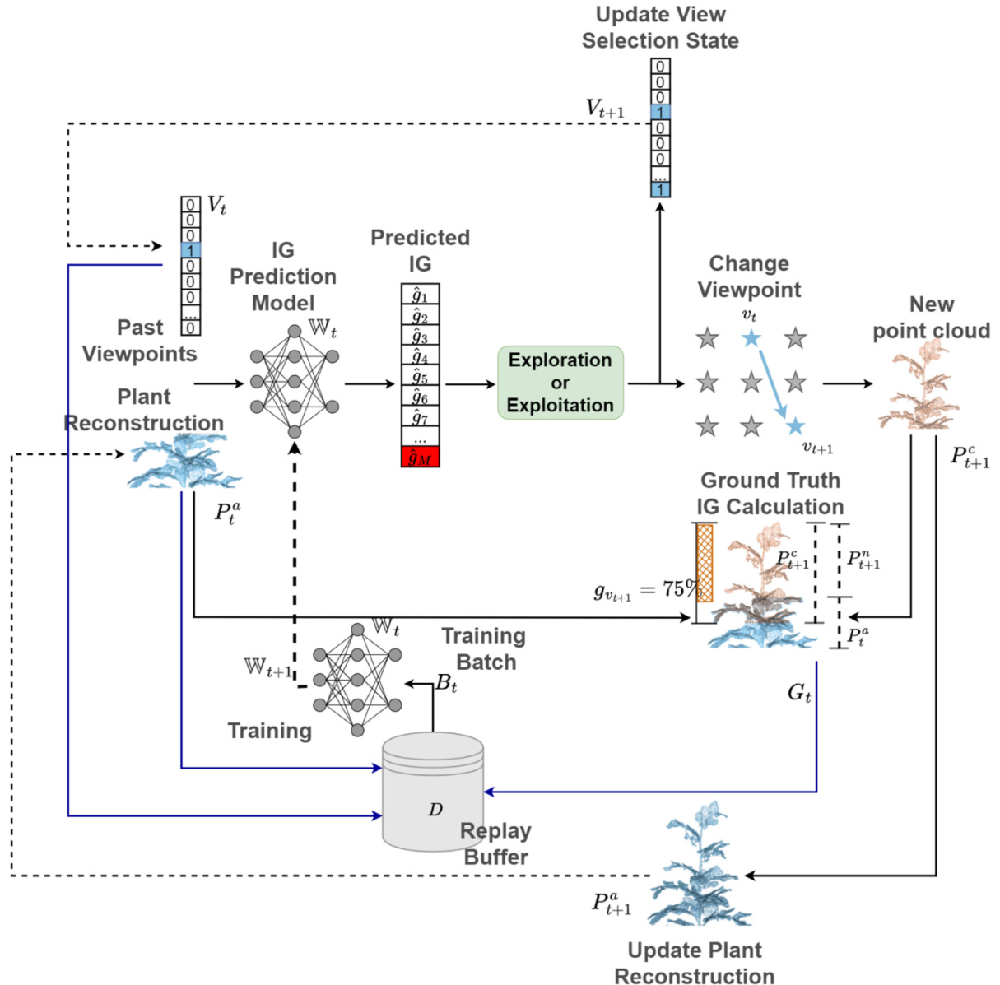  
Fig. 1. Illustration of an iteration step in self-supervised learning. At each iteration step $t ,$ next-best-view planning is conducted for plant reconstruction, and generated data, including the accumulated point cloud, view selection states, and ground-truth IG, are collected to optimize the network’s weights. Blue lines represent the collection of training samples, dotted black lines represent data updates, and solid black lines represent data transformation after the operation.  

# 2.1.1. The iteration steps in detail  

In step 1, the current accumulated point cloud $P _ { t } ^ { a }$ and view-selection state $V _ { t }$ are fed into the DL-NBV network to predict $\widehat { \cal G } _ { t } = \{ \widehat { g } _ { 1 } , \cdots , \widehat { g } _ { M } \}$ , which contains IG for all candidates, where ${ \widehat { g } } _ { i } \in \mathbb { R }$ r̂epresen̂ts the ̂pre­ dicted IG for a viewpoint. $P _ { t } ^ { a } = \{ p _ { 1 } , \cdots , p _ { K } \}$ îs the accumulated point cloud containing all collected points, where $p _ { i } = \{ x _ { i } , y _ { i } , z _ { i } \} \in \mathbb { R } ^ { 3 }$ is a 3D point with xyz-coordinates. $V _ { t } = \{ s _ { 1 } , \cdots , s _ { M } \}$ is a vector containing the selection state for all candidate views, with $s _ { i } \in \{ 0 , 1 \}$ equaling 1 if a viewpoint was selected in the past and 0 otherwise. At the beginning of the learning process, $P ^ { a } { = } { \emptyset }$ and $V = \{ 0 , \cdots , 0 \}$ . In this research, we used the PC-NBV network (Zeng et al., 2020) as the DL-NBV planner. A detailed explanation of the PC-NBV network structure and IG prediction is provided in section 2.1.2.  

In step 2, based on $\widehat { G } _ { t ; { } }$ , the estimated next-best view of iteration t is determined as $\widehat { \nu } _ { t + 1 } = \mathop { \bf a r g m a x } _ { j = 1 } ^ { M } \widehat { g } _ { j }$ , corresponding to the view acquiring the highest prêdicted IG. Howev̂er, instead of using $\widehat { \nu } _ { t + 1 }$ directly as the next camera view $\nu _ { t + 1 }$ , an exploration mechanis ̂m is employed to maintain an exploration–exploitation balance during online learning. Exploitation involves selecting $\widehat { \nu } _ { t + 1 }$ as the next camera view, which prevents wasteful exploration, ̂while exploration entails randomly picking a viewpoint $\nu ^ { r }$ from the candidate set to avoid the network getting stuck in a suboptimal view selection policy. We devised an exploration mechanism following a commonly used paradigm as in Wang et al. (2016). The mechanism is governed by the exploration rate $\in _ { t } \in [ \in _ { m i n } , \in _ { i n i } ]$ . At the beginning of the entire training process, whent $\ c =$ 1, $\epsilon _ { t } = \epsilon _ { i n i }$ was set as the initial exploration rate. Then, $\in _ { t }$ is decayed by a decay rate $\rho$ every iteration until reaching a minimum $\in _ { m i n . }$ , according to $\in _ { t } = \operatorname* { m a x } \left( \in _ { m i n } , \rho ^ { t - 1 } \cdot \in _ { i n i } \right)$ . In this work, we used $\rho = 0 . 9 5$ as a constant. The next viewpoint is then determined as follows:  

$$
\nu _ { t + 1 } = \left\{ \begin{array} { l } { { \widehat { \nu } _ { t + 1 } , i f { \in } _ { t } < x \sim U ( 0 , 1 ) } } \\ { { \nu ^ { r } \in _ { R } C , o t h e r w i s e . } } \end{array} \right.
$$  

If a randomly generated number $x$ from a uniform distribution with bounds 0 and 1 is greater than $\in _ { t } ,$ the next viewpoint $\nu _ { t + 1 }$ is set to $\widehat { \nu } _ { t + 1 }$ , otherwise, it is randomly selected from the candidate set $C$ . ̂This exploration mechanism enables the system to perform extensive explo­ ration in the beginning and gradually shifts towards using self-collected information as the network improves from experiences.  

In step 3, after the next view is determined, the camera pose is changed to this view, allowing for the collection of a new partial point cloud $P _ { t + 1 } ^ { c }$ . A detailed explanation of point cloud collection and pro­ cessing is provided in section 2.1.3.  

In step 4, based on $P _ { t } ^ { a }$ and $P _ { t + 1 } ^ { c }$ , the ground-truth IG $g _ { \nu _ { t + 1 } }$ for viewpoint $\nu _ { t + 1 }$ is calculated and is then converted into $G _ { t } = \{ 0 , \cdots , g _ { \nu _ { t + 1 } } , \cdots , 0 \}$ as the target vector for network training. To achieve continuous online learning in real agricultural scenarios, the robot should be able to calculate $g _ { \nu _ { t + 1 } }$ from its own collected data. To this end, we propose a method enabling ground-truth IG calculation of a viewpoint based solely on $P _ { t + 1 } ^ { c }$ collected from this view by robot and the previously collected data $P _ { \mathrm { \Delta } _ { t } } ^ { a }$ . Briefly, $g _ { \nu _ { t + 1 } }$ is calculated as the proportion of points in $P _ { t + 1 } ^ { c }$ that provide new information that was not captured in $P _ { t } ^ { a }$ . As shown in Fig. 2, the subset of newly observed points, denoted as $P _ { t + 1 } ^ { n }$ (marked orange), within $P _ { t + 1 } ^ { c }$ is obtained by removing the intersection (marked green) with $P _ { t } ^ { a }$ , calculated as $P _ { t + 1 } ^ { n } = P _ { t + 1 } ^ { c } - \left( P _ { t + 1 } ^ { c } \cap P _ { t } ^ { a } \right)$ . Then, the ground-truth IG for view $\nu _ { t + 1 }$ is calculated as $g _ { \nu _ { t + 1 } } ~ = ~ \left| P _ { t + 1 } ^ { n } \right| / \left| P _ { t + 1 } ^ { c } \right|$ , where $| \bullet |$ denotes the size of the set of points.  

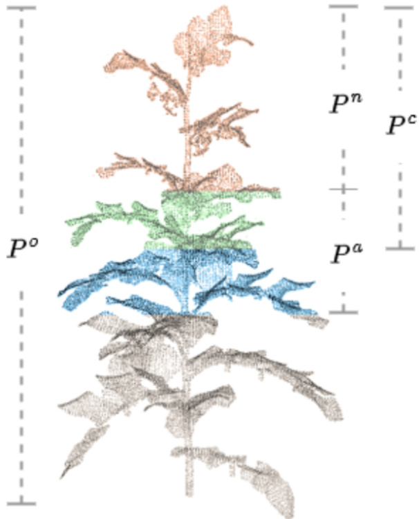  
Fig. 2. Illustration of different types of point clouds. The ground-truth IG of a viewpoint equals the proportion of novel points with respect to the observed data from this view. $P ^ { a }$ (blue and green points) refers to the accumulated point cloud. $P ^ { c }$ (orange and green points) refers to the newly collected partial point cloud. $P ^ { n }$ (orange points) refers to the newly collected points within $P ^ { c }$ . Green points refer to the intersection between $P ^ { a }$ and $P ^ { c } . P ^ { o }$ (grey points) refers to the complete point cloud, which is used in the evaluation phase.  

However, intersection $P _ { t + 1 } ^ { c } \cap P _ { t } ^ { a }$ cannot strictly be calculated using the intersection of the sets, because the corresponding points in $P _ { t + 1 } ^ { c }$ and $P _ { t } ^ { a }$ will not have the exact same coordinates. Instead, we determine $P _ { t + 1 } ^ { c } \cap P _ { t } ^ { a }$ by calculating the Euclidean distance between each point in $P _ { t } ^ { a }$ for each point in $P _ { t + 1 } ^ { c }$ . If the smallest distance is below a threshold $\delta$ , the point is added to the intersection. So, the intersection is defined as:  

$$
P _ { t + 1 } ^ { c } \cap P _ { t } ^ { a } = \left\{ p _ { k } | p _ { k } \in P _ { t + 1 } ^ { c } \land \underset { p _ { j } \in P _ { t } ^ { a } } { \operatorname* { m i n } } | | p _ { k } - p _ { j } | | _ { 2 } \leq \delta \right\}
$$  

where $\| \bullet \| _ { 2 }$ is the Euclidean distance between two points. $\delta$ was set at $0 . 0 0 3 \mathrm { m }$ in the simulation, while set at $0 . 0 1 \mathrm { { m } }$ in the real word. This aligned with the voxel size used for point cloud downsampling (refer to section 2.1.3). This method allows for the calculation of ground-truth IG solely based on the data collected by the robot, facilitating an autono­ mous training data collection when integrated with the flexibility of a robotic system.  

The formulated target vector $G _ { t }$ for network training containing only the sparse ground-truth IG for a single view is called weakly-supervised annotation. The detailed explanation of using weakly-supervised data in network training is provided in section 2.1.4.  

In step 5, the accumulated point cloud $P _ { t } ^ { a }$ and the view-selection state $V _ { t }$ are collected as inputs, along with the target vector $G _ { t }$ , to formulate a training sample $\boldsymbol { b _ { t } } = \left\{ P _ { t } ^ { a } , V _ { t } , G _ { t } \right\}$ , which is then stored in a circular buffer $D = \{ b _ { t - l + 1 } , \cdots , b _ { t - 1 } , b _ { t } \} ,$ where $l \in \mathbb { N }$ is the maximum number of samples that can be stored. When the capacity of $D$ is reached, the oldest data is replaced by the newest data, maintaining a fixed-size representation of past experiences. $D$ is not cleared at the end of each plant reconstruction cycle, allowing historical experiences to be reused in the future recon­ struction cycles.  

In step 6, the accumulated point cloud and the view-selection state are updated. The accumulated point cloud is updated by adding the newly collected point cloud, $P _ { t + 1 } ^ { a } = P _ { t } ^ { a } \cup P _ { t + 1 } ^ { c } = P _ { t + 1 } ^ { c } - \left( P _ { t + 1 } ^ { c } \cap P _ { t } ^ { a } \right) \cup P _ { t } ^ { a }$ (the calculation of $P _ { t + 1 } ^ { c } \cap P _ { t } ^ { a }$ refers to Eq.(2)), and the view-selection state is updated to $V _ { t + 1 }$ by setting the $s _ { \nu _ { t + 1 } }$ to 1.  

Finally, in step 7, a subset $B _ { t } \subseteq _ { R } D$ is randomly sampled to optimize the weights $\mathbb { W } _ { t }$ of the network, where the subscript $R$ indicates a random selection of training samples. $B _ { t } = \{ s _ { 1 } , \cdots , s _ { N } \}$ contains $N$ training sam­ ples, where $N \in \mathbb { N }$ is the batch size, and network training starts when the stored number of samples in $D$ exceeds the batch size. Since $D$ is not cleared after each reconstruction cycle, so $B _ { t }$ comprises data from both the current and previous reconstruction cycles. This method, collecting historical data in a buffer and then sampling data from the buffer to train the network, is called experience replay. Experience Replay is a key technique utilized in online learning to improve sample efficiency through the reuse of historical data and improve training stability by breaking temporal correlations between consecutive steps.  

# 2.1.2. Deep-learning network structure for information gain prediction  

Fig. 3 shows the architecture of the network used in this research, which follows the original paper in which PC-NBV was presented (Zeng et al., 2020). At any iteration step t, the network takes $P _ { t } ^ { a }$ and $V _ { t }$ as in­ puts. First, the point cloud $P _ { t } ^ { a }$ is processed by a feature extraction network, extracting local features to generate the point-wise feature $F O$ with 264 features per point. $F O$ is further processed using max pooling to obtain the global feature $_ { G O }$ of length 264. Subsequently, both G0 and $V _ { t }$ are duplicated to match the dimension of $F O$ along the vertical axis. This duplication facilitates the concatenation with $F O$ , resulting in the gen­ eration of point-wise features $_ { F 1 }$ , containing both global and local fea­ tures of the point cloud, as well as the view-section state. $_ { F 1 }$ is then input to a self-attention unit (Zhang et al., 2019) to further integrate these features, yielding the attention feature $_ { F 2 }$ . Following this, a multi-layer perceptron (MLP1) module with 2 layers of 1024 neurons each following max pooling are applied, producing $_ { G 1 }$ as the final global feature. G1 represents $P _ { t } ^ { a }$ and $V _ { t } ,$ which is finally fed into another MLP2 with 4 layers of 1024, 512, 256, and 33 neurons each. MLP2 predicts ${ \widehat { G } } _ { t } = \{ { \widehat { g } } _ { 1 } , \cdots ,$ $\widehat { g } _ { M } \}$ , containing the predicted IG for all candidate viewpoînts.  

Notably, the original PC-NBV is designed for offline learning and tested in a simulation environment. We modified the training approach, IG calculation metric (step 4 of section 2.1.1), and loss function (section 2.1.4), enabling continuous online learning with weakly-supervised data, showing its capability in real agricultural scenarios.  

# 2.1.3. Point cloud collection and processing  

In the simulation environment, a simulated Intel Realsense L515 RGB-D camera was utilized to capture both color and depth information from the viewpoint, which were then combined to form a partial point cloud. Point cloud downsampling was subsequently performed using the VoxelGrid1 filter with a voxel size of $0 . 0 0 3 \mathrm { m }$ , generating $P ^ { c }$ . The choice of voxel size aligned with the work of Burusa et al. (2022), who employed a Voxel-based NBV method for plant reconstruction, enabling direct comparison with their approach.  

In the real-world experiment, an Intel Realsense L515 RGB-D camera was used to capture point clouds. Real-world point clouds commonly contain various sources of noise due to ambient lighting fluctuations, sensor-specific artifacts, and idiosyncrasies in point cloud generation algorithms. To address this, a three-step noise reduction process was implemented. Initially, a RangeFilter was employed to eliminate points falling outside a specified range. The cropped point cloud then under­ went further refinement through the application of the Statistical Outlier Removal (SOR) filter, which identified and removed points significantly deviating from their neighbors when compared to the point cloud’s average. Finally, the VoxelGrid filter with a voxel size of $0 . 0 1 \mathrm { { m } }$ was applied to further enhance the cleanliness of the point cloud data.  

# 2.1.4. Loss calculation using weakly-supervised data  

In the original PC-NBV, a classic mean square error (MSE) loss function was utilized to calculate the loss $L ^ { s }$ (superscript $s$ represents the loss for strongly-supervised learning) between $\widehat { G } _ { t }$ and $G _ { t }$ . The $G _ { t }$ was formulated as $G _ { t } = \{ g _ { 1 } , \cdots , g _ { M } \}$ , encompassing thêground-truth IG for all candidate viewpoints. The $L ^ { s }$ was computed as follows:  

$$
L ^ { s } = \sum _ { i = 1 } ^ { M } { ( g _ { i } - { \widehat { g } } _ { i } ) ^ { 2 } }
$$  

This approach requires each $\widehat { g } _ { i }$ to be associated with a corresponding $g _ { i }$ for supervision, or in other ŵords, it demands fully ground-truth labels, using strongly-supervised learning. While valid in simulation environ­ ments, this method is inefficient for robotic online learning in real-world scenarios, as robotic motion is time-consuming and obtaining $G _ { t }$ ne­ cessitates the robot traversing all candidate viewpoints in $C$ .  

To address this issue, we propose a weakly-supervised learning method, enabling training based on coarse-grained ground-truth labels, a specific technique called inexact supervision (Zhou, 2018). We defined ground-truth vector $G _ { t } = \left\{ 0 , \cdots , g _ { \nu _ { t + 1 } } , \cdots , 0 \right\}$ , where $\nu _ { t + 1 }$ is the next viewpoint. The weakly-supervised loss $L ^ { w }$ is then computed as follows:  

$$
L ^ { w } = \sum _ { i = 1 } ^ { M } a _ { i } ( g _ { i } - \widehat { \pmb { g } } _ { i } ) ^ { 2 }
$$  

where  

$$
a _ { i } = \left\{ { \begin{array} { l } { 1 , \ i f \ i = \nu _ { t + 1 } } \\ { 0 , \ o t h e r w i s e } \end{array} } \right.
$$  

This method allows the loss to be calculated only based on the ground truth of the next viewpoint $\nu _ { t + 1 }$ , significantly enhancing the efficiency of training data collection. However, it may lead to reduced sample effi­ ciency, as only information associated with the next viewpoint is utilized for loss calculation and network optimization. To improve sample effi­ ciency, experience replay is utilized (details refer to step 5 of section 2.1.1).  

# 2.2. Experimental setup  

Three experimental scenarios were designed to evaluate the perfor­ mance of our SSL-NBV algorithm:  

(1) Simulated Scenario 1 (experiment S1): This scenario evaluates the network’s performance in reconstruction efficiency and quality, IG prediction speed, and training efficiency. We compared our SSL-NBV algorithm with other NBV and non-NBV methods. (Q1).   
(2) Simulated Scenario 2 (experiment S2): Building on S1, this sce­ nario modifies viewpoint settings and target plants to test the method’s generalization and adaptability to novel view settings and target plants. In this experiment, we compared weaklysupervised and strongly-supervised learning (Q2), and analyzed performance improvements after online fine-tuning (Q3). The network weights trained in S1 was used as the starting point for fine-tuning in this experiment to retain knowledge from previous plants. Additionally, the experiment examined the model’s abil­ ity to handle catastrophic forgetting—a common issue in online learning where adapting to new data causes the loss of previously learned information. To test this, the fine-tuned network from S2 was reapplied to the S1 scenario to evaluate its ability to retain earlier knowledge.   
(3) Real-World scenario (experiment RW): This scenario involved  

testing the algorithm in real-world conditions using a robot  

J. Ci et al.  

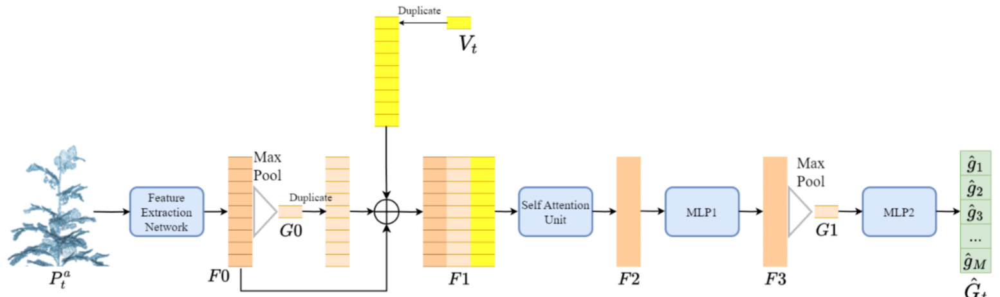  
Fig. 3. The architecture of PC-NBV network. The network initially extracts the global feature of the accumulated point cloud and then combines it with the local feature and view selection state to predict the IG for each candidate viewpoint. The figure is adopted from Zeng et al. (2020).  

equipped with an RGB-D camera and real plants (Q4). The neural network trained in S1 was continuously fine-tuned in this scenario.  

To improve generalization, multiple plants were used during training. The entire training process was separated into many plant reconstruction cycles. Each cycle, a plant with random pose was posi­ tioned as the target, and the robot consecutively selects $n$ views from $c$ to reconstruct the plant, collecting training data and updating the network simultaneously. Once a reconstruction was complete after $n$ iterations, a new plant was positioned, the accumulated point cloud and the view-selection state were re-initialized, and a new cycle began. Through preliminary tests, $n = 1 0$ was set for simulation experiments, where we systematically increased the value, and 10 viewpoints typi­ cally allowed good plant reconstruction for both SSL-NBV and baseline methods. It was also sufficient for comparisons between methods without unnecessary computational overhead. For the real-world experiment, $n = 1 5$ was set due to the higher complexity of real plants. The same value of $n$ was used during testing. While increasing the number of viewpoints may slightly improve reconstruction ratios for all methods, the overall performance trends and comparative results be­ tween methods will be unchanged.  

# 2.2.1. Simulation scenarios  

The simulation was developed using Gazebo (Koenig and Howard, 2004), with data collection and exchange via the Robot Operating Sys­ tem (ROS) (Quigley et al., 2009). The simulation ran on a ThinkPad P15 laptop with an Intel Xeon W-11855M CPU and an Nvidia GeForce RTX A500 GPU with 16 GB memory, operating on Ubuntu 20.04.  

In experiment S1 and S2, as illustrated in Fig. 4, the candidate viewpoints set $c$ comprised 33 viewpoints $\left( M = 3 3 \right)$ ), arranged in a cy­ lindrical pattern around the origin of the global frame, providing ob­ servations of the plant from 11 angles $( a _ { 1 } , \cdots , a _ { 1 1 } )$ and 3 heights $( h _ { 1 } , h _ { 2 }$ $\begin{array} { r } { h _ { 3 } . } \end{array}$ ). These viewpoints were all horizontal and oriented to face the Z axis of the origin. The camera moved freely between viewpoints, providing a $3 6 0 ^ { \circ }$ view of the plant. To create additional variation, each time a plant was created, a plant model was randomly selected from the plant model set and positioned randomly with coordinates $d _ { x }$ and $d _ { y }$ along the $\mathbf { x }$ and y axes, and a rotation $\theta$ .  

In experiment S1, the candidate viewpoints featured a radius $r$ of $0 . 6 \mathrm { m }$ , with different heights $h _ { 1 } = 0 . 0 4 \mathrm { m }$ , $h _ { 2 } = 0 . 2 5 \mathrm { m }$ , and $h _ { 3 } = 0 . 4 6 \mathrm { m }$ . For the random translation, the range for $d _ { x }$ and $d _ { y }$ selections were set at $d _ { x } , d _ { y } \in U ( - 0 . 1 , 0 . 1 )$ with a $0 . 0 2 \mathrm { m }$ interval, and for the rotation was $\theta \in$  

$U ( 0 , 3 6 0 )$ with a $2 0 ^ { \circ }$ interval. Ten 3D tomato plant models2 (T1-T10 as shown in Fig. 5) were used as targets, exhibiting variations in archi­ tecture, size, height, the number of tomato trusses, and leaf nodes. Eight plants were used for training and two for testing. Due to the limited number of plants, K-fold cross-validation was employed to evaluate the method. Those ten tomato plants were divided into two classes, A (T1- T5) with simpler structures and B (T6-T10) with more complex struc­ tures. The ten plants were then randomly split into 5 sets $( \mathrm { K } = 5 )$ , each containing one plant from each class: set 1 (T3, T8), set 2 (T4, T6), set 3 (T5, T9), set 4 (T1, T7), and set 5 (T2, T10). This setup resulted in five rounds of validation, where each round used one set for testing and the others for training. Each validation round involved 50 repetitions of plant reconstruction for the testing set, totaling 250 repetitions (5 sets $\times$ 50 repetitions). Each repetition randomly selected a plant from the test set, placed it in a random location and orientation, and had the trained network reconstruct the plant starting from a random viewpoint. We chose 50 repetitions to ensure sufficient variability in the reconstruction process to reflect the method’s overall performance.  

In experiment S2, the viewpoint settings and target plants were modified to create a novel environment, testing the online learning and fine-tuning capabilities of the proposed method in a completely novel scenario. The radius $( r )$ was set at $0 . 5 \mathrm { m }$ , and a larger range of random plant positions $d _ { x } , d _ { y } \in U ( - 0 . 3 , 0 . 3 )$ was used to introduce more vari­ ation in the relative pose between the camera and the plant compared to experiment S1. Three pepper plants3 (P1-P3 as shown in Fig. 5), significantly different in morphology from tomato plants were used. A Kfold cross-validation method with $\mathrm { ~ K ~ } = 3$ was employed during the evaluation. In each round of validation, one plant was used for testing while the remaining two were used for fine-tuning. Each validation round involved 50 repetitions, totaling 150 repetitions (3 plants $\times 5 0$ repetitions).  

# 2.2.2. Real-world scenario  

The real-world setup involved an ABB IRB 1200 robot equipped with an Intel Realsense L515 RGB-D camera attached to its end effector (refer to Fig. 6a), facilitating flexible data collection from various viewpoints. The system was controlled by ROS for robot control and data commu­ nication between devices, using the same ThinkPad P15 laptop as simulation.  

Due to the motion limitations of the robot, we sampled $M = 3 3$ viewpoints in a semi-cylindrical distribution, spanning from $- 6 0 ^ { \circ }$ to $6 0 ^ { \circ }$ relative to the $\mathbf { x }$ -axis of the robot frame (see Fig. 6b). The radius of the  

J. Ci et al.  

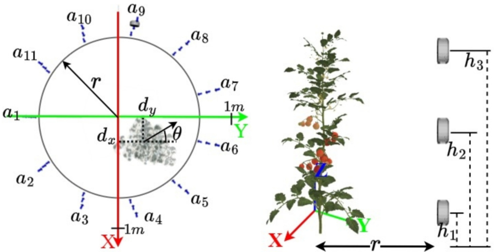  
Fig. 4. Illustration of viewpoint sampling and plant creation. The left image depicts a top view and the right image depicts a side view. Viewpoints (blue arrows) were sampled in a cylindrical distribution to observe the plant from 11 angles $( a _ { 1 } , \cdots , a _ { 1 1 } )$ and 3 heights $( h _ { 1 } , h _ { 2 } , h _ { 3 } )$ . Each plant is created around the origin with random positions $d _ { x }$ and $d _ { y }$ in $\mathbf { x }$ and y axes, and a rotation $\theta$ .  

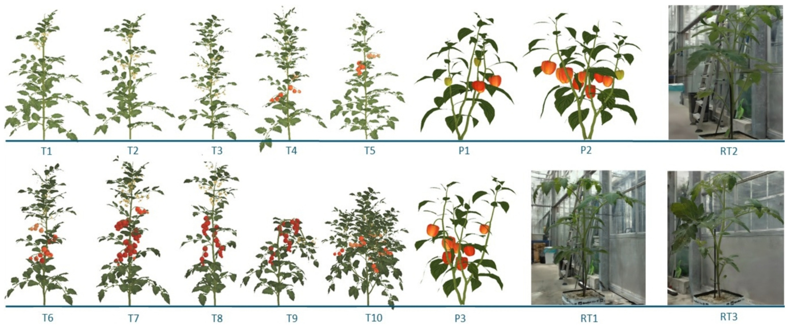  
Fig. 5. Plants used in experiments. T1-T10 are simulated tomato plants used in experiment S1. P1-P3 are simulated pepper plants used in experiment S2. RT1-RT3 are real tomato plants used in experiment RW.  

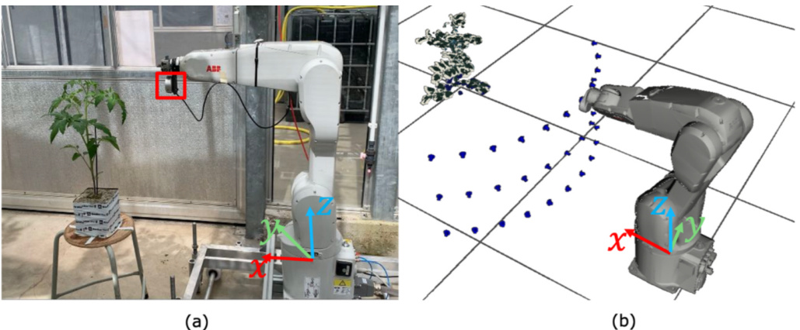  
Fig. 6. Illustration of real-world setup. The real-world environment includes a real robot equipped with an RGB-D camera for flexible plant reconstruction.  

cylindrical sector was $0 . 4 5 \mathrm { m }$ , with viewpoints at heights of $h _ { 1 } = 0 . 7 5 \mathrm { m }$ , $h _ { 2 } = 1 . 0 \mathrm { m }$ , and $h _ { 3 } = 1 . 2 5 \mathrm { m }$ relative to the origin of robot frame. We selected three 40-day-old tomato plants (RT1-RT3, as shown in Fig. 5) as targets. These plants were approximately 55cm in height and had 6–7 composite leaves. The data from the real plants was pre-collected, allowing us to repeat experiments and compare the results with base­ line methods.  

For each plant, the position was fixed at $0 . 9 \mathrm { m }$ , 0m, and $0 . 6 5 \mathrm { m }$ along the x, y, and z axes of the robot frame, respectively. Four rotations of $0 ^ { \circ }$ or $9 0 ^ { \circ }$ or $1 8 0 ^ { \circ }$ or $2 7 0 ^ { \circ }$ were applied, and the point clouds for all 33 views for each rotation were collected. A k-fold cross-validation method was used to test the approach, with each round of validation using two plants as the training set and one plant as the testing set, resulting in a total of three rounds $( \mathbf { k } = 3 )$ of validation. Each round involved 50 repetitions, leading to a total of 150 repetitions (3 plants $\times 5 0$ repeti­ tions) of plant reconstruction. In each repetition, the test plant, set to one of the four rotations, was selected as the target, and the method reconstructed the plant from a randomly selected initial view.  

# 2.2.3. Implementation details of self-supervised learning in experiments  

In all three experiment scenarios, during network training, a batch size $N = 3 2$ for experience replay was set, and the buffer size was set to $l = 1 0 0 0$ . Before feeding the accumulated point cloud $P _ { t } ^ { a }$ to the network, a down sampling procedure was conducted to resize the accumulated point cloud $P _ { t } ^ { a }$ to 512 points, independent of the size of the plants, with each point being randomly chosen from $P _ { t } ^ { a }$ . The purpose of this down sampling procedure was to ensure a consistent number of points for network IG prediction while maintaining computational efficiency. The original $P _ { t } ^ { a }$ was continuously maintained and updated as the final 3D reconstruction. Based on rough estimations, the final 3D reconstruction of $P _ { t } ^ { a }$ typically contained 30,000 to 60,000 points for simulated plants and approximately 7,000 to 13,000 points for real-world plants, depending on the size of the target plants. This choice of 512 was based on a preliminary test which indicated that using more points did not improve the network’s accuracy in IG prediction (or increase loss) and reduced prediction speed and increasing computation and memory de­ mands linearly due to the increased complexity of the network architecture.  

In experiment S1, the exploration parameters were set to $\epsilon _ { i n i } = 1 . 0$ and $\in _ { m i n } = 0 . 2$ , with the maximum number of training iterations set to $T$ $= 5 0 { , } 0 0 0$ . In experiment S2, $\in _ { i n i } = 0 . 2$ was reduced to 0.2 since the network was already pre-trained in experiment S1, and $T$ was set to 12,400 to maintain the same number of iterations per plant in the training set (8 for tomato and 2 for pepper). The replay buffer, which was maintained and updated throughout S1, was cleared before the start of online learning in S2 to enable efficient fine-tuning in this novel environment. In Experiment RW, $\in _ { i n i }$ was set back to 1.0 to allow more exploration due to the substantial differences between simulation and real-world conditions. The maximum iterations were set to $T = 2 5 , 0 0 0$ , which was higher than in experiment S2, considering the increased complexity of real-world plants. The replay buffer was cleared prior to online learning to facilitate efficient fine-tuning in RW.  

# 2.2.4. Implementation of baseline planners for experiments We compared the performance of our SSL-NBV with other methods:  

(1) Traditional Voxel-based NBV (Burusa et al., 2022): This method converts the point cloud into an occupancy grid and uses ray casting from each candidate viewpoint to calculate the IG for the next-best view. To enhance the speed of view planning, the oc­ cupancy grid updates and ray casting processes are executed using GPU acceleration. The parameters used for ray casting, IG calculation and occupancy calculation follow the original paper.   
(2) PC-NBV (Zeng et al., 2020): This approach has a training setup similar to our SSL-NBV in terms of batch size, training iterations,  

and epochs. However, PC-NBV relies on strongly-supervised data, requiring the collection of ground-truth IG by traversing all candidate viewpoints, a process that is highly time-consuming and dependent on complete plant models, which are not avail­ able in real-world scenarios.  

(3) Random planner: In this method, each next viewpoint is randomly selected from the candidate set $C$ .  

(4) Pre-defined planner: This planner selects 11 viewpoints from the candidate set $c$ and distributed in a zigzag pattern across 3 heights and 11 angles, alternating heights at each angle. The set of views is formulated as $\{ a _ { 1 } h _ { 1 } , a _ { 2 } h _ { 2 } , a _ { 3 } h _ { 3 } , a _ { 4 } h _ { 2 } , a _ { 5 } h _ { 1 } , a _ { 6 } h _ { 2 } , a _ { 7 } h _ { 3 }$ , $a _ { 8 } h _ { 2 } , a _ { 9 } h _ { 1 } , a _ { 1 0 } h _ { 2 } , a _ { 1 1 } h _ { 3 } \}$ (refer to Fig. 4). During each cycle of plant reconstruction, 10 viewpoints were randomly selected without repetition from this set and visited in random order to remove the impact of viewpoint order on plant reconstruction efficiency.  

# 2.3. Evaluation metrics  

Two main metrics were employed to evaluate the proposed method: (a) Reconstruction quality and efficiency; (2) Required number of ground-truth annotations for network training.  

# 2.3.1. Reconstruction quality and efficiency  

Reconstruction quality was assessed using the reconstruction ratio $( R )$ for the ground-truth point cloud $P ^ { o }$ . In the simulation environment, the ground-truth point clouds of plant models were generated by uni­ formly sampling points on their mesh surfaces. These points were then down sampled using the VoxelGrid filter, resulting in a spatial resolution of $0 . 0 0 3 \mathrm { ~ m ~ }$ . This process generated point clouds containing approxi­ mately 30,000 to 40,000 points for tomato plants and 50,000 to 60,000 points for pepper plants. In the real-world scenario, where complete 3D models were unavailable, the ground-truth model was approximated by merging point clouds collected from all viewpoints. Subsequently, the same noise filtering process described in section 2.1.3 was applied, and the ground-truth point cloud was down sampled to a resolution of $0 . 0 1 \mathrm { { m } }$ . This process produced point clouds with approximately 7000 to 9000 points for real-world plants. While the ground-truth generated using this method is not perfectly accurate, it provides a reasonable approximation, as all planners were implemented and evaluated under consistent criteria.  

The reconstruction ratio at any current reconstruction round was computed as the proportion of points within $P ^ { o }$ that were reconstructed in the current accumulated point cloud, expressed as $R = | P ^ { o } \cap P ^ { a } | / | P ^ { o } |$ , where the intersection $P ^ { a } \cap P ^ { o }$ was calculated using Eq. (2). In experi­ ment S1 and S2, the threshold $\delta$ was set at $0 . 0 0 3 \mathrm { m }$ to determine if a point in $P ^ { o }$ is reconstructed, while in RW, the threshold was set to $0 . 0 1 \mathrm { { m } }$ due to the additional sensor noise. Reconstruction efficiency was assessed by counting the number of views required to achieve specific thresholds $\tau$ $= 0 . 8$ and 0.9 of $R$ in a plant reconstruction cycle.  

The IG prediction speed can significantly impact reconstruction ef­ ficiency. A faster IG prediction method enables faster next-best-view selection, leading to faster plant reconstruction. IG prediction speed was measured as the time taken to predict the IG for all 33 candidate views, with and without GPU acceleration. Additionally, learning-based NBV methods require additional time for data collection and network training, which affects overall plant reconstruction efficiency. Assuming A plants need to be reconstructed, the total time required for the pro­ posed method, including network training and plant reconstruction, was calculated and compared to baseline methods.  

The performance of our SSL-NBV algorithm was evaluated in com­ parison to baseline planners using K-fold cross-validation. During each round of validation, all planners were applied to the same set of test plants and performed plant reconstruction with the same number of repetitions (details are provided in Sections 2.2.1 and 2.2.2). The results for each method were obtained by averaging the outcomes from these K  

fold cross-validation repetitions.  

# 2.3.2. Number of ground-truth annotations  

The measurement of each ground-truth IG required the robot to move its end-effector to a candidate view, collect a partial point cloud, and calculate IG based on the accumulated point cloud. As a result, the number of ground-truth annotations necessary for network training significantly impacted the adaptability of online learning methods. A method that requires fewer annotations can reduce robotic motion, accelerate data collection, and facilitate more frequent network updates.  

The required number of annotations for SSL-NBV, denoted as $A ^ { s s l } \in \mathbb { N }$ , was calculated equaling the total number of robotic motions, as it used online weakly-supervised learning, each robotic motion allowed the collection of a training sample and its corresponding ground-truth IG. To give a direct insight about the results, the value of $A ^ { s s l }$ was compared with PC-NBV, which was trained using offline stronglysupervised learning. The required number of annotations for PC-NBV was calculated as $A ^ { o f f } = F \times M _ { ; }$ , where $F$ represents the total number of offline training samples and $M$ denotes the number of candidate views.  

Since the training data for PC-NBV was pre-collected, $A ^ { o f f }$ remained fixed throughout the entire training process. We used $A ^ { o f f }$ as the maximum allowable number of annotations for SSL-NBV during online training. As training progressed, SSL-NBV’s performance in plant reconstruction improved, and $A ^ { s s l }$ increased until reaching $A ^ { o f f }$ . Practi­ cally, SSL-NBV’s training could be terminated when its plant recon­ struction performance converged to a maximum level, as the network’s weights stabilize and optimize. However, determining the exact convergence point can be subjective. To address this, we proposed a statistical approach where training was considered complete when there was no significant difference $\mathbf { \dot { p } }$ -value $> 0 . 0 5$ ) between the reconstruc­ tion ratio of SSL-NBV and PC-NBV. This point was then used to calculate the $A ^ { s s l }$ for SSL-NBV. The p-value between the two sets of results was calculated using a Two-Sample t-Test, under the assumption that both sets follow a normal distribution.  

In experiment S1, 8,000 samples were collected for PC-NBV training, resulting in $A ^ { o f f } = 2 6 4 { , } 0 0 0$ (8000 samples $\times 3 3$ views). In experiment RW, 1920 samples were collected for fine-tuning PC-NBV, resulting in $A ^ { o f f } = 6 3 , 3 6 0$ (1920 samples $\times 3 3$ views).  

# 3. Results  

# 3.1. Simulated scenario 1  

The results of experiment S1 addressed Question 1 by comparing the plant reconstruction efficiency and quality of SSL-NBV with baseline methods. Fig. 7 shows the average reconstruction ratio of SSL-NBV compared to other methods over cross-validation (visualization exam­ ples are provided in Fig. 14). All NBV methods outperformed non-NBV methods, confirming that NBV approaches are more effective for plant reconstruction. Our method achieved a final reconstruction ratio of approximately 0.95, corresponding to 30,000 to 60,000 points in the final 3D reconstruction, depending on the size and structural complexity of the target plants. The threshold $\tau = 0 . 8$ and 0.9 were reached after 5 and 6 viewpoints, respectively. This was faster than the non-NBV methods, where the Pre-defined planner required 5 and 7 views, and the Random planner needed 7 and 10 views, indicating that SSL-NBV can more efficiently reconstruct plants with fewer views. Compared to PC-NBV, which was trained using strongly-supervised learning, SSLNBV showed a slightly lower reconstruction efficiency, with a 0.02 reduction in the final reconstruction ratio. However, SSL-NBV uses weakly-supervised learning, requiring only sparse IG labels, can signif­ icantly reduce the need for ground-truth IG annotations during training compared to PC-NBV (further analysis is provided subsequently). None of the planners achieved $1 0 0 \%$ plant reconstruction because the viewpoints were restricted to horizontal views, missing parts of the plant only visible from other angles, such as looking up or down.  

  
Fig. 7. Average reconstruction ratio of SSL-NBV in experiment S1 across crossvalidation (250 plant reconstruction cycles) compared to baseline methods.  

Fig. 8 shows the plant reconstruction ratio of SSL-NBV as a function of the number of annotations used during online learning. This is a representative curve with T1-T7 as test plants, and a similar pattern was observed in other validation rounds. The figure compares weaklysupervised (SSL-NBV) and strongly-supervised (PC-NBV) learning in terms of sample efficiency, partially addressing Question 2. To compare to PC-NBV, which used 264,000 annotations during training. In this comparison, the training of SSL-NBV was also extended to 264,000 training iterations but the plot shows that already with fewer annota­ tions, SSL-NBV reaches similar performance. The results indicate that SSL-NBV achieved a similar plant reconstruction ratio to PC-NBV (pvalue $> 0 . 0 5 \dot { }$ with only $9 \%$ of the annotations, indicating a significantly higher sample efficiency. This increased sample efficiency can be attributed to the different training approaches. PC-NBV used offline strongly-supervised learning, updating the network to improve IG pre­ diction accuracy for all views simultaneously. While this approach could enhance generalization and reduce fluctuations in training, it could also introduce redundant or less informative data, reducing sample effi­ ciency. Conversely, SSL-NBV employed weakly-supervised learning with a balance between exploration and exploitation, which likely results in the selection of more informative views.  

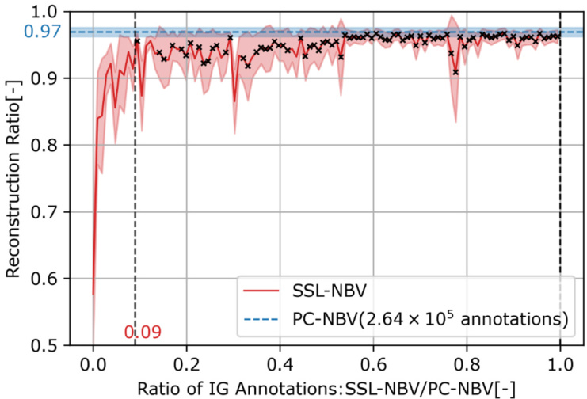  
Fig. 8. The plant-reconstruction ratio as a function of the number of training annotations used during online learning, using T1-T7 as test plants. The $\mathbf { x }$ -axis shows the ratio of used IG annotations used by SSL-NBV comparing to the 2.64 $\times 1 0 ^ { 5 }$ annotations used by PC-NBV. The red line shows the trend for the SSLNBV method, while the blue line for the PC-NBV method is plotted as a refer­ ence. The shaded regions represent the $9 5 \%$ confidence interval over 50 plant reconstruction cycles. Crosses ${ \bf \Pi } ( { \bf x } )$ indicate reconstruction ratios not significantly different (p-value $> 0 . 0 5$ ) between SSL-NBV and PC-NBV. The vertical black dashed line indicates the first ratio of IG annotation where the two methods do not show a significant difference in the reconstruction ratio.  

Table 1 Comparison of IG prediction speed between the learning-based NBV methods and the voxel-based method with ray-casting.   

<html><body><table><tr><td>GPU/CPU</td><td>Planner</td><td>NBV Planning (s) (Average ± Std)</td><td>NBV Planning with online learning (s) (Average ± Std)</td></tr><tr><td rowspan="2">GPU</td><td>SSL-NBV</td><td>0.0038±0.00029</td><td>0.099 ± 0.00024</td></tr><tr><td>PC-NBV</td><td>0.0037 ± 0.00042</td><td>二</td></tr><tr><td rowspan="4">CPU</td><td>Voxel-NBV</td><td>3.2 ± 0.0038</td><td></td></tr><tr><td>SSL-NBV</td><td>0.039 ± 0.0037</td><td>3.7± 1.2</td></tr><tr><td>PC-NBV</td><td>0.040 ± 0.0038</td><td></td></tr><tr><td>Voxel-NBV</td><td>22 ±1.8</td><td></td></tr></table></body></html>  

While SSL-NBV exhibited a slightly lower average reconstruction ratio than PC-NBV when $A ^ { s s l } = A ^ { o f f }$ , the difference was not statistically significant, suggesting that, given the same number of annotations, SSLNBV can achieve similar plant reconstruction performance with PCNBV. And consider the significant advantages of SSL-NBV in sample efficiency and online learning adaptability, it is well-suited for auto­ matic plant reconstruction tasks.  

Furthermore, we compared the IG prediction speed between our SSLNBV, PC-NBV, and Voxel-NBV, as displayed in Table 1. This speed was measured by the total time required by each method to predict the IG for all candidate views. Since SSL-NBV and PC-NBV used the same network architecture, they achieved a similar prediction speed. When the GPU was utilized, our SSL-NBV required only 0.0038s for IG prediction, representing a substantial 842-times improvement over Voxel-NBV (3.2s). This highlights the efficiency gain of neural-network-based NBV methods compared to voxel-based approaches that use raycasting for IG prediction. When only the CPU was available, our method required $0 . 0 3 9 s$ for IG prediction, achieving a 564-times improvement over Voxel-NBV (22s). Importantly, these time measure­ ments considered only IG prediction. For Voxel-NBV, which requires additional time for converting point cloud data to voxels, the difference in speed between the two methods would be further increased.  

Additionally, SSL-NBV involved extra steps, such as ground-truth IG calculation, training data storage, and online network training during NBV planning, to fine-tune for novel plants. Under GPU acceleration, one iteration of NBV planning with online learning required $0 . 0 9 9 s$ , making it 32-times faster than Voxel-NBV. On a CPU, the time increased to 3.7s due to computations of ground-truth IG and network training, but it was still 6-times faster than Voxel-NBV. Notably, online network training is only necessary when the method is applied to novel plants. For the plants the method has already been trained, online training could be deactivated.  

Based on the data presented in Table 1 and Fig. 8, we estimated the time required to deploy different methods for 3D plant reconstruction. In our simulations, the robot took an average of $0 . 4 7 s$ to transition be­ tween two viewpoints. For Voxel-NBV, which consumed time solely on plant reconstruction, the total time to reconstruct $A$ plants was calcu­ lated as $( 3 . 2 s + 0 . 4 7 s ) \times 1 0 \times A$ , where 10 represents the number of views needed per plant. For PC-NBV, additional time was required for data collection and network training. The total time was computed as 264,0 $) 0 \times ~ 0 . 4 7 s ~ + ~ 1 . 8 0 0 s ~ + ~ ( 0 . 0 0 3 7 s ~ + ~ 0 . 4 7 s ) ~ \times ~ 1 0 ~ \times ~ A$ , where 264,000 corresponds to the minimum number of annotations needed to train PC-NBV for a specific plant type (align with Fig. 8), and 1800s accounts for the network training process. For SSL-NBV, which employed online learning, the annotation requirements were signifi­ cantly reduced compared to PC-NBV (see Fig. 8). Its total computation time was calculated as $2 6 4 , 0 0 0 \times 0 . 0 9 \times ( 0 . 4 7 \mathrm { { s } } + 0 . 0 9 9 \mathrm { { s } } ) + ( 0 . 0 0 3 8 \mathrm { { s } } +$ $0 . 4 7 s ) \times 1 0 \times A$ , where 0.09 represents the proportion of annotations required for SSL-NBV compared to PC-NBV to achieve similar performance.  

Fig. 9 illustrates the time consumption trends for the three methods as the number of plants increases. SSL-NBV consistently required approximately $3 5 . 8 4 \mathrm { h }$ less than PC-NBV, due to its reduced need for annotations, which reduced robot motions. Voxel-NBV is more efficient than SSL-NBV when reconstructing less than 422 plants, as it does not require training. However, for larger-scale reconstructions, SSL-NBV’s efficiency becomes increasingly evident, leading to a substantial reduction in overall time consumption compared to Voxel-NBV. Notably, plants in greenhouses often exhibit substantial variations weekly, meaning a plant at different growth stages can be considered as a new plant, which makes it not difficult to exceed the threshold of 422 plants.  

# 3.2. Simulated scenario 2  

The results of experiment S2 addressed Question 2 by comparing the generalization capability of weakly- supervised learning and stronglysupervised learning, and Question 3 by testing the adaptability of the proposed method in a novel environment. Fig. 10 shows the average reconstruction ratio of SSL-NBV compared to other NBV methods over cross-validation (visualization examples are provided in Fig. 14). Since the comparison with non-NBV methods was clearly illustrated in experiment S1 and is not relevant to Questions 2 and 3, these methods were excluded from Fig. 10. In this experiment, the SSL-NBV network trained in experiment S1 with $T = 5 0 { , } 0 0 0$ iterations on tomato plants was continuously fine-tuned for pepper plants. The fine-tuned SSL-NBV demonstrated improved reconstruction efficiency and quality compared to the non-fine-tuned SSL-NBV network, reaching $\tau = 0 . 8$ and 0.9 with 1 and 2 fewer views, respectively, showing its adaptability to automati­ cally optimize for new scenarios, addressing Question 3. The fine-tuned network reached $\tau = 0 . 8$ with 1 fewer viewpoint than PC-NBV. However, both methods achieved comparable reconstruction at the end (con­ taining around 50,000 to 60,000 points in the final 3D reconstruction depending on the size of plants), indicating that PC-NBV has a high level of generalization in this novel environment and can produce good plant reconstruction with sufficient viewpoints.  

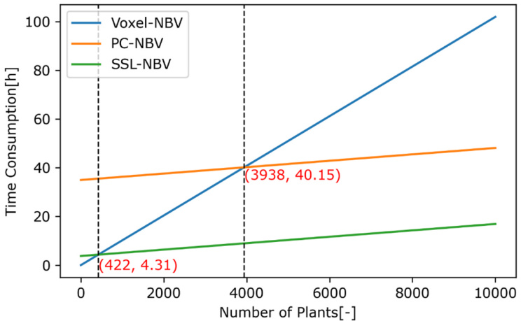  
Fig. 9. Approximate time required for various methods to be deployed in a 3D plant reconstruction scenario. X-axis represents the number of reconstructing plants, and $\mathbf { y }$ -axis represents the required time.  

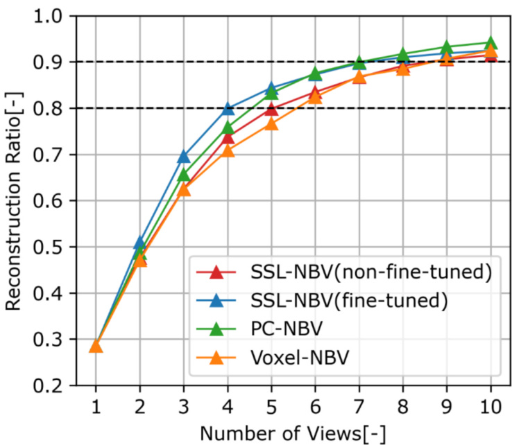  
Fig. 10. Average reconstruction ratio of SSL-NBV in experiment S2 across cross-validation (150 plant reconstruction cycles) compared to base­ line methods.  

The non-fine-tuned SSL-NBV showed lower reconstruction efficiency than PC-NBV, indicating that weakly-supervised learning offers lower generalization compared to strongly-supervised learning. However, SSLNBV was trained with significantly fewer annotations (50,000 for SSLNBV compared to 264,000 for PC-NBV) than PC-NBV, still achieved a similar final reconstruction ratio (addressing Question 2). After auto­ matic online fine-tuning, SSL-NBV outperformed PC-NBV. Although the improvement was small, we attribute this to the fact that experiment S2 still shared some similarities with experiment S1, enabling PC-NBV to generalize to this environment. The Voxel-NBV yielded the poorest re­ sults, possibly because the grid space was enlarged to allow more vari­ ation in plant position in this scenario (refer to section 2.2.1). This introduced more empty voxels, impacting the performance of VoxelNBV, as this method aimed to reconstruct the entire grid space rather than focusing solely on the plant.  

Furthermore, we evaluated the model’s ability to handle catastrophic forgetting. This evaluation consisted of three phases: (1) initial training on tomato plants (consistent with experiment S1), (2) fine-tuning on pepper plants (aligned with experiment S2), and (3) retraining on tomato plants, using the network weights obtained after phase (2). As shown in Fig. 11, a slight decrease in the reconstruction ratio was observed at the beginning of phase (3), indicating that pro­ longed adaptation to novel plants poses challenges for SSL-NBV in fully retaining knowledge of previously learned plants. However, the method still achieved a reconstruction ratio above $9 0 \%$ , demonstrating its feasibility for tomato plant reconstruction tasks. But for scenarios requiring higher reconstruction accuracy, network re-training may be necessary to ensure optimal results for tomato plants.  

# 3.3. Real world  

The results of experiment RW addressed Question 4 by evaluating the SSL-NBV method in a real-world scenario. Fig. 12 illustrates the average reconstruction ratio of SSL-NBV compared to other methods over crossvalidation. SSL-NBV showed effectiveness in this real-world scenario, outperforming non-NBV planners in both reconstruction quality and efficiency. Specifically, SSL-NBV achieved a $\tau = 0 . 8$ within 7 viewpoints, which is 2 and 3 views faster than the Random and Pre-defined planners, respectively. SSL-NBV reached a $\tau = 0 . 9$ after 12 views, a threshold that the non-NBV methods failed to reach. SSL-NBV reconstructed approxi­ mately $9 2 . 5 \%$ of the plant (corresponding to 7,000 to 13,000 points in 3D reconstruction depending on the size of plants), representing a $3 . 5 \%$ and $8 . 5 \%$ improvement over the Random and Pre-defined planners, respectively.  

Notably, in this experiment, we approximated the ground-truth plant model by merging point clouds from all viewpoints, which made the ground-truth IG calculation and offline fine-tuning of PC-NBV possible. However, in real-world applications, ground-truth plant models are not available for PC-NBV fine-tuning. In contrast, our SSL-NBV does not require ground-truth plant models and automates the entire training/ fine-tuning process to collect its own training data and to continuously optimize the network to adapt to novel plants and environments in a self-supervised manner.  

Fig. 13 shows the trend of SSL-NBV’s reconstruction ratio as an increased number of annotations were used during online learning, with RT3 as the test plant. During fine-tuning, 1,920 samples were recollected to retrain PC-NBV, resulting in $A ^ { o f f } = 6 3 , 3 6 0$ IG annotations. To align with PC-NBV (with 63,360 annotations), the training of SSL-NBV was extended to 63,360 training iteration. The figure shows SSL-NBV reached a similar reconstruction ratio $\mathbf { \dot { p } }$ -value $> 0 . 0 5 \dot { }$ ) with PC-NBV using only $2 1 \%$ of the annotations, demonstrating a $7 9 \%$ reduction in the need for ground-truth annotations.  

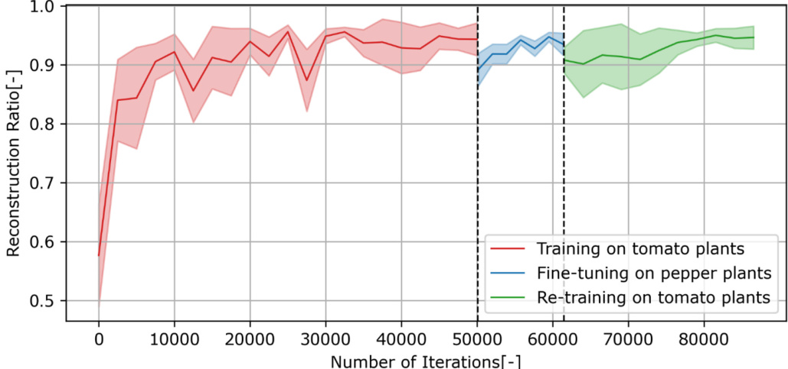  
Fig. 11. Reconstruction ratio of SSL-NBV during online training across three phases: initial training on tomato plants (red), fine-tuning on pepper plants (blue), and re-training on tomato plants (green).  

J. Ci et al.  

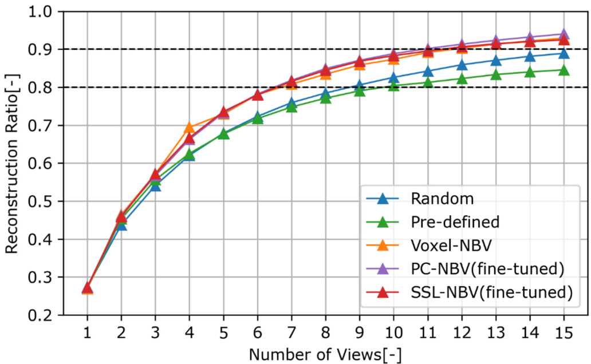  
Fig. 12. Average reconstruction ratio of SSL-NBV in experiment RW evaluated using cross-validation (150 plant reconstruction cycles) compared to the base­ line methods.  

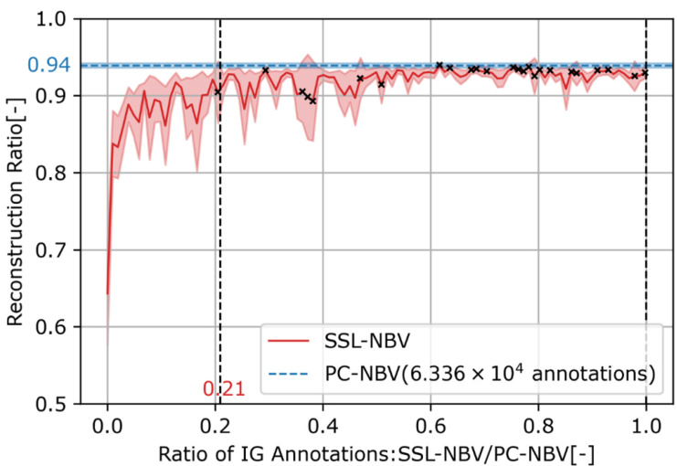  
Fig. 13. The plant-reconstruction ratio as a function of the number of training annotations used during online learning, using RT3 as the test plant. The shaded regions represent the $9 5 \%$ confidence interval over 50 plant reconstruction cycles. The $\mathbf { x }$ -axis shows the ratio of IG annotations used by SSL-NBV over PCNBV. Crosses ${ \bf \Pi } ( { \bf x } )$ indicate reconstruction ratios not significantly different (pvalue $> 0 . 0 5 \dot { }$ ) between SSL-NBV and PC-NBV.  

Fig. 14 illustrates examples of 3D reconstruction results for various plant types, including simulated tomato plants (experiment S1), simu­ lated pepper plants (experiment S2), and real-world tomato plants (experiment RW). The point clouds of simulated and real-world plants exhibit differences in point density, due to the use of varying voxel sizes for point cloud downsampling (see section 2.1.3 for details). All plants achieved a reconstruction ratio exceeding $9 0 \%$ by the end of the reconstruction cycle, with 10 views allowed for simulated plants and 15 views for real-world plants, demonstrating the effectiveness of SSL-NBV in both simulated and real-world environments. Notably, the groundtruth point cloud for real-world plants contains noise, particularly at the edges, which may reduce the reconstruction ratio as the noise is challenging to reconstruct accurately.  

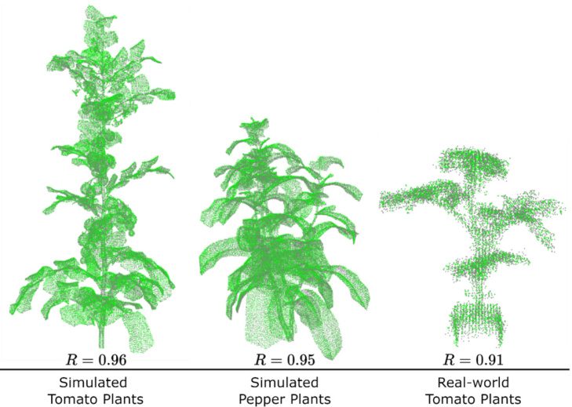  
Fig. 14. 3D reconstruction results across experiments S1 (10 views), S2 (10 views), and RW (15 views). Ground-truth point clouds are shown in grey, and reconstructed point clouds are displayed in green. The reconstruction ratio for each reconstruction is indicated at the bottom. Simulated point clouds were downsampled using a $0 . 0 0 3 \mathrm { { m } }$ voxel size, while real-world point clouds used a $0 . 0 1 \mathrm { { m } }$ voxel size, resulting in differences in point density.  

# 4. Discussion  

# 4.1. Comparison with relevant studies  

The results demonstrated that learning-based NBV methods achieved plant reconstruction performance comparable to the classic Voxel-based NBV method, while significantly improving IG prediction speed. This aligns with Han et al. (2022), who developed a Double Branch NBV Network (DB-NBV) for 3D object reconstruction and evaluated it on synthetic datasets. Our findings also support Zapotezny-Anderson and Lehnert (2019), who showed that using a deep neural network for direct IG prediction improved viewpoint planning efficiency. Although SSLNBV required online training during NBV planning, slightly reducing overall efficiency, it remained more efficient than voxel-based methods. Importantly, online learning is only necessary for novel plants; for pre­ viously fine-tuned targets, this step is unnecessary, preserving high efficiency.  

Compared to PC-NBV, which relied on strongly-supervised learning with fully labelled IG data, our method required only sparse IG labels and achieved similar plant reconstruction efficiency while significantly reducing the number of ground-truth IG annotations. Our findings are consistent with Stutz and Geiger (2020), who demonstrated that using $3 { \mathrm { - } } 1 0 \%$ of annotations can yield comparable results to fully annotated training data in 3D shape completion tasks. Similarly, Cheng et al. (2023) showed that using weakly-supervised labels can achieve com­ parable performance to fully labelled data in image segmentation tasks. To our knowledge, the application of weakly-supervised learning to NBV systems has not been explored, with existing approaches like those of Han et al. (2022), Zeng et al. (2020) and Mendoza et al. (2020) relying on extensive IG labels.  

Notably, our method has the capability to automatically fine-tune for novel plants and environments without human intervention. When in­ tegrated with robotics, it enabled life-long and continuous online learning, which is crucial for robotic agricultural operations where plants and environments are constantly changing. This capability is absent in existing learning-based NBV methods, which typically rely on pre-collected offline data for training.  

We conducted a quantitative analysis of the method’s performance in real-world plant reconstruction, an important evaluation lacking in similar studies. While Han et al. (2022) applied their method to realworld plant reconstruction, their evaluation was qualitative and lacked quantitative comparison. Furthermore, their approach required complete object models for ground-truth IG calculation, limiting its ability to be fine-tuned for real-world plants where such models are unavailable. This issue was also present in the works of Zeng et al. (2020) and Mendoza et al. (2020). Instead, our method addressed this by improving the IG metric and eliminating the need for complete plant models in IG calculation, enabling continuous fine-tuning for real-world plants.  

In summary, this study presented SSL-NBV, a method capable of automatically adapting to novel plants and environments, allowing for life-long and continuous improvement of the robot during task execu­ tion without human intervention. Through comprehensive evaluation in both simulation and real-world experiments, we demonstrated its effi­ ciency in IG prediction and its ability to significantly reduce the need for IG annotations. This work offers valuable insights for future applications of NBV methods in agriculture, particularly in reducing the reliance on extensive annotations and enhancing scalability in dynamic environments.  

# 4.2. Limitations and future improvements  

# 4.2.1. Flexible viewpoint sampling for different-sized plants  

Our method used a global viewpoint sampling approach, where a set of candidate viewpoints were pre-sampled, and the NBV planner itera­ tively selected from this set to reconstruct the plant. This approach is efficient, as it enables a global search for the next best viewpoint. However, it restricted the selection to fixed viewpoints, potentially missing optimal views and reducing reconstruction quality. Addition­ ally, the use of a fixed set of candidate views can limit the method’s scalability for different plant sizes. Zeng et al. (2022) and Lehnert et al. (2018) addressed this challenge with relative viewpoint planning, where the next camera pose was determined based on incremental movements from the current view. These methods are not restricted to fixed view­ points and are adaptable to various plant sizes. However, local view planning methods often face issues with local maxima. In future work, we aim to integrate SSL-NBV with local NBV methods, facilitating global planning for large-scale search (e.g., entire plant or row of plants) while enabling detailed reconstruction of plant parts not visible from fixed viewpoints.  

# 4.2.2. Trajectory optimization of camera view Our approach performed NBV planning on a viewpoint-wise manner,  

selecting the next best view solely based on the maximization of IG. However, this can lead to low view trajectory efficiency, requiring extensive camera movement to achieve a similar level of plant recon­ struction. Ideally, NBV planning should consider view trajectory opti­ mization, i.e., minimizing camera movement while maintaining high reconstruction efficiency. To address this, we propose integrating a trajectory optimization mechanism into the existing NBV planning process using a DRL algorithm. DRL is widely used in path planning as it considers long-term impacts, learning a policy about task execution that maximizes cumulative rewards. In the NBV problem, incorporating both reconstruction efficiency and camera movement into the reward func­ tion could enable efficient plant reconstruction while reducing camera movement. Another potential solution is to add constraints to the cur­ rent view selection process, allowing only nearby views to be selected after weighing camera movement against the predicted IG.  

# 4.3. Impact of experimental conditions  

# 4.3.1. Size and distribution of set of candidate viewpoints  

The size of the candidate set can affect the network’s training effi­ ciency and the quality of plant reconstruction. Increasing the candidate set size can improve reconstruction by capturing previously unseen plant parts but also reduces training efficiency and increases the need for training data. In this study, we used a set of 33 viewpoints, which balanced plant reconstruction and training efficiency. However, for larger plants or row of plants reconstruction tasks, expanding the candidate set may be necessary to fully capture all plant parts. A larger candidate set can amplify the advantages of NBV methods over non-NBV methods in plant reconstruction, as it becomes more difficult for nonNBV methods to select high-IG viewpoints, while NBV approaches, given sufficient training (for DL-NBV) or time (for Voxel-NBV), can effectively identify the next-best viewpoint, improving plant recon­ struction results.  

In this study, we employed cylindrical and semi-cylindrical distri­ butions in simulation and real-world environments, respectively, similar to Golbach et al. (2016). This configuration facilitated plant recon­ struction because the plants were centrally located so that each view­ point had a high probability of capturing a plant part. However, in terms of evaluation, this setup may narrow the gap between NBV and non-NBV methods by making it easier for non-NBV methods to select viewpoints with high IG.  

# 4.3.2. Limited real-world plants  

Three real plants were used in this study to evaluate the method’s performance in real-world scenarios. While testing on only three plants may not fully evaluate the method’s overall performance due to the limited coverage of plant variations, we believe it still demonstrated the feasibility of the method for real plant reconstruction. Firstly, data for each plant were collected from four different poses, adding variations to the training and testing sets. Secondly, comprehensive evaluations were conducted in simulations with a wide range of plant variations, which helped validate and support the real-world results. Thirdly, all results were obtained through $\mathbf { k }$ -fold cross-validation, which enhanced the robustness of the evaluation. We anticipate that testing on more real plants, the methods would yield similar patterns to those observed in our study. However, to thoroughly evaluate the method’s performance in the real world, we recommend conducting further experiments that include a broader range of plants and plant variations.  

Additionally, although we performed a three-step noise removal process on the point cloud, there was still significant noise, especially at the edges of the ground-truth point cloud (Fig. 14 provides visual ex­ amples). This noise reduced the reconstruction ratio, as noise present in the ground-truth point cloud may be absent in the reconstruction. To minimize the effect of noise, we set the threshold $\delta$ to $0 . 0 1 \mathrm { { m } }$ (refer to Eq. (2) for detailed explanation). Although this relatively large threshold may overestimate reconstruction performance by easily counting a point in the ground truth as reconstructed, it ensured fairness from a comparative perspective and did not affect the comparison between methods, as the same threshold was applied to all methods. We believe the impact of camera noise can be decreased in the future as technology advances and RGB-D cameras become more accurate and cheaper. Furthermore, since complete 3D models of real-world plants were un­ available, the ground-truth model was approximated by merging point clouds from all viewpoints. Although this method introduced imper­ fections into the ground-truth, it maintained fairness in evaluation, as all methods were assessed using the same criteria. The effect of these im­ perfections on the reconstruction ratio is difficult to quantify, as it is affected by multiple factors like noise, and evaluation metric. However, we believe that even with a perfect ground-truth, the comparative per­ formance between methods would remain consistent.  

# 4.3.3. SSL-NBV training iterations  

During SSL-NBV online training, we set $T = 5 0 { , } 0 0 0$ , 12,400, and 25,000 iterations for experiments S1, S2, and RW, respectively. These settings allowed the method to achieve comparable performance in plant reconstruction to PC-NBV while significantly reducing training time. However, as observed in Fig. 8 and Fig. 13, with additional training iterations, the plant reconstruction performance of SSL-NBV could be further improved, bringing it closer to that of PC-NBV. Thus, we believe that the results in Fig. 7, Fig. 10, and Fig. 12 of SSL-NBV could also show improved performance if extended training iterations were applied, potentially reaching similar results with PC-NBV.  

Furthermore, the number of self-supervised learning iterations can be reduced or even eliminated when SSL-NBV is applied to plants or environments it has already learned. In our experiments, self-supervised learning was consistently enabled to allow the method to adapt to novel plants and environments. While this ensures flexibility, it also introduces additional time for network optimization. This process can introduce additional time for network optimization. Results from experiment S2 demonstrated SSL-NBV’s generalization capability for a different plant type, suggesting that self-supervised learning can be deactivated for familiar scenarios. Disabling this functionality for known plants and environments would significantly improve NBV planning efficiency and prevent time consumption on plants that do not require fine-tuning, enhancing the method’s practicality.  

# 5. Conclusion  

This paper proposed an SSL-NBV algorithm to enhance learningbased NBV methods through self-supervised learning, enabling effi­ cient and automatic training of neural networks to predict the IG of next viewpoints, which allows to optimize 3D plant reconstruction. Using a robot to actively change viewpoints, the method facilitated life-long and continuous online learning without requiring human annotations. To ensure efficient online learning, an improved IG metric, experience replay, and weakly-supervised learning techniques were incorporated. A comprehensive evaluation with k-fold cross-validation was conducted to address the research questions.  

The results of experiment S1 showed the reconstruction quality and efficiency for different multi-view reconstruction methods (answering Question 1). The proposed SSL-NBV method outperformed non-NBV methods, achieving the level of $9 0 \%$ plant reconstruction with fewer views, respectively 1 view and 4 views for the Pre-defined planner and the Random planner. While SSL-NBV method achieved similar recon­ struction quality to other NBV methods, it excelled in computational speed. Specifically, SSL-NBV achieved IG prediction in 0.0038s, making it 842 times faster than the classic Voxel-based NBV. When online learning was enabled, SSL-NBV required additional steps for network training, taking $0 . 0 9 9 s$ per training iteration, which was still 32 times faster than Voxel-based NBV. Compared to PC-NBV, which used offline strongly-supervised learning, the proposed method achieved compara­ ble plant reconstruction performance with only $9 \%$ of the IG annotations (answering Question 2). Moreover, this was achieved purely in a selfsupervised way, without the need of human annotation or a groundtruth plant model. In terms of deployment efficiency, Voxel-based NBV was more efficient for small-scale plant reconstruction tasks (less than 422 plants), as it eliminates the need for data collation and training steps. However, SSL-NBV’s efficiency advantages became increasingly pronounced as the number of plants grew, making it more suitable for larger-scale applications. Question 3 was addressed in experiment S2. After online self-supervised learning, the method achieved $8 0 \%$ and $9 0 \%$ plant reconstruction 1 and 2 views faster than the non-fine-tuned network, respectively, demonstrating the method’s adaptability to new environment though online self-supervised learning (answer Question 3). Also, a clear improvement in plant reconstruction during online learning (as shown in Fig. 8, Fig. 11, and Fig. 13) further confirmed the method’s adaptability. Finally, the results of experiment RW addressed showed that the proposed method could also successfully be applied in the real world (Question 4), achieved $9 2 . 5 \%$ plant reconstruction after online fine-tuning on real plants. It outperformed the Random and Pre-defined planners by around $3 . 5 \%$ and $8 . 5 \%$ , respectively, while reducing the need for IG annotations by $7 9 \%$ compared to PC-NBV.  

In conclusion, the proposed SSL-NBV method was capable of efficient 3D plant reconstruction in simulated and real-world environments and could adapt to novel environments through online self-supervised learning without the need of any human intervention. Although this work was demonstrated using single plants, we believe that the pro­ posed method can be adapted in future research for robotic plant reconstruction in more complex agricultural environments. Adaptations should overcome the current limitation of having a small number of fixed candidate views, and instead use more flexible view sampling and planning of view trajectories.  

# CRediT authorship contribution statement  

Jianchao Ci: Writing – original draft, Software, Methodology, Investigation, Formal analysis, Data curation, Conceptualization. Eldert J. van Henten: Writing – review & editing, Supervision, Funding acquisition, Conceptualization. Xin Wang: Writing – review & editing, Supervision, Conceptualization. Akshay K. Burusa: Writing – review & editing, Software, Data curation, Conceptualization. Gert Kootstra: Writing – review & editing, Supervision, Funding acquisition, Conceptualization.  

# Declaration of competing interest  

The authors declare that they have no known competing financial interests or personal relationships that could have appeared to influence the work reported in this paper.  

# Acknowledgements  

This work was supported by the China Scholarship Council (No.202107720034); and the Netherlands Organisation for Scientific Research (NWO) project “FlexCRAFT: Cognitive Robots for Flexible Agro-Food Technology”, grant P17-01. We thank the members of the Agricultural Biosystems Engineering (ABE) group at Wageningen Uni­ versity for their insightful discussions and valuable feedback.  

# Data availability  

Data will be made available on request.  

# References  

Atefi, A., Ge, Y., Pitla, S., Schnable, J., 2021. Robotic technologies for high-throughput plant phenotyping: contemporary reviews and future perspectives. Front Plant Sci. https://doi.org/10.3389/fpls.2021.611940.   
Atefi, A., Ge, Y., Pitla, S., Schnable, J., 2019. In vivo human-like robotic phenotyping of leaf traits in maize and sorghum in greenhouse. Comput Electron Agric 163. https:// doi.org/10.1016/j.compag.2019.104854.   
Boogaard, F.P., van Henten, E.J., Kootstra, G., 2023. The added value of 3D point clouds for digital plant phenotyping – a case study on internode length measurements in cucumber. Biosyst Eng 234, 1–12. https://doi.org/10.1016/j. biosystemseng.2023.08.010.   
Boogaard, F.P., van Henten, E.J., Kootstra, G., 2022. Improved point-cloud segmentation for plant phenotyping through class-dependent sampling of training data to battle class imbalance. Front Plant Sci 13. https://doi.org/10.3389/fpls.2022.838190.   
Boogaard, F.P., van Henten, E.J., Kootstra, G., 2021. Boosting plant-part segmentation of cucumber plants by enriching incomplete 3D point clouds with spectral data. Biosyst Eng 211, 167–182. https://doi.org/10.1016/j.biosystemseng.2021.09.004.   
Burusa, A.K., van Henten, E.J., Kootstra, G., 2022. Attention-driven Active Vision for Efficient Reconstruction of Plants and Targeted Plant Parts.   
Cheng, Y., Lan, S., Fan, X., Tjahjadi, T., Jin, S., Cao, L., 2023. A dual-branch weakly supervised learning based network for accurate mapping of woody vegetation from remote sensing images. Int J Appl Earth Obs Geoinf 124, 103499.   
Deng, X., Xiang, Y., Mousavian, A., Eppner, C., Bretl, T., Fox, D., 2020. Self-supervised 6D Object pose estimation for robot manipulation. Proc - IEEE Int. Conf. Robot Automat. 3665–3671. https://doi.org/10.1109/ICRA40945.2020.9196714.   
Gibbs, J.A., Pound, M., French, A.P., Wells, D.M., Murchie, E., Pridmore, T., 2018. Plant phenotyping: an active vision cell for three-dimensional plant shoot reconstruction1 [OPEN]. Plant Physiol. 178, 524–534. https://doi.org/10.1104/PP.18.00664.   
Gibbs, J.A., Pound, M.P., French, A.P., Wells, D.M., Murchie, E.H., Pridmore, T.P., 2020. Active vision and surface reconstruction for 3D plant shoot modelling. IEEE/ACM Trans Comput Biol Bioinf 17, 1907–1917. https://doi.org/10.1109/ TCBB.2019.2896908.   
Golbach, F., Kootstra, G., Damjanovic, S., Otten, G., van de Zedde, R., 2016. Validation of plant part measurements using a 3D reconstruction method suitable for highthroughput seedling phenotyping. Mach Vis Appl 27, 663–680. https://doi.org/ 10.1007/s00138-015-0727-5.   
Han, Y., Zhan, I.H., Zhao, W., Liu, Y.-J., 2022. A double branch next-best-view network and novel robot system for active object reconstruction.   
Hartmann, A., Czauderna, T., Hoffmann, R., Stein, N., Schreiber, F., 2011. HTPheno: An image analysis pipeline for high-throughput plant phenotyping. BMC Bioinf 12. https://doi.org/10.1186/1471-2105-12-148.   
Jansen, M., Gilmer, F., Biskup, B., Nagel, K.A., Rascher, U., Fischbach, A., Briem, S., Dreissen, G., Tittmann, S., Braun, S., De Jaeger, I., Metzlaff, M., Schurr, U., Scharr, H., Walter, A., 2009. Simultaneous phenotyping of leaf growth and chlorophyll fluorescence via Growscreen Fluoro allows detection of stress tolerance in Arabidopsis thaliana and other rosette plants. Funct Plant Biol 36, 902–914. https://doi.org/10.1071/FP09095.   
Kahn, G., Abbeel, P., Levine, S., 2020. BADGR: An Autonomous Self-Supervised Learning-Based Navigation System.   
Koenig, N., Howard, A., 2004. Design and use paradigms for gazebo, an open-source multi-robot simulator. In: 2004 IEEE/RSJ International Conference on Intelligent Robots and Systems (IROS)(IEEE Cat. No. 04CH37566). IEEE, pp. 2149–2154.   
Lehnert, C., Tsai, D., Eriksson, A., McCool, C., 2018. 3D Move to See: Multi-perspective visual servoing for improving object views with semantic segmentation.   
Lu, H., Tang, L., Whitham, S.A., Mei, Y., 2017. A robotic platform for corn seedling morphological traits characterization. Sensors (Switzerland) 17. https://doi.org/ 10.3390/s17092082.   
Mendoza, M., Vasquez-Gomez, J.I., Taud, H., Sucar, L.E., Reta, C., 2020. Supervised learning of the next-best-view for 3d object reconstruction. Pattern Recogn Lett 133, 224–231. https://doi.org/10.1016/j.patrec.2020.02.024.   
Minervini, M., Abdelsamea, M.M., Tsaftaris, S.A., 2014. Image-based plant phenotyping with incremental learning and active contours. Ecol Inform 23, 35–48. https://doi. org/10.1016/j.ecoinf.2013.07.004.   
Mnih, V., Kavukcuoglu, K., Silver, D., Graves, A., Antonoglou, I., Wierstra, D., Riedmiller, M., 2013. Playing Atari with Deep Reinforcement Learning.   
Poland, J.A., Rife, T.W., 2012. Genotyping-by-sequencing for plant breeding and genetics. Plant Genome 5. https://doi.org/10.3835/plantgenome2012.05.0005.   
Polder, G., Hofstee, J.W., 2014. Phenotyping large tomato plants in the greenhouse using a 3D light-field camera. In: 2014 Montreal, Quebec Canada July 13–July 16, 2014. American Society of Agricultural and Biological Engineers, p. 1.   
Quigley, M., Conley, K., Gerkey, B., Faust, J., Foote, T., Leibs, J., Wheeler, R., Ng, A.Y., 2009. ROS: an open-source Robot Operating System. In: ICRA Workshop on Open Source Software. Kobe, Japan, p. 5.   
Shi, W., van de Zedde, R., Jiang, H., Kootstra, G., 2019. Plant-part segmentation using deep learning and multi-view vision. Biosyst Eng 187, 81–95. https://doi.org/ 10.1016/j.biosystemseng.2019.08.014.   
Stutz, D., Geiger, A., 2020. Learning 3D shape completion under weak supervision. Int J Comput Vis 128, 1162–1181. https://doi.org/10.1007/s11263-018-1126-y.   
Thapa, S., Zhu, F., Walia, H., Yu, H., Ge, Y., 2018. A novel LiDAR-Based instrument for high-throughput, 3D measurement of morphological traits in maize and sorghum. Sensors (switzerland) 18. https://doi.org/10.3390/s18041187.   
Tisne´, S., Serrand, Y., Bach, L., Gilbault, E., Ben Ameur, R., Balasse, H., Voisin, R., Bouchez, D., Durand-Tardif, M., Guerche, P., Chareyron, G., Da Rugna, J., Camilleri, C., Loudet, O., 2013. Phenoscope: an automated large-scale phenotyping platform offering high spatial homogeneity. Plant J 74, 534–544. https://doi.org/ 10.1111/tpj.12131.   
van der Heijden, G., Song, Y., Horgan, G., Polder, G., Dieleman, A., Bink, M., Palloix, A., van Eeuwijk, F., Glasbey, C., 2012. SPICY: towards automated phenotyping of large pepper plants in the greenhouse. Funct Plant Biol 39, 870–877.   
Va´zquez-Arellano, M., Reiser, D., Paraforos, D.S., Garrido-Izard, M., Griepentrog, H.W., 2018. Leaf area estimation of reconstructed maize plants using a time-of-flight camera based on different scan directions. Robotics 7. https://doi.org/10.3390/ robotics7040063.   
Wang, Y., James, S., Stathopoulou, E.K., Beltra´n-Gonza´lez, C., Konishi, Y., Del Bue, A., 2019. Autonomous 3-d reconstruction, mapping, and exploration of indoor environments with a robotic arm. IEEE Robot Autom Lett 4, 3340–3347.   
Wang, Z., Schaul, T., Hessel, M., Lanctot, M., 2016. Dueling Network Architectures for Deep Reinforcement Learning Hado van Hasselt.   
Zaenker, T., Lehnert, C., McCool, C., Bennewitz, M., 2021a. Combining local and global viewpoint planning for fruit coverage. In: 2021 10th European Conference on Mobile Robots, ECMR 2021 - Proceedings. 10.1109/ECMR50962.2021.9568836.   
Zaenker, T., Smitt, C., McCool, C., Bennewitz, M., 2021b. Viewpoint planning for fruit size and position estimation. IEEE Int. Conf. Intell. Robot. Syst. 3271–3277. https:// doi.org/10.1109/IROS51168.2021.9636701.   
Zapotezny-Anderson, P., Lehnert, C., 2019. Towards active robotic vision in agriculture: a deep learning approach to visual servoing in occluded and unstructured protected cropping environments. IFAC-PapersOnLine. 120–125. https://doi.org/10.1016/j. ifacol.2019.12.508.   
Zeng, R., Zhao, W., Liu, Y.J., 2020. PC-NBV: A point cloud based deep network for efficient next best view planning, in: IEEE International Conference on Intelligent Robots and Systems. Institute of Electrical and Electronics Engineers Inc., pp. 7050–7057. 10.1109/IROS45743.2020.9340916.   
Zeng, X., Zaenker, T., Bennewitz, M., 2022. Deep Reinforcement Learning for Next-BestView Planning in Agricultural Applications 2323–2329.   
Zhang, H., Goodfellow, I., Metaxas, D., Odena, A., 2019. Self-attention generative adversarial networks. Int Conf Mach Learn. PMLR 7354–7363.   
Zhang, S., Sutton, R.S., 2017. A Deeper Look at Experience Replay.   
Zhou, Z.H., 2018. A brief introduction to weakly supervised learning. Natl Sci Rev. https://doi.org/10.1093/nsr/nwx106.  