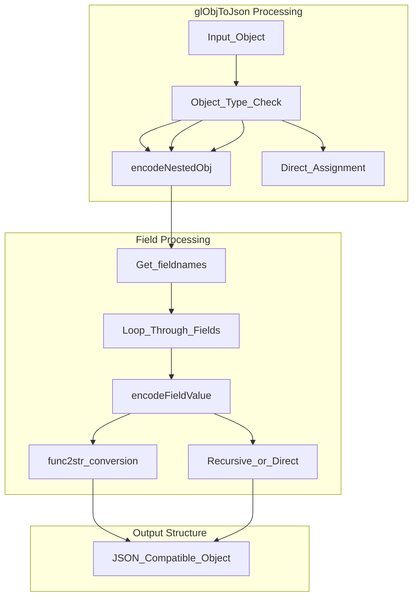
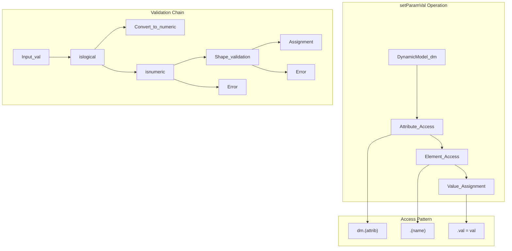

# DynamicModel and DynamicElement Classes

> **Relevant source files**
> * [README.md](https://github.com/greenpeer/GreenLight_Extensions/blob/fdc2b4c5/README.md)
> * [glObjToJson.m](https://github.com/greenpeer/GreenLight_Extensions/blob/fdc2b4c5/glObjToJson.m)
> * [setParamVal.m](https://github.com/greenpeer/GreenLight_Extensions/blob/fdc2b4c5/setParamVal.m)

This document explains the custom `DynamicModel` and `DynamicElement` classes that form the core data structures within the GreenLight Extensions system. These classes represent the structured model components that are processed by both the JSON serialization and parameter modification functions.

For information about the overall gl object structure and namespace organization, see [gl Object Structure](/greenpeer/GreenLight_Extensions/4.1-gl-object-structure). For details about how these classes are processed during JSON serialization, see [JSON Serialization Implementation Details](/greenpeer/GreenLight_Extensions/2.2-implementation-details).

## Class Hierarchy and Relationships

The `DynamicModel` and `DynamicElement` classes form a hierarchical structure within the GreenLight model ecosystem. `DynamicModel` serves as a container class that organizes multiple `DynamicElement` instances across different namespaces.

```

```

Sources: [README.md L37](https://github.com/greenpeer/GreenLight_Extensions/blob/fdc2b4c5/README.md#L37-L37)

 [setParamVal.m L13](https://github.com/greenpeer/GreenLight_Extensions/blob/fdc2b4c5/setParamVal.m#L13-L13)

 [glObjToJson.m L34](https://github.com/greenpeer/GreenLight_Extensions/blob/fdc2b4c5/glObjToJson.m#L34-L34)

## DynamicModel Class

The `DynamicModel` class acts as a container that organizes model components into logical namespaces. Each `DynamicModel` instance contains multiple `DynamicElement` objects accessible through attribute-based field access.

### Structure and Access Patterns

The `setParamVal` function demonstrates the typical access pattern for `DynamicModel` objects:

```
dm.(attrib).(name).val = val;
```

This pattern shows that:

* `dm` is a `DynamicModel` instance
* `attrib` represents namespace categories ('x', 'p', etc.)
* `name` identifies specific `DynamicElement` instances
* Each element has a `val` field containing the actual data

### Namespace Organization

`DynamicModel` objects organize their contents according to the GreenLight model structure:

| Namespace | Description | Content Type |
| --- | --- | --- |
| `x` | State variables | Time-dependent model states |
| `a` | Auxiliary variables | Derived calculations |
| `u` | Control inputs | System control parameters |
| `d` | Driving variables | External inputs |
| `p` | Parameters | Model configuration values |

Sources: [setParamVal.m L1-L13](https://github.com/greenpeer/GreenLight_Extensions/blob/fdc2b4c5/setParamVal.m#L1-L13)

 [README.md L29-L33](https://github.com/greenpeer/GreenLight_Extensions/blob/fdc2b4c5/README.md#L29-L33)

## DynamicElement Class

The `DynamicElement` class represents individual model components with a standardized three-field structure. Each element encapsulates both the definition and current value of a model variable or parameter.

### Field Structure

Every `DynamicElement` instance contains three core fields:

```

```

Sources: [README.md L56-L114](https://github.com/greenpeer/GreenLight_Extensions/blob/fdc2b4c5/README.md#L56-L114)

 [glObjToJson.m L68-L71](https://github.com/greenpeer/GreenLight_Extensions/blob/fdc2b4c5/glObjToJson.m#L68-L71)

### Field Details

#### label Field

The `label` field contains a string identifier that provides a human-readable name for the element, typically following the namespace.name convention (e.g., "x.co2Air", "p.alfaLeafAir").

#### def Field

The `def` field stores a MATLAB function handle that defines the mathematical relationship or calculation for the element. These function handles typically accept parameters `(x,a,u,d,p)` representing the different model namespaces.

#### val Field

The `val` field contains the actual numeric data for the element. This can be:

* Scalar values for parameters
* Time series data as matrices with 2 columns `[time, value]`
* Empty arrays for undefined values

Sources: [README.md L58-L113](https://github.com/greenpeer/GreenLight_Extensions/blob/fdc2b4c5/README.md#L58-L113)

 [setParamVal.m L10-L16](https://github.com/greenpeer/GreenLight_Extensions/blob/fdc2b4c5/setParamVal.m#L10-L16)

## Integration with GreenLight Extensions

Both `DynamicModel` and `DynamicElement` classes receive specialized handling within the GreenLight Extensions functions.

### Processing in glObjToJson

The `glObjToJson` function explicitly recognizes these classes and processes them through the `encodeNestedObj` function:



Sources: [glObjToJson.m L34](https://github.com/greenpeer/GreenLight_Extensions/blob/fdc2b4c5/glObjToJson.m#L34-L34)

 [glObjToJson.m L77](https://github.com/greenpeer/GreenLight_Extensions/blob/fdc2b4c5/glObjToJson.m#L77-L77)

 [glObjToJson.m L68-L71](https://github.com/greenpeer/GreenLight_Extensions/blob/fdc2b4c5/glObjToJson.m#L68-L71)

### Processing in setParamVal

The `setParamVal` function operates specifically on `DynamicModel` objects, providing direct access to modify `DynamicElement` values:



Sources: [setParamVal.m L1-L24](https://github.com/greenpeer/GreenLight_Extensions/blob/fdc2b4c5/setParamVal.m#L1-L24)

 [README.md L202-L217](https://github.com/greenpeer/GreenLight_Extensions/blob/fdc2b4c5/README.md#L202-L217)

## Data Type Handling and Constraints

The `DynamicElement` class enforces specific data type constraints through the `setParamVal` function:

### Value Constraints

| Data Type | Constraint | Action |
| --- | --- | --- |
| Logical | Any boolean value | Convert to numeric (1 or 0) |
| Numeric | Empty, scalar, or 2-column matrix | Accept directly |
| Other | Any non-numeric type | Reject with error |

### Shape Validation

The `val` field accepts three specific shapes:

* Empty arrays: `[]`
* Scalar values: Single numeric values
* Time series: `[n×2]` matrices where column 1 is time, column 2 is value

Sources: [setParamVal.m L3-L22](https://github.com/greenpeer/GreenLight_Extensions/blob/fdc2b4c5/setParamVal.m#L3-L22)