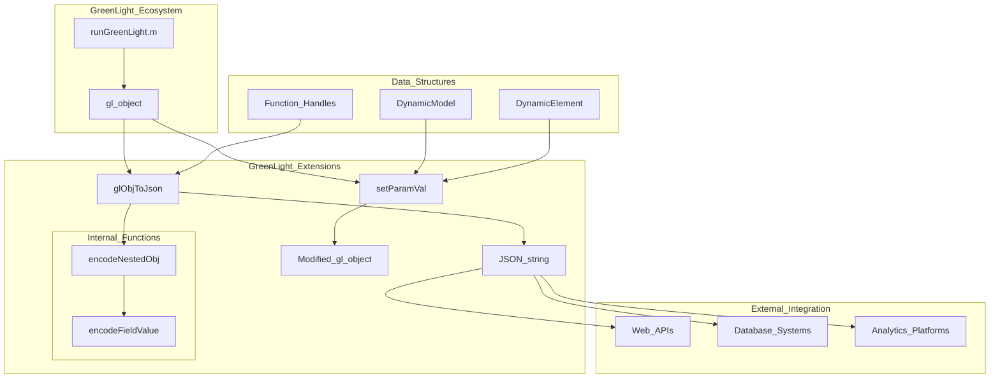
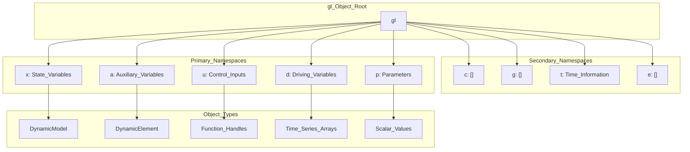
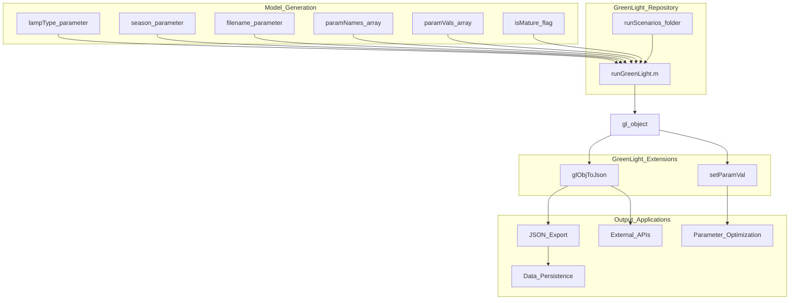

# Overview

> **Relevant source files**
> * [README.md](https://github.com/greenpeer/GreenLight_Extensions/blob/fdc2b4c5/README.md)

This document provides an introduction to the GreenLight Extensions system, explaining its purpose as MATLAB extensions for the GreenLight greenhouse model, its core functionality for JSON serialization and parameter modification, and how it integrates with the broader GreenLight ecosystem.

For detailed information about the JSON serialization functionality, see [JSON Serialization (glObjToJson)](/greenpeer/GreenLight_Extensions/2-json-serialization-(globjtojson)). For parameter modification capabilities, see [Parameter Modification (setParamVal)](/greenpeer/GreenLight_Extensions/3-parameter-modification-(setparamval)). For technical implementation details, see [Developer Reference](/greenpeer/GreenLight_Extensions/5-developer-reference).

## System Purpose and Scope

GreenLight Extensions is a MATLAB toolbox that extends the functionality of the GreenLight greenhouse simulation model by providing two core capabilities:

1. **JSON Serialization**: Converting complex MATLAB `gl` objects to JSON format via the `glObjToJson` function
2. **Parameter Modification**: Programmatically modifying model parameters through the `setParamVal` function

The system serves as an integration layer between the MATLAB-based GreenLight model and external systems, enabling data exchange, parameter optimization, and cross-platform interoperability.

**Sources:** [README.md L1-L11](https://github.com/greenpeer/GreenLight_Extensions/blob/fdc2b4c5/README.md#L1-L11)

## Core Functions Overview

### System Architecture - Core Functions



**Sources:** [README.md L23-L33](https://github.com/greenpeer/GreenLight_Extensions/blob/fdc2b4c5/README.md#L23-L33)

 [README.md L140-L143](https://github.com/greenpeer/GreenLight_Extensions/blob/fdc2b4c5/README.md#L140-L143)

### glObjToJson Function

The `glObjToJson` function converts MATLAB `gl` objects into JSON strings, handling complex nested structures including:

* **DynamicModel** and **DynamicElement** instances
* **Function handles** (converted to string representations)
* **Nested object hierarchies** with multiple namespaces
* **Time series data** and parameter values

**Key Features:**

* Recursive processing of nested objects via `encodeNestedObj`
* Type-specific encoding through `encodeFieldValue`
* Function handle serialization to string format
* JSON-compatible output structure

**Sources:** [README.md L147-L162](https://github.com/greenpeer/GreenLight_Extensions/blob/fdc2b4c5/README.md#L147-L162)

 [README.md L26-L27](https://github.com/greenpeer/GreenLight_Extensions/blob/fdc2b4c5/README.md#L26-L27)

### setParamVal Function

The `setParamVal` function enables programmatic modification of parameters within `DynamicModel` objects:

```
setParamVal(gl, "x", "cFruit", 2.8e5)
```

**Key Features:**

* Parameter modification in `x` and `p` namespaces
* Type validation and coercion
* `DynamicElement` existence checking
* Input validation for logical-to-numeric conversion

**Sources:** [README.md L202-L217](https://github.com/greenpeer/GreenLight_Extensions/blob/fdc2b4c5/README.md#L202-L217)

 [README.md L29-L33](https://github.com/greenpeer/GreenLight_Extensions/blob/fdc2b4c5/README.md#L29-L33)

## Object Model and Namespaces

### gl Object Structure and Namespaces



The `gl` object contains organized namespaces that represent different aspects of the greenhouse model:

| Namespace | Purpose | Common Content |
| --- | --- | --- |
| `x` | State Variables | `co2Air`, `tAir`, dynamic model states |
| `a` | Auxiliary Variables | `tauShScrPar`, derived calculations |
| `u` | Control Inputs | `boil`, `shScr`, control signals |
| `d` | Driving Variables | `iGlob`, external conditions |
| `p` | Parameters | `alfaLeafAir`, `L`, `sigma`, model constants |
| `t` | Time Information | Simulation time stamps |

**Sources:** [README.md L54-L133](https://github.com/greenpeer/GreenLight_Extensions/blob/fdc2b4c5/README.md#L54-L133)

 [README.md L37-L38](https://github.com/greenpeer/GreenLight_Extensions/blob/fdc2b4c5/README.md#L37-L38)

## Integration Workflow

### GreenLight Integration Flow



The typical workflow involves:

1. **Model Generation**: Use `runGreenLight.m` from the GreenLight repository to create `gl` objects
2. **Data Processing**: Apply GreenLight Extensions functions for serialization or modification
3. **Integration**: Export to external systems or modify parameters for optimization

**Sources:** [README.md L21-L24](https://github.com/greenpeer/GreenLight_Extensions/blob/fdc2b4c5/README.md#L21-L24)

 [README.md L39-L43](https://github.com/greenpeer/GreenLight_Extensions/blob/fdc2b4c5/README.md#L39-L43)

## System Capabilities and Limitations

### Supported Data Types

The system handles various MATLAB data types within `gl` objects:

* **Custom Classes**: `DynamicModel`, `DynamicElement` instances
* **Function Handles**: Converted to string representations in JSON
* **Nested Structures**: Recursive processing of complex hierarchies
* **Numeric Arrays**: Time series data and parameter values
* **String Data**: Labels and metadata

### Current Limitations

* **Scope**: Designed specifically for GreenLight model objects
* **Function Handle Processing**: Assumes function handles are in `def` fields
* **Performance**: May not efficiently handle very large or complex objects
* **Type Coverage**: May not support all possible MATLAB data types or custom classes

**Sources:** [README.md L221-L226](https://github.com/greenpeer/GreenLight_Extensions/blob/fdc2b4c5/README.md#L221-L226)

## Use Cases and Applications

The GreenLight Extensions system enables several key use cases:

| Use Case | Primary Function | Description |
| --- | --- | --- |
| **Data Export** | `glObjToJson` | Export model data to JSON for web applications |
| **Parameter Tuning** | `setParamVal` | Programmatic parameter modification for optimization |
| **Cross-Platform Integration** | `glObjToJson` | Enable Python/R analytics on greenhouse data |
| **Model Persistence** | `glObjToJson` | Save model states to databases or files |
| **API Development** | Both functions | Build web services around greenhouse models |

**Sources:** [README.md L3-L4](https://github.com/greenpeer/GreenLight_Extensions/blob/fdc2b4c5/README.md#L3-L4)

 [README.md L136-L137](https://github.com/greenpeer/GreenLight_Extensions/blob/fdc2b4c5/README.md#L136-L137)