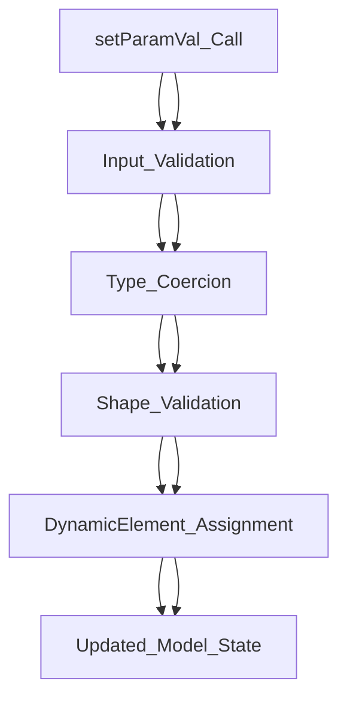
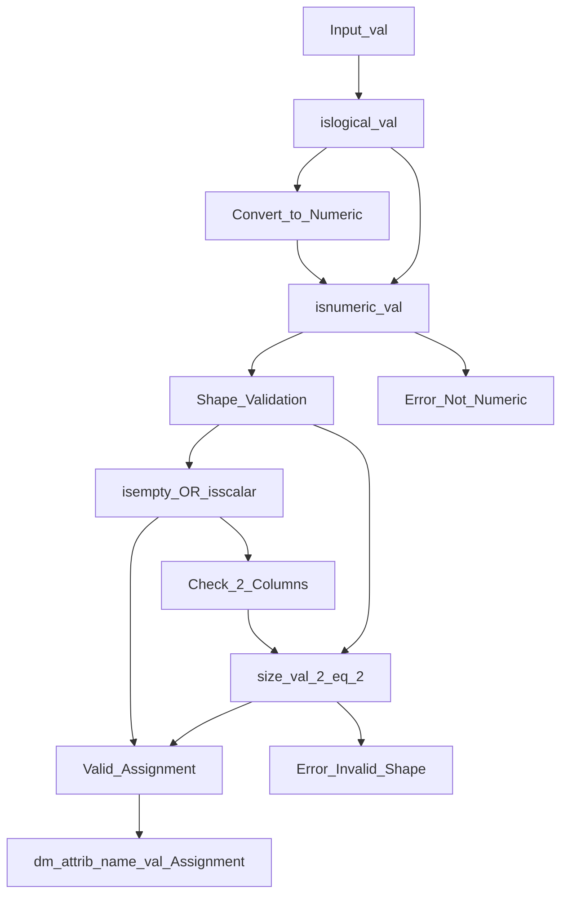
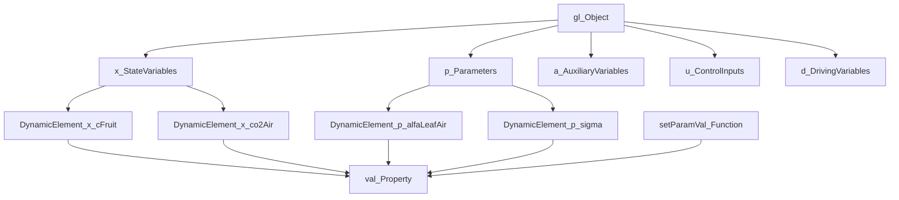
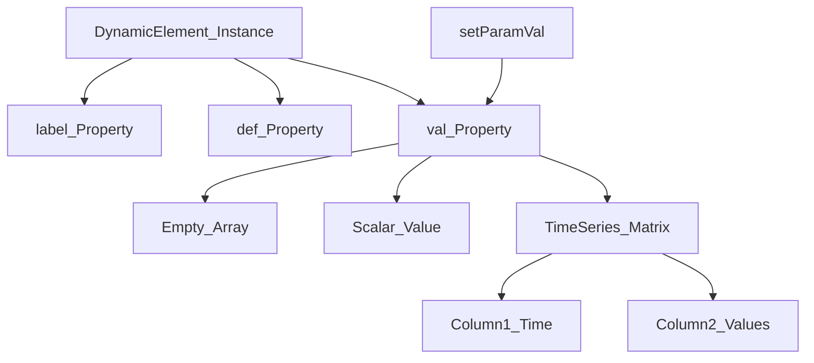
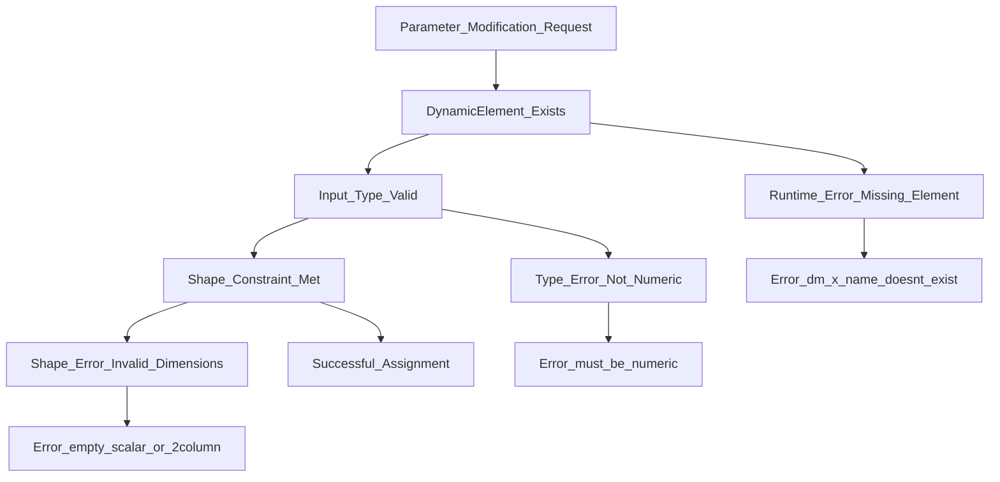

# Parameter Modification (setParamVal)

> **Relevant source files**
> * [README.md](https://github.com/greenpeer/GreenLight_Extensions/blob/fdc2b4c5/README.md)
> * [setParamVal.m](https://github.com/greenpeer/GreenLight_Extensions/blob/fdc2b4c5/setParamVal.m)

This document covers the `setParamVal` function, which provides programmatic parameter modification capabilities for GreenLight model objects. The function enables runtime modification of parameter values within `DynamicModel` objects, supporting both state variables and parameters through a validated interface that ensures type safety and data integrity.

For information about JSON serialization of gl objects, see [JSON Serialization (glObjToJson)](/greenpeer/GreenLight_Extensions/2-json-serialization-(globjtojson)). For details about the overall system architecture, see [Overview](/greenpeer/GreenLight_Extensions/1-overview). For comprehensive information about gl object structure and namespaces, see [Data Structures and Object Model](/greenpeer/GreenLight_Extensions/4-data-structures-and-object-model).

## Function Interface and Basic Usage

The `setParamVal` function provides a controlled interface for modifying parameter values within the GreenLight model's object hierarchy. It operates on `DynamicModel` objects and supports modification of parameters in both the state variable namespace (`x`) and parameter namespace (`p`).



**Function Signature and Parameters**

| Parameter | Type | Description | Valid Values |
| --- | --- | --- | --- |
| `dm` | DynamicModel | Target model object containing DynamicElement instances | Valid DynamicModel object |
| `attrib` | string | Namespace attribute specifying parameter category | `"x"` (state variables) or `"p"` (parameters) |
| `name` | string | Specific parameter name within the attribute namespace | Any valid DynamicElement name |
| `val` | numeric/logical | New parameter value to assign | Empty, scalar, or matrix with 2 columns |

**Basic Usage Examples**

The function is typically used to modify parameters within a GreenLight model instance:

```
% Modify a state variable parameter
setParamVal(gl, "x", "cFruit", 2.8e5)

% Modify a model parameter  
setParamVal(gl, "p", "alfaLeafAir", 5.2)
```

Sources: [README.md L29-L33](https://github.com/greenpeer/GreenLight_Extensions/blob/fdc2b4c5/README.md#L29-L33)

 [README.md L202-L218](https://github.com/greenpeer/GreenLight_Extensions/blob/fdc2b4c5/README.md#L202-L218)

 [setParamVal.m L1-L24](https://github.com/greenpeer/GreenLight_Extensions/blob/fdc2b4c5/setParamVal.m#L1-L24)

## Parameter Validation and Type Handling

The function implements comprehensive validation logic to ensure parameter modifications maintain model integrity and prevent runtime errors. The validation pipeline processes inputs through multiple stages of type checking and constraint enforcement.

**Type Coercion and Validation Pipeline**



**Validation Rules and Constraints**

The function enforces specific constraints on parameter values to maintain compatibility with the GreenLight model's expectations:

| Validation Stage | Rule | Purpose |
| --- | --- | --- |
| Logical Conversion | `val = 1 * val` if `islogical(val)` | Convert boolean values to numeric (true→1, false→0) |
| Type Check | `isnumeric(val)` must be true | Ensure only numeric data types are accepted |
| Shape Constraint | `isempty(val) \|\| isscalar(val) \|\| size(val,2)==2` | Allow empty, scalar, or time-series (2-column) data |
| Assignment | `dm.(attrib).(name).val = val` | Direct assignment to DynamicElement's val property |

**Error Handling Scenarios**

The function provides specific error messages for different validation failures:

* **Non-numeric input**: `"Argument for DynamicElement value must be numeric"`
* **Invalid shape**: `"Argument for DynamicElement value must be empty, a scalar, or a matrix with 2 columns"`

Sources: [setParamVal.m L3-L22](https://github.com/greenpeer/GreenLight_Extensions/blob/fdc2b4c5/setParamVal.m#L3-L22)

 [README.md L213-L214](https://github.com/greenpeer/GreenLight_Extensions/blob/fdc2b4c5/README.md#L213-L214)

## Integration with GreenLight Model Structure

The `setParamVal` function integrates directly with the hierarchical structure of GreenLight model objects, operating on the `DynamicElement` instances contained within attribute namespaces. Understanding this integration is crucial for effective parameter modification.

**GreenLight Object Hierarchy and Parameter Access**



**Namespace Support and Parameter Categories**

The function supports modification of parameters within different GreenLight model namespaces:

| Namespace | Attribute | Contains | Example Parameters |
| --- | --- | --- | --- |
| State Variables | `"x"` | Dynamic state variables | `cFruit`, `co2Air`, `tAir` |
| Parameters | `"p"` | Model parameters | `alfaLeafAir`, `sigma`, `L` |

**DynamicElement Structure and Value Assignment**

Each parameter in the GreenLight model is represented as a `DynamicElement` object with specific properties. The `setParamVal` function specifically targets the `val` property of these elements:



Sources: [README.md L29-L33](https://github.com/greenpeer/GreenLight_Extensions/blob/fdc2b4c5/README.md#L29-L33)

 [setParamVal.m L13](https://github.com/greenpeer/GreenLight_Extensions/blob/fdc2b4c5/setParamVal.m#L13-L13)

 [README.md L54-L133](https://github.com/greenpeer/GreenLight_Extensions/blob/fdc2b4c5/README.md#L54-L133)

## Error Handling and Edge Cases

The `setParamVal` function implements robust error handling to prevent invalid parameter modifications that could compromise model integrity. Understanding these error conditions is essential for proper usage and debugging.

**Error Classification and Response Strategy**



**Specific Error Conditions and Messages**

| Error Type | Condition | Error Message | Recovery Strategy |
| --- | --- | --- | --- |
| Missing DynamicElement | `dm.(attrib).(name)` doesn't exist | Runtime error from MATLAB | Verify parameter name and namespace |
| Type Validation | `~isnumeric(val)` after logical conversion | `"Argument for DynamicElement value must be numeric"` | Convert input to numeric type |
| Shape Validation | Invalid matrix dimensions | `"Argument for DynamicElement value must be empty, a scalar, or a matrix with 2 columns"` | Reshape data or provide correct format |

**Supported Value Formats and Use Cases**

The function accepts three distinct value formats, each serving different modeling purposes:

| Format | Use Case | Example | Description |
| --- | --- | --- | --- |
| Empty Array | Reset/clear parameter | `[]` | Removes existing parameter value |
| Scalar Value | Constant parameter | `2.8e5` | Single constant value throughout simulation |
| Time Series Matrix | Dynamic parameter | `[0, 100; 300, 150]` | Time-varying parameter with [time, value] pairs |

**Logical Value Handling**

The function automatically converts logical (boolean) values to their numeric equivalents, enabling convenient parameter setting with boolean expressions:

```
% These are equivalent:
setParamVal(gl, "p", "lampEnabled", true)   % Converted to 1
setParamVal(gl, "p", "lampEnabled", 1)      % Direct numeric
```

Sources: [setParamVal.m L3-L6](https://github.com/greenpeer/GreenLight_Extensions/blob/fdc2b4c5/setParamVal.m#L3-L6)

 [setParamVal.m L8-L22](https://github.com/greenpeer/GreenLight_Extensions/blob/fdc2b4c5/setParamVal.m#L8-L22)

 [README.md L143](https://github.com/greenpeer/GreenLight_Extensions/blob/fdc2b4c5/README.md#L143-L143)