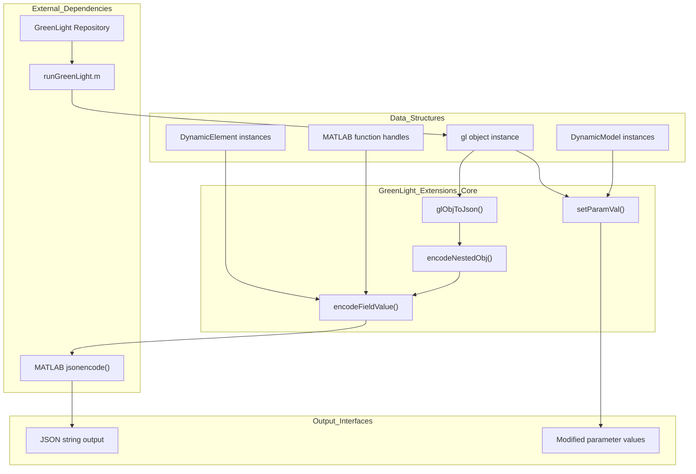
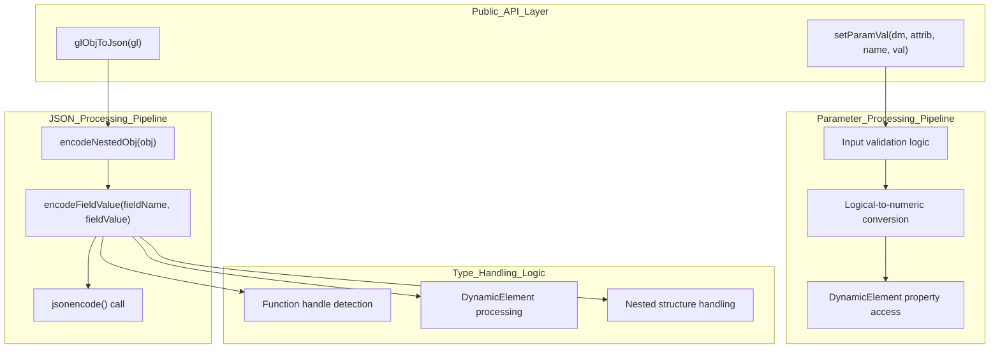
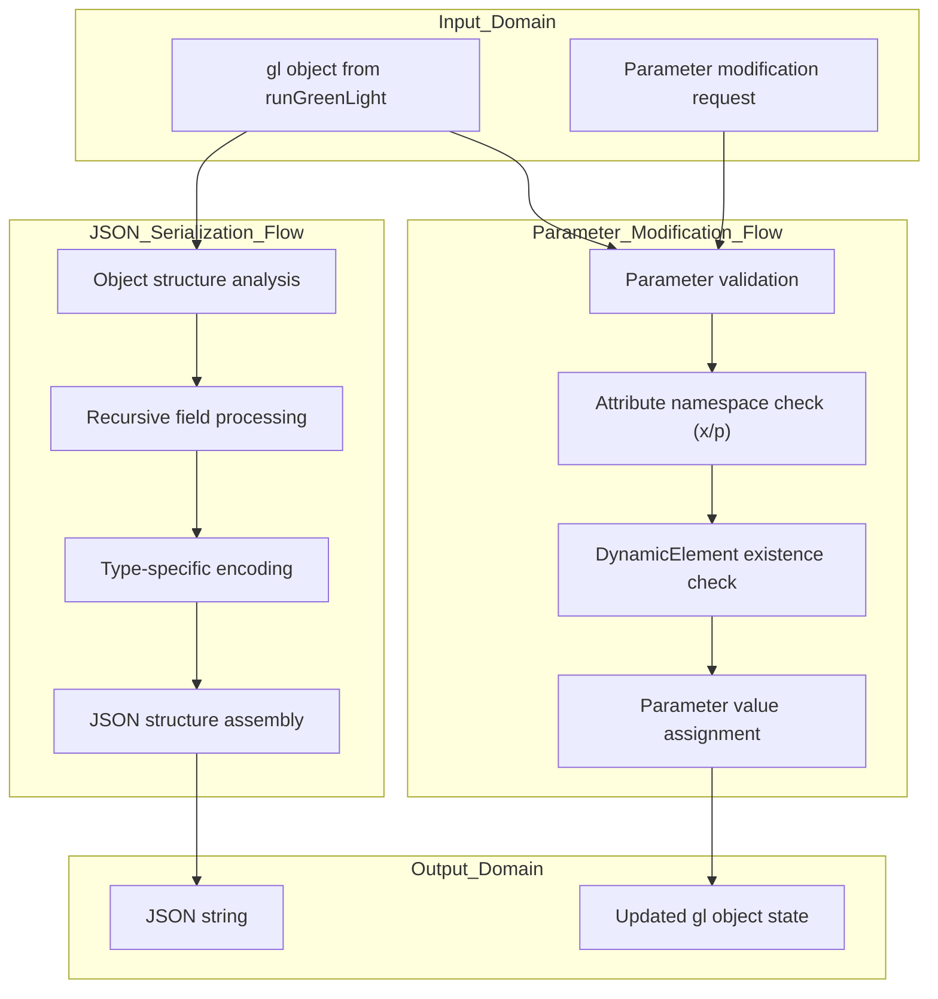
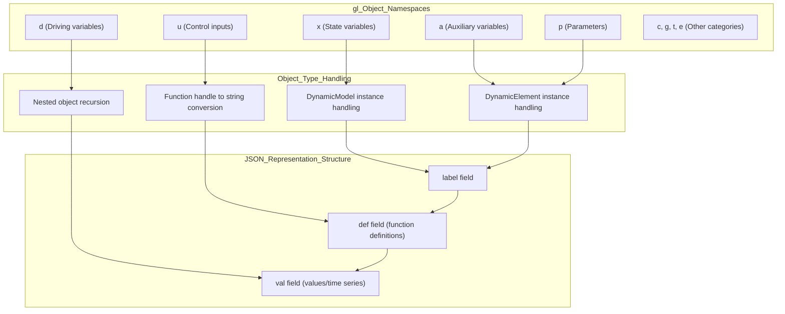
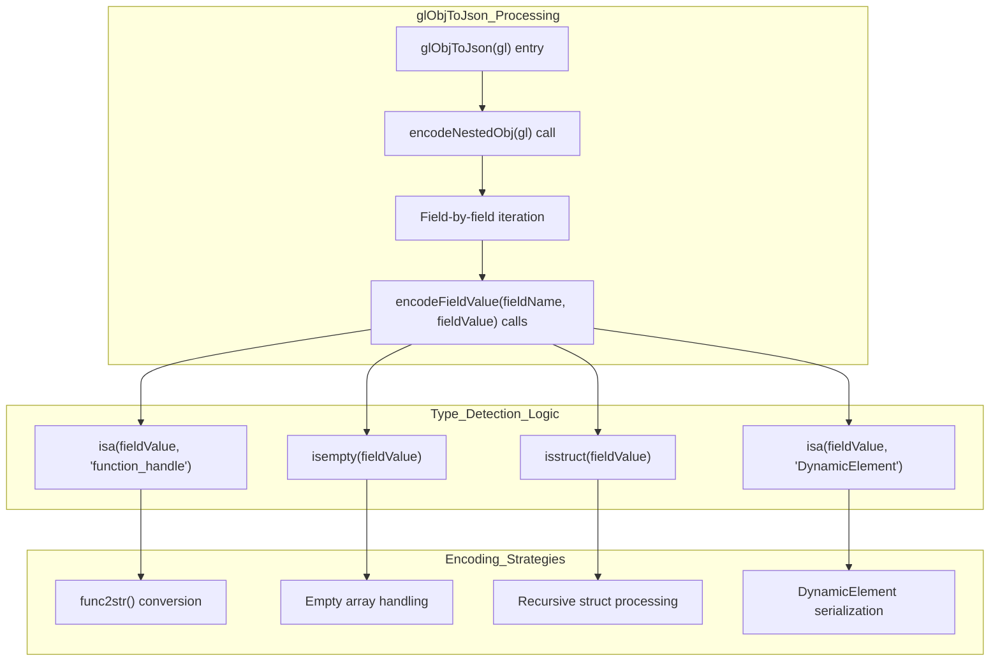
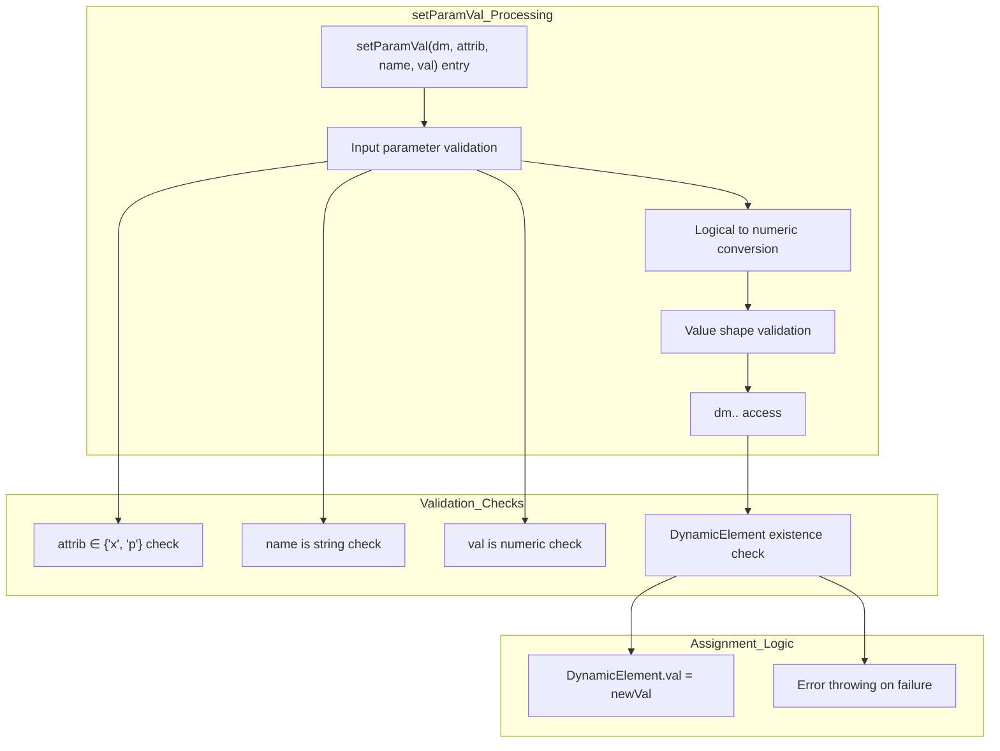

# System Architecture

> **Relevant source files**
> * [README.md](https://github.com/greenpeer/GreenLight_Extensions/blob/fdc2b4c5/README.md)

## Purpose and Scope

This document describes the overall architecture of the GreenLight Extensions system, detailing how the core functions `glObjToJson` and `setParamVal` work together to provide JSON serialization and parameter modification capabilities for GreenLight model objects. It covers the internal dependencies, data flow patterns, and integration points within the system.

For detailed usage examples and API documentation, see [Usage Examples and API Reference](/greenpeer/GreenLight_Extensions/2.1-usage-examples-and-api-reference) and [Usage Examples and API Reference](/greenpeer/GreenLight_Extensions/3.1-usage-examples-and-api-reference). For information about the underlying data structures, see [Data Structures and Object Model](/greenpeer/GreenLight_Extensions/4-data-structures-and-object-model).

## High-Level System Overview

The GreenLight Extensions system implements a dual-purpose architecture that provides two primary capabilities: JSON serialization of complex MATLAB objects and programmatic parameter modification of DynamicModel instances.

### Core System Components

Sources: [README.md L1-L230](https://github.com/greenpeer/GreenLight_Extensions/blob/fdc2b4c5/README.md#L1-L230)

## Function Dependency Architecture

The system's internal architecture is built around a clear separation of concerns, with each function having specific responsibilities in the processing pipeline.

### Internal Function Relationships

Sources: [README.md L140-L218](https://github.com/greenpeer/GreenLight_Extensions/blob/fdc2b4c5/README.md#L140-L218)

## Data Flow Architecture

The system processes data through two distinct pipelines, each optimized for its specific use case while sharing common type-handling logic.

### Processing Pipeline Data Flow

Sources: [README.md L23-L33](https://github.com/greenpeer/GreenLight_Extensions/blob/fdc2b4c5/README.md#L23-L33)

 [README.md L140-L218](https://github.com/greenpeer/GreenLight_Extensions/blob/fdc2b4c5/README.md#L140-L218)

## Object Model Integration

The system is designed to handle the complex object hierarchies that characterize GreenLight model instances, including nested structures and custom class instances.

### gl Object Structure Processing

Sources: [README.md L54-L133](https://github.com/greenpeer/GreenLight_Extensions/blob/fdc2b4c5/README.md#L54-L133)

## Processing Pipeline Details

### JSON Serialization Pipeline Architecture

The `glObjToJson` function implements a recursive processing architecture that can handle arbitrarily nested object structures while maintaining type safety.

Sources: [README.md L140-L144](https://github.com/greenpeer/GreenLight_Extensions/blob/fdc2b4c5/README.md#L140-L144)

 [README.md L165-L199](https://github.com/greenpeer/GreenLight_Extensions/blob/fdc2b4c5/README.md#L165-L199)

### Parameter Modification Pipeline Architecture

The `setParamVal` function implements comprehensive validation and type coercion to ensure parameter modifications maintain model integrity.

Sources: [README.md L202-L218](https://github.com/greenpeer/GreenLight_Extensions/blob/fdc2b4c5/README.md#L202-L218)

## Integration Points and External Dependencies

The system serves as a bridge between the MATLAB-based GreenLight modeling environment and external systems that require JSON data exchange or programmatic parameter control.

### External System Integration

| Integration Point | Function | Purpose |
| --- | --- | --- |
| `runGreenLight.m` | Input source | Generates gl object instances |
| `jsonencode()` | JSON output | MATLAB's native JSON serialization |
| DynamicModel classes | Parameter modification | Custom GreenLight model classes |
| DynamicElement classes | Data access | Individual model element access |

The architecture ensures that complex MATLAB objects with nested structures, custom classes, and function handles can be reliably serialized to JSON while maintaining the ability to programmatically modify model parameters without breaking object integrity.

Sources: [README.md L23-L24](https://github.com/greenpeer/GreenLight_Extensions/blob/fdc2b4c5/README.md#L23-L24)

 [README.md L37-L48](https://github.com/greenpeer/GreenLight_Extensions/blob/fdc2b4c5/README.md#L37-L48)

 [README.md L223-L226](https://github.com/greenpeer/GreenLight_Extensions/blob/fdc2b4c5/README.md#L223-L226)