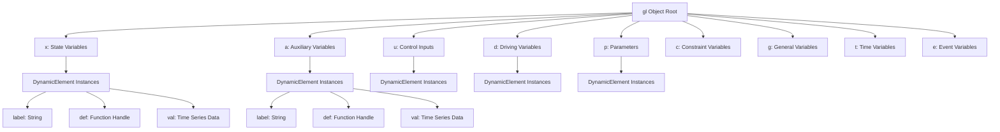
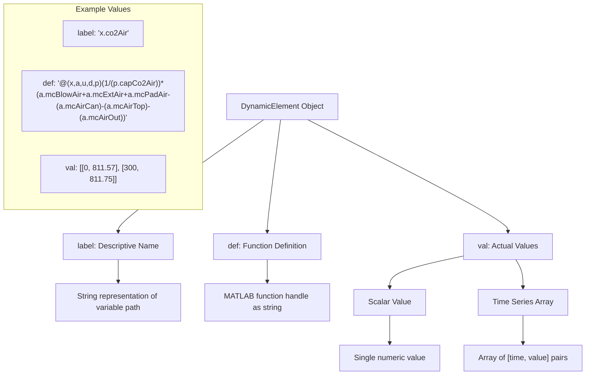
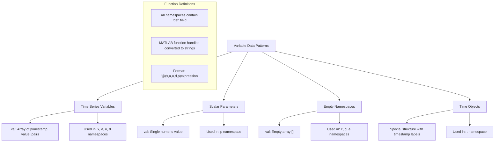

# gl Object Structure

> **Relevant source files**
> * [README.md](https://github.com/greenpeer/GreenLight_Extensions/blob/fdc2b4c5/README.md)

This document provides a detailed breakdown of the `gl` object structure used throughout the GreenLight Extensions system. It explains the hierarchical namespace organization, data types, and how these structures map to JSON representations during serialization.

For information about how these objects are processed and serialized, see [JSON Serialization (glObjToJson)](/greenpeer/GreenLight_Extensions/2-json-serialization-(globjtojson)). For details about modifying parameters within these objects, see [Parameter Modification (setParamVal)](/greenpeer/GreenLight_Extensions/3-parameter-modification-(setparamval)).

## Overall gl Object Architecture

The `gl` object follows a standardized namespace structure that organizes different types of model variables and parameters into distinct categories. Each namespace serves a specific purpose in the greenhouse simulation model.



Sources: [README.md L54-L133](https://github.com/greenpeer/GreenLight_Extensions/blob/fdc2b4c5/README.md#L54-L133)

## Namespace Categories and Their Roles

The `gl` object organizes all model variables into nine distinct namespaces, each serving a specific role in the greenhouse simulation:

| Namespace | Full Name | Purpose | Data Type |
| --- | --- | --- | --- |
| `x` | State Variables | Core system state variables that change over time | DynamicElement objects |
| `a` | Auxiliary Variables | Derived variables calculated from state variables | DynamicElement objects |
| `u` | Control Inputs | Control system inputs and actuator commands | DynamicElement objects |
| `d` | Driving Variables | External driving forces and environmental inputs | DynamicElement objects |
| `p` | Parameters | Model parameters and constants | DynamicElement objects |
| `c` | Constraint Variables | System constraints and bounds | Usually empty arrays |
| `g` | General Variables | General-purpose variables | Usually empty arrays |
| `t` | Time Variables | Time-related information and timestamps | Special time objects |
| `e` | Event Variables | Event handling and discrete changes | Usually empty arrays |

Sources: [README.md L54-L133](https://github.com/greenpeer/GreenLight_Extensions/blob/fdc2b4c5/README.md#L54-L133)

## Object Structure within Namespaces

Each namespace contains objects that follow a consistent internal structure. Most namespaces contain `DynamicElement` instances with three key fields:



Sources: [README.md L56-L63](https://github.com/greenpeer/GreenLight_Extensions/blob/fdc2b4c5/README.md#L56-L63)

 [README.md L94-L113](https://github.com/greenpeer/GreenLight_Extensions/blob/fdc2b4c5/README.md#L94-L113)

## JSON Mapping Structure

When serialized to JSON via `glObjToJson`, the `gl` object maintains its namespace structure while converting MATLAB-specific types to JSON-compatible formats:

### State Variables (x namespace)

```
"x": {
  "co2Air": {
    "label": "x.co2Air",
    "def": "@(x,a,u,d,p)(1/(p.capCo2Air))*(a.mcBlowAir+a.mcExtAir+a.mcPadAir-(a.mcAirCan)-(a.mcAirTop)-(a.mcAirOut))",
    "val": [[0, 811.57497020754624], [300, 811.75447291764658]]
  }
}
```

### Parameters (p namespace)

```
"p": {
  "alfaLeafAir": {
    "label": "p.alfaLeafAir",
    "def": "@(x,a,u,d,p)p.alfaLeafAir",
    "val": 5
  }
}
```

### Time Variables (t namespace)

```
"t": {
  "label": "10-Jan-2005 01:00:00",
  "def": [],
  "val": [0, 300.00000223517418]
}
```

Sources: [README.md L54-L133](https://github.com/greenpeer/GreenLight_Extensions/blob/fdc2b4c5/README.md#L54-L133)

## Variable Types and Data Patterns

The `gl` object structure supports different data patterns depending on the variable type:



Sources: [README.md L54-L133](https://github.com/greenpeer/GreenLight_Extensions/blob/fdc2b4c5/README.md#L54-L133)

## DynamicElement Integration

The `gl` object structure heavily relies on `DynamicElement` and `DynamicModel` classes from the GreenLight ecosystem. These objects are accessed and modified through the namespace structure:

* **State access**: `gl.x.<variableName>` for state variables
* **Parameter access**: `gl.p.<parameterName>` for parameters
* **Function definitions**: All variables contain function handle definitions in their `def` field
* **Value storage**: Time series data stored in `val` field with timestamp-value pairs

The `setParamVal` function specifically targets this structure by accessing `DynamicElement` objects within the `x` and `p` namespaces for parameter modification operations.

Sources: [README.md L29-L33](https://github.com/greenpeer/GreenLight_Extensions/blob/fdc2b4c5/README.md#L29-L33)

 [README.md L204-L217](https://github.com/greenpeer/GreenLight_Extensions/blob/fdc2b4c5/README.md#L204-L217)

## Special Namespace Behaviors

Several namespaces exhibit special behaviors during serialization and usage:

* **Empty namespaces** (`c`, `g`, `e`): Typically contain empty arrays and serve as placeholders for future extensions
* **Time namespace** (`t`): Contains timestamp information with human-readable labels and numeric time values
* **Control namespace** (`u`): Often contains complex function definitions for control logic with extensive conditional expressions
* **Parameter namespace** (`p`): Contains scalar values rather than time series, representing model constants

Sources: [README.md L125-L132](https://github.com/greenpeer/GreenLight_Extensions/blob/fdc2b4c5/README.md#L125-L132)