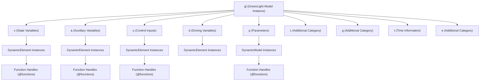
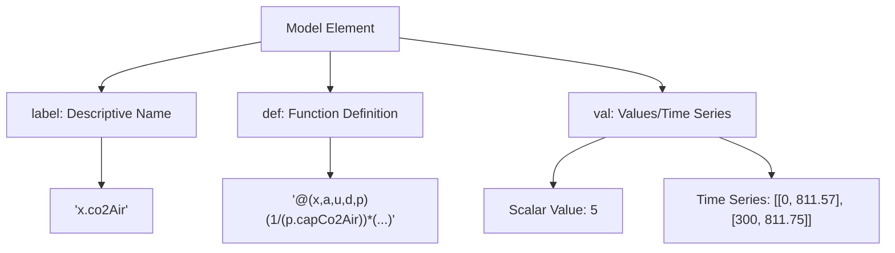
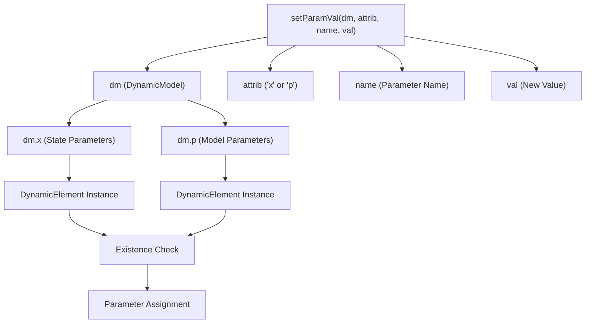
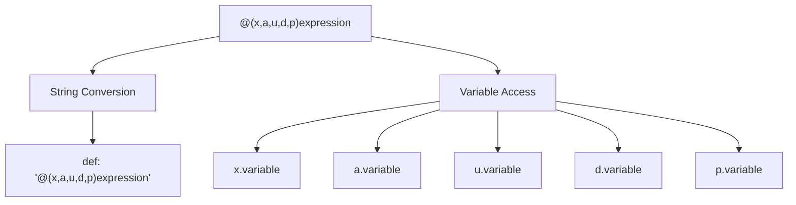
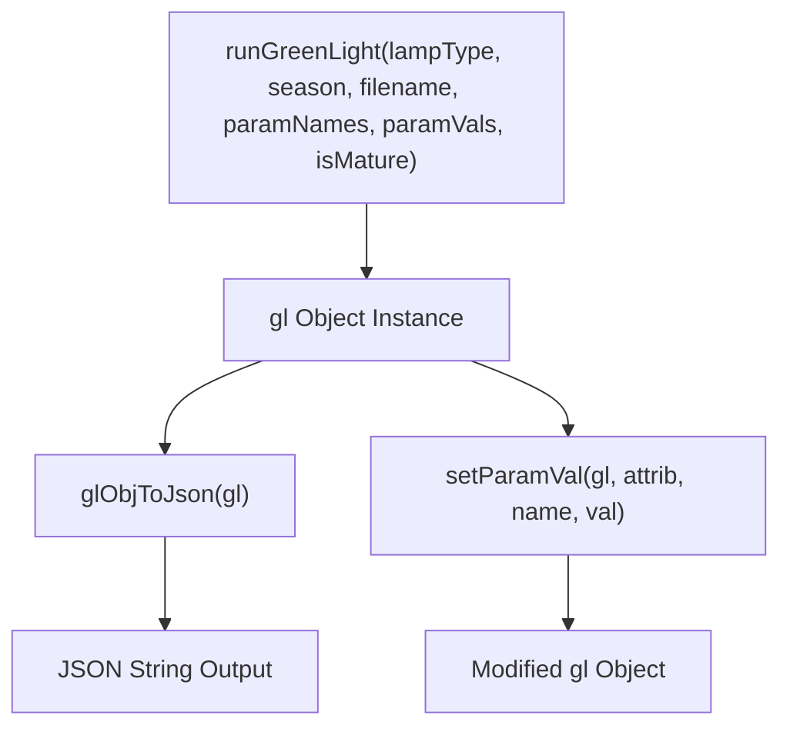

# Data Structures and Object Model

> **Relevant source files**
> * [README.md](https://github.com/greenpeer/GreenLight_Extensions/blob/fdc2b4c5/README.md)

This document explains the core data structures and object model used by the GreenLight Extensions system. It covers the structure of the `gl` object, the organization of its namespaces, the `DynamicModel` and `DynamicElement` classes, and how these structures are represented in JSON format.

For implementation details of the JSON serialization process, see [JSON Serialization Implementation Details](/greenpeer/GreenLight_Extensions/2.2-implementation-details). For parameter modification workflows, see [Parameter Modification Usage](/greenpeer/GreenLight_Extensions/3.1-usage-examples-and-api-reference).

## Overview of Data Structures

The GreenLight Extensions system operates on a hierarchical object model centered around the `gl` object instance. This object contains multiple namespaces that organize different types of model variables and parameters, with specialized classes (`DynamicModel` and `DynamicElement`) handling dynamic behavior.

### Core Object Hierarchy

Sources: [README.md L23](https://github.com/greenpeer/GreenLight_Extensions/blob/fdc2b4c5/README.md#L23-L23)

 [README.md L54-L133](https://github.com/greenpeer/GreenLight_Extensions/blob/fdc2b4c5/README.md#L54-L133)

 [README.md L157](https://github.com/greenpeer/GreenLight_Extensions/blob/fdc2b4c5/README.md#L157-L157)

## gl Object Structure

The `gl` object serves as the root container for the GreenLight model, generated by running `runGreenLight.m` from the main GreenLight repository. It organizes model components into distinct namespaces.

### Namespace Organization

| Namespace | Purpose | Typical Content | Example |
| --- | --- | --- | --- |
| `x` | State Variables | Dynamic system states | `co2Air`, `cFruit` |
| `a` | Auxiliary Variables | Computed intermediate values | `tauShScrPar`, `tauShScrPerPar` |
| `u` | Control Inputs | Control system inputs | `boil`, `shScr` |
| `d` | Driving Variables | External driving forces | `iGlob`, `dayRadSum` |
| `p` | Parameters | Model parameters | `alfaLeafAir`, `L`, `sigma` |
| `c` | Additional Category | Context-specific data | Empty arrays |
| `g` | Additional Category | Context-specific data | Empty arrays |
| `t` | Time Information | Temporal references | Time vectors |
| `e` | Additional Category | Context-specific data | Empty arrays |

Sources: [README.md L54-L133](https://github.com/greenpeer/GreenLight_Extensions/blob/fdc2b4c5/README.md#L54-L133)

 [README.md L29-L32](https://github.com/greenpeer/GreenLight_Extensions/blob/fdc2b4c5/README.md#L29-L32)

### JSON Representation Structure

Each element within the `gl` object namespaces follows a consistent JSON structure when serialized:

Sources: [README.md L56-L63](https://github.com/greenpeer/GreenLight_Extensions/blob/fdc2b4c5/README.md#L56-L63)

 [README.md L94-L113](https://github.com/greenpeer/GreenLight_Extensions/blob/fdc2b4c5/README.md#L94-L113)

## DynamicModel and DynamicElement Classes

The system uses specialized MATLAB classes to handle dynamic behavior and parameter access.

### DynamicModel Class

The `DynamicModel` class serves as a container for model parameters and is the primary target for the `setParamVal` function. It provides structured access to model parameters through attribute namespaces.

### DynamicElement Class

The `DynamicElement` class represents individual dynamic elements within the model. These elements typically contain:

* Function handle definitions (`def` field)
* Label information (`label` field)
* Value data (`val` field)

### Parameter Access Patterns

Sources: [README.md L29-L32](https://github.com/greenpeer/GreenLight_Extensions/blob/fdc2b4c5/README.md#L29-L32)

 [README.md L204-L217](https://github.com/greenpeer/GreenLight_Extensions/blob/fdc2b4c5/README.md#L204-L217)

## Function Handles and String Conversion

Function handles (`@functions`) are a critical component of the GreenLight model, representing mathematical relationships between variables.

### Function Handle Structure

Function handles in the system follow a consistent pattern:

* They reference variables from all namespaces: `x`, `a`, `u`, `d`, `p`
* They are stored in the `def` field of elements
* They are converted to strings during JSON serialization

### Conversion Process

Sources: [README.md L58](https://github.com/greenpeer/GreenLight_Extensions/blob/fdc2b4c5/README.md#L58-L58)

 [README.md L68](https://github.com/greenpeer/GreenLight_Extensions/blob/fdc2b4c5/README.md#L68-L68)

 [README.md L224](https://github.com/greenpeer/GreenLight_Extensions/blob/fdc2b4c5/README.md#L224-L224)

## Data Type Handling

The system handles various MATLAB data types with specific encoding strategies:

| Data Type | Handling Strategy | JSON Representation |
| --- | --- | --- |
| Function Handles | Convert to string | `"@(x,a,u,d,p)expression"` |
| DynamicElement | Extract label, def, val | `{"label": "...", "def": "...", "val": ...}` |
| Time Series | Preserve as arrays | `[[time1, val1], [time2, val2]]` |
| Scalar Values | Direct mapping | Numeric values |
| Empty Arrays | Direct mapping | `[]` |
| Nested Structures | Recursive processing | Nested JSON objects |

Sources: [README.md L140-L142](https://github.com/greenpeer/GreenLight_Extensions/blob/fdc2b4c5/README.md#L140-L142)

 [README.md L223-L225](https://github.com/greenpeer/GreenLight_Extensions/blob/fdc2b4c5/README.md#L223-L225)

## Integration Points

The data structures integrate with the broader GreenLight ecosystem through specific interfaces:

### Input Integration

### Output Integration

The serialized JSON structure enables integration with external systems while preserving the mathematical relationships and hierarchical structure of the original MATLAB model.

Sources: [README.md L23](https://github.com/greenpeer/GreenLight_Extensions/blob/fdc2b4c5/README.md#L23-L23)

 [README.md L42](https://github.com/greenpeer/GreenLight_Extensions/blob/fdc2b4c5/README.md#L42-L42)

 [README.md L45-L49](https://github.com/greenpeer/GreenLight_Extensions/blob/fdc2b4c5/README.md#L45-L49)