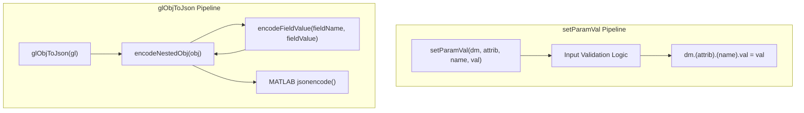
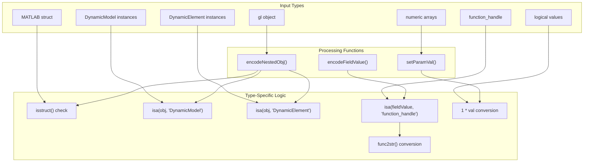

# Developer Reference

> **Relevant source files**
> * [glObjToJson.m](https://github.com/greenpeer/GreenLight_Extensions/blob/fdc2b4c5/glObjToJson.m)
> * [setParamVal.m](https://github.com/greenpeer/GreenLight_Extensions/blob/fdc2b4c5/setParamVal.m)

This document provides technical reference material for developers working with or extending the GreenLight Extensions system. It covers internal implementation details, code organization, extension points, and architectural patterns used in the codebase.

For usage examples and API documentation, see [JSON Serialization](/greenpeer/GreenLight_Extensions/2-json-serialization-(globjtojson)) and [Parameter Modification](/greenpeer/GreenLight_Extensions/3-parameter-modification-(setparamval)). For understanding the data structures these functions operate on, see [Data Structures and Object Model](/greenpeer/GreenLight_Extensions/4-data-structures-and-object-model).

## Code Organization

The GreenLight Extensions system consists of two primary MATLAB function files that provide complementary functionality:

| File | Primary Function | Supporting Functions | Purpose |
| --- | --- | --- | --- |
| `glObjToJson.m` | `glObjToJson` | `encodeNestedObj`, `encodeFieldValue` | JSON serialization pipeline |
| `setParamVal.m` | `setParamVal` | None | Parameter modification interface |

The system follows a functional programming approach with no shared state between operations. Each function file is self-contained with its helper functions defined as nested functions within the same file.

**Sources:** [glObjToJson.m L1-L87](https://github.com/greenpeer/GreenLight_Extensions/blob/fdc2b4c5/glObjToJson.m#L1-L87)

 [setParamVal.m L1-L24](https://github.com/greenpeer/GreenLight_Extensions/blob/fdc2b4c5/setParamVal.m#L1-L24)

## Core Function Architecture

The following diagram shows the internal function call hierarchy and data flow within the codebase:



### glObjToJson Function Architecture

The `glObjToJson` function implements a two-stage processing pipeline:

1. **Encoding Stage** ([glObjToJson.m L14](https://github.com/greenpeer/GreenLight_Extensions/blob/fdc2b4c5/glObjToJson.m#L14-L14) ): Calls `encodeNestedObj` to recursively transform the input object
2. **Serialization Stage** ([glObjToJson.m L17](https://github.com/greenpeer/GreenLight_Extensions/blob/fdc2b4c5/glObjToJson.m#L17-L17) ): Uses MATLAB's built-in `jsonencode` function

The `encodeNestedObj` function ([glObjToJson.m L20-L52](https://github.com/greenpeer/GreenLight_Extensions/blob/fdc2b4c5/glObjToJson.m#L20-L52)

) implements recursive object traversal:

* Detects struct-like objects using `isstruct(obj) || isa(obj, 'DynamicModel') || isa(obj, 'DynamicElement')` ([glObjToJson.m L34](https://github.com/greenpeer/GreenLight_Extensions/blob/fdc2b4c5/glObjToJson.m#L34-L34) )
* Iterates through `fieldnames(obj)` ([glObjToJson.m L38](https://github.com/greenpeer/GreenLight_Extensions/blob/fdc2b4c5/glObjToJson.m#L38-L38) )
* Delegates field-specific encoding to `encodeFieldValue` ([glObjToJson.m L45](https://github.com/greenpeer/GreenLight_Extensions/blob/fdc2b4c5/glObjToJson.m#L45-L45) )

### setParamVal Function Architecture

The `setParamVal` function implements a validation-first approach:

1. **Type Coercion** ([setParamVal.m L3-L6](https://github.com/greenpeer/GreenLight_Extensions/blob/fdc2b4c5/setParamVal.m#L3-L6) ): Converts logical values to numeric using `1 * val`
2. **Type Validation** ([setParamVal.m L9](https://github.com/greenpeer/GreenLight_Extensions/blob/fdc2b4c5/setParamVal.m#L9-L9) ): Ensures input is numeric using `isnumeric(val)`
3. **Shape Validation** ([setParamVal.m L11](https://github.com/greenpeer/GreenLight_Extensions/blob/fdc2b4c5/setParamVal.m#L11-L11) ): Validates using `isempty(val) || isscalar(val) || size(val, 2) == 2`
4. **Assignment** ([setParamVal.m L13](https://github.com/greenpeer/GreenLight_Extensions/blob/fdc2b4c5/setParamVal.m#L13-L13) ): Direct assignment to `dm.(attrib).(name).val`

**Sources:** [glObjToJson.m L1-L87](https://github.com/greenpeer/GreenLight_Extensions/blob/fdc2b4c5/glObjToJson.m#L1-L87)

 [setParamVal.m L1-L24](https://github.com/greenpeer/GreenLight_Extensions/blob/fdc2b4c5/setParamVal.m#L1-L24)

## Type System and Object Handling

The system handles multiple MATLAB object types through specialized processing logic:



### Object Type Detection Patterns

The `encodeNestedObj` function uses a compound conditional for object type detection:

```
if isstruct(obj) || isa(obj, 'DynamicModel') || isa(obj, 'DynamicElement')
```

This pattern ([glObjToJson.m L34](https://github.com/greenpeer/GreenLight_Extensions/blob/fdc2b4c5/glObjToJson.m#L34-L34)

) treats all three types as field-containing objects requiring recursive processing.

### Function Handle Processing

Function handles receive special treatment in the `encodeFieldValue` function:

* Detection: `strcmp(fieldName, 'def') && isa(fieldValue, 'function_handle')` ([glObjToJson.m L69](https://github.com/greenpeer/GreenLight_Extensions/blob/fdc2b4c5/glObjToJson.m#L69-L69) )
* Conversion: `func2str(fieldValue)` ([glObjToJson.m L71](https://github.com/greenpeer/GreenLight_Extensions/blob/fdc2b4c5/glObjToJson.m#L71-L71) )

This approach specifically targets function handles in `def` fields, suggesting a domain-specific naming convention.

### Logical Value Coercion

The `setParamVal` function implements automatic logical-to-numeric conversion:

```
if islogical(val)
    val = 1 * val;
end
```

This pattern ([setParamVal.m L3-L6](https://github.com/greenpeer/GreenLight_Extensions/blob/fdc2b4c5/setParamVal.m#L3-L6)

) ensures boolean values are stored as numeric 0/1 values.

**Sources:** [glObjToJson.m L34](https://github.com/greenpeer/GreenLight_Extensions/blob/fdc2b4c5/glObjToJson.m#L34-L34)

 [glObjToJson.m L69-L71](https://github.com/greenpeer/GreenLight_Extensions/blob/fdc2b4c5/glObjToJson.m#L69-L71)

 [setParamVal.m L3-L6](https://github.com/greenpeer/GreenLight_Extensions/blob/fdc2b4c5/setParamVal.m#L3-L6)

## Error Handling Patterns

The system implements defensive programming through explicit error checking:

### setParamVal Error Conditions

| Condition | Check | Error Message | Line Reference |
| --- | --- | --- | --- |
| Non-numeric input | `~isnumeric(val)` | "Argument for DynamicElement value must be numeric" | [setParamVal.m L21](https://github.com/greenpeer/GreenLight_Extensions/blob/fdc2b4c5/setParamVal.m#L21-L21) |
| Invalid shape | Complex condition | "Argument for DynamicElement value must be empty, a scalar, or a matrix with 2 columns" | [setParamVal.m L16](https://github.com/greenpeer/GreenLight_Extensions/blob/fdc2b4c5/setParamVal.m#L16-L16) |

The shape validation logic ([setParamVal.m L11](https://github.com/greenpeer/GreenLight_Extensions/blob/fdc2b4c5/setParamVal.m#L11-L11)

) implements the constraint:

```
isempty(val) || isscalar(val) || size(val, 2) == 2
```

### glObjToJson Error Handling

The `glObjToJson` pipeline relies on MATLAB's built-in `jsonencode` function for error handling. The encoding functions handle edge cases through conditional logic rather than explicit error throwing:

* Empty values: `isempty(fieldValue)` check returns `[]` ([glObjToJson.m L73-L75](https://github.com/greenpeer/GreenLight_Extensions/blob/fdc2b4c5/glObjToJson.m#L73-L75) )
* Unrecognized types: Fall-through to `fieldValue` assignment ([glObjToJson.m L82-L83](https://github.com/greenpeer/GreenLight_Extensions/blob/fdc2b4c5/glObjToJson.m#L82-L83) )

**Sources:** [setParamVal.m L11](https://github.com/greenpeer/GreenLight_Extensions/blob/fdc2b4c5/setParamVal.m#L11-L11)

 [setParamVal.m L16](https://github.com/greenpeer/GreenLight_Extensions/blob/fdc2b4c5/setParamVal.m#L16-L16)

 [setParamVal.m L21](https://github.com/greenpeer/GreenLight_Extensions/blob/fdc2b4c5/setParamVal.m#L21-L21)

 [glObjToJson.m L73-L75](https://github.com/greenpeer/GreenLight_Extensions/blob/fdc2b4c5/glObjToJson.m#L73-L75)

 [glObjToJson.m L82-L83](https://github.com/greenpeer/GreenLight_Extensions/blob/fdc2b4c5/glObjToJson.m#L82-L83)

## Extension Points

### Adding New Object Types to JSON Serialization

To extend `glObjToJson` for new object types:

1. **Modify type detection** in `encodeNestedObj` ([glObjToJson.m L34](https://github.com/greenpeer/GreenLight_Extensions/blob/fdc2b4c5/glObjToJson.m#L34-L34) )
2. **Add field-specific handling** in `encodeFieldValue` ([glObjToJson.m L54](https://github.com/greenpeer/GreenLight_Extensions/blob/fdc2b4c5/glObjToJson.m#L54-L54) )

Example extension pattern:

```
% In encodeNestedObj
if isstruct(obj) || isa(obj, 'DynamicModel') || isa(obj, 'DynamicElement') || isa(obj, 'NewObjectType')

% In encodeFieldValue  
elseif strcmp(fieldName, 'specialField') && isa(fieldValue, 'SpecialType')
    encodedValue = customProcessing(fieldValue);
```

### Extending Parameter Validation

To extend `setParamVal` validation:

1. **Add type checks** before the numeric validation ([setParamVal.m L9](https://github.com/greenpeer/GreenLight_Extensions/blob/fdc2b4c5/setParamVal.m#L9-L9) )
2. **Modify shape constraints** in the validation logic ([setParamVal.m L11](https://github.com/greenpeer/GreenLight_Extensions/blob/fdc2b4c5/setParamVal.m#L11-L11) )

Current validation allows:

* Empty arrays: `isempty(val)`
* Scalars: `isscalar(val)`
* Two-column matrices: `size(val, 2) == 2`

### Custom Field Processing

The `encodeFieldValue` function implements field-name-based processing ([glObjToJson.m L69](https://github.com/greenpeer/GreenLight_Extensions/blob/fdc2b4c5/glObjToJson.m#L69-L69)

):

```
if strcmp(fieldName, 'def') && isa(fieldValue, 'function_handle')
```

This pattern enables field-specific encoding rules based on naming conventions.

**Sources:** [glObjToJson.m L34](https://github.com/greenpeer/GreenLight_Extensions/blob/fdc2b4c5/glObjToJson.m#L34-L34)

 [glObjToJson.m L54](https://github.com/greenpeer/GreenLight_Extensions/blob/fdc2b4c5/glObjToJson.m#L54-L54)

 [glObjToJson.m L69](https://github.com/greenpeer/GreenLight_Extensions/blob/fdc2b4c5/glObjToJson.m#L69-L69)

 [setParamVal.m L9](https://github.com/greenpeer/GreenLight_Extensions/blob/fdc2b4c5/setParamVal.m#L9-L9)

 [setParamVal.m L11](https://github.com/greenpeer/GreenLight_Extensions/blob/fdc2b4c5/setParamVal.m#L11-L11)

## Implementation Considerations

### Memory Efficiency

Both functions process objects without creating unnecessary copies:

* `encodeNestedObj` creates new structs only for complex objects ([glObjToJson.m L35](https://github.com/greenpeer/GreenLight_Extensions/blob/fdc2b4c5/glObjToJson.m#L35-L35) )
* `setParamVal` performs direct assignment ([setParamVal.m L13](https://github.com/greenpeer/GreenLight_Extensions/blob/fdc2b4c5/setParamVal.m#L13-L13) )

### Recursion Depth

The `encodeNestedObj` and `encodeFieldValue` functions implement mutual recursion ([glObjToJson.m L45](https://github.com/greenpeer/GreenLight_Extensions/blob/fdc2b4c5/glObjToJson.m#L45-L45)

 [glObjToJson.m L79](https://github.com/greenpeer/GreenLight_Extensions/blob/fdc2b4c5/glObjToJson.m#L79-L79)

). MATLAB's default recursion limit applies.

### Namespace Dependencies

The code assumes specific object attribute namespaces:

* `setParamVal` expects `dm.(attrib).(name).val` structure ([setParamVal.m L13](https://github.com/greenpeer/GreenLight_Extensions/blob/fdc2b4c5/setParamVal.m#L13-L13) )
* `glObjToJson` looks for `def` fields containing function handles ([glObjToJson.m L69](https://github.com/greenpeer/GreenLight_Extensions/blob/fdc2b4c5/glObjToJson.m#L69-L69) )

These dependencies reflect the GreenLight model's internal organization patterns.

**Sources:** [glObjToJson.m L35](https://github.com/greenpeer/GreenLight_Extensions/blob/fdc2b4c5/glObjToJson.m#L35-L35)

 [glObjToJson.m L45](https://github.com/greenpeer/GreenLight_Extensions/blob/fdc2b4c5/glObjToJson.m#L45-L45)

 [glObjToJson.m L79](https://github.com/greenpeer/GreenLight_Extensions/blob/fdc2b4c5/glObjToJson.m#L79-L79)

 [setParamVal.m L13](https://github.com/greenpeer/GreenLight_Extensions/blob/fdc2b4c5/setParamVal.m#L13-L13)

 [glObjToJson.m L69](https://github.com/greenpeer/GreenLight_Extensions/blob/fdc2b4c5/glObjToJson.m#L69-L69)