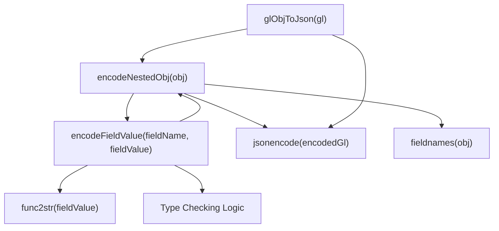
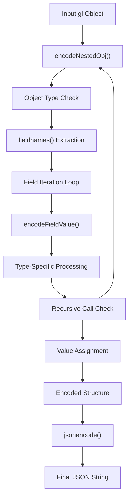
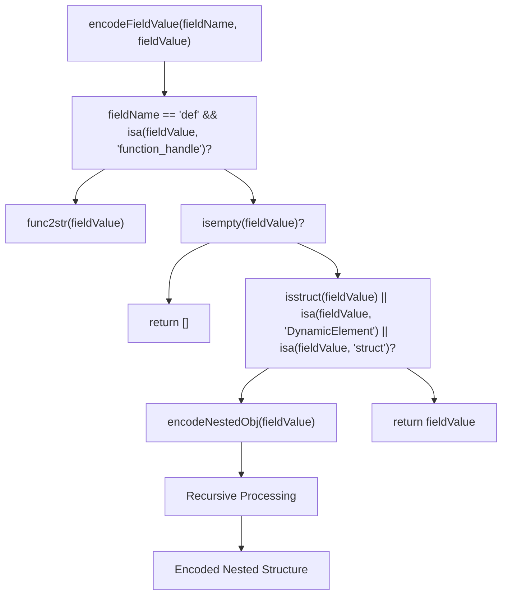
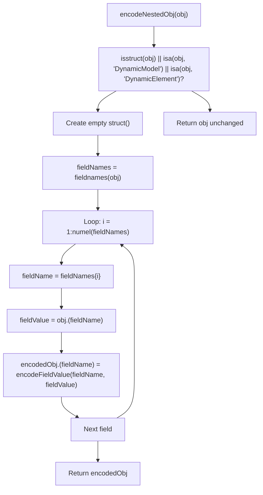
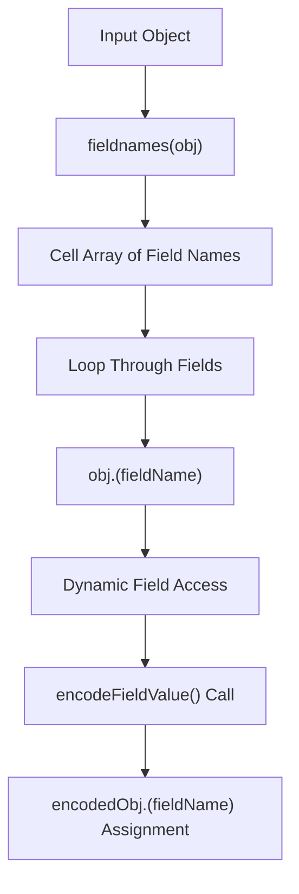

# Implementation Details

> **Relevant source files**
> * [README.md](https://github.com/greenpeer/GreenLight_Extensions/blob/fdc2b4c5/README.md)
> * [glObjToJson.m](https://github.com/greenpeer/GreenLight_Extensions/blob/fdc2b4c5/glObjToJson.m)

This document provides a deep dive into the internal architecture of the `glObjToJson` function, covering the recursive encoding process, the roles of helper functions `encodeNestedObj` and `encodeFieldValue`, and the type-specific handling logic that enables serialization of complex MATLAB objects to JSON format.

For basic usage patterns and API examples, see [Usage Examples and API Reference](/greenpeer/GreenLight_Extensions/2.1-usage-examples-and-api-reference). For the broader context of parameter modification functionality, see [Parameter Modification (setParamVal)](/greenpeer/GreenLight_Extensions/3-parameter-modification-(setparamval)).

## Architecture Overview

The `glObjToJson` implementation follows a simple three-layer architecture with clear separation of concerns between the main interface, recursive processing, and type-specific encoding logic.

**Function Call Hierarchy**

The main function `glObjToJson` serves purely as an interface wrapper, delegating all processing to `encodeNestedObj` and using MATLAB's built-in `jsonencode` for final serialization. The recursive nature is handled entirely within the helper functions.

Sources: [glObjToJson.m L1-L18](https://github.com/greenpeer/GreenLight_Extensions/blob/fdc2b4c5/glObjToJson.m#L1-L18)

 [glObjToJson.m L20-L52](https://github.com/greenpeer/GreenLight_Extensions/blob/fdc2b4c5/glObjToJson.m#L20-L52)

 [glObjToJson.m L54-L86](https://github.com/greenpeer/GreenLight_Extensions/blob/fdc2b4c5/glObjToJson.m#L54-L86)

## Core Encoding Pipeline

The encoding process follows a systematic pipeline that handles object traversal, field processing, and type-specific transformations before final JSON serialization.

**Encoding Process Flow**

The pipeline begins with the input `gl` object and systematically processes each field through the `encodeFieldValue` function, which determines the appropriate encoding strategy based on field name and value type.

Sources: [glObjToJson.m L13-L17](https://github.com/greenpeer/GreenLight_Extensions/blob/fdc2b4c5/glObjToJson.m#L13-L17)

 [glObjToJson.m L33-L46](https://github.com/greenpeer/GreenLight_Extensions/blob/fdc2b4c5/glObjToJson.m#L33-L46)

 [glObjToJson.m L68-L84](https://github.com/greenpeer/GreenLight_Extensions/blob/fdc2b4c5/glObjToJson.m#L68-L84)

## Type-Specific Handling Logic

The `encodeFieldValue` function implements a decision tree for handling different MATLAB data types encountered in GreenLight model objects.

| Field Type | Condition Check | Processing Action | Code Reference |
| --- | --- | --- | --- |
| Function Handle | `strcmp(fieldName, 'def') && isa(fieldValue, 'function_handle')` | `func2str(fieldValue)` | [glObjToJson.m L69-L71](https://github.com/greenpeer/GreenLight_Extensions/blob/fdc2b4c5/glObjToJson.m#L69-L71) |
| Empty Value | `isempty(fieldValue)` | Return `[]` | [glObjToJson.m L73-L75](https://github.com/greenpeer/GreenLight_Extensions/blob/fdc2b4c5/glObjToJson.m#L73-L75) |
| Nested Objects | `isstruct(fieldValue) \|\| isa(fieldValue, 'DynamicElement') \|\| isa(fieldValue, 'struct')` | `encodeNestedObj(fieldValue)` | [glObjToJson.m L77-L79](https://github.com/greenpeer/GreenLight_Extensions/blob/fdc2b4c5/glObjToJson.m#L77-L79) |
| Other Types | Default case | Pass through unchanged | [glObjToJson.m L82-L83](https://github.com/greenpeer/GreenLight_Extensions/blob/fdc2b4c5/glObjToJson.m#L82-L83) |

**Type Decision Tree**

The logic prioritizes function handle detection specifically in `def` fields, followed by empty value handling, then nested object processing, with a fallback to pass-through for standard MATLAB types.

Sources: [glObjToJson.m L68-L84](https://github.com/greenpeer/GreenLight_Extensions/blob/fdc2b4c5/glObjToJson.m#L68-L84)

## Recursive Processing Mechanism

The `encodeNestedObj` function implements the core recursive traversal logic that handles arbitrarily deep object hierarchies in GreenLight model structures.

**Object Processing Logic**

The function specifically recognizes three object types for recursive processing: standard MATLAB structs, `DynamicModel` instances, and `DynamicElement` instances. For unrecognized types, objects pass through unchanged.

Sources: [glObjToJson.m L33-L50](https://github.com/greenpeer/GreenLight_Extensions/blob/fdc2b4c5/glObjToJson.m#L33-L50)

## Field Name Extraction and Processing

The system uses MATLAB's built-in `fieldnames` function to extract field names from objects, enabling generic processing of both standard structs and custom class instances.

This approach ensures that both public properties of custom classes like `DynamicModel` and `DynamicElement`, as well as standard struct fields, are processed uniformly through the same encoding pipeline.

Sources: [glObjToJson.m L38-L46](https://github.com/greenpeer/GreenLight_Extensions/blob/fdc2b4c5/glObjToJson.m#L38-L46)

## Function Handle Serialization

The system includes specialized logic for converting MATLAB function handles to string representations, specifically targeting fields named `def` which contain function definitions in GreenLight model objects.

The conversion uses MATLAB's `func2str` function to extract the function definition as a string, enabling the mathematical expressions embedded in the model to be preserved in the JSON output. This is critical for maintaining the semantic meaning of dynamic model equations when the data is consumed by external systems.

Sources: [glObjToJson.m L69-L71](https://github.com/greenpeer/GreenLight_Extensions/blob/fdc2b4c5/glObjToJson.m#L69-L71)

 [README.md L58-L59](https://github.com/greenpeer/GreenLight_Extensions/blob/fdc2b4c5/README.md#L58-L59)

 [README.md L68-L69](https://github.com/greenpeer/GreenLight_Extensions/blob/fdc2b4c5/README.md#L68-L69)