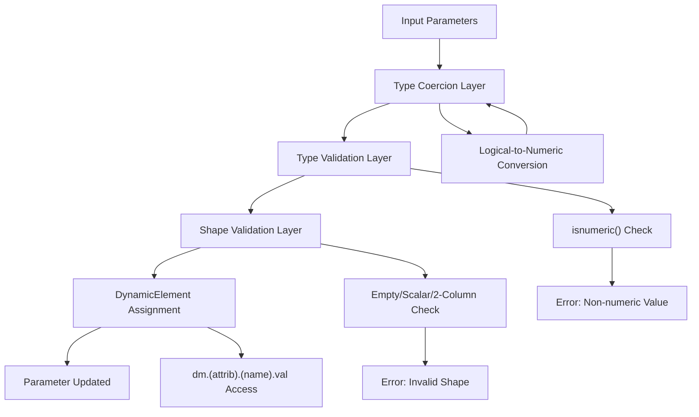
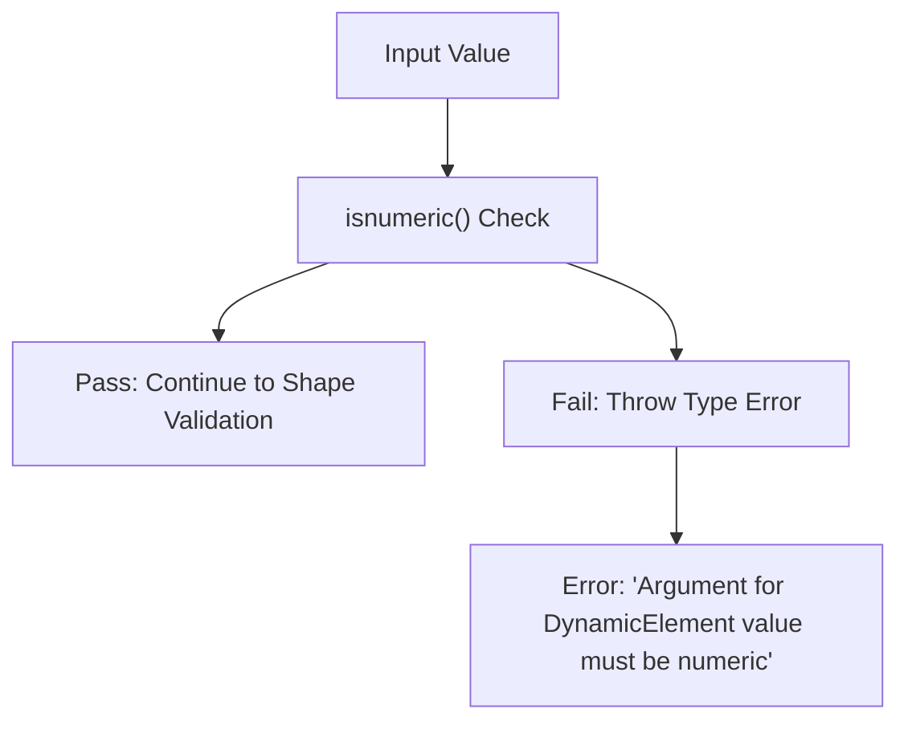
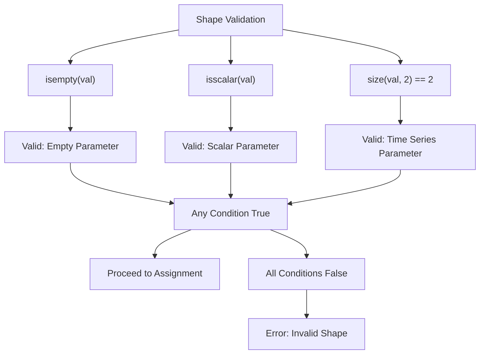
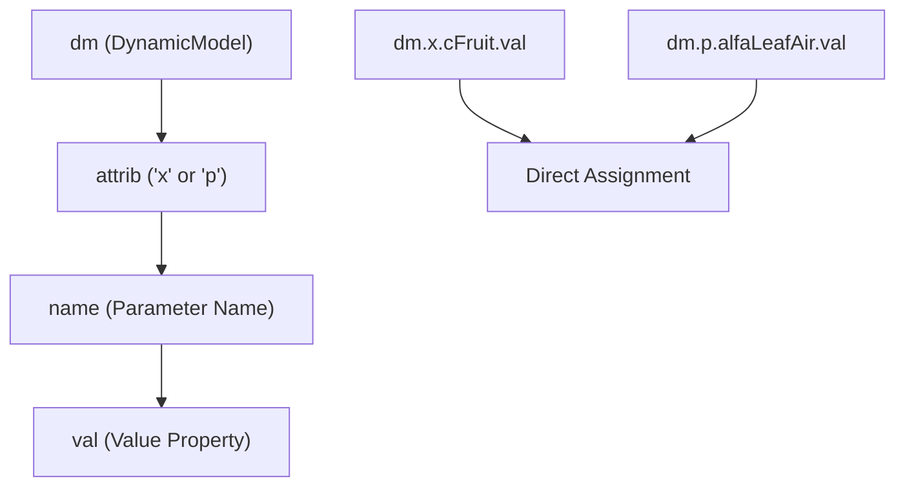
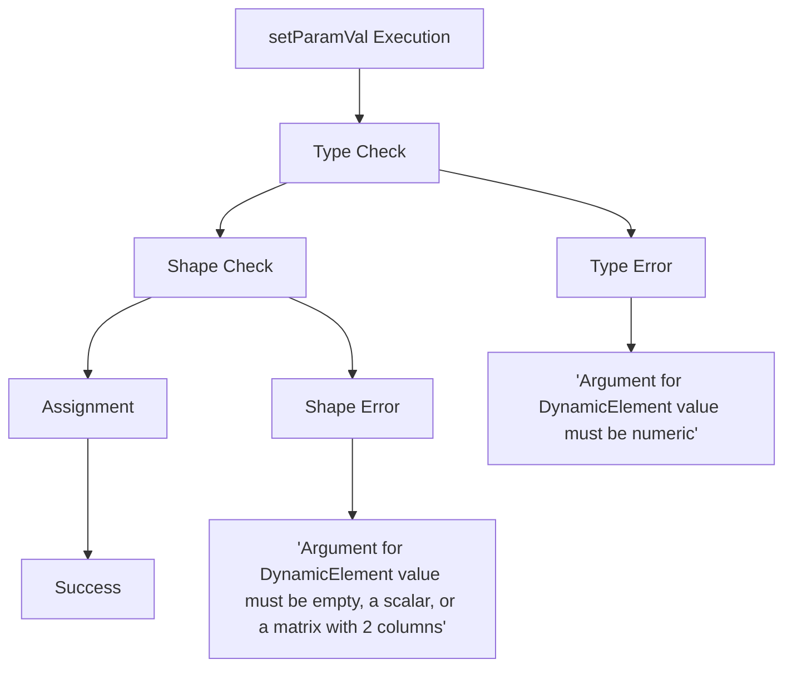

# Implementation Details

> **Relevant source files**
> * [README.md](https://github.com/greenpeer/GreenLight_Extensions/blob/fdc2b4c5/README.md)
> * [setParamVal.m](https://github.com/greenpeer/GreenLight_Extensions/blob/fdc2b4c5/setParamVal.m)

This document provides a detailed analysis of the `setParamVal` function's internal architecture, including its validation logic, type coercion mechanisms, and error handling strategies. For usage examples and API reference, see [3.1](/greenpeer/GreenLight_Extensions/3.1-usage-examples-and-api-reference). For information about the broader data structures and object model, see [4](/greenpeer/GreenLight_Extensions/4-data-structures-and-object-model).

## Function Architecture

The `setParamVal` function implements a layered validation and assignment pipeline that ensures type safety and data integrity when modifying parameters in DynamicModel objects. The function operates through four distinct processing stages: type coercion, type validation, shape validation, and parameter assignment.

### Processing Pipeline

*Processing pipeline showing the four validation stages and error paths*

Sources: [setParamVal.m L1-L24](https://github.com/greenpeer/GreenLight_Extensions/blob/fdc2b4c5/setParamVal.m#L1-L24)

### Type Coercion Mechanism

The function implements automatic type coercion for logical values to ensure compatibility with the numeric parameter system expected by DynamicElement objects.

| Input Type | Coercion Logic | Output Type |
| --- | --- | --- |
| `logical` | `val = 1 * val` | `double` |
| `numeric` | No conversion | `numeric` |
| Other | Error thrown | N/A |

The coercion logic at [setParamVal.m L3-L6](https://github.com/greenpeer/GreenLight_Extensions/blob/fdc2b4c5/setParamVal.m#L3-L6)

 converts boolean values to their numeric equivalents (`true` → `1`, `false` → `0`) using multiplication, which automatically promotes the result to `double` type in MATLAB.

Sources: [setParamVal.m L3-L6](https://github.com/greenpeer/GreenLight_Extensions/blob/fdc2b4c5/setParamVal.m#L3-L6)

## Validation Architecture

### Type Validation Layer

The primary type validation occurs at [setParamVal.m L9](https://github.com/greenpeer/GreenLight_Extensions/blob/fdc2b4c5/setParamVal.m#L9-L9)

 using MATLAB's `isnumeric()` function. This validation accepts all numeric types including `double`, `single`, `int8`, `int16`, `int32`, `int64`, `uint8`, `uint16`, `uint32`, and `uint64`.

*Type validation decision tree*

Sources: [setParamVal.m L9-L22](https://github.com/greenpeer/GreenLight_Extensions/blob/fdc2b4c5/setParamVal.m#L9-L22)

### Shape Validation Layer

The shape validation implements a three-condition OR logic to accommodate different parameter value formats expected by the GreenLight model:

*Shape validation logic supporting three parameter formats*

The validation at [setParamVal.m L11](https://github.com/greenpeer/GreenLight_Extensions/blob/fdc2b4c5/setParamVal.m#L11-L11)

 accepts:

* **Empty values**: `[]` for undefined parameters
* **Scalar values**: Single numeric values for constant parameters
* **2-column matrices**: `[time, value]` pairs for time-varying parameters

Sources: [setParamVal.m L11-L17](https://github.com/greenpeer/GreenLight_Extensions/blob/fdc2b4c5/setParamVal.m#L11-L17)

## DynamicElement Access Pattern

### Object Hierarchy Navigation

The parameter assignment uses MATLAB's dynamic field access to navigate the object hierarchy:

*DynamicElement access pattern showing object navigation*

The assignment statement `dm.(attrib).(name).val = val` at [setParamVal.m L13](https://github.com/greenpeer/GreenLight_Extensions/blob/fdc2b4c5/setParamVal.m#L13-L13)

 uses MATLAB's dynamic field referencing with parentheses notation, allowing runtime determination of field names.

### Namespace Organization

The function operates within the GreenLight model's namespace structure:

| Namespace | Description | Example Parameters |
| --- | --- | --- |
| `x` | State variables | `cFruit`, `co2Air` |
| `p` | Parameters | `alfaLeafAir`, `sigma` |

Sources: [setParamVal.m L13](https://github.com/greenpeer/GreenLight_Extensions/blob/fdc2b4c5/setParamVal.m#L13-L13)

 [README.md L29-L33](https://github.com/greenpeer/GreenLight_Extensions/blob/fdc2b4c5/README.md#L29-L33)

## Error Handling Strategy

### Error Classification

The function implements a fail-fast error handling strategy with specific error messages for different failure modes:

*Error handling decision tree with specific error messages*

### Error Message Design

The error messages at [setParamVal.m L16](https://github.com/greenpeer/GreenLight_Extensions/blob/fdc2b4c5/setParamVal.m#L16-L16)

 and [setParamVal.m L21](https://github.com/greenpeer/GreenLight_Extensions/blob/fdc2b4c5/setParamVal.m#L21-L21)

 provide specific guidance:

* **Type Error**: Indicates the value must be numeric, helping users identify type conversion issues
* **Shape Error**: Specifies the exact shape requirements, helping users format their data correctly

Sources: [setParamVal.m L16](https://github.com/greenpeer/GreenLight_Extensions/blob/fdc2b4c5/setParamVal.m#L16-L16)

 [setParamVal.m L21](https://github.com/greenpeer/GreenLight_Extensions/blob/fdc2b4c5/setParamVal.m#L21-L21)

## Implementation Characteristics

### Performance Considerations

The function implements early termination validation, where type checking occurs before more expensive shape validation operations. The `isnumeric()` check is computationally efficient and prevents unnecessary `size()` calculations for invalid inputs.

### Memory Safety

The direct assignment pattern `dm.(attrib).(name).val = val` relies on MATLAB's reference semantics for object properties, ensuring that changes are immediately reflected in the original DynamicModel object without creating copies.

### Extensibility Limitations

The current implementation hardcodes the validation logic and does not provide extension points for custom validation rules or additional data types. The attribute namespace is implicitly limited to 'x' and 'p' based on documentation, though the code itself does not enforce this constraint.

Sources: [setParamVal.m L1-L24](https://github.com/greenpeer/GreenLight_Extensions/blob/fdc2b4c5/setParamVal.m#L1-L24)

 [README.md L211-L212](https://github.com/greenpeer/GreenLight_Extensions/blob/fdc2b4c5/README.md#L211-L212)