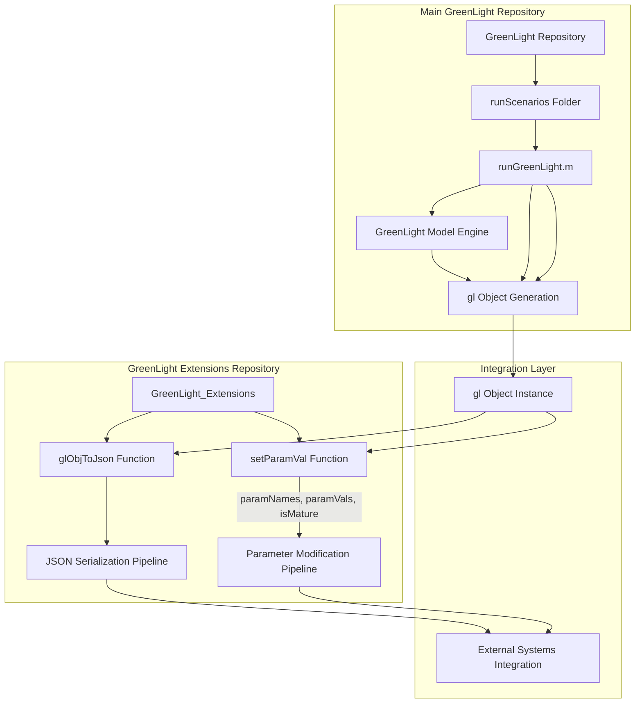
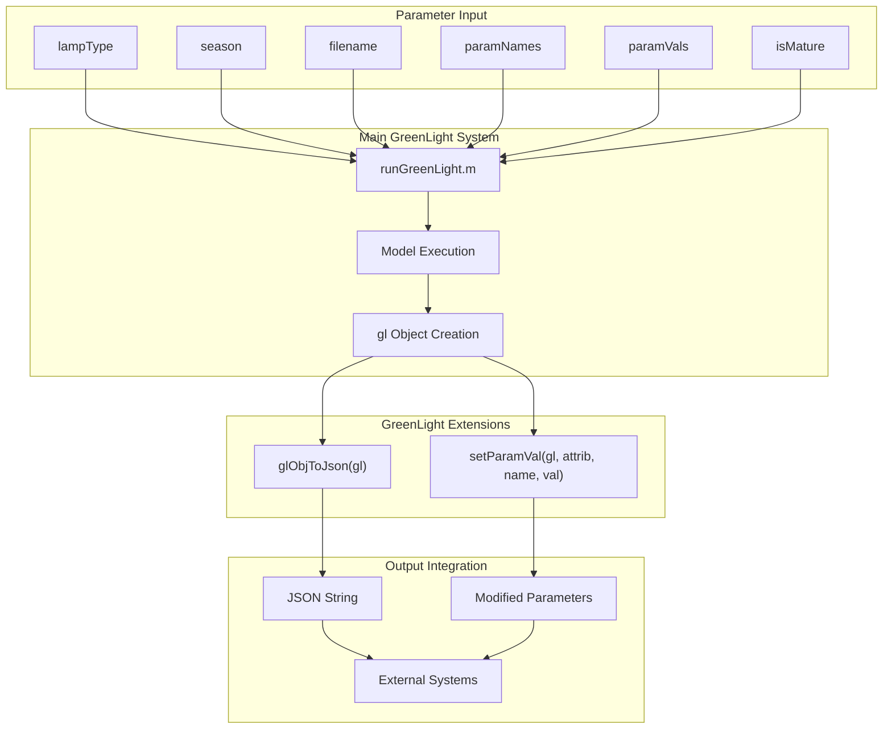
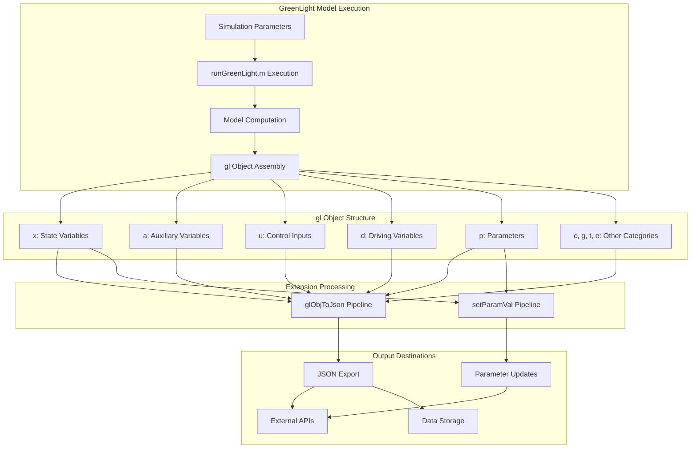
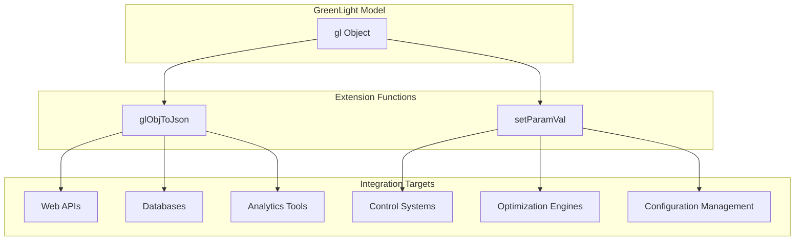

# Integration with GreenLight

> **Relevant source files**
> * [README.md](https://github.com/greenpeer/GreenLight_Extensions/blob/fdc2b4c5/README.md)

This document explains how the GreenLight Extensions integrate with the main GreenLight greenhouse modeling repository, including the dependency relationships, workflow integration, and data exchange mechanisms between the two systems.

For information about the internal architecture of the extension functions themselves, see [System Architecture](/greenpeer/GreenLight_Extensions/1.1-system-architecture). For details about the specific function APIs and usage patterns, see [JSON Serialization (glObjToJson)](/greenpeer/GreenLight_Extensions/2-json-serialization-(globjtojson)) and [Parameter Modification (setParamVal)](/greenpeer/GreenLight_Extensions/3-parameter-modification-(setparamval)).

## Repository Dependencies and Structure

The GreenLight Extensions system operates as a separate repository that depends on objects generated by the main GreenLight repository. The integration follows a clear dependency hierarchy where the extensions consume `gl` objects produced by the main GreenLight modeling system.



**Repository Dependency Structure**

The extensions repository does not include the main GreenLight modeling code but instead operates on `gl` objects that must be generated separately using the main GreenLight repository.

Sources: [README.md L21-L23](https://github.com/greenpeer/GreenLight_Extensions/blob/fdc2b4c5/README.md#L21-L23)

 [README.md L39-L43](https://github.com/greenpeer/GreenLight_Extensions/blob/fdc2b4c5/README.md#L39-L43)

## Object Generation Workflow

The primary integration workflow begins with generating a `gl` object using the main GreenLight repository, then passing this object to the extension functions for JSON serialization or parameter modification.



**Core Integration Function Call**

The main integration point uses the `runGreenLight` function signature:

```
gl = runGreenLight(lampType, season, filename, paramNames, paramVals, isMature)
```

This generates the `gl` object that serves as input to both extension functions.

Sources: [README.md L42](https://github.com/greenpeer/GreenLight_Extensions/blob/fdc2b4c5/README.md#L42-L42)

 [README.md L23](https://github.com/greenpeer/GreenLight_Extensions/blob/fdc2b4c5/README.md#L23-L23)

## Data Flow and Object Lifecycle

The integration involves a clear data flow where the `gl` object serves as the central data structure that bridges the main GreenLight system with external integrations through the extensions.



**Object Namespace Integration**

The `gl` object contains multiple namespaces that the extensions handle differently:

| Namespace | Purpose | glObjToJson Support | setParamVal Support |
| --- | --- | --- | --- |
| `x` | State Variables | ✓ | ✓ |
| `a` | Auxiliary Variables | ✓ | ✗ |
| `u` | Control Inputs | ✓ | ✗ |
| `d` | Driving Variables | ✓ | ✗ |
| `p` | Parameters | ✓ | ✓ |
| `c,g,t,e` | Other Categories | ✓ | ✗ |

Sources: [README.md L54-L133](https://github.com/greenpeer/GreenLight_Extensions/blob/fdc2b4c5/README.md#L54-L133)

 [README.md L29-L33](https://github.com/greenpeer/GreenLight_Extensions/blob/fdc2b4c5/README.md#L29-L33)

 [README.md L211](https://github.com/greenpeer/GreenLight_Extensions/blob/fdc2b4c5/README.md#L211-L211)

## Integration Points and External System Connectivity

The extensions provide specific integration capabilities that enable the GreenLight model to connect with external systems and workflows.

**JSON Serialization Integration**

The `glObjToJson` function enables integration with:

* Web service APIs requiring JSON data exchange
* Database systems with JSON field support
* Cross-platform data analysis tools (Python, R, JavaScript)
* Data persistence and archival systems

**Parameter Modification Integration**

The `setParamVal` function enables integration with:

* Automated parameter optimization workflows
* External control systems
* Configuration management tools
* Batch simulation parameter sweeps



**Installation and Setup Integration**

The extensions are designed as a standalone repository that can be cloned and used alongside an existing GreenLight installation:

```
git clone https://github.com/greenpeer/GreenLight_Extensions.git
```

The extensions assume that the main GreenLight repository is available and that `runGreenLight.m` can be executed to generate `gl` objects.

Sources: [README.md L15-L19](https://github.com/greenpeer/GreenLight_Extensions/blob/fdc2b4c5/README.md#L15-L19)

 [README.md L21-L23](https://github.com/greenpeer/GreenLight_Extensions/blob/fdc2b4c5/README.md#L21-L23)

## Usage Pattern Integration

The typical integration workflow follows this pattern:

1. **Model Generation**: Execute `runGreenLight.m` from the main GreenLight repository
2. **Object Processing**: Pass the resulting `gl` object to extension functions
3. **Data Export/Modification**: Use `glObjToJson` for serialization or `setParamVal` for parameter changes
4. **External Integration**: Consume outputs in external systems or continue model execution

This workflow enables seamless integration between MATLAB-based greenhouse modeling and broader software ecosystems while maintaining clear separation of concerns between the core modeling functionality and integration capabilities.

Sources: [README.md L25-L33](https://github.com/greenpeer/GreenLight_Extensions/blob/fdc2b4c5/README.md#L25-L33)

 [README.md L45-L49](https://github.com/greenpeer/GreenLight_Extensions/blob/fdc2b4c5/README.md#L45-L49)