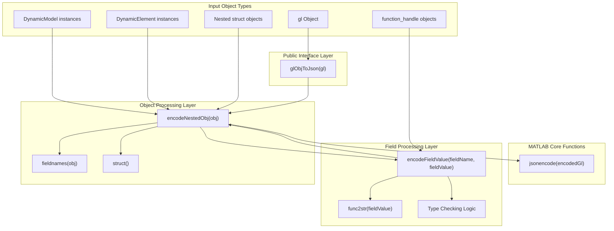
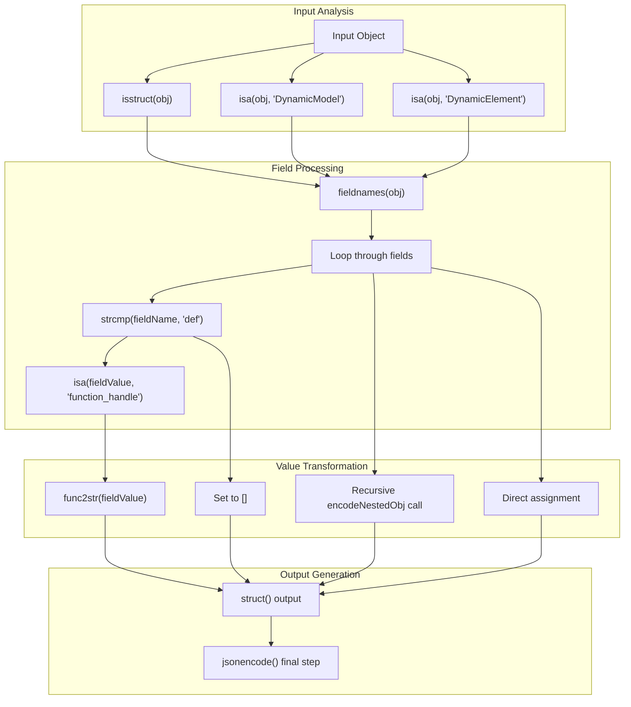

# JSON Serialization (glObjToJson)

> **Relevant source files**
> * [README.md](https://github.com/greenpeer/GreenLight_Extensions/blob/fdc2b4c5/README.md)
> * [glObjToJson.m](https://github.com/greenpeer/GreenLight_Extensions/blob/fdc2b4c5/glObjToJson.m)

This document covers the `glObjToJson` function, which provides JSON serialization capabilities for GreenLight model objects. The function converts complex MATLAB objects containing nested structures, DynamicModel instances, DynamicElement instances, and function handles into JSON format suitable for data exchange and external system integration.

For information about parameter modification of GreenLight objects, see [Parameter Modification (setParamVal)](/greenpeer/GreenLight_Extensions/3-parameter-modification-(setparamval)). For details about the underlying data structures, see [Data Structures and Object Model](/greenpeer/GreenLight_Extensions/4-data-structures-and-object-model).

## Function Architecture

The `glObjToJson` system employs a three-tier recursive architecture to handle complex MATLAB object serialization:



Sources: [glObjToJson.m L1-L18](https://github.com/greenpeer/GreenLight_Extensions/blob/fdc2b4c5/glObjToJson.m#L1-L18)

 [glObjToJson.m L20-L52](https://github.com/greenpeer/GreenLight_Extensions/blob/fdc2b4c5/glObjToJson.m#L20-L52)

 [glObjToJson.m L54-L86](https://github.com/greenpeer/GreenLight_Extensions/blob/fdc2b4c5/glObjToJson.m#L54-L86)

## Object Processing Pipeline

The serialization process follows a recursive pattern that identifies and transforms different object types through specialized processing paths:



Sources: [glObjToJson.m L34-L46](https://github.com/greenpeer/GreenLight_Extensions/blob/fdc2b4c5/glObjToJson.m#L34-L46)

 [glObjToJson.m L68-L84](https://github.com/greenpeer/GreenLight_Extensions/blob/fdc2b4c5/glObjToJson.m#L68-L84)

 [glObjToJson.m L16-L17](https://github.com/greenpeer/GreenLight_Extensions/blob/fdc2b4c5/glObjToJson.m#L16-L17)

## Interface and Usage

The `glObjToJson` function provides a simple interface for converting GreenLight model objects to JSON strings:

| Parameter | Type | Description |
| --- | --- | --- |
| `gl` | GreenLight object | MATLAB object containing nested structures, DynamicModel/DynamicElement instances, and function handles |
| **Returns** | `string` | JSON string representation of the input object |

### Basic Usage

```
json_str = glObjToJson(gl)
```

The `gl` object is typically generated using the GreenLight repository's `runGreenLight.m` function:

```
gl = runGreenLight(lampType, season, filename, paramNames, paramVals, isMature)
json_data = glObjToJson(gl)
```

Sources: [README.md L25-L27](https://github.com/greenpeer/GreenLight_Extensions/blob/fdc2b4c5/README.md#L25-L27)

 [README.md L41-L48](https://github.com/greenpeer/GreenLight_Extensions/blob/fdc2b4c5/README.md#L41-L48)

 [glObjToJson.m L1-L11](https://github.com/greenpeer/GreenLight_Extensions/blob/fdc2b4c5/glObjToJson.m#L1-L11)

## Type Handling Capabilities

The function handles multiple MATLAB object types through specialized processing logic:

### Supported Object Types

| Object Type | Processing Method | Output Format |
| --- | --- | --- |
| `struct` | Recursive field enumeration | JSON object with encoded fields |
| `DynamicModel` | Field-by-field encoding via `fieldnames()` | JSON object structure |
| `DynamicElement` | Field-by-field encoding via `fieldnames()` | JSON object structure |
| `function_handle` (in 'def' fields) | String conversion via `func2str()` | JSON string |
| Empty values | Direct assignment | JSON `[]` |
| Other types | Direct assignment | Native JSON representation |

### Function Handle Processing

Function handles receive special treatment when found in fields named `'def'`:

```
if strcmp(fieldName, 'def') && isa(fieldValue, 'function_handle')
    encodedValue = func2str(fieldValue);
```

This converts MATLAB function handles to their string representations, preserving the mathematical expressions for external system interpretation.

Sources: [glObjToJson.m L68-L71](https://github.com/greenpeer/GreenLight_Extensions/blob/fdc2b4c5/glObjToJson.m#L68-L71)

 [glObjToJson.m L33-L46](https://github.com/greenpeer/GreenLight_Extensions/blob/fdc2b4c5/glObjToJson.m#L33-L46)

 [glObjToJson.m L77-L79](https://github.com/greenpeer/GreenLight_Extensions/blob/fdc2b4c5/glObjToJson.m#L77-L79)

## JSON Output Structure

The serialized JSON follows a consistent structure that preserves the GreenLight model's organizational namespaces:

### Namespace Organization

| Namespace | Purpose | Example Content |
| --- | --- | --- |
| `x` | State variables | `co2Air`, temperature states |
| `a` | Auxiliary variables | `tauShScrPar`, calculated values |
| `u` | Control inputs | `boil`, control signals |
| `d` | Driving variables | `iGlob`, external inputs |
| `p` | Parameters | `alfaLeafAir`, model constants |
| `c`, `g`, `e` | Other categories | Additional model components |
| `t` | Time | Simulation time information |

### Field Structure Pattern

Each serialized field follows a three-component structure:

```
{
  "fieldName": {
    "label": "namespace.fieldName",
    "def": "@(x,a,u,d,p)mathematical_expression",
    "val": [time_series_data] or scalar_value
  }
}
```

The `label` provides human-readable identification, `def` contains the mathematical function definition as a string, and `val` holds either time series data as arrays or scalar parameter values.

Sources: [README.md L54-L134](https://github.com/greenpeer/GreenLight_Extensions/blob/fdc2b4c5/README.md#L54-L134)

 [README.md L94-L114](https://github.com/greenpeer/GreenLight_Extensions/blob/fdc2b4c5/README.md#L94-L114)

 [README.md L127-L132](https://github.com/greenpeer/GreenLight_Extensions/blob/fdc2b4c5/README.md#L127-L132)