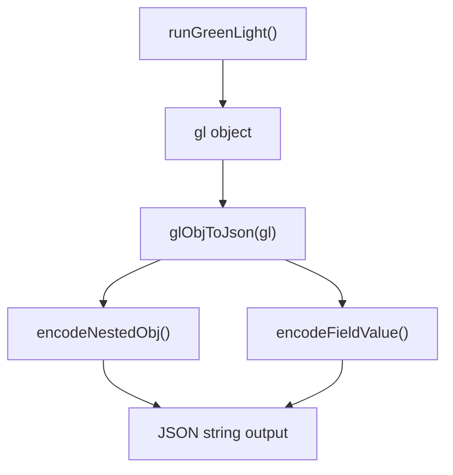
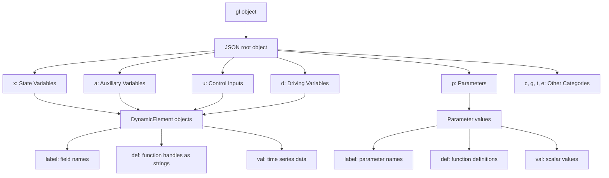
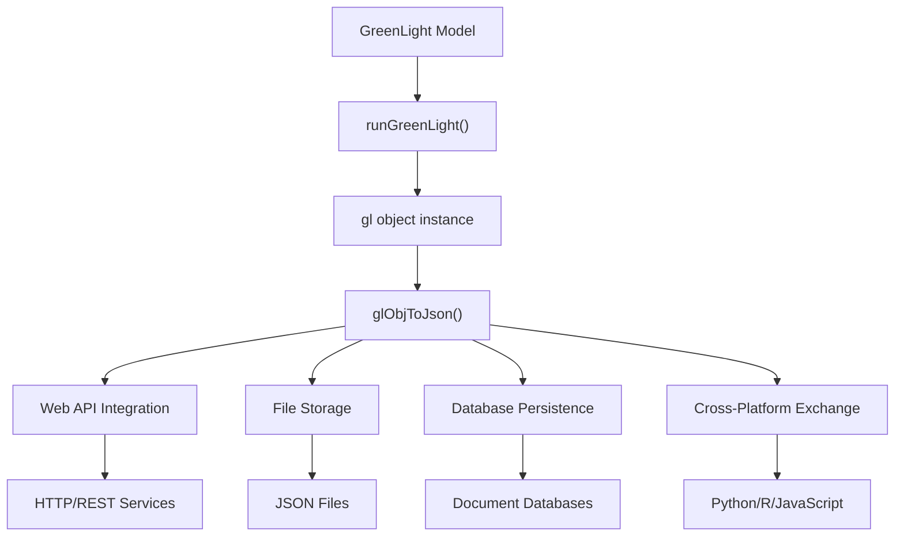

# Usage Examples and API Reference

> **Relevant source files**
> * [README.md](https://github.com/greenpeer/GreenLight_Extensions/blob/fdc2b4c5/README.md)

This document provides practical usage examples and detailed API reference for the `glObjToJson` function, which serializes GreenLight model objects to JSON format. This page focuses on how to use the function, expected inputs and outputs, and common usage patterns.

For implementation details and internal architecture, see [Implementation Details](/greenpeer/GreenLight_Extensions/2.2-implementation-details). For parameter modification functionality, see [Parameter Modification (setParamVal)](/greenpeer/GreenLight_Extensions/3-parameter-modification-(setparamval)).

## Basic Usage

The `glObjToJson` function converts a GreenLight model object (`gl`) into a JSON string representation. The function handles complex nested structures, custom classes, and function handles automatically.

### Simple Usage Example

```
% Generate a gl object using the GreenLight model
gl = runGreenLight(lampType, season, filename, paramNames, paramVals, isMature)

% Convert to JSON string
json_str = glObjToJson(gl)
```

**Sources:** [README.md L25-L27](https://github.com/greenpeer/GreenLight_Extensions/blob/fdc2b4c5/README.md#L25-L27)

 [README.md L41-L48](https://github.com/greenpeer/GreenLight_Extensions/blob/fdc2b4c5/README.md#L41-L48)

### Function Call Flow Diagram



**Sources:** [README.md L139-L143](https://github.com/greenpeer/GreenLight_Extensions/blob/fdc2b4c5/README.md#L139-L143)

 [README.md L147-L162](https://github.com/greenpeer/GreenLight_Extensions/blob/fdc2b4c5/README.md#L147-L162)

## API Reference

### glObjToJson Function

```
json_str = glObjToJson(gl);
```

Converts a GreenLight model object to a JSON string representation.

#### Parameters

| Parameter | Type | Description |
| --- | --- | --- |
| `gl` | Object | A MATLAB GreenLight model object containing nested structures, DynamicModel/DynamicElement instances, function handles, and other field types |

#### Returns

| Return Value | Type | Description |
| --- | --- | --- |
| `json_str` | String | JSON string representation of the input object with function handles converted to strings |

**Sources:** [README.md L147-L162](https://github.com/greenpeer/GreenLight_Extensions/blob/fdc2b4c5/README.md#L147-L162)

### Supporting Functions

The `glObjToJson` function relies on two internal helper functions:

#### encodeNestedObj

```
encodedObj = encodeNestedObj(obj);
```

| Parameter | Type | Description |
| --- | --- | --- |
| `obj` | Object | MATLAB object with nested structures, DynamicModel/DynamicElement instances, or function handles |

**Returns:** Encoded representation of the input object.

#### encodeFieldValue

```
encodedValue = encodeFieldValue(fieldName, fieldValue);
```

| Parameter | Type | Description |
| --- | --- | --- |
| `fieldName` | String | Name of the field being encoded |
| `fieldValue` | Any | Value of the field being encoded |

**Returns:** Encoded value based on field type and name.

**Sources:** [README.md L165-L198](https://github.com/greenpeer/GreenLight_Extensions/blob/fdc2b4c5/README.md#L165-L198)

## JSON Output Structure

The `glObjToJson` function produces JSON with a specific structure that maps GreenLight model namespaces to JSON objects.

### Object-to-JSON Mapping



**Sources:** [README.md L53-L134](https://github.com/greenpeer/GreenLight_Extensions/blob/fdc2b4c5/README.md#L53-L134)

### Expected JSON Schema

Each field in the output JSON follows this structure:

#### For Time Series Data (State/Auxiliary/Control/Driving Variables)

```
{
  "fieldName": {
    "label": "namespace.fieldName",
    "def": "@(x,a,u,d,p)function_definition",
    "val": [
      [time1, value1],
      [time2, value2]
    ]
  }
}
```

#### For Parameters

```
{
  "paramName": {
    "label": "p.paramName", 
    "def": "@(x,a,u,d,p)p.paramName",
    "val": scalar_value
  }
}
```

**Sources:** [README.md L54-L114](https://github.com/greenpeer/GreenLight_Extensions/blob/fdc2b4c5/README.md#L54-L114)

## Common Use Cases

### 1. Model State Export

Export complete model state for external analysis or storage:

```
gl = runGreenLight('led', 'winter', 'greenhouse_config.mat', {}, {}, true);
json_data = glObjToJson(gl);
% Save to file or send to web service
```

### 2. Cross-Platform Integration

Convert MATLAB model data for use in other programming environments:

```javascript
% Export for Python/R analysis
gl_model = runGreenLight(params);
json_export = glObjToJson(gl_model);
% JSON can be consumed by non-MATLAB applications
```

### 3. Model Comparison and Versioning

Serialize models for comparison or version control:

```
% Export baseline model
baseline_json = glObjToJson(baseline_gl);

% Export modified model  
modified_json = glObjToJson(modified_gl);

% Compare JSON strings for differences
```

**Sources:** [README.md L21-L33](https://github.com/greenpeer/GreenLight_Extensions/blob/fdc2b4c5/README.md#L21-L33)

 [README.md L136-L137](https://github.com/greenpeer/GreenLight_Extensions/blob/fdc2b4c5/README.md#L136-L137)

### Data Flow Through Usage Scenarios



**Sources:** [README.md L23-L24](https://github.com/greenpeer/GreenLight_Extensions/blob/fdc2b4c5/README.md#L23-L24)

 [README.md L136-L137](https://github.com/greenpeer/GreenLight_Extensions/blob/fdc2b4c5/README.md#L136-L137)

## Input Object Requirements

The `gl` object passed to `glObjToJson` must be generated by the GreenLight model system. The function expects:

| Namespace | Content Type | Description |
| --- | --- | --- |
| `x` | DynamicElement objects | State variables with time series data |
| `a` | DynamicElement objects | Auxiliary variables with time series data |
| `u` | DynamicElement objects | Control inputs with time series data |
| `d` | DynamicElement objects | Driving variables with time series data |
| `p` | Parameter values | Scalar parameters and constants |
| `c, g, t, e` | Various | Other model components |

**Sources:** [README.md L23-L24](https://github.com/greenpeer/GreenLight_Extensions/blob/fdc2b4c5/README.md#L23-L24)

 [README.md L55-L132](https://github.com/greenpeer/GreenLight_Extensions/blob/fdc2b4c5/README.md#L55-L132)

## Limitations and Considerations

* The function is specifically designed for GreenLight model objects and may not handle arbitrary MATLAB objects
* Function handles are assumed to be in fields named 'def'
* Very large or complex objects may impact performance
* Custom classes other than `DynamicModel` and `DynamicElement` may not serialize correctly

**Sources:** [README.md L221-L226](https://github.com/greenpeer/GreenLight_Extensions/blob/fdc2b4c5/README.md#L221-L226)