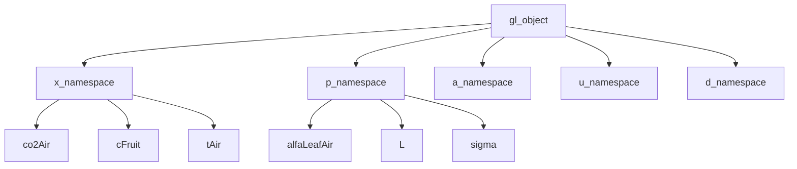
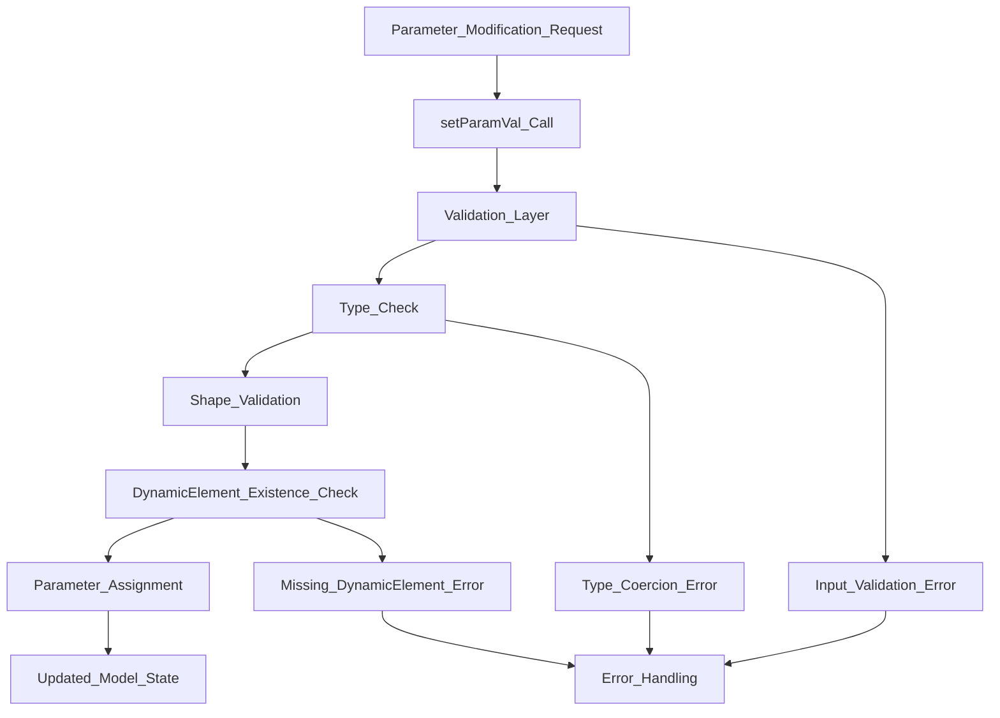
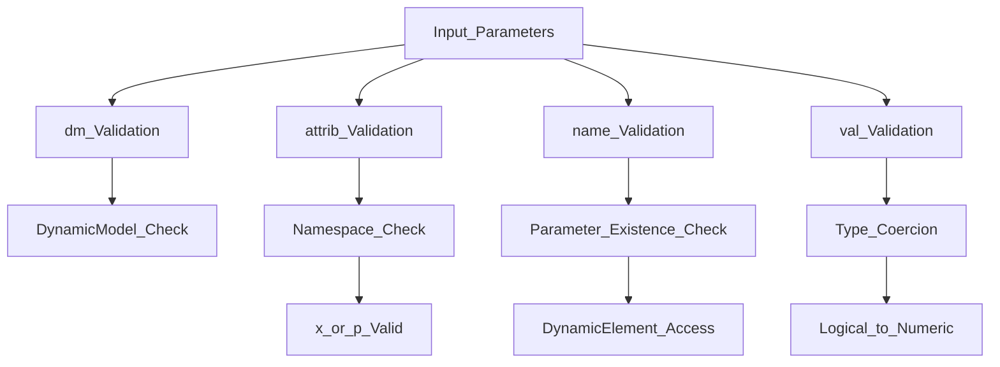
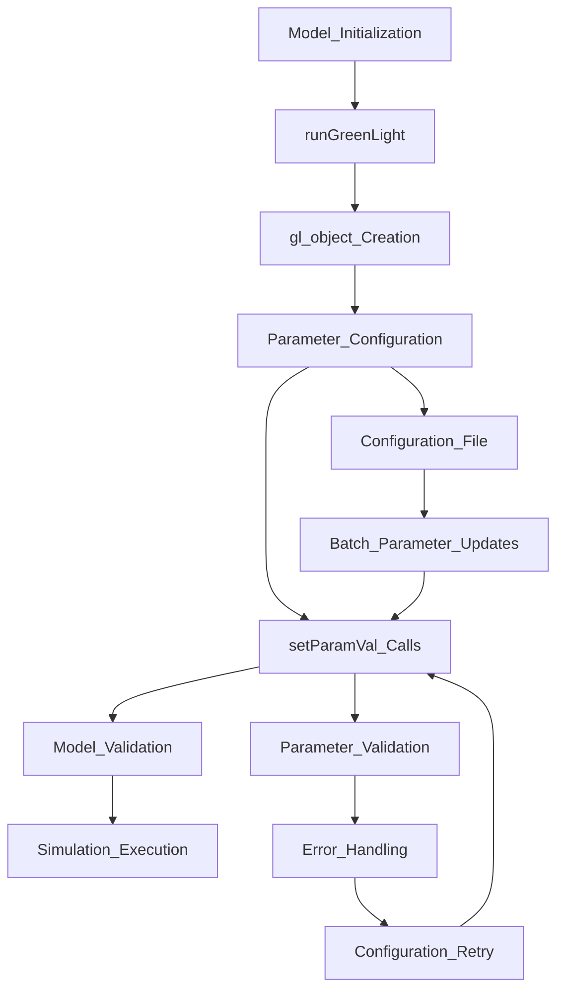

# Usage Examples and API Reference

> **Relevant source files**
> * [README.md](https://github.com/greenpeer/GreenLight_Extensions/blob/fdc2b4c5/README.md)

This document provides practical examples and comprehensive API reference for the `setParamVal` function, which enables programmatic modification of parameters in GreenLight model objects. The examples demonstrate common parameter modification workflows, attribute namespace usage, and integration patterns for dynamic model configuration.

For implementation details and internal architecture, see [Implementation Details](/greenpeer/GreenLight_Extensions/3.2-implementation-details). For broader system context and JSON serialization capabilities, see [JSON Serialization (glObjToJson)](/greenpeer/GreenLight_Extensions/2-json-serialization-(globjtojson)).

## Basic Usage Examples

### Simple Parameter Modification

The most common use case involves modifying a single parameter value within a specific attribute namespace:

```
% Modify a state variable parameter
setParamVal(gl, "x", "cFruit", 2.8e5)

% Modify a model parameter  
setParamVal(gl, "p", "alfaLeafAir", 7.2)
```

### Parameter Modification Workflow

```

```

Sources: [README.md L29-L33](https://github.com/greenpeer/GreenLight_Extensions/blob/fdc2b4c5/README.md#L29-L33)

 [README.md L204-L217](https://github.com/greenpeer/GreenLight_Extensions/blob/fdc2b4c5/README.md#L204-L217)

## Attribute Namespace Usage

The `setParamVal` function operates on two primary attribute namespaces within GreenLight model objects:

### State Variables (x namespace)

The `x` attribute contains state variables that represent dynamic system states:

```
% CO2 concentration in air
setParamVal(gl, "x", "co2Air", 400.0)

% Fruit carbon content
setParamVal(gl, "x", "cFruit", 2.8e5)

% Air temperature
setParamVal(gl, "x", "tAir", 18.5)
```

### Model Parameters (p namespace)

The `p` attribute contains static model parameters that define system characteristics:

```
% Leaf-air heat exchange coefficient
setParamVal(gl, "p", "alfaLeafAir", 5.0)

% Latent heat of vaporization
setParamVal(gl, "p", "L", 2.45e6)

% Stefan-Boltzmann constant
setParamVal(gl, "p", "sigma", 5.67e-8)
```

### Namespace Structure Diagram



Sources: [README.md L29-L33](https://github.com/greenpeer/GreenLight_Extensions/blob/fdc2b4c5/README.md#L29-L33)

 [README.md L210-L211](https://github.com/greenpeer/GreenLight_Extensions/blob/fdc2b4c5/README.md#L210-L211)

## Common Parameter Modification Patterns

### Batch Parameter Updates

```
% Multiple parameter modifications for model calibration
parameters = {
    {"x", "cFruit", 2.8e5},
    {"x", "co2Air", 400.0},
    {"p", "alfaLeafAir", 5.0},
    {"p", "L", 2.45e6}
};

for i = 1:length(parameters)
    param = parameters{i};
    setParamVal(gl, param{1}, param{2}, param{3});
end
```

### Conditional Parameter Setting

```
% Parameter modification based on model state
current_temp = gl.x.tAir.val(end, 2);
if current_temp < 15.0
    setParamVal(gl, "p", "heatCorrection", 2.0);
else
    setParamVal(gl, "p", "heatCorrection", 1.0);
end
```

### Parameter Modification Flow



Sources: [README.md L204-L217](https://github.com/greenpeer/GreenLight_Extensions/blob/fdc2b4c5/README.md#L204-L217)

## API Reference

### Function Signature

```
setParamVal(dm, attrib, name, val)
```

### Parameters

| Parameter | Type | Description | Valid Values |
| --- | --- | --- | --- |
| `dm` | DynamicModel | The GreenLight model object containing parameters to modify | Valid gl object instance |
| `attrib` | string | Attribute namespace specifying parameter category | `"x"` (state variables), `"p"` (parameters) |
| `name` | string | Name of the specific parameter to modify | Any valid parameter name within the specified namespace |
| `val` | numeric | New value to assign to the parameter | Any numeric value compatible with parameter type |

### Return Value

The function does not return any value. It modifies the input `dm` object in place.

### Parameter Validation Rules



Sources: [README.md L204-L217](https://github.com/greenpeer/GreenLight_Extensions/blob/fdc2b4c5/README.md#L204-L217)

## Error Handling and Validation

### Common Error Scenarios

The `setParamVal` function includes comprehensive validation that can generate errors in several scenarios:

1. **Missing DynamicElement**: When the specified parameter does not exist in the target namespace
2. **Invalid Attribute**: When `attrib` is not `"x"` or `"p"`
3. **Type Mismatch**: When `val` cannot be coerced to the expected numeric type
4. **Invalid Model Object**: When `dm` is not a valid DynamicModel instance

### Validation Workflow

```c
% Example error handling pattern
try
    setParamVal(gl, "x", "invalidParam", 1.0);
catch ME
    if contains(ME.message, 'doesn''t exist')
        fprintf('Parameter does not exist in model\n');
    else
        rethrow(ME);
    end
end
```

Sources: [README.md L143](https://github.com/greenpeer/GreenLight_Extensions/blob/fdc2b4c5/README.md#L143-L143)

 [README.md L210-L217](https://github.com/greenpeer/GreenLight_Extensions/blob/fdc2b4c5/README.md#L210-L217)

## Integration Workflows

### Model Configuration Pipeline

The `setParamVal` function typically integrates into larger model configuration workflows:



### External System Integration

```javascript
% Integration with external parameter optimization
function optimizeGreenLightModel(gl, paramConfig)
    for param = paramConfig
        try
            setParamVal(gl, param.namespace, param.name, param.value);
        catch ME
            warning('Failed to set parameter %s.%s: %s', ...
                    param.namespace, param.name, ME.message);
        end
    end
end
```

Sources: [README.md L23-L33](https://github.com/greenpeer/GreenLight_Extensions/blob/fdc2b4c5/README.md#L23-L33)

 [README.md L204-L217](https://github.com/greenpeer/GreenLight_Extensions/blob/fdc2b4c5/README.md#L204-L217)