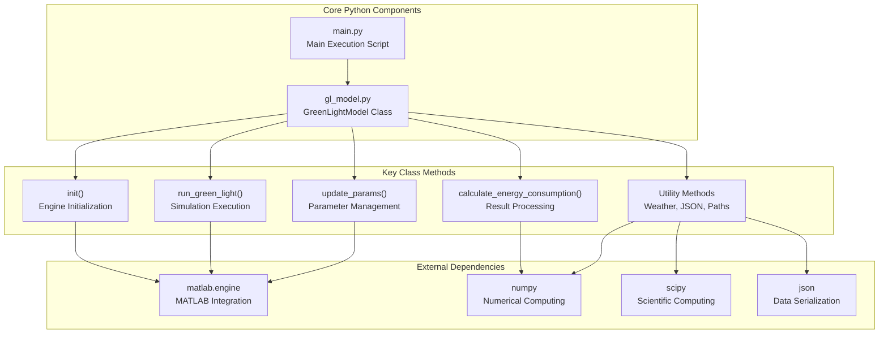

# Core Python Components

> **Relevant source files**
> * [gl_model.py](https://github.com/greenpeer/GreenLightModel/blob/98b32e39/gl_model.py)
> * [main.py](https://github.com/greenpeer/GreenLightModel/blob/98b32e39/main.py)

This document covers the main Python classes and execution components that form the user-facing interface of the GreenLightModel system. The core components consist of the `GreenLightModel` wrapper class and the main execution script that demonstrates typical usage patterns.

For detailed API reference of the GreenLightModel class, see [GreenLightModel Class Reference](/greenpeer/GreenLightModel/3.1-greenlightmodel-class-reference). For information about the main execution script structure, see [Main Execution Script](/greenpeer/GreenLightModel/3.2-main-execution-script). For details about MATLAB integration mechanisms, see [MATLAB Integration](/greenpeer/GreenLightModel/4-matlab-integration).

## System Architecture Overview

The core Python components provide a high-level interface that orchestrates MATLAB-based greenhouse simulations while handling parameter management, data processing, and result formatting.



Sources: [gl_model.py L1-L566](https://github.com/greenpeer/GreenLightModel/blob/98b32e39/gl_model.py#L1-L566)

 [main.py L1-L48](https://github.com/greenpeer/GreenLightModel/blob/98b32e39/main.py#L1-L48)

## GreenLightModel Class Structure

The `GreenLightModel` class serves as the primary interface, managing MATLAB engine lifecycle and providing high-level simulation methods.

```

```

Sources: [gl_model.py L21-L566](https://github.com/greenpeer/GreenLightModel/blob/98b32e39/gl_model.py#L21-L566)

## Execution Flow Pattern

The typical execution pattern involves initialization, parameter configuration, simulation execution, and result processing.

```

```

Sources: [main.py L4-L47](https://github.com/greenpeer/GreenLightModel/blob/98b32e39/main.py#L4-L47)

 [gl_model.py L89-L203](https://github.com/greenpeer/GreenLightModel/blob/98b32e39/gl_model.py#L89-L203)

## Core Component Responsibilities

### GreenLightModel Class

The `GreenLightModel` class [gl_model.py L21-L566](https://github.com/greenpeer/GreenLightModel/blob/98b32e39/gl_model.py#L21-L566)

 serves as the central orchestrator with the following key responsibilities:

| Component | Methods | Purpose |
| --- | --- | --- |
| **Engine Management** | `__init__()`, `add_paths()`, `quit()` | MATLAB engine lifecycle and path configuration |
| **Simulation Control** | `run_green_light()`, `update_params()` | Primary simulation execution and parameter management |
| **Data Processing** | `calculate_energy_consumption()`, `save_to_json()` | Result processing and output formatting |
| **Weather Utilities** | `makeArtificialInput()`, `co2ppm2dens()`, `day_light_sum()` | Weather data generation and conversion |
| **Parameter Utilities** | `params_from_string()`, `formula_result()` | Formula parsing and dependent parameter calculation |
| **File Management** | `default_output_folder()`, `data_folder()` | Directory path management |

### Main Execution Script

The `main.py` script [main.py L1-L48](https://github.com/greenpeer/GreenLightModel/blob/98b32e39/main.py#L1-L48)

 demonstrates the standard usage pattern:

1. **Initialization**: Creates `GreenLightModel` instance [main.py L8](https://github.com/greenpeer/GreenLightModel/blob/98b32e39/main.py#L8-L8)
2. **Configuration**: Sets initial parameters in dictionary format [main.py L11-L16](https://github.com/greenpeer/GreenLightModel/blob/98b32e39/main.py#L11-L16)
3. **Execution**: Calls `run_green_light()` with simulation parameters [main.py L19-L27](https://github.com/greenpeer/GreenLightModel/blob/98b32e39/main.py#L19-L27)
4. **Analysis**: Calculates energy consumption metrics [main.py L33-L37](https://github.com/greenpeer/GreenLightModel/blob/98b32e39/main.py#L33-L37)
5. **Cleanup**: Terminates MATLAB engine [main.py L30](https://github.com/greenpeer/GreenLightModel/blob/98b32e39/main.py#L30-L30)

## Key Method Categories

### Primary Interface Methods

* **`run_green_light()`** [gl_model.py L89-L203](https://github.com/greenpeer/GreenLightModel/blob/98b32e39/gl_model.py#L89-L203) : Core simulation method that orchestrates weather loading, model creation, parameter setting, solving, and result processing
* **`update_params()`** [gl_model.py L205-L242](https://github.com/greenpeer/GreenLightModel/blob/98b32e39/gl_model.py#L205-L242) : Handles parameter updates for both regular parameters (`p`) and state variables (`x`)
* **`calculate_energy_consumption()`** [gl_model.py L244-L281](https://github.com/greenpeer/GreenLightModel/blob/98b32e39/gl_model.py#L244-L281) : Processes simulation results to compute energy metrics using trapezoidal integration

### Utility Methods

* **Weather Processing**: `makeArtificialInput()` [gl_model.py L297-L329](https://github.com/greenpeer/GreenLightModel/blob/98b32e39/gl_model.py#L297-L329)  `co2ppm2dens()` [gl_model.py L331-L356](https://github.com/greenpeer/GreenLightModel/blob/98b32e39/gl_model.py#L331-L356)  `day_light_sum()` [gl_model.py L358-L399](https://github.com/greenpeer/GreenLightModel/blob/98b32e39/gl_model.py#L358-L399)
* **Parameter Processing**: `params_from_string()` [gl_model.py L440-L456](https://github.com/greenpeer/GreenLightModel/blob/98b32e39/gl_model.py#L440-L456)  `formula_result()` [gl_model.py L458-L478](https://github.com/greenpeer/GreenLightModel/blob/98b32e39/gl_model.py#L458-L478)
* **File Operations**: `save_to_json()` [gl_model.py L480-L505](https://github.com/greenpeer/GreenLightModel/blob/98b32e39/gl_model.py#L480-L505)  `default_output_folder()` [gl_model.py L287-L289](https://github.com/greenpeer/GreenLightModel/blob/98b32e39/gl_model.py#L287-L289)  `data_folder()` [gl_model.py L291-L295](https://github.com/greenpeer/GreenLightModel/blob/98b32e39/gl_model.py#L291-L295)

Sources: [gl_model.py L21-L566](https://github.com/greenpeer/GreenLightModel/blob/98b32e39/gl_model.py#L21-L566)

 [main.py L1-L48](https://github.com/greenpeer/GreenLightModel/blob/98b32e39/main.py#L1-L48)