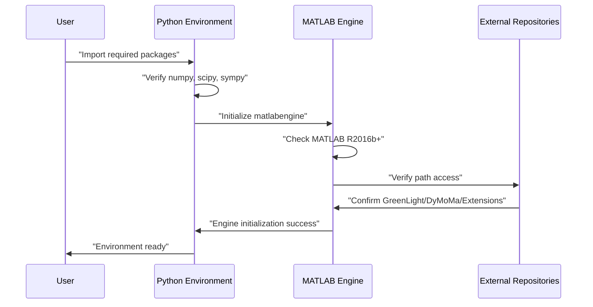

# Dependencies and Environment Setup

> **Relevant source files**
> * [README.md](https://github.com/greenpeer/GreenLightModel/blob/98b32e39/README.md)
> * [requirements.txt](https://github.com/greenpeer/GreenLightModel/blob/98b32e39/requirements.txt)

This document covers the software dependencies, external repositories, and environment configuration required to run the GreenLightModel system. This includes both Python package dependencies and the MATLAB runtime environment that powers the core greenhouse simulation engine.

For information about configuring development-specific settings, see [Development Configuration](/greenpeer/GreenLightModel/6.2-development-configuration). For details about the core Python components that these dependencies support, see [Core Python Components](/greenpeer/GreenLightModel/3-core-python-components).

## System Requirements

The GreenLightModel system operates as a hybrid Python-MATLAB architecture requiring both environments to be properly configured and integrated.

### Core Runtime Dependencies

**Python Environment:**

* Python 3.x (compatible with MATLAB Engine API)
* MATLAB Engine API for Python (`matlabengine`)
* Scientific computing packages: `numpy`, `scipy`, `sympy`
* MATLAB bridge package: `matlab`

**MATLAB Environment:**

* MATLAB R2016b or later version
* Access to MATLAB runtime for executing simulation models
* Path configuration for external MATLAB repositories

Sources: [README.md L62-L79](https://github.com/greenpeer/GreenLightModel/blob/98b32e39/README.md#L62-L79)

### Dependency Architecture

```

```

Sources: [README.md L60-L79](https://github.com/greenpeer/GreenLightModel/blob/98b32e39/README.md#L60-L79)

 [requirements.txt L1-L5](https://github.com/greenpeer/GreenLightModel/blob/98b32e39/requirements.txt#L1-L5)

## Python Package Dependencies

The system requires specific Python packages as defined in the requirements file:

| Package | Purpose | Version Requirements |
| --- | --- | --- |
| `scipy` | Scientific computing library | Latest compatible |
| `numpy` | Numerical array processing | Latest compatible |
| `matlab` | MATLAB-Python bridge utilities | Latest compatible |
| `sympy` | Symbolic mathematics | For formula evaluation |
| `matlabengine` | MATLAB Engine API for Python | MATLAB version dependent |

### Installing Python Dependencies

```
pip install -r requirements.txt
```

### MATLAB Engine API Installation

The MATLAB Engine API requires special installation:

```
python -m pip install matlabengine
```

**Note:** The `matlabengine` package version must be compatible with your installed MATLAB version. Mismatched versions will cause runtime failures when the `GreenLightModel` class attempts to initialize the MATLAB engine.

Sources: [README.md L69-L79](https://github.com/greenpeer/GreenLightModel/blob/98b32e39/README.md#L69-L79)

 [requirements.txt L1-L5](https://github.com/greenpeer/GreenLightModel/blob/98b32e39/requirements.txt#L1-L5)

## External Repository Dependencies

The system depends on three external MATLAB repositories that must be cloned and properly positioned:

### Required MATLAB Repositories

```

```

### Cloning External Dependencies

```
git clone https://github.com/davkat1/GreenLight.git
git clone https://github.com/davkat1/DyMoMa.git
git clone https://github.com/greenpeer/GreenLight_Extensions.git
```

Sources: [README.md L54-L67](https://github.com/greenpeer/GreenLightModel/blob/98b32e39/README.md#L54-L67)

## Installation Methods

The system supports two installation approaches with different dependency management strategies.

### Method 1: Automated Dependency Installation (Recommended)

This method uses the provided requirements file for streamlined setup:

```
git clone https://github.com/greenpeer/GreenLightModel
cd GreenLightModel
pip install -r requirements.txt
```

**Advantages:**

* Automatically installs all Python dependencies
* Consistent dependency versions
* Simpler setup process

**Requirements:**

* External MATLAB repositories must still be manually positioned
* MATLAB installation must be completed separately

### Method 2: Manual Repository Management

This method requires manual positioning of all repositories in a shared directory:

**Directory Structure Required:**

```markdown
parent_directory/
├── GreenLightModel/          # This repository
├── GreenLight/               # Core MATLAB model
├── DyMoMa/                   # Dynamic modeling framework  
└── GreenLight_Extensions/    # JSON utilities
```

**Setup Steps:**

1. Download all four repositories
2. Place them in the same parent directory
3. Install Python dependencies manually
4. Verify MATLAB can access all repositories

Sources: [README.md L34-L58](https://github.com/greenpeer/GreenLightModel/blob/98b32e39/README.md#L34-L58)

## Environment Verification

### Dependency Verification Flow



### Testing Installation

To verify your environment is properly configured, you can test the core imports:

```javascript
# Test Python dependencies
import numpy
import scipy
import sympy
import matlab.engine

# Test GreenLightModel initialization
from gl_model import GreenLightModel
model = GreenLightModel()  # Should initialize without errors
model.quit()  # Clean shutdown
```

**Common Issues:**

* **MATLAB Engine fails to start**: Check MATLAB installation and version compatibility
* **Path errors**: Verify external repositories are in correct locations
* **Import errors**: Confirm all Python dependencies are installed

Sources: [README.md L83-L94](https://github.com/greenpeer/GreenLightModel/blob/98b32e39/README.md#L83-L94)

## Directory Structure Requirements

### Path Configuration for GreenLightModel

The `GreenLightModel` class automatically configures MATLAB paths using the `add_paths()` method, but requires specific directory relationships:

```

```

### Weather Data Structure

The system expects weather input data in a specific directory structure:

```markdown
GreenLightModel/
└── inputs/
    └── energyPlus/
        └── data/
            ├── bei.epw          # Beijing weather data
            ├── ams.epw          # Amsterdam weather data
            └── [location].epw   # Additional weather files
```

Sources: [README.md L48-L58](https://github.com/greenpeer/GreenLightModel/blob/98b32e39/README.md#L48-L58)

 [README.md L190-L213](https://github.com/greenpeer/GreenLightModel/blob/98b32e39/README.md#L190-L213)