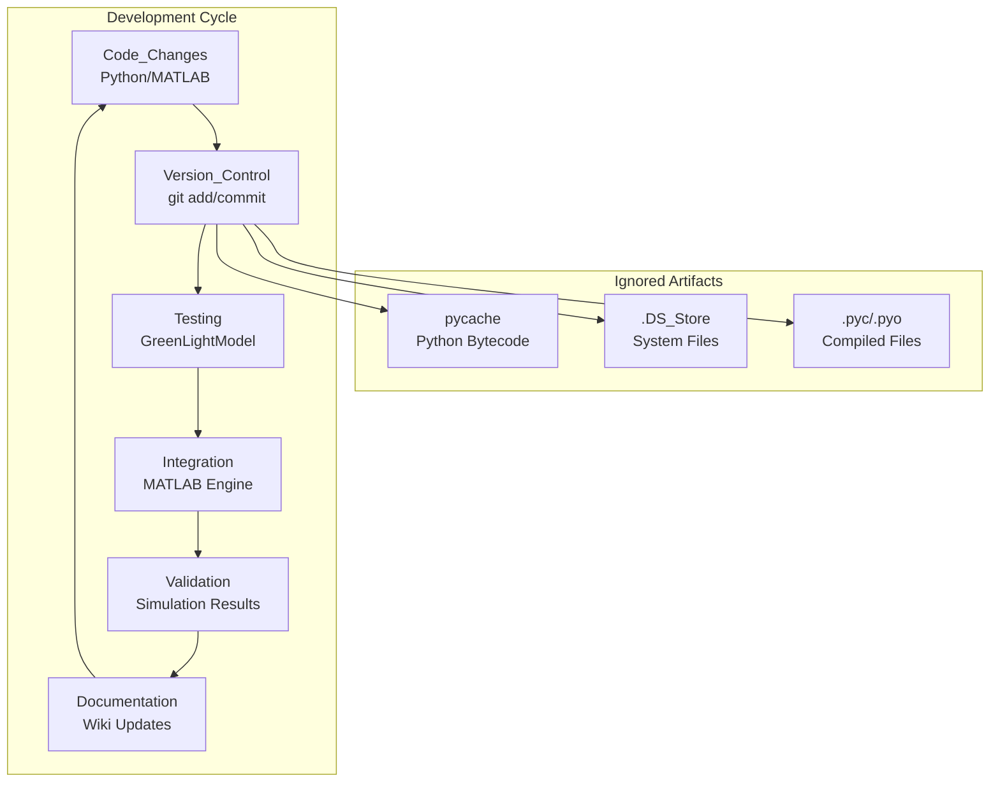

# Development Configuration

> **Relevant source files**
> * [.gitignore](https://github.com/greenpeer/GreenLightModel/blob/98b32e39/.gitignore)

This document covers the development setup and configuration for the GreenLightModel repository, including version control configuration and project structure conventions. For information about system dependencies and environment setup, see [Dependencies and Environment Setup](/greenpeer/GreenLightModel/6.1-dependencies-and-environment-setup).

## Version Control Configuration

The repository uses Git for version control with a minimal `.gitignore` configuration that excludes common Python and system artifacts.

### Ignored Files and Patterns

The version control system is configured to ignore the following file types and patterns:

| Pattern | Purpose | File Types |
| --- | --- | --- |
| `.DS_Store` | macOS system files | System metadata |
| `__pycache__/` | Python bytecode cache | Directory |
| `*.pyc` | Compiled Python files | Bytecode |
| `*.pyo` | Optimized Python files | Bytecode |
| `*.pyd` | Python dynamic libraries | Extensions |

The `.gitignore` configuration focuses on Python-specific artifacts and common development environment files, reflecting the hybrid Python-MATLAB nature of the system.

**Sources:** [.gitignore L1-L5](https://github.com/greenpeer/GreenLightModel/blob/98b32e39/.gitignore#L1-L5)

## Project Structure Overview

The GreenLightModel repository follows a hybrid architecture that bridges Python and MATLAB components. The project structure reflects this design with clear separation between interface layers and core functionality.

### Core Project Architecture

```

```

**Sources:** [.gitignore L1-L5](https://github.com/greenpeer/GreenLightModel/blob/98b32e39/.gitignore#L1-L5)

## Development Workflow Patterns

The development configuration supports a structured workflow that manages the complexity of the hybrid Python-MATLAB system.

### Component Development Flow



**Sources:** [.gitignore L1-L5](https://github.com/greenpeer/GreenLightModel/blob/98b32e39/.gitignore#L1-L5)

## Code Organization Principles

### File Naming and Structure Conventions

The project follows specific conventions for organizing code across the Python-MATLAB boundary:

| Component Type | Naming Pattern | Purpose |
| --- | --- | --- |
| Python Interfaces | `*_model.py` | Main class definitions |
| Execution Scripts | `main.py` | Entry points and examples |
| MATLAB Extensions | CamelCase functions | GreenLight integration |
| Configuration Files | Lowercase with extensions | System setup |

### Import and Path Management

The development configuration assumes that MATLAB components are managed through the Python interface, with the `GreenLightModel` class handling path configuration and engine management dynamically during runtime.

### Version Control Best Practices

The minimal `.gitignore` configuration requires developers to be conscious of what artifacts they commit:

* **Tracked**: Source code, configuration files, documentation
* **Ignored**: Compiled bytecode, system files, cache directories
* **Manual Review**: Large data files, temporary outputs, personal configurations

**Sources:** [.gitignore L1-L5](https://github.com/greenpeer/GreenLightModel/blob/98b32e39/.gitignore#L1-L5)

## Development Environment Considerations

### Multi-Language Development

The hybrid nature of the system requires special consideration during development:

1. **Python Development**: Standard Python development practices apply, with bytecode automatically ignored
2. **MATLAB Integration**: MATLAB files are tracked in version control but executed through the Python interface
3. **Cross-Platform Compatibility**: The `.gitignore` includes macOS-specific exclusions (`.DS_Store`) indicating multi-platform development support

### Dependency Management

While specific dependency configuration is covered in [Dependencies and Environment Setup](/greenpeer/GreenLightModel/6.1-dependencies-and-environment-setup), the development configuration supports:

* Python package management through standard tools
* MATLAB Engine API integration
* Scientific computing library compatibility

**Sources:** [.gitignore L1-L5](https://github.com/greenpeer/GreenLightModel/blob/98b32e39/.gitignore#L1-L5)