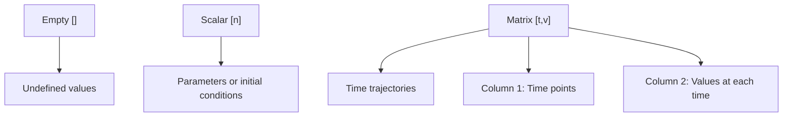
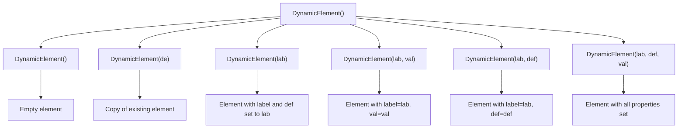
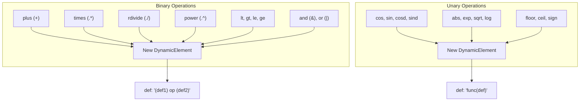
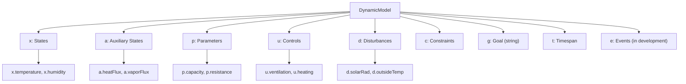

# DyMoMa Framework Overview

> **Relevant source files**
> * [DyMoMa/Code/@DynamicElement/DynamicElement.m](https://github.com/greenpeer/GreenLightModel/blob/98b32e39/DyMoMa/Code/@DynamicElement/DynamicElement.m)
> * [DyMoMa/Code/@DynamicModel/DynamicModel.m](https://github.com/greenpeer/GreenLightModel/blob/98b32e39/DyMoMa/Code/@DynamicModel/DynamicModel.m)
> * [DyMoMa/Code/@DynamicModel/addParam.m](https://github.com/greenpeer/GreenLightModel/blob/98b32e39/DyMoMa/Code/@DynamicModel/addParam.m)
> * [DyMoMa/Code/@DynamicModel/changeRes.m](https://github.com/greenpeer/GreenLightModel/blob/98b32e39/DyMoMa/Code/@DynamicModel/changeRes.m)

## Purpose and Scope

This document covers the DyMoMa (Dynamic Modeling for MATLAB) framework, which provides the foundational mathematical and computational infrastructure for dynamic system modeling within the GreenLightModel system. DyMoMa defines the core classes and methods that enable time-based simulations with differential equations, parameter management, and state tracking.

For information about how DyMoMa integrates with the Python wrapper system, see [MATLAB Integration](/greenpeer/GreenLightModel/4-matlab-integration). For details about the greenhouse-specific modeling logic built on top of DyMoMa, see [Getting Started](/greenpeer/GreenLightModel/2-getting-started).

## Framework Architecture

DyMoMa is built around two core classes that work together to define and execute dynamic models:

```

```

**DyMoMa Core Component Structure**

The framework separates mathematical definitions from computational execution through a two-layer architecture where `DynamicElement` objects contain individual mathematical expressions and `DynamicModel` organizes collections of these elements into a complete system.

Sources: [DyMoMa/Code/ L1-L25](https://github.com/greenpeer/GreenLightModel/blob/98b32e39/DyMoMa/Code/@DynamicElement/DynamicElement.m#L1-L25)

 [DyMoMa/Code/ L1-L35](https://github.com/greenpeer/GreenLightModel/blob/98b32e39/DyMoMa/Code/@DynamicModel/DynamicModel.m#L1-L35)

## DynamicElement Class

The `DynamicElement` class represents individual mathematical entities that evolve over time. Each element contains three core properties:

| Property | Type | Purpose |
| --- | --- | --- |
| `label` | string | Human-readable identifier (e.g., 'x.state1') |
| `def` | function handle | Mathematical definition as ODE function |
| `val` | double | Numeric values (scalar, empty, or time-trajectory matrix) |

### Value Storage Formats

DynamicElements support three value storage formats:



**DynamicElement Value Storage Options**

Sources: [DyMoMa/Code/ L7-L15](https://github.com/greenpeer/GreenLightModel/blob/98b32e39/DyMoMa/Code/@DynamicElement/DynamicElement.m#L7-L15)

 [DyMoMa/Code/ L113-L127](https://github.com/greenpeer/GreenLightModel/blob/98b32e39/DyMoMa/Code/@DynamicElement/DynamicElement.m#L113-L127)

### Constructor Patterns

The `DynamicElement` constructor supports multiple initialization patterns:



**DynamicElement Constructor Usage Patterns**

Sources: [DyMoMa/Code/ L28-L78](https://github.com/greenpeer/GreenLightModel/blob/98b32e39/DyMoMa/Code/@DynamicElement/DynamicElement.m#L28-L78)

### Arithmetic Operations

DynamicElements support comprehensive arithmetic operations that automatically generate new elements with combined mathematical definitions:



**DynamicElement Arithmetic Operation Framework**

The arithmetic operations preserve mathematical relationships by constructing new function definitions that combine the operand definitions. For example, adding two elements creates a new element with `def` as `'(def1) + (def2)'`.

Sources: [DyMoMa/Code/ L300-L416](https://github.com/greenpeer/GreenLightModel/blob/98b32e39/DyMoMa/Code/@DynamicElement/DynamicElement.m#L300-L416)

 [DyMoMa/Code/ L419-L486](https://github.com/greenpeer/GreenLightModel/blob/98b32e39/DyMoMa/Code/@DynamicElement/DynamicElement.m#L419-L486)

## DynamicModel Class

The `DynamicModel` class organizes collections of `DynamicElement` objects into a complete mathematical model suitable for ODE solving. It categorizes elements by their mathematical role:



**DynamicModel Component Organization**

Sources: [DyMoMa/Code/ L4-L17](https://github.com/greenpeer/GreenLightModel/blob/98b32e39/DyMoMa/Code/@DynamicModel/DynamicModel.m#L4-L17)

 [DyMoMa/Code/ L24-L35](https://github.com/greenpeer/GreenLightModel/blob/98b32e39/DyMoMa/Code/@DynamicModel/DynamicModel.m#L24-L35)

### Model Construction and Copying

The `DynamicModel` constructor supports deep copying to ensure mathematical model integrity:

```

```

**DynamicModel Deep Copy Process**

Sources: [DyMoMa/Code/ L38-L73](https://github.com/greenpeer/GreenLightModel/blob/98b32e39/DyMoMa/Code/@DynamicModel/DynamicModel.m#L38-L73)

### Parameter Management

The `addParam` method provides a standardized way to add parameters to models:

```

```

**Parameter Addition Methods**

Sources: [DyMoMa/Code/ L1-L41](https://github.com/greenpeer/GreenLightModel/blob/98b32e39/DyMoMa/Code/@DynamicModel/addParam.m#L1-L41)

### Time Resolution Management

The `changeRes` method creates new models with consistent time resolution across all trajectories:

```

```

**Time Resolution Resampling Process**

This method ensures all time-series data in the model uses consistent time steps, which is essential for numerical integration and analysis.

Sources: [DyMoMa/Code/ L1-L81](https://github.com/greenpeer/GreenLightModel/blob/98b32e39/DyMoMa/Code/@DynamicModel/changeRes.m#L1-L81)

## Integration with GreenLight System

DyMoMa provides the mathematical foundation that supports the greenhouse simulation:

```

```

**DyMoMa Integration within GreenLightModel System**

The framework enables the greenhouse model to define complex systems of differential equations describing thermal dynamics, plant growth, and environmental controls, while providing the computational infrastructure to solve these equations numerically.

Sources: [DyMoMa/Code/ L1-L35](https://github.com/greenpeer/GreenLightModel/blob/98b32e39/DyMoMa/Code/@DynamicModel/DynamicModel.m#L1-L35)

 [DyMoMa/Code/ L1-L25](https://github.com/greenpeer/GreenLightModel/blob/98b32e39/DyMoMa/Code/@DynamicElement/DynamicElement.m#L1-L25)