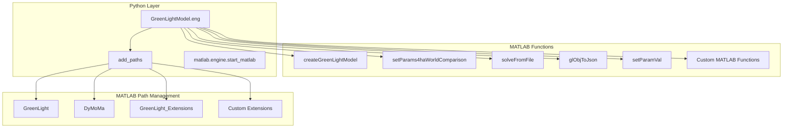
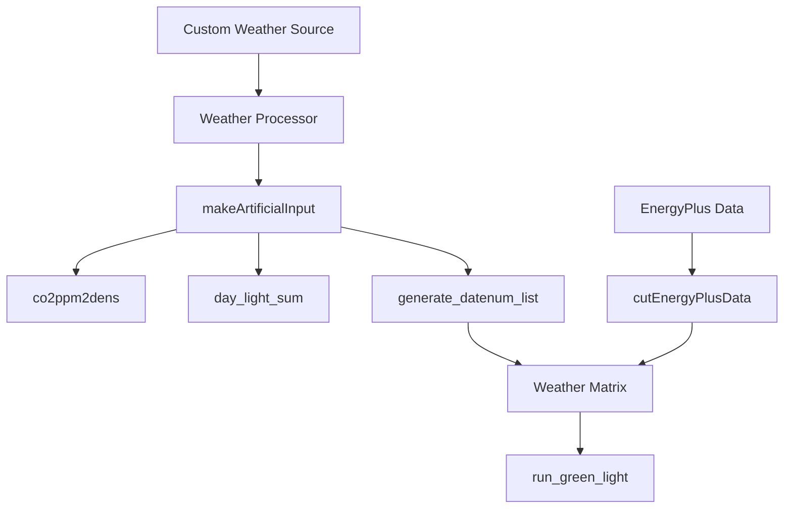
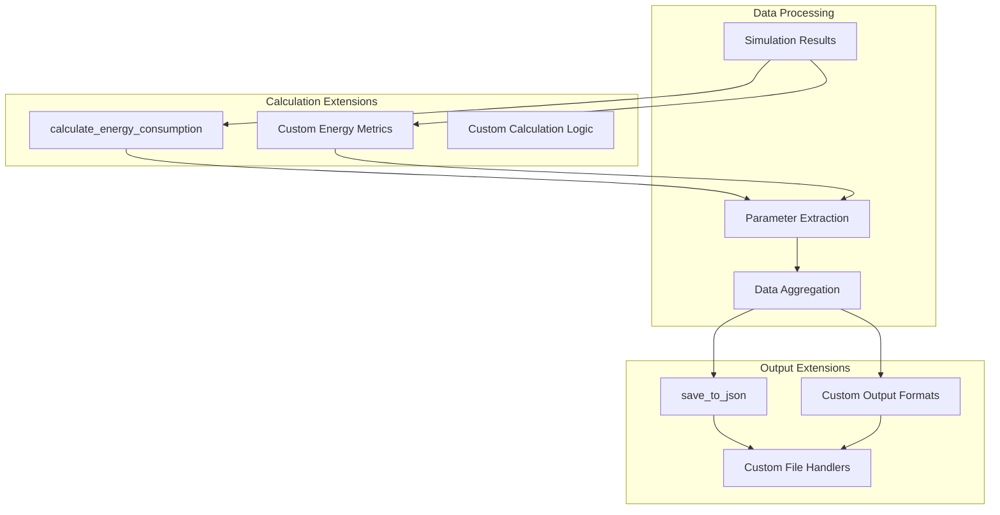

# Extending and Customizing the System

> **Relevant source files**
> * [GreenLight_Extensions/README.md](https://github.com/greenpeer/GreenLightModel/blob/98b32e39/GreenLight_Extensions/README.md)
> * [README.md](https://github.com/greenpeer/GreenLightModel/blob/98b32e39/README.md)
> * [gl_model.py](https://github.com/greenpeer/GreenLightModel/blob/98b32e39/gl_model.py)

This document provides guidance for developers who want to extend the GreenLightModel system, add new functionality, or integrate it with other systems. It covers the major extension points, customization patterns, and integration approaches available in the codebase.

For information about the core system components and basic usage, see [Core Python Components](/greenpeer/GreenLightModel/3-core-python-components). For details about the underlying DyMoMa framework architecture, see [DyMoMa Framework Overview](/greenpeer/GreenLightModel/7.1-dymoma-framework-overview).

## Extension Points Overview

The GreenLightModel system provides several well-defined extension points that allow developers to customize behavior without modifying core functionality.

### System Extension Architecture

```

```

**Sources:** [gl_model.py L21-L566](https://github.com/greenpeer/GreenLightModel/blob/98b32e39/gl_model.py#L21-L566)

 [GreenLight_Extensions/README.md L1-L230](https://github.com/greenpeer/GreenLightModel/blob/98b32e39/GreenLight_Extensions/README.md#L1-L230)

### Core Extension Categories

| Extension Category | Primary Files | Key Methods | Use Cases |
| --- | --- | --- | --- |
| Parameter Management | `gl_model.py` | `update_params`, `formula_result` | Custom parameter logic, validation |
| Weather Processing | `gl_model.py` | `makeArtificialInput`, `co2ppm2dens` | New weather sources, data formats |
| Energy Calculations | `gl_model.py` | `calculate_energy_consumption` | Custom metrics, new energy types |
| MATLAB Integration | `GreenLight_Extensions` | `setParamVal`, `glObjToJson` | MATLAB function additions |
| Output Processing | `gl_model.py` | `save_to_json`, `default_output_folder` | Custom file formats, data export |

**Sources:** [gl_model.py L21-L566](https://github.com/greenpeer/GreenLightModel/blob/98b32e39/gl_model.py#L21-L566)

 [GreenLight_Extensions/README.md L138-L218](https://github.com/greenpeer/GreenLightModel/blob/98b32e39/GreenLight_Extensions/README.md#L138-L218)

## Parameter System Extensions

The parameter system supports both direct parameter setting and formula-based dependent parameters, providing flexible customization options.

### Parameter Extension Pattern

```

```

**Sources:** [gl_model.py L205-L242](https://github.com/greenpeer/GreenLightModel/blob/98b32e39/gl_model.py#L205-L242)

 [gl_model.py L440-L478](https://github.com/greenpeer/GreenLightModel/blob/98b32e39/gl_model.py#L440-L478)

### Adding Custom Parameter Types

To extend parameter handling, developers can subclass `GreenLightModel` and override the `update_params` method:

```python
class ExtendedGreenLightModel(GreenLightModel):
    def update_params(self, gl, initial_gl):
        # Custom parameter preprocessing
        processed_params = self.preprocess_custom_params(initial_gl)
        
        # Call parent implementation
        gl = super().update_params(gl, processed_params)
        
        # Custom post-processing
        return self.postprocess_parameters(gl)
```

The core parameter processing logic is implemented in [gl_model.py L216-L241](https://github.com/greenpeer/GreenLightModel/blob/98b32e39/gl_model.py#L216-L241)

 which handles both simple value assignments and complex nested parameter structures.

### Formula Parameter Extensions

Custom formula evaluators can be added by extending the `formula_result` method at [gl_model.py L458-L478](https://github.com/greenpeer/GreenLightModel/blob/98b32e39/gl_model.py#L458-L478)

 The system uses SymPy for expression parsing and supports custom mathematical functions:

```python
def custom_formula_result(self, param_dict, formula_str, para_list):
    # Add custom mathematical functions
    custom_functions = {'custom_func': self.my_custom_function}
    
    # Extend parameter dictionary
    extended_params = {**param_dict, **custom_functions}
    
    return self.formula_result(extended_params, formula_str, para_list)
```

**Sources:** [gl_model.py L458-L478](https://github.com/greenpeer/GreenLightModel/blob/98b32e39/gl_model.py#L458-L478)

 [gl_model.py L440-L456](https://github.com/greenpeer/GreenLightModel/blob/98b32e39/gl_model.py#L440-L456)

## MATLAB Integration Extensions

The MATLAB integration layer provides extension points for adding new MATLAB functions and customizing the engine interface.

### MATLAB Extension Architecture



**Sources:** [gl_model.py L73-L87](https://github.com/greenpeer/GreenLightModel/blob/98b32e39/gl_model.py#L73-L87)

 [gl_model.py L154-L183](https://github.com/greenpeer/GreenLightModel/blob/98b32e39/gl_model.py#L154-L183)

### Adding Custom MATLAB Functions

To add custom MATLAB functions, extend the `add_paths` method at [gl_model.py L73-L87](https://github.com/greenpeer/GreenLightModel/blob/98b32e39/gl_model.py#L73-L87)

:

```javascript
def add_custom_matlab_paths(self):
    # Add custom MATLAB function directories
    custom_folders = ["CustomGreenLightFunctions", "MyMatlabExtensions"]
    self.add_paths(*custom_folders)
    
    # Verify functions are available
    self.eng.eval("addpath(genpath('./custom_functions'))", nargout=0)
```

The GreenLight Extensions provide a template for MATLAB function development at [GreenLight_Extensions/README.md L138-L218](https://github.com/greenpeer/GreenLightModel/blob/98b32e39/GreenLight_Extensions/README.md#L138-L218)

 including the `setParamVal` and `glObjToJson` functions.

### Custom Parameter Setting Functions

New parameter manipulation functions can be added following the `setParamVal` pattern:

```javascript
function setCustomParam(dm, customType, name, val)
    % Custom parameter setting logic
    if strcmp(customType, 'myType')
        % Handle custom parameter type
        dm.myCustomAttribute.(name).val = val;
    else
        error('Unknown custom parameter type');
    end
end
```

**Sources:** [GreenLight_Extensions/README.md L202-L218](https://github.com/greenpeer/GreenLightModel/blob/98b32e39/GreenLight_Extensions/README.md#L202-L218)

## Data Processing Extensions

The system provides several extension points for customizing weather data processing and input handling.

### Weather Data Extension Points



**Sources:** [gl_model.py L297-L438](https://github.com/greenpeer/GreenLightModel/blob/98b32e39/gl_model.py#L297-L438)

 [gl_model.py L99-L107](https://github.com/greenpeer/GreenLightModel/blob/98b32e39/gl_model.py#L99-L107)

### Custom Weather Data Sources

To add support for new weather data formats, extend the weather loading logic in `run_green_light` at [gl_model.py L99-L107](https://github.com/greenpeer/GreenLightModel/blob/98b32e39/gl_model.py#L99-L107)

:

```python
def load_custom_weather(self, weather_source, **kwargs):
    """Load weather data from custom sources"""
    if weather_source.endswith('.csv'):
        return self.load_csv_weather(weather_source)
    elif weather_source.startswith('api://'):
        return self.load_api_weather(weather_source)
    else:
        # Fall back to default EnergyPlus loading
        return self.eng.cutEnergyPlusData(
            kwargs.get('firstDay', 1),
            kwargs.get('seasonLength', 1/24/6),
            os.path.join(self.data_folder(), weather_source + "EnergyPlus.mat")
        )
```

### Weather Data Processing Functions

The artificial weather generation at [gl_model.py L297-L329](https://github.com/greenpeer/GreenLightModel/blob/98b32e39/gl_model.py#L297-L329)

 provides a template for custom weather processors:

* `makeArtificialInput`: Creates synthetic weather data
* `co2ppm2dens`: Converts CO2 concentrations [gl_model.py L331-L356](https://github.com/greenpeer/GreenLightModel/blob/98b32e39/gl_model.py#L331-L356)
* `day_light_sum`: Calculates daily radiation sums [gl_model.py L358-L399](https://github.com/greenpeer/GreenLightModel/blob/98b32e39/gl_model.py#L358-L399)
* `generate_datenum_list`: Creates time sequences [gl_model.py L401-L438](https://github.com/greenpeer/GreenLightModel/blob/98b32e39/gl_model.py#L401-L438)

**Sources:** [gl_model.py L297-L438](https://github.com/greenpeer/GreenLightModel/blob/98b32e39/gl_model.py#L297-L438)

## Output and Calculation Extensions

The output processing system allows for custom energy calculations and data export formats.

### Output Extension Architecture



**Sources:** [gl_model.py L244-L281](https://github.com/greenpeer/GreenLightModel/blob/98b32e39/gl_model.py#L244-L281)

 [gl_model.py L480-L505](https://github.com/greenpeer/GreenLightModel/blob/98b32e39/gl_model.py#L480-L505)

### Custom Energy Calculations

The `calculate_energy_consumption` method at [gl_model.py L244-L281](https://github.com/greenpeer/GreenLightModel/blob/98b32e39/gl_model.py#L244-L281)

 can be extended for new calculation types:

```python
def calculate_custom_metrics(self, gl, metric_type, *array_keys):
    """Calculate custom energy or performance metrics"""
    if metric_type == 'water_usage':
        return self.calculate_water_consumption(gl, *array_keys)
    elif metric_type == 'light_efficiency':
        return self.calculate_light_efficiency(gl, *array_keys)
    else:
        # Fall back to standard energy calculation
        return self.calculate_energy_consumption(gl, *array_keys)
```

### Custom Output Formats

The JSON output system at [gl_model.py L480-L505](https://github.com/greenpeer/GreenLightModel/blob/98b32e39/gl_model.py#L480-L505)

 can be extended for different output formats:

```python
def save_custom_format(self, data, filename, format_type):
    """Save data in custom formats"""
    if format_type == 'csv':
        self.save_to_csv(data, filename)
    elif format_type == 'hdf5':
        self.save_to_hdf5(data, filename)
    elif format_type == 'parquet':
        self.save_to_parquet(data, filename)
    else:
        # Default to JSON
        self.save_to_json(data, filename)
```

**Sources:** [gl_model.py L480-L505](https://github.com/greenpeer/GreenLightModel/blob/98b32e39/gl_model.py#L480-L505)

 [gl_model.py L287-L295](https://github.com/greenpeer/GreenLightModel/blob/98b32e39/gl_model.py#L287-L295)

## Integration Patterns

The system supports several integration patterns for connecting with external systems and workflows.

### Integration Architecture

```

```

**Sources:** [gl_model.py L89-L203](https://github.com/greenpeer/GreenLightModel/blob/98b32e39/gl_model.py#L89-L203)

 [README.md L111-L172](https://github.com/greenpeer/GreenLightModel/blob/98b32e39/README.md#L111-L172)

### API Integration Pattern

For web service integration, wrap the `GreenLightModel` in a service layer:

```python
class GreenLightService:
    def __init__(self):
        self.model = GreenLightModel()
        
    def run_simulation_api(self, request_data):
        # Validate and process request
        config = self.process_api_request(request_data)
        
        # Run simulation
        results = self.model.run_green_light(**config)
        
        # Process and return results
        return self.format_api_response(results)
        
    def batch_simulation(self, batch_requests):
        # Handle multiple simulations
        results = []
        for request in batch_requests:
            result = self.run_simulation_api(request)
            results.append(result)
        return results
```

### Database Integration

For persistent storage integration:

```python
class DatabaseIntegratedModel(GreenLightModel):
    def __init__(self, db_connection):
        super().__init__()
        self.db = db_connection
        
    def save_simulation_results(self, results, simulation_id):
        # Save to database instead of files
        self.db.save_simulation(simulation_id, results)
        
    def load_historical_parameters(self, experiment_id):
        # Load parameters from database
        return self.db.get_parameters(experiment_id)
```

**Sources:** [gl_model.py L51-L72](https://github.com/greenpeer/GreenLightModel/blob/98b32e39/gl_model.py#L51-L72)

 [gl_model.py L283-L285](https://github.com/greenpeer/GreenLightModel/blob/98b32e39/gl_model.py#L283-L285)

## Best Practices

### Extension Development Guidelines

1. **Preserve Core Functionality**: Always call parent implementations when overriding methods
2. **Parameter Validation**: Validate custom parameters before passing to MATLAB engine
3. **Error Handling**: Implement proper exception handling for MATLAB engine interactions
4. **Resource Management**: Ensure MATLAB engine cleanup in custom implementations
5. **Testing**: Create unit tests for custom extensions using mock MATLAB engines

### Performance Considerations

* **MATLAB Engine Reuse**: Avoid creating multiple engine instances [gl_model.py L67-L68](https://github.com/greenpeer/GreenLightModel/blob/98b32e39/gl_model.py#L67-L68)
* **Memory Management**: Clear large arrays after processing [gl_model.py L269-L280](https://github.com/greenpeer/GreenLightModel/blob/98b32e39/gl_model.py#L269-L280)
* **Path Management**: Add paths once during initialization [gl_model.py L73-L87](https://github.com/greenpeer/GreenLightModel/blob/98b32e39/gl_model.py#L73-L87)
* **Batch Processing**: Process multiple simulations in single engine session

### Integration Security

* **Input Validation**: Sanitize all external inputs before MATLAB execution
* **Path Restrictions**: Limit MATLAB path additions to trusted directories
* **Resource Limits**: Implement timeouts and memory limits for long-running simulations
* **Data Sanitization**: Clean sensitive data from output files

**Sources:** [gl_model.py L51-L566](https://github.com/greenpeer/GreenLightModel/blob/98b32e39/gl_model.py#L51-L566)

 [README.md L34-L79](https://github.com/greenpeer/GreenLightModel/blob/98b32e39/README.md#L34-L79)

 [GreenLight_Extensions/README.md L221-L229](https://github.com/greenpeer/GreenLightModel/blob/98b32e39/GreenLight_Extensions/README.md#L221-L229)