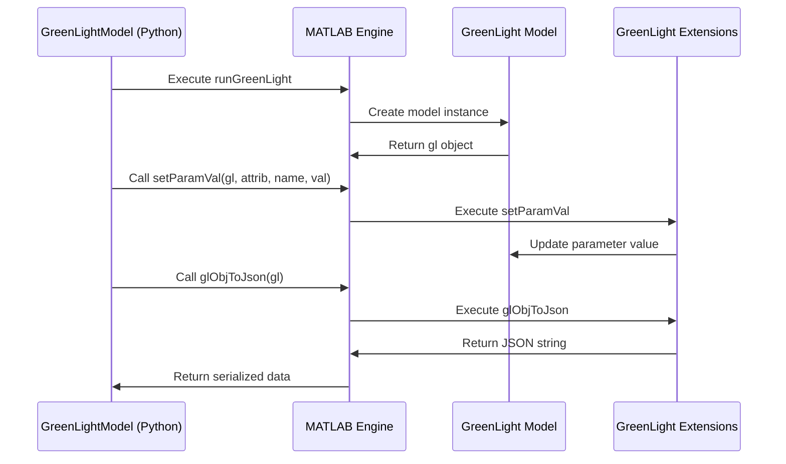
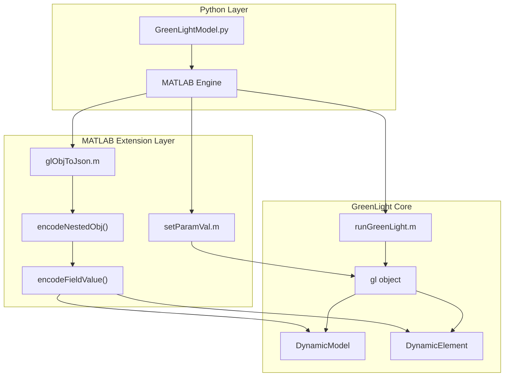

# GreenLight Extensions

> **Relevant source files**
> * [GreenLight_Extensions/README.md](https://github.com/greenpeer/GreenLightModel/blob/98b32e39/GreenLight_Extensions/README.md)
> * [GreenLight_Extensions/glObjToJson.m](https://github.com/greenpeer/GreenLightModel/blob/98b32e39/GreenLight_Extensions/glObjToJson.m)
> * [GreenLight_Extensions/setParamVal.m](https://github.com/greenpeer/GreenLightModel/blob/98b32e39/GreenLight_Extensions/setParamVal.m)

This page documents the MATLAB extension functions that provide JSON serialization and parameter manipulation capabilities for the GreenLight greenhouse simulation model. These extensions serve as utility functions that facilitate data exchange between MATLAB and Python components, enabling the hybrid architecture of the GreenLightModel system.

For information about how Python manages the MATLAB engine and executes these extensions, see [MATLAB Engine Interface](/greenpeer/GreenLightModel/4.1-matlab-engine-interface). For details about parameter processing and management in the Python layer, see [Parameter Management](/greenpeer/GreenLightModel/5.2-parameter-management).

## Overview

The GreenLight Extensions consist of specialized MATLAB functions located in the `GreenLight_Extensions/` directory that extend the core GreenLight model functionality. These extensions primarily handle two critical operations:

1. **JSON Serialization** - Converting complex MATLAB objects containing `DynamicModel` and `DynamicElement` instances to JSON format
2. **Parameter Modification** - Safely updating parameter values within GreenLight model objects

The extensions are designed to work with GreenLight model objects (`gl`) that contain nested structures, function handles, and instances of the DyMoMa framework classes.

**Sources:** [GreenLight_Extensions/README.md L1-L50](https://github.com/greenpeer/GreenLightModel/blob/98b32e39/GreenLight_Extensions/README.md#L1-L50)

## JSON Serialization System

The JSON serialization system converts complex GreenLight model objects to structured JSON format, enabling data exchange between MATLAB and Python environments. This system handles the complex task of serializing nested objects, function handles, and custom class instances.

### Core Serialization Architecture

```

```

**Sources:** [GreenLight_Extensions/glObjToJson.m L1-L87](https://github.com/greenpeer/GreenLightModel/blob/98b32e39/GreenLight_Extensions/glObjToJson.m#L1-L87)

 [GreenLight_Extensions/README.md L45-L134](https://github.com/greenpeer/GreenLightModel/blob/98b32e39/GreenLight_Extensions/README.md#L45-L134)

### Function Reference

#### glObjToJson Function

The main entry point for JSON conversion, `glObjToJson` handles the complete serialization process:

| Function | Purpose | Input | Output |
| --- | --- | --- | --- |
| `glObjToJson(gl)` | Convert GreenLight object to JSON | GreenLight model object | JSON string |
| `encodeNestedObj(obj)` | Encode nested MATLAB objects | Any MATLAB object | Encoded struct |
| `encodeFieldValue(fieldName, fieldValue)` | Encode individual field values | Field name and value | Encoded value |

The function processes different field types according to specific rules:

* Fields named `'def'` containing function handles are converted to strings using `func2str`
* Empty values are preserved as empty arrays
* Structures and `DynamicElement` objects are recursively encoded
* All other values are preserved as-is

**Sources:** [GreenLight_Extensions/glObjToJson.m L1-L18](https://github.com/greenpeer/GreenLightModel/blob/98b32e39/GreenLight_Extensions/glObjToJson.m#L1-L18)

 [GreenLight_Extensions/README.md L147-L162](https://github.com/greenpeer/GreenLightModel/blob/98b32e39/GreenLight_Extensions/README.md#L147-L162)

### JSON Output Structure

The serialized JSON maintains the hierarchical structure of GreenLight objects with five main sections:

```

```

**Sources:** [GreenLight_Extensions/README.md L54-L134](https://github.com/greenpeer/GreenLightModel/blob/98b32e39/GreenLight_Extensions/README.md#L54-L134)

## Parameter Management System

The `setParamVal` function provides a safe interface for modifying parameter values within `DynamicModel` objects, ensuring type safety and data validation.

### Parameter Modification Architecture

```

```

**Sources:** [GreenLight_Extensions/setParamVal.m L1-L24](https://github.com/greenpeer/GreenLightModel/blob/98b32e39/GreenLight_Extensions/setParamVal.m#L1-L24)

### Function Specification

The `setParamVal` function enforces strict validation rules:

| Parameter | Type | Validation Rules |
| --- | --- | --- |
| `dm` | DynamicModel | Must be valid DynamicModel object |
| `attrib` | string | Must be 'x' or 'p' |
| `name` | string | Must correspond to existing parameter |
| `val` | numeric/logical | Must be empty, scalar, or 2-column matrix |

Logical values are automatically converted to numeric equivalents (true→1, false→0) as shown in [GreenLight_Extensions/setParamVal.m L3-L6](https://github.com/greenpeer/GreenLightModel/blob/98b32e39/GreenLight_Extensions/setParamVal.m#L3-L6)

**Sources:** [GreenLight_Extensions/setParamVal.m L8-L23](https://github.com/greenpeer/GreenLightModel/blob/98b32e39/GreenLight_Extensions/setParamVal.m#L8-L23)

 [GreenLight_Extensions/README.md L202-L217](https://github.com/greenpeer/GreenLightModel/blob/98b32e39/GreenLight_Extensions/README.md#L202-L217)

## Integration with GreenLight Model

The extensions integrate seamlessly with the GreenLight model workflow, providing essential utilities for the Python-MATLAB bridge.

### Usage Pattern in System Context



**Sources:** [GreenLight_Extensions/README.md L23-L48](https://github.com/greenpeer/GreenLightModel/blob/98b32e39/GreenLight_Extensions/README.md#L23-L48)

### Typical Usage Examples

Parameter modification follows the pattern shown in the README:

```
setParamVal(gl, "x", "cFruit", 2.8e5)
```

JSON conversion is invoked as:

```
json_str = glObjToJson(gl)
```

These functions are typically called from the Python layer through the MATLAB engine interface, enabling parameter updates and result extraction without requiring direct MATLAB interaction from users.

**Sources:** [GreenLight_Extensions/README.md L29-L48](https://github.com/greenpeer/GreenLightModel/blob/98b32e39/GreenLight_Extensions/README.md#L29-L48)

## Data Flow and Architecture

The extensions serve as critical components in the data transformation pipeline between Python and MATLAB environments.

### Extension Integration Architecture



**Sources:** [GreenLight_Extensions/README.md L1-L50](https://github.com/greenpeer/GreenLightModel/blob/98b32e39/GreenLight_Extensions/README.md#L1-L50)

 [GreenLight_Extensions/glObjToJson.m L20-L52](https://github.com/greenpeer/GreenLightModel/blob/98b32e39/GreenLight_Extensions/glObjToJson.m#L20-L52)

The extensions handle the complexity of MATLAB object serialization while maintaining compatibility with the DyMoMa framework's `DynamicModel` and `DynamicElement` classes. This enables the Python wrapper to work with structured data while leveraging MATLAB's sophisticated greenhouse modeling capabilities.

**Sources:** [GreenLight_Extensions/README.md L221-L226](https://github.com/greenpeer/GreenLightModel/blob/98b32e39/GreenLight_Extensions/README.md#L221-L226)

 [GreenLight_Extensions/setParamVal.m L1-L24](https://github.com/greenpeer/GreenLightModel/blob/98b32e39/GreenLight_Extensions/setParamVal.m#L1-L24)

 [GreenLight_Extensions/glObjToJson.m L1-L87](https://github.com/greenpeer/GreenLightModel/blob/98b32e39/GreenLight_Extensions/glObjToJson.m#L1-L87)