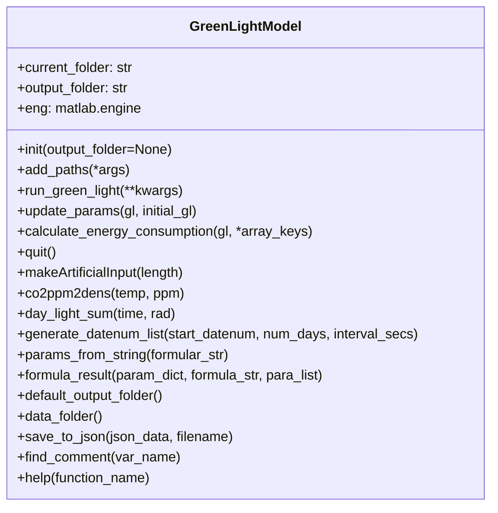
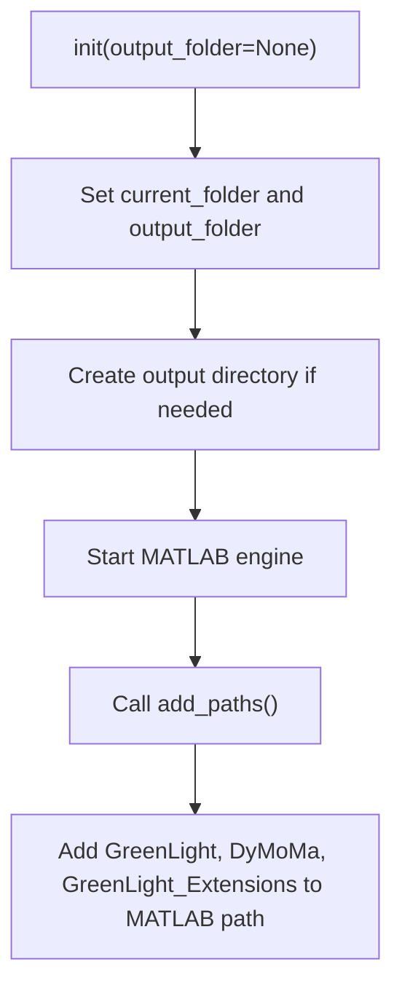
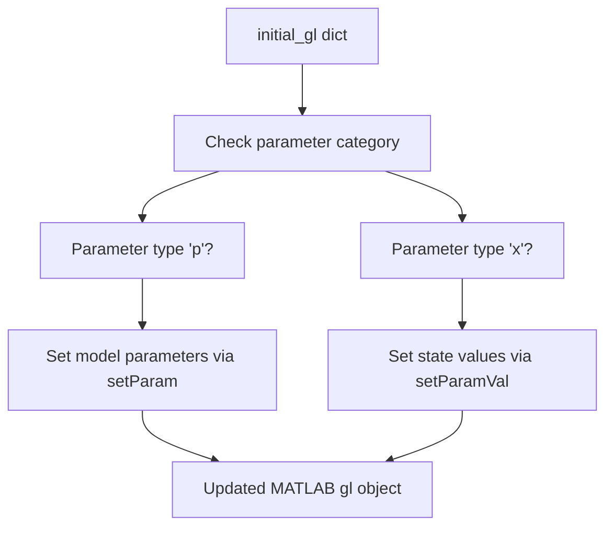
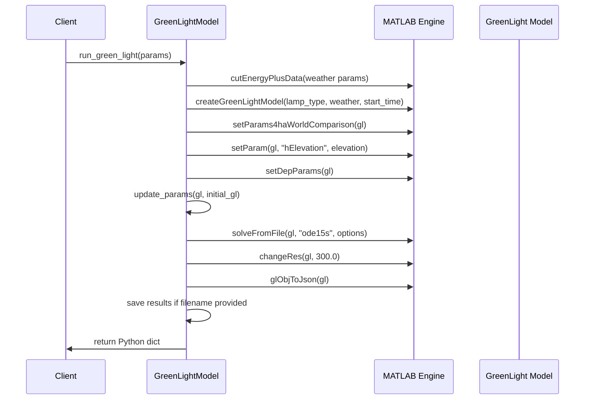
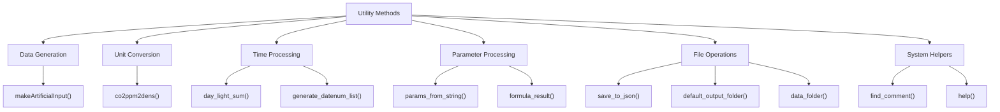
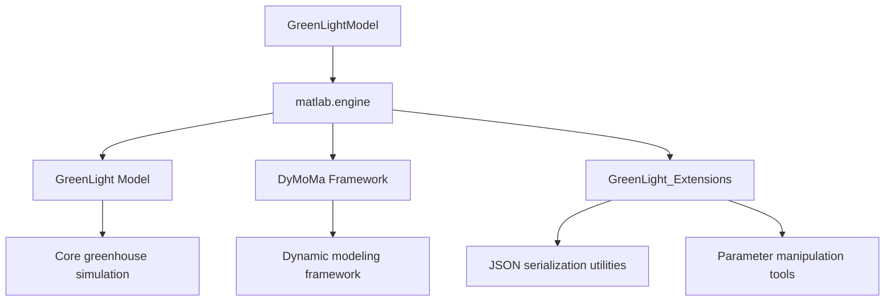
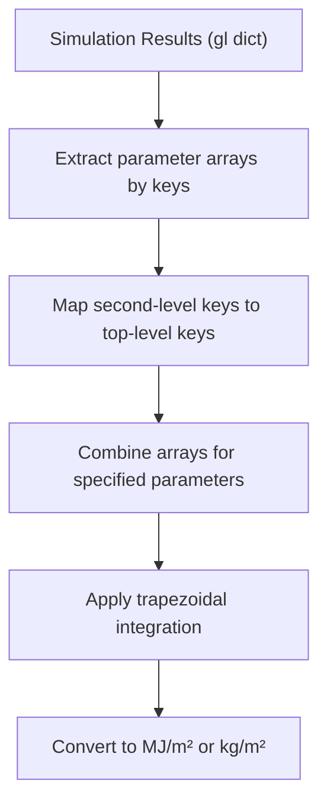

# GreenLightModel Class Reference

> **Relevant source files**
> * [README.md](https://github.com/greenpeer/GreenLightModel/blob/98b32e39/README.md)
> * [__pycache__/gl_model.cpython-39.pyc](https://github.com/greenpeer/GreenLightModel/blob/98b32e39/__pycache__/gl_model.cpython-39.pyc)
> * [gl_model.py](https://github.com/greenpeer/GreenLightModel/blob/98b32e39/gl_model.py)

This document provides comprehensive reference documentation for the `GreenLightModel` class, the primary Python interface for greenhouse environment simulation. The class serves as a wrapper around the MATLAB-based GreenLight model, enabling Python-based control of sophisticated greenhouse simulations with supplemental lighting systems.

For information about the main execution patterns and example usage, see [Main Execution Script](/greenpeer/GreenLightModel/3.2-main-execution-script). For details about the underlying MATLAB integration mechanics, see [MATLAB Engine Interface](/greenpeer/GreenLightModel/4.1-matlab-engine-interface). For data processing workflows, see [Data Processing and Management](/greenpeer/GreenLightModel/5-data-processing-and-management).

## Class Architecture Overview

The `GreenLightModel` class acts as the central orchestrator for all greenhouse simulation operations, managing the complete lifecycle from initialization through simulation execution to result processing.

**Sources:** [gl_model.py L21-L566](https://github.com/greenpeer/GreenLightModel/blob/98b32e39/gl_model.py#L21-L566)

## Core Functionality

The class provides five core methods that handle the primary simulation workflow:

### Initialization and Path Management

The constructor initializes the MATLAB engine and configures the required path structure for accessing MATLAB components.

**Sources:** [gl_model.py L51-L72](https://github.com/greenpeer/GreenLightModel/blob/98b32e39/gl_model.py#L51-L72)

### Parameter Management System

The `update_params` method handles complex parameter processing including formula evaluation for dependent parameters.

**Sources:** [gl_model.py L205-L242](https://github.com/greenpeer/GreenLightModel/blob/98b32e39/gl_model.py#L205-L242)

### Main Simulation Execution

The `run_green_light` method orchestrates the complete simulation process from weather data loading through result generation.

**Sources:** [gl_model.py L89-L203](https://github.com/greenpeer/GreenLightModel/blob/98b32e39/gl_model.py#L89-L203)

## Method Categories

### Core Methods

| Method | Purpose | Key Parameters |
| --- | --- | --- |
| `add_paths` | Configure MATLAB search paths | `*args` - additional folder names |
| `update_params` | Apply parameter updates to model | `gl` - MATLAB object, `initial_gl` - parameter dict |
| `run_green_light` | Execute complete simulation | `filename`, `weatherInput`, `seasonLength`, `lampType` |
| `calculate_energy_consumption` | Compute energy metrics from results | `gl` - results dict, `*array_keys` - parameter names |
| `quit` | Terminate MATLAB engine | None |

**Sources:** [README.md L188-L194](https://github.com/greenpeer/GreenLightModel/blob/98b32e39/README.md#L188-L194)

 [gl_model.py L73-L285](https://github.com/greenpeer/GreenLightModel/blob/98b32e39/gl_model.py#L73-L285)

### Utility Methods

The class provides extensive utility functions for data processing and analysis:

**Sources:** [README.md L316-L329](https://github.com/greenpeer/GreenLightModel/blob/98b32e39/README.md#L316-L329)

 [gl_model.py L297-L566](https://github.com/greenpeer/GreenLightModel/blob/98b32e39/gl_model.py#L297-L566)

## Integration with MATLAB Components

The class manages integration with three key MATLAB components:

The MATLAB engine is initialized at construction and provides the bridge to execute MATLAB functions and manipulate MATLAB objects from Python.

**Sources:** [gl_model.py L68-L71](https://github.com/greenpeer/GreenLightModel/blob/98b32e39/gl_model.py#L68-L71)

 [gl_model.py L82-L87](https://github.com/greenpeer/GreenLightModel/blob/98b32e39/gl_model.py#L82-L87)

## Data Processing Capabilities

### Weather Data Processing

The class supports multiple weather input modes:

* **EnergyPlus files**: Real weather data loaded via `cutEnergyPlusData`
* **Artificial weather**: Generated using `makeArtificialInput` with configurable duration
* **Custom weather matrices**: 9-column format with radiation, temperature, humidity, CO2, wind, sky temperature, soil temperature, and daily radiation sums

**Sources:** [gl_model.py L100-L117](https://github.com/greenpeer/GreenLightModel/blob/98b32e39/gl_model.py#L100-L117)

 [gl_model.py L297-L329](https://github.com/greenpeer/GreenLightModel/blob/98b32e39/gl_model.py#L297-L329)

### Energy Consumption Analysis

The `calculate_energy_consumption` method processes simulation results to compute energy metrics:

This method supports combining multiple parameters (e.g., `qLampIn`, `qIntLampIn` for total lamp energy) and returns integrated values over the simulation time period.

**Sources:** [gl_model.py L244-L281](https://github.com/greenpeer/GreenLightModel/blob/98b32e39/gl_model.py#L244-L281)

## File Path Management

The class uses a structured approach to file and folder management:

| Method | Purpose | Default Path |
| --- | --- | --- |
| `default_output_folder` | Simulation output location | `GreenLight/Output/` |
| `data_folder` | Weather input data location | `GreenLight/Code/inputs/energyPlus/data/` |
| `save_to_json` | JSON result serialization | Uses `output_folder` with `.json` extension |

**Sources:** [gl_model.py L287-L295](https://github.com/greenpeer/GreenLightModel/blob/98b32e39/gl_model.py#L287-L295)

 [gl_model.py L480-L505](https://github.com/greenpeer/GreenLightModel/blob/98b32e39/gl_model.py#L480-L505)

## Error Handling and Resource Management

The class implements proper resource management for the MATLAB engine connection:

* Engine initialization occurs during construction
* Path configuration is automatic via `add_paths`
* Explicit cleanup via `quit()` method terminates the MATLAB engine
* JSON serialization handles MATLAB-to-Python data conversion safely

**Sources:** [gl_model.py L283-L285](https://github.com/greenpeer/GreenLightModel/blob/98b32e39/gl_model.py#L283-L285)

 [gl_model.py L68-L71](https://github.com/greenpeer/GreenLightModel/blob/98b32e39/gl_model.py#L68-L71)