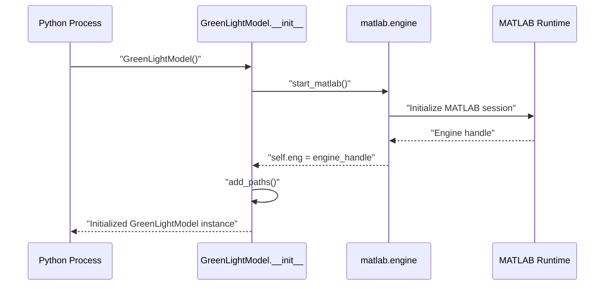
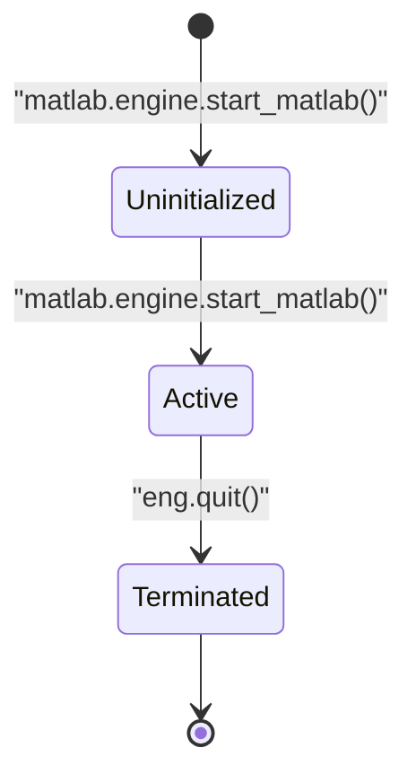
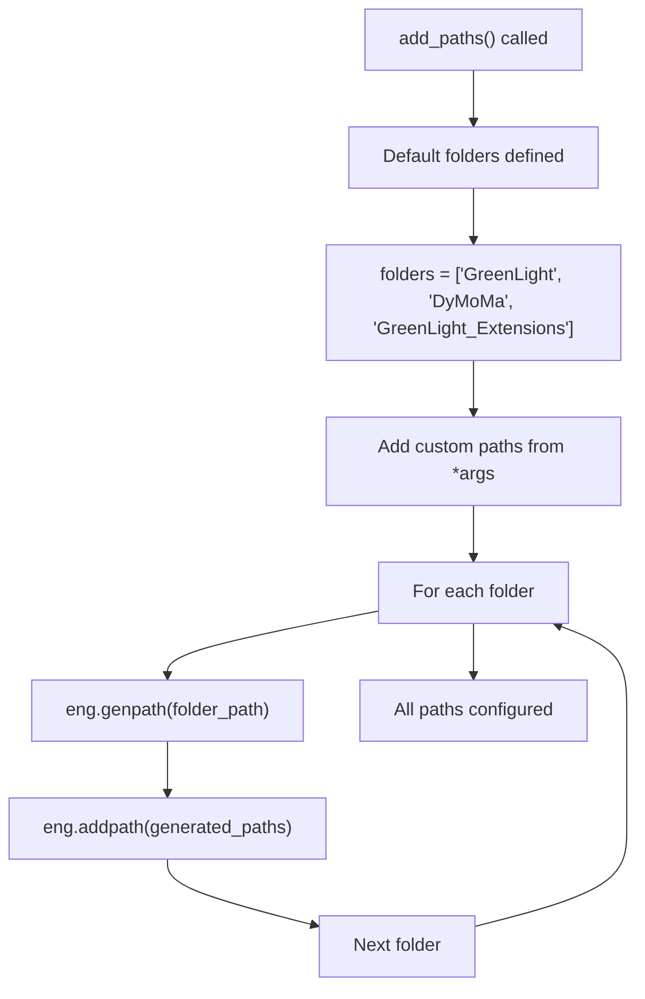
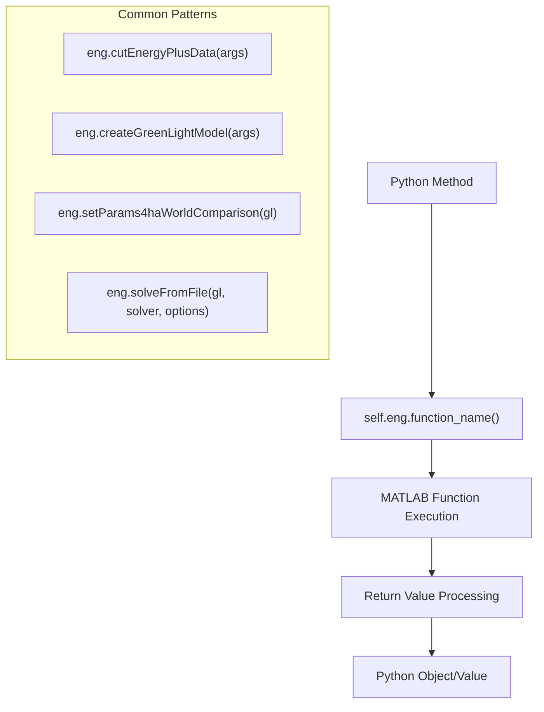
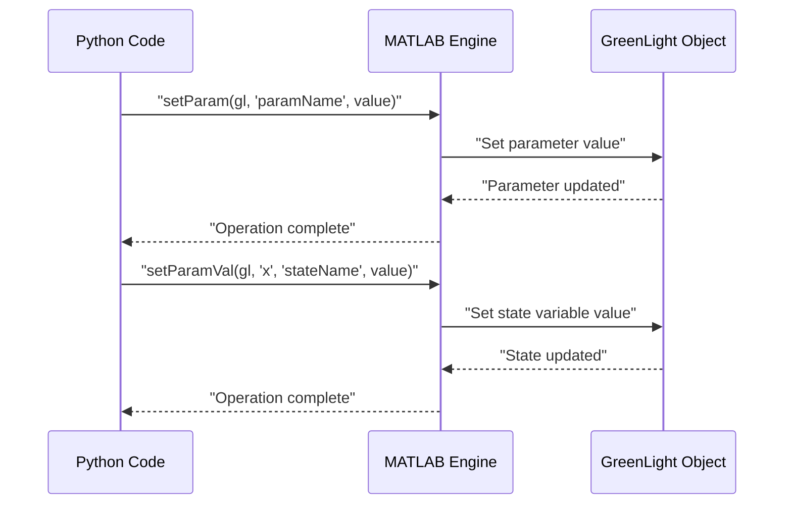
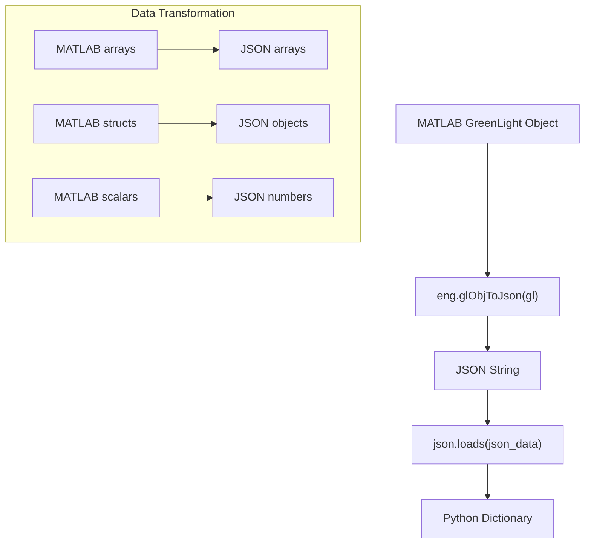

# MATLAB Engine Interface

> **Relevant source files**
> * [README.md](https://github.com/greenpeer/GreenLightModel/blob/98b32e39/README.md)
> * [gl_model.py](https://github.com/greenpeer/GreenLightModel/blob/98b32e39/gl_model.py)

This document details how the Python wrapper manages the MATLAB engine, including engine lifecycle, path configuration, and execution of MATLAB functions. It covers the technical implementation of the bridge between Python and MATLAB environments in the GreenLightModel system.

For information about MATLAB extension functions that provide JSON serialization and parameter manipulation, see [GreenLight Extensions](/greenpeer/GreenLightModel/4.2-greenlight-extensions). For details about the core Python wrapper functionality, see [GreenLightModel Class Reference](/greenpeer/GreenLightModel/3.1-greenlightmodel-class-reference).

## Engine Lifecycle Management

The MATLAB engine interface follows a managed lifecycle pattern where the engine is initialized during `GreenLightModel` instantiation and must be explicitly terminated when finished.

### Engine Initialization

The MATLAB engine is started during `GreenLightModel` object construction through a direct call to `matlab.engine.start_matlab()`. This creates a persistent MATLAB session that remains active for the lifetime of the Python object.



**Engine Initialization Process**

Sources: [gl_model.py L51-L71](https://github.com/greenpeer/GreenLightModel/blob/98b32e39/gl_model.py#L51-L71)

### Engine Termination

The engine must be explicitly terminated using the `quit()` method to properly release MATLAB resources and prevent orphaned processes.



**Engine State Management**

Sources: [gl_model.py L283-L285](https://github.com/greenpeer/GreenLightModel/blob/98b32e39/gl_model.py#L283-L285)

## Path Configuration System

The engine interface manages MATLAB's search path to ensure all required toolboxes and extensions are accessible during execution.

### Default Path Setup

The `add_paths()` method configures the MATLAB environment by adding essential directories to the search path. This method is called automatically during initialization and can accept additional paths as needed.



**Path Configuration Flow**

The system uses `genpath()` to recursively include all subdirectories, ensuring complete toolbox availability.

Sources: [gl_model.py L73-L87](https://github.com/greenpeer/GreenLightModel/blob/98b32e39/gl_model.py#L73-L87)

### Path Resolution Strategy

| Component | Purpose | Path Location |
| --- | --- | --- |
| `GreenLight` | Core greenhouse simulation model | `{current_folder}/GreenLight` |
| `DyMoMa` | Dynamic modeling framework | `{current_folder}/DyMoMa` |
| `GreenLight_Extensions` | JSON utilities and parameter tools | `{current_folder}/GreenLight_Extensions` |

Sources: [gl_model.py L82-L87](https://github.com/greenpeer/GreenLightModel/blob/98b32e39/gl_model.py#L82-L87)

## Function Execution Patterns

The interface executes MATLAB functions through the engine's function call mechanism, supporting various calling patterns and argument configurations.

### Direct Function Calls

Most MATLAB functions are called directly through the engine interface with explicit argument passing and return value handling.



**Function Call Architecture**

Sources: [gl_model.py L100-L104](https://github.com/greenpeer/GreenLightModel/blob/98b32e39/gl_model.py#L100-L104)

 [gl_model.py L155-L183](https://github.com/greenpeer/GreenLightModel/blob/98b32e39/gl_model.py#L155-L183)

### Parameter Setting Functions

The interface provides specialized methods for setting MATLAB object parameters through the engine, supporting both simple values and complex nested structures.



**Parameter Setting Operations**

Sources: [gl_model.py L158-L171](https://github.com/greenpeer/GreenLightModel/blob/98b32e39/gl_model.py#L158-L171)

 [gl_model.py L217-L241](https://github.com/greenpeer/GreenLightModel/blob/98b32e39/gl_model.py#L217-L241)

## Data Exchange Mechanisms

The interface handles bidirectional data exchange between Python and MATLAB environments, managing type conversions and data structure transformations.

### Input Data Processing

Weather data and parameters are converted from Python data structures to MATLAB-compatible formats before function calls.

| Data Type | Python Format | MATLAB Conversion | Method |
| --- | --- | --- | --- |
| Weather Arrays | `numpy.ndarray` | `double` array | Automatic conversion |
| Parameters | `dict` values | `eng.double()` | Explicit conversion |
| Options | `dict` | `eng.struct()` | Structure conversion |
| Strings | `str` | MATLAB string | Automatic conversion |

Sources: [gl_model.py L107](https://github.com/greenpeer/GreenLightModel/blob/98b32e39/gl_model.py#L107-L107)

 [gl_model.py L180](https://github.com/greenpeer/GreenLightModel/blob/98b32e39/gl_model.py#L180-L180)

 [gl_model.py L224](https://github.com/greenpeer/GreenLightModel/blob/98b32e39/gl_model.py#L224-L224)

### Output Data Conversion

MATLAB simulation results are converted to Python-compatible formats through JSON serialization and dictionary loading.



**Output Processing Pipeline**

Sources: [gl_model.py L189-L200](https://github.com/greenpeer/GreenLightModel/blob/98b32e39/gl_model.py#L189-L200)

## Resource Management and Error Handling

The engine interface implements proper resource management to prevent memory leaks and orphaned MATLAB processes.

### Memory Management

The system relies on explicit resource cleanup through the `quit()` method, as MATLAB engines maintain persistent state and consume significant system resources.

### Function Call Safety

All MATLAB function calls include proper argument handling and use the `nargout` parameter to control return value expectations, preventing MATLAB workspace pollution.

```javascript
# Examples of safe function calls
self.eng.setParam(gl, inner_key, inner_value, nargout=0)
self.eng.solveFromFile(gl, "ode15s", options_struct, nargout=0)
gl = self.eng.changeRes(gl, float(300), nargout=1)
```

Sources: [gl_model.py L158-L183](https://github.com/greenpeer/GreenLightModel/blob/98b32e39/gl_model.py#L158-L183)

 [gl_model.py L220](https://github.com/greenpeer/GreenLightModel/blob/98b32e39/gl_model.py#L220-L220)

 [gl_model.py L230](https://github.com/greenpeer/GreenLightModel/blob/98b32e39/gl_model.py#L230-L230)

### Engine State Persistence

The engine maintains state across function calls, allowing for:

* Persistent workspace variables
* Loaded function definitions
* Path configurations
* Active object references

This persistence enables complex multi-step operations while requiring careful resource management to prevent accumulation of unused objects in the MATLAB workspace.

Sources: [gl_model.py L68](https://github.com/greenpeer/GreenLightModel/blob/98b32e39/gl_model.py#L68-L68)

 [gl_model.py L283-L285](https://github.com/greenpeer/GreenLightModel/blob/98b32e39/gl_model.py#L283-L285)