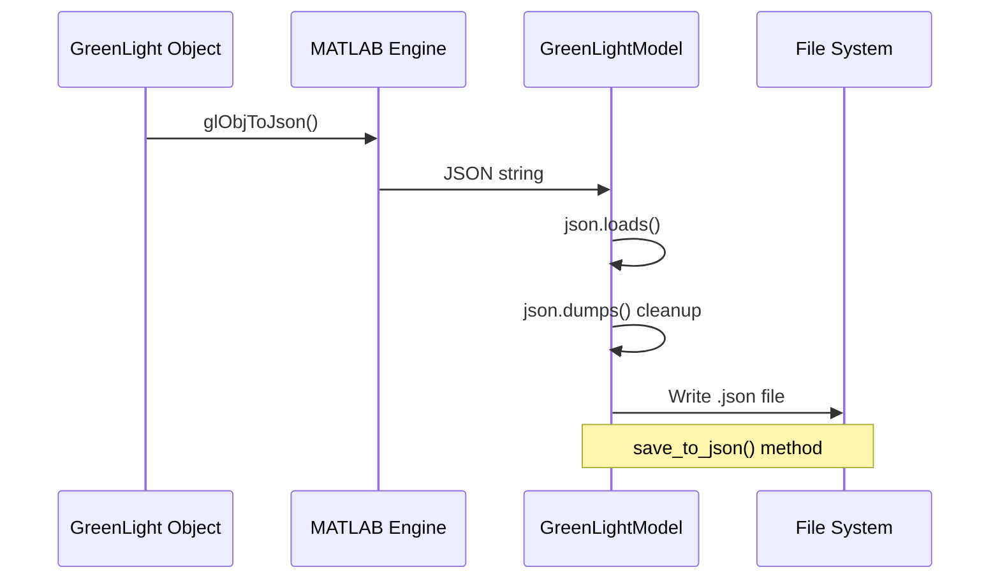
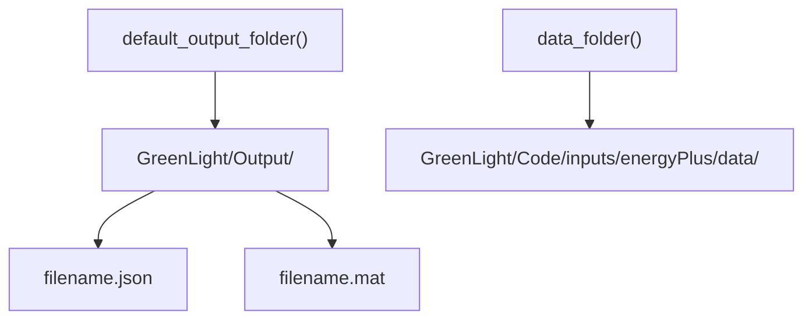
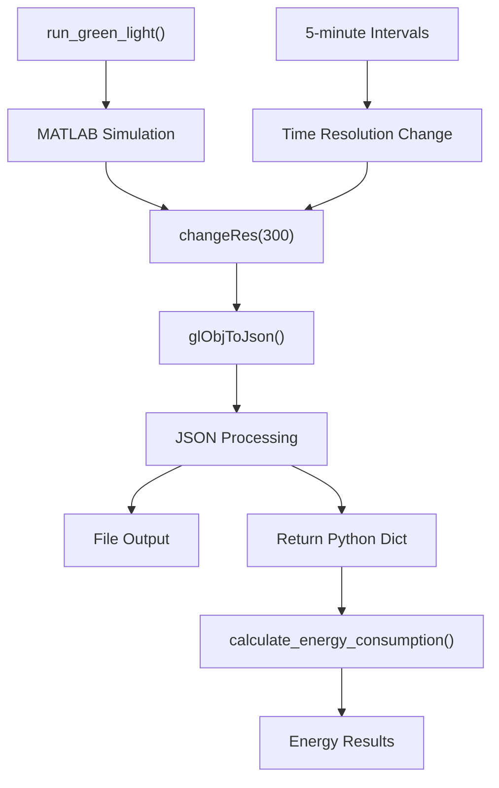

# Output Processing and Energy Calculations

> **Relevant source files**
> * [README.md](https://github.com/greenpeer/GreenLightModel/blob/98b32e39/README.md)
> * [gl_model.py](https://github.com/greenpeer/GreenLightModel/blob/98b32e39/gl_model.py)
> * [main.py](https://github.com/greenpeer/GreenLightModel/blob/98b32e39/main.py)

This page documents the system's capabilities for processing simulation results from the GreenLight MATLAB model and performing energy consumption calculations. It covers the data structures used for simulation outputs, methods for calculating various forms of energy consumption, and the file output mechanisms available to users.

For information about input data processing and weather data handling, see [Weather Data and Input Processing](/greenpeer/GreenLightModel/5.1-weather-data-and-input-processing). For details about parameter management during simulations, see [Parameter Management](/greenpeer/GreenLightModel/5.2-parameter-management).

## Output Data Structure and Processing Flow

The GreenLightModel system processes simulation results through a multi-stage pipeline that converts MATLAB objects to Python-accessible formats:

### Output Processing Pipeline

```

```

**Sources:** [gl_model.py L188-L203](https://github.com/greenpeer/GreenLightModel/blob/98b32e39/gl_model.py#L188-L203)

 [gl_model.py L244-L281](https://github.com/greenpeer/GreenLightModel/blob/98b32e39/gl_model.py#L244-L281)

 [gl_model.py L480-L505](https://github.com/greenpeer/GreenLightModel/blob/98b32e39/gl_model.py#L480-L505)

### Data Structure Organization

The processed output contains hierarchical data organized into several main categories:

| Category | Description | Example Keys |
| --- | --- | --- |
| `t` | Time sequences | Simulation timestamps |
| `p` | Parameters | Model parameters used |
| `x` | State variables | `cFruit`, `cLeaf`, `cStem` |
| `a` | Auxiliary variables | `qLampIn`, `hBoilPipe` |
| `d` | Disturbances | Weather inputs |
| `u` | Controls | `uLamp`, `uBoil` |

Each variable contains a `val` array with time-series data where the first column represents time and subsequent columns contain variable values.

**Sources:** [gl_model.py L255-L261](https://github.com/greenpeer/GreenLightModel/blob/98b32e39/gl_model.py#L255-L261)

 [gl_model.py L268-L276](https://github.com/greenpeer/GreenLightModel/blob/98b32e39/gl_model.py#L268-L276)

## Energy Calculation Methods

### Core Energy Calculation Function

The `calculate_energy_consumption()` method provides a unified interface for computing energy consumption from simulation results:

```

```

**Sources:** [gl_model.py L244-L281](https://github.com/greenpeer/GreenLightModel/blob/98b32e39/gl_model.py#L244-L281)

### Energy Calculation Process

The energy calculation follows these steps:

1. **Parameter Mapping**: Creates a reverse lookup dictionary mapping second-level keys to top-level keys
2. **Array Extraction**: Retrieves time-series data arrays for specified parameters
3. **Array Combination**: Sums multiple arrays if multiple parameters are specified
4. **Numerical Integration**: Uses trapezoidal rule to integrate over time
5. **Unit Conversion**: Converts from base units to MJ/m² or kg/m²

**Sources:** [gl_model.py L255-L281](https://github.com/greenpeer/GreenLightModel/blob/98b32e39/gl_model.py#L255-L281)

### Common Energy Calculations

The system supports several standard energy consumption calculations:

| Calculation Type | Parameters | Units | Usage |
| --- | --- | --- | --- |
| Lamp Energy | `qLampIn`, `qIntLampIn` | MJ/m² | Lighting energy consumption |
| Boiler Energy | `hBoilPipe`, `hBoilGroPipe` | MJ/m² | Heating energy consumption |
| CO₂ Injection | `mcExtAir` | kg/m² | CO₂ usage for plant growth |

**Sources:** [main.py L33-L37](https://github.com/greenpeer/GreenLightModel/blob/98b32e39/main.py#L33-L37)

 [README.md L147-L157](https://github.com/greenpeer/GreenLightModel/blob/98b32e39/README.md#L147-L157)

## File Output Processing

### JSON Serialization Pipeline



**Sources:** [gl_model.py L188-L198](https://github.com/greenpeer/GreenLightModel/blob/98b32e39/gl_model.py#L188-L198)

 [gl_model.py L480-L505](https://github.com/greenpeer/GreenLightModel/blob/98b32e39/gl_model.py#L480-L505)

### Output File Management

The system handles multiple output formats:

* **JSON Files**: Human-readable simulation results via `save_to_json()`
* **MATLAB Files**: Binary `.mat` format for MATLAB compatibility
* **Default Locations**: Uses `default_output_folder()` for file organization

**Sources:** [gl_model.py L192-L197](https://github.com/greenpeer/GreenLightModel/blob/98b32e39/gl_model.py#L192-L197)

 [gl_model.py L287-L295](https://github.com/greenpeer/GreenLightModel/blob/98b32e39/gl_model.py#L287-L295)

### File Naming and Organization

Output files are organized using the following structure:



**Sources:** [gl_model.py L287-L295](https://github.com/greenpeer/GreenLightModel/blob/98b32e39/gl_model.py#L287-L295)

 [gl_model.py L121-L125](https://github.com/greenpeer/GreenLightModel/blob/98b32e39/gl_model.py#L121-L125)

## Integration with Simulation Workflow

### Complete Processing Workflow

The output processing integrates seamlessly with the simulation execution:



**Sources:** [gl_model.py L182-L203](https://github.com/greenpeer/GreenLightModel/blob/98b32e39/gl_model.py#L182-L203)

 [gl_model.py L185-L186](https://github.com/greenpeer/GreenLightModel/blob/98b32e39/gl_model.py#L185-L186)

### Usage Examples

Typical usage patterns for energy calculations:

```markdown
# Energy consumption of lamps
lampIn = model.calculate_energy_consumption(gl, "qLampIn", "qIntLampIn")

# Energy consumption of boiler
boilIn = model.calculate_energy_consumption(gl, "hBoilPipe", "hBoilGroPipe")

# CO2 injection
co2inj = model.calculate_energy_consumption(gl, "mcExtAir")
```

**Sources:** [main.py L33-L37](https://github.com/greenpeer/GreenLightModel/blob/98b32e39/main.py#L33-L37)

 [README.md L147-L157](https://github.com/greenpeer/GreenLightModel/blob/98b32e39/README.md#L147-L157)

## Time Resolution and Data Processing

The system standardizes output data to 5-minute intervals using the `changeRes()` MATLAB function, ensuring consistent temporal resolution across all calculations. This standardization is crucial for accurate energy integration calculations using the trapezoidal rule.

**Sources:** [gl_model.py L185-L186](https://github.com/greenpeer/GreenLightModel/blob/98b32e39/gl_model.py#L185-L186)

 [gl_model.py L278-L279](https://github.com/greenpeer/GreenLightModel/blob/98b32e39/gl_model.py#L278-L279)