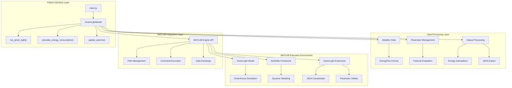
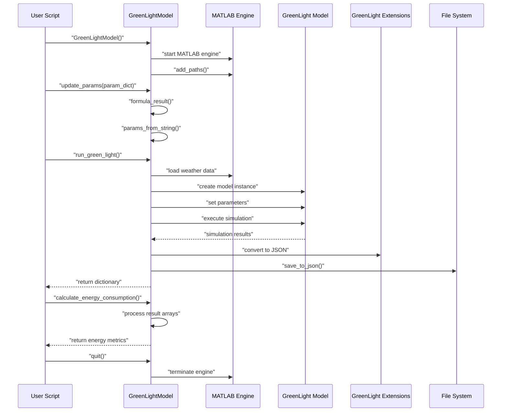
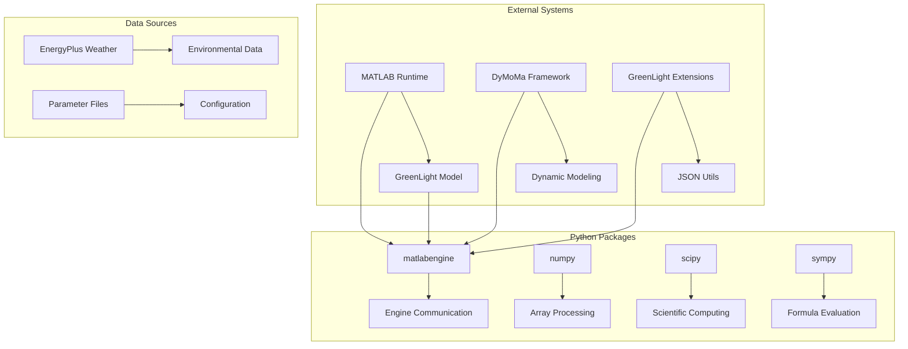
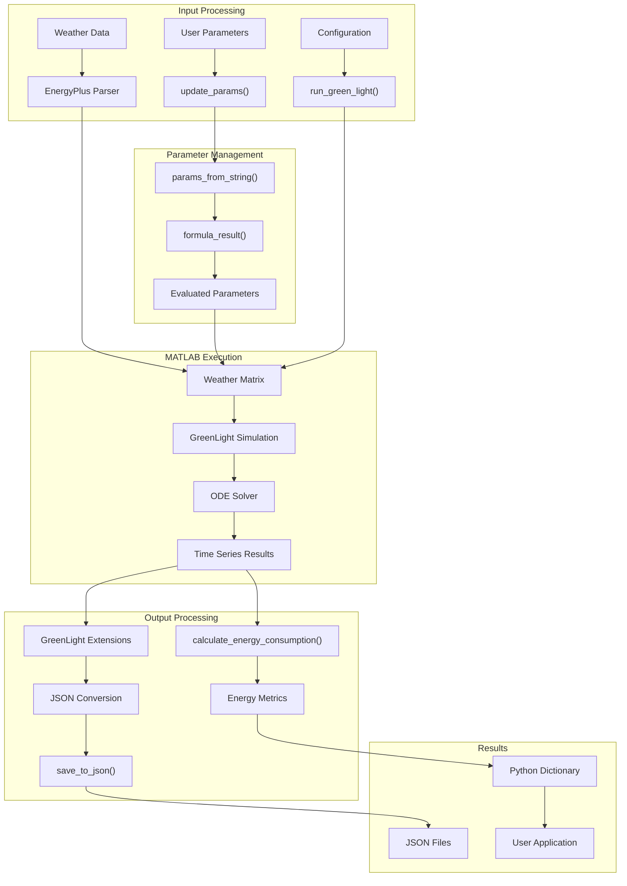

# Overview

> **Relevant source files**
> * [README.md](https://github.com/greenpeer/GreenLightModel/blob/98b32e39/README.md)

## Purpose and Scope

The GreenLightModel repository provides a Python wrapper interface for the GreenLight MATLAB greenhouse simulation model. This system enables Python developers to run sophisticated greenhouse environment simulations with supplemental lighting scenarios, processing weather data, and calculating energy consumption metrics without requiring direct MATLAB programming knowledge.

The system bridges Python and MATLAB ecosystems by managing MATLAB engine instances, handling data format conversions, and providing a simplified API for complex greenhouse modeling workflows. For specific installation and setup instructions, see [Getting Started](/greenpeer/GreenLightModel/2-getting-started). For detailed API documentation, see [GreenLightModel Class Reference](/greenpeer/GreenLightModel/3.1-greenlightmodel-class-reference).

## System Architecture

The GreenLightModel system operates as a multi-layered hybrid architecture that orchestrates Python and MATLAB components:

### High-Level Architecture

Sources: [README.md L1-L561](https://github.com/greenpeer/GreenLightModel/blob/98b32e39/README.md#L1-L561)

### Component Interaction Flow

Sources: [README.md L112-L172](https://github.com/greenpeer/GreenLightModel/blob/98b32e39/README.md#L112-L172)

 [README.md L188-L313](https://github.com/greenpeer/GreenLightModel/blob/98b32e39/README.md#L188-L313)

## Key Technologies and Dependencies

The system relies on several core technologies and external dependencies:

### Technology Stack

| Component | Technology | Purpose |
| --- | --- | --- |
| Primary Interface | Python 3.x | User-facing API and orchestration |
| Computational Engine | MATLAB R2016b+ | Greenhouse simulation execution |
| Integration Bridge | `matlabengine` | Python-MATLAB communication |
| Scientific Computing | `numpy`, `scipy`, `sympy` | Data processing and calculations |
| Weather Data | EnergyPlus format | Environmental input data |
| Output Format | JSON | Cross-platform data exchange |

### Core Dependencies

Sources: [README.md L60-L79](https://github.com/greenpeer/GreenLightModel/blob/98b32e39/README.md#L60-L79)

 [README.md L48-L67](https://github.com/greenpeer/GreenLightModel/blob/98b32e39/README.md#L48-L67)

## Data Flow and Processing Pipeline

The system processes data through several transformation stages:

### Data Processing Pipeline

Sources: [README.md L234-L280](https://github.com/greenpeer/GreenLightModel/blob/98b32e39/README.md#L234-L280)

 [README.md L283-L298](https://github.com/greenpeer/GreenLightModel/blob/98b32e39/README.md#L283-L298)

 [README.md L485-L500](https://github.com/greenpeer/GreenLightModel/blob/98b32e39/README.md#L485-L500)

## System Capabilities

The GreenLightModel system provides comprehensive greenhouse simulation capabilities organized into functional areas:

### Core Simulation Features

* **Greenhouse Environment Modeling**: Complete thermal, humidity, and CO2 dynamics simulation
* **Supplemental Lighting**: Support for LED, HPS, and no-lighting scenarios via `lampType` parameter
* **Weather Integration**: Processing of EnergyPlus weather data or artificial weather generation
* **Crop Growth Modeling**: Mature and immature crop initialization options
* **Energy Analysis**: Automated calculation of lamp, boiler, and CO2 injection energy consumption

### Advanced Parameter Management

* **Formula-Based Parameters**: Dynamic parameter calculation using mathematical expressions
* **Dependent Parameter Resolution**: Automatic calculation of parameters that depend on other parameter values
* **Parameter Validation**: Built-in validation for parameter ranges and dependencies
* **Runtime Parameter Updates**: Ability to modify simulation parameters between runs

Sources: [README.md L234-L280](https://github.com/greenpeer/GreenLightModel/blob/98b32e39/README.md#L234-L280)

 [README.md L421-L453](https://github.com/greenpeer/GreenLightModel/blob/98b32e39/README.md#L421-L453)

 [README.md L216-L231](https://github.com/greenpeer/GreenLightModel/blob/98b32e39/README.md#L216-L231)