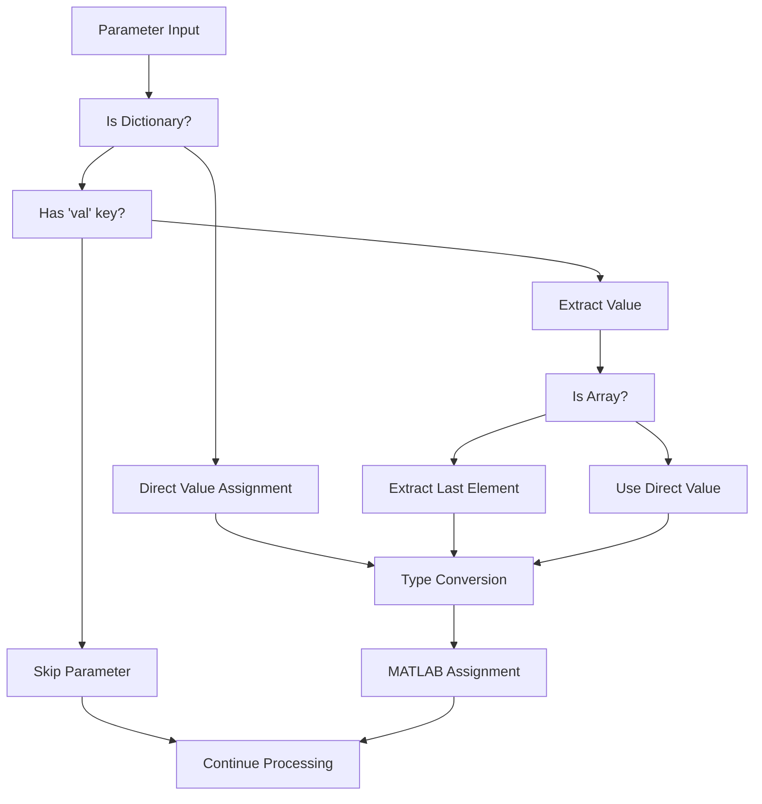
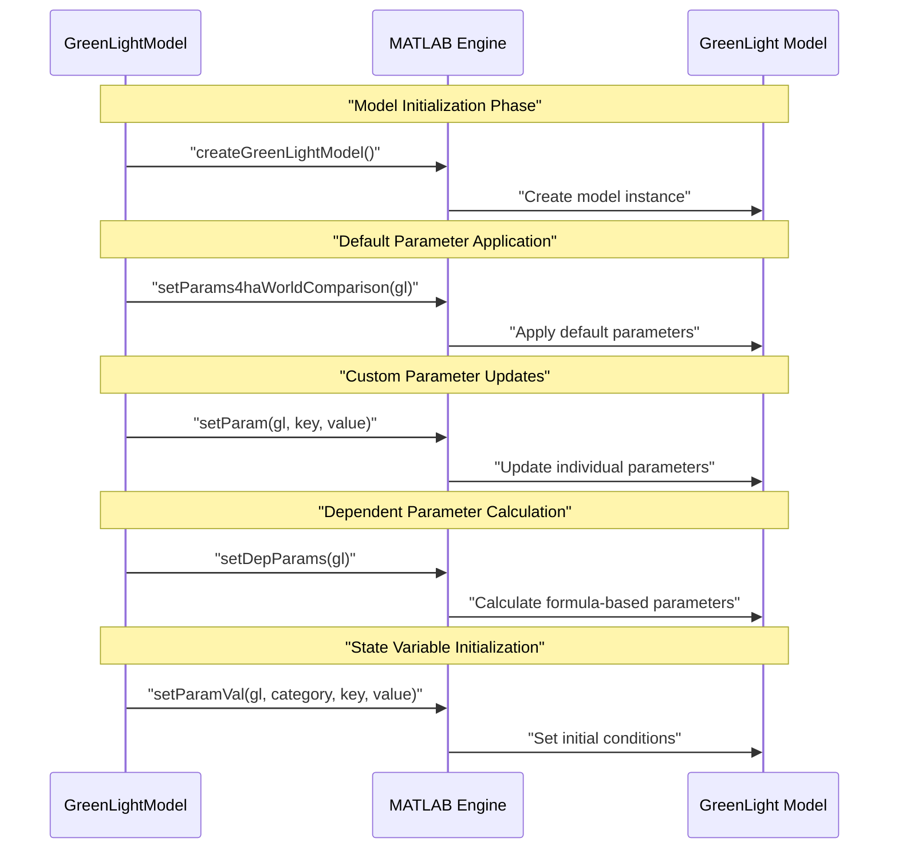

# Parameter Management

> **Relevant source files**
> * [README.md](https://github.com/greenpeer/GreenLightModel/blob/98b32e39/README.md)
> * [gl_model.py](https://github.com/greenpeer/GreenLightModel/blob/98b32e39/gl_model.py)

## Purpose and Scope

This document covers the sophisticated parameter management system within the GreenLightModel, which handles parameter setting, formula evaluation, and validation for greenhouse simulation models. The system manages both direct parameter values and formula-based dependent parameters that are dynamically calculated based on other parameter values.

For information about weather data processing and input validation, see [Weather Data and Input Processing](/greenpeer/GreenLightModel/5.1-weather-data-and-input-processing). For details on output processing and result calculations, see [Output Processing and Energy Calculations](/greenpeer/GreenLightModel/5.3-output-processing-and-energy-calculations).

## Parameter Types and Structure

The GreenLightModel system recognizes two primary parameter categories that correspond to different aspects of the greenhouse simulation model:

### Parameter Categories

| Category | Description | MATLAB Function | Purpose |
| --- | --- | --- | --- |
| `p` parameters | Model parameters | `setParam()` | Control simulation behavior (temperatures, lighting, etc.) |
| `x` parameters | State variables | `setParamVal()` | Set initial conditions and state values |

### Parameter Value Formats

Parameters can be specified in multiple formats:

```

```

**Parameter Value Processing Flow**
Sources: [gl_model.py L205-L242](https://github.com/greenpeer/GreenLightModel/blob/98b32e39/gl_model.py#L205-L242)

## Parameter Setting and Updates

The core parameter management is handled by the `update_params` method, which processes parameter dictionaries and applies them to the MATLAB model instance.

### Update Process

```

```

**Parameter Update Sequence**
Sources: [gl_model.py L205-L242](https://github.com/greenpeer/GreenLightModel/blob/98b32e39/gl_model.py#L205-L242)

### Parameter Structure Example

```css
# Example parameter structure
initial_gl = {
    "p": {
        "tSpNight": 28.5,           # Simple value
        "tSpDay": 29.5,             # Simple value
        "complexParam": {           # Dictionary format
            "val": 15.0,
            "unit": "°C",
            "description": "Complex parameter"
        }
    },
    "x": {
        "cFruit": 2.8e5,           # State variable
        "cLeaf": 0.9e5,            # State variable
        "timeSeriesData": {        # Array data
            "val": [[0, 10], [300, 15], [600, 20]]
        }
    }
}
```

Sources: [gl_model.py L205-L242](https://github.com/greenpeer/GreenLightModel/blob/98b32e39/gl_model.py#L205-L242)

 [README.md L122-L128](https://github.com/greenpeer/GreenLightModel/blob/98b32e39/README.md#L122-L128)

## Formula-Based Parameters

The system supports sophisticated formula-based parameter calculations using symbolic mathematics through SymPy, enabling dependent parameters to be calculated from other parameter values.

### Formula Processing Pipeline

```

```

**Formula-Based Parameter Processing**
Sources: [gl_model.py L440-L478](https://github.com/greenpeer/GreenLightModel/blob/98b32e39/gl_model.py#L440-L478)

### Parameter Extraction Method

The `params_from_string` method uses regular expressions to identify parameter names within formula strings:

```markdown
# Regular expression pattern to match parameters
pattern = r"\b[a-zA-Z]+[a-zA-Z0-9]*\b"
matched_words = re.findall(pattern, formular_str)
# Remove reserved mathematical constants
matched_words = [word for word in matched_words if word not in ("pi", "exp")]
```

### Formula Evaluation Process

The `formula_result` method coordinates formula evaluation:

1. **Parameter Mapping**: Creates keyword arguments from parameter dictionary
2. **Expression Parsing**: Uses SymPy's `parse_expr()` to convert string to mathematical expression
3. **Evaluation**: Substitutes parameter values and evaluates the expression
4. **Type Conversion**: Returns result as float for MATLAB compatibility

Sources: [gl_model.py L458-L478](https://github.com/greenpeer/GreenLightModel/blob/98b32e39/gl_model.py#L458-L478)

 [gl_model.py L440-L456](https://github.com/greenpeer/GreenLightModel/blob/98b32e39/gl_model.py#L440-L456)

## Parameter Validation and Conversion

The system includes validation and type conversion mechanisms to ensure parameter compatibility between Python and MATLAB environments.

### Type Conversion Matrix

| Python Type | MATLAB Conversion | Method |
| --- | --- | --- |
| `int`, `float` | `double` | `self.eng.double()` |
| `list`, `numpy.array` | MATLAB array | Automatic conversion |
| `dict` with `val` key | Extract value | Custom logic |
| Complex nested structures | Recursive processing | `update_params()` |

### Parameter Processing Rules



**Parameter Validation Flow**
Sources: [gl_model.py L216-L241](https://github.com/greenpeer/GreenLightModel/blob/98b32e39/gl_model.py#L216-L241)

## Integration with MATLAB Backend

The parameter management system interfaces with several MATLAB functions to configure the greenhouse simulation model.

### MATLAB Function Mapping

| Python Method | MATLAB Function | Purpose |
| --- | --- | --- |
| `update_params()` | `setParam()` | Set model parameters |
| `update_params()` | `setParamVal()` | Set state variables |
| `run_green_light()` | `setParams4haWorldComparison()` | Apply default parameter set |
| `run_green_light()` | `setDepParams()` | Calculate dependent parameters |

### Parameter Setting Sequence in Model Execution



**MATLAB Integration Sequence**
Sources: [gl_model.py L154-L174](https://github.com/greenpeer/GreenLightModel/blob/98b32e39/gl_model.py#L154-L174)

### Key Integration Points

1. **Model Creation**: Parameters are applied after model instantiation
2. **Default Parameters**: Standard greenhouse parameters are applied first
3. **Custom Parameters**: User-specified parameters override defaults
4. **Dependent Parameters**: Formula-based parameters are calculated last
5. **State Initialization**: Initial conditions are set for dynamic variables

Sources: [gl_model.py L154-L174](https://github.com/greenpeer/GreenLightModel/blob/98b32e39/gl_model.py#L154-L174)

 [gl_model.py L205-L242](https://github.com/greenpeer/GreenLightModel/blob/98b32e39/gl_model.py#L205-L242)