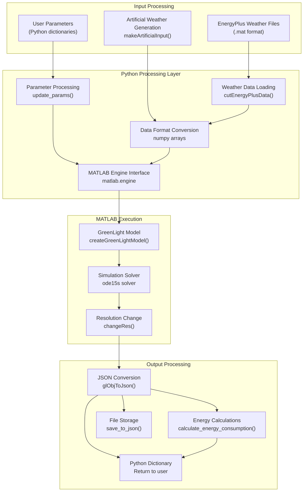
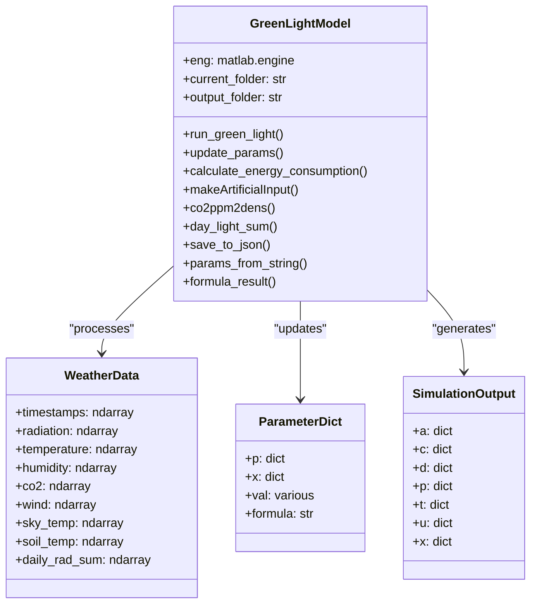
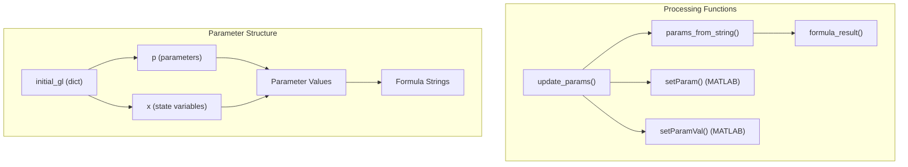
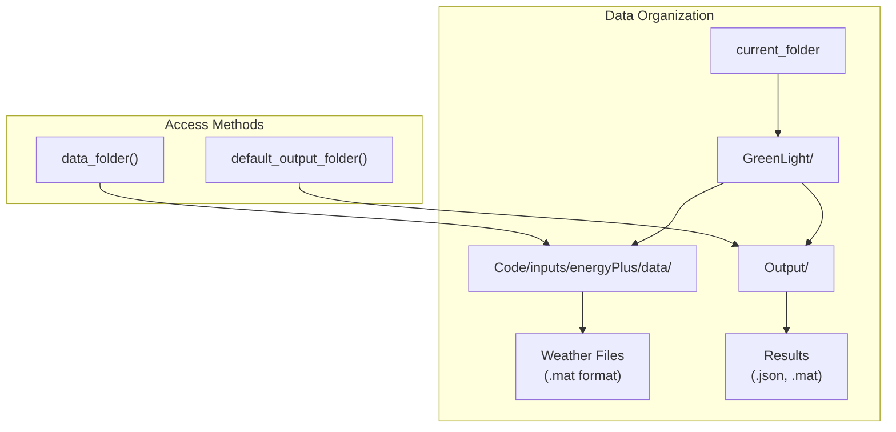

# Data Processing and Management

> **Relevant source files**
> * [README.md](https://github.com/greenpeer/GreenLightModel/blob/98b32e39/README.md)
> * [gl_model.py](https://github.com/greenpeer/GreenLightModel/blob/98b32e39/gl_model.py)

This document covers the comprehensive data processing and management capabilities of the GreenLightModel system, including input data handling, parameter processing, and output generation. The system manages three primary data streams: weather inputs, simulation parameters, and model outputs, with sophisticated processing pipelines that bridge Python and MATLAB environments.

For detailed information about specific aspects: weather data processing is covered in [Weather Data and Input Processing](/greenpeer/GreenLightModel/5.1-weather-data-and-input-processing), parameter handling in [Parameter Management](/greenpeer/GreenLightModel/5.2-parameter-management), and output processing in [Output Processing and Energy Calculations](/greenpeer/GreenLightModel/5.3-output-processing-and-energy-calculations).

## Data Processing Architecture

The GreenLightModel system implements a multi-stage data processing pipeline that transforms raw inputs into structured simulation outputs through coordinated Python and MATLAB operations.

### Data Flow Pipeline



**Sources:** [gl_model.py L89-L203](https://github.com/greenpeer/GreenLightModel/blob/98b32e39/gl_model.py#L89-L203)

### Core Data Processing Classes

The system's data processing is centralized in the `GreenLightModel` class, which orchestrates all data transformations and manages the interaction between Python and MATLAB environments.



**Sources:** [gl_model.py L21-L566](https://github.com/greenpeer/GreenLightModel/blob/98b32e39/gl_model.py#L21-L566)

## Data Types and Formats

The system handles multiple data formats and performs automatic conversions between Python and MATLAB representations.

### Weather Data Structure

Weather data follows a standardized 9-column matrix format:

| Column | Description | Units | Code Reference |
| --- | --- | --- | --- |
| 0 | Timestamps | datenum | `weather[:, 0]` |
| 1 | Solar radiation | W m⁻² | `weather[:, 1]` |
| 2 | Air temperature | °C | `weather[:, 2]` |
| 3 | Humidity | kg m⁻³ | `weather[:, 3]` |
| 4 | CO₂ concentration | kg m⁻³ | `weather[:, 4]` |
| 5 | Wind speed | m s⁻¹ | `weather[:, 5]` |
| 6 | Sky temperature | °C | `weather[:, 6]` |
| 7 | Soil temperature | °C | `weather[:, 7]` |
| 8 | Daily radiation sum | MJ m⁻² day⁻¹ | `weather[:, 8]` |

**Sources:** [gl_model.py L301-L311](https://github.com/greenpeer/GreenLightModel/blob/98b32e39/gl_model.py#L301-L311)

 [gl_model.py L314-L329](https://github.com/greenpeer/GreenLightModel/blob/98b32e39/gl_model.py#L314-L329)

### Parameter Management System

Parameters are organized in a hierarchical dictionary structure with support for formula-based dependent parameters:



**Sources:** [gl_model.py L205-L242](https://github.com/greenpeer/GreenLightModel/blob/98b32e39/gl_model.py#L205-L242)

 [gl_model.py L440-L478](https://github.com/greenpeer/GreenLightModel/blob/98b32e39/gl_model.py#L440-L478)

## Data Processing Operations

### Weather Data Processing

The system supports both real weather data from EnergyPlus files and artificially generated weather patterns:

```markdown
# Real weather data loading
weather = self.eng.cutEnergyPlusData(
    firstDay,
    seasonLength,
    os.path.join(self.data_folder(), weatherInput + "EnergyPlus.mat")
)

# Artificial weather generation
weather = self.makeArtificialInput(5)  # 5 days
```

The `makeArtificialInput` method generates realistic weather patterns using sinusoidal functions for temperature and radiation cycles.

**Sources:** [gl_model.py L100-L104](https://github.com/greenpeer/GreenLightModel/blob/98b32e39/gl_model.py#L100-L104)

 [gl_model.py L297-L329](https://github.com/greenpeer/GreenLightModel/blob/98b32e39/gl_model.py#L297-L329)

### Parameter Formula Evaluation

The system supports complex parameter formulas using `sympy` for mathematical expression parsing:

```python
def formula_result(self, param_dict, formula_str, para_list):
    kwargs = {para: param_dict[para] for para in para_list if para != "pi"}
    formula_expr = parse_expr(formula_str)
    return float(formula_expr.evalf(subs=kwargs))
```

**Sources:** [gl_model.py L458-L478](https://github.com/greenpeer/GreenLightModel/blob/98b32e39/gl_model.py#L458-L478)

### Energy Consumption Calculations

The system performs sophisticated energy calculations using numerical integration:

```python
def calculate_energy_consumption(self, gl, *array_keys):
    # Combine multiple parameter arrays
    combined_array += array_n
    # Calculate using trapezoidal rule
    energy_consumption = np.trapz(combined_array[:, 1], time_sequence) / 1e6
```

**Sources:** [gl_model.py L244-L281](https://github.com/greenpeer/GreenLightModel/blob/98b32e39/gl_model.py#L244-L281)

## File I/O and Data Persistence

The system manages multiple file formats for input and output operations:

### Input Data Sources

* **EnergyPlus files**: `.mat` format containing weather data
* **Parameter dictionaries**: Python dict structures
* **Configuration files**: JSON format for settings

### Output Data Formats

* **JSON files**: Complete simulation results via `save_to_json()`
* **MATLAB files**: Native `.mat` format via MATLAB engine
* **Python dictionaries**: In-memory access to all simulation data

### Data Folder Structure



**Sources:** [gl_model.py L287-L295](https://github.com/greenpeer/GreenLightModel/blob/98b32e39/gl_model.py#L287-L295)

## Data Validation and Error Handling

The system implements several data validation mechanisms:

* **Weather data validation**: Automatic checking of matrix dimensions and data types
* **Parameter validation**: Type checking and formula syntax validation
* **Numerical stability**: Configurable tolerance values for ODE solvers
* **File existence checks**: Verification of input file availability

**Sources:** [gl_model.py L107-L129](https://github.com/greenpeer/GreenLightModel/blob/98b32e39/gl_model.py#L107-L129)

 [gl_model.py L176-L181](https://github.com/greenpeer/GreenLightModel/blob/98b32e39/gl_model.py#L176-L181)

The data processing and management system provides a robust foundation for greenhouse simulation by handling complex data transformations, maintaining data integrity, and supporting flexible input/output operations across Python and MATLAB environments.