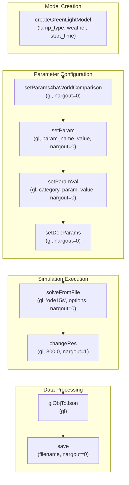

# MATLAB Integration

> **Relevant source files**
> * [README.md](https://github.com/greenpeer/GreenLightModel/blob/98b32e39/README.md)
> * [gl_model.py](https://github.com/greenpeer/GreenLightModel/blob/98b32e39/gl_model.py)

## Purpose and Scope

This document explains how the GreenLightModel Python system interfaces with MATLAB components, including engine management, data exchange, and dependency coordination. The integration provides a bridge between Python's user-friendly interface and MATLAB's sophisticated greenhouse simulation capabilities.

For detailed information about the MATLAB engine interface mechanics, see [MATLAB Engine Interface](/greenpeer/GreenLightModel/4.1-matlab-engine-interface). For documentation of the MATLAB extension functions, see [GreenLight Extensions](/greenpeer/GreenLightModel/4.2-greenlight-extensions).

## Integration Architecture Overview

The MATLAB integration operates through a layered architecture where Python serves as the orchestration layer while delegating computational work to MATLAB components.

### System Integration Architecture

```

```

Sources: [gl_model.py L51-L72](https://github.com/greenpeer/GreenLightModel/blob/98b32e39/gl_model.py#L51-L72)

 [gl_model.py L73-L88](https://github.com/greenpeer/GreenLightModel/blob/98b32e39/gl_model.py#L73-L88)

 [README.md L48-L67](https://github.com/greenpeer/GreenLightModel/blob/98b32e39/README.md#L48-L67)

## Engine Lifecycle Management

The MATLAB engine follows a managed lifecycle pattern with explicit initialization, configuration, and cleanup phases.

### Engine Initialization Process

```

```

The engine initialization occurs in the `__init__` method where `matlab.engine.start_matlab()` creates a persistent MATLAB process. The system then configures the MATLAB path to include required dependencies.

Sources: [gl_model.py L67-L71](https://github.com/greenpeer/GreenLightModel/blob/98b32e39/gl_model.py#L67-L71)

 [gl_model.py L73-L88](https://github.com/greenpeer/GreenLightModel/blob/98b32e39/gl_model.py#L73-L88)

## Data Exchange Patterns

Data flows between Python and MATLAB through several conversion mechanisms, with different patterns for input parameters, simulation data, and output results.

### Data Flow and Conversion Pipeline

```

```

Key conversion points include:

* **Parameter Updates**: Python dictionaries converted to MATLAB parameter calls via `setParam()` and `setParamVal()`
* **Weather Data**: NumPy arrays passed directly to MATLAB as double matrices
* **Solver Options**: Python dictionaries converted to MATLAB structs using `self.eng.struct()`
* **Results**: MATLAB objects serialized to JSON strings, then parsed back to Python dictionaries

Sources: [gl_model.py L205-L242](https://github.com/greenpeer/GreenLightModel/blob/98b32e39/gl_model.py#L205-L242)

 [gl_model.py L177-L203](https://github.com/greenpeer/GreenLightModel/blob/98b32e39/gl_model.py#L177-L203)

 [gl_model.py L188-L200](https://github.com/greenpeer/GreenLightModel/blob/98b32e39/gl_model.py#L188-L200)

## MATLAB Component Dependencies

The system depends on three main MATLAB repositories that must be present and properly configured in the MATLAB path.

| Component | Purpose | Path Configuration |
| --- | --- | --- |
| `GreenLight` | Core greenhouse simulation model | Added via `genpath()` in `add_paths()` |
| `DyMoMa` | Dynamic modeling framework for ODE solving | Added via `genpath()` in `add_paths()` |
| `GreenLight_Extensions` | JSON serialization and utility functions | Added via `genpath()` in `add_paths()` |

The path configuration occurs automatically during initialization, with the system expecting these directories to be siblings of the main project directory.

Sources: [gl_model.py L82-L87](https://github.com/greenpeer/GreenLightModel/blob/98b32e39/gl_model.py#L82-L87)

 [README.md L50-L57](https://github.com/greenpeer/GreenLightModel/blob/98b32e39/README.md#L50-L57)

## Function Invocation Patterns

MATLAB functions are invoked through the engine using specific patterns for different types of operations.

### Core MATLAB Function Calls



Function invocation patterns include:

* **No Return Values**: Functions modifying the model object use `nargout=0`
* **Single Return**: Functions returning data use `nargout=1` or default behavior
* **Parameter Passing**: MATLAB functions called with positional arguments converted from Python types
* **Type Conversion**: Python values automatically converted to appropriate MATLAB types (`double`, `char`, etc.)

Sources: [gl_model.py L154-L203](https://github.com/greenpeer/GreenLightModel/blob/98b32e39/gl_model.py#L154-L203)

 [gl_model.py L216-L241](https://github.com/greenpeer/GreenLightModel/blob/98b32e39/gl_model.py#L216-L241)

## Error Handling and Resource Management

The integration includes explicit resource management for the MATLAB engine process, with a cleanup method to terminate the engine when work is complete.

The `quit()` method provides explicit cleanup: `self.eng.quit()` terminates the MATLAB process and releases system resources. This is important for preventing resource leaks in long-running applications.

Sources: [gl_model.py L283-L285](https://github.com/greenpeer/GreenLightModel/blob/98b32e39/gl_model.py#L283-L285)