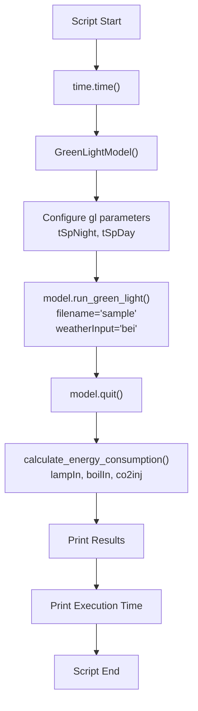
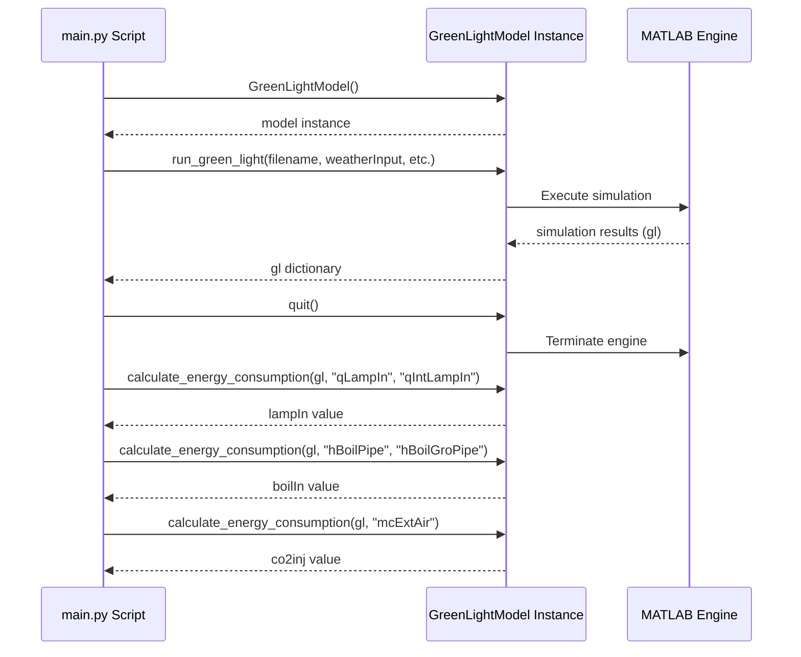
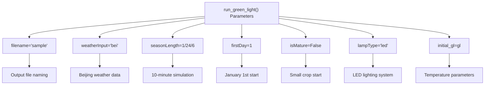
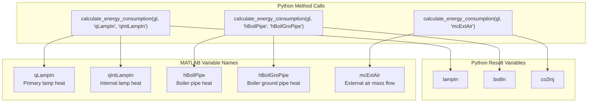

# Main Execution Script

> **Relevant source files**
> * [main.py](https://github.com/greenpeer/GreenLightModel/blob/98b32e39/main.py)

## Purpose and Scope

This document covers the `main.py` script, which serves as the primary demonstration and example of how to use the GreenLightModel system. The script illustrates a complete workflow from model initialization through simulation execution to energy consumption analysis. For detailed information about the GreenLightModel class methods and parameters, see [GreenLightModel Class Reference](/greenpeer/GreenLightModel/3.1-greenlightmodel-class-reference). For information about the underlying MATLAB integration, see [MATLAB Engine Interface](/greenpeer/GreenLightModel/4.1-matlab-engine-interface).

## Script Overview

The `main.py` script provides a concrete example of the typical usage pattern for the GreenLightModel system. It demonstrates the essential workflow steps including model instantiation, parameter configuration, simulation execution, energy consumption calculations, and proper resource cleanup.

The script is structured as a linear execution flow that showcases the core capabilities of the system in approximately 50 lines of code. It serves both as functional example code and as a reference implementation for users wanting to understand proper usage patterns.

**Sources:** [main.py L1-L48](https://github.com/greenpeer/GreenLightModel/blob/98b32e39/main.py#L1-L48)

## Execution Flow and Workflow

### Script Execution Flow

The execution follows a straightforward sequential pattern where each step depends on the successful completion of the previous step. The script implements proper resource management by explicitly calling `model.quit()` to terminate the MATLAB engine before proceeding to post-processing calculations.

**Sources:** [main.py L1-L48](https://github.com/greenpeer/GreenLightModel/blob/98b32e39/main.py#L1-L48)

### Method Call Sequence

**Sources:** [main.py L8-L37](https://github.com/greenpeer/GreenLightModel/blob/98b32e39/main.py#L8-L37)

## Configuration and Parameters

### Initial Parameter Configuration

The script demonstrates parameter configuration through the `gl` dictionary structure that contains greenhouse operational parameters:

| Parameter | Value | Unit | Description |
| --- | --- | --- | --- |
| `tSpNight` | 28.5 | °C | Temperature set point for dark period |
| `tSpDay` | 29.5 | °C | Temperature set point for light period |

These parameters are passed to the simulation through the `initial_gl` argument in the `run_green_light` method call at [main.py L26](https://github.com/greenpeer/GreenLightModel/blob/98b32e39/main.py#L26-L26)

**Sources:** [main.py L11-L16](https://github.com/greenpeer/GreenLightModel/blob/98b32e39/main.py#L11-L16)

### Simulation Configuration

The script configures the simulation execution with specific parameters passed to `model.run_green_light()`:

The `seasonLength` value of `1/24/6` represents a 10-minute simulation period, calculated as 1 day ÷ 24 hours ÷ 6 (since there are 6 five-minute intervals per hour).

**Sources:** [main.py L19-L27](https://github.com/greenpeer/GreenLightModel/blob/98b32e39/main.py#L19-L27)

## Energy Consumption Calculations

### Post-Simulation Analysis

After simulation completion and MATLAB engine termination, the script performs three energy consumption calculations using the `calculate_energy_consumption` method:

| Calculation | MATLAB Variables | Description | Units |
| --- | --- | --- | --- |
| `lampIn` | `"qLampIn"`, `"qIntLampIn"` | Lamp energy consumption | MJ m⁻² |
| `boilIn` | `"hBoilPipe"`, `"hBoilGroPipe"` | Boiler energy consumption | MJ m⁻² |
| `co2inj` | `"mcExtAir"` | CO₂ injection usage | kg m⁻² |

### Energy Calculation Code Entity Mapping

The energy consumption calculations are performed at [main.py L33-L37](https://github.com/greenpeer/GreenLightModel/blob/98b32e39/main.py#L33-L37)

 and utilize the simulation results stored in the `gl` dictionary returned by the `run_green_light` method.

**Sources:** [main.py L33-L37](https://github.com/greenpeer/GreenLightModel/blob/98b32e39/main.py#L33-L37)

## Performance Monitoring and Output

The script includes execution time measurement using `time.time()` calls at the beginning [main.py L5](https://github.com/greenpeer/GreenLightModel/blob/98b32e39/main.py#L5-L5)

 and end [main.py L45](https://github.com/greenpeer/GreenLightModel/blob/98b32e39/main.py#L45-L45)

 of execution. Results are formatted and displayed with clear section dividers using `"--" * 40` for visual separation.

The output format provides structured information about energy consumption metrics followed by total execution time, enabling users to assess both simulation results and performance characteristics.

**Sources:** [main.py L5](https://github.com/greenpeer/GreenLightModel/blob/98b32e39/main.py#L5-L5)

 [main.py L39-L47](https://github.com/greenpeer/GreenLightModel/blob/98b32e39/main.py#L39-L47)