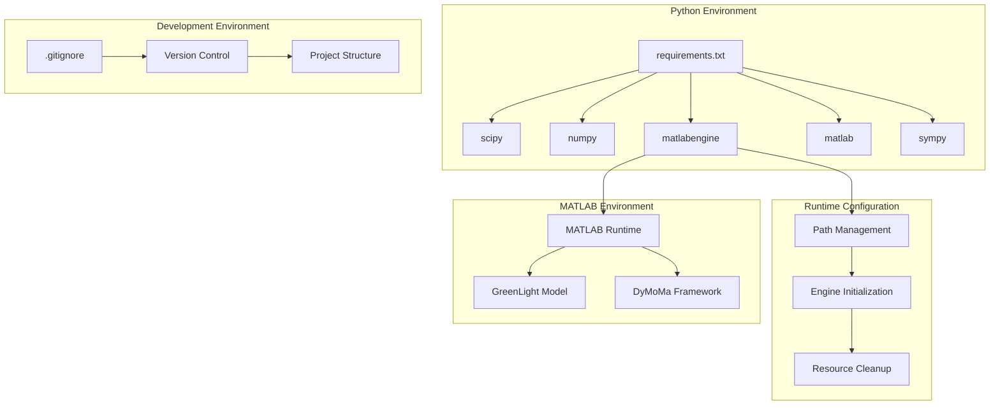
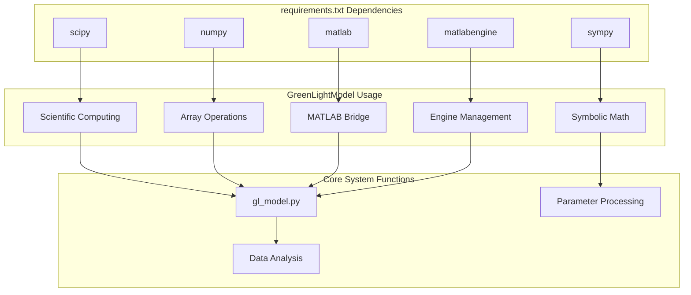
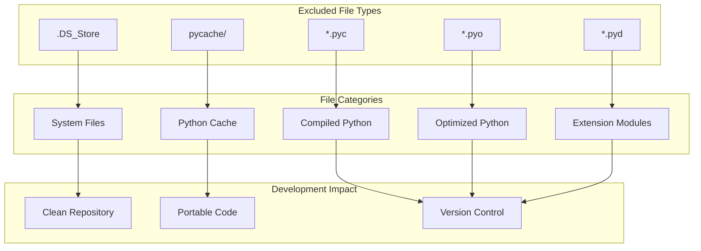
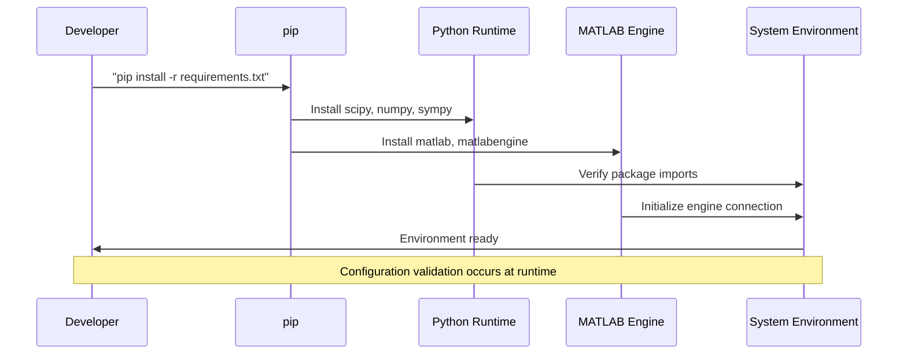

# System Configuration

> **Relevant source files**
> * [.gitignore](https://github.com/greenpeer/GreenLightModel/blob/98b32e39/.gitignore)
> * [requirements.txt](https://github.com/greenpeer/GreenLightModel/blob/98b32e39/requirements.txt)

This document covers the system-level configuration requirements, dependencies, and environment setup for the GreenLightModel system. It provides an overview of the configuration components needed to run the Python-MATLAB hybrid greenhouse simulation system.

For detailed dependency installation and environment setup procedures, see [Dependencies and Environment Setup](/greenpeer/GreenLightModel/6.1-dependencies-and-environment-setup). For development-specific configuration including version control setup, see [Development Configuration](/greenpeer/GreenLightModel/6.2-development-configuration).

## Configuration Overview

The GreenLightModel system requires configuration across multiple technology layers: Python package dependencies, MATLAB engine integration, and development environment setup. The system's hybrid architecture necessitates careful coordination between Python and MATLAB runtime environments.

## System Configuration Architecture

*Sources: [requirements.txt L1-L5](https://github.com/greenpeer/GreenLightModel/blob/98b32e39/requirements.txt#L1-L5)

 [.gitignore L1-L5](https://github.com/greenpeer/GreenLightModel/blob/98b32e39/.gitignore#L1-L5)*

## Core Configuration Files

The system uses a minimal set of configuration files that define dependencies and development environment settings:

| File | Purpose | Dependencies Managed |
| --- | --- | --- |
| `requirements.txt` | Python package dependencies | scipy, numpy, matlab, sympy, matlabengine |
| `.gitignore` | Version control exclusions | Python bytecode, system files, cache directories |

## Python Dependencies Configuration

*Sources: [requirements.txt L1-L5](https://github.com/greenpeer/GreenLightModel/blob/98b32e39/requirements.txt#L1-L5)*

The Python dependencies serve specific roles in the system:

* **scipy**: Scientific computing functions for numerical analysis and optimization
* **numpy**: Array operations and mathematical functions for data processing
* **matlab**: Base MATLAB integration support
* **sympy**: Symbolic mathematics for parameter formula evaluation
* **matlabengine**: Python-MATLAB engine interface for executing MATLAB code

## Version Control Configuration

The `.gitignore` file defines exclusion patterns for the development environment:

*Sources: [.gitignore L1-L5](https://github.com/greenpeer/GreenLightModel/blob/98b32e39/.gitignore#L1-L5)*

The exclusion patterns prevent platform-specific and generated files from being tracked:

* `.DS_Store`: macOS system metadata files
* `__pycache__/`: Python bytecode cache directories
* `*.pyc`, `*.pyo`: Compiled Python files
* `*.pyd`: Python extension modules (Windows)

## Environment Requirements

The system requires coordination between multiple runtime environments:

| Component | Requirement | Configuration Point |
| --- | --- | --- |
| Python Runtime | 3.x with pip package management | `requirements.txt` dependencies |
| MATLAB Engine | Compatible MATLAB installation | `matlabengine` package configuration |
| System Paths | Access to MATLAB and Python executables | Runtime path management |
| Memory Resources | Sufficient RAM for simulation data | No explicit configuration |

## Configuration Dependencies

*Sources: [requirements.txt L1-L5](https://github.com/greenpeer/GreenLightModel/blob/98b32e39/requirements.txt#L1-L5)

 [.gitignore L1-L5](https://github.com/greenpeer/GreenLightModel/blob/98b32e39/.gitignore#L1-L5)*

The configuration process requires sequential dependency resolution, with MATLAB engine setup being the most complex step due to its external system dependencies.