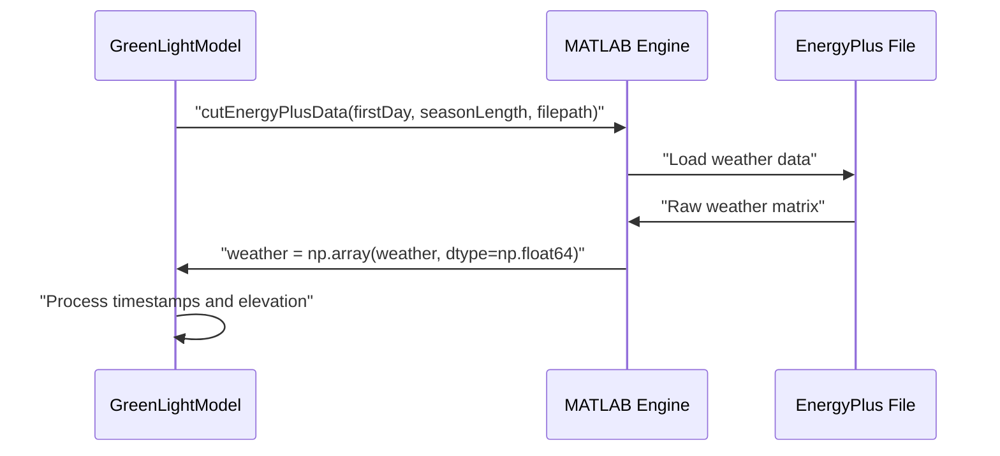
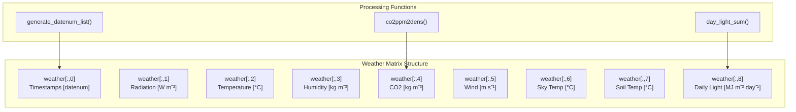
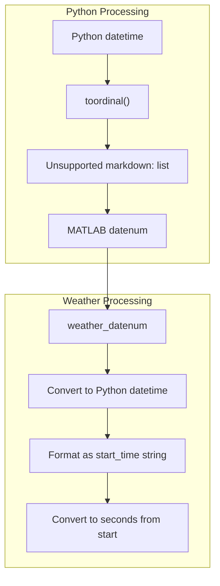
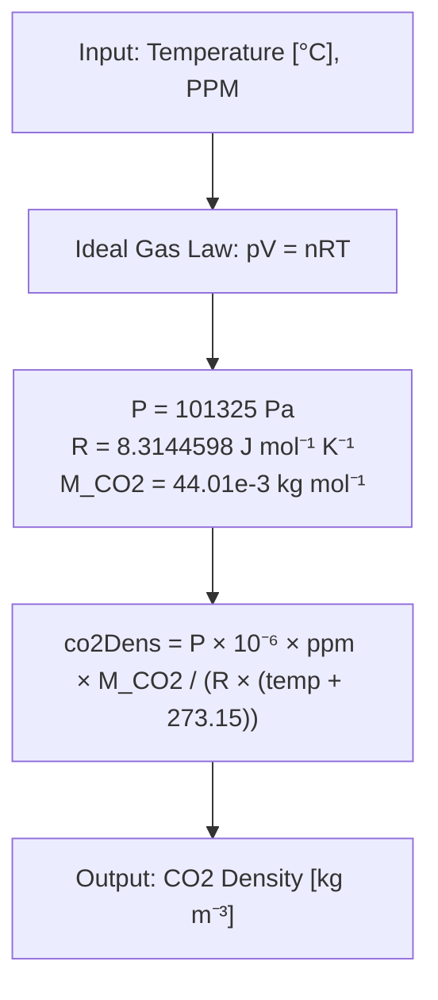
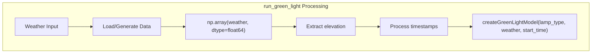

# Weather Data and Input Processing

> **Relevant source files**
> * [README.md](https://github.com/greenpeer/GreenLightModel/blob/98b32e39/README.md)
> * [gl_model.py](https://github.com/greenpeer/GreenLightModel/blob/98b32e39/gl_model.py)

This document covers how the GreenLightModel system handles weather data input, including loading EnergyPlus weather files, generating artificial weather data, and converting data formats for use in greenhouse simulations. For information about parameter management and formula evaluation, see [Parameter Management](/greenpeer/GreenLightModel/5.2-parameter-management). For details about simulation output processing, see [Output Processing and Energy Calculations](/greenpeer/GreenLightModel/5.3-output-processing-and-energy-calculations).

## Weather Data Flow Architecture

The weather data processing system transforms external weather inputs into the specific format required by the GreenLight MATLAB simulation engine.

```

```

Sources: [gl_model.py L89-L203](https://github.com/greenpeer/GreenLightModel/blob/98b32e39/gl_model.py#L89-L203)

 [gl_model.py L297-L439](https://github.com/greenpeer/GreenLightModel/blob/98b32e39/gl_model.py#L297-L439)

## Weather Data Sources and Formats

The system supports two primary weather data sources:

### EnergyPlus Weather Files

Real weather data is loaded from EnergyPlus format files stored in the data directory. The system uses MATLAB's `cutEnergyPlusData` function to extract weather data for specific time periods.



The weather file path is constructed as:

* Base directory: `GreenLight/Code/inputs/energyPlus/data/`
* File format: `{weatherInput}EnergyPlus.mat`

Sources: [gl_model.py L99-L104](https://github.com/greenpeer/GreenLightModel/blob/98b32e39/gl_model.py#L99-L104)

 [gl_model.py L291-L295](https://github.com/greenpeer/GreenLightModel/blob/98b32e39/gl_model.py#L291-L295)

### Artificial Weather Generation

When no real weather data is available, the system generates artificial weather patterns using the `makeArtificialInput` function.

| Weather Parameter | Column | Formula/Value | Unit |
| --- | --- | --- | --- |
| Timestamps | 0 | `generate_datenum_list(737485.5, length, 300)` | datenum |
| Radiation | 1 | `350 * max(0, sin(time * 2π / 86400))` | W m⁻² |
| Temperature | 2 | `5 * sin(time * 2π / 86400) + 15` | °C |
| Humidity | 3 | `0.006` (constant) | kg m⁻³ |
| CO2 | 4 | `co2ppm2dens(temperature, 410)` | kg m⁻³ |
| Wind Speed | 5 | `1.0` (constant) | m s⁻¹ |
| Sky Temperature | 6 | `temperature - 20` | °C |
| Soil Temperature | 7 | `20` (constant) | °C |
| Daily Light Sum | 8 | `day_light_sum(timestamps, radiation)` | MJ m⁻² day⁻¹ |

Sources: [gl_model.py L297-L329](https://github.com/greenpeer/GreenLightModel/blob/98b32e39/gl_model.py#L297-L329)

## Weather Matrix Structure

The processed weather data is formatted as a 9-column matrix with 5-minute intervals:



Sources: [gl_model.py L300-L311](https://github.com/greenpeer/GreenLightModel/blob/98b32e39/gl_model.py#L300-L311)

 [README.md L261-L271](https://github.com/greenpeer/GreenLightModel/blob/98b32e39/README.md#L261-L271)

## Timestamp and Date Processing

### MATLAB Datenum Conversion

The system converts between Python datetime objects and MATLAB datenum format for compatibility with the MATLAB simulation engine.



The conversion process in `run_green_light`:

1. Extract weather datenum: `weather_datenum = weather[0, 0]`
2. Convert to Python datetime with timezone adjustment
3. Format as string: `'01-Jan-2005 01:00:00'` format
4. Normalize timestamps to seconds from simulation start

Sources: [gl_model.py L138-L152](https://github.com/greenpeer/GreenLightModel/blob/98b32e39/gl_model.py#L138-L152)

 [gl_model.py L401-L438](https://github.com/greenpeer/GreenLightModel/blob/98b32e39/gl_model.py#L401-L438)

### Datenum List Generation

The `generate_datenum_list` function creates timestamp sequences for artificial weather data:

```markdown
# Calculate number of 5-minute intervals
num_intervals = int(num_days * 24 * 60 * 60 / interval_secs)

# Generate datetime sequence
for i in range(num_intervals):
    current_datetime = start_datetime + timedelta(seconds=interval_secs * i)
    current_datenum = current_datetime.toordinal() + fractional_day
```

Sources: [gl_model.py L401-L438](https://github.com/greenpeer/GreenLightModel/blob/98b32e39/gl_model.py#L401-L438)

## Supporting Weather Calculations

### CO2 Concentration Conversion

The `co2ppm2dens` function converts CO2 from parts per million to density using the ideal gas law:



Sources: [gl_model.py L331-L356](https://github.com/greenpeer/GreenLightModel/blob/98b32e39/gl_model.py#L331-L356)

### Daily Light Sum Calculation

The `day_light_sum` function calculates cumulative daily solar radiation:

1. **Interval Detection**: Calculate time intervals between measurements
2. **Midnight Detection**: Find day boundaries using `np.diff(np.floor(time))`
3. **Daily Integration**: Sum radiation values within each 24-hour period
4. **Unit Conversion**: Convert from W m⁻² to MJ m⁻² day⁻¹

```mermaid
sequenceDiagram
  participant day_light_sum()
  participant Time Array
  participant Radiation Array

  day_light_sum()->>Time Array: "Calculate intervals"
  Time Array->>day_light_sum(): "interval = (time[1] - time[0]) * 86400"
  loop ["For each timestamp"]
    day_light_sum()->>Time Array: "Find midnight boundaries"
    day_light_sum()->>Radiation Array: "Sum radiation[mn_before:mn_after]"
    Radiation Array->>day_light_sum(): "Daily radiation sum"
  end
  day_light_sum()->>day_light_sum(): "Convert to MJ m⁻² day⁻¹"
```

Sources: [gl_model.py L358-L399](https://github.com/greenpeer/GreenLightModel/blob/98b32e39/gl_model.py#L358-L399)

## Weather Data Integration

### Processing Pipeline

The complete weather processing pipeline in `run_green_light`:

1. **Data Loading**: Load EnergyPlus data or generate artificial data
2. **Format Conversion**: Convert to numpy array with float64 precision
3. **Elevation Extraction**: Extract elevation from 10th column if present
4. **Timestamp Processing**: Convert datenum to seconds from simulation start
5. **Matrix Preparation**: Format for MATLAB `createGreenLightModel` function



Sources: [gl_model.py L99-L155](https://github.com/greenpeer/GreenLightModel/blob/98b32e39/gl_model.py#L99-L155)

### Error Handling and Defaults

The system provides robust defaults for missing or invalid weather data:

* **Missing Weather**: Defaults to 5-day artificial dataset
* **Missing Elevation**: Defaults to 0 meters above sea level
* **Invalid Lamp Type**: Defaults to "none"
* **Empty Filename**: Simulation runs without saving output

Sources: [gl_model.py L114-L128](https://github.com/greenpeer/GreenLightModel/blob/98b32e39/gl_model.py#L114-L128)