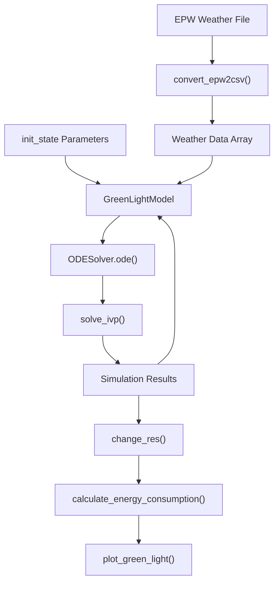
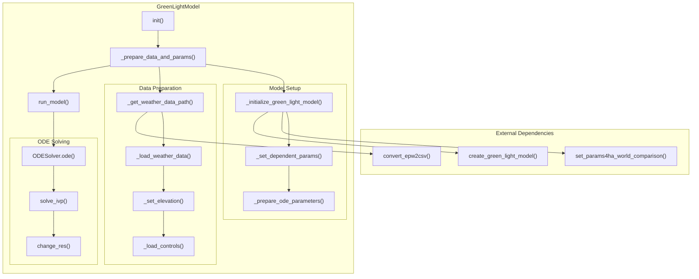

# Basic Greenhouse Simulation

> **Relevant source files**
> * [README.md](https://github.com/greenpeer/GreenLightPlus/blob/262399d9/README.md)
> * [core/green_light_model.py](https://github.com/greenpeer/GreenLightPlus/blob/262399d9/core/green_light_model.py)

## Purpose and Scope

This document provides a step-by-step guide to running a basic greenhouse simulation using the `GreenLightModel` class. It covers the fundamental workflow for simulating crop growth, energy consumption, and environmental dynamics in a greenhouse environment over a specified time period.

For advanced EnergyPlus integration, see [EnergyPlus Integration](/greenpeer/GreenLightPlus/4.2-energyplus-integration). For reinforcement learning optimization, see [Reinforcement Learning Training](/greenpeer/GreenLightPlus/4.3-reinforcement-learning-training). For detailed model internals, see [Model Internals](/greenpeer/GreenLightPlus/5.2-model-internals).

## Simulation Workflow Overview

A basic greenhouse simulation involves initializing a `GreenLightModel` instance, configuring simulation parameters, running the model over time steps, and analyzing results. The simulation integrates weather data, greenhouse structural parameters, and control strategies to predict crop yields and energy consumption.

**Basic Simulation Workflow**

```

```

Sources: [README.md L177-L262](https://github.com/greenpeer/GreenLightPlus/blob/262399d9/README.md#L177-L262)

 [core/green_light_model.py L237-L325](https://github.com/greenpeer/GreenLightPlus/blob/262399d9/core/green_light_model.py#L237-L325)

## Core Components

The basic simulation relies on several key components within the `GreenLightModel` class:

| Component | Purpose | Key Methods |
| --- | --- | --- |
| Weather Data Processing | Convert EPW files to CSV format | `_get_weather_data_path()`, `_load_weather_data()` |
| Model Initialization | Set up greenhouse parameters and ODE system | `_initialize_green_light_model()`, `_set_dependent_params()` |
| ODE Solver | Solve differential equations for plant growth | `run_model()` with `solve_ivp()` |
| Result Processing | Extract and calculate simulation outputs | `change_res()`, `set_gl_aux()` |

Sources: [core/green_light_model.py L91-L106](https://github.com/greenpeer/GreenLightPlus/blob/262399d9/core/green_light_model.py#L91-L106)

 [core/green_light_model.py L167-L184](https://github.com/greenpeer/GreenLightPlus/blob/262399d9/core/green_light_model.py#L167-L184)

 [core/green_light_model.py L237-L325](https://github.com/greenpeer/GreenLightPlus/blob/262399d9/core/green_light_model.py#L237-L325)

## Step-by-Step Implementation

### 1. Model Initialization

Create a `GreenLightModel` instance with basic configuration:

```markdown
model = GreenLightModel(
    first_day=91,  # Day of year to start simulation
    isMature=True,  # Start with mature crop
    epw_path="NLD_Amsterdam.062400_IWEC.epw"  # Weather data file
)
```

The constructor initializes key attributes including `first_day`, `lampType`, `isMature`, and `epw_path` as shown in [core/green_light_model.py L58-L88](https://github.com/greenpeer/GreenLightPlus/blob/262399d9/core/green_light_model.py#L58-L88)

### 2. Parameter Configuration

Define greenhouse structural and control parameters:

```css
init_state = {
    "p": {
        'psi': 22,           # Greenhouse cover slope (degrees)
        'aFlr': 4e4,         # Floor area (m²)
        'aCov': 4.84e4,      # Cover area (m²)
        'hAir': 6.3,         # Main compartment height (m)
        'co2SpDay': 1000,    # CO2 setpoint light period (ppm)
        'tSpNight': 18.5,    # Temperature setpoint night (°C)
        'tSpDay': 19.5,      # Temperature setpoint day (°C)
        'pBoil': 300*4e4,    # Boiler capacity (W)
    }
}
```

### 3. Simulation Loop

Execute the simulation over multiple time steps:

```sql
for current_step in range(int(season_length // season_interval)):
    gl = model.run_model(
        gl_params=init_state, 
        season_length=season_length,
        season_interval=season_interval, 
        step=current_step
    )
    init_state = gl  # Update state for next iteration
```

### 4. Result Analysis

Extract key metrics from simulation results:

```markdown
# Calculate fruit yield
current_yield = 1e-6 * calculate_energy_consumption(gl, 'mcFruitHar') / dmc

# Calculate energy consumption
lampIn += 1e-6 * calculate_energy_consumption(gl, "qLampIn", "qIntLampIn")
boilIn += 1e-6 * calculate_energy_consumption(gl, "hBoilPipe", "hBoilGroPipe")
```

Sources: [README.md L235-L258](https://github.com/greenpeer/GreenLightPlus/blob/262399d9/README.md#L235-L258)

## Data Flow Architecture

**Simulation Data Flow**



Sources: [core/green_light_model.py L91-L106](https://github.com/greenpeer/GreenLightPlus/blob/262399d9/core/green_light_model.py#L91-L106)

 [core/green_light_model.py L207-L236](https://github.com/greenpeer/GreenLightPlus/blob/262399d9/core/green_light_model.py#L207-L236)

 [core/green_light_model.py L311-L325](https://github.com/greenpeer/GreenLightPlus/blob/262399d9/core/green_light_model.py#L311-L325)

## Component Interactions

**GreenLightModel Internal Architecture**



Sources: [core/green_light_model.py L207-L236](https://github.com/greenpeer/GreenLightPlus/blob/262399d9/core/green_light_model.py#L207-L236)

 [core/green_light_model.py L167-L184](https://github.com/greenpeer/GreenLightPlus/blob/262399d9/core/green_light_model.py#L167-L184)

 [core/green_light_model.py L237-L325](https://github.com/greenpeer/GreenLightPlus/blob/262399d9/core/green_light_model.py#L237-L325)

## Key Simulation Parameters

### Temporal Parameters

* `season_length`: Total simulation duration in days
* `season_interval`: Time step interval in days
* `first_day`: Starting day of year (1-365)
* `time_step`: Final output resolution in seconds (default 60)

### Model Configuration

* `isMature`: Boolean flag for mature crop initialization
* `lampType`: Lighting system type ("led", "hps", "none")
* `epw_path`: Path to EnergyPlus weather file
* `csv_path`: Optional pre-processed weather data path

### Greenhouse Structure

* `aFlr`: Floor area (m²)
* `aCov`: Cover area including side walls (m²)
* `hAir`: Main compartment height (m)
* `psi`: Mean greenhouse cover slope (degrees)

Sources: [core/green_light_model.py L58-L88](https://github.com/greenpeer/GreenLightPlus/blob/262399d9/core/green_light_model.py#L58-L88)

 [core/green_light_model.py L237-L262](https://github.com/greenpeer/GreenLightPlus/blob/262399d9/core/green_light_model.py#L237-L262)

 [README.md L205-L232](https://github.com/greenpeer/GreenLightPlus/blob/262399d9/README.md#L205-L232)

## ODE Solver Configuration

The simulation uses `scipy.integrate.solve_ivp` with the following configuration:

```css
options = {
    "atol": 1e-6,  # Absolute tolerance
    "rtol": 1e-3,  # Relative tolerance
}
solver = "BDF"  # Backward Differentiation Formula
```

The solver integrates the differential equation system defined in `ODESolver.ode()` over the time span defined in `self.gl["t"]` with initial conditions from `self.gl["x"]`.

Sources: [core/green_light_model.py L299-L319](https://github.com/greenpeer/GreenLightPlus/blob/262399d9/core/green_light_model.py#L299-L319)

## Result Output Structure

The simulation returns a comprehensive dictionary `gl` containing:

* `x`: State variables (temperatures, concentrations, plant weights)
* `a`: Auxiliary variables (calculated environmental conditions)
* `u`: Control variables (heating, ventilation, CO2 injection)
* `d`: Disturbance variables (weather inputs)
* `p`: Parameters (structural and control settings)
* `t`: Time vector

Key output metrics include crop yield (`mcFruitHar`), energy consumption (`qLampIn`, `hBoilPipe`), and environmental conditions (temperature, humidity, CO2).

Sources: [README.md L244-L258](https://github.com/greenpeer/GreenLightPlus/blob/262399d9/README.md#L244-L258)

 [core/green_light_model.py L322-L325](https://github.com/greenpeer/GreenLightPlus/blob/262399d9/core/green_light_model.py#L322-L325)