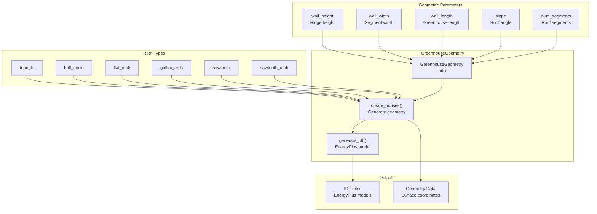
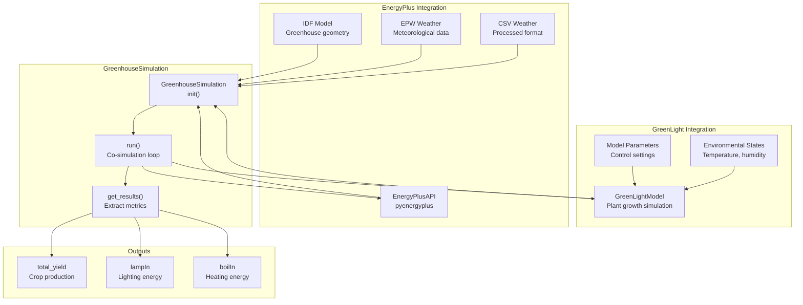
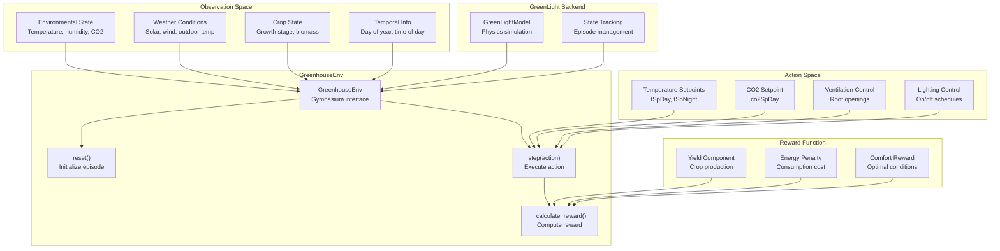
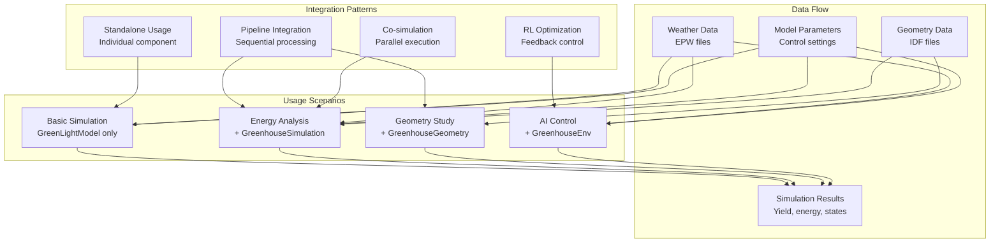

# Core Components

> **Relevant source files**
> * [README.md](https://github.com/greenpeer/GreenLightPlus/blob/262399d9/README.md)

This document covers the four primary simulation components that form the computational foundation of GreenLightPlus. These components handle greenhouse physics modeling, energy analysis, reinforcement learning optimization, and structural geometry generation.

For information about supporting utilities and model configuration, see [Supporting Systems](/greenpeer/GreenLightPlus/3-supporting-systems). For usage examples demonstrating these components in practice, see [Usage Examples](/greenpeer/GreenLightPlus/4-usage-examples).

## Overview

GreenLightPlus consists of four core components that work together to provide comprehensive greenhouse simulation and optimization capabilities:

```

```

**Component Interaction Architecture**

Sources: [README.md L38-L44](https://github.com/greenpeer/GreenLightPlus/blob/262399d9/README.md#L38-L44)

 [README.md L100-L159](https://github.com/greenpeer/GreenLightPlus/blob/262399d9/README.md#L100-L159)

 [README.md L171-L262](https://github.com/greenpeer/GreenLightPlus/blob/262399d9/README.md#L171-L262)

 [README.md L288-L331](https://github.com/greenpeer/GreenLightPlus/blob/262399d9/README.md#L288-L331)

 [README.md L341-L441](https://github.com/greenpeer/GreenLightPlus/blob/262399d9/README.md#L341-L441)

| Component | Primary Function | Key Dependencies | Output |
| --- | --- | --- | --- |
| `GreenLightModel` | Core greenhouse physics simulation | ODE solver, weather data | Environmental states, crop growth |
| `GreenhouseGeometry` | Structural modeling and IDF generation | Geometric parameters | EnergyPlus model files |
| `GreenhouseSimulation` | Co-simulation with EnergyPlus | GreenLightModel, EnergyPlus API | Detailed energy consumption |
| `GreenhouseEnv` | Reinforcement learning environment | GreenLightModel, Gymnasium | RL training interface |

## GreenLightModel

The `GreenLightModel` class serves as the central simulation engine, implementing the core greenhouse environment physics and crop growth dynamics originally developed in MATLAB GreenLight.

```

```

**GreenLightModel Internal Architecture**

The `GreenLightModel` implements a discrete-time simulation where each time step involves:

1. **State Integration**: Solves the differential equation system defined in [create_green_light_model/ode.py](https://github.com/greenpeer/GreenLightPlus/blob/262399d9/create_green_light_model/ode.py)
2. **Auxiliary Calculations**: Computes derived variables via [create_green_light_model/set_gl_aux.py](https://github.com/greenpeer/GreenLightPlus/blob/262399d9/create_green_light_model/set_gl_aux.py)
3. **Control Updates**: Applies greenhouse control logic from [create_green_light_model/set_gl_control.py](https://github.com/greenpeer/GreenLightPlus/blob/262399d9/create_green_light_model/set_gl_control.py)

### Key Methods

* `__init__(first_day, isMature, epw_path)`: Initializes model with weather data and crop maturity state
* `run_model(gl_params, season_length, season_interval, step)`: Executes simulation for specified time period
* `create_green_light_model()`: Sets up initial model structure and parameters

### Simulation Parameters

The model accepts structured parameter dictionaries containing:

| Parameter Category | Key Examples | Purpose |
| --- | --- | --- |
| Structure | `aFlr`, `aCov`, `hAir` | Greenhouse geometry |
| Control | `tSpDay`, `tSpNight`, `co2SpDay` | Environmental setpoints |
| Equipment | `pBoil`, `phiExtCo2`, `lPipe` | Heating and CO2 systems |

Sources: [README.md L179-L262](https://github.com/greenpeer/GreenLightPlus/blob/262399d9/README.md#L179-L262)

 [green_light_model.py](https://github.com/greenpeer/GreenLightPlus/blob/262399d9/green_light_model.py)

## GreenhouseGeometry

The `GreenhouseGeometry` class generates geometric models for different greenhouse roof structures and creates corresponding EnergyPlus IDF files for detailed energy analysis.



**GreenhouseGeometry Processing Pipeline**

### Supported Roof Types

The `GreenhouseGeometry` class supports six distinct roof configurations:

| Roof Type | Description | Typical Use Case |
| --- | --- | --- |
| `triangle` | Standard peaked roof | Traditional greenhouses |
| `half_circle` | Semi-circular arch | Modern multi-span structures |
| `flat_arch` | Flattened arch profile | Low-profile installations |
| `gothic_arch` | Pointed arch design | High light transmission |
| `sawtooth` | Asymmetric sawtooth pattern | Uniform light distribution |
| `sawtooth_arch` | Arched sawtooth variant | Enhanced structural strength |

### Configuration Parameters

Key initialization parameters control the geometric generation:

* `roof_type`: Selects from available roof configurations
* `wall_height`, `wall_width`, `wall_length`: Basic dimensional parameters
* `num_segments`: Number of roof spans for multi-span structures
* `slope`: Roof angle in degrees
* `number_width`, `number_length`: Array scaling for large installations

### Output Generation

The `create_houses()` method produces:

1. **IDF Files**: EnergyPlus-compatible building models for energy simulation
2. **Geometric Data**: Surface coordinates and zone definitions
3. **Visualization**: Optional 3D representation of generated structures

Sources: [README.md L100-L169](https://github.com/greenpeer/GreenLightPlus/blob/262399d9/README.md#L100-L169)

 [greenhouse_geometry.py](https://github.com/greenpeer/GreenLightPlus/blob/262399d9/greenhouse_geometry.py)

## GreenhouseSimulation

The `GreenhouseSimulation` class integrates `GreenLightModel` with EnergyPlus to provide detailed energy consumption analysis through co-simulation.



**GreenhouseSimulation Co-simulation Architecture**

### Co-simulation Process

The `GreenhouseSimulation` coordinates between GreenLight and EnergyPlus through a time-stepped approach:

1. **Initialization**: Sets up EnergyPlus API connection and GreenLight model
2. **Time Loop**: Alternates between GreenLight plant simulation and EnergyPlus building simulation
3. **Data Exchange**: Transfers environmental conditions and energy loads between models
4. **Result Collection**: Aggregates crop yield and energy consumption metrics

### Required Inputs

| Input Type | Parameter | Purpose |
| --- | --- | --- |
| Weather | `epw_path` | Meteorological boundary conditions |
| Model | `idf_path` | EnergyPlus building geometry |
| Simulation | `first_day`, `season_length` | Temporal boundaries |
| Processing | `csv_path` | Converted weather data |

### Output Metrics

The simulation produces three primary metrics:

* **Total Yield**: Crop production in kg/m²
* **Lamp Input**: Artificial lighting energy consumption in MJ/m²
* **Boiler Input**: Heating energy consumption in MJ/m²

### Integration with GreenhouseGeometry

The `GreenhouseSimulation` typically uses IDF files generated by `GreenhouseGeometry` to ensure consistency between structural modeling and energy analysis.

Sources: [README.md L288-L340](https://github.com/greenpeer/GreenLightPlus/blob/262399d9/README.md#L288-L340)

 [greenlight_energyplus_simulation.py](https://github.com/greenpeer/GreenLightPlus/blob/262399d9/greenlight_energyplus_simulation.py)

## GreenhouseEnv

The `GreenhouseEnv` class implements a Gymnasium-compatible reinforcement learning environment for training AI agents to optimize greenhouse control strategies.



**GreenhouseEnv Reinforcement Learning Interface**

### Environment Configuration

The `GreenhouseEnv` accepts comprehensive configuration through `env_config`:

| Configuration | Parameters | Purpose |
| --- | --- | --- |
| Temporal | `first_day`, `season_length`, `season_interval` | Simulation timing |
| Targets | `target_yield`, `target_yield_unit_energy_input` | Optimization objectives |
| Weather | `epw_path` | Environmental boundary conditions |
| Crop | `isMature` | Growth stage specification |
| Initial State | `init_state["p"]` | Greenhouse parameters |

### Action Space

The environment supports multi-dimensional continuous control actions:

* **Temperature Setpoints**: Day and night temperature targets
* **CO2 Concentration**: Photosynthesis optimization
* **Ventilation Settings**: Roof opening percentages
* **Lighting Schedule**: Supplemental lighting control

### Observation Space

The observation vector includes:

* **Environmental Variables**: Current temperature, humidity, CO2 levels
* **Weather Data**: Solar radiation, outdoor temperature, wind speed
* **Crop Indicators**: Growth stage, leaf area index, biomass accumulation
* **Temporal Context**: Time of day, day of year, season progress

### Reward Structure

The reward function balances multiple objectives:

```
reward = yield_component - energy_penalty + comfort_bonus
```

Where:

* `yield_component`: Encourages crop production
* `energy_penalty`: Penalizes excessive energy consumption
* `comfort_bonus`: Rewards maintaining optimal growing conditions

### Integration with Ray RLlib

The environment is compatible with Ray RLlib algorithms, particularly PPO for greenhouse control optimization. Training typically involves:

1. **Rollout Collection**: Gathering experience through environment interaction
2. **Policy Updates**: Learning improved control strategies
3. **Checkpoint Management**: Saving trained models for deployment

Sources: [README.md L341-L451](https://github.com/greenpeer/GreenLightPlus/blob/262399d9/README.md#L341-L451)

 [greenhouse_env.py](https://github.com/greenpeer/GreenLightPlus/blob/262399d9/greenhouse_env.py)

## Component Integration Patterns

The four core components follow established integration patterns to enable flexible system composition:



**Component Integration and Usage Patterns**

### Common Integration Scenarios

1. **Standalone Simulation**: Direct use of `GreenLightModel` for basic greenhouse analysis
2. **Energy Analysis**: `GreenhouseSimulation` + `GreenLightModel` for detailed energy consumption
3. **Geometric Studies**: `GreenhouseGeometry` + `GreenhouseSimulation` for structure optimization
4. **AI-Driven Control**: `GreenhouseEnv` + `GreenLightModel` for reinforcement learning optimization

### Data Exchange Protocols

Components exchange data through standardized interfaces:

* **Weather Data**: EPW format processed to CSV for model consumption
* **State Variables**: Nested dictionaries containing environmental and crop states
* **Parameters**: Structured configuration objects with validation
* **Results**: Standardized metrics for yield, energy, and environmental conditions

Sources: [README.md L171-L451](https://github.com/greenpeer/GreenLightPlus/blob/262399d9/README.md#L171-L451)