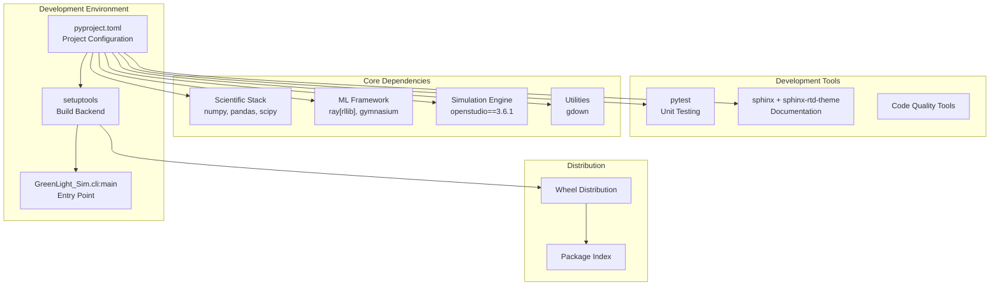
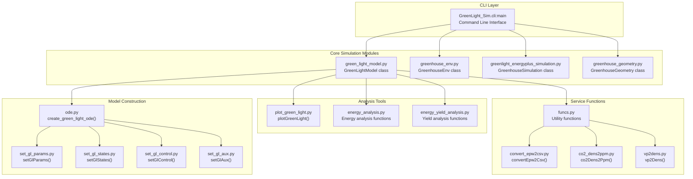

# Development

> **Relevant source files**
> * [LICENSE.txt](https://github.com/greenpeer/GreenLightPlus/blob/262399d9/LICENSE.txt)
> * [pyproject.toml](https://github.com/greenpeer/GreenLightPlus/blob/262399d9/pyproject.toml)

This section provides information for developers who want to contribute to or extend GreenLightPlus. It covers the project structure, development environment setup, and guidelines for contributing to the codebase.

For detailed information about the internal model structure and algorithms, see [Model Internals](/greenpeer/GreenLightPlus/5.2-model-internals). For contribution guidelines and licensing information, see [Contributing](/greenpeer/GreenLightPlus/5.3-contributing).

## Development Environment

GreenLightPlus is built as a modern Python package using the `setuptools` build system with a declarative configuration approach. The project targets Python 3.8+ and integrates with several external simulation and machine learning frameworks.

### Build System and Dependencies

The project uses a standard Python packaging structure defined in [pyproject.toml L1-L55](https://github.com/greenpeer/GreenLightPlus/blob/262399d9/pyproject.toml#L1-L55)

:

| Component | Version/Requirement | Purpose |
| --- | --- | --- |
| Python | >=3.8 | Runtime environment |
| setuptools | >=61.0 | Build backend |
| numpy, pandas, scipy | Latest | Core scientific computing |
| gymnasium | Latest | RL environment framework |
| openstudio | ==3.6.1 | EnergyPlus integration |
| ray[rllib] | Latest | Distributed RL training |
| gdown | Latest | Model file downloads |

The project includes optional development dependencies for testing and documentation:

* `pytest` for unit testing
* `sphinx` and `sphinx-rtd-theme` for documentation generation

### Package Entry Points

The main CLI interface is exposed through the `GreenLightPlus` command, which maps to `GreenLight_Sim.cli:main` as defined in [pyproject.toml L47-L48](https://github.com/greenpeer/GreenLightPlus/blob/262399d9/pyproject.toml#L47-L48)

## Development Workflow

### Development Tools Integration

**Development Workflow Architecture**

This diagram shows how the development environment is structured around the declarative configuration in `pyproject.toml`, which manages both runtime dependencies and development tooling.

Sources: [pyproject.toml L1-L55](https://github.com/greenpeer/GreenLightPlus/blob/262399d9/pyproject.toml#L1-L55)

### Code Architecture Overview

**Core Code Architecture with Function Names**

This diagram maps the high-level system components to their actual implementation in the codebase, showing the primary classes and functions that developers will encounter.

Sources: [pyproject.toml L47-L48](https://github.com/greenpeer/GreenLightPlus/blob/262399d9/pyproject.toml#L47-L48)

## Licensing and Legal Framework

GreenLightPlus is licensed under the GNU General Public License version 3 (GPL v3) as specified in [LICENSE.txt L1-L675](https://github.com/greenpeer/GreenLightPlus/blob/262399d9/LICENSE.txt#L1-L675)

 This copyleft license has important implications for development:

### GPL v3 Key Requirements

| Requirement | Implication for Development |
| --- | --- |
| Source code availability | All distributed versions must include source code |
| Derivative work licensing | Extensions must be GPL v3 compatible |
| Copyright notices | Must preserve existing copyright and license notices |
| Installation information | Must provide installation instructions for User Products |

The GPL v3 license ensures that GreenLightPlus remains free and open source, but developers must ensure any contributions or derivative works comply with the license terms.

### Project Metadata

The project is maintained by Daidai Qiu ([qiu.daidai@outlook.com](mailto:qiu.daidai@outlook.com)) and is classified as:

* Development Status: Alpha
* Intended Audience: Science/Research
* Topic: Scientific/Engineering

Sources: [pyproject.toml L8-L24](https://github.com/greenpeer/GreenLightPlus/blob/262399d9/pyproject.toml#L8-L24)

 [LICENSE.txt L1-L675](https://github.com/greenpeer/GreenLightPlus/blob/262399d9/LICENSE.txt#L1-L675)

## Integration Points

### External System Dependencies

GreenLightPlus integrates with several external systems that developers need to understand:

1. **EnergyPlus 3.6.1**: Building energy simulation engine accessed through OpenStudio
2. **Ray RLlib**: Distributed reinforcement learning framework for agent training
3. **Gymnasium**: Standard RL environment interface for agent-environment interaction

### Python Version Compatibility

The codebase supports Python 3.8, 3.9, and 3.10 as specified in [pyproject.toml L20-L22](https://github.com/greenpeer/GreenLightPlus/blob/262399d9/pyproject.toml#L20-L22)

 Developers should ensure compatibility across these versions when contributing.

## Development Standards

### Package Structure

The project follows standard Python package conventions with setuptools auto-discovery enabled through [pyproject.toml L53-L54](https://github.com/greenpeer/GreenLightPlus/blob/262399d9/pyproject.toml#L53-L54)

 The `include-package-data = true` directive ensures that non-Python files are included in distributions.

### Command Line Interface

The main entry point provides a unified interface to all GreenLightPlus functionality through the `GreenLightPlus` command, implemented in the `GreenLight_Sim.cli` module.

Sources: [pyproject.toml L1-L55](https://github.com/greenpeer/GreenLightPlus/blob/262399d9/pyproject.toml#L1-L55)

 [LICENSE.txt L1-L675](https://github.com/greenpeer/GreenLightPlus/blob/262399d9/LICENSE.txt#L1-L675)