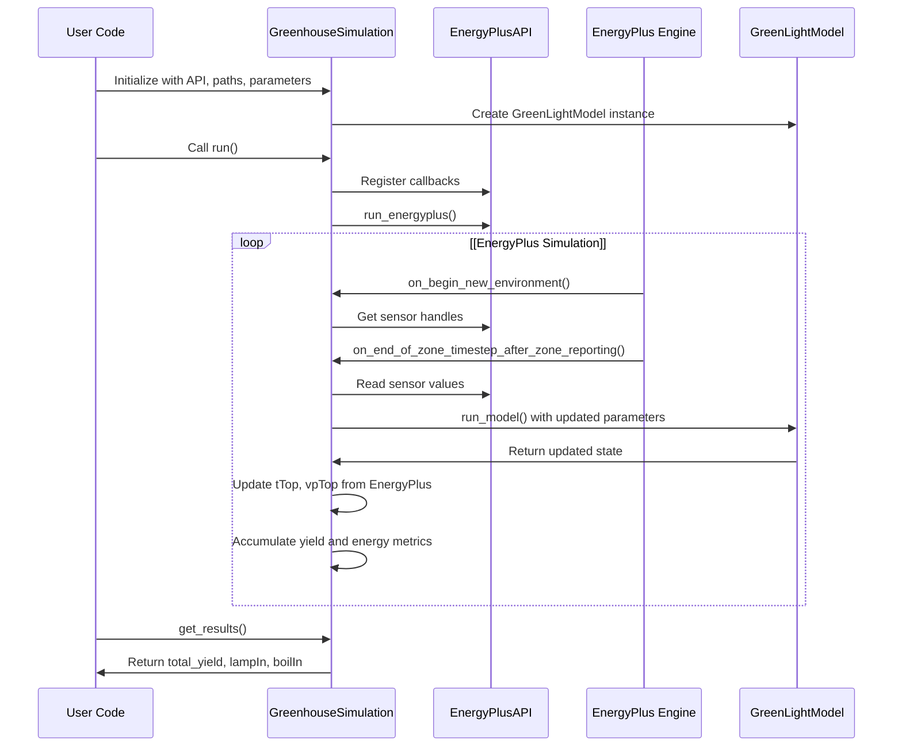
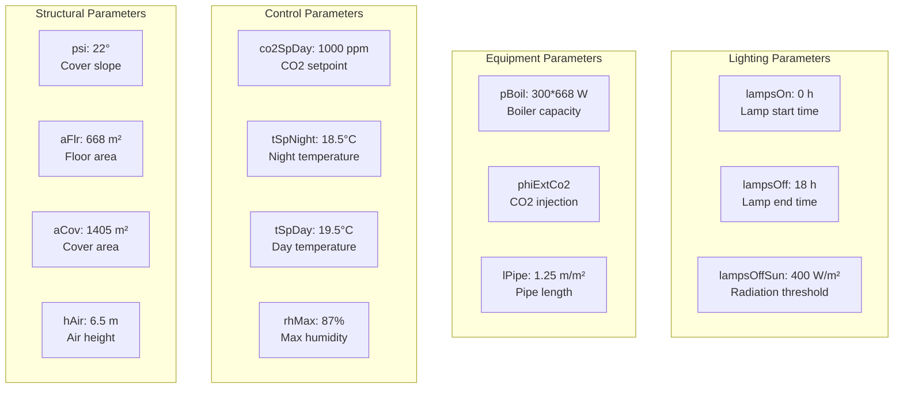

# EnergyPlus Integration

> **Relevant source files**
> * [README.md](https://github.com/greenpeer/GreenLightPlus/blob/262399d9/README.md)
> * [core/greenlight_energyplus_simulation.py](https://github.com/greenpeer/GreenLightPlus/blob/262399d9/core/greenlight_energyplus_simulation.py)

This document covers the EnergyPlus integration subsystem within GreenLightPlus, which enables detailed building energy simulation coupled with greenhouse crop growth modeling. The integration combines EnergyPlus building physics simulation with the GreenLight crop model to provide comprehensive energy consumption analysis and yield prediction.

For information about basic greenhouse simulation without EnergyPlus, see [Basic Greenhouse Simulation](/greenpeer/GreenLightPlus/4.1-basic-greenhouse-simulation). For details about the standalone GreenLight model, see [GreenLightModel](/greenpeer/GreenLightPlus/2.1-greenlightmodel).

## Overview

The EnergyPlus integration allows GreenLightPlus to leverage EnergyPlus v23.2.0 for detailed building energy simulation while maintaining the sophisticated crop growth modeling from the GreenLight model. This co-simulation approach provides more accurate energy consumption calculations by considering detailed building physics, HVAC systems, and environmental control interactions.

```

```

**EnergyPlus Integration Data Flow**

Sources: [core/greenlight_energyplus_simulation.py L1-L233](https://github.com/greenpeer/GreenLightPlus/blob/262399d9/core/greenlight_energyplus_simulation.py#L1-L233)

 [README.md L288-L340](https://github.com/greenpeer/GreenLightPlus/blob/262399d9/README.md#L288-L340)

## Core Integration Component

The `GreenhouseSimulation` class serves as the primary integration controller, managing the co-simulation between EnergyPlus and the GreenLight model.

### GreenhouseSimulation Class Structure

| Component | Purpose | Key Methods |
| --- | --- | --- |
| Constructor | Initialize simulation parameters | `__init__()` |
| EnergyPlus Callbacks | Handle simulation events | `on_begin_new_environment()`, `on_end_of_zone_timestep_after_zone_reporting()` |
| Model Integration | Run GreenLight within EnergyPlus timesteps | Data exchange via sensor handles |
| Results Collection | Aggregate yield and energy metrics | `get_results()` |

```

```

**GreenhouseSimulation Component Interaction**

Sources: [core/greenlight_energyplus_simulation.py L15-L93](https://github.com/greenpeer/GreenLightPlus/blob/262399d9/core/greenlight_energyplus_simulation.py#L15-L93)

 [core/greenlight_energyplus_simulation.py L208-L232](https://github.com/greenpeer/GreenLightPlus/blob/262399d9/core/greenlight_energyplus_simulation.py#L208-L232)

## Data Exchange Mechanisms

The integration implements bi-directional data exchange between EnergyPlus and the GreenLight model through sensor handles and state variable updates.

### Sensor Handle Configuration

```

```

**Data Exchange Between EnergyPlus and GreenLight**

The data exchange occurs during each EnergyPlus timestep through the `on_end_of_zone_timestep_after_zone_reporting` callback:

1. **Read EnergyPlus Values**: Temperature and humidity data from EnergyPlus zones
2. **Convert Units**: Humidity ratio to vapor pressure using atmospheric pressure calculations
3. **Update GreenLight State**: Replace `tTop` and `vpTop` values in the model state
4. **Continue Simulation**: GreenLight model uses updated environmental conditions

Sources: [core/greenlight_energyplus_simulation.py L94-L125](https://github.com/greenpeer/GreenLightPlus/blob/262399d9/core/greenlight_energyplus_simulation.py#L94-L125)

 [core/greenlight_energyplus_simulation.py L132-L207](https://github.com/greenpeer/GreenLightPlus/blob/262399d9/core/greenlight_energyplus_simulation.py#L132-L207)

## Simulation Workflow

The integration follows a structured workflow that coordinates EnergyPlus building simulation with GreenLight crop modeling.



**Co-simulation Sequence**

Sources: [core/greenlight_energyplus_simulation.py L208-L232](https://github.com/greenpeer/GreenLightPlus/blob/262399d9/core/greenlight_energyplus_simulation.py#L208-L232)

 [core/greenlight_energyplus_simulation.py L132-L207](https://github.com/greenpeer/GreenLightPlus/blob/262399d9/core/greenlight_energyplus_simulation.py#L132-L207)

## Configuration Parameters

The `GreenhouseSimulation` class requires specific initialization parameters and maintains default greenhouse control settings.

### Initialization Parameters

| Parameter | Type | Purpose | Example |
| --- | --- | --- | --- |
| `api` | EnergyPlusAPI | EnergyPlus API instance | `EnergyPlusAPI()` |
| `epw_path` | str | Weather file path | `"NLD_Amsterdam.062400_IWEC.epw"` |
| `idf_path` | str | Building model file | `"greenhouse_half_circle.idf"` |
| `csv_path` | str | Processed weather data | `convert_epw2csv()` output |
| `output_directory` | str | EnergyPlus output location | `"data/energyPlus/outputs"` |
| `first_day` | int | Start day of year | `91` |
| `season_length` | int | Simulation duration (days) | `7` |

### Default Control Settings

The integration includes comprehensive greenhouse control parameters stored in `init_state["p"]`:



**Configuration Parameter Categories**

Sources: [core/greenlight_energyplus_simulation.py L52-L92](https://github.com/greenpeer/GreenLightPlus/blob/262399d9/core/greenlight_energyplus_simulation.py#L52-L92)

## Usage Example

The typical usage pattern involves setting up the EnergyPlus API, configuring file paths, and running the co-simulation:

```javascript
import sys
sys.path.insert(0, "./EnergyPlus")
from GreenLightPlus import GreenhouseSimulation, convert_epw2csv
from pyenergyplus.api import EnergyPlusAPI

# Setup
api = EnergyPlusAPI()
epw_path = "NLD_Amsterdam.062400_IWEC.epw"
idf_path = "data/model_files/greenhouse_half_circle.idf"
csv_path = convert_epw2csv(epw_path=epw_path, time_step=1)

# Run simulation
simulation = GreenhouseSimulation(
    api, epw_path, idf_path, csv_path, 
    "data/energyPlus/outputs", first_day=91, season_length=7, isMature=True
)
simulation.run()

# Get results
total_yield, lampIn, boilIn = simulation.get_results()
```

This integration enables comprehensive greenhouse analysis by combining EnergyPlus's detailed building physics with GreenLight's sophisticated crop growth modeling, providing accurate energy consumption calculations and yield predictions.

Sources: [README.md L296-L331](https://github.com/greenpeer/GreenLightPlus/blob/262399d9/README.md#L296-L331)