# GreenLightModel

> **Relevant source files**
> * [core/green_light_model.py](https://github.com/greenpeer/GreenLightPlus/blob/262399d9/core/green_light_model.py)
> * [create_green_light_model/ode.py](https://github.com/greenpeer/GreenLightPlus/blob/262399d9/create_green_light_model/ode.py)

## Purpose and Scope

The GreenLightModel is the core simulation engine of GreenLightPlus, responsible for modeling greenhouse environments with comprehensive plant growth dynamics, climate control, and energy consumption. This system implements a sophisticated ordinary differential equation (ODE) solver to simulate the complex interactions between greenhouse microclimate, crop physiology, and control systems over time.

The GreenLightModel handles weather data processing, control strategy implementation, and numerical integration of the greenhouse system dynamics. For information about the reinforcement learning environment that uses this model, see [GreenhouseEnv](/greenpeer/GreenLightPlus/2.3-greenhouseenv). For details about EnergyPlus integration that extends this model's capabilities, see [GreenhouseSimulation](/greenpeer/GreenLightPlus/2.2-greenhousesimulation).

## System Architecture

The GreenLightModel consists of two primary classes that work together to provide comprehensive greenhouse simulation capabilities.

**GreenLightModel System Architecture**

```

```

Sources: [core/green_light_model.py L38-L325](https://github.com/greenpeer/GreenLightPlus/blob/262399d9/core/green_light_model.py#L38-L325)

 [create_green_light_model/ode.py L28-L133](https://github.com/greenpeer/GreenLightPlus/blob/262399d9/create_green_light_model/ode.py#L28-L133)

## Core Components

### GreenLightModel Class

The `GreenLightModel` class serves as the main interface for greenhouse simulations, managing data preparation, model initialization, and simulation execution.

| Attribute | Type | Purpose |
| --- | --- | --- |
| `filename` | str | Output file name for simulation results |
| `first_day` | int | Starting day of year for simulation (1-365) |
| `lampType` | str | Lighting type: 'led', 'hps', or 'none' |
| `isMature` | bool | Whether to start with mature crop conditions |
| `controls_file` | str | Path to control strategy CSV file |
| `epw_path` | str | Path to EnergyPlus Weather file |
| `csv_path` | str | Path to processed CSV weather data |

**Key Methods:**

* `run_model()`: Main simulation execution method that orchestrates the entire modeling process
* `_prepare_data_and_params()`: Coordinates data loading and model initialization
* `_load_weather_data()`: Processes weather data from EPW or CSV sources
* `_load_controls()`: Loads predefined control strategies if provided

Sources: [core/green_light_model.py L58-L89](https://github.com/greenpeer/GreenLightPlus/blob/262399d9/core/green_light_model.py#L58-L89)

 [core/green_light_model.py L237-L325](https://github.com/greenpeer/GreenLightPlus/blob/262399d9/core/green_light_model.py#L237-L325)

### ODESolver Class

The `ODESolver` class implements the numerical integration engine that solves the system of ordinary differential equations representing greenhouse dynamics.

| Attribute | Type | Purpose |
| --- | --- | --- |
| `gl` | dict | Complete GreenLight model state and parameters |
| `d` | numpy.ndarray | Uncontrolled variables matrix (weather, disturbances) |
| `u` | numpy.ndarray | Control variables matrix (user-defined controls) |
| `prev_gl` | dict | Previous model state for handling numerical issues |

**Key Methods:**

* `ode()`: Main ODE function called by the numerical integrator
* `sample_d()`: Interpolates uncontrolled variables at specific time points
* `sample_u()`: Interpolates control variables at specific time points

Sources: [create_green_light_model/ode.py L28-L40](https://github.com/greenpeer/GreenLightPlus/blob/262399d9/create_green_light_model/ode.py#L28-L40)

 [create_green_light_model/ode.py L89-L133](https://github.com/greenpeer/GreenLightPlus/blob/262399d9/create_green_light_model/ode.py#L89-L133)

## Data Flow and Processing

The GreenLightModel processes data through a structured pipeline that transforms raw inputs into simulation-ready parameters.

**Data Processing Pipeline**

```

```

Sources: [core/green_light_model.py L91-L106](https://github.com/greenpeer/GreenLightPlus/blob/262399d9/core/green_light_model.py#L91-L106)

 [core/green_light_model.py L207-L235](https://github.com/greenpeer/GreenLightPlus/blob/262399d9/core/green_light_model.py#L207-L235)

 [core/green_light_model.py L185-L205](https://github.com/greenpeer/GreenLightPlus/blob/262399d9/core/green_light_model.py#L185-L205)

## ODE System and Simulation Process

The greenhouse simulation is modeled as a system of ordinary differential equations that capture the temporal dynamics of plant growth, energy flows, and environmental conditions.

**ODE Solving Process**

```

```

The ODE solver configuration uses backward differentiation formula (BDF) method with adaptive tolerances:

| Parameter | Value | Purpose |
| --- | --- | --- |
| `method` | "BDF" | Backward Differentiation Formula for stiff systems |
| `atol` | 1e-6 | Absolute tolerance for numerical accuracy |
| `rtol` | 1e-3 | Relative tolerance for computational efficiency |
| `dense_output` | True | Enables interpolation between time steps |

Sources: [core/green_light_model.py L299-L319](https://github.com/greenpeer/GreenLightPlus/blob/262399d9/core/green_light_model.py#L299-L319)

 [create_green_light_model/ode.py L89-L133](https://github.com/greenpeer/GreenLightPlus/blob/262399d9/create_green_light_model/ode.py#L89-L133)

## Integration Points

The GreenLightModel integrates with multiple external systems and internal components to provide comprehensive simulation capabilities.

**System Integration Architecture**

```mermaid
flowchart TD

GLM_CORE["GreenLightModel"]
ODE_SOLVER["ODESolver"]
EPW_CONV["convert_epw2csv"]
CSV_CHECK["check_csv"]
WEATHER_CUT["cut_energy_plus_data_csv"]
ARTIFICIAL["make_artificial_input"]
CREATE_MODEL["create_green_light_model"]
SET_PARAMS["set_params4ha_world_comparison"]
SET_DEP["set_dep_params"]
SET_AUX["set_gl_aux"]
SET_CONTROL["set_gl_control"]
SET_ODES["set_gl_odes"]
CHANGE_RES["change_res"]
EXTRACT_LAST["extract_last_value_from_nested_dict"]
SCIPY["scipy.integrate.solve_ivp"]
NUMPY["numpy"]
PANDAS["pandas"]

GLM_CORE --> EPW_CONV
GLM_CORE --> CSV_CHECK
GLM_CORE --> WEATHER_CUT
GLM_CORE --> ARTIFICIAL
GLM_CORE --> CREATE_MODEL
GLM_CORE --> SET_PARAMS
GLM_CORE --> SET_DEP
ODE_SOLVER --> SET_AUX
ODE_SOLVER --> SET_CONTROL
ODE_SOLVER --> SET_ODES
GLM_CORE --> CHANGE_RES
GLM_CORE --> EXTRACT_LAST
GLM_CORE --> SCIPY
ODE_SOLVER --> NUMPY
GLM_CORE --> PANDAS

subgraph subGraph5 ["External Libraries"]
    SCIPY
    NUMPY
    PANDAS
end

subgraph subGraph4 ["Result Processing"]
    CHANGE_RES
    EXTRACT_LAST
end

subgraph subGraph3 ["ODE Components"]
    SET_AUX
    SET_CONTROL
    SET_ODES
end

subgraph subGraph2 ["Model Construction"]
    CREATE_MODEL
    SET_PARAMS
    SET_DEP
end

subgraph subGraph1 ["Weather Processing"]
    EPW_CONV
    CSV_CHECK
    WEATHER_CUT
    ARTIFICIAL
end

subgraph subGraph0 ["GreenLightModel Core"]
    GLM_CORE
    ODE_SOLVER
end
```



**Control Integration**

The model supports two control modes:

1. **Predefined Controls**: External control files loaded via `controls_file` parameter
2. **Rule-based Controls**: Dynamic control logic implemented in `set_gl_control()`

Control variables are interpolated at each time step and applied through the `u` matrix in the ODE solver.

Sources: [core/green_light_model.py L22-L36](https://github.com/greenpeer/GreenLightPlus/blob/262399d9/core/green_light_model.py#L22-L36)

 [core/green_light_model.py L156-L165](https://github.com/greenpeer/GreenLightPlus/blob/262399d9/core/green_light_model.py#L156-L165)

 [create_green_light_model/ode.py L75-L87](https://github.com/greenpeer/GreenLightPlus/blob/262399d9/create_green_light_model/ode.py#L75-L87)

 [create_green_light_model/ode.py L103-L106](https://github.com/greenpeer/GreenLightPlus/blob/262399d9/create_green_light_model/ode.py#L103-L106)

**Mature Crop Initialization**

When `isMature=True`, the model initializes with mature crop conditions:

| State Variable | Initial Value | Unit | Description |
| --- | --- | --- | --- |
| `cFruit` | 2.8e5 | mg m⁻² | Fruit dry matter weight |
| `cLeaf` | 0.9e5 | mg m⁻² | Leaf dry matter weight |
| `cStem` | 2.5e5 | mg m⁻² | Stem dry matter weight |
| `tCanSum` | 3000 | °C·h | Temperature sum for development |

Sources: [core/green_light_model.py L284-L291](https://github.com/greenpeer/GreenLightPlus/blob/262399d9/core/green_light_model.py#L284-L291)