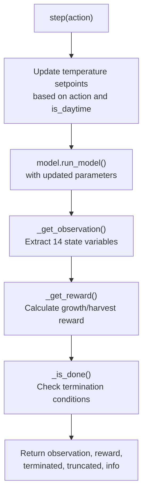
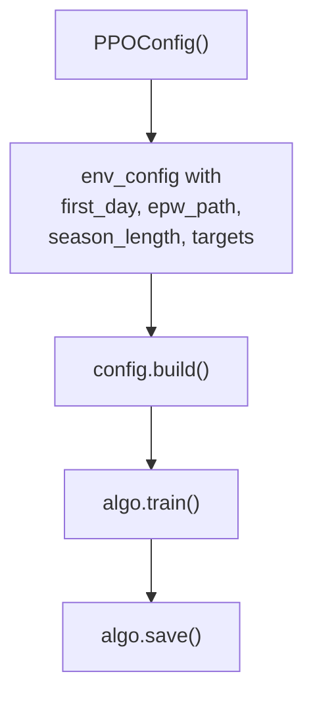

# GreenhouseEnv

> **Relevant source files**
> * [README.md](https://github.com/greenpeer/GreenLightPlus/blob/262399d9/README.md)
> * [core/greenhouse_env.py](https://github.com/greenpeer/GreenLightPlus/blob/262399d9/core/greenhouse_env.py)

This document covers the `GreenhouseEnv` class, which provides a reinforcement learning environment for training AI agents to optimize greenhouse control strategies. The environment follows the OpenAI Gymnasium interface and integrates with the core GreenLight simulation model to enable automated control optimization.

For information about the underlying greenhouse simulation model, see [GreenLightModel](/greenpeer/GreenLightPlus/2.1-greenlightmodel). For details about the EnergyPlus integration capabilities, see [GreenhouseSimulation](/greenpeer/GreenLightPlus/2.2-greenhousesimulation).

## Architecture and Integration

The `GreenhouseEnv` serves as a bridge between reinforcement learning frameworks (primarily Ray RLlib) and the GreenLight greenhouse simulation engine. It wraps the `GreenLightModel` in a standardized RL interface, enabling AI agents to learn optimal control policies through environmental interaction.

**GreenhouseEnv Integration Architecture**

```

```

Sources: [core/greenhouse_env.py L1-L376](https://github.com/greenpeer/GreenLightPlus/blob/262399d9/core/greenhouse_env.py#L1-L376)

 [README.md L341-L449](https://github.com/greenpeer/GreenLightPlus/blob/262399d9/README.md#L341-L449)

## Environment Configuration

The `GreenhouseEnv` accepts comprehensive configuration through the `env_config` parameter during initialization. Configuration parameters control simulation timing, target performance metrics, and initial greenhouse state.

| Parameter | Type | Default | Description |
| --- | --- | --- | --- |
| `first_day` | int | 1 | Starting day of year for simulation |
| `isMature` | bool | False | Whether crops start in mature state |
| `epw_path` | str | "" | Path to weather data file |
| `season_length` | int | 60 | Total simulation duration in days |
| `season_interval` | float | 1/24 | Time step interval in days |
| `target_yield` | float | 0 | Target crop yield (kg/m²) |
| `target_yield_unit_energy_input` | float | 0 | Target energy efficiency (MJ/kg) |
| `init_state` | dict | {} | Initial greenhouse parameters |

**Environment Initialization Flow**

```

```

Sources: [core/greenhouse_env.py L27-L135](https://github.com/greenpeer/GreenLightPlus/blob/262399d9/core/greenhouse_env.py#L27-L135)

## Action and Observation Spaces

### Action Space

The environment provides discrete temperature control through an 11-action space representing temperature setpoints from 18°C to 28°C. Actions are applied to either day or night temperature setpoints based on the current time period.

```markdown
# Action mapping: action ∈ [0, 10] → temperature ∈ [18, 28]°C
temperature_setpoint = action + 18
```

**Action Processing Logic**

```

```

Sources: [core/greenhouse_env.py L77-L78](https://github.com/greenpeer/GreenLightPlus/blob/262399d9/core/greenhouse_env.py#L77-L78)

 [core/greenhouse_env.py L146-L160](https://github.com/greenpeer/GreenLightPlus/blob/262399d9/core/greenhouse_env.py#L146-L160)

### Observation Space

The observation space contains 14 continuous variables representing greenhouse state, environmental conditions, and control parameters:

| Index | Variable | Unit | Range | Description |
| --- | --- | --- | --- | --- |
| 0 | `day_of_year` | days | [0, 365] | Current day of simulation |
| 1 | `tSpNight` | °C | [18, 28] | Night temperature setpoint |
| 2 | `tSpDay` | °C | [18, 28] | Day temperature setpoint |
| 3 | `co2SpDay` | ppm | [400, 1600] | CO2 setpoint during light period |
| 4 | `co2Air` | mg/m³ | [400, 2500] | Air CO2 concentration |
| 5 | `vpAir` | Pa | [0, 5000] | Air vapor pressure |
| 6 | `tAir` | °C | [0, 40] | Air temperature |
| 7 | `cFruit` | mg/m² | [300, 3e5] | Fruit dry matter weight |
| 8 | `mcOrgAir` | mg/m²/s | [0, 0.2] | Total maintenance respiration |
| 9 | `mcAirBuf` | mg/m²/s | [0, 2] | Net photosynthesis rate |
| 10 | `iGlob` | W/m² | [0, 1000] | Global solar radiation |
| 11 | `tOut` | °C | [-10, 40] | Outdoor temperature |
| 12 | `lampIn` | MJ/m² | [0, 500] | Lamp energy input |
| 13 | `boilIn` | MJ/m² | [0, 500] | Boiler energy input |

Sources: [core/greenhouse_env.py L80-L132](https://github.com/greenpeer/GreenLightPlus/blob/262399d9/core/greenhouse_env.py#L80-L132)

 [core/greenhouse_env.py L204-L230](https://github.com/greenpeer/GreenLightPlus/blob/262399d9/core/greenhouse_env.py#L204-L230)

## Reward System

The reward system operates in two distinct phases: growth period and harvest period. Rewards incentivize both crop development and energy efficiency.

### Growth Period Rewards

During the growth phase (before fruit maturation), rewards are based on fruit dry matter accumulation:

```markdown
# Growth period reward calculation
cFruit_growth = new_state["cFruit"] - previous_state["cFruit"]  # mg/m²
reward = cFruit_growth * 1e-3  # Convert to g/m² for scaling
```

### Harvest Period Rewards

During harvest phase, rewards are based on actual yield with performance modifiers:

```yaml
# Base harvest reward
reward = yield_change * 1e3  # g/m²

# Performance modifiers
if total_yield >= incremental_target_yield:
    reward *= 1.2  # 20% bonus for meeting yield targets
else:
    reward *= 0.8  # 20% penalty for underperformance

if harvest_unit_energy_input <= target_harvest_unit_energy_input:
    reward *= 1.2  # 20% bonus for energy efficiency
else:
    reward *= 0.8  # 20% penalty for energy inefficiency
```

### Terminal Rewards

At episode termination, additional rewards/penalties are applied based on overall performance relative to targets:

```markdown
# Terminal performance adjustment
energy_diff_pct = (target_unit_energy - actual_unit_energy) / target_unit_energy
yield_diff_pct = (actual_yield - target_yield) / target_yield
terminal_reward = (energy_diff_pct + yield_diff_pct) * total_reward
```

Sources: [core/greenhouse_env.py L234-L323](https://github.com/greenpeer/GreenLightPlus/blob/262399d9/core/greenhouse_env.py#L234-L323)

## Environment Lifecycle

The environment follows the standard Gymnasium lifecycle with `reset()`, `step()`, and termination logic tailored for greenhouse simulation.

**Environment Step Cycle**



### Termination Conditions

Episodes terminate when either of two conditions is met:

1. **Time-based termination**: `current_step >= season_length * (1 / season_interval)`
2. **Maturity detection**: `mcFruitHar > 0.01` (harvest rate exceeds threshold)

### Reset Behavior

The `reset()` method reinitializes all tracking variables and runs an initial simulation step:

```python
def reset(self, *, seed=None, options=None):
    self.current_step = 0
    self.total_energy_input = 0
    self.total_yield = 0
    self.total_reward = 0
    # Run initial model step
    self.new_gl = self.model.run_model(gl_params=self.init_state, ...)
    return self._get_observation(), {}
```

Sources: [core/greenhouse_env.py L137-L171](https://github.com/greenpeer/GreenLightPlus/blob/262399d9/core/greenhouse_env.py#L137-L171)

 [core/greenhouse_env.py L326-L369](https://github.com/greenpeer/GreenLightPlus/blob/262399d9/core/greenhouse_env.py#L326-L369)

## Usage Integration

The `GreenhouseEnv` integrates with Ray RLlib for distributed reinforcement learning training. A typical training configuration uses PPO with LSTM support for handling sequential dependencies in greenhouse control.

**Training Integration Example**



Key integration parameters for Ray RLlib:

* **Environment registration**: `env=GreenhouseEnv`
* **Model configuration**: LSTM with `max_seq_len=48` for sequential control
* **Network architecture**: `fcnet_hiddens=[256, 256]` with ReLU activation
* **Algorithm parameters**: PPO with `gamma=0.9`, `lr=0.0001`, `kl_coeff=0.3`

Sources: [README.md L349-L441](https://github.com/greenpeer/GreenLightPlus/blob/262399d9/README.md#L349-L441)