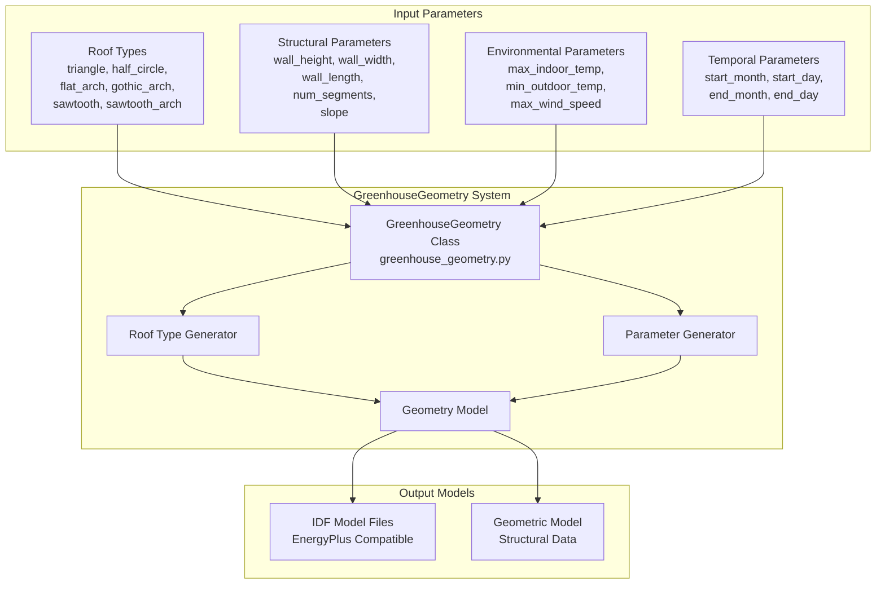
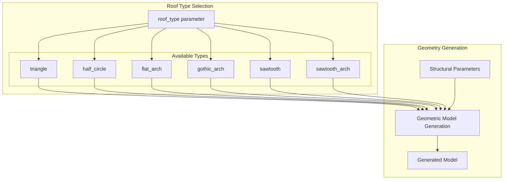
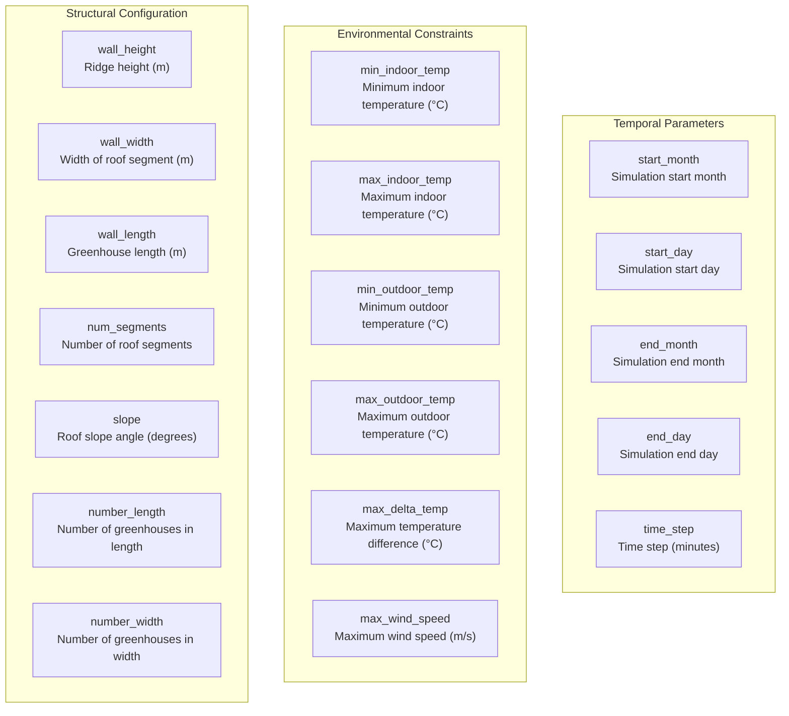
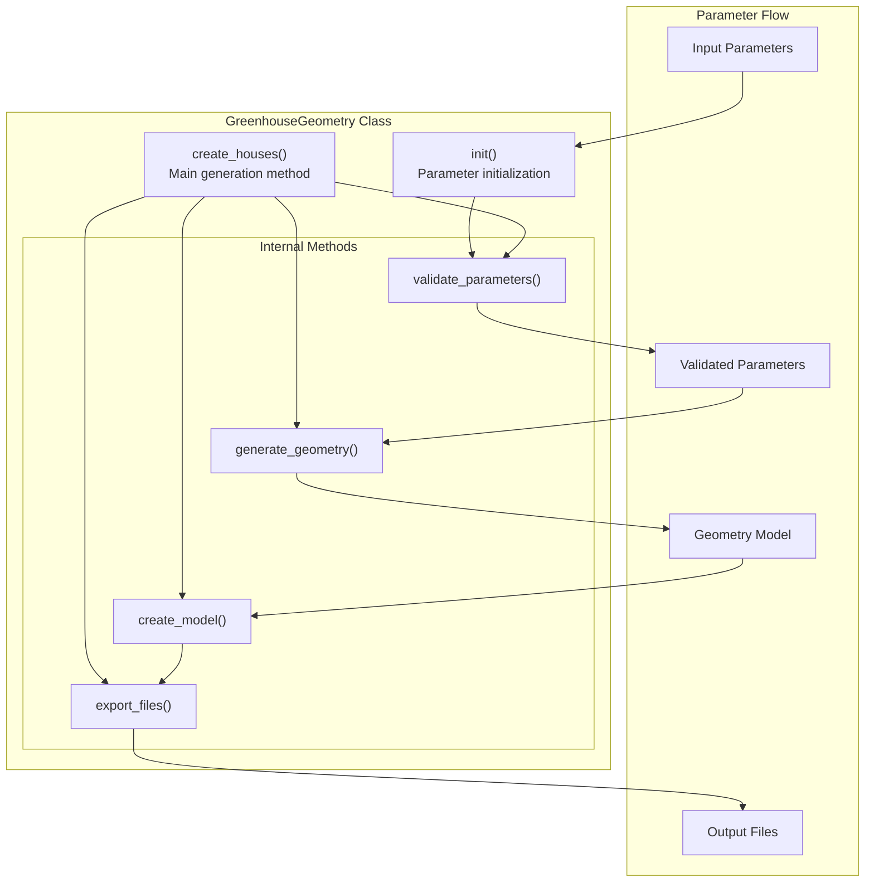
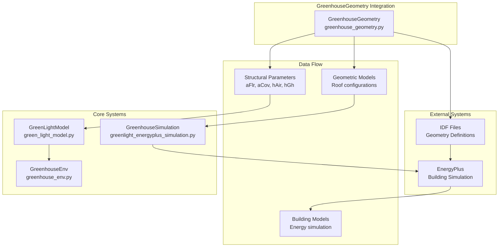

# GreenhouseGeometry

> **Relevant source files**
> * [README.md](https://github.com/greenpeer/GreenLightPlus/blob/262399d9/README.md)

The GreenhouseGeometry system provides structural modeling capabilities for generating geometric models of different greenhouse structures. This component is responsible for creating detailed geometric representations of greenhouses with various roof configurations, which serve as the foundation for environmental simulations and energy analysis within the GreenLightPlus framework.

For information about the core simulation engine that uses these geometric models, see [GreenLightModel](/greenpeer/GreenLightPlus/2.1-greenlightmodel). For details about EnergyPlus integration that leverages these geometric structures, see [GreenhouseSimulation](/greenpeer/GreenLightPlus/2.2-greenhousesimulation).

## System Overview

The GreenhouseGeometry system centers around the `GreenhouseGeometry` class, which generates parametric greenhouse models with six different roof types. The system provides standardized geometric parameters that can be consumed by other components in the GreenLightPlus ecosystem for simulation and analysis.



**Sources**: [README.md L42](https://github.com/greenpeer/GreenLightPlus/blob/262399d9/README.md#L42-L42)

 [README.md L100-L159](https://github.com/greenpeer/GreenLightPlus/blob/262399d9/README.md#L100-L159)

## Supported Roof Types

The GreenhouseGeometry system supports six distinct roof configurations, each optimized for different structural, environmental, and economic requirements:

| Roof Type | Identifier | Characteristics |
| --- | --- | --- |
| Triangle | `triangle` | Simple peaked roof with linear slopes |
| Semi-circular | `half_circle` | Curved roof with semicircular profile |
| Flat Arch | `flat_arch` | Arched roof with flattened profile |
| Gothic Arch | `gothic_arch` | Pointed arch with traditional gothic profile |
| Sawtooth | `sawtooth` | Multiple triangular segments in sawtooth pattern |
| Sawtooth Arch | `sawtooth_arch` | Arched segments in sawtooth configuration |



**Sources**: [README.md L113-L120](https://github.com/greenpeer/GreenLightPlus/blob/262399d9/README.md#L113-L120)

 [README.md L32](https://github.com/greenpeer/GreenLightPlus/blob/262399d9/README.md#L32-L32)

## Core Parameters

The GreenhouseGeometry class accepts a comprehensive set of parameters that define the structural, environmental, and temporal characteristics of the greenhouse model:

### Structural Parameters



**Sources**: [README.md L125-L155](https://github.com/greenpeer/GreenLightPlus/blob/262399d9/README.md#L125-L155)

## Class Structure and Methods

The GreenhouseGeometry class follows a structured initialization and generation pattern:



**Sources**: [README.md L134-L158](https://github.com/greenpeer/GreenLightPlus/blob/262399d9/README.md#L134-L158)

## Integration with Core Systems

The GreenhouseGeometry system integrates with other GreenLightPlus components through standardized interfaces:



**Sources**: [README.md L42](https://github.com/greenpeer/GreenLightPlus/blob/262399d9/README.md#L42-L42)

 [README.md L188-L233](https://github.com/greenpeer/GreenLightPlus/blob/262399d9/README.md#L188-L233)

## Usage Patterns

The typical workflow for using GreenhouseGeometry involves parameter configuration, instantiation, and model generation:

```

```

**Sources**: [README.md L109-L159](https://github.com/greenpeer/GreenLightPlus/blob/262399d9/README.md#L109-L159)

The GreenhouseGeometry system provides the foundational structural data that enables accurate environmental modeling and energy analysis throughout the GreenLightPlus simulation framework. By supporting multiple roof configurations and comprehensive parameter sets, it enables comparative analysis of different greenhouse designs and their impact on energy performance and crop yield.