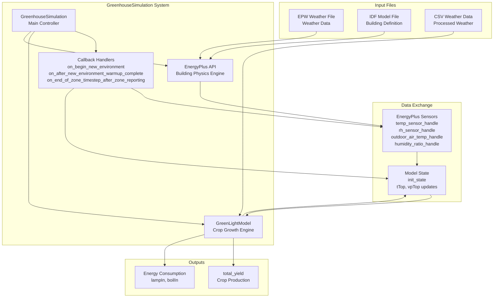
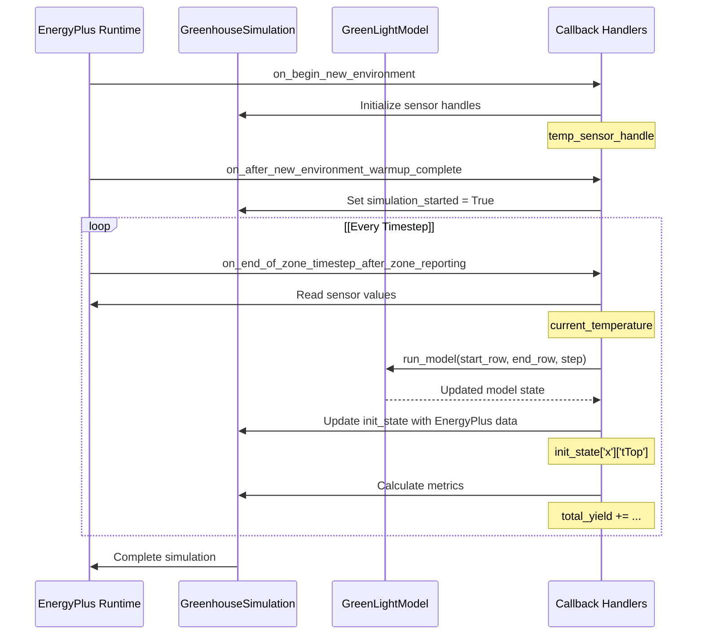

# GreenhouseSimulation

> **Relevant source files**
> * [README.md](https://github.com/greenpeer/GreenLightPlus/blob/262399d9/README.md)
> * [core/greenlight_energyplus_simulation.py](https://github.com/greenpeer/GreenLightPlus/blob/262399d9/core/greenlight_energyplus_simulation.py)

The `GreenhouseSimulation` component provides EnergyPlus integration for detailed building energy analysis within greenhouse simulations. This component enables co-simulation between the GreenLight crop growth model and EnergyPlus building physics engine, allowing for comprehensive energy consumption analysis and more accurate environmental modeling.

For information about the core greenhouse simulation engine without EnergyPlus integration, see [GreenLightModel](/greenpeer/GreenLightPlus/2.1-greenlightmodel). For reinforcement learning applications using this component, see [GreenhouseEnv](/greenpeer/GreenLightPlus/2.3-greenhouseenv).

## System Architecture

The `GreenhouseSimulation` system operates as a bridge between the GreenLight model and EnergyPlus, orchestrating data exchange during runtime simulation cycles.

### Component Overview



**EnergyPlus Integration Architecture**
This diagram shows how `GreenhouseSimulation` coordinates between EnergyPlus and GreenLight components, managing data flow through callback handlers and sensor interfaces.

Sources: [core/greenlight_energyplus_simulation.py L1-L233](https://github.com/greenpeer/GreenLightPlus/blob/262399d9/core/greenlight_energyplus_simulation.py#L1-L233)

### Data Flow During Simulation



**Simulation Data Exchange Sequence**
This diagram illustrates the runtime data exchange between EnergyPlus and GreenLight during co-simulation, showing specific callback methods and data variables.

Sources: [core/greenlight_energyplus_simulation.py L94-L207](https://github.com/greenpeer/GreenLightPlus/blob/262399d9/core/greenlight_energyplus_simulation.py#L94-L207)

## Key Components

### GreenhouseSimulation Class

The main `GreenhouseSimulation` class coordinates the co-simulation process and manages data exchange between systems.

| Component | Type | Purpose |
| --- | --- | --- |
| `api` | EnergyPlusAPI | Interface to EnergyPlus runtime |
| `model` | GreenLightModel | Crop growth simulation engine |
| `init_state` | dict | Model parameters and current state |
| `callback handlers` | methods | EnergyPlus event processors |

**Initialization Parameters**

The class constructor accepts these key parameters:

```python
def __init__(self, api, epw_path, idf_path, csv_path, output_directory, 
             first_day, season_length, isMature=False)
```

| Parameter | Type | Description |
| --- | --- | --- |
| `api` | EnergyPlusAPI | EnergyPlus API instance |
| `epw_path` | str | Path to weather file |
| `idf_path` | str | Path to building model file |
| `csv_path` | str | Path to processed weather data |
| `output_directory` | str | EnergyPlus output directory |
| `first_day` | int | Start day of year |
| `season_length` | int | Simulation duration in days |
| `isMature` | bool | Crop maturity status |

Sources: [core/greenlight_energyplus_simulation.py L15-L92](https://github.com/greenpeer/GreenLightPlus/blob/262399d9/core/greenlight_energyplus_simulation.py#L15-L92)

### Callback Handler System

The simulation uses three callback methods to handle different phases of EnergyPlus execution:

#### on_begin_new_environment

Initializes sensor handles at simulation start.

```python
def on_begin_new_environment(self, state):
    self.temp_sensor_handle = self.api.exchange.get_variable_handle(
        state, "Zone Air Temperature", "GREENHOUSE ZONE ROOF")
    self.rh_sensor_handle = self.api.exchange.get_variable_handle(
        state, "Zone Air Relative Humidity", "GREENHOUSE ZONE ROOF")
    # Additional sensor initialization...
```

#### on_after_new_environment_warmup_complete

Sets simulation state after EnergyPlus warmup period.

#### on_end_of_zone_timestep_after_zone_reporting

Processes data exchange at each timestep, including:

* Reading EnergyPlus sensor values
* Running GreenLight model with current data
* Updating model state with EnergyPlus outputs
* Calculating energy and yield metrics

Sources: [core/greenlight_energyplus_simulation.py L94-L207](https://github.com/greenpeer/GreenLightPlus/blob/262399d9/core/greenlight_energyplus_simulation.py#L94-L207)

## Data Exchange Mechanism

### Sensor Data Integration

The system reads specific EnergyPlus variables and maps them to GreenLight model states:

| EnergyPlus Variable | Handle | GreenLight State | Purpose |
| --- | --- | --- | --- |
| `Zone Air Temperature` | `temp_sensor_handle` | `tTop[-1][-1]` | Indoor air temperature |
| `Zone Air Humidity Ratio` | `humidity_ratio_handle` | `vpTop[-1][-1]` | Indoor vapor pressure |
| `Site Outdoor Air Drybulb Temperature` | `outdoor_air_temp_handle` | - | Reference temperature |

### State Update Process

At each timestep, the system performs these data exchanges:

1. **Read EnergyPlus sensors**: Extract current environmental values
2. **Calculate derived values**: Convert humidity ratio to vapor pressure using atmospheric pressure
3. **Update GreenLight state**: Replace model state values with EnergyPlus outputs
4. **Run GreenLight model**: Execute crop growth simulation with updated conditions
5. **Accumulate metrics**: Track energy consumption and yield over time

Sources: [core/greenlight_energyplus_simulation.py L132-L207](https://github.com/greenpeer/GreenLightPlus/blob/262399d9/core/greenlight_energyplus_simulation.py#L132-L207)

## Simulation Execution

### Runtime Configuration

The simulation executes through the `run()` method, which:

1. Creates EnergyPlus state manager
2. Registers callback functions
3. Executes EnergyPlus with specified parameters

```python
def run(self):
    state = self.api.state_manager.new_state()
    
    # Register callbacks
    self.api.runtime.callback_begin_new_environment(
        state, self.on_begin_new_environment)
    self.api.runtime.callback_after_new_environment_warmup_complete(
        state, self.on_after_new_environment_warmup_complete)
    self.api.runtime.callback_end_zone_timestep_after_zone_reporting(
        state, self.on_end_of_zone_timestep_after_zone_reporting)
    
    # Execute simulation
    self.api.runtime.run_energyplus(
        state, ["-w", self.epw_path, "-d", self.output_directory, 
                "-r", "-x", "-m", self.idf_path])
```

### Results Extraction

Results are retrieved through the `get_results()` method, returning:

* `total_yield`: Accumulated crop production (kg/m²)
* `lampIn`: Lighting energy consumption (MJ/m²)
* `boilIn`: Heating energy consumption (MJ/m²)

Sources: [core/greenlight_energyplus_simulation.py L208-L232](https://github.com/greenpeer/GreenLightPlus/blob/262399d9/core/greenlight_energyplus_simulation.py#L208-L232)

## Model Parameters

### Default Greenhouse Structure

The system uses predefined greenhouse structural parameters optimized for typical commercial greenhouse configurations:

| Parameter | Value | Unit | Description |
| --- | --- | --- | --- |
| `aFlr` | 668 | m² | Floor area |
| `aCov` | 1405 | m² | Cover area including walls |
| `hAir` | 6.5 | m | Main compartment height |
| `hGh` | 6.905 | m | Mean greenhouse height |
| `aRoof` | 78 | m² | Maximum roof ventilation area |
| `pBoil` | 200,400 | W | Total boiler capacity |

### Control Settings

Default control parameters for greenhouse operation:

| Parameter | Value | Unit | Description |
| --- | --- | --- | --- |
| `co2SpDay` | 1000 | ppm | CO₂ setpoint during light period |
| `tSpNight` | 18.5 | °C | Temperature setpoint for night |
| `tSpDay` | 19.5 | °C | Temperature setpoint for day |
| `rhMax` | 87 | % | Maximum relative humidity |
| `lampsOn` | 0 | h | Lamp activation time |
| `lampsOff` | 18 | h | Lamp deactivation time |

Sources: [core/greenlight_energyplus_simulation.py L52-L92](https://github.com/greenpeer/GreenLightPlus/blob/262399d9/core/greenlight_energyplus_simulation.py#L52-L92)

## Integration Dependencies

The `GreenhouseSimulation` component requires integration with several supporting modules:

* **GreenLightModel**: Core crop simulation engine from [green_light_model.py](https://github.com/greenpeer/GreenLightPlus/blob/262399d9/green_light_model.py)
* **Service Functions**: Energy calculation utilities from [service_functions/funcs.py](https://github.com/greenpeer/GreenLightPlus/blob/262399d9/service_functions/funcs.py)
* **EnergyPlus API**: External building simulation engine
* **Weather Processing**: EPW to CSV conversion utilities

This component serves as the integration layer enabling comprehensive greenhouse energy analysis through the combination of crop growth modeling and building physics simulation.

Sources: [core/greenlight_energyplus_simulation.py L11-L12](https://github.com/greenpeer/GreenLightPlus/blob/262399d9/core/greenlight_energyplus_simulation.py#L11-L12)

 [README.md L288-L340](https://github.com/greenpeer/GreenLightPlus/blob/262399d9/README.md#L288-L340)